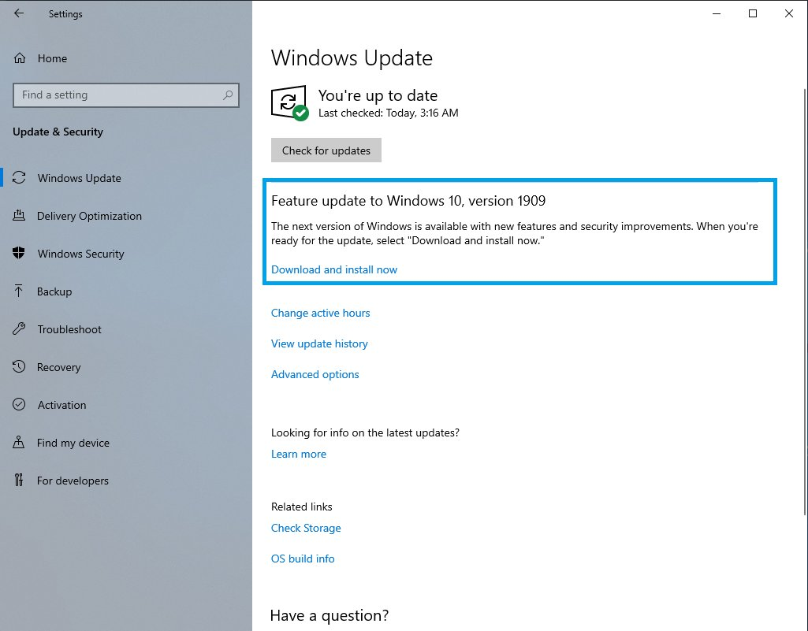
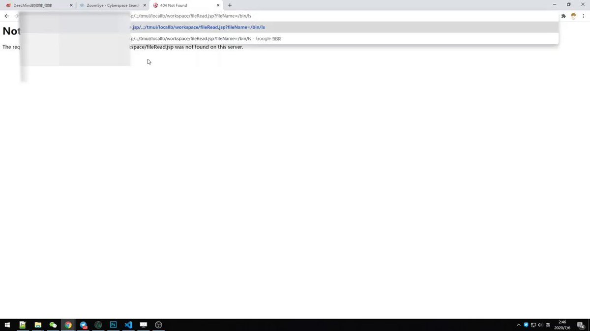
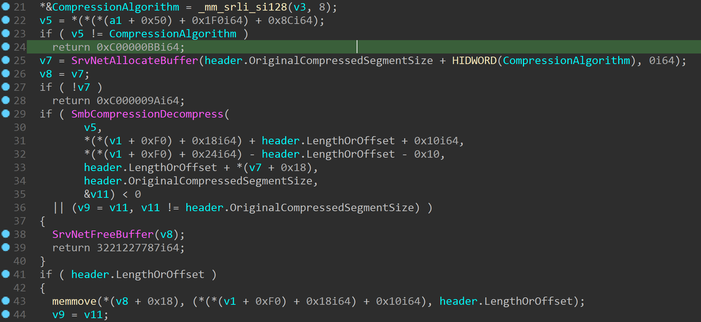
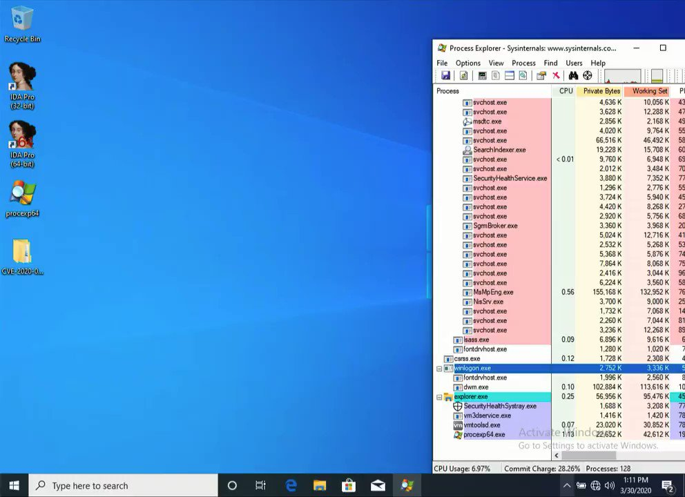

# hoangkien_1020
**https://twitter.com/hoangkien_1020/status/1298473776653328384 _at Wed Aug 26 04:14:07 +0000 2020_**
<blockquote>
My next CVE in Joomla to RCE:
CVE-2020-24597: Directory traversal in com_media to RCE
PoC:
https://t.co/uZQDZVRuIg
</blockquote>

* https://github.com/HoangKien1020/CVE-2020-24597

<table><tr>
<td>Quotes: <code>0</code></td>
<td>Replies: <code>0</code></td>
<td>Retweets: <code>0</code></td>
<td>Favorites: <code>0</code></td>
</tr></table>

---
# edwardzpeng
**https://twitter.com/edwardzpeng/status/1298173366692536320 _at Tue Aug 25 08:20:24 +0000 2020_**
<blockquote>
It’s not a good option to disclose 0day in public. But when vendor chooses to ignore your reports, you have no other choice.  Publishing two info leak vulnerabilities we found last month which Microsoft refuse to fix them. https://t.co/Bpx4buWxJL
</blockquote>

* https://github.com/hhlxf/USO_Info_Leak

<table><tr>
<td>Quotes: <code>5</code></td>
<td>Replies: <code>10</code></td>
<td>Retweets: <code>172</code></td>
<td>Favorites: <code>336</code></td>
</tr></table>

---
# iamelli0t
**https://twitter.com/iamelli0t/status/1298092483407093761 _at Tue Aug 25 02:59:00 +0000 2020_**
<blockquote>
My analysis of the recent Internet Explorer zero-day vulnerability, CVE-2020-1380

https://t.co/qo21pj0xii
</blockquote>

* https://www.trendmicro.com/en_us/research/20/h/cve-2020-1380-analysis-of-recently-fixed-ie-zero-day.html

<table><tr>
<td>Quotes: <code>4</code></td>
<td>Replies: <code>2</code></td>
<td>Retweets: <code>81</code></td>
<td>Favorites: <code>153</code></td>
</tr></table>

---
# binitamshah
**https://twitter.com/binitamshah/status/1297524859623243777 _at Sun Aug 23 13:23:28 +0000 2020_**
<blockquote>
Finding New Bluetooth Low Energy Exploits via Reverse Engineering Multiple Vendors Firmwares : https://t.co/TAYqDXIRGJ 

Slides : https://t.co/M92krBOitZ  credits @VeronicaKovah
</blockquote>

* https://www.youtube.com/watch?v=MRRkBWv4VVU
* https://github.com/darkmentorllc/publications/blob/master/2020/TI_SILABS_BLE_RCEs/slides_TI_SILABS_BLE_RCEs_v1.0.0.pdf

<table><tr>
<td>Quotes: <code>1</code></td>
<td>Replies: <code>2</code></td>
<td>Retweets: <code>35</code></td>
<td>Favorites: <code>75</code></td>
</tr></table>

---
# 3XS0
**https://twitter.com/3XS0/status/1297442644172341248 _at Sun Aug 23 07:56:46 +0000 2020_**
<blockquote>
CVE-2020-1571 Windows Setup Elevation of Privileges Bypass 0day  https://t.co/Gpu6sIPmQT  #Pentesting #Windows #Vulnerability #CVE #Infosec https://t.co/KfApof0Ggu
</blockquote>

* https://github.com/klinix5/Windows-Setup-EoP

<table><tr>
<td></td>
<td></td>
<td></td>
<td></td>
</tr></table>
<table><tr>
<td>Quotes: <code>0</code></td>
<td>Replies: <code>0</code></td>
<td>Retweets: <code>0</code></td>
<td>Favorites: <code>1</code></td>
</tr></table>

---
# nuria_imeq
**https://twitter.com/nuria_imeq/status/1296937759547035653 _at Fri Aug 21 22:30:32 +0000 2020_**
<blockquote>
GitHub - spaceraccoon/CVE-2020-10665: POC for CVE-2020-10665 Docker Desktop Local Privilege Escalation https://t.co/bSHAZuvPNu
</blockquote>

* https://github.com/spaceraccoon/CVE-2020-10665

<table><tr>
<td>Quotes: <code>0</code></td>
<td>Replies: <code>0</code></td>
<td>Retweets: <code>0</code></td>
<td>Favorites: <code>0</code></td>
</tr></table>

---
# perito_inf
**https://twitter.com/perito_inf/status/1296800192256147456 _at Fri Aug 21 13:23:53 +0000 2020_**
<blockquote>
CVE-2020-1571 : Windows Setup Elevation of Privileges Bypass 0day

Affected Version:
Windows 10 1803/1809/1903/1909/2004

https://t.co/uH5DBVXEhT
</blockquote>

* https://github.com/klinix5/Windows-Setup-EoP

<table><tr>
<td>Quotes: <code>1</code></td>
<td>Replies: <code>1</code></td>
<td>Retweets: <code>26</code></td>
<td>Favorites: <code>45</code></td>
</tr></table>

---
# hackyzh
**https://twitter.com/hackyzh/status/1296687587873230848 _at Fri Aug 21 05:56:26 +0000 2020_**
<blockquote>
Finally,he could rce on windows 2008 successful by CVE-2020-1350.This chain spent him too much time.👍
</blockquote>

<table><tr>
<td>Quotes: <code>1</code></td>
<td>Replies: <code>1</code></td>
<td>Retweets: <code>19</code></td>
<td>Favorites: <code>61</code></td>
</tr></table>

---
# YanZiShuang
**https://twitter.com/YanZiShuang/status/1296679004343164928 _at Fri Aug 21 05:22:20 +0000 2020_**
<blockquote>
#DNS #WindowsServer #CVE #EXPLOIT
DNS 漏洞 CVE-2020-1350 EXPLOIT 新鲜出炉 确定可以导致蠕虫

关于DNS的研究报告在近期可能会分享

堆风水-&gt;堆喷射-&gt;相关数据结构设置-&gt;(利用堆上数据结构任意地址写||信息泄露)-&gt;覆写全局函数指针-&gt;ShellCode 执行 https://t.co/VNfv2CYyrk
</blockquote>

<table><tr>
<td></td>
</tr></table>
<table><tr>
<td>Quotes: <code>7</code></td>
<td>Replies: <code>9</code></td>
<td>Retweets: <code>105</code></td>
<td>Favorites: <code>291</code></td>
</tr></table>

---
# Nahr3n
**https://twitter.com/Nahr3n/status/1296525339292774400 _at Thu Aug 20 19:11:43 +0000 2020_**
<blockquote>
CVE-2020-10665:
#Docker (Desktop Enterprise before 2.1.0.9, 
Desktop for Windows Stable before 2.2.0.4/2.2.2.0) - Local Privilege Escalation (PoC)
https://t.co/CgC9Gsfa9w
</blockquote>

* https://github.com/spaceraccoon/CVE-2020-10665

<table><tr>
<td>Quotes: <code>0</code></td>
<td>Replies: <code>0</code></td>
<td>Retweets: <code>0</code></td>
<td>Favorites: <code>2</code></td>
</tr></table>

---
# jedisct1
**https://twitter.com/jedisct1/status/1296071824657326081 _at Wed Aug 19 13:09:37 +0000 2020_**
<blockquote>
RT @neosysforensics: New blog and new post :)

CVE-2020-1337: my two cents
https://t.co/YxZOdG5rSA

Also in spanish
https://t.co/x08zMvkGSK…
</blockquote>

* https://blog.hiveminds.es/en/posts/cve-2020-1337_my_two_cents/
* https://blog.hiveminds.es/es/posts/cve-2020-1337_mis_dos_centavos/

<table><tr>
<td>Quotes: <code>0</code></td>
<td>Replies: <code>0</code></td>
<td>Retweets: <code>53</code></td>
<td>Favorites: <code>0</code></td>
</tr></table>

---
# neosysforensics
**https://twitter.com/neosysforensics/status/1296045753610182657 _at Wed Aug 19 11:26:01 +0000 2020_**
<blockquote>
New blog and new post :)

CVE-2020-1337: my two cents
https://t.co/YxZOdG5rSA

Also in spanish
https://t.co/x08zMvkGSK

Thx to @h4ng3r and the rest of the crew!
</blockquote>

* https://blog.hiveminds.es/en/posts/cve-2020-1337_my_two_cents/
* https://blog.hiveminds.es/es/posts/cve-2020-1337_mis_dos_centavos/

<table><tr>
<td>Quotes: <code>2</code></td>
<td>Replies: <code>1</code></td>
<td>Retweets: <code>53</code></td>
<td>Favorites: <code>67</code></td>
</tr></table>

---
# nuria_imeq
**https://twitter.com/nuria_imeq/status/1295795693811007489 _at Tue Aug 18 18:52:22 +0000 2020_**
<blockquote>
GitHub - klinix5
CVE-2020-1571 Windows Setup Elevation of Privileges Bypass 0day https://t.co/lkOxCNcAkU
</blockquote>

* https://github.com/klinix5/Windows-Setup-EoP

<table><tr>
<td>Quotes: <code>0</code></td>
<td>Replies: <code>0</code></td>
<td>Retweets: <code>3</code></td>
<td>Favorites: <code>4</code></td>
</tr></table>

---
# ihack4falafel
**https://twitter.com/ihack4falafel/status/1295775079855529984 _at Tue Aug 18 17:30:28 +0000 2020_**
<blockquote>
[Blog] Windows AppX Deployment Service Local Privilege Escalation (CVE-2020-1488) https://t.co/HfsOdyAtKM
</blockquote>

* https://tinyurl.com/yy5va7py

<table><tr>
<td>Quotes: <code>2</code></td>
<td>Replies: <code>1</code></td>
<td>Retweets: <code>37</code></td>
<td>Favorites: <code>53</code></td>
</tr></table>

---
# binitamshah
**https://twitter.com/binitamshah/status/1295406895172182016 _at Mon Aug 17 17:07:25 +0000 2020_**
<blockquote>
VirtualDynamicAnalysis : A basic android pentest environment to instrument apps without root or repackaging an app : https://t.co/1aMMiphyQD 

Dynamic analysis of apps inside Android Cloning apps – Part 1 : https://t.co/BMmGMp88Fw
</blockquote>

* https://github.com/darvincisec/VirtualDynamicAnalysis
* https://darvincitech.wordpress.com/2020/07/18/all-your-crypto-keys-belongs-to-me-in-android-virtual-containers/

<table><tr>
<td>Quotes: <code>0</code></td>
<td>Replies: <code>0</code></td>
<td>Retweets: <code>30</code></td>
<td>Favorites: <code>42</code></td>
</tr></table>

---
# binitamshah
**https://twitter.com/binitamshah/status/1295398366239535104 _at Mon Aug 17 16:33:32 +0000 2020_**
<blockquote>
RT @thezdi: Windows Print Spooler Patch Bypass Re-Enables Persistent Backdoor. @HexKitchen details how the patch for CVE-2020-1048 was easi…
</blockquote>

<table><tr>
<td>Quotes: <code>0</code></td>
<td>Replies: <code>0</code></td>
<td>Retweets: <code>66</code></td>
<td>Favorites: <code>0</code></td>
</tr></table>

---
# ddouhine
**https://twitter.com/ddouhine/status/1295372365975650305 _at Mon Aug 17 14:50:13 +0000 2020_**
<blockquote>
1st @geutebruck exploit module landed in @metasploit 😎

"(...) remote code execution as the root user, allowing them complete control over the affected camera."

CVE-2020-16205

Users -&gt; update to 1.12.0.27

Thx @tekwizz123 for the work behind the scenes

https://t.co/zGwyuKYb6K
</blockquote>

* https://github.com/rapid7/metasploit-framework/pull/13986

<table><tr>
<td>Quotes: <code>0</code></td>
<td>Replies: <code>1</code></td>
<td>Retweets: <code>2</code></td>
<td>Favorites: <code>4</code></td>
</tr></table>

---
# VP_helena
**https://twitter.com/VP_helena/status/1295155240677920768 _at Mon Aug 17 00:27:26 +0000 2020_**
<blockquote>
CVE-2020-0796 RCE PoC source #SMBGhost 
https://t.co/ayuWMYFPHI
</blockquote>

* https://github.com/chompie1337/SMBGhost_RCE_PoC

<table><tr>
<td>Quotes: <code>0</code></td>
<td>Replies: <code>0</code></td>
<td>Retweets: <code>1</code></td>
<td>Favorites: <code>2</code></td>
</tr></table>

---
# _can1357
**https://twitter.com/_can1357/status/1295103431145922562 _at Sun Aug 16 21:01:34 +0000 2020_**
<blockquote>
I've decided to publish my VMProtect devirtualizer working for every 3.x version up to the latest 3.6 along with the experimental x64 compiler.

It can be found at https://t.co/zJQHjFG46e licensed under GPL-3, hopefully it attracts some interest in the VTIL project, enjoy :)
</blockquote>

* https://github.com/can1357/NoVmp

<table><tr>
<td>Quotes: <code>19</code></td>
<td>Replies: <code>15</code></td>
<td>Retweets: <code>413</code></td>
<td>Favorites: <code>992</code></td>
</tr></table>

---
# jedisct1
**https://twitter.com/jedisct1/status/1295073948657504257 _at Sun Aug 16 19:04:25 +0000 2020_**
<blockquote>
A Guide On WireGuard/DNSCrypt/SSH/Honeypot Implementation on OVH
https://t.co/bK7P2wWhCb
</blockquote>

* https://github.com/BetterWayElectronics/secure-wireguard-implementation

<table><tr>
<td>Quotes: <code>0</code></td>
<td>Replies: <code>0</code></td>
<td>Retweets: <code>11</code></td>
<td>Favorites: <code>33</code></td>
</tr></table>

---
# Nahr3n
**https://twitter.com/Nahr3n/status/1294887959829848064 _at Sun Aug 16 06:45:22 +0000 2020_**
<blockquote>
CVE-2020-1571: 
Windows 10 1803/1809/1903/1909/2004
Setup Elevation of Privileges Bypass #0day (#PoC)
https://t.co/UvBxC6ZQLJ
</blockquote>

* https://github.com/klinix5/Windows-Setup-EoP

<table><tr>
<td>Quotes: <code>0</code></td>
<td>Replies: <code>0</code></td>
<td>Retweets: <code>2</code></td>
<td>Favorites: <code>1</code></td>
</tr></table>

---
# ptracesecurity
**https://twitter.com/ptracesecurity/status/1294675304871534592 _at Sat Aug 15 16:40:21 +0000 2020_**
<blockquote>
CVE-2020-1571 Windows Setup Elevation of Privileges Bypass 0day  https://t.co/cYoe2PnKZT  #Pentesting #Windows #Vulnerability #CVE #Infosec https://t.co/3H38QKJWA0
</blockquote>

* https://github.com/klinix5/Windows-Setup-EoP

<table><tr>
<td></td>
<td></td>
<td></td>
<td></td>
</tr></table>
<table><tr>
<td>Quotes: <code>2</code></td>
<td>Replies: <code>0</code></td>
<td>Retweets: <code>92</code></td>
<td>Favorites: <code>149</code></td>
</tr></table>

---
# ptracesecurity
**https://twitter.com/ptracesecurity/status/1294497627975950341 _at Sat Aug 15 04:54:19 +0000 2020_**
<blockquote>
Discovery and analysis of a Windows PhoneBook Use-After-Free vulnerability (CVE-2020-1530)  https://t.co/W6wNhdj9oF  #Pentesting #Windows #Vulnerability #CVE #Infosec https://t.co/QcNffwBNde
</blockquote>

* https://symeonp.github.io/2020/12/08/phonebook-uaf-analysis.html

<table><tr>
<td></td>
<td></td>
<td></td>
<td></td>
</tr></table>
<table><tr>
<td>Quotes: <code>1</code></td>
<td>Replies: <code>1</code></td>
<td>Retweets: <code>24</code></td>
<td>Favorites: <code>32</code></td>
</tr></table>

---
# KLINIX5
**https://twitter.com/KLINIX5/status/1294278597306388482 _at Fri Aug 14 14:23:58 +0000 2020_**
<blockquote>
Hey MS, here's a bad tweet for u here's the bypass for CVE-2020-1571 as a 0day, I've written the full exploit + an explanation of what exactly happening 
https://t.co/TDg35EwrAx
</blockquote>

* https://github.com/klinix5/Windows-Setup-EoP

<table><tr>
<td>Quotes: <code>0</code></td>
<td>Replies: <code>0</code></td>
<td>Retweets: <code>0</code></td>
<td>Favorites: <code>0</code></td>
</tr></table>

---
# RopHangmans
**https://twitter.com/RopHangmans/status/1293894060973928449 _at Thu Aug 13 12:55:58 +0000 2020_**
<blockquote>
PoC for CVE-2020-17506 Artica Auth Bypass &amp; RCE:
https://t.co/TzFoOdqlTz
</blockquote>

* https://github.com/hangmansROP/proof-of-concepts/blob/master/CVE-2020-17506-artica-rce.py

<table><tr>
<td>Quotes: <code>0</code></td>
<td>Replies: <code>0</code></td>
<td>Retweets: <code>5</code></td>
<td>Favorites: <code>2</code></td>
</tr></table>

---
# jedisct1
**https://twitter.com/jedisct1/status/1293632271749087232 _at Wed Aug 12 19:35:42 +0000 2020_**
<blockquote>
RT @TheHackersNews: Here are technical details for a new Windows Remote Access elevation of privilege #vulnerability (CVE-2020-1530) for wh…
</blockquote>

<table><tr>
<td>Quotes: <code>0</code></td>
<td>Replies: <code>0</code></td>
<td>Retweets: <code>117</code></td>
<td>Favorites: <code>0</code></td>
</tr></table>

---
# TheHackersNews
**https://twitter.com/TheHackersNews/status/1293609136605675520 _at Wed Aug 12 18:03:46 +0000 2020_**
<blockquote>
Here are technical details for a new Windows Remote Access elevation of privilege #vulnerability (CVE-2020-1530) for which #Microsoft released a security patch yesterday.

https://t.co/QaL3a1DbzC

Advisory: https://t.co/Nsc5X1cc5m

#PatchTuesday https://t.co/QTQajyZluF
</blockquote>

* https://symeonp.github.io/2020/12/08/phonebook-uaf-analysis.html
* https://portal.msrc.microsoft.com/en-US/security-guidance/advisory/CVE-2020-1530

<table><tr>
<td></td>
</tr></table>
<table><tr>
<td>Quotes: <code>5</code></td>
<td>Replies: <code>1</code></td>
<td>Retweets: <code>117</code></td>
<td>Favorites: <code>197</code></td>
</tr></table>

---
# j00ru
**https://twitter.com/j00ru/status/1293600840461299712 _at Wed Aug 12 17:30:48 +0000 2020_**
<blockquote>
A direct link to the exploit is here: https://t.co/BzxsJAs5uJ

And a visualization of the ASLR bypass #3 mentioned in the post is shown in the GIF below (relevant frames 33-57): https://t.co/3SeDAT5tdl
</blockquote>

* https://github.com/googleprojectzero/SkCodecFuzzer/tree/master/mms_exploit

<table><tr>
<td></td>
</tr></table>
<table><tr>
<td>Quotes: <code>0</code></td>
<td>Replies: <code>0</code></td>
<td>Retweets: <code>12</code></td>
<td>Favorites: <code>43</code></td>
</tr></table>

---
# symeonp
**https://twitter.com/symeonp/status/1293531800325754891 _at Wed Aug 12 12:56:28 +0000 2020_**
<blockquote>
Yesterday's Patch Tuesday included a PhoneBook use-after-free vulnerability (CVE-2020-1530) I reported. I decided to do a step-by-step write up on how I discovered it. It covers some basic sample gathering, harnessing, fuzzing, analysis and exploitation https://t.co/Uvyvy8CqX1
</blockquote>

* https://symeonp.github.io/2020/12/08/phonebook-uaf-analysis.html

<table><tr>
<td>Quotes: <code>4</code></td>
<td>Replies: <code>5</code></td>
<td>Retweets: <code>156</code></td>
<td>Favorites: <code>350</code></td>
</tr></table>

---
# 44CON
**https://twitter.com/44CON/status/1293514331523436544 _at Wed Aug 12 11:47:03 +0000 2020_**
<blockquote>
(From https://t.co/OT552U6KvT): RCE PoC for CVE-2020-0796 "SMBGhost" https://t.co/iExMmv6sZE https://t.co/d9if2hQugD
</blockquote>

* http://github.com
* http://dlvr.it/RdVJPR

<table><tr>
<td></td>
</tr></table>
<table><tr>
<td>Quotes: <code>0</code></td>
<td>Replies: <code>0</code></td>
<td>Retweets: <code>9</code></td>
<td>Favorites: <code>15</code></td>
</tr></table>

---
# matteomalvica
**https://twitter.com/matteomalvica/status/1293443946664857602 _at Wed Aug 12 07:07:22 +0000 2020_**
<blockquote>
Thrilled and psyched to introduce SNIcat!
This tool,made with 💟 by @mmarstrander and myself, bypasses most of TLS inspection devices such as ones from @F5Networks @PaloAltoNtwks @fortinet
Details here:
https://t.co/VwPSrB6g0k
PoC here:
https://t.co/DwFzjUC2LU
exfil responsibly🛸
</blockquote>

* https://www.mnemonic.no/blog/introducing-snicat
* https://github.com/mnemonic-no/SNIcat

<table><tr>
<td>Quotes: <code>5</code></td>
<td>Replies: <code>0</code></td>
<td>Retweets: <code>52</code></td>
<td>Favorites: <code>119</code></td>
</tr></table>

---
# ptracesecurity
**https://twitter.com/ptracesecurity/status/1293408837060501505 _at Wed Aug 12 04:47:51 +0000 2020_**
<blockquote>
Apache Tomcat RCE by deserialization (CVE-2020-9484) – write-up and exploit  https://t.co/PRJBBTvpRL  #Apache #Java #RCE #Explot #CyberSecurity #Infosec https://t.co/eIK7DCWHAe
</blockquote>

* https://www.redtimmy.com/java-hacking/apache-tomcat-rce-by-deserialization-cve-2020-9484-write-up-and-exploit/

<table><tr>
<td></td>
<td></td>
</tr></table>
<table><tr>
<td>Quotes: <code>4</code></td>
<td>Replies: <code>1</code></td>
<td>Retweets: <code>58</code></td>
<td>Favorites: <code>89</code></td>
</tr></table>

---
# USCERT_gov
**https://twitter.com/USCERT_gov/status/1293262564529508352 _at Tue Aug 11 19:06:37 +0000 2020_**
<blockquote>
Microsoft’s #PatchTuesday updates include patches for two vulnerabilities—CVE-2020-1380 and CVE-2020-1464—being actively exploited. Update ASAP to protect your systems. https://t.co/FEPH4f2y7S #Cyber #Cybersecurity #InfoSec
</blockquote>

* https://go.usa.gov/xfArr

<table><tr>
<td>Quotes: <code>11</code></td>
<td>Replies: <code>0</code></td>
<td>Retweets: <code>113</code></td>
<td>Favorites: <code>94</code></td>
</tr></table>

---
# thezdi
**https://twitter.com/thezdi/status/1293249558768746496 _at Tue Aug 11 18:14:56 +0000 2020_**
<blockquote>
Windows Print Spooler Patch Bypass Re-Enables Persistent Backdoor. @HexKitchen details how the patch for CVE-2020-1048 was easily bypassed and looks at the new patch released today to fix it. https://t.co/ayeIQC0CQV
</blockquote>

* https://bit.ly/33Qh3go

<table><tr>
<td>Quotes: <code>4</code></td>
<td>Replies: <code>1</code></td>
<td>Retweets: <code>66</code></td>
<td>Favorites: <code>117</code></td>
</tr></table>

---
# FlatL1ne
**https://twitter.com/FlatL1ne/status/1293209434345426945 _at Tue Aug 11 15:35:30 +0000 2020_**
<blockquote>
Apache Tomcat RCE by deserialization (CVE-2020-9484) – write-up and exploit

https://t.co/lmFgh6v6Gu
</blockquote>

* https://www.redtimmy.com/java-hacking/apache-tomcat-rce-by-deserialization-cve-2020-9484-write-up-and-exploit/

<table><tr>
<td>Quotes: <code>1</code></td>
<td>Replies: <code>0</code></td>
<td>Retweets: <code>23</code></td>
<td>Favorites: <code>67</code></td>
</tr></table>

---
# TheHackersNews
**https://twitter.com/TheHackersNews/status/1293182603751694336 _at Tue Aug 11 13:48:53 +0000 2020_**
<blockquote>
🔥 Watch Out! A new critical #vBulletin zero-day RCE #vulnerability and its PoC exploits have been publicly disclosed, allowing attackers to bypass patch for an old RCE bug (CVE-2019-16759) and remotely compromise sites.

Details — https://t.co/961xiq1BqC

#infosec #cybersecurity
</blockquote>

* https://thehackernews.com/2020/08/vBulletin-vulnerability-exploit.html

<table><tr>
<td>Quotes: <code>5</code></td>
<td>Replies: <code>1</code></td>
<td>Retweets: <code>67</code></td>
<td>Favorites: <code>76</code></td>
</tr></table>

---
# threatintelctr
**https://twitter.com/threatintelctr/status/1292871440589443072 _at Mon Aug 10 17:12:26 +0000 2020_**
<blockquote>
🚨 NEW: CVE-2020-7361 🚨 The EasyCorp ZenTao Pro application suffers from an OS command injection vulnerability in its '/pro/repo-create.html' component. After authenticating to the ZenTao dashboard, attackers may c... (click for more) Severity: HIGH https://t.co/3TZEFDBj6T
</blockquote>

* https://github.com/rapid7/metasploit-framework/pull/13828

<table><tr>
<td>Quotes: <code>0</code></td>
<td>Replies: <code>0</code></td>
<td>Retweets: <code>0</code></td>
<td>Favorites: <code>0</code></td>
</tr></table>

---
# jedisct1
**https://twitter.com/jedisct1/status/1292839166565322754 _at Mon Aug 10 15:04:11 +0000 2020_**
<blockquote>
Yet another grep, faster than the previous ones. After ag and rg, meet ug: https://t.co/pWeo52GmjA
</blockquote>

* https://github.com/Genivia/ugrep

<table><tr>
<td>Quotes: <code>0</code></td>
<td>Replies: <code>1</code></td>
<td>Retweets: <code>12</code></td>
<td>Favorites: <code>36</code></td>
</tr></table>

---
# Anastasis_King
**https://twitter.com/Anastasis_King/status/1292173547130036225 _at Sat Aug 08 18:59:15 +0000 2020_**
<blockquote>
CVE-2019-7609 : Exploit Kibana RCE on right way by python2 scripts

https://t.co/dPeckuqxet
</blockquote>

* https://github.com/kisec/CVE-2019-7609

<table><tr>
<td>Quotes: <code>0</code></td>
<td>Replies: <code>0</code></td>
<td>Retweets: <code>0</code></td>
<td>Favorites: <code>0</code></td>
</tr></table>

---
# BleepinComputer
**https://twitter.com/BleepinComputer/status/1292022789059248128 _at Sat Aug 08 09:00:12 +0000 2020_**
<blockquote>
The FBI warns of Iranian hackers actively attempting to exploit vulnerable F5 Big-IP ADC devices unpatched against the CVE-2020-5902 unauthenticated remote code execution flaw - @serghei
https://t.co/rcwTyZnqE6
</blockquote>

* https://www.bleepingcomputer.com/news/security/fbi-iranian-hackers-trying-to-exploit-critical-f5-big-ip-flaw/

<table><tr>
<td>Quotes: <code>3</code></td>
<td>Replies: <code>1</code></td>
<td>Retweets: <code>57</code></td>
<td>Favorites: <code>102</code></td>
</tr></table>

---
# threatintelctr
**https://twitter.com/threatintelctr/status/1291414386448326656 _at Thu Aug 06 16:42:37 +0000 2020_**
<blockquote>
🚨 NEW: CVE-2020-7361 🚨 The EasyCorp ZenTao Pro application suffers from an OS command injection vulnerability in its '/pro/repo-create.html' component. After authenticating to the ZenTao dashboard, attackers may c... (click for more)  https://t.co/3TZEFDBj6T
</blockquote>

* https://github.com/rapid7/metasploit-framework/pull/13828

<table><tr>
<td>Quotes: <code>0</code></td>
<td>Replies: <code>0</code></td>
<td>Retweets: <code>0</code></td>
<td>Favorites: <code>0</code></td>
</tr></table>

---
# OPOSEC
**https://twitter.com/OPOSEC/status/1291328173368631301 _at Thu Aug 06 11:00:02 +0000 2020_**
<blockquote>
Microsoft Edge Remote Code Execution (CVE-2018-8495). https://t.co/8oZXOxBU6q PoC: https://t.co/EIR3NrC5vm #Security #244 (2018)
</blockquote>

* https://leucosite.com/Microsoft-Edge-RCE/
* https://github.com/kmkz/exploit/blob/master/CVE-2018-8495.html

<table><tr>
<td>Quotes: <code>0</code></td>
<td>Replies: <code>0</code></td>
<td>Retweets: <code>0</code></td>
<td>Favorites: <code>1</code></td>
</tr></table>

---
# mobilesecurity_
**https://twitter.com/mobilesecurity_/status/1291264621534490626 _at Thu Aug 06 06:47:30 +0000 2020_**
<blockquote>
Breaking Samsung's Root of Trust - Exploiting Samsung S10 Secure Boot
#MobileSecurity #AndroidSecurity 
#BlackHat2020 [SLIDES] by @Jeffxx_Chao 
https://t.co/SDqIfhDz8m https://t.co/UzSZxH5TDL
</blockquote>

* https://github.com/TrapaSecurity/presentations/raw/master/us-20-Chao-Breaking-Samsung's-Root-of-Trust-Exploiting-Samsung-Secure-Boot.pdf

<table><tr>
<td></td>
</tr></table>
<table><tr>
<td>Quotes: <code>1</code></td>
<td>Replies: <code>0</code></td>
<td>Retweets: <code>38</code></td>
<td>Favorites: <code>94</code></td>
</tr></table>

---
# wugeej
**https://twitter.com/wugeej/status/1291184302672158720 _at Thu Aug 06 01:28:21 +0000 2020_**
<blockquote>
CVE-2020-13886 0day INTELBRAS TELEFONE IP TIP200/200 LITE &amp; TIP 300 - Local File Include

[ Proof Of Concept ]
URL parameter -&gt;http://HOST/cgi-bin/cgiServer.exx?page=

LFI payload -&gt; ../../../../etc/shadow

https://t.co/fQEOI2WZsF https://t.co/ixlAj26tAM
</blockquote>

* https://github.com/lucxssouza/CVE-2020-13886

<table><tr>
<td></td>
</tr></table>
<table><tr>
<td>Quotes: <code>1</code></td>
<td>Replies: <code>2</code></td>
<td>Retweets: <code>44</code></td>
<td>Favorites: <code>104</code></td>
</tr></table>

---
# maddiestone
**https://twitter.com/maddiestone/status/1291124059917266944 _at Wed Aug 05 21:28:58 +0000 2020_**
<blockquote>
Here are the slides from my @BlackHatEvents  talk "Reversing the Root: Identifying the Exploited Vulnerability in 0-days Used In-The-Wild".

https://t.co/k7nAYfAZeu https://t.co/wrC0VHol3f
</blockquote>

* https://github.com/maddiestone/ConPresentations/blob/master/BH2020.ReversingTheRoot.pdf

<table><tr>
<td></td>
</tr></table>
<table><tr>
<td>Quotes: <code>8</code></td>
<td>Replies: <code>8</code></td>
<td>Retweets: <code>144</code></td>
<td>Favorites: <code>404</code></td>
</tr></table>

---
# threatintelctr
**https://twitter.com/threatintelctr/status/1291104799887200257 _at Wed Aug 05 20:12:26 +0000 2020_**
<blockquote>
🚨 NEW: CVE-2020-15467 🚨 The administrative interface of Cohesive Networks vns3:vpn appliances before version 4.11.1 is vulnerable to authenticated remote code execution leading to server compromise. Severity: HIGH https://t.co/4SAW7mcnqr
</blockquote>

* https://github.com/fireeye/Vulnerability-Disclosures/blob/master/FEYE-2020-0007/FEYE-2020-0007.md

<table><tr>
<td>Quotes: <code>0</code></td>
<td>Replies: <code>0</code></td>
<td>Retweets: <code>0</code></td>
<td>Favorites: <code>0</code></td>
</tr></table>

---
# behindbreach
**https://twitter.com/behindbreach/status/1290860109053284353 _at Wed Aug 05 04:00:07 +0000 2020_**
<blockquote>
Apache Tomcat RCE by deserialization (CVE-2020-9484) - write-up and exploit https://t.co/YygbwhoXTd #vulnerability #collection #execution #cve_2020_9484 #apache #tomcat
</blockquote>

* https://behindthebreach.com/l/46

<table><tr>
<td>Quotes: <code>3</code></td>
<td>Replies: <code>0</code></td>
<td>Retweets: <code>64</code></td>
<td>Favorites: <code>119</code></td>
</tr></table>

---
# peterjson
**https://twitter.com/peterjson/status/1290687541188767745 _at Tue Aug 04 16:34:24 +0000 2020_**
<blockquote>
I have just finished the recent IBM Websphere RCE PoC (CVE-2020-4450). It's a nice chain and after all I have learnt many things! https://t.co/JWRiiy7MEM
</blockquote>

<table><tr>
<td></td>
</tr></table>
<table><tr>
<td>Quotes: <code>1</code></td>
<td>Replies: <code>4</code></td>
<td>Retweets: <code>32</code></td>
<td>Favorites: <code>107</code></td>
</tr></table>

---
# threatintelctr
**https://twitter.com/threatintelctr/status/1290651814971531266 _at Tue Aug 04 14:12:26 +0000 2020_**
<blockquote>
🚨 NEW: CVE-2020-15467 🚨 The administrative interface of Cohesive Networks vns3:vpn appliances before version 4.11.1 is vulnerable to authenticated remote code execution leading to server compromise. https://t.co/4SAW7lUMyT
</blockquote>

* https://github.com/fireeye/Vulnerability-Disclosures/blob/master/FEYE-2020-0007/FEYE-2020-0007.md

<table><tr>
<td>Quotes: <code>0</code></td>
<td>Replies: <code>0</code></td>
<td>Retweets: <code>0</code></td>
<td>Favorites: <code>0</code></td>
</tr></table>

---
# ptracesecurity
**https://twitter.com/ptracesecurity/status/1289705496266641408 _at Sat Aug 01 23:32:06 +0000 2020_**
<blockquote>
[CVE49] Microsoft Windows LNK Remote Code Execution Vulnerability - CVE-2020-1299  https://t.co/R1oLe81oUw  #Windows #Vulnerability #RCE #CVE #LNK #Infosec https://t.co/DTeuz9GZip
</blockquote>

* https://blog.vincss.net/2020/06/cve49-microsoft-windows-lnk-remote-code-execution-vuln-cve-2020-1299-eng.html

<table><tr>
<td></td>
<td></td>
<td></td>
<td></td>
</tr></table>
<table><tr>
<td>Quotes: <code>3</code></td>
<td>Replies: <code>0</code></td>
<td>Retweets: <code>37</code></td>
<td>Favorites: <code>68</code></td>
</tr></table>

---
# binitamshah
**https://twitter.com/binitamshah/status/1287351763511607296 _at Sun Jul 26 11:39:12 +0000 2020_**
<blockquote>
RT @maxpl0it: SIGRed (CVE-2020-1350) DoS proof-of-concept
https://t.co/Pu1i0vh0M4

Have fun!
</blockquote>

* https://github.com/maxpl0it/CVE-2020-1350-DoS

<table><tr>
<td>Quotes: <code>0</code></td>
<td>Replies: <code>0</code></td>
<td>Retweets: <code>323</code></td>
<td>Favorites: <code>0</code></td>
</tr></table>

---
# _murks
**https://twitter.com/_murks/status/1287328429680074752 _at Sun Jul 26 10:06:29 +0000 2020_**
<blockquote>
Just found out @pwntester took a look at the Nexus Repository Manager vulnerability (CVE-2018-16621) @_schn31d4 and I reported and found a bypass for the fix (https://t.co/OW9I0DTVlv).  He also used CodeQL to perform a Variant Analysis and found more bugs: https://t.co/IQVip2qxM6
</blockquote>

* https://securitylab.github.com/advisories/GHSL-2020-015-nxrm-sonatype
* https://securitylab.github.com/research/bean-validation-RCE

<table><tr>
<td>Quotes: <code>1</code></td>
<td>Replies: <code>0</code></td>
<td>Retweets: <code>21</code></td>
<td>Favorites: <code>46</code></td>
</tr></table>

---
# scr1ptKiddie
**https://twitter.com/scr1ptKiddie/status/1286419238534643712 _at Thu Jul 23 21:53:41 +0000 2020_**
<blockquote>
I just released my #0day research on the Nimbus protocol. Including exploit code for CVE-2020-8010, CVE-2020-8011, and CVE-2020-8012. Check it out here:

https://t.co/ZJntzOKK7H
</blockquote>

* https://github.com/wetw0rk/CA-UIM-Nimbus-Research

<table><tr>
<td>Quotes: <code>2</code></td>
<td>Replies: <code>0</code></td>
<td>Retweets: <code>73</code></td>
<td>Favorites: <code>115</code></td>
</tr></table>

---
# ducnt_
**https://twitter.com/ducnt_/status/1285286454910844928 _at Mon Jul 20 18:52:24 +0000 2020_**
<blockquote>
So, here is a gift for you about CVE-2020-6287 SAP RCE exploit :). 
Only user create, no more administrator permission set. 😄

https://t.co/9eXHQF2x3u https://t.co/W5Gp2tEhBI
</blockquote>

* https://github.com/duc-nt/CVE-2020-6287-exploit

<table><tr>
<td></td>
</tr></table>
<table><tr>
<td>Quotes: <code>3</code></td>
<td>Replies: <code>4</code></td>
<td>Retweets: <code>199</code></td>
<td>Favorites: <code>469</code></td>
</tr></table>

---
# maxpl0it
**https://twitter.com/maxpl0it/status/1283537179365564417 _at Wed Jul 15 23:01:25 +0000 2020_**
<blockquote>
SIGRed (CVE-2020-1350) DoS proof-of-concept
https://t.co/Pu1i0vh0M4

Have fun!
</blockquote>

* https://github.com/maxpl0it/CVE-2020-1350-DoS

<table><tr>
<td>Quotes: <code>14</code></td>
<td>Replies: <code>10</code></td>
<td>Retweets: <code>323</code></td>
<td>Favorites: <code>634</code></td>
</tr></table>

---
# CyberWarship
**https://twitter.com/CyberWarship/status/1283431773137965056 _at Wed Jul 15 16:02:34 +0000 2020_**
<blockquote>
McAfee Total Protection (MTP) &lt; 16.0.R26 Escalation of Privilege (CVE-2020-7283)

Write-up
https://t.co/NrueV9gD4J

PoC
https://t.co/FsnwbwCUtY

#infosec #pentest #redteam #exploit #lpe
</blockquote>

* https://labs.redyops.com/index.php/2020/07/14/mcafee-total-protection-mtp-16-0-r26-escalation-of-privilege-cve-2020-7283/
* https://github.com/RedyOpsResearchLabs/CVE-2020-7283-McAfee-Total-Protection-MTP-16.0.R26-EoP

<table><tr>
<td>Quotes: <code>1</code></td>
<td>Replies: <code>1</code></td>
<td>Retweets: <code>17</code></td>
<td>Favorites: <code>41</code></td>
</tr></table>

---
# cyb3rops
**https://twitter.com/cyb3rops/status/1283330388002246657 _at Wed Jul 15 09:19:42 +0000 2020_**
<blockquote>
Sigma rule to detect the exploitation of Windows DNS RCE CVE-2020-1350

- a long shot looking for spawned sub processes of dns.exe (requires parent logging &gt; e.g. Sysmon)
- plz report false positives

https://t.co/pzJni5aCUh https://t.co/qi8g6XvqDm
</blockquote>

* https://github.com/Neo23x0/sigma/blob/master/rules/windows/process_creation/win_exploit_cve_2020_1350.yml

<table><tr>
<td></td>
</tr></table>
<table><tr>
<td>Quotes: <code>5</code></td>
<td>Replies: <code>6</code></td>
<td>Retweets: <code>161</code></td>
<td>Favorites: <code>277</code></td>
</tr></table>

---
# blueteamblog
**https://twitter.com/blueteamblog/status/1283135082514046977 _at Tue Jul 14 20:23:37 +0000 2020_**
<blockquote>
This is so, so bad.
CVE-2020-1350 with CVSS of 10 named #SIGRed. Wormable RCE vulnerability in Windows DNS Server affecting all versions of Windows server running the DNS role. https://t.co/xYTzi72hF5

Exploit released already - https://t.co/9qphFRaqBR 

#infosec #cybersecurity
</blockquote>

* https://msrc-blog.microsoft.com/2020/07/14/july-2020-security-update-cve-2020-1350-vulnerability-in-windows-domain-name-system-dns-server/
* https://github.com/ZephrFish/CVE-2020-1350

<table><tr>
<td>Quotes: <code>6</code></td>
<td>Replies: <code>3</code></td>
<td>Retweets: <code>34</code></td>
<td>Favorites: <code>77</code></td>
</tr></table>

---
# piedpiper1616
**https://twitter.com/piedpiper1616/status/1282927157006622720 _at Tue Jul 14 06:37:24 +0000 2020_**
<blockquote>
Windows Defender CVE-2020-1170 LPE Work Archive · GitHub - https://t.co/RPiiGF1kFU
</blockquote>

* https://gist.github.com/gwillcox-r7/419efc54568ae809eaf47843f058cadb

<table><tr>
<td>Quotes: <code>2</code></td>
<td>Replies: <code>0</code></td>
<td>Retweets: <code>28</code></td>
<td>Favorites: <code>72</code></td>
</tr></table>

---
# IanColdwater
**https://twitter.com/IanColdwater/status/1280900915092951042 _at Wed Jul 08 16:25:50 +0000 2020_**
<blockquote>
New K8s security advisory: CVE-2020-8558. 

A security issue in kube-proxy allows adjacent hosts to reach TCP &amp; UDP services bound to 127.0.0.1 running on the node or in the node's network namespace. Severity: high if insecure port enabled, otherwise med.

https://t.co/dC4Bgwp0ah
</blockquote>

* https://github.com/kubernetes/kubernetes/issues/92315

<table><tr>
<td>Quotes: <code>8</code></td>
<td>Replies: <code>3</code></td>
<td>Retweets: <code>123</code></td>
<td>Favorites: <code>183</code></td>
</tr></table>

---
# wugeej
**https://twitter.com/wugeej/status/1280008779359125504 _at Mon Jul 06 05:20:49 +0000 2020_**
<blockquote>
F5 Big-IP CVE-2020-5902 LFI and RCE

LFI
https://&lt;IP&gt;/tmui/login.jsp/..;/tmui/locallb/workspace/fileRead.jsp?fileName=/etc/passwd
or /etc/hosts
or /config/bigip.license

RCE
https://&lt;IP&gt;/tmui/login.jsp/..;/tmui/locallb/workspace/tmshCmd.jsp?command=whoami

https://t.co/3Ete09oVP6 https://t.co/zBAfdIZBa2
</blockquote>

* https://github.com/dunderhay/CVE-2020-5902

<table><tr>
<td></td>
</tr></table>
<table><tr>
<td>Quotes: <code>12</code></td>
<td>Replies: <code>12</code></td>
<td>Retweets: <code>176</code></td>
<td>Favorites: <code>453</code></td>
</tr></table>

---
# catc0n
**https://twitter.com/catc0n/status/1279883738579709952 _at Sun Jul 05 21:03:57 +0000 2020_**
<blockquote>
We've seen a lot of PoC for CVE-2020-5902 that gets to file reads or info disclosures—Metasploit published initial exploit code today that gets a root shell on vulnerable BIG-IP versions. https://t.co/2Thr74Rt8R
</blockquote>

* https://github.com/rapid7/metasploit-framework/pull/13807

<table><tr>
<td>Quotes: <code>8</code></td>
<td>Replies: <code>5</code></td>
<td>Retweets: <code>201</code></td>
<td>Favorites: <code>382</code></td>
</tr></table>

---
# xer0dayz
**https://twitter.com/xer0dayz/status/1279815244303331328 _at Sun Jul 05 16:31:46 +0000 2020_**
<blockquote>
Added sc0pe templates to scan and detect CVE-2020-5902 Remote Code Execution &amp; XSS on F5 BIG-IP devices to Sn1per. https://t.co/qEnX1iZ8H4

#hackers #hacking #bugbounty #bugbountytips #pentesting #pentest #redteam #OSINT #recon #tools #offsec #CTF #netsec #PoC #exploit
</blockquote>

* https://github.com/1N3/Sn1per

<table><tr>
<td>Quotes: <code>1</code></td>
<td>Replies: <code>4</code></td>
<td>Retweets: <code>45</code></td>
<td>Favorites: <code>101</code></td>
</tr></table>

---
# rimpq
**https://twitter.com/rimpq/status/1279771865247109120 _at Sun Jul 05 13:39:24 +0000 2020_**
<blockquote>
Rules to detect exploitation of #F5 BIG-IP TMUI #vulnerability (#CVE-2020-5902)

#SIGMA (by @cyb3rops / @SOC_Prime ):
➡️ https://t.co/SLZLrl4gVG
➡️https://t.co/W3hSLbCnul 

#Snort/#Suricata by @ET_Labs (ET Open):
➡️https://t.co/gbJdyKOWHY 
#BlueTeam #SOC #ThreatHunting #Exploit https://t.co/96TYY2I2Rm
</blockquote>

* https://tdm.socprime.com/tdm/info/a3bYpIF6od6C
* https://github.com/Neo23x0/sigma/blob/master/rules/web/web_cve_2020_5902_f5_bigip.yml
* https://pastebin.com/2PbtrJ28

<table><tr>
<td></td>
<td></td>
<td></td>
</tr></table>
<table><tr>
<td>Quotes: <code>7</code></td>
<td>Replies: <code>4</code></td>
<td>Retweets: <code>152</code></td>
<td>Favorites: <code>264</code></td>
</tr></table>

---
# yorickkoster
**https://twitter.com/yorickkoster/status/1278252429289684998 _at Wed Jul 01 09:01:42 +0000 2020_**
<blockquote>
Now that the cat is out of the bag, I have made my BitDefender VPN LPE proof of concept public:

https://t.co/RCaf6bDflX

Great job describing your research approach for CVE-2020-12828 @0xsha 👍
</blockquote>

* https://gist.github.com/ykoster/b627130ea1ec1e4d5a1b996092077805

<table><tr>
<td>Quotes: <code>0</code></td>
<td>Replies: <code>1</code></td>
<td>Retweets: <code>22</code></td>
<td>Favorites: <code>34</code></td>
</tr></table>

---
# ptracesecurity
**https://twitter.com/ptracesecurity/status/1276927201645125639 _at Sat Jun 27 17:15:43 +0000 2020_**
<blockquote>
CVE-2020-10665 Docker Desktop Local Privilege Escalation  https://t.co/x2tFjum5dB  #Pentesting #Windows #ReverseShell #CyberSecurity #Infosec https://t.co/xRGneYxkC2
</blockquote>

* https://github.com/spaceraccoon/CVE-2020-10665

<table><tr>
<td></td>
</tr></table>
<table><tr>
<td>Quotes: <code>1</code></td>
<td>Replies: <code>0</code></td>
<td>Retweets: <code>25</code></td>
<td>Favorites: <code>33</code></td>
</tr></table>

---
# spaceraccoonsec
**https://twitter.com/spaceraccoonsec/status/1276123691156254720 _at Thu Jun 25 12:02:51 +0000 2020_**
<blockquote>
Wrote the first public exploit of CVE-2020-10665 Docker Desktop Local Privilege Escalation! It was challenging picking up C++ as well as multiple exploit stages (hard link spraying, DLL overwrite, printer API call) but learned a lot :) https://t.co/zMcO3keyfc https://t.co/nqSUTbQT5k
</blockquote>

* https://github.com/spaceraccoon/CVE-2020-10665

<table><tr>
<td></td>
</tr></table>
<table><tr>
<td>Quotes: <code>1</code></td>
<td>Replies: <code>8</code></td>
<td>Retweets: <code>180</code></td>
<td>Favorites: <code>595</code></td>
</tr></table>

---
# piedpiper1616
**https://twitter.com/piedpiper1616/status/1270477054954188802 _at Tue Jun 09 22:05:08 +0000 2020_**
<blockquote>
GitHub - ZecOps/CVE-2020-0796-RCE-POC: CVE-2020-0796 Remote Code Execution POC - https://t.co/5Gmtv1Zpv0
</blockquote>

* https://github.com/ZecOps/CVE-2020-0796-RCE-POC/

<table><tr>
<td>Quotes: <code>2</code></td>
<td>Replies: <code>0</code></td>
<td>Retweets: <code>50</code></td>
<td>Favorites: <code>126</code></td>
</tr></table>

---
# netbiosX
**https://twitter.com/netbiosX/status/1267780444084469760 _at Tue Jun 02 11:29:46 +0000 2020_**
<blockquote>
SMBGhost - RCE PoC for CVE-2020-0796 "SMBGhost" https://t.co/LlLmOrwA6r
</blockquote>

* https://github.com/chompie1337/SMBGhost_RCE_PoC

<table><tr>
<td>Quotes: <code>2</code></td>
<td>Replies: <code>2</code></td>
<td>Retweets: <code>124</code></td>
<td>Favorites: <code>254</code></td>
</tr></table>

---
# cyber_advising
**https://twitter.com/cyber_advising/status/1267767083888259072 _at Tue Jun 02 10:36:41 +0000 2020_**
<blockquote>
CVE-2020-0796 | Windows SMBv3 Client/Server Remote Code Execution Vulnerability

POC
https://t.co/A1KkMmCzf0 https://t.co/al3Ar5J20x
</blockquote>

* https://github.com/offensive-security/exploitdb-bin-sploits/raw/master/bin-sploits/48537.zip

<table><tr>
<td></td>
</tr></table>
<table><tr>
<td>Quotes: <code>1</code></td>
<td>Replies: <code>2</code></td>
<td>Retweets: <code>17</code></td>
<td>Favorites: <code>38</code></td>
</tr></table>

---
# chompie1337
**https://twitter.com/chompie1337/status/1267650767286153221 _at Tue Jun 02 02:54:29 +0000 2020_**
<blockquote>
It seems that ALOT of people are interested in the #SMBGhost CVE-2020-0796 RCE PoC source. Since 
@ZecOps will be releasing theirs in the coming days, and the bug has been patched for months, I think its OK to release for educational purposes. Find it here:https://t.co/6rA7yPCkeA
</blockquote>

* https://github.com/chompie1337/SMBGhost_RCE_PoC

<table><tr>
<td>Quotes: <code>5</code></td>
<td>Replies: <code>11</code></td>
<td>Retweets: <code>139</code></td>
<td>Favorites: <code>289</code></td>
</tr></table>

---
# piedpiper1616
**https://twitter.com/piedpiper1616/status/1265082511245230080 _at Tue May 26 00:49:09 +0000 2020_**
<blockquote>
GitHub - amartinsec/CVE-2020-12800: POC Script for CVE-2020-12800: RCE through Unrestricted File Type Upload - https://t.co/6RIG8P48i3
</blockquote>

* https://github.com/amartinsec/CVE-2020-12800/

<table><tr>
<td>Quotes: <code>1</code></td>
<td>Replies: <code>0</code></td>
<td>Retweets: <code>12</code></td>
<td>Favorites: <code>44</code></td>
</tr></table>

---
# Th3Gundy
**https://twitter.com/Th3Gundy/status/1264596414002270208 _at Sun May 24 16:37:34 +0000 2020_**
<blockquote>
QNAP pre-auth root RCE Exploit (CVE-2019-7192 - CVE-2019-7195)  
https://t.co/lhmRDoa5M4

#QNAP #vulnerability #Exploit #BugBounty https://t.co/YtC1RL1W2x
</blockquote>

* https://github.com/th3gundy/CVE-2019-7192_QNAP_Exploit

<table><tr>
<td></td>
</tr></table>
<table><tr>
<td>Quotes: <code>4</code></td>
<td>Replies: <code>2</code></td>
<td>Retweets: <code>100</code></td>
<td>Favorites: <code>206</code></td>
</tr></table>

---
# wugeej
**https://twitter.com/wugeej/status/1259674133249458176 _at Mon May 11 02:38:11 +0000 2020_**
<blockquote>
[PoC] A Python script to exploit CVE-2020-8816, a remote code execution vulnerability on the Pi-hole

The exploit requires the path for the www-data user to be /opt/pihole:/usr/local/sbin:/usr/local/bin:/usr/sbin:/usr/bin:/sbin:/bin.

https://t.co/tBbL7yFbmb https://t.co/vk5vCBgBZS
</blockquote>

* https://github.com/AndreyRainchik/CVE-2020-8816

<table><tr>
<td></td>
</tr></table>
<table><tr>
<td>Quotes: <code>1</code></td>
<td>Replies: <code>0</code></td>
<td>Retweets: <code>19</code></td>
<td>Favorites: <code>34</code></td>
</tr></table>

---
# Madrobot_
**https://twitter.com/Madrobot_/status/1252821730508193799 _at Wed Apr 22 04:49:11 +0000 2020_**
<blockquote>
CVE-2020-7961: Liferay Portal Unauthenticated RCE

Google dork:- inurl:/api/jsonws
Shodan:- Powered+By+Liferay
publicwww:-https://t.co/BbDIOOZcil
POC:- https://t.co/MNkZELcoKy
#bugbounty #BugBountyTips #cve #Preauth #rce #liferay
</blockquote>

* https://publicwww.com/websites/Powered+By+Liferay/
* https://github.com/mzer0one/CVE-2020-7961-POC

<table><tr>
<td>Quotes: <code>1</code></td>
<td>Replies: <code>1</code></td>
<td>Retweets: <code>74</code></td>
<td>Favorites: <code>115</code></td>
</tr></table>

---
# GHSecurityLab
**https://twitter.com/GHSecurityLab/status/1250838868536025090 _at Thu Apr 16 17:30:00 +0000 2020_**
<blockquote>
GHSL-2020-037: Use after free in Chrome webaudio - CVE-2020-6428 https://t.co/pYcJ55DXEH
</blockquote>

* https://securitylab.github.com/advisories/GHSL-2020-037-chrome

<table><tr>
<td>Quotes: <code>1</code></td>
<td>Replies: <code>0</code></td>
<td>Retweets: <code>15</code></td>
<td>Favorites: <code>32</code></td>
</tr></table>

---
# james0x40
**https://twitter.com/james0x40/status/1250777364105232385 _at Thu Apr 16 13:25:36 +0000 2020_**
<blockquote>
A WebRTC use-after-free vulnerability PoC code is uploaded.
CVE-2019-13694
https://t.co/nISlSQ5n91
</blockquote>

* https://github.com/james0x40/chrome-webrtc-pocs/blob/master/cve-2019-13694.html

<table><tr>
<td>Quotes: <code>2</code></td>
<td>Replies: <code>0</code></td>
<td>Retweets: <code>62</code></td>
<td>Favorites: <code>157</code></td>
</tr></table>

---
# hjy79425575
**https://twitter.com/hjy79425575/status/1244934280674865152 _at Tue Mar 31 10:27:16 +0000 2020_**
<blockquote>
I just read CVE-2020-0796 SMB vulnerability LPE exploit and here is my quick analysis.
https://t.co/xvEip0RYD6 https://t.co/9F3NQNRVXU
</blockquote>

* https://github.com/danigargu/CVE-2020-0796

<table><tr>
<td></td>
<td></td>
</tr></table>
<table><tr>
<td>Quotes: <code>1</code></td>
<td>Replies: <code>2</code></td>
<td>Retweets: <code>90</code></td>
<td>Favorites: <code>215</code></td>
</tr></table>

---
# TheHackersNews
**https://twitter.com/TheHackersNews/status/1244633317304971266 _at Mon Mar 30 14:31:21 +0000 2020_**
<blockquote>
PoC exploits have been released for achieving local privilege escalation on #Windows10 leveraging recently discovered wormable SMBv3 RCE flaw.

CVE-2020-0796
#SMBGhost

PoCs:
https://t.co/6UcXlUGZ40
https://t.co/7VjHnuST2S

Patch / News:
https://t.co/LNwM4dSZ0G https://t.co/hz4V8ESPMv
</blockquote>

* https://github.com/danigargu/CVE-2020-0796
* https://github.com/ZecOps/CVE-2020-0796-POC
* https://thehackernews.com/2020/03/patch-wormable-smb-vulnerability.html

<table><tr>
<td></td>
</tr></table>
<table><tr>
<td>Quotes: <code>8</code></td>
<td>Replies: <code>2</code></td>
<td>Retweets: <code>198</code></td>
<td>Favorites: <code>328</code></td>
</tr></table>

---
# _r_netsec
**https://twitter.com/_r_netsec/status/1244617401519329281 _at Mon Mar 30 13:28:07 +0000 2020_**
<blockquote>
Released a public exploit (Local Privilege Escalation) for SMBv3 bug (CVE-2020-0796) https://t.co/EiAUS3cqGl
</blockquote>

* https://github.com/danigargu/CVE-2020-0796

<table><tr>
<td>Quotes: <code>2</code></td>
<td>Replies: <code>0</code></td>
<td>Retweets: <code>71</code></td>
<td>Favorites: <code>150</code></td>
</tr></table>

---
# danigargu
**https://twitter.com/danigargu/status/1244608389289848832 _at Mon Mar 30 12:52:18 +0000 2020_**
<blockquote>
During this quarantine I've been researching with my colleague Manu (@dialluvioso_) the latest SMBv3 bug (CVE-2020-0796), we've achieved a local privilege escalation.
We're releasing the exploit code at https://t.co/lKsy4dBkpp https://t.co/YJuQk7YiUU
</blockquote>

* https://github.com/danigargu/CVE-2020-0796

<table><tr>
<td></td>
</tr></table>
<table><tr>
<td>Quotes: <code>13</code></td>
<td>Replies: <code>24</code></td>
<td>Retweets: <code>594</code></td>
<td>Favorites: <code>1068</code></td>
</tr></table>

---
# NVISO_Labs
**https://twitter.com/NVISO_Labs/status/1232997983655993346 _at Thu Feb 27 11:56:41 +0000 2020_**
<blockquote>
This morning, PoC code to abuse CVE-2020-0688 (Microsoft Exchange Validation Key Remote Code Execution Vulnerability) was released. In case you haven't done so, it's time to patch, patch, patch! https://t.co/DvqHexydpq

Our sigma rule to detect this: https://t.co/fXalEL0F6Z
</blockquote>

* https://portal.msrc.microsoft.com/en-US/security-guidance/advisory/CVE-2020-0688
* https://github.com/NVISO-BE/sigma-public/blob/web_exchange_cve_2020_0688_exploit/rules/web/web_exchange_cve_2020_0688_exploit.yml

<table><tr>
<td>Quotes: <code>6</code></td>
<td>Replies: <code>2</code></td>
<td>Retweets: <code>141</code></td>
<td>Favorites: <code>228</code></td>
</tr></table>

---
# wugeej
**https://twitter.com/wugeej/status/1229671907219296256 _at Tue Feb 18 07:40:03 +0000 2020_**
<blockquote>
[PoC] CVE-2020-0618 Microsoft SQL Server Reporting Services RCE Vulnerability

POST /ReportServer/pages/ReportViewer.aspx HTTP/1.1
Host: target
...
...
NavigationCorrector$PageState=NeedsCorrection&amp;NavigationCorrector$ViewState=[PayloadHere]&amp;__VIEWSTATE=

https://t.co/zDu2m9gJnh https://t.co/FeCBMcnaPv
</blockquote>

* https://github.com/euphrat1ca/CVE-2020-0618

<table><tr>
<td></td>
</tr></table>
<table><tr>
<td>Quotes: <code>9</code></td>
<td>Replies: <code>4</code></td>
<td>Retweets: <code>179</code></td>
<td>Favorites: <code>339</code></td>
</tr></table>

---
# RiftWhiteHat
**https://twitter.com/RiftWhiteHat/status/1222302147515162625 _at Tue Jan 28 23:35:15 +0000 2020_**
<blockquote>
Here's my PoC for CVE-2020-7980, a script to gain RCE (root level) to some Satellite controllers.

https://t.co/LBH3u9Jzix
</blockquote>

* https://github.com/Xh4H/Satellian-CVE-2020-7980

<table><tr>
<td>Quotes: <code>1</code></td>
<td>Replies: <code>1</code></td>
<td>Retweets: <code>53</code></td>
<td>Favorites: <code>162</code></td>
</tr></table>

---
# layle_ctf
**https://twitter.com/layle_ctf/status/1220798026530414593 _at Fri Jan 24 19:58:25 +0000 2020_**
<blockquote>
It's time to drop my DoS PoC for CVE-2020-0609 &amp; CVE-2020-0610! Gonna make the scanner soon and then hopefully create a full RCE if possible :) Thanks to @ollypwn for the assistance!
https://t.co/MpDPLrmTZP
</blockquote>

* https://github.com/ioncodes/BlueGate

<table><tr>
<td>Quotes: <code>1</code></td>
<td>Replies: <code>1</code></td>
<td>Retweets: <code>33</code></td>
<td>Favorites: <code>83</code></td>
</tr></table>

---
# bad_packets
**https://twitter.com/bad_packets/status/1215786199383597056 _at Sat Jan 11 00:03:12 +0000 2020_**
<blockquote>
Remote code execution proof-of-concept for Citrix ADC/Gateway vulnerability CVE-2019-19781 has been posted on GitHub: https://t.co/YsDS0EI4M1

Affected organizations are advised to apply the mitigation provided by Citrix ASAP as no patch exists yet. https://t.co/c9f22TfP2K
</blockquote>

* https://github.com/projectzeroindia/CVE-2019-19781
* https://support.citrix.com/article/CTX267679

<table><tr>
<td>Quotes: <code>3</code></td>
<td>Replies: <code>1</code></td>
<td>Retweets: <code>35</code></td>
<td>Favorites: <code>45</code></td>
</tr></table>

---
# 0vercl0k
**https://twitter.com/0vercl0k/status/1213157383884570624 _at Fri Jan 03 17:57:14 +0000 2020_**
<blockquote>
Here is an exploit for LPE CVE-2019-1184 in case anybody else is interested in this cool bug: https://t.co/PmAFAj1HV0 https://t.co/Osr4Rk2V8z
</blockquote>

* https://github.com/0vercl0k/stuffz/blob/master/CVE-2019-1184/CVE-2019-1184.cc

<table><tr>
<td></td>
</tr></table>
<table><tr>
<td>Quotes: <code>5</code></td>
<td>Replies: <code>3</code></td>
<td>Retweets: <code>232</code></td>
<td>Favorites: <code>447</code></td>
</tr></table>

---
# chybeta
**https://twitter.com/chybeta/status/1212730812325449728 _at Thu Jan 02 13:42:11 +0000 2020_**
<blockquote>
CVE-2019-10758 post-auth Remote Code Execution in mongo-express &lt; 0.54.0 via endpoints that uses the `toBSON` method

however there are lots of no-auth mongo-express ...

shodan: https://t.co/9J4qhXL1Im

poc: https://t.co/mtChbxVDrw https://t.co/zp7EK2cmu3
</blockquote>

* https://www.shodan.io/search?query=Mongo+Express
* https://github.com/masahiro331/CVE-2019-10758

<table><tr>
<td></td>
</tr></table>
<table><tr>
<td>Quotes: <code>4</code></td>
<td>Replies: <code>1</code></td>
<td>Retweets: <code>189</code></td>
<td>Favorites: <code>380</code></td>
</tr></table>

---
# OPOSEC
**https://twitter.com/OPOSEC/status/1204672174830825473 _at Wed Dec 11 08:00:02 +0000 2019_**
<blockquote>
PreAuth RCE on Palo Alto GlobalProtect Part II (CVE-2019-1579). https://t.co/W2ILBPYz5Y (+) PoC: https://t.co/c7NoOYuCYi #Security #293 (2019)
</blockquote>

* http://bit.ly/2lXfyJy
* https://github.com/securifera/CVE-2019-1579

<table><tr>
<td>Quotes: <code>1</code></td>
<td>Replies: <code>0</code></td>
<td>Retweets: <code>26</code></td>
<td>Favorites: <code>33</code></td>
</tr></table>

---
# 0vercl0k
**https://twitter.com/0vercl0k/status/1202955509738934272 _at Fri Dec 06 14:18:38 +0000 2019_**
<blockquote>
Here is an exploit chain I wrote for Firefox that gets RCE via CVE-2019-9810 and escape the sandbox with CVE-2019-11708/CVE-2019-9810. Once compromised, it drops a payload and injects privileged JS code in already/newly created tabs. https://t.co/ZmUxjBBhpC https://t.co/LeAOCgqpMG
</blockquote>

* https://github.com/0vercl0k/CVE-2019-11708

<table><tr>
<td></td>
</tr></table>
<table><tr>
<td>Quotes: <code>8</code></td>
<td>Replies: <code>8</code></td>
<td>Retweets: <code>487</code></td>
<td>Favorites: <code>1049</code></td>
</tr></table>

---
# TheHackersNews
**https://twitter.com/TheHackersNews/status/1184834125821145095 _at Thu Oct 17 14:10:43 +0000 2019_**
<blockquote>
qu1ckr00t (CVE-2019-2215)

Researcher releases proof-of-concept for a recent #Android kernel arbitrary read/write zero-day vulnerability that was being actively exploited in the wild.

https://t.co/yBf9n7fXzO

Demo: https://t.co/Ih2biu7Dbf
</blockquote>

* https://github.com/grant-h/qu1ckr00t
* https://twitter.com/Digital_Cold/status/1182045384505466885

<table><tr>
<td>Quotes: <code>3</code></td>
<td>Replies: <code>1</code></td>
<td>Retweets: <code>78</code></td>
<td>Favorites: <code>122</code></td>
</tr></table>

---
# ZecOps
**https://twitter.com/ZecOps/status/1167517173918486528 _at Fri Aug 30 19:19:20 +0000 2019_**
<blockquote>
We previously analyzed the (at the time) 0day used in the attacks Google Threat Analysis group revealed today. You can read the technical analysis of CVE-2019-7286 here https://t.co/qxB0epH7Uq and https://t.co/2WvxQcAlD1
</blockquote>

* https://blog.zecops.com/vulnerabilities/analysis-and-reproduction-of-cve-2019-7286/
* https://blog.zecops.com/vulnerabilities/exploit-of-cve-2019-7286/

<table><tr>
<td>Quotes: <code>0</code></td>
<td>Replies: <code>0</code></td>
<td>Retweets: <code>30</code></td>
<td>Favorites: <code>61</code></td>
</tr></table>

---
# 404death
**https://twitter.com/404death/status/1164578223096619010 _at Thu Aug 22 16:40:59 +0000 2019_**
<blockquote>
I found windows 10 LPE (UAC Bypass) in Windows Store (WSReset.exe)

https://t.co/pRvrLiEgBs

https://t.co/PXF2R5JtJM https://t.co/cSDetDs4Gz
</blockquote>

* https://heynowyouseeme.blogspot.com/2019/08/windows-10-lpe-uac-bypass-in-windows.html
* https://github.com/sailay1996/UAC_bypass_windows_store

<table><tr>
<td></td>
</tr></table>
<table><tr>
<td>Quotes: <code>1</code></td>
<td>Replies: <code>6</code></td>
<td>Retweets: <code>135</code></td>
<td>Favorites: <code>263</code></td>
</tr></table>

---
# buherator
**https://twitter.com/buherator/status/1164077257658380289 _at Wed Aug 21 07:30:20 +0000 2019_**
<blockquote>
My Kaspersky LPE exploit is now on GitHub: https://t.co/x0Oc83P5j8 (self-defense bypass not included)

Demo: https://t.co/SQB4j1IwCF
</blockquote>

* https://github.com/v-p-b/kaspy_toolz/blob/master/virsli.py
* https://vimeo.com/343213886

<table><tr>
<td>Quotes: <code>2</code></td>
<td>Replies: <code>2</code></td>
<td>Retweets: <code>131</code></td>
<td>Favorites: <code>245</code></td>
</tr></table>

---
# _CPResearch_
**https://twitter.com/_CPResearch_/status/1163798254145982466 _at Tue Aug 20 13:01:40 +0000 2019_**
<blockquote>
[CPR-Zero] CVE-2019-1159 (Windows 10 Kernel): Use-After-Free in the GetDCEx function in win32kfull.sys.
https://t.co/kg8deEXLnk
</blockquote>

* https://cpr-zero.checkpoint.com/vulns/cprid-2132/

<table><tr>
<td>Quotes: <code>2</code></td>
<td>Replies: <code>0</code></td>
<td>Retweets: <code>123</code></td>
<td>Favorites: <code>230</code></td>
</tr></table>

---
# seebug_team
**https://twitter.com/seebug_team/status/1160854035097968640 _at Mon Aug 12 10:02:24 +0000 2019_**
<blockquote>
Analysis of Apache Solr DataImportHandler Remote Code Execution Vulnerability (CVE-2019-0193) is out now.  Learn more on Seebug Paper: https://t.co/0eNWDwceeF and Medium: https://t.co/wycw3zQpgz
</blockquote>

* https://paper.seebug.org/1010/
* https://medium.com/@knownsec404team/analysis-of-apache-solr-dataimporthandler-remote-code-execution-vulnerability-cve-2019-0193-2ce32e68d868

<table><tr>
<td>Quotes: <code>1</code></td>
<td>Replies: <code>0</code></td>
<td>Retweets: <code>25</code></td>
<td>Favorites: <code>41</code></td>
</tr></table>

---
# wugeej
**https://twitter.com/wugeej/status/1156348318819090433 _at Tue Jul 30 23:38:17 +0000 2019_**
<blockquote>
[PoC Library] Windows RCE Exploits

(1) Web VBScript
- CVE-2018-8174 (tested on non updated Internet Explorer 11 Windows 7 64/32)
- CVE-2019-0752 (tested on non updated Internet Explorer 11 Windows 7-10 (a bit slow on win10))

https://t.co/iJOOCpNIOF
</blockquote>

* https://github.com/smgorelik/Windows-RCE-exploits

<table><tr>
<td>Quotes: <code>2</code></td>
<td>Replies: <code>2</code></td>
<td>Retweets: <code>77</code></td>
<td>Favorites: <code>139</code></td>
</tr></table>

---
# wugeej
**https://twitter.com/wugeej/status/1142604873562611718 _at Sun Jun 23 01:26:45 +0000 2019_**
<blockquote>
GitHub - sophoslabs/CVE-2019-0888: PoC for CVE-2019-0888 - Use-After-Free in Windows ActiveX Data Objects (ADO) https://t.co/o22CcRKQ11
</blockquote>

* https://github.com/sophoslabs/CVE-2019-0888/

<table><tr>
<td>Quotes: <code>1</code></td>
<td>Replies: <code>0</code></td>
<td>Retweets: <code>45</code></td>
<td>Favorites: <code>91</code></td>
</tr></table>

---
# piedpiper1616
**https://twitter.com/piedpiper1616/status/1142289831499710464 _at Sat Jun 22 04:34:53 +0000 2019_**
<blockquote>
GitHub - sophoslabs/CVE-2019-0888: PoC for CVE-2019-0888 - Use-After-Free in Windows ActiveX Data Objects (ADO) https://t.co/3y7NKGms60
</blockquote>

* https://github.com/sophoslabs/CVE-2019-0888/

<table><tr>
<td>Quotes: <code>1</code></td>
<td>Replies: <code>0</code></td>
<td>Retweets: <code>52</code></td>
<td>Favorites: <code>108</code></td>
</tr></table>

---
# CodeColorist
**https://twitter.com/CodeColorist/status/1116933653903237123 _at Sat Apr 13 05:18:29 +0000 2019_**
<blockquote>
Got someone asking for the PoC of CVE-2018-8142, the LPE for Microsoft Autoupdate Helper 3.18(180410) (affects MS Office 2016 and SkypeForBusiness for macOS, writeup: https://t.co/wnCtrURWmd), and here you are: https://t.co/Xo7HKq2WW4
</blockquote>

* https://medium.com/0xcc/cve-2018-8412-ms-office-2016-for-mac-privilege-escalation-via-a-legacy-package-7fccdbf71d9b
* https://github.com/ChiChou/CVE-2018-8142-poc

<table><tr>
<td>Quotes: <code>0</code></td>
<td>Replies: <code>1</code></td>
<td>Retweets: <code>48</code></td>
<td>Favorites: <code>89</code></td>
</tr></table>

---
# _sinn3r
**https://twitter.com/_sinn3r/status/1109141908729880577 _at Fri Mar 22 17:16:52 +0000 2019_**
<blockquote>
CVE-2019-5786 Google Chrome FileReader use-after-free exploit: https://t.co/Lmt21ZMyzz
</blockquote>

* https://github.com/exodusintel/CVE-2019-5786

<table><tr>
<td>Quotes: <code>2</code></td>
<td>Replies: <code>1</code></td>
<td>Retweets: <code>47</code></td>
<td>Favorites: <code>84</code></td>
</tr></table>

---
# piedpiper1616
**https://twitter.com/piedpiper1616/status/1069354819284946946 _at Sun Dec 02 22:17:11 +0000 2018_**
<blockquote>
GitHub - r3dxpl0it/Apache-Superset-Remote-Code-Execution-PoC-CVE-2018-8021-: CVE-2018-8021 Proof-Of-Concept and Exploit https://t.co/sSKvdlk9oY
</blockquote>

* https://github.com/r3dxpl0it/Apache-Superset-Remote-Code-Execution-PoC-CVE-2018-8021-/

<table><tr>
<td>Quotes: <code>1</code></td>
<td>Replies: <code>0</code></td>
<td>Retweets: <code>117</code></td>
<td>Favorites: <code>162</code></td>
</tr></table>

---
# matteyeux
**https://twitter.com/matteyeux/status/1043066711958872064 _at Fri Sep 21 09:17:38 +0000 2018_**
<blockquote>
CVE-2018-4280: Mach port replacement vulnerability in launchd on iOS 11.2.6 leading to sandbox escape, privilege escalation, and codesigning bypass.
https://t.co/nEnTaaiTeB
</blockquote>

* https://github.com/bazad/blanket

<table><tr>
<td>Quotes: <code>2</code></td>
<td>Replies: <code>3</code></td>
<td>Retweets: <code>91</code></td>
<td>Favorites: <code>255</code></td>
</tr></table>

---
# piedpiper1616
**https://twitter.com/piedpiper1616/status/1039757886258393093 _at Wed Sep 12 06:09:32 +0000 2018_**
<blockquote>
GitHub - Theropord/CVE-2018-8420 https://t.co/91pxD1wyQp
</blockquote>

* https://github.com/Theropord/CVE-2018-8420/

<table><tr>
<td>Quotes: <code>2</code></td>
<td>Replies: <code>4</code></td>
<td>Retweets: <code>48</code></td>
<td>Favorites: <code>88</code></td>
</tr></table>

---
# vysecurity
**https://twitter.com/vysecurity/status/1038120201236111360 _at Fri Sep 07 17:41:57 +0000 2018_**
<blockquote>
CVE-2018-8120 Windows LPE PoC https://t.co/9DukP6tAVo
</blockquote>

* https://github.com/alpha1ab/CVE-2018-8120/tree/master/CVE-2018-8120

<table><tr>
<td>Quotes: <code>1</code></td>
<td>Replies: <code>0</code></td>
<td>Retweets: <code>115</code></td>
<td>Favorites: <code>202</code></td>
</tr></table>

---
# ale_sp_brazil
**https://twitter.com/ale_sp_brazil/status/1035301242271096832 _at Thu Aug 30 23:00:25 +0000 2018_**
<blockquote>
(good slides): 

The Advanced Exploitation of 64-bit Edge Browser Use-After-Free Vulnerability on Windows 10:

https://t.co/Sk5epLIvOd

#exploitation #windows10 #vulnerability
</blockquote>

* https://github.com/mrowensnobody/presentation/blob/master/The%20Advanced%20Exploitation%20of%2064-bit%20Edge%20Browser%20Use-After-Free%20Vulnerability%20on%20Windows%2010.pdf

<table><tr>
<td>Quotes: <code>0</code></td>
<td>Replies: <code>0</code></td>
<td>Retweets: <code>90</code></td>
<td>Favorites: <code>135</code></td>
</tr></table>

---
# 0xdea
**https://twitter.com/0xdea/status/1034319786744995841 _at Tue Aug 28 06:00:28 +0000 2018_**
<blockquote>
Microsoft Windows task scheduler contains a local privilege escalation vulnerability in the ALPC interface

Advisory:
https://t.co/vcoUhH0POW

Exploit:
https://t.co/iHVe8yHom3
</blockquote>

* https://www.kb.cert.org/vuls/id/906424
* https://github.com/SandboxEscaper/randomrepo/blob/master/PoC-LPE.rar

<table><tr>
<td>Quotes: <code>1</code></td>
<td>Replies: <code>0</code></td>
<td>Retweets: <code>92</code></td>
<td>Favorites: <code>136</code></td>
</tr></table>

---
# hosselot
**https://twitter.com/hosselot/status/1033953024664920065 _at Mon Aug 27 05:43:05 +0000 2018_**
<blockquote>
[Sandbox Escape] Google Chrome IndexedDBConnection Use-after-free Vulnerability (CVE-2018-6127):
https://t.co/ktHXyilwlN
</blockquote>

* https://bugs.chromium.org/p/chromium/issues/detail?id=842990

<table><tr>
<td>Quotes: <code>0</code></td>
<td>Replies: <code>0</code></td>
<td>Retweets: <code>18</code></td>
<td>Favorites: <code>40</code></td>
</tr></table>

---
# HackSysTeam
**https://twitter.com/HackSysTeam/status/1029753346813509632 _at Wed Aug 15 15:35:04 +0000 2018_**
<blockquote>
Microsoft patched one of our JScript bug which could lead to RCE and LPE on Windows as CVE-2018-8389
https://t.co/00wmlxmZsy
</blockquote>

* https://portal.msrc.microsoft.com/en-US/security-guidance/advisory/CVE-2018-8389

<table><tr>
<td>Quotes: <code>1</code></td>
<td>Replies: <code>4</code></td>
<td>Retweets: <code>25</code></td>
<td>Favorites: <code>55</code></td>
</tr></table>

---
# TheHackersNews
**https://twitter.com/TheHackersNews/status/985952133206900736 _at Mon Apr 16 18:44:41 +0000 2018_**
<blockquote>
Proof-of-Concept (PoC) exploit for Windows CredSSP remote code execution vulnerability (CVE-2018-0886) is now available

Exploit Code — https://t.co/OC2wQlqA1T

Details — https://t.co/5fxl1C1v50

CredSSP RDP flaw affects all versions of Windows. https://t.co/EXPAvQw4Kl
</blockquote>

* https://github.com/preempt/credssp
* https://thehackernews.com/2018/03/credssp-rdp-exploit.html

<table><tr>
<td></td>
</tr></table>
<table><tr>
<td>Quotes: <code>14</code></td>
<td>Replies: <code>5</code></td>
<td>Retweets: <code>383</code></td>
<td>Favorites: <code>409</code></td>
</tr></table>

---
